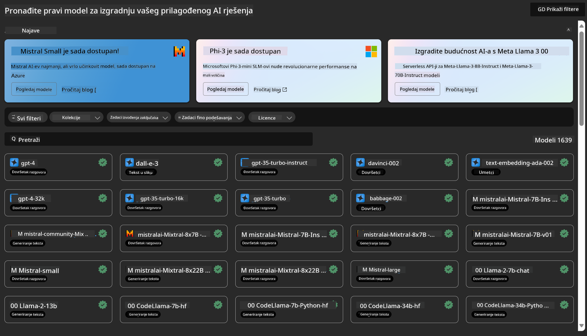
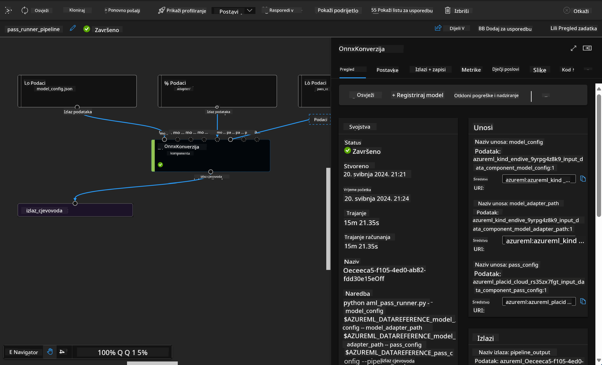

<!--
CO_OP_TRANSLATOR_METADATA:
{
  "original_hash": "7fe541373802e33568e94e13226d463c",
  "translation_date": "2025-05-09T22:24:36+00:00",
  "source_file": "md/03.FineTuning/Introduce_AzureML.md",
  "language_code": "hr"
}
-->
# **Uvod u Azure Machine Learning Service**

[Azure Machine Learning](https://ml.azure.com?WT.mc_id=aiml-138114-kinfeylo) je oblačna usluga za ubrzavanje i upravljanje životnim ciklusom projekata strojnog učenja (ML).

Stručnjaci za ML, znanstvenici za podatke i inženjeri mogu je koristiti u svojim svakodnevnim radnim procesima za:

- Treniranje i implementaciju modela.
- Upravljanje operacijama strojnog učenja (MLOps).
- Možete kreirati model u Azure Machine Learningu ili koristiti model izrađen na open-source platformama kao što su PyTorch, TensorFlow ili scikit-learn.
- MLOps alati pomažu u nadzoru, ponovnom treniranju i ponovnoj implementaciji modela.

## Za koga je Azure Machine Learning?

**Znanstvenici za podatke i ML inženjeri**

Mogu koristiti alate za ubrzavanje i automatizaciju svojih svakodnevnih zadataka.
Azure ML pruža funkcije za pravednost, objašnjivost, praćenje i reviziju.

**Razvojni programeri**

Mogu jednostavno integrirati modele u aplikacije ili usluge.

**Platformski programeri**

Imaju pristup snažnom skupu alata podržanih pouzdanim Azure Resource Manager API-jima.
Ti alati omogućuju izgradnju naprednih ML alata.

**Poduzeća**

Rad u Microsoft Azure oblaku donosi poznate sigurnosne mjere i kontrolu pristupa temeljen na ulogama.
Postavite projekte za kontrolu pristupa zaštićenim podacima i određenim operacijama.

## Produktivnost za cijeli tim
ML projekti često zahtijevaju tim s različitim vještinama za izgradnju i održavanje.

Azure ML nudi alate koji vam omogućuju:
- Suradnju s timom putem zajedničkih bilježnica, računalnih resursa, serverless računalstva, podataka i okruženja.
- Razvijanje modela s fokusom na pravednost, objašnjivost, praćenje i reviziju kako bi se ispunili zahtjevi za porijeklom i usklađenošću.
- Brzu i jednostavnu implementaciju ML modela u velikom opsegu te učinkovito upravljanje i nadzor putem MLOps.
- Pokretanje ML zadataka bilo gdje uz ugrađene mogućnosti upravljanja, sigurnosti i usklađenosti.

## Alati kompatibilni na različitim platformama

Svatko u ML timu može koristiti svoje omiljene alate za obavljanje posla.
Bilo da radite brze eksperimente, podešavate hiperparametre, gradite pipelineove ili upravljate inferencama, možete koristiti poznata sučelja kao što su:
- Azure Machine Learning Studio
- Python SDK (v2)
- Azure CLI (v2)
- Azure Resource Manager REST API

Kako usavršavate modele i surađujete tijekom razvojnog ciklusa, možete dijeliti i pronalaziti resurse, imovinu i metrike unutar sučelja Azure Machine Learning studija.

## **LLM/SLM u Azure ML**

Azure ML je dodao mnoge funkcije povezane s LLM/SLM, kombinirajući LLMOps i SLMOps za stvaranje tehnološke platforme generativne umjetne inteligencije na razini poduzeća.

### **Katalog modela**

Korisnici u poduzećima mogu implementirati različite modele prema različitim poslovnim scenarijima putem Model Catalog, te nuditi usluge kao Model as Service za programere ili korisnike u poduzeću.

Katalog modela u Azure Machine Learning studiju je središte za otkrivanje i korištenje širokog spektra modela koji vam omogućuju izgradnju Generative AI aplikacija. Katalog modela sadrži stotine modela različitih pružatelja usluga kao što su Azure OpenAI service, Mistral, Meta, Cohere, Nvidia, Hugging Face, uključujući i modele koje je trenirao Microsoft. Modeli od pružatelja osim Microsofta su Non-Microsoft Products, kako je definirano u Microsoftovim Uvjetima proizvoda, i podliježu uvjetima pruženim s modelom.

### **Pipeline poslova**

Srž ML pipelinea je podijeliti cjelokupni zadatak strojnog učenja u višestupanjski radni tijek. Svaki korak je upravljiva komponenta koja se može razvijati, optimizirati, konfigurirati i automatizirati pojedinačno. Koraci su povezani putem dobro definiranih sučelja. Azure Machine Learning pipeline servis automatski orkestrira sve ovisnosti između koraka pipelinea.

Kod finog podešavanja SLM / LLM možemo upravljati našim podacima, treniranjem i generiranjem putem Pipelinea.

### **Prompt flow**

Prednosti korištenja Azure Machine Learning prompt flowa  
Azure Machine Learning prompt flow nudi niz prednosti koje pomažu korisnicima da prijeđu od ideje do eksperimentiranja, a na kraju do aplikacija spremnih za produkciju temeljene na LLM-u:

**Agilnost u prompt inženjerstvu**

Interaktivno iskustvo pisanja: Azure Machine Learning prompt flow pruža vizualni prikaz strukture toka, što korisnicima omogućuje lako razumijevanje i navigaciju kroz projekte. Također nudi iskustvo kodiranja slično bilježnici za učinkoviti razvoj i otklanjanje pogrešaka toka.  
Varijante za podešavanje prompta: Korisnici mogu kreirati i uspoređivati više varijanti prompta, olakšavajući iterativni proces usavršavanja.

Evaluacija: Ugrađeni evaluacijski tokovi omogućuju korisnicima procjenu kvalitete i učinkovitosti njihovih promptova i tokova.

Sveobuhvatni resursi: Azure Machine Learning prompt flow uključuje biblioteku ugrađenih alata, primjera i predložaka koji služe kao polazna točka za razvoj, potiču kreativnost i ubrzavaju proces.

**Spremnost za poduzeća za aplikacije temeljene na LLM-u**

Suradnja: Azure Machine Learning prompt flow podržava timsku suradnju, omogućujući više korisnika da rade zajedno na projektima prompt inženjerstva, dijele znanje i održavaju kontrolu verzija.

Sve-u-jednom platforma: Azure Machine Learning prompt flow pojednostavljuje cijeli proces prompt inženjerstva, od razvoja i evaluacije do implementacije i nadzora. Korisnici mogu lako implementirati svoje tokove kao Azure Machine Learning endpointove i pratiti njihovu izvedbu u stvarnom vremenu, osiguravajući optimalan rad i kontinuirano poboljšanje.

Azure Machine Learning Enterprise Readiness Solutions: Prompt flow koristi robusna rješenja za spremnost poduzeća iz Azure Machine Learninga, pružajući sigurnu, skalabilnu i pouzdanu osnovu za razvoj, eksperimentiranje i implementaciju tokova.

Uz Azure Machine Learning prompt flow, korisnici mogu osloboditi svoju agilnost u prompt inženjerstvu, učinkovito surađivati i koristiti rješenja razine poduzeća za uspješan razvoj i implementaciju aplikacija temeljenih na LLM-u.

Kombinirajući računalnu snagu, podatke i različite komponente Azure ML-a, programeri u poduzećima mogu jednostavno izgraditi vlastite aplikacije umjetne inteligencije.

**Odricanje od odgovornosti**:  
Ovaj je dokument preveden korištenjem AI usluge za prijevod [Co-op Translator](https://github.com/Azure/co-op-translator). Iako težimo točnosti, imajte na umu da automatski prijevodi mogu sadržavati pogreške ili netočnosti. Izvorni dokument na izvornom jeziku treba smatrati autoritativnim izvorom. Za kritične informacije preporučuje se profesionalni ljudski prijevod. Ne snosimo odgovornost za bilo kakva nesporazumevanja ili pogrešna tumačenja koja proizlaze iz korištenja ovog prijevoda.