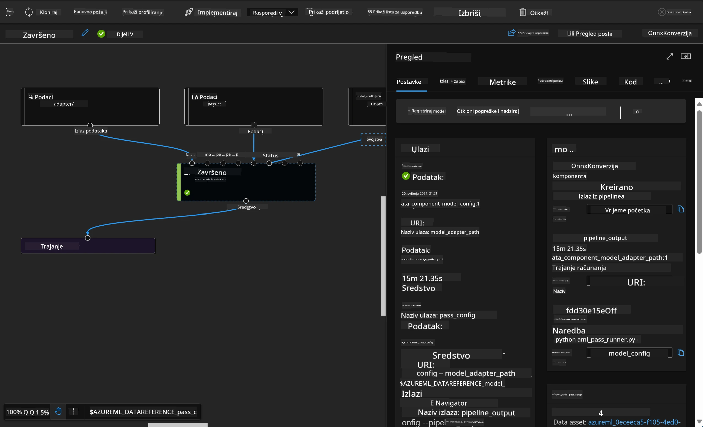

<!--
CO_OP_TRANSLATOR_METADATA:
{
  "original_hash": "7fe541373802e33568e94e13226d463c",
  "translation_date": "2025-07-17T09:48:58+00:00",
  "source_file": "md/03.FineTuning/Introduce_AzureML.md",
  "language_code": "hr"
}
-->
# **Uvod u Azure Machine Learning Service**

[Azure Machine Learning](https://ml.azure.com?WT.mc_id=aiml-138114-kinfeylo) je cloud usluga za ubrzavanje i upravljanje životnim ciklusom projekata strojnog učenja (ML).

ML stručnjaci, data znanstvenici i inženjeri mogu je koristiti u svojim svakodnevnim radnim procesima za:

- Treniranje i implementaciju modela.
- Upravljanje operacijama strojnog učenja (MLOps).
- Možete kreirati model u Azure Machine Learningu ili koristiti model izgrađen na open-source platformama poput PyTorcha, TensorFlowa ili scikit-learn.
- MLOps alati pomažu u praćenju, ponovnom treniranju i ponovnoj implementaciji modela.

## Za koga je Azure Machine Learning?

**Data znanstvenici i ML inženjeri**

Mogu koristiti alate za ubrzavanje i automatizaciju svojih svakodnevnih zadataka.  
Azure ML nudi značajke za pravednost, objašnjivost, praćenje i reviziju.

**Razvojni programeri**

Mogu jednostavno integrirati modele u aplikacije ili usluge.

**Platformski programeri**

Imaju pristup snažnom skupu alata podržanih pouzdanim Azure Resource Manager API-jima.  
Ti alati omogućuju izgradnju naprednih ML alata.

**Poduzeća**

Radeći u Microsoft Azure cloudu, poduzeća imaju koristi od poznate sigurnosti i kontrole pristupa temeljenog na ulogama.  
Mogu postaviti projekte za kontrolu pristupa zaštićenim podacima i određenim operacijama.

## Produktivnost za cijeli tim  
ML projekti često zahtijevaju tim s različitim vještinama za izgradnju i održavanje.

Azure ML pruža alate koji vam omogućuju:  
- Suradnju s timom putem zajedničkih bilježnica, računalnih resursa, serverless računalstva, podataka i okruženja.  
- Razvijanje modela s naglaskom na pravednost, objašnjivost, praćenje i reviziju kako bi se ispunili zahtjevi za podrijetlom i usklađenošću.  
- Brzu i jednostavnu implementaciju ML modela u velikom opsegu te učinkovito upravljanje i nadzor pomoću MLOps.  
- Pokretanje strojnog učenja bilo gdje uz ugrađenu upravu, sigurnost i usklađenost.

## Alati platforme kompatibilni s različitim okruženjima

Svaki član ML tima može koristiti svoje omiljene alate za obavljanje zadataka.  
Bilo da provodite brze eksperimente, podešavate hiperparametre, gradite pipelineove ili upravljate inferencama, možete koristiti poznata sučelja kao što su:  
- Azure Machine Learning Studio  
- Python SDK (v2)  
- Azure CLI (v2)  
- Azure Resource Manager REST API-ji

Kako usavršavate modele i surađujete tijekom razvojnog ciklusa, možete dijeliti i pronalaziti resurse, imovinu i metrike unutar sučelja Azure Machine Learning studija.

## **LLM/SLM u Azure ML**

Azure ML je dodao mnoge funkcije vezane uz LLM/SLM, spajajući LLMOps i SLMOps u jedinstvenu platformu generativne umjetne inteligencije za cijelo poduzeće.

### **Katalog modela**

Korisnici u poduzećima mogu implementirati različite modele prema različitim poslovnim scenarijima putem Kataloga modela, te pružati usluge kao Model kao uslugu (Model as Service) za pristup programerima ili korisnicima u poduzeću.

Katalog modela u Azure Machine Learning studiju je središte za otkrivanje i korištenje širokog spektra modela koji vam omogućuju izgradnju Generativnih AI aplikacija. Katalog modela sadrži stotine modela od različitih pružatelja poput Azure OpenAI servisa, Mistrala, Mete, Coherea, Nvidije, Hugging Facea, uključujući modele koje je trenirao Microsoft. Modeli od pružatelja osim Microsofta su proizvodi ne-Microsoft tvrtki, kako je definirano u Microsoftovim Uvjetima proizvoda, i podliježu uvjetima koji dolaze s modelom.

### **Job Pipeline**

Srž pipelinea strojnog učenja je podjela kompletnog zadatka strojnog učenja u višestupanjski radni tijek. Svaki korak je upravljiva komponenta koja se može zasebno razvijati, optimizirati, konfigurirati i automatizirati. Koraci su povezani jasno definiranim sučeljima. Azure Machine Learning pipeline servis automatski orkestrira sve ovisnosti između koraka pipelinea.

Kod fino podešavanja SLM / LLM, možemo upravljati našim podacima, treniranjem i procesima generiranja kroz Pipeline.

### **Prompt flow**

Prednosti korištenja Azure Machine Learning prompt flowa  
Azure Machine Learning prompt flow nudi niz prednosti koje pomažu korisnicima da prijeđu od ideje do eksperimentiranja i na kraju do produkcijski spremnih LLM aplikacija:

**Agilnost u prompt inženjeringu**

Interaktivno iskustvo pisanja: Azure Machine Learning prompt flow pruža vizualni prikaz strukture toka, što korisnicima olakšava razumijevanje i navigaciju kroz projekte. Također nudi iskustvo pisanja koda slično bilježnici za učinkoviti razvoj i ispravljanje toka.  
Varijante za podešavanje prompta: Korisnici mogu kreirati i uspoređivati više varijanti prompta, što olakšava iterativni proces usavršavanja.

Evaluacija: Ugrađeni evaluacijski tokovi omogućuju korisnicima procjenu kvalitete i učinkovitosti njihovih promptova i tokova.

Sveobuhvatni resursi: Azure Machine Learning prompt flow uključuje biblioteku ugrađenih alata, primjera i predložaka koji služe kao polazna točka za razvoj, potiču kreativnost i ubrzavaju proces.

**Spremnost za poduzeća u LLM aplikacijama**

Suradnja: Azure Machine Learning prompt flow podržava timsku suradnju, omogućujući više korisnika da zajedno rade na projektima prompt inženjeringa, dijele znanje i održavaju kontrolu verzija.

Sve-u-jednom platforma: Azure Machine Learning prompt flow pojednostavljuje cijeli proces prompt inženjeringa, od razvoja i evaluacije do implementacije i nadzora. Korisnici mogu lako implementirati svoje tokove kao Azure Machine Learning endpointove i pratiti njihovu izvedbu u stvarnom vremenu, osiguravajući optimalan rad i kontinuirano poboljšanje.

Azure Machine Learning Enterprise Readiness Solutions: Prompt flow koristi snažne enterprise readiness značajke Azure Machine Learninga, pružajući sigurnu, skalabilnu i pouzdanu osnovu za razvoj, eksperimentiranje i implementaciju tokova.

Uz Azure Machine Learning prompt flow, korisnici mogu osloboditi svoju agilnost u prompt inženjeringu, učinkovito surađivati i koristiti enterprise-grade rješenja za uspješan razvoj i implementaciju LLM aplikacija.

Kombinirajući računalnu snagu, podatke i različite komponente Azure ML-a, programeri u poduzećima lako mogu izgraditi vlastite aplikacije umjetne inteligencije.

**Odricanje od odgovornosti**:  
Ovaj dokument je preveden korištenjem AI usluge za prevođenje [Co-op Translator](https://github.com/Azure/co-op-translator). Iako težimo točnosti, imajte na umu da automatski prijevodi mogu sadržavati pogreške ili netočnosti. Izvorni dokument na izvornom jeziku treba smatrati službenim i autoritativnim izvorom. Za kritične informacije preporučuje se profesionalni ljudski prijevod. Ne snosimo odgovornost za bilo kakva nesporazuma ili pogrešna tumačenja koja proizlaze iz korištenja ovog prijevoda.