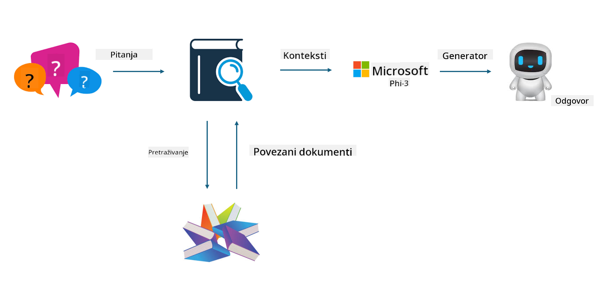

<!--
CO_OP_TRANSLATOR_METADATA:
{
  "original_hash": "743d7e9cb9c4e8ea642d77bee657a7fa",
  "translation_date": "2025-07-17T10:01:43+00:00",
  "source_file": "md/03.FineTuning/LetPhi3gotoIndustriy.md",
  "language_code": "hr"
}
-->
# **Neka Phi-3 postane stručnjak za industriju**

Da biste model Phi-3 primijenili u nekoj industriji, potrebno je dodati poslovne podatke te industrije u Phi-3 model. Imamo dvije različite opcije: prva je RAG (Retrieval Augmented Generation), a druga je Fine Tuning.

## **RAG vs Fine-Tuning**

### **Retrieval Augmented Generation**

RAG je kombinacija dohvaćanja podataka i generiranja teksta. Strukturirani i nestrukturirani podaci poduzeća pohranjuju se u vektorsku bazu podataka. Prilikom pretraživanja relevantnog sadržaja pronalazi se sažetak i sadržaj koji tvore kontekst, a zatim se koristi sposobnost dovršetka teksta LLM/SLM modela za generiranje sadržaja.

### **Fine-tuning**

Fine-tuning se temelji na poboljšanju određenog modela. Nije potrebno započinjati s algoritmom modela, ali podaci se moraju kontinuirano prikupljati. Ako želite precizniju terminologiju i izražavanje u industrijskim primjenama, fine-tuning je bolji izbor. No, ako se vaši podaci često mijenjaju, fine-tuning može postati složen.

### **Kako odabrati**

1. Ako naš odgovor zahtijeva uvođenje vanjskih podataka, RAG je najbolji izbor

2. Ako trebate stabilno i precizno znanje iz industrije, fine-tuning će biti dobar izbor. RAG daje prioritet pronalaženju relevantnog sadržaja, ali možda neće uvijek uhvatiti specifične nijanse.

3. Fine-tuning zahtijeva kvalitetan skup podataka, a ako je riječ o malom opsegu podataka, neće donijeti značajnu razliku. RAG je fleksibilniji.

4. Fine-tuning je crna kutija, metafizika, i teško je razumjeti njegov unutarnji mehanizam. RAG pak olakšava pronalazak izvora podataka, čime se učinkovito mogu ispraviti halucinacije ili pogreške u sadržaju te pruža veću transparentnost.

### **Scenariji**

1. Vertikalne industrije koje zahtijevaju specifičnu stručnu terminologiju i izraze, ***Fine-tuning*** je najbolji izbor

2. QA sustavi koji uključuju sintezu različitih znanja, ***RAG*** je najbolji izbor

3. Kombinacija automatiziranih poslovnih procesa ***RAG + Fine-tuning*** je najbolji izbor

## **Kako koristiti RAG**

Vektorska baza podataka je skup podataka pohranjenih u matematičkom obliku. Vektorske baze podataka olakšavaju modelima strojnog učenja pamćenje prethodnih unosa, omogućujući njihovu primjenu u slučajevima poput pretraživanja, preporuka i generiranja teksta. Podaci se mogu identificirati na temelju mjera sličnosti, a ne točnih podudaranja, što omogućuje računalnim modelima razumijevanje konteksta podataka.

Vektorska baza podataka je ključ za realizaciju RAG-a. Podatke možemo pretvoriti u vektorski oblik pomoću vektorskih modela poput text-embedding-3, jina-ai-embedding i slično.

Saznajte više o stvaranju RAG aplikacije [https://github.com/microsoft/Phi-3CookBook](https://github.com/microsoft/Phi-3CookBook?WT.mc_id=aiml-138114-kinfeylo)

## **Kako koristiti Fine-tuning**

Najčešće korišteni algoritmi u Fine-tuningu su Lora i QLora. Kako odabrati?
- [Saznajte više uz ovaj primjer bilježnice](../../../../code/04.Finetuning/Phi_3_Inference_Finetuning.ipynb)
- [Primjer Python FineTuning uzorka](../../../../code/04.Finetuning/FineTrainingScript.py)

### **Lora i QLora**

LoRA (Low-Rank Adaptation) i QLoRA (Quantized Low-Rank Adaptation) su tehnike za fino podešavanje velikih jezičnih modela (LLM) koristeći Parameter Efficient Fine Tuning (PEFT). PEFT tehnike su dizajnirane za učinkovitije treniranje modela u odnosu na tradicionalne metode.  
LoRA je samostalna tehnika fine-tuninga koja smanjuje memorijski otisak primjenom niskorazredne aproksimacije na matricu ažuriranja težina. Nudi brze treninge i održava performanse blizu tradicionalnim metodama fine-tuninga.

QLoRA je proširena verzija LoRA-e koja uključuje kvantizacijske tehnike za dodatno smanjenje memorijske potrošnje. QLoRA kvantizira preciznost parametara težina u prethodno treniranom LLM-u na 4-bitnu preciznost, što je memorijski učinkovitije od LoRA-e. Međutim, treniranje QLoRA-om je oko 30% sporije od LoRA-e zbog dodatnih koraka kvantizacije i dekvantizacije.

QLoRA koristi LoRA kao dodatak za ispravljanje pogrešaka nastalih tijekom kvantizacije. QLoRA omogućuje fino podešavanje masivnih modela s milijardama parametara na relativno malim, lako dostupnim GPU-ima. Na primjer, QLoRA može fino podesiti model s 70 milijardi parametara koji inače zahtijeva 36 GPU-a, koristeći samo 2...

**Odricanje od odgovornosti**:  
Ovaj dokument je preveden korištenjem AI usluge za prevođenje [Co-op Translator](https://github.com/Azure/co-op-translator). Iako nastojimo postići točnost, imajte na umu da automatski prijevodi mogu sadržavati pogreške ili netočnosti. Izvorni dokument na izvornom jeziku treba smatrati autoritativnim izvorom. Za kritične informacije preporučuje se profesionalni ljudski prijevod. Ne snosimo odgovornost za bilo kakve nesporazume ili pogrešna tumačenja koja proizlaze iz korištenja ovog prijevoda.