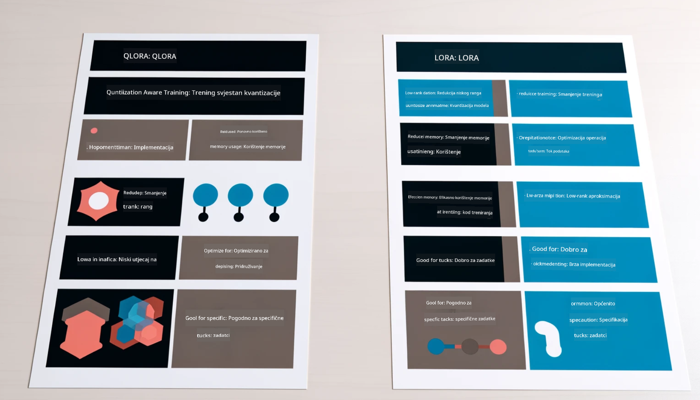

<!--
CO_OP_TRANSLATOR_METADATA:
{
  "original_hash": "743d7e9cb9c4e8ea642d77bee657a7fa",
  "translation_date": "2025-05-09T22:30:17+00:00",
  "source_file": "md/03.FineTuning/LetPhi3gotoIndustriy.md",
  "language_code": "hr"
}
-->
# **Neka Phi-3 postane stručnjak za industriju**

Da biste model Phi-3 primijenili u industriji, potrebno je dodati poslovne podatke iz industrije u model Phi-3. Imamo dvije različite opcije, prva je RAG (Retrieval Augmented Generation), a druga Fine Tuning.

## **RAG vs Fine-Tuning**

### **Retrieval Augmented Generation**

RAG je dohvat podataka + generiranje teksta. Strukturirani i nestrukturirani podaci poduzeća pohranjeni su u vektorsku bazu podataka. Prilikom pretraživanja relevantnog sadržaja pronalazi se sažetak i sadržaj koji čine kontekst, a zatim se kombinira sposobnost dopunjavanja teksta LLM/SLM za generiranje sadržaja.

### **Fine-tuning**

Fine-tuning se temelji na poboljšanju određenog modela. Nije potrebno započinjati s algoritmom modela, ali podaci se moraju kontinuirano prikupljati. Ako želite precizniju terminologiju i jezični izraz u industrijskim primjenama, fine-tuning je bolji izbor. Međutim, ako se vaši podaci često mijenjaju, fine-tuning može postati kompliciran.

### **Kako odabrati**

1. Ako naš odgovor zahtijeva uvođenje vanjskih podataka, RAG je najbolji izbor

2. Ako trebate stabilno i precizno izlaganje industrijskog znanja, fine-tuning će biti dobar izbor. RAG daje prioritet pronalaženju relevantnog sadržaja, ali možda neće uvijek uhvatiti specijalizirane nijanse.

3. Fine-tuning zahtijeva kvalitetan skup podataka, a ako je riječ o malom opsegu podataka, neće napraviti veliku razliku. RAG je fleksibilniji.

4. Fine-tuning je crna kutija, metafizika, i teško je razumjeti unutarnji mehanizam. Ali RAG olakšava pronalaženje izvora podataka, čime se učinkovito mogu ispraviti halucinacije ili pogreške u sadržaju te pružiti bolja transparentnost.

### **Scenariji**

1. Vertikalne industrije koje zahtijevaju specifičnu stručnu terminologiju i izraze, ***Fine-tuning*** je najbolji izbor

2. QA sustav, koji uključuje sintezu različitih znanja, ***RAG*** je najbolji izbor

3. Kombinacija automatiziranog poslovnog toka ***RAG + Fine-tuning*** je najbolji izbor

## **Kako koristiti RAG**

Vektorska baza podataka je skup podataka pohranjenih u matematičkom obliku. Vektorske baze podataka olakšavaju modelima strojnog učenja pamćenje prethodnih unosa, omogućujući primjenu strojnog učenja u slučajevima poput pretraživanja, preporuka i generiranja teksta. Podaci se mogu identificirati na temelju mjera sličnosti, a ne točnih podudarnosti, što računalnim modelima omogućuje razumijevanje konteksta podataka.

Vektorska baza podataka je ključ za realizaciju RAG-a. Podatke možemo pretvoriti u vektorsku pohranu putem vektorskih modela kao što su text-embedding-3, jina-ai-embedding i sl.

Saznajte više o kreiranju RAG aplikacije [https://github.com/microsoft/Phi-3CookBook](https://github.com/microsoft/Phi-3CookBook?WT.mc_id=aiml-138114-kinfeylo) 

## **Kako koristiti Fine-tuning**

Uobičajeni algoritmi u Fine-tuningu su Lora i QLora. Kako odabrati?
- [Saznajte više u ovom uzorku bilježnice](../../../../code/04.Finetuning/Phi_3_Inference_Finetuning.ipynb)
- [Primjer Python FineTuning uzorka](../../../../code/04.Finetuning/FineTrainingScript.py)

### **Lora i QLora**

LoRA (Low-Rank Adaptation) i QLoRA (Quantized Low-Rank Adaptation) su tehnike za fino podešavanje velikih jezičnih modela (LLM) korištenjem Parameter Efficient Fine Tuning (PEFT). PEFT tehnike dizajnirane su za učinkovitije treniranje modela u odnosu na tradicionalne metode.

LoRA je samostalna tehnika fino podešavanja koja smanjuje memorijski otisak primjenom aproksimacije niskog ranga na matricu ažuriranja težina. Nudi brza vremena treniranja i održava performanse blizu tradicionalnim metodama fino podešavanja.

QLoRA je proširena verzija LoRA-e koja uključuje kvantizacijske tehnike za dodatno smanjenje memorijske potrošnje. QLoRA kvantizira preciznost parametara težina unaprijed treniranog LLM-a na 4-bitnu preciznost, što je memorijski učinkovitije od LoRA-e. Međutim, treniranje QLoRA-om je otprilike 30% sporije od LoRA-e zbog dodatnih koraka kvantizacije i dekvantizacije.

QLoRA koristi LoRA-u kao dodatak za ispravljanje pogrešaka uvedenih tijekom kvantizacije. QLoRA omogućuje fino podešavanje masivnih modela s milijardama parametara na relativno malim, lako dostupnim GPU-ima. Na primjer, QLoRA može fino podesiti model s 70B parametara koji inače zahtijeva 36 GPU-a, koristeći samo 2.

**Odricanje od odgovornosti**:  
Ovaj dokument preveden je pomoću AI prevoditeljskog servisa [Co-op Translator](https://github.com/Azure/co-op-translator). Iako nastojimo postići točnost, imajte na umu da automatski prijevodi mogu sadržavati pogreške ili netočnosti. Izvorni dokument na izvornom jeziku treba smatrati službenim i autoritativnim izvorom. Za kritične informacije preporučuje se profesionalni ljudski prijevod. Ne snosimo odgovornost za bilo kakva nesporazuma ili kriva tumačenja koja proizlaze iz korištenja ovog prijevoda.