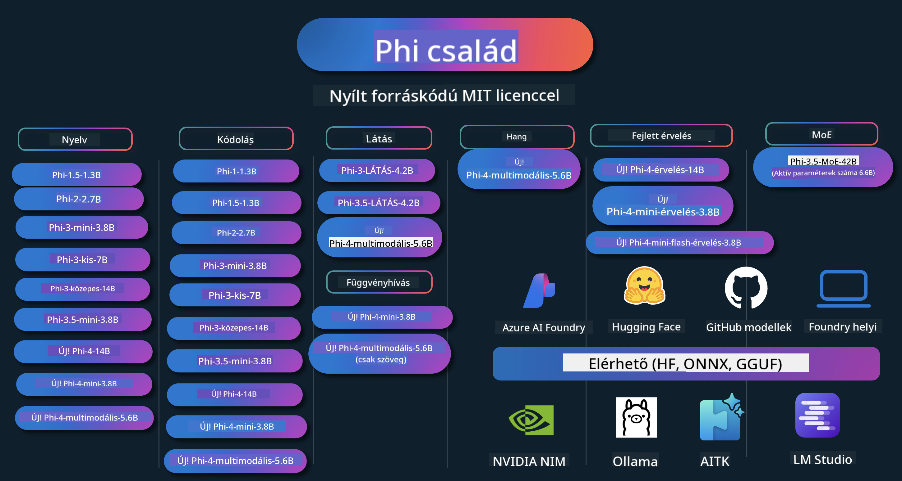

<!--
CO_OP_TRANSLATOR_METADATA:
{
  "original_hash": "5c07bb4c3c89a36c9be332a065a9a33c",
  "translation_date": "2025-07-16T15:27:10+00:00",
  "source_file": "README.md",
  "language_code": "hu"
}
-->
# Phi Cookbook: Gyakorlati példák a Microsoft Phi modelljeivel

  

  
  
  

  
  

A Phi a Microsoft által fejlesztett nyílt forráskódú AI modellek sorozata.

Jelenleg a Phi a legerősebb és legköltséghatékonyabb kis nyelvi modell (SLM), amely kiváló eredményeket ér el többnyelvűség, érvelés, szöveg-/csevegés-generálás, kódolás, képek, hang és egyéb felhasználási területeken.

A Phi-t telepítheted felhőbe vagy élő eszközökre, és könnyedén építhetsz generatív AI alkalmazásokat korlátozott számítási kapacitással is.

Kövesd az alábbi lépéseket, hogy elkezdd használni ezt az erőforrást:  
1. **Forkold a tárolót**: Kattints   
2. **Klónozd a tárolót**: `git clone https://github.com/microsoft/PhiCookBook.git`  
3. [**Csatlakozz a Microsoft AI Discord közösséghez, és ismerkedj meg szakértőkkel és fejlesztőtársakkal**](https://discord.com/invite/ByRwuEEgH4?WT.mc_id=aiml-137032-kinfeylo)

### 🌐 Többnyelvű támogatás

#### GitHub Action segítségével (Automatikus és mindig naprakész)

[Francia](../fr/README.md) | [Spanyol](../es/README.md) | [Német](../de/README.md) | [Orosz](../ru/README.md) | [Arab](../ar/README.md) | [Perzsa (Fárszi)](../fa/README.md) | [Urdu](../ur/README.md) | [Kínai (egyszerűsített)](../zh/README.md) | [Kínai (hagyományos, Makaó)](../mo/README.md) | [Kínai (hagyományos, Hongkong)](../hk/README.md) | [Kínai (hagyományos, Tajvan)](../tw/README.md) | [Japán](../ja/README.md) | [Koreai](../ko/README.md) | [Hindi](../hi/README.md)  
[Bengáli](../bn/README.md) | [Marathi](../mr/README.md) | [Nepáli](../ne/README.md) | [Pandzsábi (Gurmukhi)](../pa/README.md) | [Portugál (Portugália)](../pt/README.md) | [Portugál (Brazília)](../br/README.md) | [Olasz](../it/README.md) | [Lengyel](../pl/README.md) | [Török](../tr/README.md) | [Görög](../el/README.md) | [Thai](../th/README.md) | [Svéd](../sv/README.md) | [Dán](../da/README.md) | [Norvég](../no/README.md) | [Finn](../fi/README.md) | [Holland](../nl/README.md) | [Héber](../he/README.md) | [Vietnami](../vi/README.md) | [Indonéz](../id/README.md) | [Maláj](../ms/README.md) | [Tagalog (Filippínó)](../tl/README.md) | [Szuahéli](../sw/README.md) | [Magyar](./README.md) | [Cseh](../cs/README.md) | [Szlovák](../sk/README.md) | [Román](../ro/README.md) | [Bolgár](../bg/README.md) | [Szerb (cirill)](../sr/README.md) | [Horvát](../hr/README.md) | [Szlovén](../sl/README.md)

## Tartalomjegyzék

- Bevezetés  
  - [Üdvözlünk a Phi családban](./md/01.Introduction/01/01.PhiFamily.md)  
  - [Környezet beállítása](./md/01.Introduction/01/01.EnvironmentSetup.md)  
  - [Kulcsfontosságú technológiák megértése](./md/01.Introduction/01/01.Understandingtech.md)  
  - [AI biztonság a Phi modellekhez](./md/01.Introduction/01/01.AISafety.md)  
  - [Phi hardvertámogatás](./md/01.Introduction/01/01.Hardwaresupport.md)  
  - [Phi modellek és elérhetőség különböző platformokon](./md/01.Introduction/01/01.Edgeandcloud.md)  
  - [Guidance-ai és Phi használata](./md/01.Introduction/01/01.Guidance.md)  
  - [GitHub Marketplace modellek](https://github.com/marketplace/models)  
  - [Azure AI modell katalógus](https://ai.azure.com)

- Phi inferencia különböző környezetekben  
    -  [Hugging face](./md/01.Introduction/02/01.HF.md)  
    -  [GitHub modellek](./md/01.Introduction/02/02.GitHubModel.md)  
    -  [Azure AI Foundry modell katalógus](./md/01.Introduction/02/03.AzureAIFoundry.md)  
    -  [Ollama](./md/01.Introduction/02/04.Ollama.md)  
    -  [AI Toolkit VSCode (AITK)](./md/01.Introduction/02/05.AITK.md)  
    -  [NVIDIA NIM](./md/01.Introduction/02/06.NVIDIA.md)  
    -  [Foundry Local](./md/01.Introduction/02/07.FoundryLocal.md)

- Phi család inferenciája  
    - [Phi inferencia iOS-en](./md/01.Introduction/03/iOS_Inference.md)  
    - [Phi inferencia Androidon](./md/01.Introduction/03/Android_Inference.md)  
    - [Phi inferencia Jetsonon](./md/01.Introduction/03/Jetson_Inference.md)  
    - [Phi inferencia AI PC-n](./md/01.Introduction/03/AIPC_Inference.md)  
    - [Phi inferencia Apple MLX keretrendszerrel](./md/01.Introduction/03/MLX_Inference.md)  
    - [Phi inferencia helyi szerveren](./md/01.Introduction/03/Local_Server_Inference.md)  
    - [Phi inferencia távoli szerveren AI Toolkit használatával](./md/01.Introduction/03/Remote_Interence.md)  
    - [Phi inferencia Rust-tal](./md/01.Introduction/03/Rust_Inference.md)  
    - [Phi inferencia – Vision helyben](./md/01.Introduction/03/Vision_Inference.md)  
    - [Phi inferencia Kaito AKS, Azure konténerekkel (hivatalos támogatás)](./md/01.Introduction/03/Kaito_Inference.md)  
-  [Phi család kvantálása](./md/01.Introduction/04/QuantifyingPhi.md)  
    - [Phi-3.5 / 4 kvantálása llama.cpp-vel](./md/01.Introduction/04/UsingLlamacppQuantifyingPhi.md)  
    - [Phi-3.5 / 4 kvantálása Generative AI kiterjesztésekkel onnxruntime-hoz](./md/01.Introduction/04/UsingORTGenAIQuantifyingPhi.md)  
    - [Phi-3.5 / 4 kvantálása Intel OpenVINO-val](./md/01.Introduction/04/UsingIntelOpenVINOQuantifyingPhi.md)  
    - [Phi-3.5 / 4 kvantálása Apple MLX keretrendszerrel](./md/01.Introduction/04/UsingAppleMLXQuantifyingPhi.md)

- Phi értékelése  
    - [Felelős AI](./md/01.Introduction/05/ResponsibleAI.md)  
    - [Azure AI Foundry az értékeléshez](./md/01.Introduction/05/AIFoundry.md)  
    - [Promptflow használata az értékeléshez](./md/01.Introduction/05/Promptflow.md)

- RAG Azure AI Search-sel  
    - [Hogyan használd a Phi-4-mini és Phi-4-multimodal (RAG) modelleket Azure AI Search-csel](https://github.com/microsoft/PhiCookBook/blob/main/code/06.E2E/E2E_Phi-4-RAG-Azure-AI-Search.ipynb)

- Phi alkalmazásfejlesztési példák  
  - Szöveg- és csevegőalkalmazások  
    - Phi-4 példák 🆕  
      - [📓] [Csevegj a Phi-4-mini ONNX modellel](./md/02.Application/01.TextAndChat/Phi4/ChatWithPhi4ONNX/README.md)  
      - [Csevegés Phi-4 helyi ONNX modellel .NET-ben](../../md/04.HOL/dotnet/src/LabsPhi4-Chat-01OnnxRuntime)  
      - [Csevegő .NET konzolalkalmazás Phi-4 ONNX-szel, Sementic Kernel használatával](../../md/04.HOL/dotnet/src/LabsPhi4-Chat-02SK)  
    - Phi-3 / 3.5 példák  
      - [Helyi chatbot böngészőben Phi3, ONNX Runtime Web és WebGPU használatával](https://github.com/microsoft/onnxruntime-inference-examples/tree/main/js/chat)  
      - [OpenVino csevegő](./md/02.Application/01.TextAndChat/Phi3/E2E_OpenVino_Chat.md)  
      - [Több modell – Interaktív Phi-3-mini és OpenAI Whisper](./md/02.Application/01.TextAndChat/Phi3/E2E_Phi-3-mini_with_whisper.md)  
      - [MLFlow – Wrapper készítése és Phi-3 használata MLFlow-val](./md//02.Application/01.TextAndChat/Phi3/E2E_Phi-3-MLflow.md)  
      - [Modelloptimalizálás – Hogyan optimalizáld a Phi-3-mini modellt ONNX Runtime Web-hez Olive segítségével](https://github.com/microsoft/Olive/tree/main/examples/phi3)  
      - [WinUI3 alkalmazás Phi-3 mini-4k-instruct-onnx-szal](https://github.com/microsoft/Phi3-Chat-WinUI3-Sample/)  
      - [WinUI3 Többmodell AI által vezérelt jegyzetalkalmazás példa](https://github.com/microsoft/ai-powered-notes-winui3-sample)
- [Egyedi Phi-3 modellek finomhangolása és integrálása Prompt flow-val](./md/02.Application/01.TextAndChat/Phi3/E2E_Phi-3-FineTuning_PromptFlow_Integration.md)
- [Egyedi Phi-3 modellek finomhangolása és integrálása Prompt flow-val az Azure AI Foundry-ban](./md/02.Application/01.TextAndChat/Phi3/E2E_Phi-3-FineTuning_PromptFlow_Integration_AIFoundry.md)
- [A finomhangolt Phi-3 / Phi-3.5 modell értékelése az Azure AI Foundry-ban, fókuszban a Microsoft felelős MI elveivel](./md/02.Application/01.TextAndChat/Phi3/E2E_Phi-3-Evaluation_AIFoundry.md)
- [📓] [Phi-3.5-mini-instruct nyelvi előrejelző minta (kínai/angol)](../../md/02.Application/01.TextAndChat/Phi3/phi3-instruct-demo.ipynb)
- [Phi-3.5-Instruct WebGPU RAG Chatbot](./md/02.Application/01.TextAndChat/Phi3/WebGPUWithPhi35Readme.md)
- [Windows GPU használata Prompt flow megoldás létrehozásához Phi-3.5-Instruct ONNX-szel](./md/02.Application/01.TextAndChat/Phi3/UsingPromptFlowWithONNX.md)
- [Microsoft Phi-3.5 tflite használata Android alkalmazás készítéséhez](./md/02.Application/01.TextAndChat/Phi3/UsingPhi35TFLiteCreateAndroidApp.md)
- [Kérdések és válaszok .NET példa helyi ONNX Phi-3 modellel a Microsoft.ML.OnnxRuntime használatával](../../md/04.HOL/dotnet/src/LabsPhi301)
- [Konzolos chat .NET alkalmazás Semantic Kernel-lel és Phi-3-mal](../../md/04.HOL/dotnet/src/LabsPhi302)

- Azure AI Inference SDK kód alapú példák  
  - Phi-4 példák 🆕  
    - [📓] [Projektkód generálása Phi-4-multimodal segítségével](./md/02.Application/02.Code/Phi4/GenProjectCode/README.md)  
  - Phi-3 / 3.5 példák  
    - [Saját Visual Studio Code GitHub Copilot Chat építése a Microsoft Phi-3 családdal](./md/02.Application/02.Code/Phi3/VSCodeExt/README.md)  
    - [Saját Visual Studio Code Chat Copilot ügynök létrehozása Phi-3.5-tel GitHub modellek alapján](/md/02.Application/02.Code/Phi3/CreateVSCodeChatAgentWithGitHubModels.md)  

- Fejlett érvelési példák  
  - Phi-4 példák 🆕  
    - [📓] [Phi-4-mini-érvelési vagy Phi-4-érvelési példák](./md/02.Application/03.AdvancedReasoning/Phi4/AdvancedResoningPhi4mini/README.md)  
    - [📓] [Phi-4-mini-érvelés finomhangolása Microsoft Olive-dzsel](../../md/02.Application/03.AdvancedReasoning/Phi4/AdvancedResoningPhi4mini/olive_ft_phi_4_reasoning_with_medicaldata.ipynb)  
    - [📓] [Phi-4-mini-érvelés finomhangolása Apple MLX-szel](../../md/02.Application/03.AdvancedReasoning/Phi4/AdvancedResoningPhi4mini/mlx_ft_phi_4_reasoning_with_medicaldata.ipynb)  
    - [📓] [Phi-4-mini-érvelés GitHub modellekkel](../../md/02.Application/02.Code/Phi4r/github_models_inference.ipynb)  
    - [📓] [Phi-4-mini-érvelés Azure AI Foundry modellekkel](../../md/02.Application/02.Code/Phi4r/azure_models_inference.ipynb)  
- Demók  
    - [Phi-4-mini demók a Hugging Face Spaces-en](https://huggingface.co/spaces/microsoft/phi-4-mini?WT.mc_id=aiml-137032-kinfeylo)  
    - [Phi-4-multimodal demók a Hugging Face Spaces-en](https://huggingface.co/spaces/microsoft/phi-4-multimodal?WT.mc_id=aiml-137032-kinfeylo)  
- Vision példák  
  - Phi-4 példák 🆕  
    - [📓] [Phi-4-multimodal használata képek olvasására és kód generálására](./md/02.Application/04.Vision/Phi4/CreateFrontend/README.md)  
  - Phi-3 / 3.5 példák  
    - [📓][Phi-3-vision - Kép szöveggé alakítása](../../md/02.Application/04.Vision/Phi3/E2E_Phi-3-vision-image-text-to-text-online-endpoint.ipynb)  
    - [Phi-3-vision-ONNX](https://onnxruntime.ai/docs/genai/tutorials/phi3-v.html)  
    - [📓][Phi-3-vision CLIP beágyazás](../../md/02.Application/04.Vision/Phi3/E2E_Phi-3-vision-image-text-to-text-online-endpoint.ipynb)  
    - [DEMO: Phi-3 újrahasznosítás](https://github.com/jennifermarsman/PhiRecycling/)  
    - [Phi-3-vision - Vizualis nyelvi asszisztens Phi3-Vision és OpenVINO használatával](https://docs.openvino.ai/nightly/notebooks/phi-3-vision-with-output.html)  
    - [Phi-3 Vision Nvidia NIM](./md/02.Application/04.Vision/Phi3/E2E_Nvidia_NIM_Vision.md)  
    - [Phi-3 Vision OpenVino](./md/02.Application/04.Vision/Phi3/E2E_OpenVino_Phi3Vision.md)  
    - [📓][Phi-3.5 Vision több képkockás vagy több képes minta](../../md/02.Application/04.Vision/Phi3/phi3-vision-demo.ipynb)  
    - [Phi-3 Vision helyi ONNX modell a Microsoft.ML.OnnxRuntime .NET használatával](../../md/04.HOL/dotnet/src/LabsPhi303)  
    - [Menü alapú Phi-3 Vision helyi ONNX modell a Microsoft.ML.OnnxRuntime .NET használatával](../../md/04.HOL/dotnet/src/LabsPhi304)  

- Matematikai példák  
  - Phi-4-Mini-Flash-Reasoning-Instruct példák 🆕 [Matematikai demo Phi-4-Mini-Flash-Reasoning-Instruct segítségével](../../md/02.Application/09.Math/MathDemo.ipynb)  

- Hang példák  
  - Phi-4 példák 🆕  
    - [📓] [Hangátiratok kinyerése Phi-4-multimodal segítségével](./md/02.Application/05.Audio/Phi4/Transciption/README.md)  
    - [📓] [Phi-4-multimodal hang minta](../../md/02.Application/05.Audio/Phi4/Siri/demo.ipynb)  
    - [📓] [Phi-4-multimodal beszédfordítási minta](../../md/02.Application/05.Audio/Phi4/Translate/demo.ipynb)  
    - [.NET konzolos alkalmazás Phi-4-multimodal hang elemzésére és átírás generálására](../../md/04.HOL/dotnet/src/LabsPhi4-MultiModal-02Audio)  

- MOE példák  
  - Phi-3 / 3.5 példák  
    - [📓] [Phi-3.5 Mixture of Experts modellek (MoEs) közösségi média minta](../../md/02.Application/06.MoE/Phi3/phi3_moe_demo.ipynb)  
    - [📓] [Retrieval-Augmented Generation (RAG) pipeline építése NVIDIA NIM Phi-3 MOE, Azure AI Search és LlamaIndex segítségével](../../md/02.Application/06.MoE/Phi3/azure-ai-search-nvidia-rag.ipynb)  

- Függvényhívás példák  
  - Phi-4 példák 🆕  
    - [📓] [Függvényhívás használata Phi-4-mini-vel](./md/02.Application/07.FunctionCalling/Phi4/FunctionCallingBasic/README.md)  
    - [📓] [Függvényhívás használata több ügynök létrehozásához Phi-4-mini-vel](../../md/02.Application/07.FunctionCalling/Phi4/Multiagents/Phi_4_mini_multiagent.ipynb)  
    - [📓] [Függvényhívás használata Ollama-val](../../md/02.Application/07.FunctionCalling/Phi4/Ollama/ollama_functioncalling.ipynb)  
    - [📓] [Függvényhívás használata ONNX-szel](../../md/02.Application/07.FunctionCalling/Phi4/ONNX/onnx_parallel_functioncalling.ipynb)  

- Multimodális keverési példák  
  - Phi-4 példák 🆕  
    - [📓] [Phi-4-multimodal használata technológiai újságíróként](../../md/02.Application/08.Multimodel/Phi4/TechJournalist/phi_4_mm_audio_text_publish_news.ipynb)  
    - [.NET konzolos alkalmazás Phi-4-multimodal képelemzéshez](../../md/04.HOL/dotnet/src/LabsPhi4-MultiModal-01Images)  

- Phi finomhangolás  
  - [Finomhangolási forgatókönyvek](./md/03.FineTuning/FineTuning_Scenarios.md)  
  - [Finomhangolás vs RAG](./md/03.FineTuning/FineTuning_vs_RAG.md)  
  - [Hagyd, hogy a Phi-3 iparági szakértővé váljon finomhangolással](./md/03.FineTuning/LetPhi3gotoIndustriy.md)  
  - [Phi-3 finomhangolása AI Toolkit for VS Code-dal](./md/03.FineTuning/Finetuning_VSCodeaitoolkit.md)  
  - [Phi-3 finomhangolása Azure Machine Learning Service-szel](./md/03.FineTuning/Introduce_AzureML.md)  
  - [Phi-3 finomhangolása Lora-val](./md/03.FineTuning/FineTuning_Lora.md)  
  - [Phi-3 finomhangolása QLora-val](./md/03.FineTuning/FineTuning_Qlora.md)  
  - [Phi-3 finomhangolása Azure AI Foundry-val](./md/03.FineTuning/FineTuning_AIFoundry.md)  
  - [Phi-3 finomhangolása Azure ML CLI/SDK-val](./md/03.FineTuning/FineTuning_MLSDK.md)  
  - [Finomhangolás Microsoft Olive-dzsel](./md/03.FineTuning/FineTuning_MicrosoftOlive.md)  
  - [Microsoft Olive gyakorlati labor](./md/03.FineTuning/olive-lab/readme.md)  
  - [Phi-3-vision finomhangolása Weights and Bias segítségével](./md/03.FineTuning/FineTuning_Phi-3-visionWandB.md)  
  - [Phi-3 finomhangolása Apple MLX keretrendszerrel](./md/03.FineTuning/FineTuning_MLX.md)  
  - [Phi-3-vision finomhangolása (hivatalos támogatás)](./md/03.FineTuning/FineTuning_Vision.md)  
  - [Phi-3 finomhangolása Kaito AKS, Azure Containers segítségével (hivatalos támogatás)](./md/03.FineTuning/FineTuning_Kaito.md)  
  - [Phi-3 és 3.5 Vision finomhangolása](https://github.com/2U1/Phi3-Vision-Finetune)  

- Gyakorlati labor  
  - [Élvonalbeli modellek felfedezése: LLM-ek, SLM-ek, helyi fejlesztés és még sok más](https://github.com/microsoft/aitour-exploring-cutting-edge-models)  
  - [NLP potenciál kiaknázása: finomhangolás Microsoft Olive-dzsel](https://github.com/azure/Ignite_FineTuning_workshop)  

- Tudományos kutatási cikkek és publikációk  
  - [Textbooks Are All You Need II: phi-1.5 műszaki jelentés](https://arxiv.org/abs/2309.05463)  
  - [Phi-3 műszaki jelentés: Nagyon képzett nyelvi modell helyben a telefonodon](https://arxiv.org/abs/2404.14219)  
  - [Phi-4 műszaki jelentés](https://arxiv.org/abs/2412.08905)  
  - [Phi-4-Mini műszaki jelentés: Kompakt, mégis erőteljes multimodális nyelvi modellek Mixture-of-LoRAs segítségével](https://arxiv.org/abs/2503.01743)  
  - [Kis nyelvi modellek optimalizálása járműben történő függvényhíváshoz](https://arxiv.org/abs/2501.02342)  
  - [(WhyPHI) PHI-3 finomhangolása többválasztós kérdések megválaszolására: módszertan, eredmények és kihívások](https://arxiv.org/abs/2501.01588)
- [Phi-4-reasoning Műszaki Jelentés](https://www.microsoft.com/en-us/research/wp-content/uploads/2025/04/phi_4_reasoning.pdf)  
- [Phi-4-mini-reasoning Műszaki Jelentés](https://huggingface.co/microsoft/Phi-4-mini-reasoning/blob/main/Phi-4-Mini-Reasoning.pdf)

## Phi modellek használata

### Phi az Azure AI Foundry-ban

Megtanulhatod, hogyan használd a Microsoft Phi-t, és hogyan építs végponttól végpontig (E2E) megoldásokat különböző hardvereszközeiden. Ha szeretnéd saját magad kipróbálni a Phi-t, kezdj el játszani a modellekkel, és testreszabni a Phi-t a saját eseteidhez az [Azure AI Foundry Azure AI Model Catalog](https://aka.ms/phi3-azure-ai) segítségével. További információkat találsz a [Azure AI Foundry kezdő lépései](/md/02.QuickStart/AzureAIFoundry_QuickStart.md) dokumentumban.

**Játéktér**  
Minden modellhez tartozik egy dedikált játéktér a modell tesztelésére az [Azure AI Playground](https://aka.ms/try-phi3) oldalon.

### Phi a GitHub modelleken

Megtanulhatod, hogyan használd a Microsoft Phi-t, és hogyan építs végponttól végpontig (E2E) megoldásokat különböző hardvereszközeiden. Ha szeretnéd saját magad kipróbálni a Phi-t, kezdj el játszani a modellel, és testreszabni a Phi-t a saját eseteidhez a [GitHub Model Catalog](https://github.com/marketplace/models?WT.mc_id=aiml-137032-kinfeylo) segítségével. További információkat találsz a [GitHub Model Catalog kezdő lépései](/md/02.QuickStart/GitHubModel_QuickStart.md) dokumentumban.

**Játéktér**  
Minden modellhez tartozik egy dedikált [játéktér a modell tesztelésére](/md/02.QuickStart/GitHubModel_QuickStart.md).

### Phi a Hugging Face-en

A modellt megtalálhatod a [Hugging Face](https://huggingface.co/microsoft) oldalán is.

**Játéktér**  
[Hugging Chat játéktér](https://huggingface.co/chat/models/microsoft/Phi-3-mini-4k-instruct)

## Felelős mesterséges intelligencia

A Microsoft elkötelezett amellett, hogy ügyfeleink felelősségteljesen használják AI termékeinket, megossza tapasztalatait, és bizalmon alapuló partnerségeket építsen olyan eszközök segítségével, mint a Transparency Notes és Impact Assessments. Ezeknek az erőforrásoknak sok megtalálható a [https://aka.ms/RAI](https://aka.ms/RAI) oldalon.  
A Microsoft felelős AI megközelítése az igazságosság, megbízhatóság és biztonság, adatvédelem és biztonság, befogadás, átláthatóság és elszámoltathatóság AI elvein alapul.

A nagyméretű természetes nyelvű, képi és beszédfeldolgozó modellek – mint amilyenek ebben a példában is szerepelnek – potenciálisan igazságtalan, megbízhatatlan vagy sértő módon viselkedhetnek, ami károkat okozhat. Kérjük, tekintsd meg az [Azure OpenAI szolgáltatás Transparency note](https://learn.microsoft.com/legal/cognitive-services/openai/transparency-note?tabs=text) dokumentumot, hogy tájékozódj a kockázatokról és korlátokról.

A kockázatok csökkentésének ajánlott módja, hogy az architektúrádban legyen egy biztonsági rendszer, amely képes felismerni és megelőzni a káros viselkedést. Az [Azure AI Content Safety](https://learn.microsoft.com/azure/ai-services/content-safety/overview) egy független védelmi réteget biztosít, amely képes felismerni a káros felhasználói és AI által generált tartalmakat alkalmazásokban és szolgáltatásokban. Az Azure AI Content Safety szöveg- és képi API-kat tartalmaz, amelyek lehetővé teszik a káros anyagok felismerését. Az Azure AI Foundry-n belül a Content Safety szolgáltatás lehetőséget ad arra, hogy megtekintsd, felfedezd és kipróbáld a káros tartalom felismerésére szolgáló mintakódokat különböző modalitásokban. A következő [gyorsindítási dokumentáció](https://learn.microsoft.com/azure/ai-services/content-safety/quickstart-text?tabs=visual-studio%2Clinux&pivots=programming-language-rest) végigvezet a szolgáltatás használatán.

Fontos szempont az alkalmazás teljesítménye is. Többmodalitású és többmodellű alkalmazások esetén a teljesítmény azt jelenti, hogy a rendszer úgy működik, ahogy te és a felhasználóid elvárják, beleértve azt is, hogy nem generál káros kimeneteket. Fontos értékelni az alkalmazás teljesítményét a [Teljesítmény és Minőség, valamint Kockázat és Biztonság értékelők](https://learn.microsoft.com/azure/ai-studio/concepts/evaluation-metrics-built-in) segítségével. Emellett lehetőséged van [egyedi értékelők](https://learn.microsoft.com/azure/ai-studio/how-to/develop/evaluate-sdk#custom-evaluators) létrehozására és használatára is.

Az AI alkalmazásodat kiértékelheted fejlesztői környezetedben az [Azure AI Evaluation SDK](https://microsoft.github.io/promptflow/index.html) segítségével. Egy tesztadatkészlet vagy cél alapján a generatív AI alkalmazásod eredményeit mennyiségileg mérheted beépített vagy saját választású egyedi értékelőkkel. Az Azure AI Evaluation SDK használatának megkezdéséhez kövesd a [gyorsindítási útmutatót](https://learn.microsoft.com/azure/ai-studio/how-to/develop/flow-evaluate-sdk). Az értékelés lefuttatása után az eredményeket [vizualizálhatod az Azure AI Foundry-ban](https://learn.microsoft.com/azure/ai-studio/how-to/evaluate-flow-results).

## Védjegyek

Ez a projekt tartalmazhat védjegyeket vagy logókat projektekhez, termékekhez vagy szolgáltatásokhoz. A Microsoft védjegyek vagy logók jogosult használata a [Microsoft védjegy- és márka irányelveinek](https://www.microsoft.com/legal/intellectualproperty/trademarks/usage/general) betartásával történhet.  
A Microsoft védjegyek vagy logók módosított verziókban történő használata nem okozhat félreértést, és nem sugallhat Microsoft támogatást. Harmadik fél védjegyeinek vagy logóinak használata a harmadik fél szabályzatai szerint történik.

**Jogi nyilatkozat**:  
Ez a dokumentum az AI fordító szolgáltatás, a [Co-op Translator](https://github.com/Azure/co-op-translator) segítségével készült. Bár a pontosságra törekszünk, kérjük, vegye figyelembe, hogy az automatikus fordítások hibákat vagy pontatlanságokat tartalmazhatnak. Az eredeti dokumentum az anyanyelvén tekintendő hiteles forrásnak. Fontos információk esetén szakmai, emberi fordítást javaslunk. Nem vállalunk felelősséget az ebből a fordításból eredő félreértésekért vagy téves értelmezésekért.