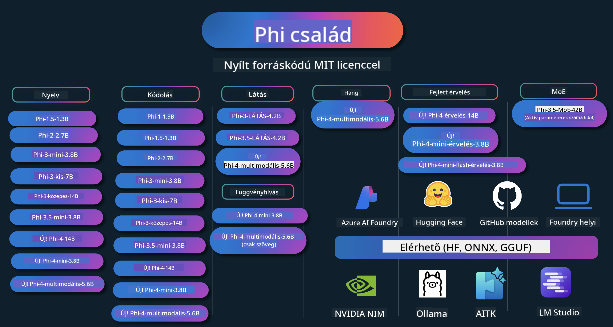

<!--
CO_OP_TRANSLATOR_METADATA:
{
  "original_hash": "ef3a50368712b1a7483d0def1f70c490",
  "translation_date": "2025-12-21T13:09:07+00:00",
  "source_file": "README.md",
  "language_code": "hu"
}
-->
# Phi Cookbook: Gyakorlati példák a Microsoft Phi modelljeivel

Phi a Microsoft által fejlesztett nyílt forráskódú AI modellek sorozata. 

A Phi jelenleg a legteljesítményesebb és költséghatékonyabb kis nyelvi modell (SLM), nagyon jó mérési eredményekkel többnyelvűségben, érvelésben, szöveg/chat generálásban, kódolásban, képekben, hangban és egyéb forgatókönyvekben. 

A Phit telepítheted a felhőbe vagy edge eszközökre, és könnyen építhetsz generatív AI alkalmazásokat korlátozott számítási erőforrással.

Kövesd ezeket a lépéseket, hogy elkezdhessed ezen erőforrások használatát:
1. **Forkold a tárolót**: Click 
2. **Klónozd le a tárolót**:   `git clone https://github.com/microsoft/PhiCookBook.git`
3. [**Csatlakozz a Microsoft AI Discord közösséghez és találkozz szakértőkkel és fejlesztőtársakkal**](https://discord.com/invite/ByRwuEEgH4?WT.mc_id=aiml-137032-kinfeylo)

### 🌐 Többnyelvű támogatás

#### Támogatott GitHub Action által (Automatizált és mindig naprakész)

<!-- CO-OP TRANSLATOR LANGUAGES TABLE START -->
[Arab](../ar/README.md) | [bengáli](../bn/README.md) | [bolgár](../bg/README.md) | [burmai (Mianmar)](../my/README.md) | [kínai (egyszerűsített)](../zh/README.md) | [kínai (hagyományos, Hong Kong)](../hk/README.md) | [kínai (hagyományos, Makaó)](../mo/README.md) | [kínai (hagyományos, Tajvan)](../tw/README.md) | [horvát](../hr/README.md) | [cseh](../cs/README.md) | [dán](../da/README.md) | [holland](../nl/README.md) | [észt](../et/README.md) | [finn](../fi/README.md) | [francia](../fr/README.md) | [német](../de/README.md) | [görög](../el/README.md) | [héber](../he/README.md) | [hindi](../hi/README.md) | [magyar](./README.md) | [indonéz](../id/README.md) | [olasz](../it/README.md) | [japán](../ja/README.md) | [kannada](../kn/README.md) | [koreai](../ko/README.md) | [litván](../lt/README.md) | [maláj](../ms/README.md) | [malajálam](../ml/README.md) | [maráthi](../mr/README.md) | [nepáli](../ne/README.md) | [nigériai pidgin](../pcm/README.md) | [norvég](../no/README.md) | [perzsa (fárszi)](../fa/README.md) | [lengyel](../pl/README.md) | [portugál (Brazília)](../br/README.md) | [portugál (Portugália)](../pt/README.md) | [pandzsábi (Gurmukhi)](../pa/README.md) | [román](../ro/README.md) | [orosz](../ru/README.md) | [szerb (cirill)](../sr/README.md) | [szlovák](../sk/README.md) | [szlovén](../sl/README.md) | [spanyol](../es/README.md) | [szuahéli](../sw/README.md) | [svéd](../sv/README.md) | [tagalog (filippínó)](../tl/README.md) | [tamil](../ta/README.md) | [telugu](../te/README.md) | [thai](../th/README.md) | [török](../tr/README.md) | [ukrán](../uk/README.md) | [urdu](../ur/README.md) | [vietnámi](../vi/README.md)
<!-- CO-OP TRANSLATOR LANGUAGES TABLE END -->

## Tartalomjegyzék

- Bevezetés
  - [Üdvözlünk a Phi családban](./md/01.Introduction/01/01.PhiFamily.md)
  - [A környezet beállítása](./md/01.Introduction/01/01.EnvironmentSetup.md)
  - [A kulcstechnológiák megértése](./md/01.Introduction/01/01.Understandingtech.md)
  - [Phi modellek AI biztonsága](./md/01.Introduction/01/01.AISafety.md)
  - [Phi hardvertámogatás](./md/01.Introduction/01/01.Hardwaresupport.md)
  - [Phi modellek és elérhetőség különböző platformokon](./md/01.Introduction/01/01.Edgeandcloud.md)
  - [Guidance-ai és Phi használata](./md/01.Introduction/01/01.Guidance.md)
  - [GitHub Marketplace modellek](https://github.com/marketplace/models)
  - [Azure AI modellkatalógus](https://ai.azure.com)

- Phi inferencia különböző környezetekben
    -  [Hugging Face](./md/01.Introduction/02/01.HF.md)
    -  [GitHub Models](./md/01.Introduction/02/02.GitHubModel.md)
    -  [Azure AI Foundry Model Catalog](./md/01.Introduction/02/03.AzureAIFoundry.md)
    -  [Ollama](./md/01.Introduction/02/04.Ollama.md)
    -  [AI Toolkit VSCode (AITK)](./md/01.Introduction/02/05.AITK.md)
    -  [NVIDIA NIM](./md/01.Introduction/02/06.NVIDIA.md)
    -  [Foundry Local](./md/01.Introduction/02/07.FoundryLocal.md)

- Phi család inferenciája
    - [Phi inferencia iOS-en](./md/01.Introduction/03/iOS_Inference.md)
    - [Phi inferencia Androidon](./md/01.Introduction/03/Android_Inference.md)
    - [Phi inferencia Jetsonon](./md/01.Introduction/03/Jetson_Inference.md)
    - [Phi inferencia AI PC-n](./md/01.Introduction/03/AIPC_Inference.md)
    - [Phi inferencia Apple MLX keretrendszerrel](./md/01.Introduction/03/MLX_Inference.md)
    - [Phi inferencia helyi szerveren](./md/01.Introduction/03/Local_Server_Inference.md)
    - [Phi inferencia távoli szerveren AI Toolkit használatával](./md/01.Introduction/03/Remote_Interence.md)
    - [Phi inferencia Rust-tal](./md/01.Introduction/03/Rust_Inference.md)
    - [Phi--Vision helyi inferenciája](./md/01.Introduction/03/Vision_Inference.md)
    - [Phi inferencia Kaito AKS-sel, Azure konténerekkel (hivatalos támogatás)](./md/01.Introduction/03/Kaito_Inference.md)
-  [A Phi család kvantálása](./md/01.Introduction/04/QuantifyingPhi.md)
    - [Phi-3.5 / 4 kvantálása llama.cpp használatával](./md/01.Introduction/04/UsingLlamacppQuantifyingPhi.md)
    - [Phi-3.5 / 4 kvantálása Generative AI kiterjesztésekkel az onnxruntime-hoz](./md/01.Introduction/04/UsingORTGenAIQuantifyingPhi.md)
    - [Phi-3.5 / 4 kvantálása Intel OpenVINO használatával](./md/01.Introduction/04/UsingIntelOpenVINOQuantifyingPhi.md)
    - [Phi-3.5 / 4 kvantálása Apple MLX keretrendszer használatával](./md/01.Introduction/04/UsingAppleMLXQuantifyingPhi.md)

-  Phi értékelése
    - [Felelős AI](./md/01.Introduction/05/ResponsibleAI.md)
    - [Azure AI Foundry az értékeléshez](./md/01.Introduction/05/AIFoundry.md)
    - [Promptflow használata értékeléshez](./md/01.Introduction/05/Promptflow.md)
 
- RAG Azure AI Search-szel
    - [Hogyan használd a Phi-4-mini és a Phi-4-multimodális (RAG) modelleket az Azure AI Search-csel](https://github.com/microsoft/PhiCookBook/blob/main/code/06.E2E/E2E_Phi-4-RAG-Azure-AI-Search.ipynb)

- Phi alkalmazásfejlesztési minták
  - Szöveg és chat alkalmazások
    - Phi-4 minták 🆕
      - [📓] [Chat Phi-4-mini ONNX modellel](./md/02.Application/01.TextAndChat/Phi4/ChatWithPhi4ONNX/README.md)
      - [Chat Phi-4 helyi ONNX modellel .NET](../../md/04.HOL/dotnet/src/LabsPhi4-Chat-01OnnxRuntime)
      - [Chat .NET konzolalkalmazás Phi-4 ONNX-szel a Semantic Kernel használatával](../../md/04.HOL/dotnet/src/LabsPhi4-Chat-02SK)
    - Phi-3 / 3.5 minták
      - [Helyi chatbot a böngészőben Phi3-mal, ONNX Runtime Web és WebGPU használatával](https://github.com/microsoft/onnxruntime-inference-examples/tree/main/js/chat)
      - [OpenVino chat](./md/02.Application/01.TextAndChat/Phi3/E2E_OpenVino_Chat.md)
      - [Több modell - Interaktív Phi-3-mini és OpenAI Whisper](./md/02.Application/01.TextAndChat/Phi3/E2E_Phi-3-mini_with_whisper.md)
      - [MLFlow - Wrapper készítése és Phi-3 használata MLFlow-val](./md//02.Application/01.TextAndChat/Phi3/E2E_Phi-3-MLflow.md)
      - [Modelloptimalizálás - Hogyan optimalizáljuk a Phi-3-min modellt az ONNX Runtime Webhez Olive segítségével](https://github.com/microsoft/Olive/tree/main/examples/phi3)
      - [WinUI3 alkalmazás Phi-3 mini-4k-instruct-onnx modellel](https://github.com/microsoft/Phi3-Chat-WinUI3-Sample/)
      -[WinUI3 Többmodellű MI-vezérelt jegyzetalkalmazás minta](https://github.com/microsoft/ai-powered-notes-winui3-sample)
      - [Egyedi Phi-3 modellek finomhangolása és integrálása Prompt flow-val](./md/02.Application/01.TextAndChat/Phi3/E2E_Phi-3-FineTuning_PromptFlow_Integration.md)
      - [Egyedi Phi-3 modellek finomhangolása és integrálása Prompt flow-val az Azure AI Foundry-ban](./md/02.Application/01.TextAndChat/Phi3/E2E_Phi-3-FineTuning_PromptFlow_Integration_AIFoundry.md)
      - [A finomhangolt Phi-3 / Phi-3.5 modell értékelése az Azure AI Foundry-ban, a Microsoft felelős MI elveire fókuszálva](./md/02.Application/01.TextAndChat/Phi3/E2E_Phi-3-Evaluation_AIFoundry.md)
      - [📓] [Phi-3.5-mini-instruct nyelvi predikciós példa (kínai/angol)](./md/02.Application/01.TextAndChat/Phi3/phi3-instruct-demo.ipynb)
      - [Phi-3.5-Instruct WebGPU RAG chatbot](./md/02.Application/01.TextAndChat/Phi3/WebGPUWithPhi35Readme.md)
      - [Windows GPU használata Prompt flow megoldás létrehozásához Phi-3.5-Instruct ONNX modellel](./md/02.Application/01.TextAndChat/Phi3/UsingPromptFlowWithONNX.md)
      - [A Microsoft Phi-3.5 tflite használata Android alkalmazás létrehozásához](./md/02.Application/01.TextAndChat/Phi3/UsingPhi35TFLiteCreateAndroidApp.md)
      - [Q&A .NET példa helyi ONNX Phi-3 modellel a Microsoft.ML.OnnxRuntime használatával](../../md/04.HOL/dotnet/src/LabsPhi301)
      - [Konzolos chat .NET alkalmazás a Semantic Kernel és Phi-3 használatával](../../md/04.HOL/dotnet/src/LabsPhi302)

  - Azure AI Inference SDK kódalapú példák 
    - Phi-4 minták 🆕
      - [📓] [Projektkód generálása Phi-4-multimodal használatával](./md/02.Application/02.Code/Phi4/GenProjectCode/README.md)
    - Phi-3 / 3.5 példák
      - [Készítsd el saját Visual Studio Code GitHub Copilot Chatet a Microsoft Phi-3 családdal](./md/02.Application/02.Code/Phi3/VSCodeExt/README.md)
      - [Hozd létre saját Visual Studio Code Chat Copilot ügynöködet Phi-3.5-tel a GitHub modellek segítségével](/md/02.Application/02.Code/Phi3/CreateVSCodeChatAgentWithGitHubModels.md)

  - Haladó érvelési példák
    - Phi-4 minták 🆕
      - [📓] [Phi-4-mini-reasoning vagy Phi-4-reasoning példák](./md/02.Application/03.AdvancedReasoning/Phi4/AdvancedResoningPhi4mini/README.md)
      - [📓] [Phi-4-mini-reasoning finomhangolása Microsoft Olive-dal](./md/02.Application/03.AdvancedReasoning/Phi4/AdvancedResoningPhi4mini/olive_ft_phi_4_reasoning_with_medicaldata.ipynb)
      - [📓] [Phi-4-mini-reasoning finomhangolása Apple MLX-szel](./md/02.Application/03.AdvancedReasoning/Phi4/AdvancedResoningPhi4mini/mlx_ft_phi_4_reasoning_with_medicaldata.ipynb)
      - [📓] [Phi-4-mini-reasoning GitHub modellekkel](./md/02.Application/02.Code/Phi4r/github_models_inference.ipynb)
      - [📓] [Phi-4-mini-reasoning Azure AI Foundry modellekkel](./md/02.Application/02.Code/Phi4r/azure_models_inference.ipynb)
  - Demók
      - [Phi-4-mini demók a Hugging Face Spaces-en](https://huggingface.co/spaces/microsoft/phi-4-mini?WT.mc_id=aiml-137032-kinfeylo)
      - [Phi-4-multimodal demók a Hugginge Face Spaces-en](https://huggingface.co/spaces/microsoft/phi-4-multimodal?WT.mc_id=aiml-137032-kinfeylo)
  - Vision példák
    - Phi-4 minták 🆕
      - [📓] [Phi-4-multimodal használata képek olvasására és kód generálására](./md/02.Application/04.Vision/Phi4/CreateFrontend/README.md) 
    - Phi-3 / 3.5 példák
      -  [📓][Phi-3-vision - kép szövegből szövegbe](./md/02.Application/04.Vision/Phi3/E2E_Phi-3-vision-image-text-to-text-online-endpoint.ipynb)
      - [Phi-3-vision-ONNX](https://onnxruntime.ai/docs/genai/tutorials/phi3-v.html)
      - [📓][Phi-3-vision CLIP beágyazás](./md/02.Application/04.Vision/Phi3/E2E_Phi-3-vision-image-text-to-text-online-endpoint.ipynb)
      - [DEMO: Phi-3 Recycling](https://github.com/jennifermarsman/PhiRecycling/)
      - [Phi-3-vision - vizuális nyelvi asszisztens - Phi3-Vision és OpenVINO használatával](https://docs.openvino.ai/nightly/notebooks/phi-3-vision-with-output.html)
      - [Phi-3 Vision Nvidia NIM](./md/02.Application/04.Vision/Phi3/E2E_Nvidia_NIM_Vision.md)
      - [Phi-3 Vision OpenVino](./md/02.Application/04.Vision/Phi3/E2E_OpenVino_Phi3Vision.md)
      - [📓][Phi-3.5 Vision többkeretes vagy többképes példa](./md/02.Application/04.Vision/Phi3/phi3-vision-demo.ipynb)
      - [Phi-3 Vision helyi ONNX modell a Microsoft.ML.OnnxRuntime .NET használatával](../../md/04.HOL/dotnet/src/LabsPhi303)
      - [Menü alapú Phi-3 Vision helyi ONNX modell a Microsoft.ML.OnnxRuntime .NET használatával](../../md/04.HOL/dotnet/src/LabsPhi304)

  - Matematikai példák
    -  Phi-4-Mini-Flash-Reasoning-Instruct minták 🆕 [Matematikai demó Phi-4-Mini-Flash-Reasoning-Instruct-tel](./md/02.Application/09.Math/MathDemo.ipynb)

  - Audio példák
    - Phi-4 minták 🆕
      - [📓] [Audio átiratok kinyerése Phi-4-multimodal használatával](./md/02.Application/05.Audio/Phi4/Transciption/README.md)
      - [📓] [Phi-4-multimodal audio példa](./md/02.Application/05.Audio/Phi4/Siri/demo.ipynb)
      - [📓] [Phi-4-multimodal beszédfordítás példa](./md/02.Application/05.Audio/Phi4/Translate/demo.ipynb)
      - [.NET konzolos alkalmazás, amely Phi-4-multimodal audiót használ egy hangfájl elemzésére és átirat generálására](../../md/04.HOL/dotnet/src/LabsPhi4-MultiModal-02Audio)

  - MOE példák
    - Phi-3 / 3.5 példák
      - [📓] [Phi-3.5 Mixture of Experts modellek (MoE-k) közösségi média példa](./md/02.Application/06.MoE/Phi3/phi3_moe_demo.ipynb)
      - [📓] [Retrieval-Augmented Generation (RAG) csővezeték építése NVIDIA NIM Phi-3 MOE-val, Azure AI Search-szel és LlamaIndex-szel](./md/02.Application/06.MoE/Phi3/azure-ai-search-nvidia-rag.ipynb)
      - 
  - Funkcióhívás példák
    - Phi-4 minták 🆕
      -  [📓] [Funkcióhívás használata Phi-4-mini-vel](./md/02.Application/07.FunctionCalling/Phi4/FunctionCallingBasic/README.md)
      -  [📓] [Funkcióhívás használata többügynök létrehozásához Phi-4-mini-vel](./md/02.Application/07.FunctionCalling/Phi4/Multiagents/Phi_4_mini_multiagent.ipynb)
      -  [📓] [Funkcióhívás használata Ollama-val](./md/02.Application/07.FunctionCalling/Phi4/Ollama/ollama_functioncalling.ipynb)
      -  [📓] [Funkcióhívás használata ONNX-szal](./md/02.Application/07.FunctionCalling/Phi4/ONNX/onnx_parallel_functioncalling.ipynb)
  - Multimodális keverés példák
    - Phi-4 minták 🆕
      -  [📓] [Phi-4-multimodal használata technológiai újságíróként](../../md/02.Application/08.Multimodel/Phi4/TechJournalist/phi_4_mm_audio_text_publish_news_ipynb)
      - [.NET konzolos alkalmazás, amely Phi-4-multimodal-t használ képek elemzésére](../../md/04.HOL/dotnet/src/LabsPhi4-MultiModal-01Images)

- Phi finomhangolási példák
  - [Finomhangolási forgatókönyvek](./md/03.FineTuning/FineTuning_Scenarios.md)
  - [Finomhangolás vs RAG](./md/03.FineTuning/FineTuning_vs_RAG.md)
  - [Finomhangolás: Engedd, hogy a Phi-3 iparági szakértővé váljon](./md/03.FineTuning/LetPhi3gotoIndustriy.md)
  - [Phi-3 finomhangolása AI Toolkit for VS Code-dal](./md/03.FineTuning/Finetuning_VSCodeaitoolkit.md)
  - [Phi-3 finomhangolása Azure Machine Learning Service-szel](./md/03.FineTuning/Introduce_AzureML.md)
  - [Phi-3 finomhangolása Lora-val](./md/03.FineTuning/FineTuning_Lora.md)
  - [Phi-3 finomhangolása QLora-val](./md/03.FineTuning/FineTuning_Qlora.md)
  - [Phi-3 finomhangolása Azure AI Foundry-val](./md/03.FineTuning/FineTuning_AIFoundry.md)
  - [Phi-3 finomhangolása Azure ML CLI/SDK-val](./md/03.FineTuning/FineTuning_MLSDK.md)
  - [Finomhangolás Microsoft Olive-dal](./md/03.FineTuning/FineTuning_MicrosoftOlive.md)
  - [Finomhangolás Microsoft Olive gyakorlati laborral](./md/03.FineTuning/olive-lab/readme.md)
  - [Phi-3-vision finomhangolása Weights and Bias-szal](./md/03.FineTuning/FineTuning_Phi-3-visionWandB.md)
  - [Phi-3 finomhangolása Apple MLX keretrendszerrel](./md/03.FineTuning/FineTuning_MLX.md)
  - [Phi-3-vision finomhangolása (hivatalos támogatás)](./md/03.FineTuning/FineTuning_Vision.md)
  - [Phi-3 finomhangolása Kaito AKS-sel, Azure Containers-szel (hivatalos támogatás)](./md/03.FineTuning/FineTuning_Kaito.md)
  - [Phi-3 és 3.5 Vision finomhangolása](https://github.com/2U1/Phi3-Vision-Finetune)

- Gyakorlati labor
  - [Élvonalbeli modellek felfedezése: LLM-ek, SLM-ek, helyi fejlesztés és még több](https://github.com/microsoft/aitour-exploring-cutting-edge-models)
  - [Az NLP potenciáljának feltárása: Finomhangolás Microsoft Olive-dal](https://github.com/azure/Ignite_FineTuning_workshop)

- Tudományos kutatási cikkek és publikációk
  - [Textbooks Are All You Need II: phi-1.5 technikai jelentés](https://arxiv.org/abs/2309.05463)
  - [Phi-3 technikai jelentés: Egy rendkívül képességes nyelvi modell helyben a telefonodon](https://arxiv.org/abs/2404.14219)
  - [Phi-4 technikai jelentés](https://arxiv.org/abs/2412.08905)
  - [Phi-4-Mini Műszaki jelentés: Kompakt, mégis erőteljes multimodális nyelvi modellek LoRA-keveréssel](https://arxiv.org/abs/2503.01743)
  - [Kis nyelvi modellek optimalizálása járműbeli funkcióhívásokhoz](https://arxiv.org/abs/2501.02342)
  - [(WhyPHI) PHI-3 finomhangolása többválasztásos kérdések megválaszolására: módszertan, eredmények és kihívások](https://arxiv.org/abs/2501.01588)
  - [Phi-4-reasoning Műszaki jelentés](https://www.microsoft.com/en-us/research/wp-content/uploads/2025/04/phi_4_reasoning.pdf)
  - [Phi-4-mini-reasoning Műszaki jelentés](https://huggingface.co/microsoft/Phi-4-mini-reasoning/blob/main/Phi-4-Mini-Reasoning.pdf)

## Phi modellek használata

### Phi az Azure AI Foundry szolgáltatásban

Megtanulhatja, hogyan használja a Microsoft Phi-t és hogyan építsen E2E megoldásokat különböző hardveres eszközökön. Ha szeretné saját maga is megtapasztalni a Phit, kezdje azzal, hogy kipróbálja a modelleket és testre szabja azokat az Ön forgatókönyveihez az [Azure AI Foundry Azure AI Model Catalog](https://aka.ms/phi3-azure-ai) használatával. További információkért tekintse meg a Kezdést a [Azure AI Foundry](/md/02.QuickStart/AzureAIFoundry_QuickStart.md) útmutatót.

**Gyakorlófelület**
Minden modellnek van egy dedikált gyakorlatfelülete a modell tesztelésére: [Azure AI Playground](https://aka.ms/try-phi3).

### Phi a GitHub modelleken

Megtanulhatja, hogyan használja a Microsoft Phi-t és hogyan építsen E2E megoldásokat különböző hardveres eszközökön. Ha szeretné saját maga is megtapasztalni a Phit, kezdje azzal, hogy kipróbálja a modellt és testre szabja a Phit az Ön forgatókönyveihez a [GitHub Model Catalog](https://github.com/marketplace/models?WT.mc_id=aiml-137032-kinfeylo) segítségével. További információkért tekintse meg a Kezdést a [GitHub Model Catalog](/md/02.QuickStart/GitHubModel_QuickStart.md) útmutatót.

**Gyakorlófelület**
Minden modellnek van egy dedikált [gyakorlófelülete a modell tesztelésére](/md/02.QuickStart/GitHubModel_QuickStart.md).

### Phi a Hugging Face-en

A modellt megtalálhatja a [Hugging Face](https://huggingface.co/microsoft) oldalon is.

**Gyakorlófelület**
 [Hugging Chat próbapad](https://huggingface.co/chat/models/microsoft/Phi-3-mini-4k-instruct)

 ## 🎒 Egyéb tanfolyamok

Csapatunk más tanfolyamokat is készít! Tekintse meg:

<!-- CO-OP TRANSLATOR OTHER COURSES START -->
### LangChain

---

### Azure / Edge / MCP / Agents

---
 
### Generatív AI sorozat

[-9333EA?style=for-the-badge&labelColor=E5E7EB&color=9333EA)](https://github.com/microsoft/Generative-AI-for-beginners-dotnet?WT.mc_id=academic-105485-koreyst)
[-C084FC?style=for-the-badge&labelColor=E5E7EB&color=C084FC)](https://github.com/microsoft/generative-ai-for-beginners-java?WT.mc_id=academic-105485-koreyst)
[-E879F9?style=for-the-badge&labelColor=E5E7EB&color=E879F9)](https://github.com/microsoft/generative-ai-with-javascript?WT.mc_id=academic-105485-koreyst)

---
 
### Alapozó tanfolyamok

---
 
### Copilot sorozat

<!-- CO-OP TRANSLATOR OTHER COURSES END -->

## Felelős MI 

A Microsoft elkötelezett amellett, hogy ügyfeleinket támogassa AI-termékeink felelős használatában, megossza tapasztalatait, és bizalmon alapuló partnerségeket építsen olyan eszközökön keresztül, mint a Transparency Notes és az Impact Assessments. Számos ilyen forrás megtalálható a [https://aka.ms/RAI](https://aka.ms/RAI).
A Microsoft felelős MI-hez való megközelítése az igazságosság, megbízhatóság és biztonság, adatvédelem és biztonság, befogadás, átláthatóság és elszámoltathatóság mesterséges intelligenciára vonatkozó elvein alapul.

A nagy léptékű nyelvi, képi és beszédfeldolgozó modellek — mint amilyeneket ebben a példában is használnak — potenciálisan igazságtalanul, megbízhatatlanul vagy sértően viselkedhetnek, ami károkat okozhat. Kérjük, tekintse meg az [Azure OpenAI service Transparency note](https://learn.microsoft.com/legal/cognitive-services/openai/transparency-note?tabs=text) dokumentumot, hogy tájékozott legyen a kockázatokról és korlátokról.

A kockázatok mérséklésére ajánlott megközelítés egy olyan biztonsági rendszer beépítése az architektúrába, amely képes felismerni és megelőzni a káros viselkedést. Az [Azure AI Tartalombiztonság](https://learn.microsoft.com/azure/ai-services/content-safety/overview) független védelmi réteget biztosít, amely képes felismerni a felhasználók és az AI által generált káros tartalmakat az alkalmazásokban és szolgáltatásokban. Az Azure AI Tartalombiztonság tartalmaz szöveg- és kép-API-kat, amelyek lehetővé teszik a káros anyagok felismerését. Az Azure AI Foundry-n belül a Content Safety szolgáltatás lehetővé teszi, hogy megtekinthesse, felfedezze és kipróbáljon mintakódokat a különböző modalitásokban történő káros tartalom felismerésére. A következő [gyorsstart dokumentáció](https://learn.microsoft.com/azure/ai-services/content-safety/quickstart-text?tabs=visual-studio%2Clinux&pivots=programming-language-rest) végigvezeti Önt a szolgáltatásnak küldendő kérések készítésén.

Egy másik szempont, amit figyelembe kell venni, az az alkalmazás általános teljesítménye. Multimodális és többmodeles alkalmazások esetén a teljesítmény azt jelenti, hogy a rendszer úgy működik, ahogy Ön és felhasználói elvárják, beleértve azt is, hogy nem generál káros kimeneteket. Fontos értékelni a teljes alkalmazás teljesítményét a [Performance and Quality and Risk and Safety evaluators](https://learn.microsoft.com/azure/ai-studio/concepts/evaluation-metrics-built-in) segítségével. Lehetősége van továbbá [egyéni kiértékelők](https://learn.microsoft.com/azure/ai-studio/how-to/develop/evaluate-sdk#custom-evaluators) létrehozására és azokkal való értékelésre.

Fejlesztési környezetében értékelheti MI-alkalmazását az [Azure AI Evaluation SDK](https://microsoft.github.io/promptflow/index.html) segítségével. Adott egy tesztadatkészlet vagy egy célkitűzés, generatív MI-alkalmazása kimeneteit mennyiségileg mérik beépített vagy az Ön által választott egyéni kiértékelők. Az azure ai evaluation sdk használatának megkezdéséhez az értékeléshez kövesse a [gyorsstart útmutatót](https://learn.microsoft.com/azure/ai-studio/how-to/develop/flow-evaluate-sdk). Miután végrehajt egy értékelési futást, [vizualizálhatja az eredményeket az Azure AI Foundry-ban](https://learn.microsoft.com/azure/ai-studio/how-to/evaluate-flow-results). 

## Védjegyek
Ez a projekt tartalmazhat védjegyeket vagy logókat projektekhez, termékekhez vagy szolgáltatásokhoz. A Microsoft védjegyeinek vagy logóinak engedélyezett használata a [Microsoft védjegy- és márkairányelveinek](https://www.microsoft.com/legal/intellectualproperty/trademarks/usage/general) hatálya alá tartozik, és azokat követni kell.
A Microsoft védjegyeinek vagy logóinak a projekt módosított verzióiban történő használata nem okozhat félreértést, és nem utalhat a Microsoft szponzorálására. Harmadik fél védjegyeinek vagy logóinak bármilyen használata azon harmadik felek irányelveinek van alávetve.

## Segítség

Ha elakadsz vagy kérdésed van az AI-alkalmazások fejlesztésével kapcsolatban, csatlakozz:

Ha termékvisszajelzést szeretnél adni, vagy hibát tapasztalsz építés közben, látogass el:

---

<!-- CO-OP TRANSLATOR DISCLAIMER START -->
Felelősségkizárás:
Ezt a dokumentumot a Co-op Translator (https://github.com/Azure/co-op-translator) nevű, mesterséges intelligenciát használó fordítószolgáltatással fordították. Bár törekszünk a pontosságra, kérjük, vegye figyelembe, hogy az automatikus fordítások hibákat vagy pontatlanságokat tartalmazhatnak. Az eredeti, anyanyelvi dokumentum tekintendő a hiteles forrásnak. Kritikus információk esetén professzionális, emberi fordítás ajánlott. Nem vállalunk felelősséget az ezen fordítás használatából eredő félreértésekért vagy félreértelmezésekért.
<!-- CO-OP TRANSLATOR DISCLAIMER END -->