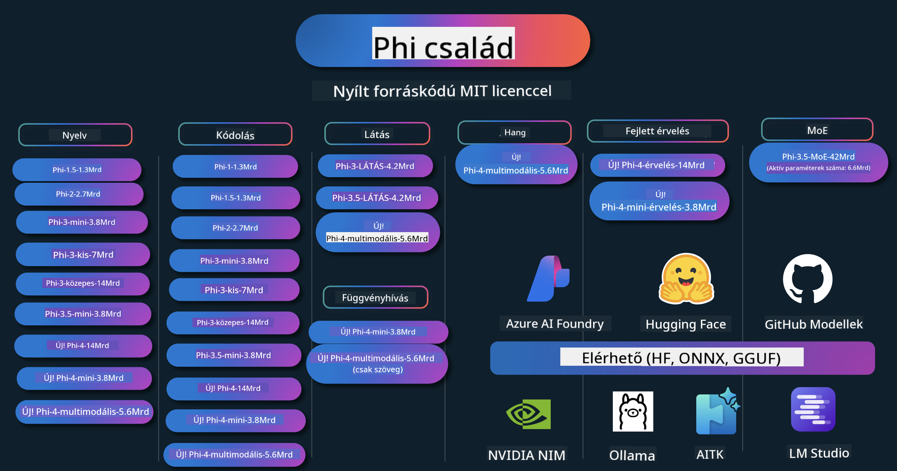

<!--
CO_OP_TRANSLATOR_METADATA:
{
  "original_hash": "1cab9282e04f2e1c388a38dca7763c16",
  "translation_date": "2025-05-09T04:09:07+00:00",
  "source_file": "README.md",
  "language_code": "hu"
}
-->
# Phi Cookbook: Gyakorlati példák a Microsoft Phi modelljeivel

  

  
  
  

  
  

A Phi a Microsoft által fejlesztett nyílt forráskódú AI modellek sorozata.

Jelenleg a Phi a legfejlettebb és költséghatékonyabb kis nyelvi modell (SLM), amely kiváló eredményeket ér el többnyelvűség, következtetés, szöveg/csevegés generálás, kódolás, képek, hang és egyéb felhasználási területeken.

Telepítheted a Phi-t felhőbe vagy élő eszközökre, és könnyedén építhetsz generatív AI alkalmazásokat korlátozott számítási erőforrásokkal.

Kövesd az alábbi lépéseket a használat megkezdéséhez:  
1. **Fork-old a Repository-t**: Kattints   
2. **Klónozd a Repository-t**: `git clone https://github.com/microsoft/PhiCookBook.git`  
3. [**Csatlakozz a Microsoft AI Discord közösséghez, és ismerkedj meg szakértőkkel és fejlesztőtársakkal**](https://discord.com/invite/ByRwuEEgH4?WT.mc_id=aiml-137032-kinfeylo)

## 🌐 Többnyelvű támogatás

### GitHub Action segítségével támogatott (Automatizált és mindig naprakész)

[Francia](../fr/README.md) | [Spanyol](../es/README.md) | [Német](../de/README.md) | [Orosz](../ru/README.md) | [Arab](../ar/README.md) | [Perzsa (Farsi)](../fa/README.md) | [Urdu](../ur/README.md) | [Egyszerűsített kínai](../zh/README.md) | [Hagyományos kínai (Makaó)](../mo/README.md) | [Hagyományos kínai (Hong Kong)](../hk/README.md) | [Hagyományos kínai (Tajvan)](../tw/README.md) | [Japán](../ja/README.md) | [Koreai](../ko/README.md) | [Hindi](../hi/README.md)

### CLI által támogatott
[Bengáli](../bn/README.md) | [Marathi](../mr/README.md) | [Nepáli](../ne/README.md) | [Pandzsábi (Gurmukhi)](../pa/README.md) | [Portugál (Portugália)](../pt/README.md) | [Portugál (Brazília)](../br/README.md) | [Olasz](../it/README.md) | [Lengyel](../pl/README.md) | [Török](../tr/README.md) | [Görög](../el/README.md) | [Thai](../th/README.md) | [Svéd](../sv/README.md) | [Dán](../da/README.md) | [Norvég](../no/README.md) | [Finn](../fi/README.md) | [Holland](../nl/README.md) | [Héber](../he/README.md) | [Vietnami](../vi/README.md) | [Indonéz](../id/README.md) | [Maláj](../ms/README.md) | [Tagalog (Filippínó)](../tl/README.md) | [Szuahéli](../sw/README.md) | [Magyar](./README.md) | [Cseh](../cs/README.md) | [Szlovák](../sk/README.md) | [Román](../ro/README.md) | [Bolgár](../bg/README.md) | [Szerb (Cirill)](../sr/README.md) | [Horvát](../hr/README.md) | [Szlovén](../sl/README.md)

## Tartalomjegyzék

- Bevezetés
- [Üdvözlünk a Phi Családban](./md/01.Introduction/01/01.PhiFamily.md)
  - [A környezet beállítása](./md/01.Introduction/01/01.EnvironmentSetup.md)
  - [A kulcsfontosságú technológiák megértése](./md/01.Introduction/01/01.Understandingtech.md)
  - [AI biztonság a Phi modellekhez](./md/01.Introduction/01/01.AISafety.md)
  - [Phi hardvertámogatás](./md/01.Introduction/01/01.Hardwaresupport.md)
  - [Phi modellek és elérhetőségük különböző platformokon](./md/01.Introduction/01/01.Edgeandcloud.md)
  - [Guidance-ai és Phi használata](./md/01.Introduction/01/01.Guidance.md)
  - [GitHub Marketplace modellek](https://github.com/marketplace/models)
  - [Azure AI modell katalógus](https://ai.azure.com)

- Phi inferencia különböző környezetekben
    -  [Hugging face](./md/01.Introduction/02/01.HF.md)
    -  [GitHub modellek](./md/01.Introduction/02/02.GitHubModel.md)
    -  [Azure AI Foundry modell katalógus](./md/01.Introduction/02/03.AzureAIFoundry.md)
    -  [Ollama](./md/01.Introduction/02/04.Ollama.md)
    -  [AI Toolkit VSCode (AITK)](./md/01.Introduction/02/05.AITK.md)
    -  [NVIDIA NIM](./md/01.Introduction/02/06.NVIDIA.md)

- Phi család inferencia
    - [Phi inferencia iOS-en](./md/01.Introduction/03/iOS_Inference.md)
    - [Phi inferencia Androidon](./md/01.Introduction/03/Android_Inference.md)
    - [Phi inferencia Jetsonon](./md/01.Introduction/03/Jetson_Inference.md)
    - [Phi inferencia AI PC-n](./md/01.Introduction/03/AIPC_Inference.md)
    - [Phi inferencia Apple MLX keretrendszerrel](./md/01.Introduction/03/MLX_Inference.md)
    - [Phi inferencia helyi szerveren](./md/01.Introduction/03/Local_Server_Inference.md)
    - [Phi inferencia távoli szerveren AI Toolkit segítségével](./md/01.Introduction/03/Remote_Interence.md)
    - [Phi inferencia Rust nyelven](./md/01.Introduction/03/Rust_Inference.md)
    - [Phi inferencia Vision helyi környezetben](./md/01.Introduction/03/Vision_Inference.md)
    - [Phi inferencia Kaito AKS-sel, Azure konténerekkel (hivatalos támogatás)](./md/01.Introduction/03/Kaito_Inference.md)
-  [Phi család kvantálása](./md/01.Introduction/04/QuantifyingPhi.md)
    - [Phi-3.5 / 4 kvantálása llama.cpp használatával](./md/01.Introduction/04/UsingLlamacppQuantifyingPhi.md)
    - [Phi-3.5 / 4 kvantálása Generative AI kiterjesztésekkel onnxruntime-hoz](./md/01.Introduction/04/UsingORTGenAIQuantifyingPhi.md)
    - [Phi-3.5 / 4 kvantálása Intel OpenVINO használatával](./md/01.Introduction/04/UsingIntelOpenVINOQuantifyingPhi.md)
    - [Phi-3.5 / 4 kvantálása Apple MLX keretrendszerrel](./md/01.Introduction/04/UsingAppleMLXQuantifyingPhi.md)

-  Phi értékelése
- [Response AI](./md/01.Introduction/05/ResponsibleAI.md)
    - [Azure AI Foundry az értékeléshez](./md/01.Introduction/05/AIFoundry.md)
    - [Promptflow használata az értékeléshez](./md/01.Introduction/05/Promptflow.md)
 
- RAG Azure AI Search-szel
    - [Hogyan használd a Phi-4-mini és Phi-4-multimodal (RAG) modelleket Azure AI Search-szel](https://github.com/microsoft/PhiCookBook/blob/main/code/06.E2E/E2E_Phi-4-RAG-Azure-AI-Search.ipynb)

- Phi alkalmazásfejlesztési példák
  - Szöveg- és csevegőalkalmazások
    - Phi-4 példák 🆕
      - [📓] [Csevegés a Phi-4-mini ONNX modellel](./md/02.Application/01.TextAndChat/Phi4/ChatWithPhi4ONNX/README.md)
      - [Csevegés Phi-4 helyi ONNX modellel .NET-ben](../../md/04.HOL/dotnet/src/LabsPhi4-Chat-01OnnxRuntime)
      - [Csevegő .NET konzolalkalmazás Phi-4 ONNX-szel és Semantic Kernel használatával](../../md/04.HOL/dotnet/src/LabsPhi4-Chat-02SK)
    - Phi-3 / 3.5 példák
      - [Helyi chatbot a böngészőben Phi3, ONNX Runtime Web és WebGPU használatával](https://github.com/microsoft/onnxruntime-inference-examples/tree/main/js/chat)
      - [OpenVino csevegő](./md/02.Application/01.TextAndChat/Phi3/E2E_OpenVino_Chat.md)
      - [Több modell - Interaktív Phi-3-mini és OpenAI Whisper](./md/02.Application/01.TextAndChat/Phi3/E2E_Phi-3-mini_with_whisper.md)
      - [MLFlow - Wrapper készítése és Phi-3 használata MLFlow-val](./md//02.Application/01.TextAndChat/Phi3/E2E_Phi-3-MLflow.md)
      - [Modelloptimalizálás - Hogyan optimalizáld a Phi-3-min modellt ONNX Runtime Webhez Olive segítségével](https://github.com/microsoft/Olive/tree/main/examples/phi3)
      - [WinUI3 alkalmazás Phi-3 mini-4k-instruct-onnx-szel](https://github.com/microsoft/Phi3-Chat-WinUI3-Sample/)
      - [WinUI3 Többmodellű AI által támogatott jegyzetalkalmazás minta](https://github.com/microsoft/ai-powered-notes-winui3-sample)
      - [Egyedi Phi-3 modellek finomhangolása és integrálása Promptflow-val](./md/02.Application/01.TextAndChat/Phi3/E2E_Phi-3-FineTuning_PromptFlow_Integration.md)
      - [Egyedi Phi-3 modellek finomhangolása és integrálása Promptflow-val az Azure AI Foundry-ban](./md/02.Application/01.TextAndChat/Phi3/E2E_Phi-3-FineTuning_PromptFlow_Integration_AIFoundry.md)
      - [A finomhangolt Phi-3 / Phi-3.5 modell értékelése az Azure AI Foundry-ban a Microsoft felelős AI elvei szerint](./md/02.Application/01.TextAndChat/Phi3/E2E_Phi-3-Evaluation_AIFoundry.md)
      - [📓] [Phi-3.5-mini-instruct nyelvi előrejelző példa (kínai/angol)](../../md/02.Application/01.TextAndChat/Phi3/phi3-instruct-demo.ipynb)
      - [Phi-3.5-Instruct WebGPU RAG chatbot](./md/02.Application/01.TextAndChat/Phi3/WebGPUWithPhi35Readme.md)
      - [Windows GPU használata Promptflow megoldás létrehozásához Phi-3.5-Instruct ONNX-szel](./md/02.Application/01.TextAndChat/Phi3/UsingPromptFlowWithONNX.md)
      - [Microsoft Phi-3.5 tflite használata Android alkalmazás készítéséhez](./md/02.Application/01.TextAndChat/Phi3/UsingPhi35TFLiteCreateAndroidApp.md)
      - [Kérdés-válasz .NET példa helyi ONNX Phi-3 modellel a Microsoft.ML.OnnxRuntime használatával](../../md/04.HOL/dotnet/src/LabsPhi301)
      - [Konzol chat .NET alkalmazás Semantic Kernel-lel és Phi-3-mal](../../md/04.HOL/dotnet/src/LabsPhi302)

  - Azure AI Inference SDK kód alapú példák
    - Phi-4 példák 🆕
      - [📓] [Projektkód generálása Phi-4-multimodal segítségével](./md/02.Application/02.Code/Phi4/GenProjectCode/README.md)
    - Phi-3 / 3.5 példák
      - [Saját Visual Studio Code GitHub Copilot Chat építése Microsoft Phi-3 családdal](./md/02.Application/02.Code/Phi3/VSCodeExt/README.md)
      - [Saját Visual Studio Code Chat Copilot ügynök létrehozása Phi-3.5-tel GitHub modellek segítségével](/md/02.Application/02.Code/Phi3/CreateVSCodeChatAgentWithGitHubModels.md)

  - Haladó érvelési példák
    - Phi-4 példák 🆕
      - [📓] [Phi-4-mini-reasoning vagy Phi-4-reasoning példák](./md/02.Application/03.AdvancedReasoning/Phi4/AdvancedResoningPhi4mini/README.md)
      - [📓] [Phi-4-mini-reasoning finomhangolása Microsoft Olive segítségével](../../md/02.Application/03.AdvancedReasoning/Phi4/AdvancedResoningPhi4mini/olive_ft_phi_4_reasoning_with_medicaldata.ipynb)
      - [📓] [Phi-4-mini-reasoning finomhangolása Apple MLX-szel](../../md/02.Application/03.AdvancedReasoning/Phi4/AdvancedResoningPhi4mini/mlx_ft_phi_4_reasoning_with_medicaldata.ipynb)
      - [📓] [Phi-4-mini-reasoning GitHub modellekkel](../../md/02.Application/02.Code/Phi4r/github_models_inference.ipynb)
- [📓] [Phi-4-mini érvelés Azure AI Foundry modellekkel](../../md/02.Application/02.Code/Phi4r/azure_models_inference.ipynb)
  - Demók
      - [Phi-4-mini demók a Hugging Face Spaces-en](https://huggingface.co/spaces/microsoft/phi-4-mini?WT.mc_id=aiml-137032-kinfeylo)
      - [Phi-4-multimodális demók a Hugging Face Spaces-en](https://huggingface.co/spaces/microsoft/phi-4-multimodal?WT.mc_id=aiml-137032-kinfeylo)
  - Látásminták
    - Phi-4 minták 🆕
      - [📓] [Phi-4-multimodális használata képek olvasására és kód generálására](./md/02.Application/04.Vision/Phi4/CreateFrontend/README.md) 
    - Phi-3 / 3.5 minták
      -  [📓][Phi-3-vision – Kép szöveggé alakítása](../../md/02.Application/04.Vision/Phi3/E2E_Phi-3-vision-image-text-to-text-online-endpoint.ipynb)
      - [Phi-3-vision-ONNX](https://onnxruntime.ai/docs/genai/tutorials/phi3-v.html)
      - [📓][Phi-3-vision CLIP beágyazás](../../md/02.Application/04.Vision/Phi3/E2E_Phi-3-vision-image-text-to-text-online-endpoint.ipynb)
      - [DEMO: Phi-3 újrahasznosítás](https://github.com/jennifermarsman/PhiRecycling/)
      - [Phi-3-vision – Vizuális nyelvi asszisztens Phi3-Vision és OpenVINO használatával](https://docs.openvino.ai/nightly/notebooks/phi-3-vision-with-output.html)
      - [Phi-3 Vision Nvidia NIM](./md/02.Application/04.Vision/Phi3/E2E_Nvidia_NIM_Vision.md)
      - [Phi-3 Vision OpenVino](./md/02.Application/04.Vision/Phi3/E2E_OpenVino_Phi3Vision.md)
      - [📓][Phi-3.5 Vision többképes vagy többképes minta](../../md/02.Application/04.Vision/Phi3/phi3-vision-demo.ipynb)
      - [Phi-3 Vision helyi ONNX modell Microsoft.ML.OnnxRuntime .NET használatával](../../md/04.HOL/dotnet/src/LabsPhi303)
      - [Menü alapú Phi-3 Vision helyi ONNX modell Microsoft.ML.OnnxRuntime .NET használatával](../../md/04.HOL/dotnet/src/LabsPhi304)

  - Hangminták
    - Phi-4 minták 🆕
      - [📓] [Hangátiratok kinyerése Phi-4-multimodális segítségével](./md/02.Application/05.Audio/Phi4/Transciption/README.md)
      - [📓] [Phi-4-multimodális hangminta](../../md/02.Application/05.Audio/Phi4/Siri/demo.ipynb)
      - [📓] [Phi-4-multimodális beszédfordítás minta](../../md/02.Application/05.Audio/Phi4/Translate/demo.ipynb)
      - [.NET konzolos alkalmazás Phi-4-multimodális használatával hangfájl elemzésére és átírás készítésére](../../md/04.HOL/dotnet/src/LabsPhi4-MultiModal-02Audio)

  - MOE minták
    - Phi-3 / 3.5 minták
      - [📓] [Phi-3.5 Mixture of Experts modellek (MoEs) közösségi média minta](../../md/02.Application/06.MoE/Phi3/phi3_moe_demo.ipynb)
      - [📓] [Retrieval-Augmented Generation (RAG) pipeline építése NVIDIA NIM Phi-3 MOE, Azure AI Search és LlamaIndex segítségével](../../md/02.Application/06.MoE/Phi3/azure-ai-search-nvidia-rag.ipynb)
  - Függvényhívás minták
    - Phi-4 minták 🆕
      -  [📓] [Függvényhívás használata Phi-4-mini modellel](./md/02.Application/07.FunctionCalling/Phi4/FunctionCallingBasic/README.md)
      -  [📓] [Függvényhívás használata többügynökös rendszerek létrehozásához Phi-4-mini segítségével](../../md/02.Application/07.FunctionCalling/Phi4/Multiagents/Phi_4_mini_multiagent.ipynb)
      -  [📓] [Függvényhívás használata Ollama-val](../../md/02.Application/07.FunctionCalling/Phi4/Ollama/ollama_functioncalling.ipynb)
  - Multimodális keverés minták
    - Phi-4 minták 🆕
      -  [📓] [Phi-4-multimodális használata technológiai újságíróként](../../md/02.Application/08.Multimodel/Phi4/TechJournalist/phi_4_mm_audio_text_publish_news.ipynb)
      - [.NET konzolos alkalmazás Phi-4-multimodális használatával képelemzéshez](../../md/04.HOL/dotnet/src/LabsPhi4-MultiModal-01Images)

- Phi finomhangolási minták
  - [Finomhangolási forgatókönyvek](./md/03.FineTuning/FineTuning_Scenarios.md)
  - [Finomhangolás vs RAG](./md/03.FineTuning/FineTuning_vs_RAG.md)
  - [Finomhangolás – Engedd, hogy Phi-3 iparági szakértővé váljon](./md/03.FineTuning/LetPhi3gotoIndustriy.md)
  - [Phi-3 finomhangolása AI Toolkit for VS Code segítségével](./md/03.FineTuning/Finetuning_VSCodeaitoolkit.md)
  - [Phi-3 finomhangolása Azure Machine Learning Service használatával](./md/03.FineTuning/Introduce_AzureML.md)
- [Phi-3 finomhangolása Lorával](./md/03.FineTuning/FineTuning_Lora.md)
  - [Phi-3 finomhangolása QLorával](./md/03.FineTuning/FineTuning_Qlora.md)
  - [Phi-3 finomhangolása Azure AI Foundry-val](./md/03.FineTuning/FineTuning_AIFoundry.md)
  - [Phi-3 finomhangolása Azure ML CLI/SDK-val](./md/03.FineTuning/FineTuning_MLSDK.md)
  - [Finomhangolás Microsoft Olive-dzsal](./md/03.FineTuning/FineTuning_MicrosoftOlive.md)
  - [Finomhangolás Microsoft Olive gyakorlati laborral](./md/03.FineTuning/olive-lab/readme.md)
  - [Phi-3-vision finomhangolása Weights and Bias segítségével](./md/03.FineTuning/FineTuning_Phi-3-visionWandB.md)
  - [Phi-3 finomhangolása Apple MLX keretrendszerrel](./md/03.FineTuning/FineTuning_MLX.md)
  - [Phi-3-vision finomhangolása (hivatalos támogatás)](./md/03.FineTuning/FineTuning_Vision.md)
  - [Phi-3 finomhangolása Kaito AKS-sel, Azure konténerekkel (hivatalos támogatás)](./md/03.FineTuning/FineTuning_Kaito.md)
  - [Phi-3 és 3.5 Vision finomhangolása](https://github.com/2U1/Phi3-Vision-Finetune)

- Gyakorlati labor
  - [Csúcstechnológiás modellek felfedezése: LLM-ek, SLM-ek, helyi fejlesztés és még sok más](https://github.com/microsoft/aitour-exploring-cutting-edge-models)
  - [Az NLP lehetőségeinek kiaknázása: finomhangolás Microsoft Olive-dzsal](https://github.com/azure/Ignite_FineTuning_workshop)

- Tudományos kutatási cikkek és publikációk
  - [Textbooks Are All You Need II: phi-1.5 műszaki jelentés](https://arxiv.org/abs/2309.05463)
  - [Phi-3 műszaki jelentés: egy rendkívül képzett nyelvi modell helyben a telefonodon](https://arxiv.org/abs/2404.14219)
  - [Phi-4 műszaki jelentés](https://arxiv.org/abs/2412.08905)
  - [Phi-4-Mini műszaki jelentés: kompakt, mégis erős multimodális nyelvi modellek Mixture-of-LoRAs segítségével](https://arxiv.org/abs/2503.01743)
  - [Kis nyelvi modellek optimalizálása járműfedélzeti funkcióhívásokhoz](https://arxiv.org/abs/2501.02342)
  - [(WhyPHI) PHI-3 finomhangolása többválasztós kérdések megválaszolására: módszertan, eredmények és kihívások](https://arxiv.org/abs/2501.01588)
  - [Phi-4-érvelés műszaki jelentés](https://www.microsoft.com/en-us/research/wp-content/uploads/2025/04/phi_4_reasoning.pdf)
  - [Phi-4-mini-érvelés műszaki jelentés](https://huggingface.co/microsoft/Phi-4-mini-reasoning/blob/main/Phi-4-Mini-Reasoning.pdf)

## Phi modellek használata

### Phi az Azure AI Foundry-n

Megtanulhatod, hogyan használd a Microsoft Phi-t, és hogyan építs végponttól végpontig megoldásokat különböző hardvereszközeiden. Ha szeretnéd kipróbálni a Phi-t, kezdj el játszani a modellekkel, és testre szabni a Phi-t a saját eseteidhez az [Azure AI Foundry Azure AI Model Catalog](https://aka.ms/phi3-azure-ai) segítségével. További információkért lásd a [Getting Started with Azure AI Foundry](/md/02.QuickStart/AzureAIFoundry_QuickStart.md) dokumentációt.

**Próbapálya**  
Minden modellhez tartozik egy dedikált próbapálya a modell teszteléséhez: [Azure AI Playground](https://aka.ms/try-phi3).

### Phi a GitHub Modelleken

Megtanulhatod, hogyan használd a Microsoft Phi-t, és hogyan építs végponttól végpontig megoldásokat különböző hardvereszközeiden. Ha szeretnéd kipróbálni a Phi-t, kezdj el játszani a modellel, és testre szabni a Phi-t a saját eseteidhez a [GitHub Model Catalog](https://github.com/marketplace/models?WT.mc_id=aiml-137032-kinfeylo) segítségével. További információkért lásd a [Getting Started with GitHub Model Catalog](/md/02.QuickStart/GitHubModel_QuickStart.md) dokumentációt.

**Próbapálya**  
Minden modellhez tartozik egy dedikált [próbapálya a modell teszteléséhez](/md/02.QuickStart/GitHubModel_QuickStart.md).

### Phi a Hugging Face-en

A modellt megtalálhatod a [Hugging Face-en](https://huggingface.co/microsoft) is.

**Próbapálya**  
[Hugging Chat próbapálya](https://huggingface.co/chat/models/microsoft/Phi-3-mini-4k-instruct)

## Felelős mesterséges intelligencia

A Microsoft elkötelezett amellett, hogy ügyfeleink felelősségteljesen használják AI termékeinket, megosszuk tapasztalatainkat, és bizalmon alapuló partnerségeket építsünk olyan eszközök segítségével, mint a Transparency Notes és Impact Assessments. Ezek az erőforrások megtalálhatók a [https://aka.ms/RAI](https://aka.ms/RAI) címen.  
A Microsoft felelős AI megközelítése az igazságosság, megbízhatóság és biztonság, adatvédelem és biztonság, befogadás, átláthatóság és elszámoltathatóság AI elvein alapul.
Nagy léptékű természetes nyelvi, kép- és beszédmodellek – mint amilyenek ebben a mintában is szerepelnek – potenciálisan igazságtalan, megbízhatatlan vagy sértő módon viselkedhetnek, ami károkat okozhat. Kérjük, tekintse meg az [Azure OpenAI szolgáltatás Átláthatósági megjegyzését](https://learn.microsoft.com/legal/cognitive-services/openai/transparency-note?tabs=text), hogy tájékozódjon a kockázatokról és korlátokról.

A kockázatok mérséklésének ajánlott módja, hogy a rendszerarchitektúrába beépít egy biztonsági rendszert, amely képes felismerni és megelőzni a káros viselkedést. Az [Azure AI Content Safety](https://learn.microsoft.com/azure/ai-services/content-safety/overview) egy független védelmi réteget biztosít, amely képes felismerni a felhasználók és az AI által generált káros tartalmakat alkalmazásokban és szolgáltatásokban. Az Azure AI Content Safety szöveg- és kép-API-kat tartalmaz, amelyekkel észlelhető a káros anyag. Az Azure AI Foundry-n belül a Content Safety szolgáltatás lehetővé teszi, hogy megtekinthesse, felfedezze és kipróbálja a káros tartalom különböző modalitásokon való felismeréséhez készült mintakódokat. A következő [gyorsindítási dokumentáció](https://learn.microsoft.com/azure/ai-services/content-safety/quickstart-text?tabs=visual-studio%2Clinux&pivots=programming-language-rest) végigvezeti a szolgáltatás kérésének elkészítésén.

Egy másik szempont, amit figyelembe kell venni, az alkalmazás általános teljesítménye. Többmodalitású és többmodellű alkalmazások esetén a teljesítmény azt jelenti, hogy a rendszer az elvárásoknak megfelelően működik, beleértve azt is, hogy nem generál káros kimeneteket. Fontos, hogy az alkalmazás teljesítményét az [Teljesítmény és Minőség, valamint Kockázat és Biztonság értékelőkkel](https://learn.microsoft.com/azure/ai-studio/concepts/evaluation-metrics-built-in) mérje fel. Lehetősége van továbbá [egyedi értékelők](https://learn.microsoft.com/azure/ai-studio/how-to/develop/evaluate-sdk#custom-evaluators) létrehozására és használatára is.

Az AI alkalmazását a fejlesztői környezetben az [Azure AI Evaluation SDK](https://microsoft.github.io/promptflow/index.html) segítségével értékelheti. Egy tesztadatkészlet vagy cél alapján az Ön generatív AI alkalmazásának eredményeit beépített vagy saját értékelők segítségével kvantitatívan mérheti. Az azure ai evaluation sdk használatának megkezdéséhez, hogy értékelje rendszerét, követheti a [gyorsindítási útmutatót](https://learn.microsoft.com/azure/ai-studio/how-to/develop/flow-evaluate-sdk). Értékelési futtatás végrehajtása után az eredményeket az [Azure AI Foundry-ban is megjelenítheti](https://learn.microsoft.com/azure/ai-studio/how-to/evaluate-flow-results).

## Védjegyek

Ez a projekt tartalmazhat védjegyeket vagy logókat projektekhez, termékekhez vagy szolgáltatásokhoz. A Microsoft védjegyek vagy logók jogosult használata a [Microsoft Védjegy- és Márkaútmutatóinak](https://www.microsoft.com/legal/intellectualproperty/trademarks/usage/general) betartása mellett engedélyezett. A Microsoft védjegyek vagy logók módosított verziókban történő használata nem okozhat félreértést, és nem sugallhat Microsoft támogatást. Harmadik féltől származó védjegyek vagy logók használata esetén az adott harmadik fél szabályzatai érvényesek.

**Jogi nyilatkozat**:  
Ezt a dokumentumot az AI fordító szolgáltatás, a [Co-op Translator](https://github.com/Azure/co-op-translator) segítségével fordítottuk le. Bár a pontosságra törekszünk, kérjük, vegye figyelembe, hogy az automatikus fordítások tartalmazhatnak hibákat vagy pontatlanságokat. Az eredeti dokumentum az anyanyelvén tekintendő hivatalos forrásnak. Kritikus információk esetén professzionális emberi fordítást javaslunk. Nem vállalunk felelősséget a fordítás használatából eredő félreértésekért vagy téves értelmezésekért.