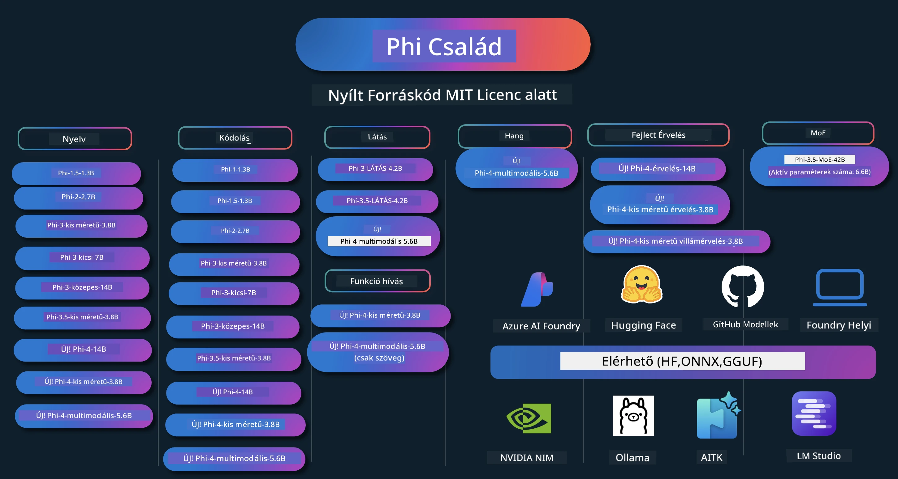

# Phi CookBook: Gyakorlati példák a Microsoft Phi modelleivel

[](https://codespaces.new/microsoft/phicookbook)
[](https://vscode.dev/redirect?url=vscode://ms-vscode-remote.remote-containers/cloneInVolume?url=https://github.com/microsoft/phicookbook)

[](https://GitHub.com/microsoft/phicookbook/graphs/contributors/?WT.mc_id=aiml-137032-kinfeylo)
[](https://GitHub.com/microsoft/phicookbook/issues/?WT.mc_id=aiml-137032-kinfeylo)
[](https://GitHub.com/microsoft/phicookbook/pulls/?WT.mc_id=aiml-137032-kinfeylo)
[](http://makeapullrequest.com?WT.mc_id=aiml-137032-kinfeylo)

[](https://GitHub.com/microsoft/phicookbook/watchers/?WT.mc_id=aiml-137032-kinfeylo)
[](https://GitHub.com/microsoft/phicookbook/network/?WT.mc_id=aiml-137032-kinfeylo)
[](https://GitHub.com/microsoft/phicookbook/stargazers/?WT.mc_id=aiml-137032-kinfeylo)

[](https://discord.com/invite/ByRwuEEgH4)

A Phi egy nyílt forráskódú MI modellek sorozata, amelyet a Microsoft fejlesztett ki.

A Phi jelenleg a legerősebb és legköltséghatékonyabb kis nyelvi modell (SLM), nagyon jó teljesítménymutatókkal rendelkezik többnyelvűség, érvelés, szöveg/csevegés generálás, kódolás, képek, hang és egyéb forgatókönyvek terén.

Telepítheti a Phi-t a felhőbe vagy élő eszközökre, és könnyedén építhet generatív MI alkalmazásokat korlátozott számítási kapacitással.

Kövesse az alábbi lépéseket az erőforrás használatának megkezdéséhez:
1. **Repository fork-olása**: Kattintson [](https://GitHub.com/microsoft/phicookbook/network/?WT.mc_id=aiml-137032-kinfeylo)
2. **Repository klónozása**:   `git clone https://github.com/microsoft/PhiCookBook.git`
3. [**Csatlakozzon a Microsoft AI Discord közösségéhez, és ismerkedjen meg szakértőkkel és fejlesztőtársakkal**](https://discord.com/invite/ByRwuEEgH4?WT.mc_id=aiml-137032-kinfeylo)



### 🌐 Többnyelvű támogatás

#### GitHub Action segítségével támogatott (Automatikus és mindig naprakész)

<!-- CO-OP TRANSLATOR LANGUAGES TABLE START -->
[Arab](../ar/README.md) | [Bengáli](../bn/README.md) | [Bolgár](../bg/README.md) | [Burmai (Myanmar)](../my/README.md) | [Kínai (Egyszerűsített)](../zh-CN/README.md) | [Kínai (Hagyományos, Hong Kong)](../zh-HK/README.md) | [Kínai (Hagyományos, Makaó)](../zh-MO/README.md) | [Kínai (Hagyományos, Tajvan)](../zh-TW/README.md) | [Horvát](../hr/README.md) | [Cseh](../cs/README.md) | [Dán](../da/README.md) | [Holland](../nl/README.md) | [Észt](../et/README.md) | [Finn](../fi/README.md) | [Francia](../fr/README.md) | [Német](../de/README.md) | [Görög](../el/README.md) | [Hebrew](../he/README.md) | [Hindi](../hi/README.md) | [Magyar](./README.md) | [Indonéz](../id/README.md) | [Olasz](../it/README.md) | [Japán](../ja/README.md) | [Kannada](../kn/README.md) | [Koreai](../ko/README.md) | [Litván](../lt/README.md) | [Maláj](../ms/README.md) | [Malayalam](../ml/README.md) | [Marathi](../mr/README.md) | [Nepáli](../ne/README.md) | [Nigériai Pidgin](../pcm/README.md) | [Norvég](../no/README.md) | [Perzsa (Fárszi)](../fa/README.md) | [Lengyel](../pl/README.md) | [Portugál (Brazília)](../pt-BR/README.md) | [Portugál (Portugália)](../pt-PT/README.md) | [Pandzsábi (Gurmukhi)](../pa/README.md) | [Román](../ro/README.md) | [Orosz](../ru/README.md) | [Szerb (K cirill írás)](../sr/README.md) | [Szlovák](../sk/README.md) | [Szlovén](../sl/README.md) | [Spanyol](../es/README.md) | [Szuahéli](../sw/README.md) | [Svéd](../sv/README.md) | [Tagalog (Filippínó)](../tl/README.md) | [Tamil](../ta/README.md) | [Telugu](../te/README.md) | [Thai](../th/README.md) | [Török](../tr/README.md) | [Ukrán](../uk/README.md) | [Urdu](../ur/README.md) | [Vietnami](../vi/README.md)

> **Inkább lokálisan klónozná?**
>
> Ez a repository több mint 50 nyelvi fordítást tartalmaz, ami jelentősen megnöveli a letöltési méretet. Ha fordítások nélkül szeretné klónozni, használja a sparse checkout-ot:
>
> **Bash / macOS / Linux:**
> ```bash
> git clone --filter=blob:none --sparse https://github.com/microsoft/PhiCookBook.git
> cd PhiCookBook
> git sparse-checkout set --no-cone '/*' '!translations' '!translated_images'
> ```
>
> **CMD (Windows):**
> ```cmd
> git clone --filter=blob:none --sparse https://github.com/microsoft/PhiCookBook.git
> cd PhiCookBook
> git sparse-checkout set --no-cone "/*" "!translations" "!translated_images"
> ```
>
> Ez mindent tartalmaz, amire szüksége van a kurzus teljesítéséhez, sokkal gyorsabb letöltéssel.
<!-- CO-OP TRANSLATOR LANGUAGES TABLE END -->

## Tartalomjegyzék

- Bevezetés
  - [Üdv a Phi családban](./md/01.Introduction/01/01.PhiFamily.md)
  - [Környezet beállítása](./md/01.Introduction/01/01.EnvironmentSetup.md)
  - [A kulcstechnológiák megértése](./md/01.Introduction/01/01.Understandingtech.md)
  - [MI biztonság a Phi modellek számára](./md/01.Introduction/01/01.AISafety.md)
  - [Phi hardvertámogatás](./md/01.Introduction/01/01.Hardwaresupport.md)
  - [Phi modellek és elérhetőség platformok között](./md/01.Introduction/01/01.Edgeandcloud.md)
  - [Guidance-ai és Phi használata](./md/01.Introduction/01/01.Guidance.md)
  - [GitHub Marketplace Modellek](https://github.com/marketplace/models)
  - [Azure AI Model Katalógus](https://ai.azure.com)

- Phi különböző környezetekben való használata
    -  [Hugging face](./md/01.Introduction/02/01.HF.md)
    -  [GitHub Modellek](./md/01.Introduction/02/02.GitHubModel.md)
    -  [Microsoft Foundry Model Katalógus](./md/01.Introduction/02/03.AzureAIFoundry.md)
    -  [Ollama](./md/01.Introduction/02/04.Ollama.md)
    -  [AI Toolkit VSCode (AITK)](./md/01.Introduction/02/05.AITK.md)
    -  [NVIDIA NIM](./md/01.Introduction/02/06.NVIDIA.md)
    -  [Foundry helyi](./md/01.Introduction/02/07.FoundryLocal.md)

- Phi család használata
    - [Phi használata iOS-en](./md/01.Introduction/03/iOS_Inference.md)
    - [Phi használata Androidon](./md/01.Introduction/03/Android_Inference.md)
    - [Phi használata Jetsonon](./md/01.Introduction/03/Jetson_Inference.md)
    - [Phi használata AI PC-n](./md/01.Introduction/03/AIPC_Inference.md)
    - [Phi használata Apple MLX Framework-kel](./md/01.Introduction/03/MLX_Inference.md)
    - [Phi használata helyi szerveren](./md/01.Introduction/03/Local_Server_Inference.md)
    - [Phi használata távoli szerveren AI Toolkit segítségével](./md/01.Introduction/03/Remote_Interence.md)
    - [Phi használata Rust-tal](./md/01.Introduction/03/Rust_Inference.md)
    - [Phi--Vision helyi használata](./md/01.Introduction/03/Vision_Inference.md)
    - [Phi használata Kaito AKS, Azure Containers-szel (hivatalos támogatás)](./md/01.Introduction/03/Kaito_Inference.md)
-  [Phi család kvantálása](./md/01.Introduction/04/QuantifyingPhi.md)
    - [Phi-3.5 / 4 kvantálása llama.cpp-vel](./md/01.Introduction/04/UsingLlamacppQuantifyingPhi.md)
    - [Phi-3.5 / 4 kvantálása generatív MI kiterjesztésekkel onnxruntime-hoz](./md/01.Introduction/04/UsingORTGenAIQuantifyingPhi.md)
    - [Phi-3.5 / 4 kvantálása Intel OpenVINO-val](./md/01.Introduction/04/UsingIntelOpenVINOQuantifyingPhi.md)
    - [Phi-3.5 / 4 kvantálása Apple MLX Framework-kel](./md/01.Introduction/04/UsingAppleMLXQuantifyingPhi.md)

-  Phi értékelése
    - [Felelős MI](./md/01.Introduction/05/ResponsibleAI.md)
    - [Microsoft Foundry értékeléshez](./md/01.Introduction/05/AIFoundry.md)
    - [Promptflow használata értékelésre](./md/01.Introduction/05/Promptflow.md)
 
- RAG Azure AI Kereséssel
    - [Hogyan használjuk a Phi-4-mini és Phi-4-multimodal (RAG) modelleket Azure AI Kereséssel](https://github.com/microsoft/PhiCookBook/blob/main/code/06.E2E/E2E_Phi-4-RAG-Azure-AI-Search.ipynb)

- Phi alkalmazásfejlesztési példák
  - Szöveg és csevegés alkalmazások
    - Phi-4 példák 🆕
      - [📓] [Beszélgetés Phi-4-mini ONNX modellel](./md/02.Application/01.TextAndChat/Phi4/ChatWithPhi4ONNX/README.md)
      - [Beszélgetés helyi Phi-4 ONNX modellel .NET-ben](../../md/04.HOL/dotnet/src/LabsPhi4-Chat-01OnnxRuntime)
      - [Beszélgetés .NET konzolalkalmazásban Phi-4 ONNX-szel, Sementic Kernel használatával](../../md/04.HOL/dotnet/src/LabsPhi4-Chat-02SK)
    - Phi-3 / 3.5 példák
      - [Helyi chatbot böngészőben Phi3, ONNX Runtime Web és WebGPU segítségével](https://github.com/microsoft/onnxruntime-inference-examples/tree/main/js/chat)
      - [OpenVino Chat](./md/02.Application/01.TextAndChat/Phi3/E2E_OpenVino_Chat.md)
      - [Több modell - Interaktív Phi-3-mini és OpenAI Whisper](./md/02.Application/01.TextAndChat/Phi3/E2E_Phi-3-mini_with_whisper.md)
      - [MLFlow - Csomagoló építése és Phi-3 használata MLFlow-val](./md//02.Application/01.TextAndChat/Phi3/E2E_Phi-3-MLflow.md)
      - [Modelloptimalizálás - Hogyan optimalizáljuk a Phi-3-minimodellt ONNX Runtime Web-hez az Olive segítségével](https://github.com/microsoft/Olive/tree/main/examples/phi3)
      - [WinUI3 alkalmazás Phi-3 mini-4k-instruct-onnx-szal](https://github.com/microsoft/Phi3-Chat-WinUI3-Sample/)
      -[WinUI3 Többmodellű AI által támogatott jegyzetalkalmazás mintapéldája](https://github.com/microsoft/ai-powered-notes-winui3-sample)
      - [Egyéni Phi-3 modellek finomhangolása és integrálása Prompt flow-val](./md/02.Application/01.TextAndChat/Phi3/E2E_Phi-3-FineTuning_PromptFlow_Integration.md)
      - [Egyéni Phi-3 modellek finomhangolása és integrálása Prompt flow-val az Microsoft Foundryban](./md/02.Application/01.TextAndChat/Phi3/E2E_Phi-3-FineTuning_PromptFlow_Integration_AIFoundry.md)
      - [Fiomhangolt Phi-3 / Phi-3.5 modell értékelése az Microsoft Foundryban, különös tekintettel a Microsoft felelős AI elveire](./md/02.Application/01.TextAndChat/Phi3/E2E_Phi-3-Evaluation_AIFoundry.md)
      - [📓] [Phi-3.5-mini-instruct nyelvi előrejelzési minta (kínai/angol)](./md/02.Application/01.TextAndChat/Phi3/phi3-instruct-demo.ipynb)
      - [Phi-3.5-Instruct WebGPU RAG Chatbot](./md/02.Application/01.TextAndChat/Phi3/WebGPUWithPhi35Readme.md)
      - [Windows GPU használata Prompt flow megoldás készítésére Phi-3.5-Instruct ONNX-szal](./md/02.Application/01.TextAndChat/Phi3/UsingPromptFlowWithONNX.md)
      - [Microsoft Phi-3.5 tflite használata Android alkalmazás létrehozásához](./md/02.Application/01.TextAndChat/Phi3/UsingPhi35TFLiteCreateAndroidApp.md)
      - [Kérdés-válasz .NET példa helyi ONNX Phi-3 modellel a Microsoft.ML.OnnxRuntime használatával](../../md/04.HOL/dotnet/src/LabsPhi301)
      - [Konzol chat .NET alkalmazás Semantic Kernel-lel és Phi-3-mal](../../md/04.HOL/dotnet/src/LabsPhi302)

  - Azure AI Inference SDK Kód alapú minták
    - Phi-4 Minták 🆕
      - [📓] [Projektkód generálása Phi-4-multimodal használatával](./md/02.Application/02.Code/Phi4/GenProjectCode/README.md)
    - Phi-3 / 3.5 Minták
      - [Építsd meg saját Visual Studio Code GitHub Copilot Chat-ed a Microsoft Phi-3 családdal](./md/02.Application/02.Code/Phi3/VSCodeExt/README.md)
      - [Készítsd el saját Visual Studio Code Chat Copilot ügynöködet Phi-3.5-tel GitHub modellekből](/md/02.Application/02.Code/Phi3/CreateVSCodeChatAgentWithGitHubModels.md)

  - Haladó Érvelési Minták
    - Phi-4 Minták 🆕
      - [📓] [Phi-4-mini-érvelés vagy Phi-4-érvelés minták](./md/02.Application/03.AdvancedReasoning/Phi4/AdvancedResoningPhi4mini/README.md)
      - [📓] [Phi-4-mini-érvelés finomhangolása Microsoft Olive-dzsel](./md/02.Application/03.AdvancedReasoning/Phi4/AdvancedResoningPhi4mini/olive_ft_phi_4_reasoning_with_medicaldata.ipynb)
      - [📓] [Phi-4-mini-érvelés finomhangolása Apple MLX-szel](./md/02.Application/03.AdvancedReasoning/Phi4/AdvancedResoningPhi4mini/mlx_ft_phi_4_reasoning_with_medicaldata.ipynb)
      - [📓] [Phi-4-mini-érvelés GitHub modellekkel](./md/02.Application/02.Code/Phi4r/github_models_inference.ipynb)
      - [📓] [Phi-4-mini-érvelés Microsoft Foundry modellekkel](./md/02.Application/02.Code/Phi4r/azure_models_inference.ipynb)
  - Bemutatók
      - [Phi-4-mini demo a Hugging Face Spaces-en](https://huggingface.co/spaces/microsoft/phi-4-mini?WT.mc_id=aiml-137032-kinfeylo)
      - [Phi-4-multimodal demo a Hugging Face Spaces-en](https://huggingface.co/spaces/microsoft/phi-4-multimodal?WT.mc_id=aiml-137032-kinfeylo)
  - Víziós Minták
    - Phi-4 Minták 🆕
      - [📓] [Használj Phi-4-multimodalt képek olvasására és kód generálására](./md/02.Application/04.Vision/Phi4/CreateFrontend/README.md) 
    - Phi-3 / 3.5 Minták
      -  [📓][Phi-3-látás Kép szövegből szövegbe](./md/02.Application/04.Vision/Phi3/E2E_Phi-3-vision-image-text-to-text-online-endpoint.ipynb)
      - [Phi-3-látás ONNX](https://onnxruntime.ai/docs/genai/tutorials/phi3-v.html)
      - [📓][Phi-3-látás CLIP beágyazás](./md/02.Application/04.Vision/Phi3/E2E_Phi-3-vision-image-text-to-text-online-endpoint.ipynb)
      - [BEMUTATÓ: Phi-3 Újrahasznosítás](https://github.com/jennifermarsman/PhiRecycling/)
      - [Phi-3-látás - Vizális nyelvi asszisztens - Phi3-Vision és OpenVINO használatával](https://docs.openvino.ai/nightly/notebooks/phi-3-vision-with-output.html)
      - [Phi-3 Vision Nvidia NIM](./md/02.Application/04.Vision/Phi3/E2E_Nvidia_NIM_Vision.md)
      - [Phi-3 Vision OpenVino](./md/02.Application/04.Vision/Phi3/E2E_OpenVino_Phi3Vision.md)
      - [📓][Phi-3.5 Vision többkeretes vagy többkép minta](./md/02.Application/04.Vision/Phi3/phi3-vision-demo.ipynb)
      - [Phi-3 Vision helyi ONNX modell a Microsoft.ML.OnnxRuntime .NET segítségével](../../md/04.HOL/dotnet/src/LabsPhi303)
      - [Menüből vezérelt Phi-3 Vision helyi ONNX modell a Microsoft.ML.OnnxRuntime .NET segítségével](../../md/04.HOL/dotnet/src/LabsPhi304)

  - Matematikai Minták
    -  Phi-4-Mini-Flash-Reasoning-Instruct minták 🆕 [Matematikai demó Phi-4-Mini-Flash-Reasoning-Instruct-tel](./md/02.Application/09.Math/MathDemo.ipynb)

  - Hang Minták
    - Phi-4 Minták 🆕
      - [📓] [Hangátiratok kinyerése Phi-4-multimodallal](./md/02.Application/05.Audio/Phi4/Transciption/README.md)
      - [📓] [Phi-4-multimodális hangminta](./md/02.Application/05.Audio/Phi4/Siri/demo.ipynb)
      - [📓] [Phi-4-multimodális beszédfordítás minta](./md/02.Application/05.Audio/Phi4/Translate/demo.ipynb)
      - [.NET konzol alkalmazás Phi-4-multimodális hangfájl elemzésére és átírás készítésére](../../md/04.HOL/dotnet/src/LabsPhi4-MultiModal-02Audio)

  - MOE Minták
    - Phi-3 / 3.5 Minták
      - [📓] [Phi-3.5 Szakterületek keveréke modellek (MoEs) közösségi média minta](./md/02.Application/06.MoE/Phi3/phi3_moe_demo.ipynb)
      - [📓] [Visszakereséssel bővített generációs (RAG) folyamat építése NVIDIA NIM Phi-3 MOE, Azure AI Search, és LlamaIndex segítségével](./md/02.Application/06.MoE/Phi3/azure-ai-search-nvidia-rag.ipynb)
      - 
  - Függvényhívás Minták
    - Phi-4 Minták 🆕
      -  [📓] [Függvényhívás használata Phi-4-mini esetén](./md/02.Application/07.FunctionCalling/Phi4/FunctionCallingBasic/README.md)
      -  [📓] [Függvényhívás használata több ügynök létrehozásához Phi-4-mini esetén](./md/02.Application/07.FunctionCalling/Phi4/Multiagents/Phi_4_mini_multiagent.ipynb)
      -  [📓] [Függvényhívás használata Ollama-val](./md/02.Application/07.FunctionCalling/Phi4/Ollama/ollama_functioncalling.ipynb)
      -  [📓] [Függvényhívás használata ONNX-szal](./md/02.Application/07.FunctionCalling/Phi4/ONNX/onnx_parallel_functioncalling.ipynb)
  - Többmodalitású keverés minták
    - Phi-4 Minták 🆕
      -  [📓] [Phi-4-multimodális használata technológiai újságíróként](./md/02.Application/08.Multimodel/Phi4/TechJournalist/phi_4_mm_audio_text_publish_news.ipynb)
      - [.NET konzol alkalmazás Phi-4-multimodális képelemzéshez](../../md/04.HOL/dotnet/src/LabsPhi4-MultiModal-01Images)

- Phi finomhangolás minták
  - [Finomhangolási forgatókönyvek](./md/03.FineTuning/FineTuning_Scenarios.md)
  - [Finomhangolás vs RAG](./md/03.FineTuning/FineTuning_vs_RAG.md)
  - [Hagyd, hogy a Phi-3 iparági szakértővé váljon](./md/03.FineTuning/LetPhi3gotoIndustriy.md)
  - [Phi-3 finomhangolása AI Toolkit for VS Code-dal](./md/03.FineTuning/Finetuning_VSCodeaitoolkit.md)
  - [Phi-3 finomhangolása Azure Machine Learning Service-szel](./md/03.FineTuning/Introduce_AzureML.md)
  - [Phi-3 finomhangolása Lora-val](./md/03.FineTuning/FineTuning_Lora.md)
  - [Phi-3 finomhangolása QLora-val](./md/03.FineTuning/FineTuning_Qlora.md)
  - [Phi-3 finomhangolása Microsoft Foundry-val](./md/03.FineTuning/FineTuning_AIFoundry.md)
  - [Phi-3 finomhangolása Azure ML CLI/SDK-val](./md/03.FineTuning/FineTuning_MLSDK.md)
  - [Finomhangolás Microsoft Olive segítségével](./md/03.FineTuning/FineTuning_MicrosoftOlive.md)
  - [Microsoft Olive kézzel fogható laboratórium](./md/03.FineTuning/olive-lab/readme.md)
  - [Phi-3-látás finomhangolása Weights and Bias-dzsel](./md/03.FineTuning/FineTuning_Phi-3-visionWandB.md)
  - [Phi-3 finomhangolása Apple MLX Frameworkkel](./md/03.FineTuning/FineTuning_MLX.md)
  - [Phi-3-látás finomhangolása (hivatalos támogatás)](./md/03.FineTuning/FineTuning_Vision.md)
  - [Phi-3 finomhangolása Kaito AKS és Azure konténerek (hivatalos támogatás)](./md/03.FineTuning/FineTuning_Kaito.md)
  - [Phi-3 és 3.5 Vision finomhangolása](https://github.com/2U1/Phi3-Vision-Finetune)

- Gyakorlati laboratórium
  - [Élvonalbeli modellek felfedezése: LLM-ek, SLM-ek, helyi fejlesztés és még sok más](https://github.com/microsoft/aitour-exploring-cutting-edge-models)
  - [Az NLP potenciáljának felszabadítása: finomhangolás Microsoft Olive segítségével](https://github.com/azure/Ignite_FineTuning_workshop)
- Tudományos kutatási tanulmányok és közlemények
  - [Csak tankönyvekre van szükség II: phi-1.5 technikai jelentés](https://arxiv.org/abs/2309.05463)
  - [Phi-3 technikai jelentés: Egy rendkívül képzett nyelvi modell helyileg a telefonodon](https://arxiv.org/abs/2404.14219)
  - [Phi-4 technikai jelentés](https://arxiv.org/abs/2412.08905)
  - [Phi-4-Mini technikai jelentés: Kompakt, de erős multimodális nyelvi modellek Mixture-of-LoRAs segítségével](https://arxiv.org/abs/2503.01743)
  - [Kis nyelvi modellek optimalizálása járműben történő funkcióhívásra](https://arxiv.org/abs/2501.02342)
  - [(WhyPHI) A PHI-3 finomhangolása feleletválasztós kérdés-válasz feladatra: módszertan, eredmények és kihívások](https://arxiv.org/abs/2501.01588)
  - [Phi-4-oktatás technikai jelentés](https://www.microsoft.com/en-us/research/wp-content/uploads/2025/04/phi_4_reasoning.pdf)
  - [Phi-4-mini-oktatás technikai jelentés](https://huggingface.co/microsoft/Phi-4-mini-reasoning/blob/main/Phi-4-Mini-Reasoning.pdf)

## Phi modellek használata

### Phi az Microsoft Foundry-ban

Megtanulhatod, hogyan kell használni a Microsoft Phi-t és hogyan lehet E2E megoldásokat építeni különböző hardvereszközeiden. Ahhoz, hogy megtapasztald Phi-t, kezdj el játszani a modellekkel, és testre szabhatod Phi-t a saját eseteidhez a [Microsoft Foundry Azure AI Model Catalog](https://aka.ms/phi3-azure-ai) segítségével. További információkat találsz a [Getting Started with Microsoft Foundry](/md/02.QuickStart/AzureAIFoundry_QuickStart.md) dokumentumban.

**Játszótér**  
Minden modellhez tartozik egy dedikált játszótér a modell tesztelésére: [Azure AI Playground](https://aka.ms/try-phi3).

### Phi a GitHub modelleken

Megtanulhatod, hogyan kell használni a Microsoft Phi-t és hogyan lehet E2E megoldásokat építeni különböző hardvereszközeiden. Ahhoz, hogy megtapasztald Phi-t, kezdj el játszani a modellel, és testre szabhatod Phi-t a saját eseteidhez a [GitHub Model Catalog](https://github.com/marketplace/models?WT.mc_id=aiml-137032-kinfeylo) segítségével. További információkat találsz a [Getting Started with GitHub Model Catalog](/md/02.QuickStart/GitHubModel_QuickStart.md) dokumentumban.

**Játszótér**  
Minden modellhez tartozik egy dedikált [játszótér a modell teszteléséhez](/md/02.QuickStart/GitHubModel_QuickStart.md).

### Phi a Hugging Face-en

A modellt megtalálhatod a [Hugging Face-en](https://huggingface.co/microsoft) is.

**Játszótér**  
[Hugging Chat játszótér](https://huggingface.co/chat/models/microsoft/Phi-3-mini-4k-instruct)

## 🎒 Egyéb tanfolyamok

Csapatunk más tanfolyamokat is készít! Nézd meg:

<!-- CO-OP TRANSLATOR OTHER COURSES START -->
### LangChain
[](https://aka.ms/langchain4j-for-beginners)
[](https://aka.ms/langchainjs-for-beginners?WT.mc_id=m365-94501-dwahlin)
[](https://github.com/microsoft/langchain-for-beginners?WT.mc_id=m365-94501-dwahlin)
---

### Azure / Edge / MCP / Ügynökök
[](https://github.com/microsoft/AZD-for-beginners?WT.mc_id=academic-105485-koreyst)
[](https://github.com/microsoft/edgeai-for-beginners?WT.mc_id=academic-105485-koreyst)
[](https://github.com/microsoft/mcp-for-beginners?WT.mc_id=academic-105485-koreyst)
[](https://github.com/microsoft/ai-agents-for-beginners?WT.mc_id=academic-105485-koreyst)

---
 
### Generatív AI sorozat
[](https://github.com/microsoft/generative-ai-for-beginners?WT.mc_id=academic-105485-koreyst)
[-9333EA?style=for-the-badge&labelColor=E5E7EB&color=9333EA)](https://github.com/microsoft/Generative-AI-for-beginners-dotnet?WT.mc_id=academic-105485-koreyst)
[-C084FC?style=for-the-badge&labelColor=E5E7EB&color=C084FC)](https://github.com/microsoft/generative-ai-for-beginners-java?WT.mc_id=academic-105485-koreyst)
[-E879F9?style=for-the-badge&labelColor=E5E7EB&color=E879F9)](https://github.com/microsoft/generative-ai-with-javascript?WT.mc_id=academic-105485-koreyst)

---
 
### Alapvető tanulás
[](https://aka.ms/ml-beginners?WT.mc_id=academic-105485-koreyst)
[](https://aka.ms/datascience-beginners?WT.mc_id=academic-105485-koreyst)
[](https://aka.ms/ai-beginners?WT.mc_id=academic-105485-koreyst)
[](https://github.com/microsoft/Security-101?WT.mc_id=academic-96948-sayoung)
[](https://aka.ms/webdev-beginners?WT.mc_id=academic-105485-koreyst)
[](https://aka.ms/iot-beginners?WT.mc_id=academic-105485-koreyst)
[](https://github.com/microsoft/xr-development-for-beginners?WT.mc_id=academic-105485-koreyst)

---
 
### Copilot sorozat
[](https://aka.ms/GitHubCopilotAI?WT.mc_id=academic-105485-koreyst)
[](https://github.com/microsoft/mastering-github-copilot-for-dotnet-csharp-developers?WT.mc_id=academic-105485-koreyst)
[](https://github.com/microsoft/CopilotAdventures?WT.mc_id=academic-105485-koreyst)
<!-- CO-OP TRANSLATOR OTHER COURSES END -->

## Felelős mesterséges intelligencia

A Microsoft elkötelezett abban, hogy ügyfeleink felelősségteljesen használják az AI termékeinket, megosszák tapasztalataikat, és bizalomra épülő partnerségeket építsenek olyan eszközökön keresztül, mint a Transzparencia jegyzetek és Hatásbecslések. Ezeknek a forrásoknak sok megtalálható a [https://aka.ms/RAI](https://aka.ms/RAI) oldalon.  
A Microsoft felelős AI-hoz való megközelítése az AI elveinken alapul: méltányosság, megbízhatóság és biztonság, adatvédelem és biztonság, befogadás, átláthatóság és elszámoltathatóság.

A nagy léptékű természetes nyelvi, képi és hangmodellek - mint amilyenek ebben a mintában is használatosak - potenciálisan olyan viselkedést tanúsíthatnak, ami méltánytalan, megbízhatatlan vagy sértő lehet, ami károkat okozhat. Kérjük, tekintsd meg az [Azure OpenAI szolgáltatás transzparencia jegyzetét](https://learn.microsoft.com/legal/cognitive-services/openai/transparency-note?tabs=text), hogy tájékozódj a kockázatokról és korlátokról.

Az ajánlott megközelítés ezen kockázatok csökkentésére, hogy építs be egy biztonsági rendszert az architektúrádba, amely képes felismerni és megakadályozni a káros viselkedést. Az [Azure AI Content Safety](https://learn.microsoft.com/azure/ai-services/content-safety/overview) egy független védelmi réteget nyújt, amely képes felismerni a káros, felhasználó vagy AI által generált tartalmakat alkalmazásokban és szolgáltatásokban. Az Azure AI Content Safety tartalmaz szöveg- és képi API-kat, amelyek lehetővé teszik káros anyagok észlelését. Az Microsoft Foundry-n belül a Content Safety szolgáltatás lehetővé teszi, hogy megtekintsd, felfedezd és kipróbáld a mintakódokat a különböző modalitások káros tartalmainak felismerésére. A következő [gyorstalpaló dokumentáció](https://learn.microsoft.com/azure/ai-services/content-safety/quickstart-text?tabs=visual-studio%2Clinux&pivots=programming-language-rest) végigvezet a szolgáltatásnak tett kérelmek elkészítésén.
Egy másik szempont, amit figyelembe kell venni, az az alkalmazás általános teljesítménye. Többmódusú és többmodelles alkalmazások esetén a teljesítmény alatt azt értjük, hogy a rendszer úgy működik, ahogyan Ön és felhasználói elvárják, beleértve azt is, hogy nem generál káros kimeneteket. Fontos az alkalmazás általános teljesítményének értékelése a [Teljesítmény és Minőség, valamint Kockázat és Biztonság értékelők](https://learn.microsoft.com/azure/ai-studio/concepts/evaluation-metrics-built-in) segítségével. Lehetősége van továbbá egyedi értékelők létrehozására és használatára is a [saját értékelők](https://learn.microsoft.com/azure/ai-studio/how-to/develop/evaluate-sdk#custom-evaluators) révén.

Fejlesztési környezetében az [Azure AI Evaluation SDK](https://microsoft.github.io/promptflow/index.html) segítségével értékelheti AI alkalmazását. Legyen szó tesztadat-készletről vagy célpontokról, generatív AI alkalmazásának generációi mennyiségileg mérhetők beépített vagy egyedi értékelőkkel. Ha el szeretne kezdeni dolgozni az azure ai evaluation sdk-val rendszere értékeléséhez, követheti a [gyorsindító útmutatót](https://learn.microsoft.com/azure/ai-studio/how-to/develop/flow-evaluate-sdk). Értékelés lefuttatása után [az eredményeket az Microsoft Foundry-ban megjelenítheti](https://learn.microsoft.com/azure/ai-studio/how-to/evaluate-flow-results). 

## Védjegyek

Ez a projekt tartalmazhat védjegyeket vagy logókat projektekhez, termékekhez vagy szolgáltatásokhoz. A Microsoft védjegyek vagy logók jogosult használata alá van vetve és követnie kell a [Microsoft Védjegy- és Márka Útmutatóját](https://www.microsoft.com/legal/intellectualproperty/trademarks/usage/general).
A Microsoft védjegyek vagy logók módosított változatokban történő használata nem okozhat félreértést vagy nem utalhat a Microsoft támogatására. Harmadik fél védjegyeinek vagy logóinak használata a harmadik fél irányelveinek megfelelő.

## Segítségkérés

Ha elakad vagy kérdése van az AI alkalmazások fejlesztésével kapcsolatban, csatlakozzon:

[](https://aka.ms/foundry/discord)

Ha termékhez kapcsolódó visszajelzése vagy hibája van fejlesztés közben, látogassa meg:

[](https://aka.ms/foundry/forum)

---

<!-- CO-OP TRANSLATOR DISCLAIMER START -->
**Nyilatkozat**:
Ez a dokumentum az AI fordító szolgáltatás, a [Co-op Translator](https://github.com/Azure/co-op-translator) segítségével készült. Bár igyekszünk pontos fordítást nyújtani, kérjük, vegye figyelembe, hogy az automatikus fordítások tartalmazhatnak hibákat vagy pontatlanságokat. Az eredeti dokumentum, annak anyanyelvén, tekintendő hiteles forrásnak. Kritikus információk esetén javasolt a professzionális, emberi fordítás igénybevétele. Nem vállalunk felelősséget az ebből eredő félreértésekért vagy félrefordításokért.
<!-- CO-OP TRANSLATOR DISCLAIMER END -->