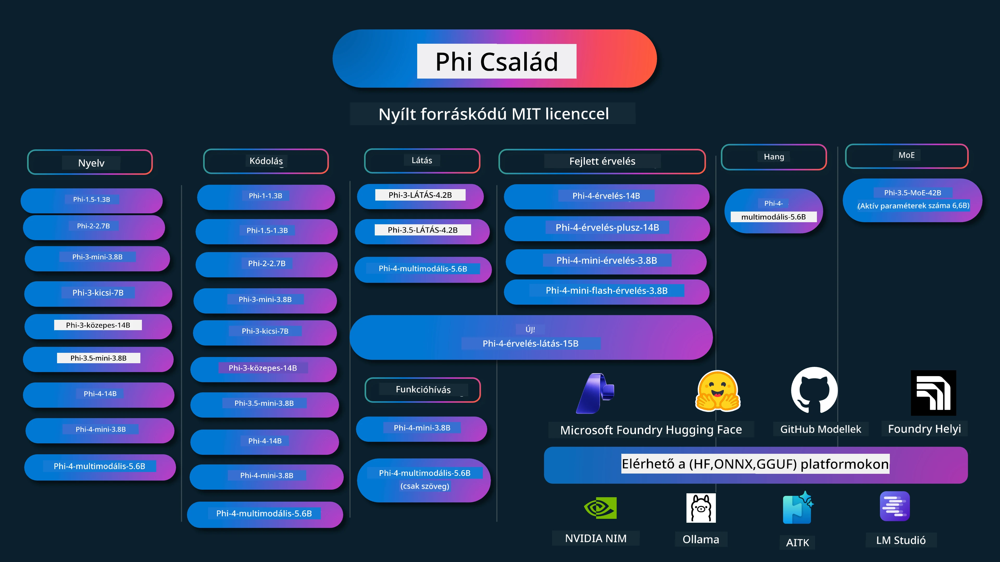

# Phi Cookbook: Gyakorlati példák a Microsoft Phi modelljeivel

[](https://codespaces.new/microsoft/phicookbook)
[](https://vscode.dev/redirect?url=vscode://ms-vscode-remote.remote-containers/cloneInVolume?url=https://github.com/microsoft/phicookbook)

[](https://GitHub.com/microsoft/phicookbook/graphs/contributors/?WT.mc_id=aiml-137032-kinfeylo)
[](https://GitHub.com/microsoft/phicookbook/issues/?WT.mc_id=aiml-137032-kinfeylo)
[](https://GitHub.com/microsoft/phicookbook/pulls/?WT.mc_id=aiml-137032-kinfeylo)
[](http://makeapullrequest.com?WT.mc_id=aiml-137032-kinfeylo)

[](https://GitHub.com/microsoft/phicookbook/watchers/?WT.mc_id=aiml-137032-kinfeylo)
[](https://GitHub.com/microsoft/phicookbook/network/?WT.mc_id=aiml-137032-kinfeylo)
[](https://GitHub.com/microsoft/phicookbook/stargazers/?WT.mc_id=aiml-137032-kinfeylo)

[](https://discord.com/invite/ByRwuEEgH4)

A Phi a Microsoft által fejlesztett nyílt forráskódú mesterséges intelligencia modellek sorozata.

A Phi jelenleg a legerősebb és költséghatékonyabb kis nyelvi modell (SLM), nagyon jó eredményekkel többnyelvűség, érvelés, szöveg/csevegés generálás, kódolás, képek, hang és egyéb alkalmazási területeken.

A Phit felhőbe vagy élő eszközökre telepítheted, és könnyedén építhetsz generatív AI alkalmazásokat korlátozott számítási kapacitással.

Kövesd az alábbi lépéseket a kezdéshez:
1. **Forkold a tárat**: Kattints [](https://GitHub.com/microsoft/phicookbook/network/?WT.mc_id=aiml-137032-kinfeylo)
2. **Klónozd a tárat**: `git clone https://github.com/microsoft/PhiCookBook.git`
3. [**Csatlakozz a Microsoft AI Discord közösséghez, és találkozz szakértőkkel és fejlesztőtársakkal**](https://discord.com/invite/ByRwuEEgH4?WT.mc_id=aiml-137032-kinfeylo)



### 🌐 Többnyelvű támogatás

#### GitHub Action (Automatizált és mindig naprakész) által támogatott

<!-- CO-OP TRANSLATOR LANGUAGES TABLE START -->
[Arabic](../ar/README.md) | [Bengali](../bn/README.md) | [Bulgár](../bg/README.md) | [Burmese (Myanmar)](../my/README.md) | [Kínai (Egyszerűsített)](../zh-CN/README.md) | [Kínai (Hagyományos, Hongkong)](../zh-HK/README.md) | [Kínai (Hagyományos, Makaó)](../zh-MO/README.md) | [Kínai (Hagyományos, Taiwan)](../zh-TW/README.md) | [Horvát](../hr/README.md) | [Cseh](../cs/README.md) | [Dán](../da/README.md) | [Holland](../nl/README.md) | [Észt](../et/README.md) | [Finn](../fi/README.md) | [Francia](../fr/README.md) | [Német](../de/README.md) | [Görög](../el/README.md) | [Hebrew](../he/README.md) | [Hindi](../hi/README.md) | [Magyar](./README.md) | [Indonéz](../id/README.md) | [Olasz](../it/README.md) | [Japán](../ja/README.md) | [Kannada](../kn/README.md) | [Khmer](../km/README.md) | [Koreai](../ko/README.md) | [Litván](../lt/README.md) | [Maláj](../ms/README.md) | [Malayalam](../ml/README.md) | [Marathi](../mr/README.md) | [Nepáli](../ne/README.md) | [Nigeriai Pidgin](../pcm/README.md) | [Norvég](../no/README.md) | [Perzsa (Farsi)](../fa/README.md) | [Lengyel](../pl/README.md) | [Portugál (Brazília)](../pt-BR/README.md) | [Portugál (Portugália)](../pt-PT/README.md) | [Pandzsábi (Gurmukhi)](../pa/README.md) | [Román](../ro/README.md) | [Orosz](../ru/README.md) | [Szerb (Cirill)](../sr/README.md) | [Szlovák](../sk/README.md) | [Szlovén](../sl/README.md) | [Spanyol](../es/README.md) | [Szuahéli](../sw/README.md) | [Svéd](../sv/README.md) | [Tagalog (Filippínó)](../tl/README.md) | [Tamil](../ta/README.md) | [Telugu](../te/README.md) | [Thai](../th/README.md) | [Török](../tr/README.md) | [Ukrán](../uk/README.md) | [Urdu](../ur/README.md) | [Vietnami](../vi/README.md)

> **Inkább helyileg klónoznád?**
>
> Ez a tár 50+ nyelvi fordítást tartalmaz, ami jelentősen megnöveli a letöltési méretet. Fordítások nélkül klónozáshoz használd a sparse checkout-ot:
>
> **Bash / macOS / Linux:**
> ```bash
> git clone --filter=blob:none --sparse https://github.com/microsoft/PhiCookBook.git
> cd PhiCookBook
> git sparse-checkout set --no-cone '/*' '!translations' '!translated_images'
> ```
>
> **CMD (Windows):**
> ```cmd
> git clone --filter=blob:none --sparse https://github.com/microsoft/PhiCookBook.git
> cd PhiCookBook
> git sparse-checkout set --no-cone "/*" "!translations" "!translated_images"
> ```
>
> Ez mindent biztosít, amire a kurzus teljesítéséhez szükséged van, sokkal gyorsabb letöltéssel.
<!-- CO-OP TRANSLATOR LANGUAGES TABLE END -->

## Tartalomjegyzék

- Bevezetés
  - [Üdvözlünk a Phi családban](./md/01.Introduction/01/01.PhiFamily.md)
  - [A környezet beállítása](./md/01.Introduction/01/01.EnvironmentSetup.md)
  - [A kulcstechnológiák megértése](./md/01.Introduction/01/01.Understandingtech.md)
  - [Mesterséges intelligencia biztonsága a Phi modellek esetén](./md/01.Introduction/01/01.AISafety.md)
  - [Phi hardver támogatás](./md/01.Introduction/01/01.Hardwaresupport.md)
  - [Phi modellek és elérhetőség a platformokon](./md/01.Introduction/01/01.Edgeandcloud.md)
  - [A Guidance-ai és Phinak a használata](./md/01.Introduction/01/01.Guidance.md)
  - [GitHub Marketplace modellek](https://github.com/marketplace/models)
  - [Azure AI modell katalógus](https://ai.azure.com)

- Phi használata különböző környezetekben
    -  [Hugging Face](./md/01.Introduction/02/01.HF.md)
    -  [GitHub modellek](./md/01.Introduction/02/02.GitHubModel.md)
    -  [Microsoft Foundry Modell Katalógus](./md/01.Introduction/02/03.AzureAIFoundry.md)
    -  [Ollama](./md/01.Introduction/02/04.Ollama.md)
    -  [AI Toolkit VSCode (AITK)](./md/01.Introduction/02/05.AITK.md)
    -  [NVIDIA NIM](./md/01.Introduction/02/06.NVIDIA.md)
    -  [Foundry helyi](./md/01.Introduction/02/07.FoundryLocal.md)

- Phi család használata
    - [Phi használata iOS-en](./md/01.Introduction/03/iOS_Inference.md)
    - [Phi használata Androidon](./md/01.Introduction/03/Android_Inference.md)
    - [Phi használata Jetsonon](./md/01.Introduction/03/Jetson_Inference.md)
    - [Phi használata AI PC-n](./md/01.Introduction/03/AIPC_Inference.md)
    - [Phi használata Apple MLX keretrendszerrel](./md/01.Introduction/03/MLX_Inference.md)
    - [Phi használata helyi szerveren](./md/01.Introduction/03/Local_Server_Inference.md)
    - [Phi használata távoli szerveren AI Toolkit-kel](./md/01.Introduction/03/Remote_Interence.md)
    - [Phi használata Rusttal](./md/01.Introduction/03/Rust_Inference.md)
    - [Phi látás használata helyben](./md/01.Introduction/03/Vision_Inference.md)
    - [Phi használata Kaito AKS, Azure Containers-szel (hivatalos támogatás)](./md/01.Introduction/03/Kaito_Inference.md)
-  [Phi család mennyiségi jellemzése](./md/01.Introduction/04/QuantifyingPhi.md)
    - [Phi-3.5 / 4 kvantálása llama.cpp-vel](./md/01.Introduction/04/UsingLlamacppQuantifyingPhi.md)
    - [Phi-3.5 / 4 kvantálása generatív AI bővítményekkel onnxruntime-hoz](./md/01.Introduction/04/UsingORTGenAIQuantifyingPhi.md)
    - [Phi-3.5 / 4 kvantálása Intel OpenVINO-val](./md/01.Introduction/04/UsingIntelOpenVINOQuantifyingPhi.md)
    - [Phi-3.5 / 4 kvantálása Apple MLX keretrendszerrel](./md/01.Introduction/04/UsingAppleMLXQuantifyingPhi.md)

-  Phi értékelése
    - [Felelős AI](./md/01.Introduction/05/ResponsibleAI.md)
    - [Microsoft Foundry az értékeléshez](./md/01.Introduction/05/AIFoundry.md)
    - [Promptflow használata értékeléshez](./md/01.Introduction/05/Promptflow.md)
 
- RAG Azure AI Search segítségével
    - [Hogyan használd Phi-4-mini és Phi-4-multimodal(RAG)-t Azure AI Search-csal](https://github.com/microsoft/PhiCookBook/blob/main/code/06.E2E/E2E_Phi-4-RAG-Azure-AI-Search.ipynb)
    - [Zero-Cloud helyi hibrid RAG SQLite FTS5-tel és phi-4-minivel](https://github.com/microsoft/PhiCookBook/blob/main/code/06.E2E/E2E_Phi-4-mini_Local_Hybrid_RAG_SQLite_FTS5.ipynb)

- Phi alkalmazásfejlesztési példák
  - Szöveg és Csevegés alkalmazások
    - Phi-4 példák
      - [📓] [Csevegj a Phi-4-mini ONNX modellel](./md/02.Application/01.TextAndChat/Phi4/ChatWithPhi4ONNX/README.md)
      - [Csevegés Phi-4 helyi ONNX modellel .NET-ben](../../md/04.HOL/dotnet/src/LabsPhi4-Chat-01OnnxRuntime)
      - [Csevegés .NET konzol alkalmazás Phi-4 ONNX használatával Sementic Kernellel](../../md/04.HOL/dotnet/src/LabsPhi4-Chat-02SK)

    - Phi-3 / 3.5 Példák
      - [Helyi chatbot a böngészőben Phi3, ONNX Runtime Web és WebGPU használatával](https://github.com/microsoft/onnxruntime-inference-examples/tree/main/js/chat)
      - [OpenVino Chat](./md/02.Application/01.TextAndChat/Phi3/E2E_OpenVino_Chat.md)
      - [Több modell - Interaktív Phi-3-mini és OpenAI Whisper](./md/02.Application/01.TextAndChat/Phi3/E2E_Phi-3-mini_with_whisper.md)
      - [MLFlow - Wrapper készítése és Phi-3 használata az MLFlow-val](./md//02.Application/01.TextAndChat/Phi3/E2E_Phi-3-MLflow.md)
      - [Modell optimalizálás - Hogyan optimalizáljuk a Phi-3-min modellt ONNX Runtime Webhez az Olive segítségével](https://github.com/microsoft/Olive/tree/main/examples/phi3)
      - [WinUI3 alkalmazás Phi-3 mini-4k-instruct-onnx-szal](https://github.com/microsoft/Phi3-Chat-WinUI3-Sample/)
      -[WinUI3 Többmodellű AI által vezérelt jegyzet alkalmazás példa](https://github.com/microsoft/ai-powered-notes-winui3-sample)
      - [Egyedi Phi-3 modellek finomhangolása és integrálása Prompt flow-val](./md/02.Application/01.TextAndChat/Phi3/E2E_Phi-3-FineTuning_PromptFlow_Integration.md)
      - [Egyedi Phi-3 modellek finomhangolása és integrálása Prompt flow-val a Microsoft Foundry-ban](./md/02.Application/01.TextAndChat/Phi3/E2E_Phi-3-FineTuning_PromptFlow_Integration_AIFoundry.md)
      - [A finomhangolt Phi-3 / Phi-3.5 modell értékelése a Microsoft Foundry-ban a Microsoft felelős MI elveire fókuszálva](./md/02.Application/01.TextAndChat/Phi3/E2E_Phi-3-Evaluation_AIFoundry.md)
      - [📓] [Phi-3.5-mini-instruct nyelvi előrejelző minta (kínai/angol)](./md/02.Application/01.TextAndChat/Phi3/phi3-instruct-demo.ipynb)
      - [Phi-3.5-Instruct WebGPU RAG chatbot](./md/02.Application/01.TextAndChat/Phi3/WebGPUWithPhi35Readme.md)
      - [Windows GPU használata Prompt flow megoldás létrehozásához Phi-3.5-Instruct ONNX-szal](./md/02.Application/01.TextAndChat/Phi3/UsingPromptFlowWithONNX.md)
      - [Microsoft Phi-3.5 tflite használata Android alkalmazás létrehozásához](./md/02.Application/01.TextAndChat/Phi3/UsingPhi35TFLiteCreateAndroidApp.md)
      - [Kérdések és válaszok .NET példa helyi ONNX Phi-3 modellel a Microsoft.ML.OnnxRuntime használatával](../../md/04.HOL/dotnet/src/LabsPhi301)
      - [Konzol chat .NET alkalmazás Semantic Kernel és Phi-3 használatával](../../md/04.HOL/dotnet/src/LabsPhi302)

  - Azure AI Inference SDK Kód alapú példák 
    - Phi-4 Példák 
      - [📓] [Projektkód generálása Phi-4-multimodálissal](./md/02.Application/02.Code/Phi4/GenProjectCode/README.md)
    - Phi-3 / 3.5 Példák
      - [Saját Visual Studio Code GitHub Copilot Chat építése a Microsoft Phi-3 családdal](./md/02.Application/02.Code/Phi3/VSCodeExt/README.md)
      - [Hozzon létre saját Visual Studio Code Chat Copilot ügynököt Phi-3.5-tel a GitHub modellek segítségével](/md/02.Application/02.Code/Phi3/CreateVSCodeChatAgentWithGitHubModels.md)

  - Haladó érvelési példák
    - Phi-4 Példák 
      - [📓] [Phi-4-mini-érvelési vagy Phi-4-érvelési példák](./md/02.Application/03.AdvancedReasoning/Phi4/AdvancedResoningPhi4mini/README.md)
      - [📓] [Phi-4-mini-érvelés finomhangolása Microsoft Olive segítségével](./md/02.Application/03.AdvancedReasoning/Phi4/AdvancedResoningPhi4mini/olive_ft_phi_4_reasoning_with_medicaldata.ipynb)
      - [📓] [Phi-4-mini-érvelés finomhangolása Apple MLX használatával](./md/02.Application/03.AdvancedReasoning/Phi4/AdvancedResoningPhi4mini/mlx_ft_phi_4_reasoning_with_medicaldata.ipynb)
      - [📓] [Phi-4-mini-érvelés GitHub modellekkel](./md/02.Application/02.Code/Phi4r/github_models_inference.ipynb)
      - [📓] [Phi-4-mini-érvelés Microsoft Foundry modellekkel](./md/02.Application/02.Code/Phi4r/azure_models_inference.ipynb)
  - Demók
      - [Phi-4-mini demók a Hugging Face Spaces-en](https://huggingface.co/spaces/microsoft/phi-4-mini?WT.mc_id=aiml-137032-kinfeylo)
      - [Phi-4-multimodális demók a Hugginge Face Spaces-en](https://huggingface.co/spaces/microsoft/phi-4-multimodal?WT.mc_id=aiml-137032-kinfeylo)
  - Vízió példák
    - Phi-4 Példák 
      - [📓] [Phi-4-multimodális képek olvasása és kód generálása](./md/02.Application/04.Vision/Phi4/CreateFrontend/README.md) 
    - Phi-3 / 3.5 Példák
      -  [📓][Phi-3-vízió Kép szöveghez szöveg online végpont](./md/02.Application/04.Vision/Phi3/E2E_Phi-3-vision-image-text-to-text-online-endpoint.ipynb)
      - [Phi-3-vízió-ONNX](https://onnxruntime.ai/docs/genai/tutorials/phi3-v.html)
      - [📓][Phi-3-vízió CLIP beágyazás](./md/02.Application/04.Vision/Phi3/E2E_Phi-3-vision-image-text-to-text-online-endpoint.ipynb)
      - [DEMÓ: Phi-3 Újrahasznosítás](https://github.com/jennifermarsman/PhiRecycling/)
      - [Phi-3-vízió - vizuális nyelvi asszisztens Phi3-Vision és OpenVINO segítségével](https://docs.openvino.ai/nightly/notebooks/phi-3-vision-with-output.html)
      - [Phi-3 Vision Nvidia NIM](./md/02.Application/04.Vision/Phi3/E2E_Nvidia_NIM_Vision.md)
      - [Phi-3 Vision OpenVino](./md/02.Application/04.Vision/Phi3/E2E_OpenVino_Phi3Vision.md)
      - [📓][Phi-3.5 Vision többkeretes vagy többképes minta](./md/02.Application/04.Vision/Phi3/phi3-vision-demo.ipynb)
      - [Phi-3 Vision helyi ONNX modell Microsoft.ML.OnnxRuntime .NET használatával](../../md/04.HOL/dotnet/src/LabsPhi303)
      - [Menü alapú Phi-3 Vision helyi ONNX modell Microsoft.ML.OnnxRuntime .NET használatával](../../md/04.HOL/dotnet/src/LabsPhi304)

  - Érvelés-Vízió példák
    - Phi-4-Érvelés-Vízió-15B 
      - [📓] [Phi-4-Érvelés-Vízió-15B használata tilos átkelés érzékelésére](./md/02.Application/10.ReasoningVision/Phi_4_reasoning_vision_15b_Jaywalking.ipynb)
      - [📓] [Phi-4-Érvelés-Vízió-15B használata matematikához](./md/02.Application/10.ReasoningVision/Phi_4_reasoning_vision_15b_Math.ipynb)
      - [📓] [Phi-4-Érvelés-Vízió-15B használata UI érzékelésére](./md/02.Application/10.ReasoningVision/Phi_4_reasoning_vision_15b_ui.ipynb)

  - Matematikai példák
    -  Phi-4-Mini-Flash-Érvelés-Irányított példák  [Matematikai demo Phi-4-Mini-Flash-Érvelés-Irányítottal](./md/02.Application/09.Math/MathDemo.ipynb)

  - Hang példák
    - Phi-4 Példák 
      - [📓] [Hangátiratok kinyerése Phi-4-multimodálissal](./md/02.Application/05.Audio/Phi4/Transciption/README.md)
      - [📓] [Phi-4-multimodális hang minta](./md/02.Application/05.Audio/Phi4/Siri/demo.ipynb)
      - [📓] [Phi-4-multimodális beszédfordítás minta](./md/02.Application/05.Audio/Phi4/Translate/demo.ipynb)
      - [.NET konzol alkalmazás Phi-4-multimodális hang fájl elemzésére és átirat készítésére](../../md/04.HOL/dotnet/src/LabsPhi4-MultiModal-02Audio)

  - MOE példák
    - Phi-3 / 3.5 Példák
      - [📓] [Phi-3.5 Szakértők keveréke modellek (MoE-k) közösségi média minta](./md/02.Application/06.MoE/Phi3/phi3_moe_demo.ipynb)
      - [📓] [Lekérés-alapú generálási (RAG) folyamat létrehozása NVIDIA NIM Phi-3 MOE, Azure AI Search és LlamaIndex segítségével](./md/02.Application/06.MoE/Phi3/azure-ai-search-nvidia-rag.ipynb)
      - 
  - Függvényhívás példák
    - Phi-4 Példák 🆕
      -  [📓] [Függvényhívás használata Phi-4-minivel](./md/02.Application/07.FunctionCalling/Phi4/FunctionCallingBasic/README.md)
      -  [📓] [Függvényhívás használata több ügynök létrehozásához Phi-4-minivel](./md/02.Application/07.FunctionCalling/Phi4/Multiagents/Phi_4_mini_multiagent.ipynb)
      -  [📓] [Függvényhívás használata Ollamával](./md/02.Application/07.FunctionCalling/Phi4/Ollama/ollama_functioncalling.ipynb)
      -  [📓] [Függvényhívás használata ONNX-szal](./md/02.Application/07.FunctionCalling/Phi4/ONNX/onnx_parallel_functioncalling.ipynb)
  - Multimodális keverési példák
    - Phi-4 Példák 🆕
      -  [📓] [Phi-4-multimodális használata technológiai újságíróként](./md/02.Application/08.Multimodel/Phi4/TechJournalist/phi_4_mm_audio_text_publish_news.ipynb)
      - [.NET konzol alkalmazás képek elemzésére Phi-4-multimodális használatával](../../md/04.HOL/dotnet/src/LabsPhi4-MultiModal-01Images)

- Phi finomhangolás
  - [Finomhangolási forgatókönyvek](./md/03.FineTuning/FineTuning_Scenarios.md)
  - [Finomhangolás vs RAG](./md/03.FineTuning/FineTuning_vs_RAG.md)
  - [Finomhangolás: Hagyjuk, hogy Phi-3 ipari szakértővé váljon](./md/03.FineTuning/LetPhi3gotoIndustriy.md)
  - [Phi-3 finomhangolása AI Toolkit for VS Code használatával](./md/03.FineTuning/Finetuning_VSCodeaitoolkit.md)
  - [Phi-3 finomhangolása Azure Machine Learning Service használatával](./md/03.FineTuning/Introduce_AzureML.md)
  - [Phi-3 finomhangolása Lora használatával](./md/03.FineTuning/FineTuning_Lora.md)
  - [Phi-3 finomhangolása QLora használatával](./md/03.FineTuning/FineTuning_Qlora.md)
  - [Phi-3 finomhangolása Microsoft Foundry-val](./md/03.FineTuning/FineTuning_AIFoundry.md)
  - [Phi-3 finomhangolása Azure ML CLI/SDK-val](./md/03.FineTuning/FineTuning_MLSDK.md)
  - [Finomhangolás Microsoft Olive használatával](./md/03.FineTuning/FineTuning_MicrosoftOlive.md)
  - [Finomhangolás Microsoft Olive gyakorlati laborral](./md/03.FineTuning/olive-lab/readme.md)
  - [Phi-3-vízió finomhangolása Weights and Bias segítségével](./md/03.FineTuning/FineTuning_Phi-3-visionWandB.md)

  - [Phi-3 finomhangolása az Apple MLX keretrendszerrel](./md/03.FineTuning/FineTuning_MLX.md)
  - [Phi-3-vision finomhangolása (hivatalos támogatás)](./md/03.FineTuning/FineTuning_Vision.md)
  - [Phi-3 finomhangolása Kaito AKS, Azure konténerekkel (hivatalos támogatás)](./md/03.FineTuning/FineTuning_Kaito.md)
  - [Phi-3 és 3.5 Vision finomhangolása](https://github.com/2U1/Phi3-Vision-Finetune)

- Gyakorlati labor
  - [Élvonalbeli modellek felfedezése: LLM-ek, SLM-ek, helyi fejlesztés és mások](https://github.com/microsoft/aitour-exploring-cutting-edge-models)
  - [Az NLP potenciáljának feltárása: finomhangolás a Microsoft Olive-dzsal](https://github.com/azure/Ignite_FineTuning_workshop)

- Tudományos kutatási cikkek és kiadványok
  - [Textbooks Are All You Need II: phi-1.5 műszaki jelentés](https://arxiv.org/abs/2309.05463)
  - [Phi-3 műszaki jelentés: Nagyon képzett nyelvi modell helyben a telefonodon](https://arxiv.org/abs/2404.14219)
  - [Phi-4 műszaki jelentés](https://arxiv.org/abs/2412.08905)
  - [Phi-4-Mini műszaki jelentés: Kompakt, mégis erőteljes multimodális nyelvi modellek Mixture-of-LoRAs segítségével](https://arxiv.org/abs/2503.01743)
  - [Kis nyelvi modellek optimalizálása járműfunkció-hívásokra](https://arxiv.org/abs/2501.02342)
  - [(WhyPHI) PHI-3 finomhangolása feleletválasztós kérdésekhez: módszertan, eredmények és kihívások](https://arxiv.org/abs/2501.01588)
  - [Phi-4-érvelés műszaki jelentés](https://www.microsoft.com/en-us/research/wp-content/uploads/2025/04/phi_4_reasoning.pdf)
  - [Phi-4-mini-érvelés műszaki jelentés](https://huggingface.co/microsoft/Phi-4-mini-reasoning/blob/main/Phi-4-Mini-Reasoning.pdf)

## Phi modellek használata

### Phi a Microsoft Foundry-n

Megtanulhatod, hogyan használd a Microsoft Phi-t, és hogyan építs végponttól végpontig (E2E) megoldásokat különböző hardvereszközeiden. Ha saját magad szeretnéd kipróbálni a Phit, kezdd azzal, hogy játszol a modellekkel és testre szabod a Phi-t a saját eseteidhez a [Microsoft Foundry Azure AI Model Catalog](https://aka.ms/phi3-azure-ai) segítségével. Többet megtudhatsz a Kezdés a [Microsoft Foundry-ral](/md/02.QuickStart/AzureAIFoundry_QuickStart.md) című dokumentumból.

**Játéktér**
Minden modellhez tartozik egy dedikált játéktér, ahol tesztelheted a modellt [Azure AI Playground](https://aka.ms/try-phi3).

### Phi a GitHub modelleken

Megtanulhatod, hogyan használd a Microsoft Phi-t, és hogyan építs E2E megoldásokat különböző hardvereszközeiden. Ha saját magad szeretnéd kipróbálni a Phit, kezdd azzal, hogy játszol a modellel és testre szabod a Phi-t a saját eseteidhez a [GitHub Model Catalog](https://github.com/marketplace/models?WT.mc_id=aiml-137032-kinfeylo) segítségével. Többet megtudhatsz a Kezdés a [GitHub Model Catalog]-val (/md/02.QuickStart/GitHubModel_QuickStart.md) című dokumentumból.

**Játéktér**
Minden modellhez tartozik egy dedikált [játéktér a modell teszteléséhez](/md/02.QuickStart/GitHubModel_QuickStart.md).

### Phi a Hugging Face-en

A modellt megtalálhatod a [Hugging Face-en](https://huggingface.co/microsoft)

**Játéktér**
 [Hugging Chat játéktér](https://huggingface.co/chat/models/microsoft/Phi-3-mini-4k-instruct)

 ## 🎒 Egyéb kurzusok

Csapatunk további kurzusokat is készít! Nézd meg:

<!-- CO-OP TRANSLATOR OTHER COURSES START -->
### LangChain
[](https://aka.ms/langchain4j-for-beginners)
[](https://aka.ms/langchainjs-for-beginners?WT.mc_id=m365-94501-dwahlin)
[](https://github.com/microsoft/langchain-for-beginners?WT.mc_id=m365-94501-dwahlin)
---

### Azure / Edge / MCP / Agents
[](https://github.com/microsoft/AZD-for-beginners?WT.mc_id=academic-105485-koreyst)
[](https://github.com/microsoft/edgeai-for-beginners?WT.mc_id=academic-105485-koreyst)
[](https://github.com/microsoft/mcp-for-beginners?WT.mc_id=academic-105485-koreyst)
[](https://github.com/microsoft/ai-agents-for-beginners?WT.mc_id=academic-105485-koreyst)

---
 
### Generatív AI sorozat
[](https://github.com/microsoft/generative-ai-for-beginners?WT.mc_id=academic-105485-koreyst)
[-9333EA?style=for-the-badge&labelColor=E5E7EB&color=9333EA)](https://github.com/microsoft/Generative-AI-for-beginners-dotnet?WT.mc_id=academic-105485-koreyst)
[-C084FC?style=for-the-badge&labelColor=E5E7EB&color=C084FC)](https://github.com/microsoft/generative-ai-for-beginners-java?WT.mc_id=academic-105485-koreyst)
[-E879F9?style=for-the-badge&labelColor=E5E7EB&color=E879F9)](https://github.com/microsoft/generative-ai-with-javascript?WT.mc_id=academic-105485-koreyst)

---
 
### Alapképzés
[](https://aka.ms/ml-beginners?WT.mc_id=academic-105485-koreyst)
[](https://aka.ms/datascience-beginners?WT.mc_id=academic-105485-koreyst)
[](https://aka.ms/ai-beginners?WT.mc_id=academic-105485-koreyst)
[](https://github.com/microsoft/Security-101?WT.mc_id=academic-96948-sayoung)
[](https://aka.ms/webdev-beginners?WT.mc_id=academic-105485-koreyst)
[](https://aka.ms/iot-beginners?WT.mc_id=academic-105485-koreyst)
[](https://github.com/microsoft/xr-development-for-beginners?WT.mc_id=academic-105485-koreyst)

---
 
### Copilot sorozat
[](https://aka.ms/GitHubCopilotAI?WT.mc_id=academic-105485-koreyst)
[](https://github.com/microsoft/mastering-github-copilot-for-dotnet-csharp-developers?WT.mc_id=academic-105485-koreyst)
[](https://github.com/microsoft/CopilotAdventures?WT.mc_id=academic-105485-koreyst)
<!-- CO-OP TRANSLATOR OTHER COURSES END -->

## Felelős MI

A Microsoft elkötelezett amellett, hogy ügyfeleinket felelősen támogassa MI termékeink használatában, megossza tanulságainkat és bizalmon alapuló partnerségeket építsen átláthatósági jegyzetek és hatásvizsgálatok segítségével. Ezeknek az erőforrásoknak sok megtalálható itt: [https://aka.ms/RAI](https://aka.ms/RAI).
A Microsoft felelős MI megközelítése az igazságosság, megbízhatóság és biztonság, adatvédelem és biztonság, befogadás, átláthatóság és elszámoltathatóság MI alapelveire épül.

Nagy méretű természetes nyelvi, képi és beszédmodellek - mint az ebben a mintában használtak - potenciálisan olyan viselkedést tanúsíthatnak, amely igazságtalan, megbízhatatlan vagy sértő, ami károkat okozhat. Kérjük, tekintsd meg az [Azure OpenAI szolgáltatás átláthatósági jegyzetét](https://learn.microsoft.com/legal/cognitive-services/openai/transparency-note?tabs=text), hogy tájékozódj a kockázatokról és korlátokról.


A kockázatok mérséklésére ajánlott megközelítés, hogy a rendszertervedbe beépítesz egy biztonsági rendszert, amely képes felismerni és megakadályozni a káros viselkedést. Az [Azure AI Content Safety](https://learn.microsoft.com/azure/ai-services/content-safety/overview) egy független védelmi réteget nyújt, amely képes felismerni a káros, felhasználók vagy mesterséges intelligencia által generált tartalmakat alkalmazásokban és szolgáltatásokban. Az Azure AI Content Safety szöveges és képi API-kat tartalmaz, amelyek lehetővé teszik a káros anyagok felismerését. A Microsoft Foundry keretén belül a Content Safety szolgáltatás lehetőséget ad arra, hogy megtekinthesd, felfedezd és kipróbáld a káros tartalmak különböző módokon történő felismerését bemutató mintakódokat. A következő [gyorsindítási dokumentáció](https://learn.microsoft.com/azure/ai-services/content-safety/quickstart-text?tabs=visual-studio%2Clinux&pivots=programming-language-rest) végigvezet a szolgáltatáshoz intézett kérések elkészítésén.

Egy másik figyelembe veendő szempont az alkalmazás teljesítménye általánosságban. Többmodalitású és többmodelles alkalmazások esetén a teljesítmény azt jelenti, hogy a rendszer úgy működik, ahogy te és a felhasználóid várják, ideértve azt is, hogy nem generál káros kimeneteket. Fontos felmérni az alkalmazás teljesítményét az [Teljesítmény és Minőség valamint Kockázat és Biztonságértékelők](https://learn.microsoft.com/azure/ai-studio/concepts/evaluation-metrics-built-in) használatával. Ezenkívül lehetőséged van [egyéni értékelők](https://learn.microsoft.com/azure/ai-studio/how-to/develop/evaluate-sdk#custom-evaluators) létrehozására és használatára is.

Az AI alkalmazásodat a fejlesztői környezetedben is értékelheted az [Azure AI Evaluation SDK](https://microsoft.github.io/promptflow/index.html) segítségével. Egy tesztadatkészlet vagy cél megadása esetén a generatív AI alkalmazásod generációit mennyiségi szempontból mérik beépített vagy általad választott egyéni értékelők. Az azure ai evaluation sdk-val való kezdéshez és a rendszer értékeléséhez követheted a [gyorsindítási útmutatót](https://learn.microsoft.com/azure/ai-studio/how-to/develop/flow-evaluate-sdk). Az értékelési futtatás után a [Microsoft Foundry-ban megtekintheted az eredményeket](https://learn.microsoft.com/azure/ai-studio/how-to/evaluate-flow-results).

## Védjegyek

Ez a projekt tartalmazhat projektek, termékek vagy szolgáltatások védjegyeit vagy logóit. A Microsoft védjegyeinek vagy logóinak jogosult használata a [Microsoft védjegy- és márka irányelveinek](https://www.microsoft.com/legal/intellectualproperty/trademarks/usage/general) követelményei szerint történhet.
A Microsoft védjegyek vagy logók használata módosított projektverziókban nem okozhat félreértést vagy azt, hogy a Microsoft támogatását sugallja. Harmadik fél védjegyeinek vagy logóinak bármilyen használata a harmadik fél szabályzataihoz kötött.

## Segítség kérése

Ha elakadsz vagy kérdésed van AI alkalmazások fejlesztésével kapcsolatban, csatlakozz:

[](https://aka.ms/foundry/discord)

Ha termék-visszajelzésed vagy hibák jelentkeznek a fejlesztés során, látogasd meg:

[](https://aka.ms/foundry/forum)

---

<!-- CO-OP TRANSLATOR DISCLAIMER START -->
**Jogi nyilatkozat**:
Ez a dokumentum az AI fordítási szolgáltatás, a [Co-op Translator](https://github.com/Azure/co-op-translator) segítségével készült. Bár az pontosságra törekszünk, kérjük, vegye figyelembe, hogy az automatikus fordítások hibákat vagy pontatlanságokat tartalmazhatnak. Az eredeti dokumentum az anyanyelvén tekintendő hiteles forrásnak. Fontos információk esetén professzionális emberi fordítást javasolunk. Nem vállalunk felelősséget semmilyen félreértésért vagy téves értelmezésért, amely ebből a fordításból ered.
<!-- CO-OP TRANSLATOR DISCLAIMER END -->