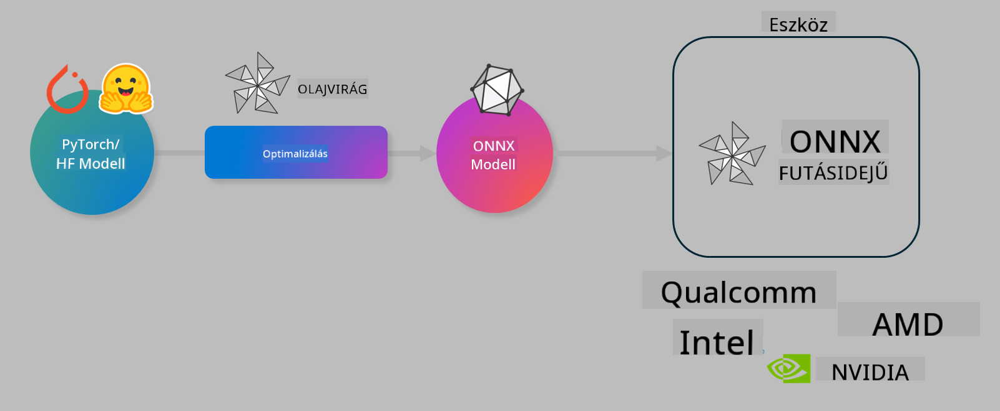

<!--
CO_OP_TRANSLATOR_METADATA:
{
  "original_hash": "6bbe47de3b974df7eea29dfeccf6032b",
  "translation_date": "2025-05-09T04:28:32+00:00",
  "source_file": "code/03.Finetuning/olive-lab/readme.md",
  "language_code": "hu"
}
-->
# Lab. AI modellek optimalizálása eszközön történő inferenciához

## Bevezetés

> [!IMPORTANT]  
> Ehhez a laborhoz **Nvidia A10 vagy A100 GPU** szükséges a megfelelő driverekkel és CUDA toolkit (12+ verzió) telepítve.

> [!NOTE]  
> Ez egy **35 perces** labor, amely gyakorlati bevezetést nyújt az OLIVE használatával történő eszközön futó modelloptimalizálás alapfogalmaiba.

## Tanulási célok

A labor végére képes leszel OLIVE segítségével:

- Egy AI modell kvantálása AWQ kvantálási módszerrel.
- AI modell finomhangolása egy adott feladatra.
- LoRA adapterek generálása (finomhangolt modell) hatékony eszközön történő inferenciához ONNX Runtime alatt.

### Mi az Olive

Az Olive (*O*NNX *live*) egy modelloptimalizáló eszközkészlet CLI-vel, amely lehetővé teszi modellek szállítását az ONNX runtime +++https://onnxruntime.ai+++ számára, minőség és teljesítmény biztosítása mellett.



Az Olive bemenete általában egy PyTorch vagy Hugging Face modell, a kimenete pedig egy optimalizált ONNX modell, amely egy eszközön (telepítési célpont) fut az ONNX runtime segítségével. Az Olive a telepítési célpont AI gyorsítójához (NPU, GPU, CPU) igazítja a modellt, amelyet hardvergyártók, mint Qualcomm, AMD, Nvidia vagy Intel biztosítanak.

Az Olive egy *workflow*-t hajt végre, amely egy egymás után következő modelloptimalizációs feladatok sorozata, ezeket *passes*-nek nevezzük – például modell tömörítés, gráf rögzítés, kvantálás, gráf optimalizáció. Minden pass-nek vannak hangolható paraméterei, amelyekkel a legjobb mérőszámokat, például pontosságot és késleltetést érhetünk el, amit a megfelelő értékelő mér. Az Olive keresési stratégiát alkalmaz, amely keresési algoritmus segítségével automatikusan hangolja be a pass-eket egyenként vagy csoportosan.

#### Az Olive előnyei

- **Csökkenti a kézi próbálkozásokkal járó frusztrációt és időt**, miközben különböző gráfoptimalizálási, tömörítési és kvantálási technikákat tesztelünk. Állítsd be a minőségi és teljesítménybeli elvárásokat, és az Olive automatikusan megtalálja a legjobb modellt.
- **40+ beépített modelloptimalizáló komponens**, amelyek a legújabb kvantálási, tömörítési, gráfoptimalizálási és finomhangolási technikákat fedik le.
- **Egyszerűen használható CLI** a gyakori modelloptimalizációs feladatokhoz, például olive quantize, olive auto-opt, olive finetune.
- Modell csomagolás és telepítés beépítve.
- Támogatja **Multi LoRA kiszolgálásra** alkalmas modellek generálását.
- Workflow-k YAML/JSON segítségével építhetők fel, hogy összehangolják a modelloptimalizálást és telepítést.
- **Hugging Face** és **Azure AI** integráció.
- Beépített **gyorsítótár** a **költségek megtakarításához**.

## Labor utasítások

> [!NOTE]  
> Győződj meg róla, hogy az Azure AI Hub és Projekt be van állítva, valamint az A100 számítási erőforrás konfigurálva van az 1. labor szerint.

### 0. lépés: Csatlakozás az Azure AI számítási erőforráshoz

Az Azure AI számítási erőforráshoz a **VS Code** távoli funkciójával csatlakozol.

1. Nyisd meg a **VS Code** asztali alkalmazást:  
1. Nyisd meg a **parancs palettát** a **Shift+Ctrl+P** billentyűkkel  
1. A parancs palettában keresd meg az **AzureML - remote: Connect to compute instance in New Window** parancsot.  
1. Kövesd a képernyőn megjelenő utasításokat a számítási erőforráshoz való csatlakozáshoz. Ez magában foglalja az Azure előfizetés, erőforráscsoport, projekt és a 1. laborban beállított számítási név kiválasztását.  
1. Ha csatlakoztál az Azure ML számítási csomóponthoz, az megjelenik a **Visual Code bal alsó sarkában** `><Azure ML: Compute Name`

### 1. lépés: Klónozd ezt a repót

A VS Code-ban nyiss egy új terminált a **Ctrl+J** billentyűkkel, és klónozd a repót:

A terminálban a promptnak meg kell jelennie:

```
azureuser@computername:~/cloudfiles/code$ 
```  
Klónozd a megoldást  

```bash
cd ~/localfiles
git clone https://github.com/microsoft/phi-3cookbook.git
```

### 2. lépés: Mappa megnyitása VS Code-ban

A következő parancsot futtasd a terminálban, hogy megnyisd a megfelelő mappát egy új ablakban:

```bash
code phi-3cookbook/code/04.Finetuning/Olive-lab
```

Alternatívaként a mappát megnyithatod a **File** > **Open Folder** menüpontból is.

### 3. lépés: Függőségek telepítése

Nyiss egy terminált a VS Code-ban az Azure AI számítási példányon (tipp: **Ctrl+J**) és futtasd az alábbi parancsokat a függőségek telepítéséhez:

```bash
conda create -n olive-ai python=3.11 -y
conda activate olive-ai
pip install -r requirements.txt
az extension remove -n azure-cli-ml
az extension add -n ml
```

> [!NOTE]  
> A függőségek telepítése körülbelül 5 percet vesz igénybe.

Ebben a laborban modelleket fogsz letölteni és feltölteni az Azure AI Model katalógusba. Ehhez be kell jelentkezned az Azure-ba a következő paranccsal:

```bash
az login
```

> [!NOTE]  
> Bejelentkezéskor előfizetés kiválasztására kér majd a rendszer. Győződj meg róla, hogy a laborhoz biztosított előfizetést választod ki.

### 4. lépés: Olive parancsok futtatása

Nyiss egy terminált a VS Code-ban az Azure AI számítási példányon (tipp: **Ctrl+J**), és győződj meg róla, hogy az `olive-ai` conda környezet aktív:

```bash
conda activate olive-ai
```

Ezután futtasd az alábbi Olive parancsokat.

1. **Adatok megtekintése:** Ebben a példában a Phi-3.5-Mini modellt fogod finomhangolni, hogy utazással kapcsolatos kérdésekre specializálódjon. Az alábbi kód megjeleníti az adatkészlet első néhány rekordját, amelyek JSON lines formátumban vannak:

    ```bash
    head data/data_sample_travel.jsonl
    ```

1. **Modell kvantálása:** A modell betanítása előtt kvantáljuk az alábbi paranccsal, amely az Active Aware Quantization (AWQ) technikát használja +++https://arxiv.org/abs/2306.00978+++. Az AWQ a modell súlyait a futás közben keletkező aktivációk figyelembevételével kvantálja. Ez azt jelenti, hogy a kvantálás során az aktivációk tényleges adateloszlása is számít, ami jobb pontosságmegőrzést eredményez, mint a hagyományos súlykvantálási módszerek.

    ```bash
    olive quantize \
       --model_name_or_path microsoft/Phi-3.5-mini-instruct \
       --trust_remote_code \
       --algorithm awq \
       --output_path models/phi/awq \
       --log_level 1
    ```

    Az AWQ kvantálás körülbelül **8 percet** vesz igénybe, és a modell méretét **kb. 7,5 GB-ról kb. 2,5 GB-ra csökkenti**.

    Ebben a laborban megmutatjuk, hogyan lehet Hugging Face-ről modelleket betölteni (például: `microsoft/Phi-3.5-mini-instruct`). However, Olive also allows you to input models from the Azure AI catalog by updating the `model_name_or_path` argument to an Azure AI asset ID (for example:  `azureml://registries/azureml/models/Phi-3.5-mini-instruct/versions/4`). 

1. **Train the model:** Next, the `olive finetune` parancs a kvantált modell finomhangolására). A modell kvantálása *finomhangolás előtt* jobb pontosságot eredményez, mert a finomhangolás részben visszanyeri a kvantálás okozta veszteséget.

    ```bash
    olive finetune \
        --method lora \
        --model_name_or_path models/phi/awq \
        --data_files "data/data_sample_travel.jsonl" \
        --data_name "json" \
        --text_template "<|user|>\n{prompt}<|end|>\n<|assistant|>\n{response}<|end|>" \
        --max_steps 100 \
        --output_path ./models/phi/ft \
        --log_level 1
    ```

    A finomhangolás (100 lépés) kb. **6 percet** vesz igénybe.

1. **Optimalizálás:** A betanított modell optimalizálása az Olive `auto-opt` command, which will capture the ONNX graph and automatically perform a number of optimizations to improve the model performance for CPU by compressing the model and doing fusions. It should be noted, that you can also optimize for other devices such as NPU or GPU by just updating the `--device` and `--provider` argumentumaival történik – de ebben a laborban CPU-t használunk.

    ```bash
    olive auto-opt \
       --model_name_or_path models/phi/ft/model \
       --adapter_path models/phi/ft/adapter \
       --device cpu \
       --provider CPUExecutionProvider \
       --use_ort_genai \
       --output_path models/phi/onnx-ao \
       --log_level 1
    ```

    Az optimalizálás körülbelül **5 percet** vesz igénybe.

### 5. lépés: Gyors teszt az inferenciához

A modell inferenciájának teszteléséhez hozz létre egy Python fájlt a mappádban **app.py** néven, és másold be a következő kódot:

```python
import onnxruntime_genai as og
import numpy as np

print("loading model and adapters...", end="", flush=True)
model = og.Model("models/phi/onnx-ao/model")
adapters = og.Adapters(model)
adapters.load("models/phi/onnx-ao/model/adapter_weights.onnx_adapter", "travel")
print("DONE!")

tokenizer = og.Tokenizer(model)
tokenizer_stream = tokenizer.create_stream()

params = og.GeneratorParams(model)
params.set_search_options(max_length=100, past_present_share_buffer=False)
user_input = "what is the best thing to see in chicago"
params.input_ids = tokenizer.encode(f"<|user|>\n{user_input}<|end|>\n<|assistant|>\n")

generator = og.Generator(model, params)

generator.set_active_adapter(adapters, "travel")

print(f"{user_input}")

while not generator.is_done():
    generator.compute_logits()
    generator.generate_next_token()

    new_token = generator.get_next_tokens()[0]
    print(tokenizer_stream.decode(new_token), end='', flush=True)

print("\n")
```

Futtasd a kódot a következő paranccsal:

```bash
python app.py
```

### 6. lépés: Modell feltöltése az Azure AI-ba

A modell Azure AI modell tárhelyre való feltöltése lehetővé teszi, hogy a fejlesztőcsapat többi tagja is elérje, valamint kezeli a verziókövetést. A modell feltöltéséhez futtasd az alábbi parancsot:

> [!NOTE]  
> Frissítsd a `{}` helyőrzőket az `resourceGroup` és az Azure AI Projekt nevével, majd futtasd a parancsot:

```
az ml workspace show
```

Vagy látogass el a +++ai.azure.com+++ oldalra, és válaszd a **management center** > **project** > **overview** menüpontot.

Frissítsd a `{}` helyőrzőket az erőforráscsoport és az Azure AI Projekt nevével.

```bash
az ml model create \
    --name ft-for-travel \
    --version 1 \
    --path ./models/phi/onnx-ao \
    --resource-group {RESOURCE_GROUP_NAME} \
    --workspace-name {PROJECT_NAME}
```

A feltöltött modellt és a telepítési lehetőségeket a https://ml.azure.com/model/list oldalon tekintheted meg.

**Nyilatkozat**:  
Ezt a dokumentumot az AI fordító szolgáltatás [Co-op Translator](https://github.com/Azure/co-op-translator) segítségével fordítottuk le. Bár az pontosságra törekszünk, kérjük, vegye figyelembe, hogy az automatikus fordítások hibákat vagy pontatlanságokat tartalmazhatnak. Az eredeti dokumentum az anyanyelvén tekintendő hiteles forrásnak. Kritikus információk esetén professzionális emberi fordítást javaslunk. Nem vállalunk felelősséget az ebből eredő félreértésekért vagy félreértelmezésekért.