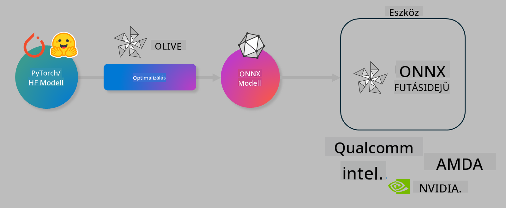

<!--
CO_OP_TRANSLATOR_METADATA:
{
  "original_hash": "6bbe47de3b974df7eea29dfeccf6032b",
  "translation_date": "2025-05-09T04:41:41+00:00",
  "source_file": "code/04.Finetuning/olive-lab/readme.md",
  "language_code": "hu"
}
-->
# Laboratórium. AI modellek optimalizálása eszközön történő futtatáshoz

## Bevezetés

> [!IMPORTANT]
> Ehhez a laborhoz szükséges egy **Nvidia A10 vagy A100 GPU**, valamint a hozzá tartozó driverek és a CUDA toolkit (12-es vagy újabb verzió) telepítve.

> [!NOTE]
> Ez egy **35 perces** labor, amely gyakorlati bevezetést nyújt az OLIVE segítségével történő eszközön futtatható modellek optimalizálásának alapfogalmaiba.

## Tanulási célok

A labor végére képes leszel OLIVE használatával:

- Egy AI modell kvantálására az AWQ kvantálási módszerrel.
- Egy AI modell finomhangolására egy adott feladathoz.
- LoRA adapterek (finomhangolt modell) generálására az ONNX Runtime-on történő hatékony eszközön futtatáshoz.

### Mi az Olive

Az Olive (*O*NNX *live*) egy modelloptimalizáló eszközkészlet, amelyhez parancssori felület (CLI) is tartozik, és amely lehetővé teszi modellek ONNX runtime +++https://onnxruntime.ai+++ számára történő szállítását minőség és teljesítmény mellett.



Az Olive bemenete jellemzően egy PyTorch vagy Hugging Face modell, a kimenete pedig egy optimalizált ONNX modell, amelyet egy eszközön (telepítési célpont) futtatnak, amely az ONNX runtime-ot használja. Az Olive a telepítési célpont AI gyorsítójára (NPU, GPU, CPU) optimalizál, amelyet olyan hardvergyártók biztosítanak, mint a Qualcomm, AMD, Nvidia vagy Intel.

Az Olive egy *workflow*-t hajt végre, amely egy rendezett sorozata az egyes modelloptimalizációs feladatoknak, amelyeket *pass*-oknak nevezünk – például modell tömörítés, gráf rögzítés, kvantálás, gráf optimalizáció. Minden pass-hoz tartozik egy paraméterkészlet, amely finomhangolható a legjobb metrikák, például pontosság és késleltetés eléréséhez, amelyeket az adott értékelő mér. Az Olive keresési stratégiát alkalmaz, amely egy kereső algoritmust használ, hogy automatikusan hangolja be a pass-okat egyenként vagy csoportosan.

#### Az Olive előnyei

- **Csökkenti a frusztrációt és az időt** a különböző gráf optimalizációs, tömörítési és kvantálási technikák manuális próbálgatásával. Állítsd be a minőségi és teljesítménybeli elvárásaidat, és hagyd, hogy az Olive automatikusan megtalálja a legjobb modellt.
- **40+ beépített modelloptimalizációs komponens**, amelyek lefedik a legmodernebb kvantálási, tömörítési, gráf optimalizációs és finomhangolási technikákat.
- **Könnyen használható CLI** a gyakori modelloptimalizációs feladatokhoz. Például olive quantize, olive auto-opt, olive finetune.
- Modell csomagolás és telepítés beépítve.
- Támogatja a **Multi LoRA kiszolgálás** számára generált modelleket.
- YAML/JSON segítségével összeállítható workflow-k a modelloptimalizáció és telepítés feladatainak koordinálására.
- **Hugging Face** és **Azure AI** integráció.
- Beépített **gyorsítótárazási** mechanizmus a **költségek csökkentésére**.

## Labor utasítások

> [!NOTE]
> Győződj meg róla, hogy az Azure AI Hub-odat és projektedet előkészítetted, valamint az A100 számítási erőforrásodat beállítottad az 1. labor szerint.

### 0. lépés: Csatlakozás az Azure AI számítási erőforráshoz

Az Azure AI számítási erőforráshoz a **VS Code** távoli funkciójával csatlakozol.

1. Nyisd meg a **VS Code** asztali alkalmazást:
1. Nyisd meg a **parancspalettát** a **Shift+Ctrl+P** billentyűkombinációval
1. A parancspalettában keresd meg az **AzureML - remote: Connect to compute instance in New Window** parancsot.
1. Kövesd a képernyőn megjelenő utasításokat a számítási erőforráshoz való csatlakozáshoz. Ez magában foglalja az Azure előfizetés, erőforráscsoport, projekt és a labor 1-ben beállított számítási erőforrás kiválasztását.
1. Ha csatlakoztál az Azure ML számítási node-hoz, azt a **Visual Code bal alsó sarkában** látod majd `><Azure ML: Compute Name`

### 1. lépés: A repó klónozása

A VS Code-ban nyiss egy új terminált a **Ctrl+J** segítségével, majd klónozd ezt a repót:

A terminálban megjelenik a prompt

```
azureuser@computername:~/cloudfiles/code$ 
```
Klónozd a megoldást

```bash
cd ~/localfiles
git clone https://github.com/microsoft/phi-3cookbook.git
```

### 2. lépés: Mappa megnyitása VS Code-ban

A terminálban futtasd a következő parancsot, amely új ablakban megnyitja a mappát:

```bash
code phi-3cookbook/code/04.Finetuning/Olive-lab
```

Alternatív megoldásként a **Fájl** > **Mappa megnyitása** menüpontból is megnyithatod a mappát.

### 3. lépés: Függőségek telepítése

Nyiss egy terminált a VS Code-ban az Azure AI számítási példányodon (tipp: **Ctrl+J**) és futtasd a következő parancsokat a függőségek telepítéséhez:

```bash
conda create -n olive-ai python=3.11 -y
conda activate olive-ai
pip install -r requirements.txt
az extension remove -n azure-cli-ml
az extension add -n ml
```

> [!NOTE]
> A függőségek telepítése körülbelül 5 percet vesz igénybe.

Ebben a laborban modelleket töltesz le és töltesz fel az Azure AI modell katalógusába. A modell katalógus eléréséhez jelentkezz be az Azure-ba a következő parancs segítségével:

```bash
az login
```

> [!NOTE]
> Bejelentkezéskor ki kell választanod az előfizetésed. Győződj meg róla, hogy a laborhoz biztosított előfizetést választod ki.

### 4. lépés: Olive parancsok futtatása

Nyiss egy terminált a VS Code-ban az Azure AI számítási példányodon (tipp: **Ctrl+J**) és győződj meg róla, hogy az `olive-ai` conda környezet aktív:

```bash
conda activate olive-ai
```

Ezután futtasd az alábbi Olive parancsokat a parancssorban.

1. **Adatok megtekintése:** Ebben a példában a Phi-3.5-Mini modellt finomhangolod, hogy utazással kapcsolatos kérdésekre specializálódjon. Az alábbi kód megjeleníti az adathalmaz első néhány rekordját, amelyek JSON lines formátumban vannak:

    ```bash
    head data/data_sample_travel.jsonl
    ```

1. **Modell kvantálása:** A modell betanítása előtt először kvantálod az Active Aware Quantization (AWQ) technikával +++https://arxiv.org/abs/2306.00978+++. Az AWQ a modell súlyait úgy kvantálja, hogy figyelembe veszi az inferencia során keletkező aktivációkat. Ez azt jelenti, hogy a kvantálás a tényleges aktivációs adateloszlást veszi alapul, ami jobb pontosságmegőrzést eredményez a hagyományos súlykvantálási módszerekhez képest.

    ```bash
    olive quantize \
       --model_name_or_path microsoft/Phi-3.5-mini-instruct \
       --trust_remote_code \
       --algorithm awq \
       --output_path models/phi/awq \
       --log_level 1
    ```

    Az AWQ kvantálás befejezése körülbelül **8 percet** vesz igénybe, amely során a modell mérete **kb. 7,5GB-ról kb. 2,5GB-ra csökken**.

    Ebben a laborban azt mutatjuk meg, hogyan lehet modelleket bevinni a Hugging Face-ről (például: `microsoft/Phi-3.5-mini-instruct`). However, Olive also allows you to input models from the Azure AI catalog by updating the `model_name_or_path` argument to an Azure AI asset ID (for example:  `azureml://registries/azureml/models/Phi-3.5-mini-instruct/versions/4`). 

1. **Train the model:** Next, the `olive finetune` parancs finomhangolja a kvantált modellt. A modell kvantálása *finomhangolás előtt* jobb pontosságot eredményez, mert a finomhangolás részben visszanyeri a kvantálás okozta pontosságvesztést.

    ```bash
    olive finetune \
        --method lora \
        --model_name_or_path models/phi/awq \
        --data_files "data/data_sample_travel.jsonl" \
        --data_name "json" \
        --text_template "<|user|>\n{prompt}<|end|>\n<|assistant|>\n{response}<|end|>" \
        --max_steps 100 \
        --output_path ./models/phi/ft \
        --log_level 1
    ```

    A finomhangolás (100 lépéssel) körülbelül **6 percet** vesz igénybe.

1. **Optimalizálás:** A betanított modellt most optimalizálod az Olive `auto-opt` command, which will capture the ONNX graph and automatically perform a number of optimizations to improve the model performance for CPU by compressing the model and doing fusions. It should be noted, that you can also optimize for other devices such as NPU or GPU by just updating the `--device` and `--provider` argumentumaival – de a labor céljából CPU-t használunk.

    ```bash
    olive auto-opt \
       --model_name_or_path models/phi/ft/model \
       --adapter_path models/phi/ft/adapter \
       --device cpu \
       --provider CPUExecutionProvider \
       --use_ort_genai \
       --output_path models/phi/onnx-ao \
       --log_level 1
    ```

    Az optimalizálás körülbelül **5 percet** vesz igénybe.

### 5. lépés: Modell inferencia gyors teszt

A modell inferencia teszteléséhez hozz létre egy Python fájlt a mappádban **app.py** néven, és másold be az alábbi kódot:

```python
import onnxruntime_genai as og
import numpy as np

print("loading model and adapters...", end="", flush=True)
model = og.Model("models/phi/onnx-ao/model")
adapters = og.Adapters(model)
adapters.load("models/phi/onnx-ao/model/adapter_weights.onnx_adapter", "travel")
print("DONE!")

tokenizer = og.Tokenizer(model)
tokenizer_stream = tokenizer.create_stream()

params = og.GeneratorParams(model)
params.set_search_options(max_length=100, past_present_share_buffer=False)
user_input = "what is the best thing to see in chicago"
params.input_ids = tokenizer.encode(f"<|user|>\n{user_input}<|end|>\n<|assistant|>\n")

generator = og.Generator(model, params)

generator.set_active_adapter(adapters, "travel")

print(f"{user_input}")

while not generator.is_done():
    generator.compute_logits()
    generator.generate_next_token()

    new_token = generator.get_next_tokens()[0]
    print(tokenizer_stream.decode(new_token), end='', flush=True)

print("\n")
```

Futtasd a kódot a következő paranccsal:

```bash
python app.py
```

### 6. lépés: Modell feltöltése az Azure AI-ba

A modell feltöltése az Azure AI modell tárába lehetővé teszi, hogy a modell megosztható legyen a fejlesztőcsapat többi tagjával, valamint kezeli a modell verziókövetését. A modell feltöltéséhez futtasd a következő parancsot:

> [!NOTE]
> Frissítsd a `{}` helyőrzőket az `` placeholders with the name of your resource group and Azure AI Project Name. 

To find your resource group `resourceGroup` és az Azure AI projekt nevével, majd futtasd a parancsot

```
az ml workspace show
```

Vagy menj a +++ai.azure.com+++ oldalra, és válaszd a **management center** **project** **overview** menüpontot.

Töltsd ki a `{}` helyőrzőket az erőforráscsoport és az Azure AI projekt nevével.

```bash
az ml model create \
    --name ft-for-travel \
    --version 1 \
    --path ./models/phi/onnx-ao \
    --resource-group {RESOURCE_GROUP_NAME} \
    --workspace-name {PROJECT_NAME}
```

Ezután megtekintheted a feltöltött modelljeidet, és telepítheted őket a https://ml.azure.com/model/list címen.

**Jogi nyilatkozat**:  
Ez a dokumentum az AI fordító szolgáltatás, a [Co-op Translator](https://github.com/Azure/co-op-translator) segítségével készült. Bár a pontosságra törekszünk, kérjük, vegye figyelembe, hogy az automatikus fordítások hibákat vagy pontatlanságokat tartalmazhatnak. Az eredeti dokumentum az anyanyelvén tekintendő hiteles forrásnak. Fontos információk esetén szakmai, emberi fordítást javaslunk. Nem vállalunk felelősséget a fordítás használatából eredő félreértésekért vagy félreértelmezésekért.