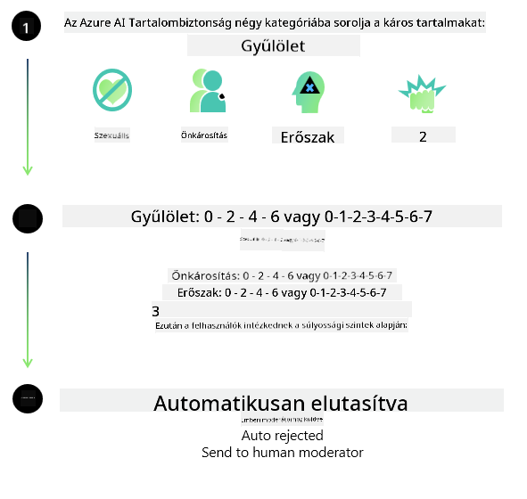
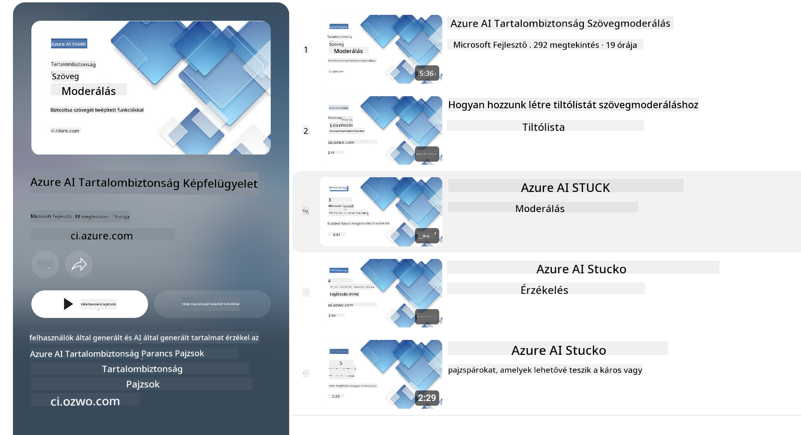

<!--
CO_OP_TRANSLATOR_METADATA:
{
  "original_hash": "c8273672cc57df2be675407a1383aaf0",
  "translation_date": "2025-05-09T06:17:29+00:00",
  "source_file": "md/01.Introduction/01/01.AISafety.md",
  "language_code": "hu"
}
-->
# AI biztonság a Phi modellekhez  
A Phi modellcsalád a [Microsoft Responsible AI Standard](https://query.prod.cms.rt.microsoft.com/cms/api/am/binary/RE5cmFl) irányelveinek megfelelően készült, amely egy vállalati szintű követelményrendszer a következő hat alapelv alapján: elszámoltathatóság, átláthatóság, méltányosság, megbízhatóság és biztonság, adatvédelem és biztonság, valamint befogadás, amelyek a [Microsoft felelős MI elveit](https://www.microsoft.com/ai/responsible-ai) alkotják.  

A korábbi Phi modellekhez hasonlóan több szempontú biztonsági értékelést és utólagos biztonsági tréninget alkalmaztunk, kiegészítve további intézkedésekkel a többnyelvű képességek figyelembevételére. A biztonsági tréningekhez és értékelésekhez, beleértve a többnyelvű és különböző kockázati kategóriák szerinti tesztelést, részletes leírást találhat a [Phi Safety Post-Training Paper](https://arxiv.org/abs/2407.13833) dokumentumban. Bár a Phi modellek előnyt élveznek ezen megközelítés révén, a fejlesztőknek felelős MI legjobb gyakorlatokat kell alkalmazniuk, beleértve a kockázatok feltérképezését, mérését és enyhítését az adott felhasználási eset és kulturális, nyelvi kontextus figyelembevételével.  

## Legjobb gyakorlatok  

A Phi modellcsalád, mint más modellek, potenciálisan méltánytalan, megbízhatatlan vagy sértő módon viselkedhet.  

Néhány korlátozó viselkedés, amire érdemes figyelni az SLM és LLM esetében:  

- **Szolgáltatás minősége:** A Phi modelleket elsősorban angol nyelvű szövegeken képezték. Az angoltól eltérő nyelveken gyengébb teljesítmény várható. Az angol nyelvjárások közül, amelyek kevésbé képviseltettek a tanító adatokban, rosszabb eredmények lehetnek, mint a standard amerikai angol esetén.  
- **Ártalmak reprezentációja és sztereotípiák fenntartása:** Ezek a modellek túl- vagy alulreprezentálhatnak bizonyos embercsoportokat, eltüntethetnek egyes csoportokat, vagy megerősíthetnek lealacsonyító vagy negatív sztereotípiákat. Az utólagos biztonsági tréning ellenére ezek a korlátok még mindig jelen lehetnek a különböző csoportok eltérő reprezentációja vagy a negatív sztereotípiák példáinak előfordulása miatt a tanító adatokban, amelyek a valós világ mintázatait és társadalmi előítéleteit tükrözik.  
- **Nem megfelelő vagy sértő tartalom:** Ezek a modellek előállíthatnak más típusú nem megfelelő vagy sértő tartalmakat is, ami érzékeny kontextusban való használatukat további, az adott felhasználási esetre szabott enyhítő intézkedések nélkül problémássá teheti.  
- **Információ megbízhatósága:** A nyelvi modellek előállíthatnak értelmetlen vagy kitalált tartalmat, amely hihetőnek hangzik, de pontatlan vagy elavult lehet.  
- **Kód korlátozott hatóköre:** A Phi-3 tanító adatainak többsége Python alapú, és gyakori csomagokat használ, mint például a "typing, math, random, collections, datetime, itertools". Ha a modell más csomagokat vagy más nyelveken írt szkripteket generál, erősen ajánlott, hogy a felhasználók manuálisan ellenőrizzék az összes API használatot.  

A fejlesztőknek felelős MI legjobb gyakorlatokat kell alkalmazniuk, és felelősek azért, hogy az adott felhasználási eset megfeleljen a vonatkozó jogszabályoknak és előírásoknak (például adatvédelem, kereskedelem stb.).  

## Felelős MI szempontok  

Mint más nyelvi modellek, a Phi sorozatú modellek is potenciálisan méltánytalan, megbízhatatlan vagy sértő módon viselkedhetnek. Néhány korlátozó viselkedés, amire érdemes odafigyelni:  

**Szolgáltatás minősége:** A Phi modelleket elsősorban angol szövegeken képezték. Az angoltól eltérő nyelveken gyengébb teljesítmény várható. Az angol nyelvjárások közül, amelyek kevésbé képviseltettek a tanító adatokban, rosszabb eredmények lehetnek, mint a standard amerikai angol esetén.  

**Ártalmak reprezentációja és sztereotípiák fenntartása:** Ezek a modellek túl- vagy alulreprezentálhatnak bizonyos embercsoportokat, eltüntethetnek egyes csoportokat, vagy megerősíthetnek lealacsonyító vagy negatív sztereotípiákat. Az utólagos biztonsági tréning ellenére ezek a korlátok még mindig jelen lehetnek a különböző csoportok eltérő reprezentációja vagy a negatív sztereotípiák példáinak előfordulása miatt a tanító adatokban, amelyek a valós világ mintázatait és társadalmi előítéleteit tükrözik.  

**Nem megfelelő vagy sértő tartalom:** Ezek a modellek előállíthatnak más típusú nem megfelelő vagy sértő tartalmakat is, ami érzékeny kontextusban való használatukat további, az adott felhasználási esetre szabott enyhítő intézkedések nélkül problémássá teheti.  
Információ megbízhatósága: A nyelvi modellek előállíthatnak értelmetlen vagy kitalált tartalmat, amely hihetőnek hangzik, de pontatlan vagy elavult lehet.  

**Kód korlátozott hatóköre:** A Phi-3 tanító adatainak többsége Python alapú, és gyakori csomagokat használ, mint például a "typing, math, random, collections, datetime, itertools". Ha a modell más csomagokat vagy más nyelveken írt szkripteket generál, erősen ajánlott, hogy a felhasználók manuálisan ellenőrizzék az összes API használatot.  

A fejlesztőknek felelős MI legjobb gyakorlatokat kell alkalmazniuk, és felelősek azért, hogy az adott felhasználási eset megfeleljen a vonatkozó jogszabályoknak és előírásoknak (például adatvédelem, kereskedelem stb.). Fontos szempontok a következők:  

**Allokáció:** A modellek nem feltétlenül alkalmasak olyan helyzetekre, amelyek jogi státuszra, erőforrások vagy életlehetőségek elosztására (pl. lakhatás, foglalkoztatás, hitel stb.) vonatkozó következményekkel járhatnak további értékelések és további elfogultság-csökkentő technikák nélkül.  

**Magas kockázatú helyzetek:** A fejlesztőknek meg kell vizsgálniuk a modellek használhatóságát magas kockázatú helyzetekben, ahol a méltánytalan, megbízhatatlan vagy sértő kimenetek rendkívül költségesek vagy károsak lehetnek. Ide tartozik az érzékeny vagy szakértői területeken adott tanácsadás, ahol a pontosság és megbízhatóság kritikus (pl. jogi vagy egészségügyi tanácsadás). További védelmi intézkedéseket kell bevezetni az alkalmazás szintjén a telepítési környezetnek megfelelően.  

**Dezinformáció:** A modellek pontatlan információkat állíthatnak elő. A fejlesztőknek követniük kell az átláthatóság legjobb gyakorlatait, és tájékoztatniuk kell a végfelhasználókat arról, hogy AI rendszerrel kommunikálnak. Az alkalmazás szintjén a fejlesztők visszacsatolási mechanizmusokat és folyamatokat építhetnek be, hogy a válaszok az adott felhasználási eset specifikus, kontextuális információira épüljenek, amit Retrieval Augmented Generation (RAG) néven ismerünk.  

**Ártalmas tartalom generálása:** A fejlesztőknek értékelniük kell a kimenetek kontextusát, és használniuk kell rendelkezésre álló biztonsági osztályozókat vagy az adott felhasználási esethez igazodó egyedi megoldásokat.  

**Visszaélés:** Egyéb visszaélési formák, mint például csalás, spam vagy rosszindulatú szoftverek előállítása is előfordulhat, ezért a fejlesztőknek biztosítaniuk kell, hogy alkalmazásaik ne sértsék a vonatkozó jogszabályokat és előírásokat.  

### Finomhangolás és AI tartalombiztonság  

Egy modell finomhangolása után erősen ajánljuk, hogy használják az [Azure AI Content Safety](https://learn.microsoft.com/azure/ai-services/content-safety/overview) megoldásait a modellek által generált tartalom figyelésére, a potenciális kockázatok, fenyegetések és minőségi problémák azonosítására és blokkolására.  

  

Az [Azure AI Content Safety](https://learn.microsoft.com/azure/ai-services/content-safety/overview) támogatja a szöveges és képi tartalmakat is. Felhőben, leválasztott konténerekben és élő/ beágyazott eszközökön is telepíthető.  

## Az Azure AI Content Safety áttekintése  

Az Azure AI Content Safety nem egy mindenre kiterjedő megoldás; testre szabható, hogy igazodjon a vállalkozások specifikus szabályzataihoz. Emellett többnyelvű modelljei lehetővé teszik, hogy egyszerre több nyelvet is értsen.  

  

- **Azure AI Content Safety**  
- **Microsoft Developer**  
- **5 videó**  

Az Azure AI Content Safety szolgáltatás érzékeli a káros felhasználói és AI által generált tartalmakat alkalmazásokban és szolgáltatásokban. Szöveges és képi API-kat tartalmaz, amelyek lehetővé teszik káros vagy nem megfelelő anyagok felismerését.  

[AI Content Safety Playlist](https://www.youtube.com/playlist?list=PLlrxD0HtieHjaQ9bJjyp1T7FeCbmVcPkQ)

**Nyilatkozat**:  
Ezt a dokumentumot az AI fordító szolgáltatás, a [Co-op Translator](https://github.com/Azure/co-op-translator) segítségével fordítottuk. Bár igyekszünk a pontosságra, kérjük, vegye figyelembe, hogy az automatikus fordítások tartalmazhatnak hibákat vagy pontatlanságokat. Az eredeti dokumentum az anyanyelvén tekintendő hiteles forrásnak. Fontos információk esetén szakmai, emberi fordítást javaslunk. Nem vállalunk felelősséget a fordítás használatából eredő félreértésekért vagy félreértelmezésekért.