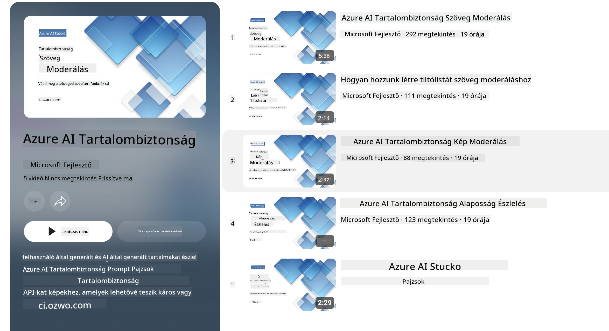

<!--
CO_OP_TRANSLATOR_METADATA:
{
  "original_hash": "c8273672cc57df2be675407a1383aaf0",
  "translation_date": "2025-07-16T17:52:02+00:00",
  "source_file": "md/01.Introduction/01/01.AISafety.md",
  "language_code": "hu"
}
-->
# AI biztonság a Phi modellekhez  
A Phi modellek családját a [Microsoft Felelős AI Szabvány](https://query.prod.cms.rt.microsoft.com/cms/api/am/binary/RE5cmFl) alapján fejlesztették ki, amely egy vállalati szintű követelményrendszer, és hat alapelven nyugszik: elszámoltathatóság, átláthatóság, méltányosság, megbízhatóság és biztonság, adatvédelem és biztonság, valamint befogadás, amelyek a [Microsoft Felelős AI elveit](https://www.microsoft.com/ai/responsible-ai) alkotják.  

A korábbi Phi modellekhez hasonlóan többoldalú biztonsági értékelést és utólagos biztonsági tréninget alkalmaztunk, kiegészítve további intézkedésekkel, hogy figyelembe vegyük a kiadás többnyelvű képességeit. A biztonsági tréning és értékelések megközelítését, beleértve a többnyelvű és kockázati kategóriák szerinti tesztelést, a [Phi Safety Post-Training Paper](https://arxiv.org/abs/2407.13833) részletezi. Bár a Phi modellek előnyt élveznek ezen megközelítés révén, a fejlesztőknek felelős AI legjobb gyakorlatokat kell alkalmazniuk, beleértve a kockázatok feltérképezését, mérését és enyhítését az adott felhasználási eset és kulturális, nyelvi kontextus szerint.  

## Legjobb gyakorlatok  

Más modellekhez hasonlóan a Phi modellek is potenciálisan méltánytalan, megbízhatatlan vagy sértő módon viselkedhetnek.  

Néhány korlátozó viselkedés, amire érdemes figyelni az SLM és LLM esetében:  

- **Szolgáltatás minősége:** A Phi modelleket elsősorban angol nyelvű szövegeken képezték. Az angoltól eltérő nyelveken gyengébb teljesítmény várható. Az angol nyelvjárások, amelyek kevésbé vannak jelen a tanító adatokban, rosszabb eredményt produkálhatnak, mint a standard amerikai angol.  
- **Káros hatások ábrázolása és sztereotípiák fenntartása:** Ezek a modellek túl- vagy alulreprezentálhatnak bizonyos csoportokat, eltüntethetik egyes csoportok megjelenítését, vagy megerősíthetnek lealacsonyító vagy negatív sztereotípiákat. Az utólagos biztonsági tréning ellenére ezek a korlátok továbbra is jelen lehetnek, mivel a különböző csoportok eltérő mértékben vannak jelen az adatokban, illetve a negatív sztereotípiák példái a valós mintákat és társadalmi előítéleteket tükrözhetik.  
- **Nem megfelelő vagy sértő tartalom:** Ezek a modellek előállíthatnak más típusú nem megfelelő vagy sértő tartalmakat is, ami érzékeny környezetben való alkalmazásukat további, az adott felhasználási esetre szabott enyhítő intézkedések nélkül nem teszi megfelelővé.  
- **Információ megbízhatósága:** A nyelvi modellek képesek értelmetlen tartalmat generálni, vagy olyan tartalmat kitalálni, amely bár ésszerűnek hangzik, valótlan vagy elavult.  
- **Kód korlátozott területe:** A Phi-3 tanító adatainak többsége Python alapú, és gyakori csomagokat használ, mint például "typing, math, random, collections, datetime, itertools". Ha a modell más csomagokat vagy más nyelvű szkripteket generál, erősen ajánlott, hogy a felhasználók manuálisan ellenőrizzék az összes API használatot.  

A fejlesztőknek felelős AI legjobb gyakorlatokat kell alkalmazniuk, és felelősek azért, hogy az adott felhasználási eset megfeleljen a vonatkozó jogszabályoknak és előírásoknak (pl. adatvédelem, kereskedelem stb.).  

## Felelős AI szempontok  

Más nyelvi modellekhez hasonlóan a Phi sorozatú modellek is potenciálisan méltánytalan, megbízhatatlan vagy sértő módon viselkedhetnek. Néhány korlátozó viselkedés, amire érdemes figyelni:  

**Szolgáltatás minősége:** A Phi modelleket elsősorban angol nyelvű szövegeken képezték. Az angoltól eltérő nyelveken gyengébb teljesítmény várható. Az angol nyelvjárások, amelyek kevésbé vannak jelen a tanító adatokban, rosszabb eredményt produkálhatnak, mint a standard amerikai angol.  

**Káros hatások ábrázolása és sztereotípiák fenntartása:** Ezek a modellek túl- vagy alulreprezentálhatnak bizonyos csoportokat, eltüntethetik egyes csoportok megjelenítését, vagy megerősíthetnek lealacsonyító vagy negatív sztereotípiákat. Az utólagos biztonsági tréning ellenére ezek a korlátok továbbra is jelen lehetnek, mivel a különböző csoportok eltérő mértékben vannak jelen az adatokban, illetve a negatív sztereotípiák példái a valós mintákat és társadalmi előítéleteket tükrözhetik.  

**Nem megfelelő vagy sértő tartalom:** Ezek a modellek előállíthatnak más típusú nem megfelelő vagy sértő tartalmakat is, ami érzékeny környezetben való alkalmazásukat további, az adott felhasználási esetre szabott enyhítő intézkedések nélkül nem teszi megfelelővé.  
Információ megbízhatósága: A nyelvi modellek képesek értelmetlen tartalmat generálni, vagy olyan tartalmat kitalálni, amely bár ésszerűnek hangzik, valótlan vagy elavult.  

**Kód korlátozott területe:** A Phi-3 tanító adatainak többsége Python alapú, és gyakori csomagokat használ, mint például "typing, math, random, collections, datetime, itertools". Ha a modell más csomagokat vagy más nyelvű szkripteket generál, erősen ajánlott, hogy a felhasználók manuálisan ellenőrizzék az összes API használatot.  

A fejlesztőknek felelős AI legjobb gyakorlatokat kell alkalmazniuk, és felelősek azért, hogy az adott felhasználási eset megfeleljen a vonatkozó jogszabályoknak és előírásoknak (pl. adatvédelem, kereskedelem stb.). Fontos szempontok:  

**Allokáció:** A modellek nem feltétlenül alkalmasak olyan helyzetekre, amelyek jogi státuszra, erőforrások vagy életlehetőségek elosztására (pl. lakhatás, foglalkoztatás, hitel stb.) kihatással lehetnek, további értékelések és torzításcsökkentő technikák nélkül.  

**Magas kockázatú helyzetek:** A fejlesztőknek értékelniük kell a modellek használhatóságát magas kockázatú helyzetekben, ahol a méltánytalan, megbízhatatlan vagy sértő eredmények rendkívül költségesek vagy károsak lehetnek. Ez magában foglalja az érzékeny vagy szakértői területeken nyújtott tanácsadást, ahol a pontosság és megbízhatóság kritikus (pl. jogi vagy egészségügyi tanácsadás). További védelmi intézkedéseket kell bevezetni az alkalmazás szintjén a telepítési környezetnek megfelelően.  

**Dezinformáció:** A modellek pontatlan információkat is előállíthatnak. A fejlesztőknek követniük kell az átláthatóság legjobb gyakorlatait, és tájékoztatniuk kell a végfelhasználókat arról, hogy AI rendszerrel kommunikálnak. Az alkalmazás szintjén a fejlesztők visszacsatolási mechanizmusokat és folyamatokat építhetnek be, hogy a válaszokat az adott felhasználási esethez és kontextushoz igazítsák, ezt Retrieval Augmented Generation (RAG) technikának hívják.  

**Káros tartalom generálása:** A fejlesztőknek értékelniük kell a kimenetek kontextusát, és használniuk kell elérhető biztonsági osztályozókat vagy az adott felhasználási esethez igazított egyedi megoldásokat.  

**Visszaélés:** Egyéb visszaélések, mint például csalás, spam vagy rosszindulatú szoftverek előállítása is előfordulhatnak, ezért a fejlesztőknek biztosítaniuk kell, hogy alkalmazásaik ne sértsék a vonatkozó jogszabályokat és előírásokat.  

### Finomhangolás és AI tartalombiztonság  

Egy modell finomhangolása után erősen ajánljuk, hogy használják az [Azure AI Content Safety](https://learn.microsoft.com/azure/ai-services/content-safety/overview) eszközeit a modellek által generált tartalom figyelésére, a potenciális kockázatok, fenyegetések és minőségi problémák azonosítására és blokkolására.  

  

Az [Azure AI Content Safety](https://learn.microsoft.com/azure/ai-services/content-safety/overview) támogatja mind a szöveges, mind a képi tartalmakat. Felhőben, leválasztott konténerekben, valamint élő/ beágyazott eszközökön is telepíthető.  

## Az Azure AI Content Safety áttekintése  

Az Azure AI Content Safety nem egy mindenre jó megoldás; testreszabható, hogy igazodjon a vállalatok egyedi szabályzataihoz. Emellett többnyelvű modelljei lehetővé teszik, hogy egyszerre több nyelvet is megértsen.  

  

- **Azure AI Content Safety**  
- **Microsoft Developer**  
- **5 videó**  

Az Azure AI Content Safety szolgáltatás érzékeli a káros, felhasználók vagy AI által generált tartalmakat alkalmazásokban és szolgáltatásokban. Tartalmaz szöveg- és kép API-kat, amelyek lehetővé teszik a káros vagy nem megfelelő anyagok felismerését.  

[AI Content Safety lejátszási lista](https://www.youtube.com/playlist?list=PLlrxD0HtieHjaQ9bJjyp1T7FeCbmVcPkQ)

**Jogi nyilatkozat**:  
Ez a dokumentum az AI fordító szolgáltatás, a [Co-op Translator](https://github.com/Azure/co-op-translator) segítségével készült. Bár a pontosságra törekszünk, kérjük, vegye figyelembe, hogy az automatikus fordítások hibákat vagy pontatlanságokat tartalmazhatnak. Az eredeti dokumentum az anyanyelvén tekintendő hiteles forrásnak. Kritikus információk esetén professzionális emberi fordítást javaslunk. Nem vállalunk felelősséget a fordítás használatából eredő félreértésekért vagy téves értelmezésekért.