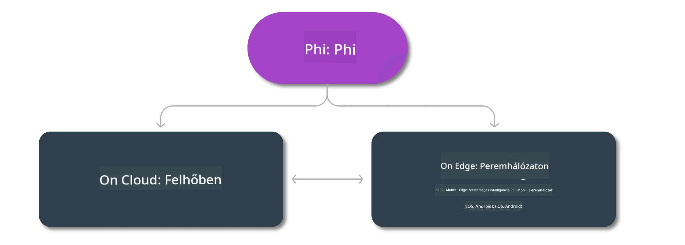

# Phi modellek és elérhetőségük különböző platformokon

## Edge és felhő alapú forgatókönyvek

## Modellek elérhetősége és erőforrások

| | | | | | | | | |
|-|-|-|-|-|-|-|-|-|
|Model|Bemenet|Tartalom hossza|Azure AI (MaaS)|Azure ML (MaaP)|ONNX|Hugging Face|Ollama|Nvidia NIM|
|Phi-3-vision-128k-instruct|Szöveg+Kép|128k|[Playground & Telepítés](https://ai.azure.com/explore/models/Phi-3-vision-128k-instruct/version/2/registry/azureml)|[Playground, Telepítés & Finomhangolás](https://ml.azure.com/registries/azureml/models/Phi-3-vision-128k-instruct/version/2)|[CUDA](https://huggingface.co/microsoft/Phi-3-vision-128k-instruct-onnx-cuda/tree/main),[CPU](https://huggingface.co/microsoft/Phi-3-vision-128k-instruct-onnx-cpu/tree/main), [DirectML](https://huggingface.co/microsoft/Phi-3-vision-128k-instruct-onnx-directml/tree/main)|[Letöltés](https://huggingface.co/microsoft/Phi-3-vision-128k-instruct)|-NA-|[NIM API-k](https://build.nvidia.com/microsoft/phi-3-vision-128k-instruct)|
|Phi-3-mini-4k-instruct|Szöveg|4k|[Playground & Telepítés](https://aka.ms/phi3-mini-4k-azure-ml)|[Playground, Telepítés](https://aka.ms/phi3-mini-4k-azure-ml) & Finomhangolás|[CUDA](https://huggingface.co/microsoft/Phi-3-mini-4k-instruct-onnx), [Web](https://huggingface.co/microsoft/Phi-3-mini-4k-instruct-onnx)|[Playground & Letöltés](https://huggingface.co/chat/models/microsoft/Phi-3-mini-4k-instruct)|[GGUF](https://huggingface.co/microsoft/Phi-3-mini-4k-instruct-gguf)|[NIM API-k](https://build.nvidia.com/microsoft/phi-3-mini-4k)|
|Phi-3-mini-128k-instruct|Szöveg|128k|[Playground & Telepítés](https://ai.azure.com/explore/models/Phi-3-mini-128k-instruct/version/9/registry/azureml)|[Playground, Telepítés](https://ai.azure.com/explore/models/Phi-3-mini-128k-instruct/version/9/registry/azureml) & Finomhangolás|[CUDA](https://huggingface.co/microsoft/Phi-3-mini-128k-instruct-onnx)|[Letöltés](https://huggingface.co/microsoft/Phi-3-mini-128k-instruct-onnx)|-NA-|[NIM API-k](https://build.nvidia.com/microsoft/phi-3-mini)|
|Phi-3-small-8k-instruct|Szöveg|8k|[Playground & Telepítés](https://ml.azure.com/registries/azureml/models/Phi-3-small-8k-instruct/version/2)|[Playground, Telepítés](https://ai.azure.com/explore/models/Phi-3-small-8k-instruct/version/2/registry/azureml) & Finomhangolás|[CUDA](https://huggingface.co/microsoft/Phi-3-small-8k-instruct-onnx-cuda)|[Letöltés](https://huggingface.co/microsoft/Phi-3-small-8k-instruct-onnx-cuda)|-NA-|[NIM API-k](https://build.nvidia.com/microsoft/phi-3-small-8k-instruct?docker=false)|
|Phi-3-small-128k-instruct|Szöveg|128k|[Playground & Telepítés](https://ai.azure.com/explore/models/Phi-3-small-128k-instruct/version/2/registry/azureml)|[Playground, Telepítés](https://ml.azure.com/registries/azureml/models/Phi-3-small-128k-instruct/version/2) & Finomhangolás|[CUDA](https://huggingface.co/microsoft/Phi-3-medium-128k-instruct-onnx-cuda)|[Letöltés](https://huggingface.co/microsoft/Phi-3-small-128k-instruct)|-NA-|[NIM API-k](https://build.nvidia.com/microsoft/phi-3-small-128k-instruct?docker=false)|
|Phi-3-medium-4k-instruct|Szöveg|4k|[Playground & Telepítés](https://huggingface.co/microsoft/Phi-3-medium-4k-instruct)|[Playground, Telepítés](https://ml.azure.com/registries/azureml/models/Phi-3-medium-4k-instruct/version/2) & Finomhangolás|[CUDA](https://huggingface.co/microsoft/Phi-3-medium-4k-instruct-onnx-cuda/tree/main), [CPU](https://huggingface.co/microsoft/Phi-3-medium-4k-instruct-onnx-cpu/tree/main), [DirectML](https://huggingface.co/microsoft/Phi-3-medium-4k-instruct-onnx-directml/tree/main)|[Letöltés](https://huggingface.co/microsoft/Phi-3-medium-4k-instruct)|-NA-|[NIM API-k](https://build.nvidia.com/microsoft/phi-3-medium-4k-instruct?docker=false)|
|Phi-3-medium-128k-instruct|Szöveg|128k|[Playground & Telepítés](https://ai.azure.com/explore/models/Phi-3-medium-128k-instruct/version/2)|[Playground, Telepítés](https://ml.azure.com/registries/azureml/models/Phi-3-medium-128k-instruct/version/2) & Finomhangolás|[CUDA](https://huggingface.co/microsoft/Phi-3-medium-128k-instruct-onnx-cuda/tree/main), [CPU](https://huggingface.co/microsoft/Phi-3-medium-128k-instruct-onnx-cpu/tree/main), [DirectML](https://huggingface.co/microsoft/Phi-3-medium-128k-instruct-onnx-directml/tree/main)|[Letöltés](https://huggingface.co/microsoft/Phi-3-medium-128k-instruct)|-NA-|-NA-|

**Jogi nyilatkozat**:  
Ez a dokumentum az AI fordító szolgáltatás, a [Co-op Translator](https://github.com/Azure/co-op-translator) segítségével készült. Bár a pontosságra törekszünk, kérjük, vegye figyelembe, hogy az automatikus fordítások hibákat vagy pontatlanságokat tartalmazhatnak. Az eredeti dokumentum az anyanyelvén tekintendő hiteles forrásnak. Fontos információk esetén szakmai, emberi fordítást javaslunk. Nem vállalunk felelősséget a fordítás használatából eredő félreértésekért vagy téves értelmezésekért.