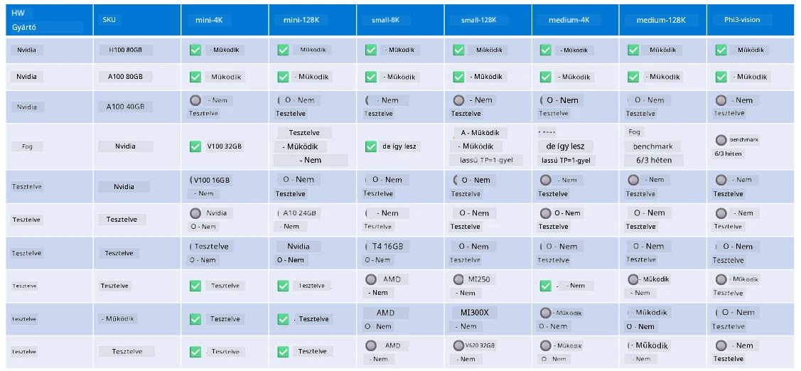

<!--
CO_OP_TRANSLATOR_METADATA:
{
  "original_hash": "8cdc17ce0f10535da30b53d23fe1a795",
  "translation_date": "2025-07-16T18:26:44+00:00",
  "source_file": "md/01.Introduction/01/01.Hardwaresupport.md",
  "language_code": "hu"
}
-->
# Phi Hardvertámogatás

A Microsoft Phi optimalizálva lett az ONNX Runtime-hoz, és támogatja a Windows DirectML-t. Különféle hardvertípusokon jól működik, beleértve a GPU-kat, CPU-kat, sőt a mobil eszközöket is.

## Eszköz hardver  
Konkrétan a támogatott hardverek a következők:

- GPU SKU: RTX 4090 (DirectML)
- GPU SKU: 1 A100 80GB (CUDA)
- CPU SKU: Standard F64s v2 (64 vCPU, 128 GiB memória)

## Mobil SKU

- Android – Samsung Galaxy S21
- Apple iPhone 14 vagy újabb A16/A17 processzorral

## Phi hardverspecifikáció

- Minimálisan szükséges konfiguráció.
- Windows: DirectX 12-kompatibilis GPU és legalább 4 GB összesített RAM

CUDA: NVIDIA GPU, amelynek Compute Capability értéke >= 7.02



## onnxruntime futtatása több GPU-n

Jelenleg elérhető Phi ONNX modellek csak 1 GPU-ra készültek. Lehetséges a több GPU támogatása Phi modellek esetén, de az ORT 2 GPU-val nem garantálja, hogy nagyobb áteresztőképességet ér el, mint két különálló ort példány. A legfrissebb információkért kérjük, látogasson el az [ONNX Runtime](https://onnxruntime.ai/) oldalra.

A [Build 2024-en a GenAI ONNX csapat](https://youtu.be/WLW4SE8M9i8?si=EtG04UwDvcjunyfC) bejelentette, hogy a Phi modellekhez a több GPU helyett több példányos futtatást engedélyezték.

Jelenleg ez lehetővé teszi, hogy egy onnxruntime vagy onnxruntime-genai példányt futtasson a CUDA_VISIBLE_DEVICES környezeti változóval így:

```Python
CUDA_VISIBLE_DEVICES=0 python infer.py
CUDA_VISIBLE_DEVICES=1 python infer.py
```

Nyugodtan fedezze fel a Phit tovább az [Azure AI Foundry](https://ai.azure.com) oldalon!

**Jogi nyilatkozat**:  
Ez a dokumentum az AI fordító szolgáltatás, a [Co-op Translator](https://github.com/Azure/co-op-translator) segítségével készült. Bár a pontosságra törekszünk, kérjük, vegye figyelembe, hogy az automatikus fordítások hibákat vagy pontatlanságokat tartalmazhatnak. Az eredeti dokumentum az anyanyelvén tekintendő hiteles forrásnak. Fontos információk esetén professzionális emberi fordítást javaslunk. Nem vállalunk felelősséget a fordítás használatából eredő félreértésekért vagy téves értelmezésekért.