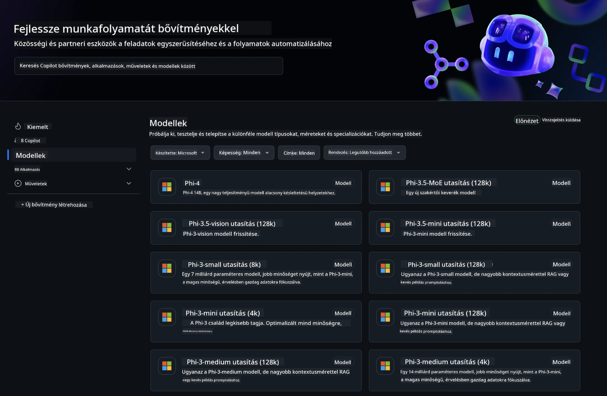
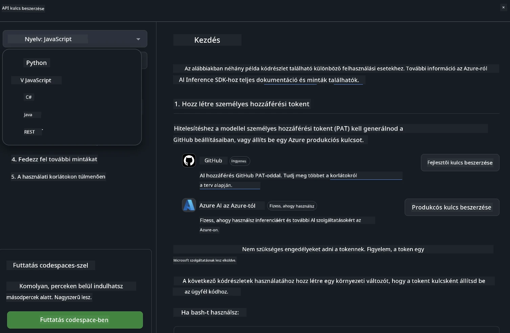
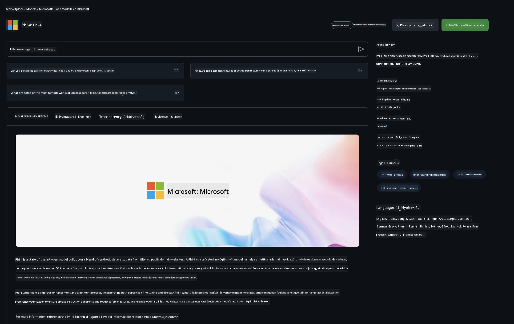

## Phi család a GitHub Modellek között

Üdvözlünk a [GitHub Modellek](https://github.com/marketplace/models) oldalán! Minden készen áll, hogy felfedezd az Azure AI-n futó AI modelleket.



További információkért a GitHub Modelleken elérhető modellekről, nézd meg a [GitHub Model Marketplace](https://github.com/marketplace/models) oldalt.

## Elérhető modellek

Minden modellhez külön játszótér és példa kód tartozik.


### Phi család a GitHub Model Katalógusban

- [Phi-4](https://github.com/marketplace/models/azureml/Phi-4)

- [Phi-3.5-MoE instruct (128k)](https://github.com/marketplace/models/azureml/Phi-3-5-MoE-instruct)

- [Phi-3.5-vision instruct (128k)](https://github.com/marketplace/models/azureml/Phi-3-5-vision-instruct)

- [Phi-3.5-mini instruct (128k)](https://github.com/marketplace/models/azureml/Phi-3-5-mini-instruct)

- [Phi-3-Medium-128k-Instruct](https://github.com/marketplace/models/azureml/Phi-3-medium-128k-instruct)

- [Phi-3-medium-4k-instruct](https://github.com/marketplace/models/azureml/Phi-3-medium-4k-instruct)

- [Phi-3-mini-128k-instruct](https://github.com/marketplace/models/azureml/Phi-3-mini-128k-instruct)

- [Phi-3-mini-4k-instruct](https://github.com/marketplace/models/azureml/Phi-3-mini-4k-instruct)

- [Phi-3-small-128k-instruct](https://github.com/marketplace/models/azureml/Phi-3-small-128k-instruct)

- [Phi-3-small-8k-instruct](https://github.com/marketplace/models/azureml/Phi-3-small-8k-instruct)

## Első lépések

Néhány alap példa már készen áll a futtatásra. Ezeket a samples mappában találod. Ha inkább a kedvenc programozási nyelveddel szeretnél dolgozni, az alábbi nyelvekhez találsz példákat:

- Python
- JavaScript
- C#
- Java
- cURL

Van egy dedikált Codespaces környezet is a példák és modellek futtatásához.



## Példa kód

Az alábbiakban néhány példa kódrészletet találsz különböző felhasználási esetekhez. További információkért az Azure AI Inference SDK-ról, nézd meg a teljes dokumentációt és a példákat.

## Beállítás

1. Hozz létre egy személyes hozzáférési tokent  
Nem szükséges engedélyeket adni a tokennek. Fontos, hogy a token egy Microsoft szolgáltatáshoz kerül továbbításra.

A lentebb található kódrészletek használatához hozz létre egy környezeti változót, amelyben a tokenedet a klienskód kulcsaként állítod be.

Ha bash-t használsz:  
```
export GITHUB_TOKEN="<your-github-token-goes-here>"
```  
Ha PowerShell-t:  

```
$Env:GITHUB_TOKEN="<your-github-token-goes-here>"
```  

Ha Windows parancssort:  

```
set GITHUB_TOKEN=<your-github-token-goes-here>
```  

## Python példa

### Függőségek telepítése  
Telepítsd az Azure AI Inference SDK-t pip-pel (Szükséges: Python >=3.8):

```
pip install azure-ai-inference
```  
### Egy alap kódminta futtatása

Ez a példa egy egyszerű hívást mutat be a chat completion API-hoz. A GitHub AI modell inferencia végpontját és a GitHub tokenedet használja. A hívás szinkron.

```python
import os
from azure.ai.inference import ChatCompletionsClient
from azure.ai.inference.models import SystemMessage, UserMessage
from azure.core.credentials import AzureKeyCredential

endpoint = "https://models.inference.ai.azure.com"
model_name = "Phi-4"
token = os.environ["GITHUB_TOKEN"]

client = ChatCompletionsClient(
    endpoint=endpoint,
    credential=AzureKeyCredential(token),
)

response = client.complete(
    messages=[
        UserMessage(content="I have $20,000 in my savings account, where I receive a 4% profit per year and payments twice a year. Can you please tell me how long it will take for me to become a millionaire? Also, can you please explain the math step by step as if you were explaining it to an uneducated person?"),
    ],
    temperature=0.4,
    top_p=1.0,
    max_tokens=2048,
    model=model_name
)

print(response.choices[0].message.content)
```

### Többfordulós beszélgetés futtatása

Ez a példa egy többfordulós beszélgetést mutat be a chat completion API-val. Ha chat alkalmazásban használod a modellt, neked kell kezelni a beszélgetés előzményeit, és a legfrissebb üzeneteket elküldeni a modellnek.

```
import os
from azure.ai.inference import ChatCompletionsClient
from azure.ai.inference.models import AssistantMessage, SystemMessage, UserMessage
from azure.core.credentials import AzureKeyCredential

token = os.environ["GITHUB_TOKEN"]
endpoint = "https://models.inference.ai.azure.com"
# Replace Model_Name
model_name = "Phi-4"

client = ChatCompletionsClient(
    endpoint=endpoint,
    credential=AzureKeyCredential(token),
)

messages = [
    SystemMessage(content="You are a helpful assistant."),
    UserMessage(content="What is the capital of France?"),
    AssistantMessage(content="The capital of France is Paris."),
    UserMessage(content="What about Spain?"),
]

response = client.complete(messages=messages, model=model_name)

print(response.choices[0].message.content)
```

### Kimenet streamelése

Jobb felhasználói élmény érdekében érdemes a modell válaszát streamelni, hogy az első tokenek hamar megjelenjenek, és ne kelljen hosszú válaszokra várni.

```
import os
from azure.ai.inference import ChatCompletionsClient
from azure.ai.inference.models import SystemMessage, UserMessage
from azure.core.credentials import AzureKeyCredential

token = os.environ["GITHUB_TOKEN"]
endpoint = "https://models.inference.ai.azure.com"
# Replace Model_Name
model_name = "Phi-4"

client = ChatCompletionsClient(
    endpoint=endpoint,
    credential=AzureKeyCredential(token),
)

response = client.complete(
    stream=True,
    messages=[
        SystemMessage(content="You are a helpful assistant."),
        UserMessage(content="Give me 5 good reasons why I should exercise every day."),
    ],
    model=model_name,
)

for update in response:
    if update.choices:
        print(update.choices[0].delta.content or "", end="")

client.close()
```

## INGYENES használat és korlátok a GitHub Modelleknél



A [játszótér és az ingyenes API használat korlátai](https://docs.github.com/en/github-models/prototyping-with-ai-models#rate-limits) arra szolgálnak, hogy kísérletezhess a modellekkel és prototípust készíthess AI alkalmazásodhoz. Ezeken a korlátokon túl, és ha skálázni szeretnéd az alkalmazásodat, Azure fiókból kell erőforrásokat biztosítanod, és onnan hitelesítened a GitHub személyes hozzáférési token helyett. A kódodban egyéb változtatásra nincs szükség. Ezen a linken megtalálod, hogyan léphetsz túl az ingyenes szint korlátain az Azure AI-ban.

### Figyelmeztetések

Ne feledd, hogy amikor egy modellel dolgozol, AI-val kísérletezel, így előfordulhatnak tartalmi hibák.

A funkció különböző korlátok alá esik (például percenkénti kérések, napi kérések, tokenek kérésekként, egyidejű kérések száma), és nem alkalmas éles használatra.

A GitHub Modellek az Azure AI Content Safety-t használják. Ezek a szűrők nem kapcsolhatók ki a GitHub Modellek használata során. Ha fizetős szolgáltatáson keresztül használod a modelleket, kérjük, állítsd be a tartalomszűrőket az igényeidnek megfelelően.

Ez a szolgáltatás a GitHub Előzetes verziós feltételei alatt áll.

**Jogi nyilatkozat**:  
Ez a dokumentum az AI fordító szolgáltatás, a [Co-op Translator](https://github.com/Azure/co-op-translator) segítségével készült. Bár a pontosságra törekszünk, kérjük, vegye figyelembe, hogy az automatikus fordítások hibákat vagy pontatlanságokat tartalmazhatnak. Az eredeti dokumentum az anyanyelvén tekintendő hiteles forrásnak. Fontos információk esetén szakmai, emberi fordítást javaslunk. Nem vállalunk felelősséget a fordítás használatából eredő félreértésekért vagy téves értelmezésekért.