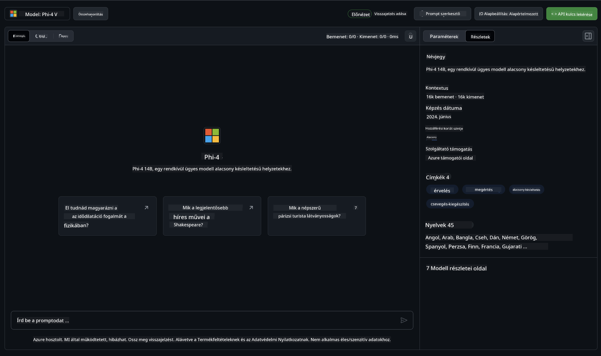

<!--
CO_OP_TRANSLATOR_METADATA:
{
  "original_hash": "fb67a08b9fc911a10ed58081fadef416",
  "translation_date": "2025-05-09T08:57:28+00:00",
  "source_file": "md/01.Introduction/02/02.GitHubModel.md",
  "language_code": "hu"
}
-->
## Phi Család a GitHub Modellekben

Üdvözlünk a [GitHub Modellek](https://github.com/marketplace/models) oldalán! Minden készen áll, hogy felfedezd az Azure AI által hosztolt AI modelleket.


További információkért a GitHub Modelleken elérhető modellekről, nézd meg a [GitHub Model Marketplace](https://github.com/marketplace/models) oldalt.

## Elérhető Modellek

Minden modellhez külön játszótér és minta kód tartozik.



### Phi Család a GitHub Model Katalógusban

- [Phi-4](https://github.com/marketplace/models/azureml/Phi-4)

- [Phi-3.5-MoE instruct (128k)](https://github.com/marketplace/models/azureml/Phi-3-5-MoE-instruct)

- [Phi-3.5-vision instruct (128k)](https://github.com/marketplace/models/azureml/Phi-3-5-vision-instruct)

- [Phi-3.5-mini instruct (128k)](https://github.com/marketplace/models/azureml/Phi-3-5-mini-instruct)

- [Phi-3-Medium-128k-Instruct](https://github.com/marketplace/models/azureml/Phi-3-medium-128k-instruct)

- [Phi-3-medium-4k-instruct](https://github.com/marketplace/models/azureml/Phi-3-medium-4k-instruct)

- [Phi-3-mini-128k-instruct](https://github.com/marketplace/models/azureml/Phi-3-mini-128k-instruct)

- [Phi-3-mini-4k-instruct](https://github.com/marketplace/models/azureml/Phi-3-mini-4k-instruct)

- [Phi-3-small-128k-instruct](https://github.com/marketplace/models/azureml/Phi-3-small-128k-instruct)

- [Phi-3-small-8k-instruct](https://github.com/marketplace/models/azureml/Phi-3-small-8k-instruct)

## Első Lépések

Van néhány alap példa, amit már futtathatsz is. Ezeket a samples könyvtárban találod. Ha inkább a kedvenc programozási nyelveddel szeretnél dolgozni, a példák a következő nyelveken érhetők el:

- Python
- JavaScript
- C#
- Java
- cURL

Ezen felül van egy dedikált Codespaces környezet a minták és modellek futtatásához.


## Minta Kód

Az alábbiakban néhány példa kódrészlet található különböző használati esetekhez. További információkért az Azure AI Inference SDK-ról, tekintsd meg a teljes dokumentációt és a mintákat.

## Beállítás

1. Hozz létre egy személyes hozzáférési tokent  
Nem szükséges engedélyeket adni a tokennek. Fontos, hogy a token egy Microsoft szolgáltatáshoz kerül továbbításra.

A lentebb található kódrészletek használatához hozz létre egy környezeti változót, amelyben a tokenedet állítod be kliens kód kulcsként.

Ha bash-t használsz:  
```
export GITHUB_TOKEN="<your-github-token-goes-here>"
```  
Ha powershell-ben vagy:  

```
$Env:GITHUB_TOKEN="<your-github-token-goes-here>"
```  

Ha Windows parancssorban vagy:  

```
set GITHUB_TOKEN=<your-github-token-goes-here>
```  

## Python Minta

### Függőségek telepítése  
Telepítsd az Azure AI Inference SDK-t pip-pel (Szükséges: Python >=3.8):

```
pip install azure-ai-inference
```  
### Egy egyszerű kódminta futtatása

Ez a példa egy alap hívást mutat be a chat completion API-hoz. A GitHub AI modell inferencia végpontját és a GitHub tokenedet használja. A hívás szinkron módon történik.

```python
import os
from azure.ai.inference import ChatCompletionsClient
from azure.ai.inference.models import SystemMessage, UserMessage
from azure.core.credentials import AzureKeyCredential

endpoint = "https://models.inference.ai.azure.com"
model_name = "Phi-4"
token = os.environ["GITHUB_TOKEN"]

client = ChatCompletionsClient(
    endpoint=endpoint,
    credential=AzureKeyCredential(token),
)

response = client.complete(
    messages=[
        UserMessage(content="I have $20,000 in my savings account, where I receive a 4% profit per year and payments twice a year. Can you please tell me how long it will take for me to become a millionaire? Also, can you please explain the math step by step as if you were explaining it to an uneducated person?"),
    ],
    temperature=0.4,
    top_p=1.0,
    max_tokens=2048,
    model=model_name
)

print(response.choices[0].message.content)
```

### Többfordulós beszélgetés futtatása

Ez a minta egy többfordulós beszélgetést mutat be a chat completion API-val. Ha chat alkalmazásban használod a modellt, neked kell kezelni a beszélgetés előzményeit és a legfrissebb üzeneteket elküldeni a modellnek.

```
import os
from azure.ai.inference import ChatCompletionsClient
from azure.ai.inference.models import AssistantMessage, SystemMessage, UserMessage
from azure.core.credentials import AzureKeyCredential

token = os.environ["GITHUB_TOKEN"]
endpoint = "https://models.inference.ai.azure.com"
# Replace Model_Name
model_name = "Phi-4"

client = ChatCompletionsClient(
    endpoint=endpoint,
    credential=AzureKeyCredential(token),
)

messages = [
    SystemMessage(content="You are a helpful assistant."),
    UserMessage(content="What is the capital of France?"),
    AssistantMessage(content="The capital of France is Paris."),
    UserMessage(content="What about Spain?"),
]

response = client.complete(messages=messages, model=model_name)

print(response.choices[0].message.content)
```

### Kimenet folyamatos streamelése

Jobb felhasználói élmény érdekében érdemes folyamatosan streamelni a modell válaszát, így az első tokenek hamar megjelennek, és nem kell sokáig várni a hosszabb válaszokra.

```
import os
from azure.ai.inference import ChatCompletionsClient
from azure.ai.inference.models import SystemMessage, UserMessage
from azure.core.credentials import AzureKeyCredential

token = os.environ["GITHUB_TOKEN"]
endpoint = "https://models.inference.ai.azure.com"
# Replace Model_Name
model_name = "Phi-4"

client = ChatCompletionsClient(
    endpoint=endpoint,
    credential=AzureKeyCredential(token),
)

response = client.complete(
    stream=True,
    messages=[
        SystemMessage(content="You are a helpful assistant."),
        UserMessage(content="Give me 5 good reasons why I should exercise every day."),
    ],
    model=model_name,
)

for update in response:
    if update.choices:
        print(update.choices[0].delta.content or "", end="")

client.close()
```

## INGYENES használat és korlátozások a GitHub Modelleknél


A [játszótér és ingyenes API használat korlátai](https://docs.github.com/en/github-models/prototyping-with-ai-models#rate-limits) arra szolgálnak, hogy kísérletezhess a modellekkel és prototípust készíthess AI alkalmazásodhoz. Ezeken a korlátokon túl, és az alkalmazásod skálázásához Azure fiókból kell erőforrásokat biztosítanod, és onnan kell hitelesítened a GitHub személyes hozzáférési token helyett. A kódodban egyéb változtatásra nincs szükség. Ezen a linken megtudhatod, hogyan léphetsz túl az ingyenes szint korlátain az Azure AI-ban.


### Figyelmeztetések

Ne feledd, hogy amikor modellel dolgozol, akkor AI-val kísérletezel, így tartalmi hibák előfordulhatnak.

A funkció különböző korlátok alá esik (például percenkénti kérés, napi kérés, kérésenkénti tokenek száma és párhuzamos kérések), és nem termelési környezethez készült.

A GitHub Modellek az Azure AI Content Safety szolgáltatást használják. Ezek a szűrők nem kapcsolhatók ki a GitHub Modellek használata során. Ha fizetős szolgáltatáson keresztül használod a modelleket, kérjük, állítsd be a tartalomszűrőket az igényeidnek megfelelően.

Ez a szolgáltatás a GitHub Előzetes kiadási feltételei alatt áll.

**Jogi nyilatkozat**:  
Ezt a dokumentumot az AI fordító szolgáltatás [Co-op Translator](https://github.com/Azure/co-op-translator) segítségével fordítottuk le. Bár a pontosságra törekszünk, kérjük, vegye figyelembe, hogy az automatikus fordítások hibákat vagy pontatlanságokat tartalmazhatnak. Az eredeti dokumentum az anyanyelvén tekintendő hiteles forrásnak. Kritikus információk esetén szakmai, emberi fordítást javaslunk. Nem vállalunk felelősséget a fordítás használatából eredő félreértésekért vagy téves értelmezésekért.