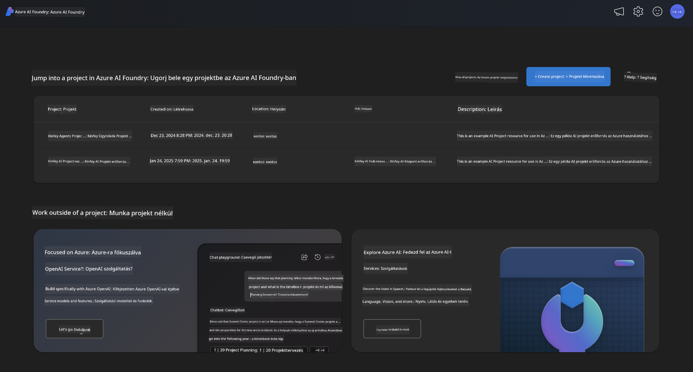
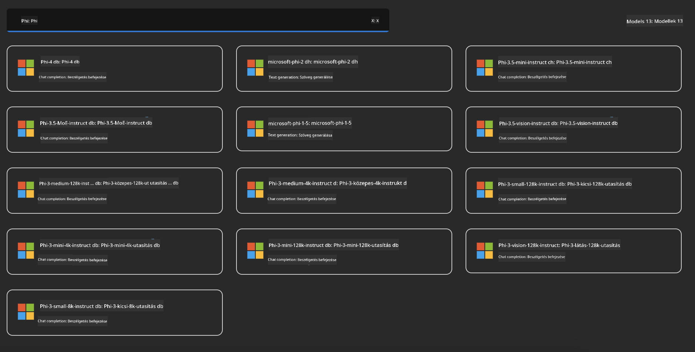
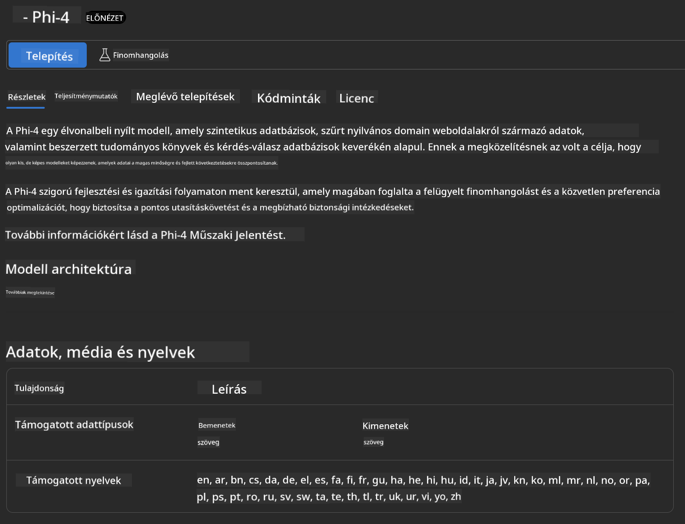
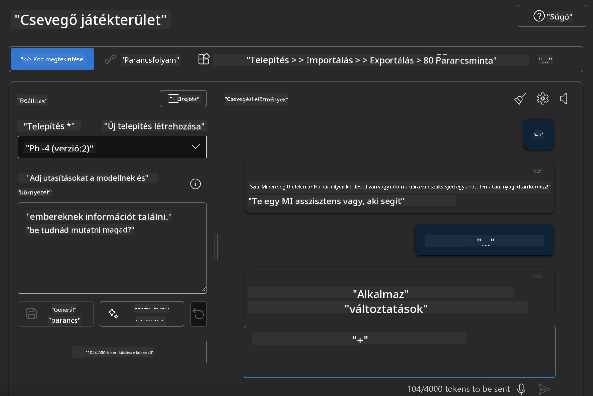

<!--
CO_OP_TRANSLATOR_METADATA:
{
  "original_hash": "3ae21dc5554e888defbe57946ee995ee",
  "translation_date": "2025-05-09T09:08:52+00:00",
  "source_file": "md/01.Introduction/02/03.AzureAIFoundry.md",
  "language_code": "hu"
}
-->
## Phi család az Azure AI Foundry-ban

Az [Azure AI Foundry](https://ai.azure.com) egy megbízható platform, amely lehetővé teszi a fejlesztők számára, hogy biztonságos, megbízható és felelősségteljes módon hajtsanak végre innovációkat és formálják a jövőt az AI segítségével.

Az [Azure AI Foundry](https://ai.azure.com) a fejlesztők számára készült, hogy:

- Vállalati szintű platformon építsenek generatív AI alkalmazásokat.
- Felfedezzék, építsék, teszteljék és telepítsék a legmodernebb AI eszközöket és gépi tanulási modelleket, miközben a felelős AI gyakorlatokra támaszkodnak.
- Együttműködjenek egy csapattal az alkalmazásfejlesztés teljes életciklusa során.

Az Azure AI Foundry segítségével számos modellt, szolgáltatást és képességet fedezhetsz fel, és elkezdheted építeni azokat az AI alkalmazásokat, amelyek a legjobban szolgálják céljaidat. Az Azure AI Foundry platform megkönnyíti a bizonyítékokon alapuló koncepciók skálázását teljes értékű, éles alkalmazásokká. A folyamatos megfigyelés és finomhangolás támogatja a hosszú távú sikert.



Az Azure AOAI Service használatán túl az Azure AI Foundry-ban harmadik féltől származó modelleket is használhatsz az Azure AI Foundry Model Catalog-ban. Ez jó választás, ha az Azure AI Foundry-t szeretnéd AI megoldás platformként használni.

A Phi család modelleket gyorsan telepíthetjük az Azure AI Foundry Model Catalog-ján keresztül

[Microsoft Phi Models in Azure AI Foundry Models](https://ai.azure.com/explore/models/?selectedCollection=phi)



### **Phi-4 telepítése az Azure AI Foundry-ban**



### **Phi-4 tesztelése az Azure AI Foundry Playground-ban**



### **Python kód futtatása az Azure AI Foundry Phi-4 meghívásához**

```python

import os  
import base64
from openai import AzureOpenAI  
from azure.identity import DefaultAzureCredential, get_bearer_token_provider  
        
endpoint = os.getenv("ENDPOINT_URL", "Your Azure AOAI Service Endpoint")  
deployment = os.getenv("DEPLOYMENT_NAME", "Phi-4")  
      
token_provider = get_bearer_token_provider(  
    DefaultAzureCredential(),  
    "https://cognitiveservices.azure.com/.default"  
)  
  
client = AzureOpenAI(  
    azure_endpoint=endpoint,  
    azure_ad_token_provider=token_provider,  
    api_version="2024-05-01-preview",  
)  
  

chat_prompt = [
    {
        "role": "system",
        "content": "You are an AI assistant that helps people find information."
    },
    {
        "role": "user",
        "content": "can you introduce yourself"
    }
] 
    
# Include speech result if speech is enabled  
messages = chat_prompt 

completion = client.chat.completions.create(  
    model=deployment,  
    messages=messages,
    max_tokens=800,  
    temperature=0.7,  
    top_p=0.95,  
    frequency_penalty=0,  
    presence_penalty=0,
    stop=None,  
    stream=False  
)  
  
print(completion.to_json())  

```

**Jogi nyilatkozat**:  
Ez a dokumentum az AI fordítószolgáltatás, a [Co-op Translator](https://github.com/Azure/co-op-translator) segítségével készült. Bár igyekszünk a pontosságra, kérjük, vegye figyelembe, hogy az automatikus fordítások hibákat vagy pontatlanságokat tartalmazhatnak. Az eredeti dokumentum az anyanyelvén tekintendő hiteles forrásnak. Fontos információk esetén szakmai, emberi fordítást javaslunk. Nem vállalunk felelősséget a fordítás használatából eredő félreértésekért vagy helytelen értelmezésekért.