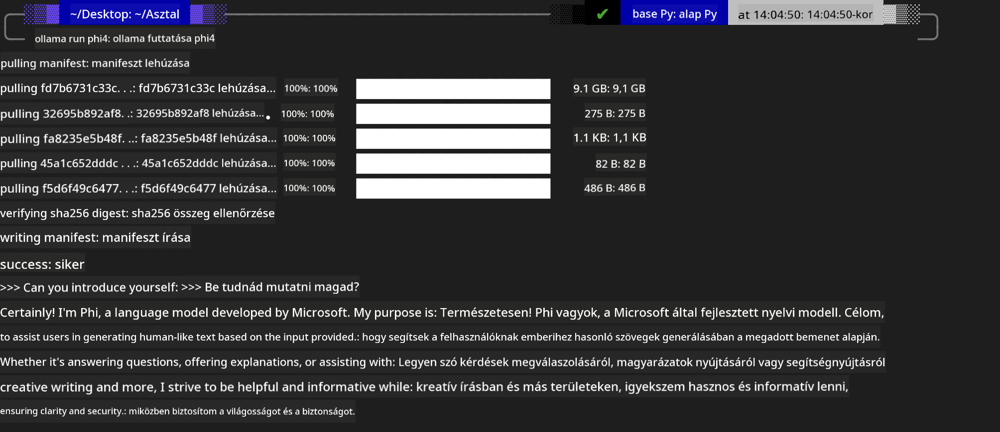
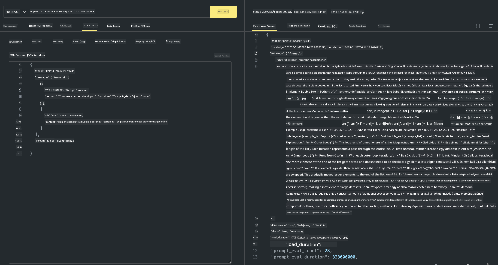

<!--
CO_OP_TRANSLATOR_METADATA:
{
  "original_hash": "0b38834693bb497f96bf53f0d941f9a1",
  "translation_date": "2025-07-16T19:18:18+00:00",
  "source_file": "md/01.Introduction/02/04.Ollama.md",
  "language_code": "hu"
}
-->
## Phi család az Ollamában


Az [Ollama](https://ollama.com) lehetővé teszi, hogy több ember egyszerű szkriptek segítségével közvetlenül telepítsen nyílt forráskódú LLM vagy SLM modelleket, és API-kat is építhet a helyi Copilot alkalmazási forgatókönyvek támogatására.

## **1. Telepítés**

Az Ollama támogatja a futtatást Windows, macOS és Linux rendszereken. Az Ollamát ezen a linken keresztül telepítheted ([https://ollama.com/download](https://ollama.com/download)). A sikeres telepítés után közvetlenül használhatod az Ollama szkriptet a Phi-3 hívására egy terminál ablakból. Megtekintheted az összes [elérhető könyvtárat az Ollamában](https://ollama.com/library). Ha ezt a tárolót egy Codespace-ben nyitod meg, akkor az Ollama már telepítve lesz.

```bash

ollama run phi4

```

> [!NOTE]
> A modellt először le fogja tölteni, amikor először futtatod. Természetesen közvetlenül megadhatod a letöltött Phi-4 modellt is. Példaként a WSL-t használjuk a parancs futtatásához. Miután a modell sikeresen letöltődött, közvetlenül a terminálon is interakcióba léphetsz vele.



## **2. Phi-4 API hívása az Ollamából**

Ha az Ollama által generált Phi-4 API-t szeretnéd hívni, a terminálban az alábbi parancs segítségével indíthatod el az Ollama szervert.

```bash

ollama serve

```

> [!NOTE]
> MacOS vagy Linux rendszeren előfordulhat a következő hibaüzenet: **"Error: listen tcp 127.0.0.1:11434: bind: address already in use"** Ez a hiba akkor jelenhet meg, amikor a parancsot futtatod. Ezt a hibát figyelmen kívül hagyhatod, mivel általában azt jelzi, hogy a szerver már fut, vagy leállíthatod, majd újraindíthatod az Ollamát:

**macOS**

```bash

brew services restart ollama

```

**Linux**

```bash

sudo systemctl stop ollama

```

Az Ollama két API-t támogat: generate és chat. Az igényeid szerint hívhatod az Ollama által biztosított modell API-t, a helyi szolgáltatásnak a 11434-es porton küldött kérésekkel.

**Chat**

```bash

curl http://127.0.0.1:11434/api/chat -d '{
  "model": "phi3",
  "messages": [
    {
      "role": "system",
      "content": "Your are a python developer."
    },
    {
      "role": "user",
      "content": "Help me generate a bubble algorithm"
    }
  ],
  "stream": false
  
}'

This is the result in Postman



## Additional Resources

Check the list of available models in Ollama in [their library](https://ollama.com/library).

Pull your model from the Ollama server using this command

```bash
ollama pull phi4
```

Run the model using this command

```bash
ollama run phi4
```

***Note:*** Visit this link [https://github.com/ollama/ollama/blob/main/docs/api.md](https://github.com/ollama/ollama/blob/main/docs/api.md) to learn more

## Calling Ollama from Python

You can use `requests` or `urllib3` to make requests to the local server endpoints used above. However, a popular way to use Ollama in Python is via the [openai](https://pypi.org/project/openai/) SDK, since Ollama provides OpenAI-compatible server endpoints as well.

Here is an example for phi3-mini:

```python
import openai

client = openai.OpenAI(
    base_url="http://localhost:11434/v1",
    api_key="nokeyneeded",
)

response = client.chat.completions.create(
    model="phi4",
    temperature=0.7,
    n=1,
    messages=[
        {"role": "system", "content": "You are a helpful assistant."},
        {"role": "user", "content": "Write a haiku about a hungry cat"},
    ],
)

print("Response:")
print(response.choices[0].message.content)
```

## Calling Ollama from JavaScript 

```javascript
// Példa egy fájl összefoglalására Phi-4-gyel
script({
    model: "ollama:phi4",
    title: "Összefoglalás Phi-4-gyel",
    system: ["system"],
})

// Összefoglalás példa
const file = def("FILE", env.files)
$`Összefoglaló ${file} egyetlen bekezdésben.`
```

## Calling Ollama from C#

Create a new C# Console application and add the following NuGet package:

```bash
dotnet add package Microsoft.SemanticKernel --version 1.34.0
```

Then replace this code in the `Program.cs` file

```csharp
using Microsoft.SemanticKernel;
using Microsoft.SemanticKernel.ChatCompletion;

// chat completion szolgáltatás hozzáadása a helyi ollama szerver végpont használatával
#pragma warning disable SKEXP0001, SKEXP0003, SKEXP0010, SKEXP0011, SKEXP0050, SKEXP0052
builder.AddOpenAIChatCompletion(
    modelId: "phi4",
    endpoint: new Uri("http://localhost:11434/"),
    apiKey: "non required");

// egyszerű prompt meghívása a chat szolgáltatáshoz
string prompt = "Írj egy viccet kiscicákról";
var response = await kernel.InvokePromptAsync(prompt);
Console.WriteLine(response.GetValue<string>());
```

Run the app with the command:

```bash
dotnet run


**Jogi nyilatkozat**:  
Ez a dokumentum az AI fordító szolgáltatás, a [Co-op Translator](https://github.com/Azure/co-op-translator) segítségével készült. Bár a pontosságra törekszünk, kérjük, vegye figyelembe, hogy az automatikus fordítások hibákat vagy pontatlanságokat tartalmazhatnak. Az eredeti dokumentum az anyanyelvén tekintendő hiteles forrásnak. Fontos információk esetén szakmai, emberi fordítást javaslunk. Nem vállalunk felelősséget a fordítás használatából eredő félreértésekért vagy téves értelmezésekért.