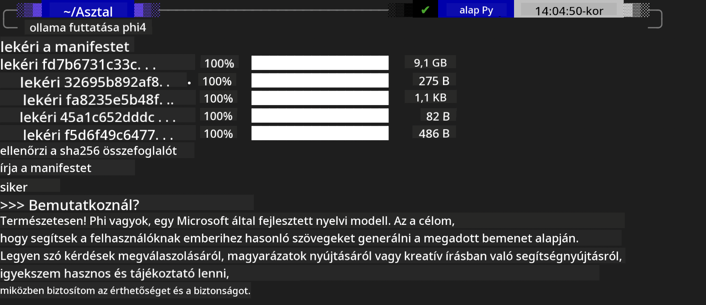
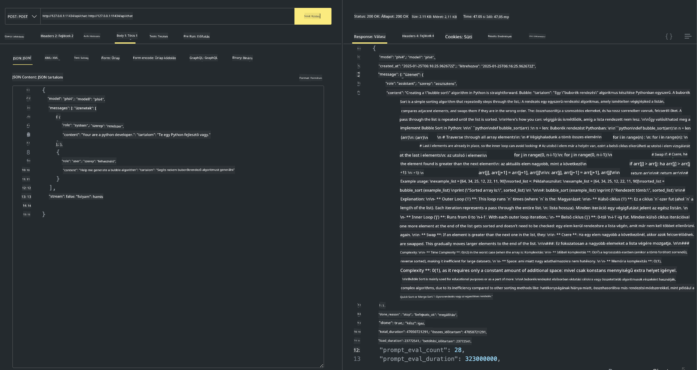

<!--
CO_OP_TRANSLATOR_METADATA:
{
  "original_hash": "0b38834693bb497f96bf53f0d941f9a1",
  "translation_date": "2025-05-09T09:22:26+00:00",
  "source_file": "md/01.Introduction/02/04.Ollama.md",
  "language_code": "hu"
}
-->
## Phi család az Ollamában


Az [Ollama](https://ollama.com) lehetővé teszi, hogy több ember egyszerű szkriptek segítségével közvetlenül telepítsen nyílt forráskódú LLM vagy SLM modelleket, és API-kat is építhet a helyi Copilot alkalmazási forgatókönyvek támogatására.

## **1. Telepítés**

Az Ollama támogatja a futtatást Windows, macOS és Linux rendszereken. Az Ollamát ezen a linken keresztül telepítheted ([https://ollama.com/download](https://ollama.com/download)). A sikeres telepítés után közvetlenül a terminál ablakból hívhatod meg a Phi-3 modellt Ollama szkripttel. Megnézheted az összes [elérhető könyvtárat az Ollamában](https://ollama.com/library). Ha ezt a tárhelyet Codespace-ben nyitod meg, az Ollama már telepítve lesz.

```bash

ollama run phi4

```

> [!NOTE]
> A modell először le fog töltődni, amikor először futtatod. Természetesen megadhatod közvetlenül a már letöltött Phi-4 modellt is. Példaként WSL-t használunk a parancs futtatásához. A modell sikeres letöltése után közvetlenül a terminálon léphetsz vele interakcióba.



## **2. Phi-4 API hívása Ollamából**

Ha az ollama által generált Phi-4 API-t szeretnéd használni, a terminálban ezt a parancsot futtatva indíthatod el az Ollama szervert.

```bash

ollama serve

```

> [!NOTE]
> MacOS vagy Linux rendszeren előfordulhat a következő hibaüzenet: **"Error: listen tcp 127.0.0.1:11434: bind: address already in use"** Ez akkor jelentkezhet, amikor a parancsot futtatod. Ezt az üzenetet figyelmen kívül hagyhatod, mert általában azt jelzi, hogy a szerver már fut, vagy leállíthatod és újraindíthatod az Ollamát:

**macOS**

```bash

brew services restart ollama

```

**Linux**

```bash

sudo systemctl stop ollama

```

Az Ollama két API-t támogat: generate és chat. Az igényeid szerint hívhatod az Ollama által biztosított modell API-t, ha kéréseket küldesz a helyi szolgáltatásnak, amely a 11434-es porton fut.

**Chat**

```bash

curl http://127.0.0.1:11434/api/chat -d '{
  "model": "phi3",
  "messages": [
    {
      "role": "system",
      "content": "Your are a python developer."
    },
    {
      "role": "user",
      "content": "Help me generate a bubble algorithm"
    }
  ],
  "stream": false
  
}'

This is the result in Postman



## Additional Resources

Check the list of available models in Ollama in [their library](https://ollama.com/library).

Pull your model from the Ollama server using this command

```bash
ollama pull phi4
```

Run the model using this command

```bash
ollama run phi4
```

***Note:*** Visit this link [https://github.com/ollama/ollama/blob/main/docs/api.md](https://github.com/ollama/ollama/blob/main/docs/api.md) to learn more

## Calling Ollama from Python

You can use `requests` or `urllib3` to make requests to the local server endpoints used above. However, a popular way to use Ollama in Python is via the [openai](https://pypi.org/project/openai/) SDK, since Ollama provides OpenAI-compatible server endpoints as well.

Here is an example for phi3-mini:

```python
import openai

client = openai.OpenAI(
    base_url="http://localhost:11434/v1",
    api_key="nokeyneeded",
)

response = client.chat.completions.create(
    model="phi4",
    temperature=0.7,
    n=1,
    messages=[
        {"role": "system", "content": "You are a helpful assistant."},
        {"role": "user", "content": "Write a haiku about a hungry cat"},
    ],
)

print("Response:")
print(response.choices[0].message.content)
```

## Calling Ollama from JavaScript 

```javascript
// Példa egy fájl összefoglalására Phi-4-gyel
script({
    model: "ollama:phi4",
    title: "Összefoglalás Phi-4-gyel",
    system: ["system"],
})

// Összefoglalás példa
const file = def("FILE", env.files)
$`Összefoglaló ${file} egyetlen bekezdésben.`
```

## Calling Ollama from C#

Create a new C# Console application and add the following NuGet package:

```bash
dotnet add package Microsoft.SemanticKernel --version 1.34.0
```

Then replace this code in the `Program.cs` file

```csharp
using Microsoft.SemanticKernel;
using Microsoft.SemanticKernel.ChatCompletion;

// chat completion szolgáltatás hozzáadása a helyi ollama szerver végpontjához
#pragma warning disable SKEXP0001, SKEXP0003, SKEXP0010, SKEXP0011, SKEXP0050, SKEXP0052
builder.AddOpenAIChatCompletion(
    modelId: "phi4",
    endpoint: new Uri("http://localhost:11434/"),
    apiKey: "non required");

// egyszerű prompt meghívása a chat szolgáltatáshoz
string prompt = "Írj egy viccet kiscicákról";
var response = await kernel.InvokePromptAsync(prompt);
Console.WriteLine(response.GetValue<string>());
```

Run the app with the command:

```bash
dotnet run

**Jogi nyilatkozat**:  
Ez a dokumentum az AI fordító szolgáltatás, a [Co-op Translator](https://github.com/Azure/co-op-translator) segítségével készült. Bár igyekszünk a pontosságra, kérjük, vegye figyelembe, hogy az automatikus fordítások hibákat vagy pontatlanságokat tartalmazhatnak. Az eredeti dokumentum az anyanyelvén tekintendő hiteles forrásnak. Fontos információk esetén professzionális emberi fordítást javaslunk. Nem vállalunk felelősséget a fordítás használatából eredő félreértésekért vagy téves értelmezésekért.