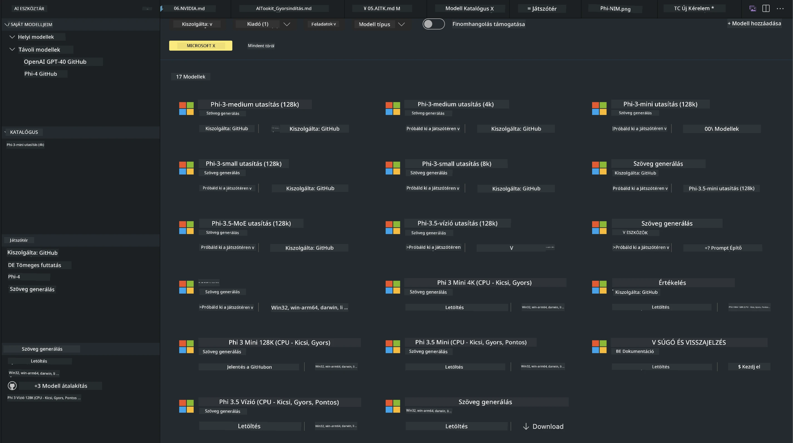
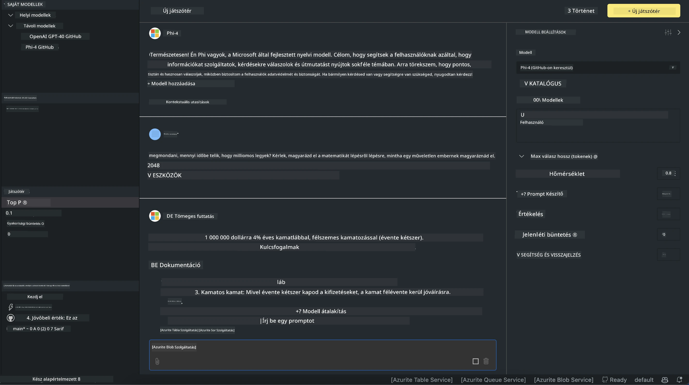

# Phi család az AITK-ban

[AI Toolkit for VS Code](https://marketplace.visualstudio.com/items?itemName=ms-windows-ai-studio.windows-ai-studio) leegyszerűsíti a generatív AI alkalmazások fejlesztését azáltal, hogy egyesíti a legmodernebb AI fejlesztőeszközöket és modelleket az Azure AI Foundry Katalógusból, valamint más katalógusokból, például a Hugging Face-ből. Böngészheted a GitHub Models és az Azure AI Foundry Model Katalógusok által támogatott AI modellek katalógusát, letöltheted őket helyileg vagy távolról, finomhangolhatod, tesztelheted, és használhatod az alkalmazásodban.

Az AI Toolkit előnézete helyileg fut. A helyi inferencia vagy finomhangolás a kiválasztott modelltől függően GPU-t igényelhet, például NVIDIA CUDA GPU-t. A GitHub modelleket is közvetlenül futtathatod az AITK-val.

## Első lépések

[Tudj meg többet a Windows alrendszer Linuxhoz történő telepítéséről](https://learn.microsoft.com/windows/wsl/install?WT.mc_id=aiml-137032-kinfeylo)

és az [alapértelmezett disztribúció megváltoztatásáról](https://learn.microsoft.com/windows/wsl/install#change-the-default-linux-distribution-installed).

[AI Toolkit GitHub tárhely](https://github.com/microsoft/vscode-ai-toolkit/)

- Windows, Linux, macOS

- Finomhangoláshoz Windows és Linux alatt Nvidia GPU szükséges. Ezen felül **Windows** esetén szükséges a Linux alrendszer Ubuntu 18.4 vagy újabb disztribúcióval. [Tudj meg többet a Windows alrendszer Linuxhoz történő telepítéséről](https://learn.microsoft.com/windows/wsl/install) és az [alapértelmezett disztribúció megváltoztatásáról](https://learn.microsoft.com/windows/wsl/install#change-the-default-linux-distribution-installed).

### AI Toolkit telepítése

Az AI Toolkit egy [Visual Studio Code bővítményként](https://code.visualstudio.com/docs/setup/additional-components#_vs-code-extensions) érkezik, ezért először telepítened kell a [VS Code-ot](https://code.visualstudio.com/docs/setup/windows?WT.mc_id=aiml-137032-kinfeylo), majd le kell töltened az AI Toolkit-et a [VS Marketplace-ről](https://marketplace.visualstudio.com/items?itemName=ms-windows-ai-studio.windows-ai-studio).  
Az [AI Toolkit elérhető a Visual Studio Marketplace-ben](https://marketplace.visualstudio.com/items?itemName=ms-windows-ai-studio.windows-ai-studio), és ugyanúgy telepíthető, mint bármely más VS Code bővítmény.

Ha nem ismered a VS Code bővítmények telepítését, kövesd az alábbi lépéseket:

### Bejelentkezés

1. A VS Code tevékenységsávjában válaszd az **Extensions** menüpontot  
1. Az Extensions keresőmezőbe írd be: "AI Toolkit"  
1. Válaszd ki az "AI Toolkit for Visual Studio code" bővítményt  
1. Kattints az **Install** gombra

Most már készen állsz a bővítmény használatára!

A rendszer bejelentkezésre fog kérni GitHub fiókoddal, ezért kattints az "Allow" gombra a folytatáshoz. Átirányítanak a GitHub bejelentkezési oldalára.

Jelentkezz be, és kövesd a lépéseket. Sikeres bejelentkezés után visszairányítanak a VS Code-ba.

A bővítmény telepítése után megjelenik az AI Toolkit ikon a tevékenységsávban.

Fedezzük fel a rendelkezésre álló funkciókat!

### Elérhető funkciók

Az AI Toolkit fő oldalsávja a következőkre van felosztva:

- **Models**  
- **Resources**  
- **Playground**  
- **Fine-tuning**  
- **Evaluation**

A Resources szekcióban érhetők el. A kezdéshez válaszd a **Model Catalog**-ot.

### Modell letöltése a katalógusból

Az AI Toolkit elindítása után a VS Code oldalsávból a következő lehetőségek közül választhatsz:



- Keress egy támogatott modellt a **Model Catalog**-ban, és töltsd le helyileg  
- Teszteld a modell inferenciáját a **Model Playground**-ban  
- Finomhangold a modellt helyileg vagy távolról a **Model Fine-tuning**-ban  
- Telepítsd a finomhangolt modelleket felhőbe az AI Toolkit parancspalettáján keresztül  
- Modellek értékelése

> [!NOTE]
>
> **GPU vs CPU**
>
> Észre fogod venni, hogy a modellkártyákon szerepel a modell mérete, a platform és az gyorsító típusa (CPU, GPU). Az optimalizált teljesítmény érdekében **Windows eszközökön, ahol legalább egy GPU elérhető**, válassz olyan modellverziókat, amelyek kizárólag Windowsra céloznak.
>
> Ez biztosítja, hogy a modell a DirectML gyorsítóhoz legyen optimalizálva.
>
> A modellnevek formátuma:
>
> - `{model_name}-{accelerator}-{quantization}-{format}`.
>
>Ha szeretnéd ellenőrizni, hogy van-e GPU a Windows eszközödön, nyisd meg a **Feladatkezelőt**, majd válaszd a **Teljesítmény** fület. Ha van GPU, azok nevei például "GPU 0" vagy "GPU 1" lesznek.

### Modell futtatása a playground-ban

Miután minden paramétert beállítottál, kattints a **Generate Project** gombra.

Miután a modell letöltődött, válaszd a katalógusban a modellkártyán a **Load in Playground** opciót:

- Indítsd el a modell letöltését  
- Telepítsd az összes előfeltételt és függőséget  
- Hozd létre a VS Code munkaterületet



### REST API használata az alkalmazásodban

Az AI Toolkit egy helyi REST API webszervert biztosít **5272-es porton**, amely az [OpenAI chat completions formátumot](https://platform.openai.com/docs/api-reference/chat/create) használja.

Ez lehetővé teszi, hogy helyben teszteld az alkalmazásodat anélkül, hogy felhőalapú AI modell szolgáltatásra kellene támaszkodnod. Például az alábbi JSON fájl mutatja, hogyan konfiguráld a kérés törzsét:

```json
{
    "model": "Phi-4",
    "messages": [
        {
            "role": "user",
            "content": "what is the golden ratio?"
        }
    ],
    "temperature": 0.7,
    "top_p": 1,
    "top_k": 10,
    "max_tokens": 100,
    "stream": true
}
```

A REST API-t tesztelheted például a [Postman](https://www.postman.com/) vagy a CURL (Client URL) eszköz segítségével:

```bash
curl -vX POST http://127.0.0.1:5272/v1/chat/completions -H 'Content-Type: application/json' -d @body.json
```

### OpenAI klienskönyvtár használata Pythonhoz

```python
from openai import OpenAI

client = OpenAI(
    base_url="http://127.0.0.1:5272/v1/", 
    api_key="x" # required for the API but not used
)

chat_completion = client.chat.completions.create(
    messages=[
        {
            "role": "user",
            "content": "what is the golden ratio?",
        }
    ],
    model="Phi-4",
)

print(chat_completion.choices[0].message.content)
```

### Azure OpenAI klienskönyvtár használata .NET-hez

Add hozzá a projektedhez a [Azure OpenAI klienskönyvtárat .NET-hez](https://www.nuget.org/packages/Azure.AI.OpenAI/) NuGet segítségével:

```bash
dotnet add {project_name} package Azure.AI.OpenAI --version 1.0.0-beta.17
```

Adj hozzá egy **OverridePolicy.cs** nevű C# fájlt a projektedhez, és illeszd be a következő kódot:

```csharp
// OverridePolicy.cs
using Azure.Core.Pipeline;
using Azure.Core;

internal partial class OverrideRequestUriPolicy(Uri overrideUri)
    : HttpPipelineSynchronousPolicy
{
    private readonly Uri _overrideUri = overrideUri;

    public override void OnSendingRequest(HttpMessage message)
    {
        message.Request.Uri.Reset(_overrideUri);
    }
}
```

Ezután illeszd be a következő kódot a **Program.cs** fájlodba:

```csharp
// Program.cs
using Azure.AI.OpenAI;

Uri localhostUri = new("http://localhost:5272/v1/chat/completions");

OpenAIClientOptions clientOptions = new();
clientOptions.AddPolicy(
    new OverrideRequestUriPolicy(localhostUri),
    Azure.Core.HttpPipelinePosition.BeforeTransport);
OpenAIClient client = new(openAIApiKey: "unused", clientOptions);

ChatCompletionsOptions options = new()
{
    DeploymentName = "Phi-4",
    Messages =
    {
        new ChatRequestSystemMessage("You are a helpful assistant. Be brief and succinct."),
        new ChatRequestUserMessage("What is the golden ratio?"),
    }
};

StreamingResponse<StreamingChatCompletionsUpdate> streamingChatResponse
    = await client.GetChatCompletionsStreamingAsync(options);

await foreach (StreamingChatCompletionsUpdate chatChunk in streamingChatResponse)
{
    Console.Write(chatChunk.ContentUpdate);
}
```


## Finomhangolás az AI Toolkit-tel

- Kezdd a modell felfedezésével és a playground használatával.  
- Modell finomhangolás és inferencia helyi számítási erőforrásokkal.  
- Távoli finomhangolás és inferencia Azure erőforrásokkal.

[Finomhangolás az AI Toolkit-tel](../../03.FineTuning/Finetuning_VSCodeaitoolkit.md)

## AI Toolkit GYIK és források

A leggyakoribb problémák és megoldások megtalálhatók a [GYIK oldalunkon](https://github.com/microsoft/vscode-ai-toolkit/blob/main/archive/QA.md)

**Jogi nyilatkozat**:  
Ez a dokumentum az AI fordító szolgáltatás, a [Co-op Translator](https://github.com/Azure/co-op-translator) segítségével készült. Bár a pontosságra törekszünk, kérjük, vegye figyelembe, hogy az automatikus fordítások hibákat vagy pontatlanságokat tartalmazhatnak. Az eredeti dokumentum az anyanyelvén tekintendő hiteles forrásnak. Fontos információk esetén szakmai, emberi fordítást javaslunk. Nem vállalunk felelősséget a fordítás használatából eredő félreértésekért vagy téves értelmezésekért.