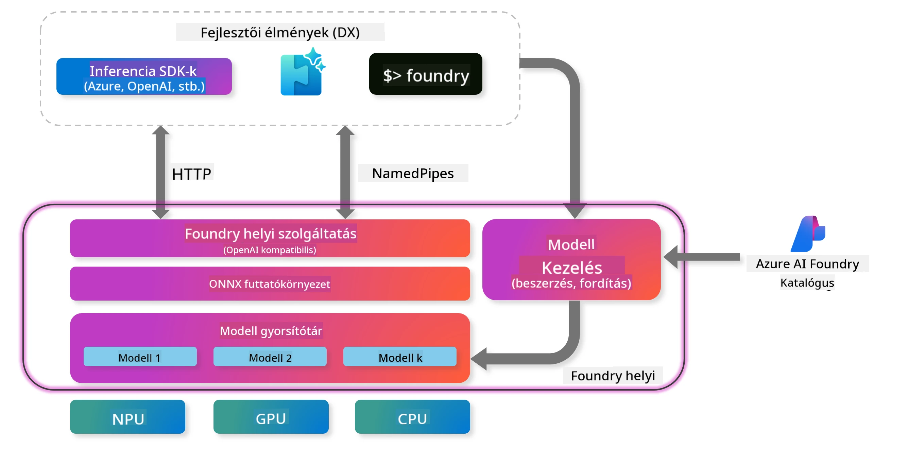
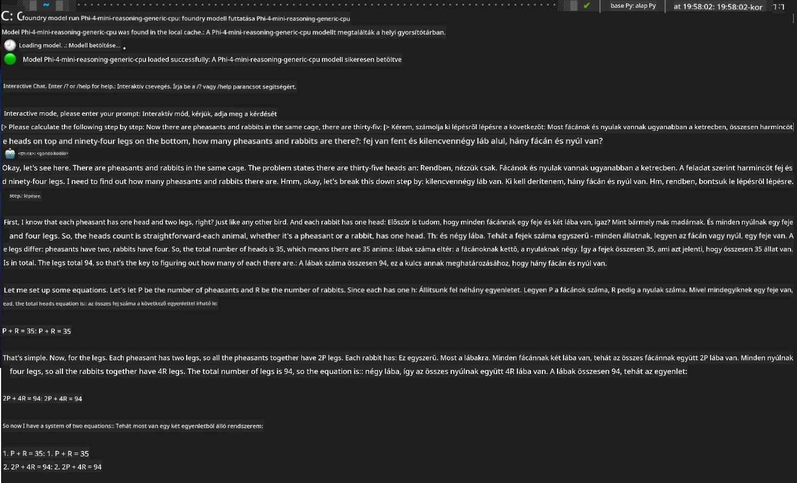

## Phi-Family modellek használata a Foundry Localban

### Bevezetés a Foundry Localba

A Foundry Local egy erőteljes, helyi eszközön futó AI inferencia megoldás, amely vállalati szintű mesterséges intelligencia képességeket hoz közvetlenül a helyi hardveredre. Ez az útmutató végigvezet a Phi-Family modellek Foundry Localban történő beállításán és használatán, így teljes irányítást kapsz az AI feladataid felett, miközben megőrzöd az adatvédelmet és csökkented a költségeket.

A Foundry Local teljesítményt, adatvédelmet, testreszabhatóságot és költséghatékonyságot kínál azzal, hogy az AI modelleket helyben, a saját eszközödön futtatja. Zökkenőmentesen illeszkedik a meglévő munkafolyamataidhoz és alkalmazásaidhoz egy intuitív CLI, SDK és REST API segítségével.




### Miért érdemes a Foundry Localt választani?

A Foundry Local előnyeinek megértése segít megalapozott döntést hozni az AI telepítési stratégiádról:

- **Helyi inferencia:** Modelleket futtathatsz a saját hardvereden, csökkentve a költségeket, miközben az összes adatod nálad marad.

- **Modellek testreszabása:** Választhatsz előre beállított modellek közül, vagy használhatod a sajátodat, hogy megfeleljen a speciális igényeidnek és felhasználási eseteknek.

- **Költséghatékonyság:** Megszünteti a felhőszolgáltatások ismétlődő költségeit azzal, hogy a meglévő hardveredet használod, így az AI elérhetőbbé válik.

- **Zökkenőmentes integráció:** Csatlakozz az alkalmazásaidhoz SDK, API végpontok vagy CLI segítségével, és könnyedén skálázhatsz Microsoft Foundry felé, ha növekednek az igényeid.

> **Kezdő lépések megjegyzés:** Ez az útmutató a Foundry Local CLI és SDK felületeken keresztüli használatára fókuszál. Mindkét megközelítést megismered, hogy kiválaszthasd a legmegfelelőbbet a saját esetedhez.

## 1. rész: Foundry Local CLI beállítása

### 1. lépés: Telepítés

A Foundry Local CLI az ajtód az AI modellek helyi kezeléséhez és futtatásához. Kezdjük azzal, hogy telepítjük a rendszeredre.

**Támogatott platformok:** Windows és macOS

A részletes telepítési útmutatóért kérjük, tekintsd meg a [hivatalos Foundry Local dokumentációt](https://github.com/microsoft/Foundry-Local/blob/main/README.md).

### 2. lépés: Elérhető modellek felfedezése

Miután telepítetted a Foundry Local CLI-t, megnézheted, milyen modellek állnak rendelkezésre a felhasználási esetedhez. Ez a parancs megmutatja az összes támogatott modellt:


```bash
foundry model list
```

### 3. lépés: A Phi Family modellek megértése

A Phi Family különböző modelleket kínál, amelyek különböző felhasználási esetekhez és hardver konfigurációkhoz vannak optimalizálva. Íme a Foundry Localban elérhető Phi modellek:

**Elérhető Phi modellek:** 

- **phi-3.5-mini** - Kompakt modell alapvető feladatokhoz
- **phi-3-mini-128k** - Hosszabb beszélgetésekhez bővített kontextusú változat
- **phi-3-mini-4k** - Általános használatra szánt standard kontextusú modell
- **phi-4** - Fejlett modell továbbfejlesztett képességekkel
- **phi-4-mini** - A Phi-4 könnyített változata
- **phi-4-mini-reasoning** - Kifejezetten összetett érvelési feladatokra specializálva

> **Hardver kompatibilitás:** Minden modell konfigurálható különböző hardveres gyorsítókra (CPU, GPU) a rendszered képességei szerint.

### 4. lépés: Az első Phi modell futtatása

Kezdjünk egy gyakorlati példával. Futtatjuk a `phi-4-mini-reasoning` modellt, amely kiválóan alkalmas összetett problémák lépésről lépésre történő megoldására.


**Parancs a modell futtatásához:**

```bash
foundry model run Phi-4-mini-reasoning-generic-cpu
```

> **Első futtatás:** Amikor először futtatsz egy modellt, a Foundry Local automatikusan letölti azt a helyi eszközödre. A letöltési idő a hálózati sebességedtől függ, ezért kérjük, légy türelemmel az első beállítás során.

### 5. lépés: A modell tesztelése valós problémával

Most teszteljük a modellt egy klasszikus logikai feladattal, hogy lássuk, hogyan működik a lépésenkénti érvelés:

**Példa feladat:**

```txt
Please calculate the following step by step: Now there are pheasants and rabbits in the same cage, there are thirty-five heads on top and ninety-four legs on the bottom, how many pheasants and rabbits are there?
```

**Elvárt viselkedés:** A modellnek logikai lépésekre kell bontania a problémát, felhasználva azt a tényt, hogy a fácánnak 2 lába, a nyúlnak pedig 4 lába van, hogy megoldja az egyenletrendszert.

**Eredmények:**



## 2. rész: Alkalmazások építése Foundry Local SDK-val

### Miért érdemes az SDK-t használni?

Míg a CLI tökéletes a teszteléshez és gyors interakciókhoz, az SDK lehetővé teszi, hogy programozottan integráld a Foundry Localt az alkalmazásaidba. Ez megnyitja az ajtót a következő lehetőségek előtt:

- Egyedi, AI-alapú alkalmazások fejlesztése
- Automatizált munkafolyamatok létrehozása
- AI képességek integrálása meglévő rendszerekbe
- Chatbotok és interaktív eszközök fejlesztése

### Támogatott programozási nyelvek

A Foundry Local több programozási nyelvhez kínál SDK támogatást, hogy illeszkedjen a fejlesztési preferenciáidhoz:

**📦 Elérhető SDK-k:**

- **C# (.NET):** [SDK dokumentáció és példák](https://github.com/microsoft/Foundry-Local/tree/main/sdk/cs)
- **Python:** [SDK dokumentáció és példák](https://github.com/microsoft/Foundry-Local/tree/main/sdk/python)
- **JavaScript:** [SDK dokumentáció és példák](https://github.com/microsoft/Foundry-Local/tree/main/sdk/js)
- **Rust:** [SDK dokumentáció és példák](https://github.com/microsoft/Foundry-Local/tree/main/sdk/rust)

### Következő lépések

1. **Válaszd ki a számodra legmegfelelőbb SDK-t** a fejlesztési környezeted alapján
2. **Kövess az SDK-specifikus dokumentációt** a részletes megvalósítási útmutatókért
3. **Kezdj egyszerű példákkal**, mielőtt összetett alkalmazásokat építenél
4. **Fedezd fel a mintakódokat**, amelyeket minden SDK tárházban találsz

## Összefoglalás

Most már tudod, hogyan kell:
- ✅ Telepíteni és beállítani a Foundry Local CLI-t
- ✅ Felfedezni és futtatni a Phi Family modelleket
- ✅ Tesztelni a modelleket valós problémákkal
- ✅ Megérteni az SDK lehetőségeit az alkalmazásfejlesztéshez

A Foundry Local erőteljes alapot nyújt ahhoz, hogy az AI képességeket közvetlenül a helyi környezetedbe hozd, irányítást adva a teljesítmény, adatvédelem és költségek felett, miközben megőrzi a rugalmasságot a felhőalapú megoldások felé történő skálázáshoz, ha szükséges.

**Jogi nyilatkozat**:  
Ez a dokumentum az AI fordító szolgáltatás, a [Co-op Translator](https://github.com/Azure/co-op-translator) segítségével készült. Bár a pontosságra törekszünk, kérjük, vegye figyelembe, hogy az automatikus fordítások hibákat vagy pontatlanságokat tartalmazhatnak. Az eredeti dokumentum az anyanyelvén tekintendő hiteles forrásnak. Kritikus információk esetén professzionális emberi fordítást javaslunk. Nem vállalunk felelősséget a fordítás használatából eredő félreértésekért vagy téves értelmezésekért.