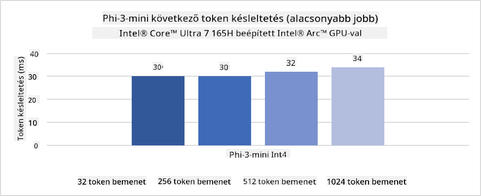
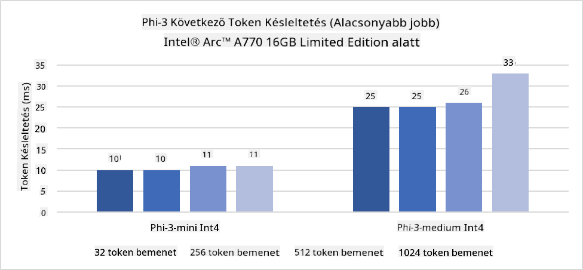
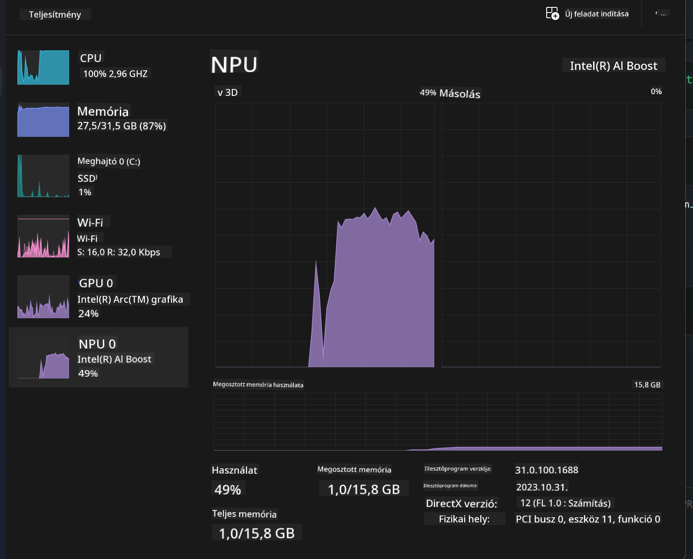
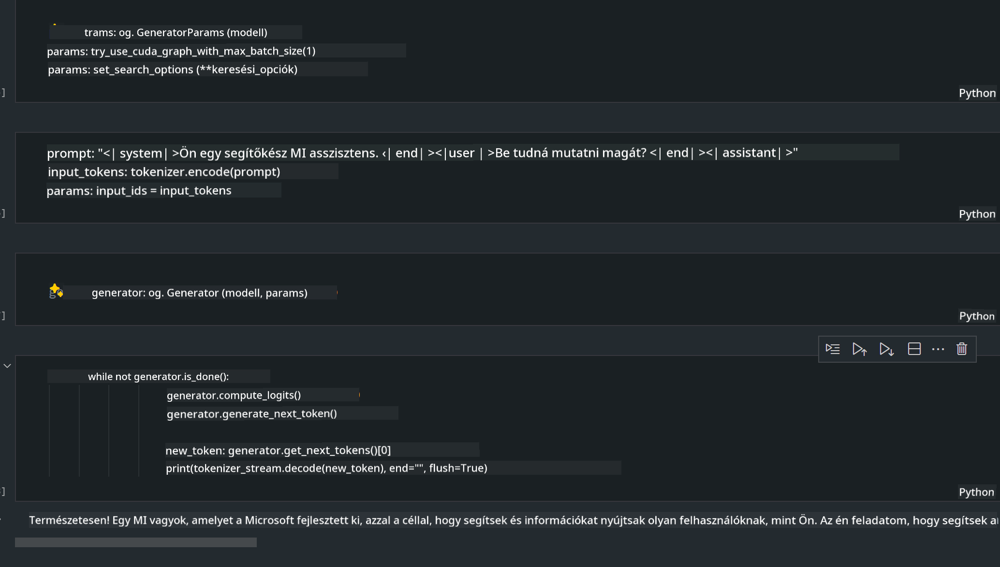
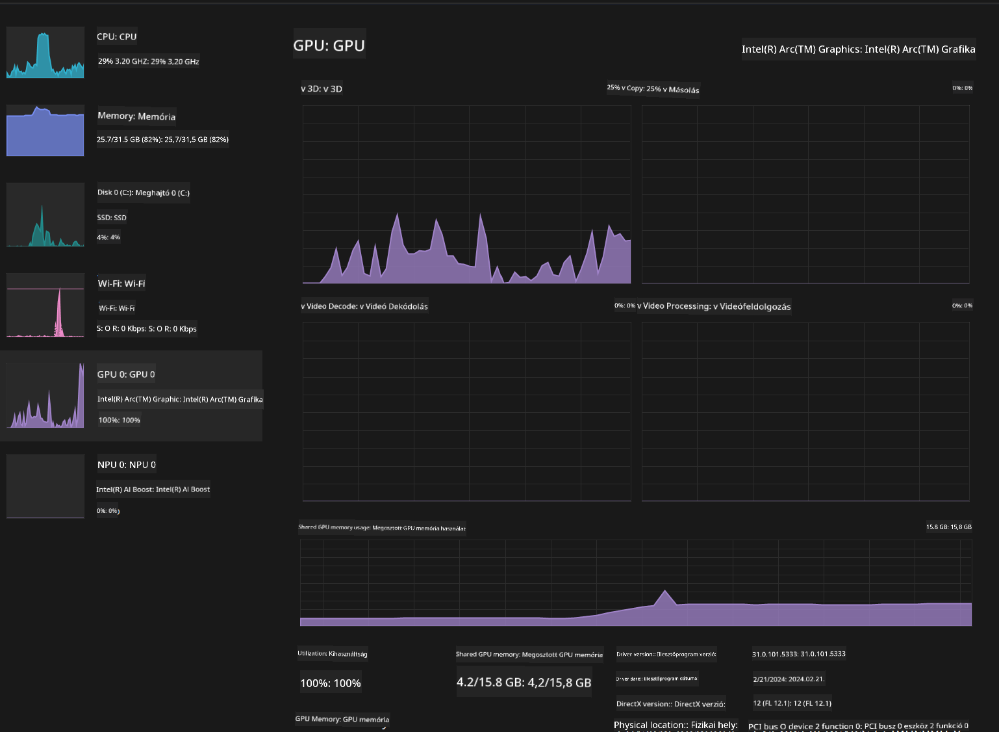

<!--
CO_OP_TRANSLATOR_METADATA:
{
  "original_hash": "e08ce816e23ad813244a09ca34ebb8ac",
  "translation_date": "2025-05-09T10:32:51+00:00",
  "source_file": "md/01.Introduction/03/AIPC_Inference.md",
  "language_code": "hu"
}
-->
# **Phi-3 inferálása AI PC-n**

A generatív AI fejlődésével és az élő eszközök hardveres képességeinek javulásával egyre több generatív AI modell integrálható a felhasználók saját eszközeibe (BYOD). Az AI PC-k is ezek közé tartoznak. 2024-től az Intel, az AMD és a Qualcomm együttműködött a PC gyártókkal, hogy olyan AI PC-ket vezessenek be, amelyek hardveres módosítások révén támogatják a helyi generatív AI modellek telepítését. Ebben a témában az Intel AI PC-kre fókuszálunk, és megvizsgáljuk, hogyan telepíthető a Phi-3 egy Intel AI PC-n.

### Mi az az NPU

Az NPU (Neurális Feldolgozó Egység) egy dedikált processzor vagy feldolgozó egység egy nagyobb SoC-n belül, amely kifejezetten a neurális hálózatok műveleteinek és AI feladatok gyorsítására készült. Ellentétben az általános célú CPU-kkal és GPU-kkal, az NPU-k adatvezérelt párhuzamos számításra optimalizáltak, így rendkívül hatékonyak nagy mennyiségű multimédiás adat, például videók és képek feldolgozásában, valamint neurális hálózatok adatainak kezelésében. Különösen jól kezelik az AI-hoz kapcsolódó feladatokat, mint például a beszédfelismerést, videóhívások háttér elmosását vagy fotó- és videószerkesztési folyamatokat, például objektumfelismerést.

## NPU vs GPU

Bár sok AI és gépi tanulási feladat GPU-kon fut, fontos különbség van a GPU-k és az NPU-k között.  
A GPU-k párhuzamos számítási képességeikről ismertek, de nem mindegyikük egyformán hatékony a grafikus feldolgozáson túl. Az NPU-k viszont kifejezetten a neurális hálózatok komplex számításaira lettek tervezve, így rendkívül hatékonyak AI feladatoknál.

Összefoglalva, az NPU-k a matematikai zsenik, amelyek felgyorsítják az AI számításokat, és kulcsszerepet játszanak az AI PC-k új korszakában!

***Ez a példa az Intel legújabb Intel Core Ultra processzorán alapul***

## **1. Phi-3 modell futtatása NPU-val**

Az Intel® NPU eszköz egy AI inferencia gyorsító, amely az Intel kliens CPU-kkal integrált, az Intel® Core™ Ultra CPU generációjától kezdve (korábban Meteor Lake néven ismert). Energiahatékony végrehajtást tesz lehetővé mesterséges neurális hálózati feladatok számára.





**Intel NPU Acceleration Library**

Az Intel NPU Acceleration Library [https://github.com/intel/intel-npu-acceleration-library](https://github.com/intel/intel-npu-acceleration-library) egy Python könyvtár, amely az Intel Neurális Feldolgozó Egység (NPU) erejét használva gyorsítja alkalmazásaidat kompatibilis hardveren.

Példa a Phi-3-mini modellre AI PC-n, amelyet Intel® Core™ Ultra processzor hajt.


Python könyvtár telepítése pip-pel

```bash

   pip install intel-npu-acceleration-library

```

***Megjegyzés*** A projekt még fejlesztés alatt áll, de a referencia modell már nagyon fejlett.

### **Phi-3 futtatása Intel NPU Acceleration Library-vel**

Az Intel NPU gyorsítással ez a könyvtár nem befolyásolja a hagyományos kódolási folyamatot. Csak a könyvtárat kell használni az eredeti Phi-3 modell kvantálásához, például FP16, INT8, INT4 formátumokban:

```python
from transformers import AutoTokenizer, pipeline,TextStreamer
from intel_npu_acceleration_library import NPUModelForCausalLM, int4
from intel_npu_acceleration_library.compiler import CompilerConfig
import warnings

model_id = "microsoft/Phi-3-mini-4k-instruct"

compiler_conf = CompilerConfig(dtype=int4)
model = NPUModelForCausalLM.from_pretrained(
    model_id, use_cache=True, config=compiler_conf, attn_implementation="sdpa"
).eval()

tokenizer = AutoTokenizer.from_pretrained(model_id)

text_streamer = TextStreamer(tokenizer, skip_prompt=True)
```

A kvantálás sikeres befejezése után folytatjuk a végrehajtást, és meghívjuk az NPU-t a Phi-3 modell futtatásához.

```python
generation_args = {
   "max_new_tokens": 1024,
   "return_full_text": False,
   "temperature": 0.3,
   "do_sample": False,
   "streamer": text_streamer,
}

pipe = pipeline(
   "text-generation",
   model=model,
   tokenizer=tokenizer,
)

query = "<|system|>You are a helpful AI assistant.<|end|><|user|>Can you introduce yourself?<|end|><|assistant|>"

with warnings.catch_warnings():
    warnings.simplefilter("ignore")
    pipe(query, **generation_args)
```

A kód futtatásakor a Feladatkezelőben megtekinthetjük az NPU működési állapotát.



***Példák*** : [AIPC_NPU_DEMO.ipynb](../../../../../code/03.Inference/AIPC/AIPC_NPU_DEMO.ipynb)

## **2. Phi-3 modell futtatása DirectML + ONNX Runtime használatával**

### **Mi az a DirectML**

A [DirectML](https://github.com/microsoft/DirectML) egy nagy teljesítményű, hardveresen gyorsított DirectX 12 könyvtár gépi tanuláshoz. A DirectML GPU gyorsítást biztosít a gyakori gépi tanulási feladatokhoz széles körű támogatott hardveren és drivereken, beleértve az AMD, Intel, NVIDIA és Qualcomm DirectX 12-képes GPU-it.

Önálló használat esetén a DirectML API egy alacsony szintű DirectX 12 könyvtár, amely alkalmas nagy teljesítményű, alacsony késleltetésű alkalmazásokhoz, mint például keretrendszerek, játékok és egyéb valós idejű alkalmazások. A DirectML zökkenőmentes együttműködése a Direct3D 12-vel, valamint alacsony overhead-je és hardverek közötti konzisztenciája ideálissá teszi a gépi tanulás gyorsítására, amikor egyszerre fontos a nagy teljesítmény és az eredmények megbízhatósága.

***Megjegyzés*** : A legújabb DirectML már támogatja az NPU-t (https://devblogs.microsoft.com/directx/introducing-neural-processor-unit-npu-support-in-directml-developer-preview/)

### DirectML és CUDA képességei és teljesítménye

**DirectML** egy Microsoft által fejlesztett gépi tanulási könyvtár. Célja, hogy gyorsítsa a gépi tanulási feladatokat Windows eszközökön, beleértve asztali gépeket, laptopokat és élő eszközöket.
- DX12 alapú: A DirectML a DirectX 12-re épül, amely széles körű hardvertámogatást nyújt GPU-k számára, beleértve NVIDIA és AMD eszközöket.
- Szélesebb támogatás: A DX12-nek köszönhetően a DirectML bármely DX12-kompatibilis GPU-val működik, még az integrált GPU-kkal is.
- Képfeldolgozás: A DirectML neurális hálózatokat használ képek és egyéb adatok feldolgozására, így alkalmas képfelismerésre, objektumfelismerésre és hasonló feladatokra.
- Egyszerű beállítás: A DirectML beállítása egyszerű, nem igényel speciális SDK-kat vagy könyvtárakat a GPU gyártóktól.
- Teljesítmény: Bizonyos esetekben a DirectML jól teljesít, és gyorsabb lehet, mint a CUDA, különösen bizonyos munkaterheléseknél.
- Korlátozások: Előfordulhat, hogy a DirectML lassabb, különösen float16 nagy batch méretek esetén.

**CUDA** az NVIDIA párhuzamos számítási platformja és programozási modellje. Lehetővé teszi a fejlesztők számára, hogy kihasználják az NVIDIA GPU-k erejét általános célú számításokra, beleértve a gépi tanulást és tudományos szimulációkat.
- NVIDIA-specifikus: A CUDA szorosan integrált az NVIDIA GPU-kkal, és kifejezetten nekik készült.
- Magas optimalizáltság: Kiváló teljesítményt nyújt GPU-gyorsított feladatoknál, különösen NVIDIA GPU-kon.
- Széles körben használt: Sok gépi tanulási keretrendszer és könyvtár (például TensorFlow, PyTorch) támogatja a CUDÁ-t.
- Testreszabhatóság: A fejlesztők finomhangolhatják a CUDA beállításokat speciális feladatokra, ami optimális teljesítményt eredményezhet.
- Korlátozások: A CUDA NVIDIA hardverhez kötöttsége korlátozhatja, ha szélesebb kompatibilitásra van szükség különböző GPU-kkal.

### DirectML vagy CUDA választása

A választás a DirectML és a CUDA között a konkrét felhasználási esettől, a rendelkezésre álló hardvertől és az egyéni preferenciáktól függ.  
Ha szélesebb kompatibilitást és egyszerű beállítást keresel, a DirectML jó választás lehet. Ha viszont NVIDIA GPU-d van és nagyfokú optimalizált teljesítményre van szükséged, a CUDA továbbra is erős opció. Összefoglalva, mindkettőnek megvannak az előnyei és hátrányai, ezért érdemes figyelembe venni az igényeidet és a rendelkezésre álló hardvert.

### **Generatív AI ONNX Runtime-tal**

Az AI korszakában az AI modellek hordozhatósága nagyon fontos. Az ONNX Runtime könnyen telepíthető különböző eszközökre a betanított modellekhez. A fejlesztőknek nem kell az inferencia keretrendszerrel foglalkozniuk, egységes API-n keresztül végezhetik a modell inferenciát. A generatív AI korszakában az ONNX Runtime kódoptimalizálást is végzett (https://onnxruntime.ai/docs/genai/). Az optimalizált ONNX Runtime segítségével a kvantált generatív AI modell különböző végpontokon is futtatható. Az ONNX Runtime generatív AI API-ját Python, C#, C/C++ nyelveken lehet használni. iPhone-ra telepítés esetén kihasználható a C++ generatív AI ONNX Runtime API.

[Minta kód](https://github.com/Azure-Samples/Phi-3MiniSamples/tree/main/onnx)

***Generatív AI fordítása ONNX Runtime könyvtárral***

```bash

winget install --id=Kitware.CMake  -e

git clone https://github.com/microsoft/onnxruntime.git

cd .\onnxruntime\

./build.bat --build_shared_lib --skip_tests --parallel --use_dml --config Release

cd ../

git clone https://github.com/microsoft/onnxruntime-genai.git

cd .\onnxruntime-genai\

mkdir ort

cd ort

mkdir include

mkdir lib

copy ..\onnxruntime\include\onnxruntime\core\providers\dml\dml_provider_factory.h ort\include

copy ..\onnxruntime\include\onnxruntime\core\session\onnxruntime_c_api.h ort\include

copy ..\onnxruntime\build\Windows\Release\Release\*.dll ort\lib

copy ..\onnxruntime\build\Windows\Release\Release\onnxruntime.lib ort\lib

python build.py --use_dml


```

**Könyvtár telepítése**

```bash

pip install .\onnxruntime_genai_directml-0.3.0.dev0-cp310-cp310-win_amd64.whl

```

Ez a futtatási eredmény



***Példák*** : [AIPC_DirectML_DEMO.ipynb](../../../../../code/03.Inference/AIPC/AIPC_DirectML_DEMO.ipynb)

## **3. Phi-3 modell futtatása Intel OpenVino-val**

### **Mi az az OpenVINO**

Az [OpenVINO](https://github.com/openvinotoolkit/openvino) egy nyílt forráskódú eszközkészlet mélytanulási modellek optimalizálására és telepítésére. Jelentősen javítja a látás, hang és nyelvi modellek teljesítményét népszerű keretrendszerekből, mint a TensorFlow vagy PyTorch. Kezdj hozzá az OpenVINO használatához! Az OpenVINO CPU és GPU együttes használatával is futtathatja a Phi-3 modellt.

***Megjegyzés***: Jelenleg az OpenVINO nem támogatja az NPU-t.

### **OpenVINO könyvtár telepítése**

```bash

 pip install git+https://github.com/huggingface/optimum-intel.git

 pip install git+https://github.com/openvinotoolkit/nncf.git

 pip install openvino-nightly

```

### **Phi-3 futtatása OpenVINO-val**

Az NPU-hoz hasonlóan az OpenVINO is kvantált modellek futtatásával hívja meg a generatív AI modelleket. Először kvantálni kell a Phi-3 modellt, és a kvantálást az optimum-cli parancssoron keresztül végezhetjük el.

**INT4**

```bash

optimum-cli export openvino --model "microsoft/Phi-3-mini-4k-instruct" --task text-generation-with-past --weight-format int4 --group-size 128 --ratio 0.6  --sym  --trust-remote-code ./openvinomodel/phi3/int4

```

**FP16**

```bash

optimum-cli export openvino --model "microsoft/Phi-3-mini-4k-instruct" --task text-generation-with-past --weight-format fp16 --trust-remote-code ./openvinomodel/phi3/fp16

```

Az átalakított formátum így néz ki:


A modell elérési útvonalait (model_dir), a kapcsolódó konfigurációkat (ov_config = {"PERFORMANCE_HINT": "LATENCY", "NUM_STREAMS": "1", "CACHE_DIR": ""}) és a hardveresen gyorsított eszközöket (GPU.0) az OVModelForCausalLM segítségével töltjük be.

```python

ov_model = OVModelForCausalLM.from_pretrained(
     model_dir,
     device='GPU.0',
     ov_config=ov_config,
     config=AutoConfig.from_pretrained(model_dir, trust_remote_code=True),
     trust_remote_code=True,
)

```

A kód futtatásakor a Feladatkezelőben megtekinthetjük a GPU működési állapotát.



***Példák*** : [AIPC_OpenVino_Demo.ipynb](../../../../../code/03.Inference/AIPC/AIPC_OpenVino_Demo.ipynb)

### ***Megjegyzés*** : A fent említett három módszer mindegyikének megvannak az előnyei, de AI PC inferenciára az NPU gyorsítás használata ajánlott.

**Nyilatkozat**:  
Ezt a dokumentumot az AI fordító szolgáltatás, a [Co-op Translator](https://github.com/Azure/co-op-translator) használatával fordítottuk le. Bár a pontosságra törekszünk, kérjük, vegye figyelembe, hogy az automatikus fordítások hibákat vagy pontatlanságokat tartalmazhatnak. Az eredeti dokumentum az anyanyelvén tekintendő hivatalos forrásnak. Kritikus információk esetén professzionális emberi fordítást javaslunk. Nem vállalunk felelősséget a fordítás használatából eredő félreértésekért vagy félreértelmezésekért.