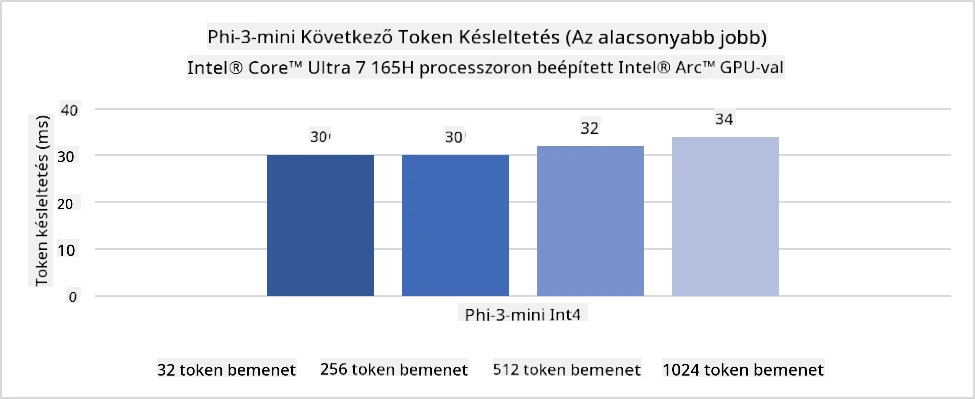
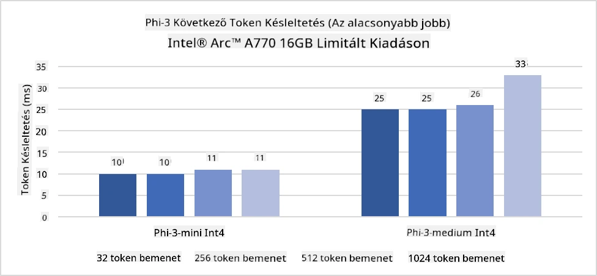
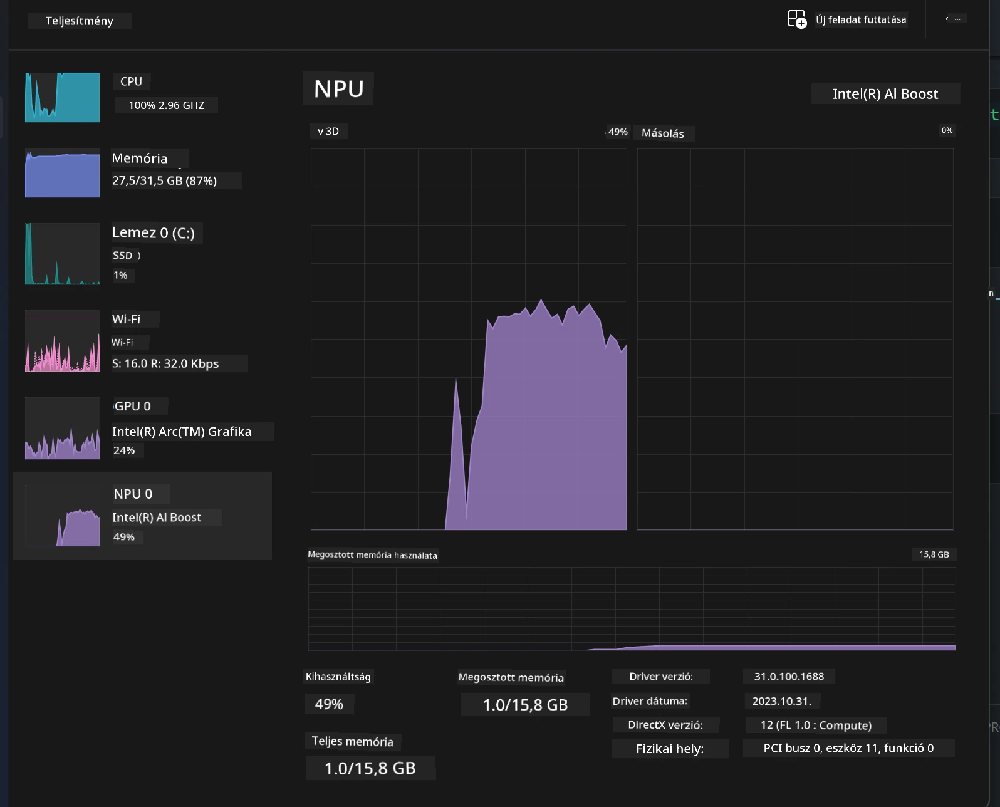
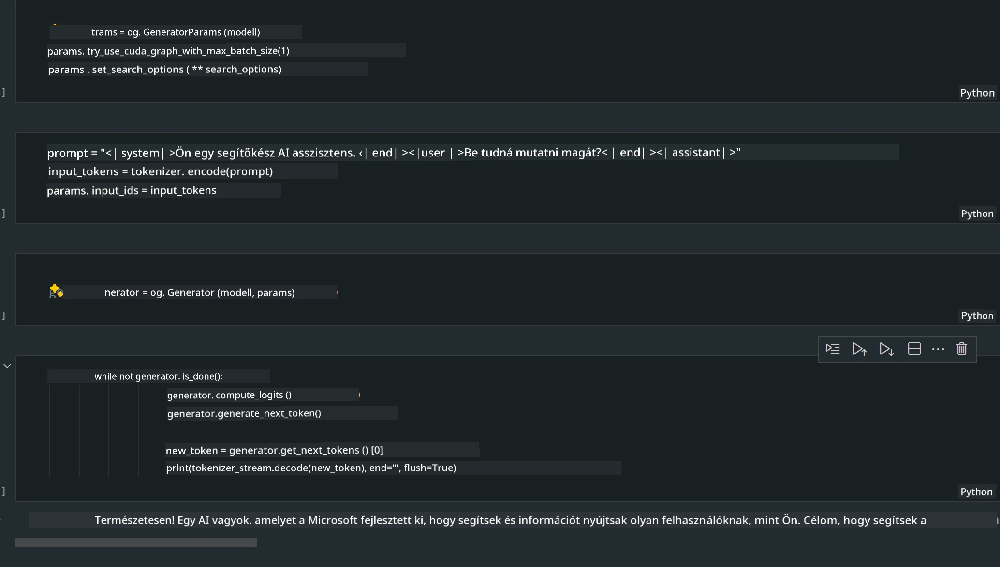
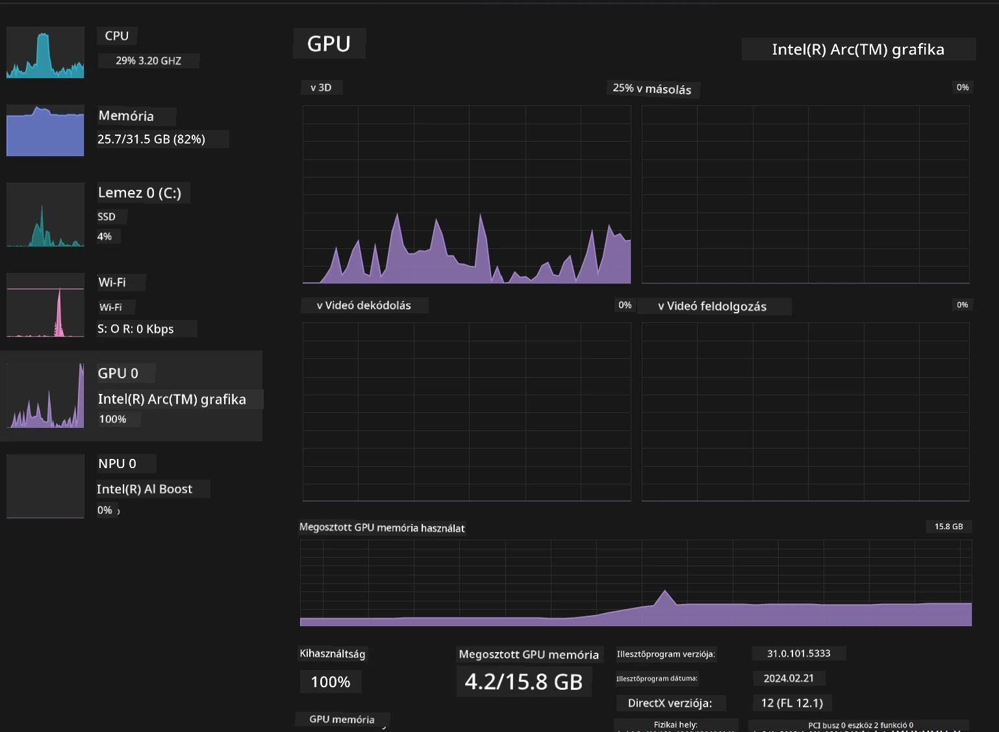

<!--
CO_OP_TRANSLATOR_METADATA:
{
  "original_hash": "e08ce816e23ad813244a09ca34ebb8ac",
  "translation_date": "2025-07-16T20:06:19+00:00",
  "source_file": "md/01.Introduction/03/AIPC_Inference.md",
  "language_code": "hu"
}
-->
# **Phi-3 inferálása AI PC-n**

A generatív MI fejlődésével és az élő eszközök hardveres képességeinek javulásával egyre több generatív MI modell integrálható a felhasználók saját eszközeibe (BYOD). Az AI PC-k ezek közé a modellek közé tartoznak. 2024-től az Intel, az AMD és a Qualcomm együttműködtek a PC-gyártókkal, hogy AI PC-ket vezessenek be, amelyek hardveres módosítások révén lehetővé teszik a helyi generatív MI modellek telepítését. Ebben a témában az Intel AI PC-kre fókuszálunk, és megvizsgáljuk, hogyan lehet a Phi-3 modellt telepíteni egy Intel AI PC-n.

### Mi az az NPU

Az NPU (Neurális Feldolgozó Egység) egy dedikált processzor vagy feldolgozó egység egy nagyobb SoC-n belül, amely kifejezetten a neurális hálózati műveletek és MI feladatok gyorsítására lett tervezve. Ellentétben az általános célú CPU-kkal és GPU-kkal, az NPU-k adatvezérelt párhuzamos számításokra optimalizáltak, így rendkívül hatékonyak nagy mennyiségű multimédiás adat, például videók és képek feldolgozásában, valamint neurális hálózati adatok kezelésében. Különösen jól kezelik az MI-hez kapcsolódó feladatokat, mint például a beszédfelismerés, a háttér elmosása videóhívások során, vagy a fotó- és videószerkesztési folyamatok, például tárgyfelismerés.

## NPU vs GPU

Bár sok MI és gépi tanulási feladat GPU-kon fut, fontos különbség van a GPU-k és az NPU-k között.  
A GPU-k párhuzamos számítási képességeikről ismertek, de nem minden GPU egyformán hatékony a grafikus feldolgozáson túl. Az NPU-k ezzel szemben kifejezetten a neurális hálózati műveletek összetett számításaira készültek, így rendkívül hatékonyak az MI feladatokban.

Összefoglalva, az NPU-k a matematikai zsenik, amelyek felgyorsítják az MI számításokat, és kulcsszerepet játszanak az AI PC-k új korszakában!

***Ez a példa az Intel legújabb Intel Core Ultra processzorán alapul***

## **1. NPU használata a Phi-3 modell futtatásához**

Az Intel® NPU eszköz egy MI inferencia gyorsító, amely az Intel kliens CPU-kkal integrált, kezdve az Intel® Core™ Ultra generációs CPU-kkal (korábban Meteor Lake néven ismert). Lehetővé teszi az energiatakarékos mesterséges neurális hálózati feladatok végrehajtását.





**Intel NPU Acceleration Library**

Az Intel NPU Acceleration Library [https://github.com/intel/intel-npu-acceleration-library](https://github.com/intel/intel-npu-acceleration-library) egy Python könyvtár, amely az Intel Neurális Feldolgozó Egység (NPU) erejét kihasználva gyorsítja az alkalmazások hatékonyságát kompatibilis hardveren.

Példa a Phi-3-mini futtatására AI PC-n, amelyet Intel® Core™ Ultra processzorok hajtanak.


Telepítsd a Python könyvtárat pip-pel

```bash

   pip install intel-npu-acceleration-library

```

***Megjegyzés*** A projekt még fejlesztés alatt áll, de a referencia modell már nagyon teljes.

### **Phi-3 futtatása Intel NPU Acceleration Library-vel**

Az Intel NPU gyorsítást használva ez a könyvtár nem befolyásolja a hagyományos kódolási folyamatot. Csak a könyvtárat kell használnod az eredeti Phi-3 modell kvantálásához, például FP16, INT8, INT4 formátumokra, például

```python
from transformers import AutoTokenizer, pipeline,TextStreamer
from intel_npu_acceleration_library import NPUModelForCausalLM, int4
from intel_npu_acceleration_library.compiler import CompilerConfig
import warnings

model_id = "microsoft/Phi-3-mini-4k-instruct"

compiler_conf = CompilerConfig(dtype=int4)
model = NPUModelForCausalLM.from_pretrained(
    model_id, use_cache=True, config=compiler_conf, attn_implementation="sdpa"
).eval()

tokenizer = AutoTokenizer.from_pretrained(model_id)

text_streamer = TextStreamer(tokenizer, skip_prompt=True)
```

A kvantálás sikeres befejezése után folytathatod a végrehajtást az NPU hívásával a Phi-3 modell futtatásához.

```python
generation_args = {
   "max_new_tokens": 1024,
   "return_full_text": False,
   "temperature": 0.3,
   "do_sample": False,
   "streamer": text_streamer,
}

pipe = pipeline(
   "text-generation",
   model=model,
   tokenizer=tokenizer,
)

query = "<|system|>You are a helpful AI assistant.<|end|><|user|>Can you introduce yourself?<|end|><|assistant|>"

with warnings.catch_warnings():
    warnings.simplefilter("ignore")
    pipe(query, **generation_args)
```

A kód futtatásakor az NPU futási állapotát a Feladatkezelőben is megtekinthetjük.



***Minták*** : [AIPC_NPU_DEMO.ipynb](../../../../../code/03.Inference/AIPC/AIPC_NPU_DEMO.ipynb)

## **2. DirectML + ONNX Runtime használata a Phi-3 modell futtatásához**

### **Mi az a DirectML**

A [DirectML](https://github.com/microsoft/DirectML) egy nagy teljesítményű, hardveresen gyorsított DirectX 12 könyvtár gépi tanuláshoz. A DirectML GPU gyorsítást biztosít a gyakori gépi tanulási feladatokhoz széles körű támogatott hardvereken és drivereken, beleértve az AMD, Intel, NVIDIA és Qualcomm DirectX 12-kompatibilis GPU-it.

Önálló használat esetén a DirectML API egy alacsony szintű DirectX 12 könyvtár, amely alkalmas nagy teljesítményű, alacsony késleltetésű alkalmazásokhoz, például keretrendszerekhez, játékokhoz és más valós idejű alkalmazásokhoz. A DirectML zökkenőmentes együttműködése a Direct3D 12-vel, valamint alacsony overhead-je és hardverek közötti konformitása miatt ideális a gépi tanulás gyorsítására, amikor egyszerre fontos a magas teljesítmény és az eredmények megbízhatósága, kiszámíthatósága.

***Megjegyzés*** : A legújabb DirectML már támogatja az NPU-t (https://devblogs.microsoft.com/directx/introducing-neural-processor-unit-npu-support-in-directml-developer-preview/)

### DirectML és CUDA képességei és teljesítménye összehasonlítva:

**DirectML** a Microsoft által fejlesztett gépi tanulási könyvtár. Célja a gépi tanulási feladatok gyorsítása Windows eszközökön, beleértve asztali gépeket, laptopokat és élő eszközöket.  
- DX12-alapú: A DirectML a DirectX 12-re épül, amely széles körű hardvertámogatást nyújt GPU-k között, beleértve az NVIDIA és AMD eszközöket is.  
- Szélesebb támogatás: Mivel a DX12-t használja, a DirectML bármely DX12-kompatibilis GPU-val működik, még az integrált GPU-kkal is.  
- Képfeldolgozás: A DirectML neurális hálózatokat használ képek és egyéb adatok feldolgozására, így alkalmas képfelismerésre, tárgyfelismerésre és más feladatokra.  
- Egyszerű beállítás: A DirectML beállítása egyszerű, nem igényel speciális SDK-kat vagy könyvtárakat a GPU gyártóktól.  
- Teljesítmény: Bizonyos esetekben a DirectML jól teljesít, és gyorsabb lehet, mint a CUDA, különösen bizonyos munkaterheléseknél.  
- Korlátozások: Ugyanakkor előfordulhat, hogy a DirectML lassabb, különösen float16 nagy batch méretek esetén.

**CUDA** az NVIDIA párhuzamos számítási platformja és programozási modellje. Lehetővé teszi a fejlesztők számára, hogy kihasználják az NVIDIA GPU-k erejét általános célú számításokra, beleértve a gépi tanulást és tudományos szimulációkat.  
- NVIDIA-specifikus: A CUDA szorosan integrált az NVIDIA GPU-kkal, és kifejezetten nekik készült.  
- Magasan optimalizált: Kiváló teljesítményt nyújt GPU-gyorsított feladatoknál, különösen NVIDIA GPU-kon.  
- Széles körben használt: Sok gépi tanulási keretrendszer és könyvtár (például TensorFlow és PyTorch) támogatja a CUDA-t.  
- Testreszabhatóság: A fejlesztők finomhangolhatják a CUDA beállításait specifikus feladatokra, ami optimális teljesítményt eredményezhet.  
- Korlátozások: A CUDA NVIDIA hardverhez kötöttsége korlátozhatja a kompatibilitást más GPU-kkal.

### DirectML vagy CUDA választása

A választás a DirectML és a CUDA között az adott felhasználási esettől, a rendelkezésre álló hardvertől és a preferenciáktól függ.  
Ha szélesebb kompatibilitást és egyszerű beállítást keresel, a DirectML jó választás lehet. Ha azonban NVIDIA GPU-d van, és nagy teljesítményre van szükséged, a CUDA továbbra is erős opció. Összefoglalva, mindkettőnek megvannak az előnyei és hátrányai, ezért érdemes a saját igényeid és a rendelkezésre álló hardver alapján dönteni.

### **Generatív MI ONNX Runtime-tal**

Az MI korszakában a modellek hordozhatósága nagyon fontos. Az ONNX Runtime könnyen telepíthető különböző eszközökre. A fejlesztőknek nem kell az inferencia keretrendszerre figyelniük, egységes API-val végezhetik el a modell inferenciát. A generatív MI korszakában az ONNX Runtime kódoptimalizálást is végzett (https://onnxruntime.ai/docs/genai/). Az optimalizált ONNX Runtime segítségével a kvantált generatív MI modell különböző végpontokon is futtatható. Az ONNX Runtime generatív MI API-ját Python, C#, C/C++ nyelveken keresztül érhetjük el. Természetesen iPhone-on a C++-os ONNX Runtime API előnyeit is kihasználhatjuk.

[Minta kód](https://github.com/Azure-Samples/Phi-3MiniSamples/tree/main/onnx)

***Generatív MI fordítása ONNX Runtime könyvtárral***

```bash

winget install --id=Kitware.CMake  -e

git clone https://github.com/microsoft/onnxruntime.git

cd .\onnxruntime\

./build.bat --build_shared_lib --skip_tests --parallel --use_dml --config Release

cd ../

git clone https://github.com/microsoft/onnxruntime-genai.git

cd .\onnxruntime-genai\

mkdir ort

cd ort

mkdir include

mkdir lib

copy ..\onnxruntime\include\onnxruntime\core\providers\dml\dml_provider_factory.h ort\include

copy ..\onnxruntime\include\onnxruntime\core\session\onnxruntime_c_api.h ort\include

copy ..\onnxruntime\build\Windows\Release\Release\*.dll ort\lib

copy ..\onnxruntime\build\Windows\Release\Release\onnxruntime.lib ort\lib

python build.py --use_dml


```

**Könyvtár telepítése**

```bash

pip install .\onnxruntime_genai_directml-0.3.0.dev0-cp310-cp310-win_amd64.whl

```

Ez a futtatási eredmény



***Minták*** : [AIPC_DirectML_DEMO.ipynb](../../../../../code/03.Inference/AIPC/AIPC_DirectML_DEMO.ipynb)

## **3. Intel OpenVino használata a Phi-3 modell futtatásához**

### **Mi az az OpenVINO**

Az [OpenVINO](https://github.com/openvinotoolkit/openvino) egy nyílt forráskódú eszközkészlet mélytanulási modellek optimalizálására és telepítésére. Javított mélytanulási teljesítményt nyújt látás, hang és nyelvi modellekhez népszerű keretrendszerekből, mint a TensorFlow, PyTorch és mások. Kezdj el dolgozni az OpenVINO-val. Az OpenVINO CPU-val és GPU-val kombinálva is használható a Phi-3 modell futtatásához.

***Megjegyzés***: Jelenleg az OpenVINO nem támogatja az NPU-t.

### **OpenVINO könyvtár telepítése**

```bash

 pip install git+https://github.com/huggingface/optimum-intel.git

 pip install git+https://github.com/openvinotoolkit/nncf.git

 pip install openvino-nightly

```

### **Phi-3 futtatása OpenVINO-val**

Az NPU-hoz hasonlóan az OpenVINO is kvantált modellek futtatásával kezeli a generatív MI modellek hívását. Először kvantálni kell a Phi-3 modellt, és a kvantálást az optimum-cli segítségével a parancssorban kell elvégezni.

**INT4**

```bash

optimum-cli export openvino --model "microsoft/Phi-3-mini-4k-instruct" --task text-generation-with-past --weight-format int4 --group-size 128 --ratio 0.6  --sym  --trust-remote-code ./openvinomodel/phi3/int4

```

**FP16**

```bash

optimum-cli export openvino --model "microsoft/Phi-3-mini-4k-instruct" --task text-generation-with-past --weight-format fp16 --trust-remote-code ./openvinomodel/phi3/fp16

```

Az átalakított formátum így néz ki


Töltsd be a modell elérési útvonalait (model_dir), a kapcsolódó konfigurációkat (ov_config = {"PERFORMANCE_HINT": "LATENCY", "NUM_STREAMS": "1", "CACHE_DIR": ""}), és a hardveresen gyorsított eszközöket (GPU.0) az OVModelForCausalLM segítségével

```python

ov_model = OVModelForCausalLM.from_pretrained(
     model_dir,
     device='GPU.0',
     ov_config=ov_config,
     config=AutoConfig.from_pretrained(model_dir, trust_remote_code=True),
     trust_remote_code=True,
)

```

A kód futtatásakor a GPU futási állapotát a Feladatkezelőben is megtekinthetjük



***Minták*** : [AIPC_OpenVino_Demo.ipynb](../../../../../code/03.Inference/AIPC/AIPC_OpenVino_Demo.ipynb)

### ***Megjegyzés*** : A fent említett három módszer mindegyikének megvannak a maga előnyei, de AI PC inferenciához ajánlott az NPU gyorsítás használata.

**Jogi nyilatkozat**:  
Ez a dokumentum az AI fordító szolgáltatás, a [Co-op Translator](https://github.com/Azure/co-op-translator) segítségével készült. Bár a pontosságra törekszünk, kérjük, vegye figyelembe, hogy az automatikus fordítások hibákat vagy pontatlanságokat tartalmazhatnak. Az eredeti dokumentum az anyanyelvén tekintendő hiteles forrásnak. Kritikus információk esetén professzionális emberi fordítást javaslunk. Nem vállalunk felelősséget az ebből a fordításból eredő félreértésekért vagy téves értelmezésekért.