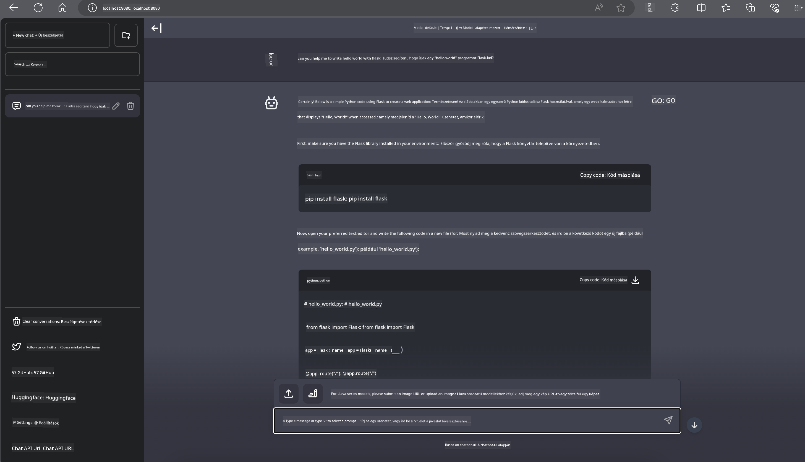

<!--
CO_OP_TRANSLATOR_METADATA:
{
  "original_hash": "be4101a30d98e95a71d42c276e8bcd37",
  "translation_date": "2025-07-16T20:44:40+00:00",
  "source_file": "md/01.Introduction/03/Jetson_Inference.md",
  "language_code": "hu"
}
-->
# **Phi-3 inferencia Nvidia Jetsonon**

Az Nvidia Jetson az Nvidia beágyazott számítástechnikai lapkakészleteinek sorozata. A Jetson TK1, TX1 és TX2 modellek mindegyike egy Nvidia Tegra processzort (vagy SoC-t) tartalmaz, amely ARM architektúrájú központi feldolgozó egységet (CPU) integrál. A Jetson alacsony fogyasztású rendszer, amelyet gépi tanulási alkalmazások gyorsítására terveztek. Az Nvidia Jetson professzionális fejlesztők számára kínál lehetőséget áttörő AI termékek létrehozására minden iparágban, valamint diákok és lelkes amatőrök számára is, hogy kézzelfogható AI tanulást és lenyűgöző projektek készítését tegyék lehetővé. Az SLM-t olyan élő eszközökön, mint a Jetson, telepítik, ami jobb megvalósítást tesz lehetővé az ipari generatív AI alkalmazási forgatókönyvekben.

## Telepítés NVIDIA Jetsonon:
Az autonóm robotikával és beágyazott eszközökkel foglalkozó fejlesztők kihasználhatják a Phi-3 Mini előnyeit. A Phi-3 viszonylag kis mérete ideálissá teszi élő környezetben történő telepítésre. A paramétereket gondosan hangolták a tanítás során, így a válaszok nagy pontosságúak.

### TensorRT-LLM optimalizáció:
Az NVIDIA [TensorRT-LLM könyvtára](https://github.com/NVIDIA/TensorRT-LLM?WT.mc_id=aiml-138114-kinfeylo) optimalizálja a nagy nyelvi modellek inferenciáját. Támogatja a Phi-3 Mini hosszú kontextusablakát, javítva ezzel a feldolgozási sebességet és a késleltetést. Az optimalizációk között szerepelnek olyan technikák, mint a LongRoPE, FP8 és az inflight batching.

### Elérhetőség és telepítés:
A fejlesztők a 128K kontextusablakkal rendelkező Phi-3 Mini-t az [NVIDIA AI oldalán](https://www.nvidia.com/en-us/ai-data-science/generative-ai/) fedezhetik fel. Ez egy NVIDIA NIM-ként van csomagolva, ami egy szabványos API-val rendelkező mikroszolgáltatás, amely bárhol telepíthető. Továbbá elérhetőek a [TensorRT-LLM megvalósítások a GitHubon](https://github.com/NVIDIA/TensorRT-LLM).

## **1. Előkészületek**

a. Jetson Orin NX / Jetson NX

b. JetPack 5.1.2+

c. Cuda 11.8

d. Python 3.8+

## **2. Phi-3 futtatása Jetsonon**

Választhatunk az [Ollama](https://ollama.com) vagy a [LlamaEdge](https://llamaedge.com) között.

Ha egyszerre szeretnéd használni a gguf-ot felhőben és élő eszközökön, a LlamaEdge úgy érthető, mint a WasmEdge (a WasmEdge egy könnyű, nagy teljesítményű, skálázható WebAssembly futtatókörnyezet, amely alkalmas felhő natív, élő és decentralizált alkalmazásokhoz. Támogatja a szerver nélküli alkalmazásokat, beágyazott funkciókat, mikroszolgáltatásokat, okosszerződéseket és IoT eszközöket. A gguf kvantitatív modelljét telepítheted élő eszközökre és a felhőbe a LlamaEdge segítségével.


Íme a használat lépései:

1. Telepítsd és töltsd le a kapcsolódó könyvtárakat és fájlokat

```bash

curl -sSf https://raw.githubusercontent.com/WasmEdge/WasmEdge/master/utils/install.sh | bash -s -- --plugin wasi_nn-ggml

curl -LO https://github.com/LlamaEdge/LlamaEdge/releases/latest/download/llama-api-server.wasm

curl -LO https://github.com/LlamaEdge/chatbot-ui/releases/latest/download/chatbot-ui.tar.gz

tar xzf chatbot-ui.tar.gz

```

**Megjegyzés**: a llama-api-server.wasm és a chatbot-ui ugyanabban a könyvtárban kell legyenek

2. Futtasd a szkripteket a terminálban

```bash

wasmedge --dir .:. --nn-preload default:GGML:AUTO:{Your gguf path} llama-api-server.wasm -p phi-3-chat

```

Íme a futtatás eredménye



***Minta kód*** [Phi-3 mini WASM Notebook minta](https://github.com/Azure-Samples/Phi-3MiniSamples/tree/main/wasm)

Összefoglalva, a Phi-3 Mini jelentős előrelépést jelent a nyelvi modellezésben, ötvözve a hatékonyságot, a kontextusérzékenységet és az NVIDIA optimalizációs képességeit. Akár robotokat építesz, akár élő alkalmazásokat fejlesztesz, a Phi-3 Mini egy erőteljes eszköz, amit érdemes ismerni.

**Jogi nyilatkozat**:  
Ez a dokumentum az AI fordító szolgáltatás, a [Co-op Translator](https://github.com/Azure/co-op-translator) segítségével készült. Bár a pontosságra törekszünk, kérjük, vegye figyelembe, hogy az automatikus fordítások hibákat vagy pontatlanságokat tartalmazhatnak. Az eredeti dokumentum az anyanyelvén tekintendő hiteles forrásnak. Kritikus információk esetén professzionális emberi fordítást javaslunk. Nem vállalunk felelősséget a fordítás használatából eredő félreértésekért vagy téves értelmezésekért.