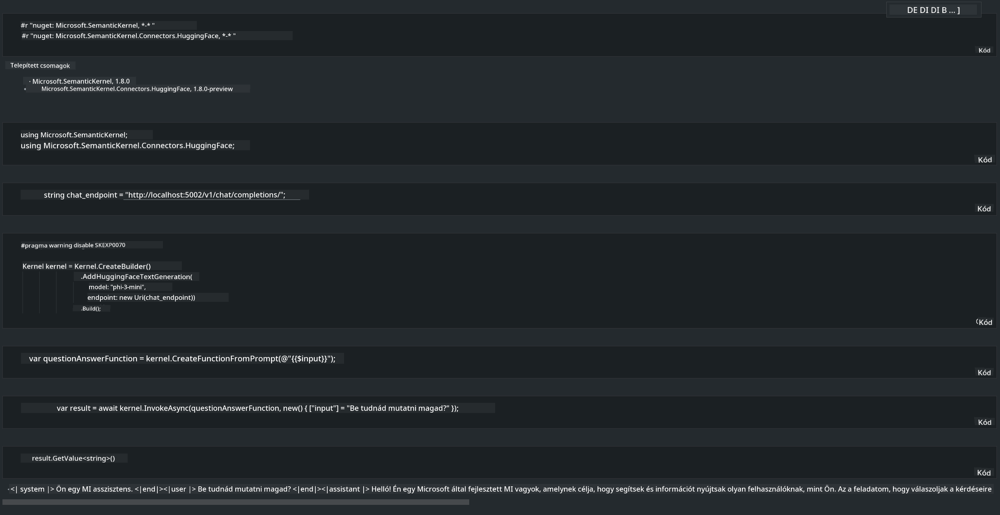

<!--
CO_OP_TRANSLATOR_METADATA:
{
  "original_hash": "bcf5dd7031db0031abdb9dd0c05ba118",
  "translation_date": "2025-07-16T20:58:49+00:00",
  "source_file": "md/01.Introduction/03/Local_Server_Inference.md",
  "language_code": "hu"
}
-->
# **Phi-3 inferálása helyi szerveren**

Phi-3-at telepíthetünk helyi szerverre. A felhasználók választhatnak az [Ollama](https://ollama.com) vagy [LM Studio](https://llamaedge.com) megoldások közül, vagy írhatják saját kódjukat. Phi-3 helyi szolgáltatásait összekapcsolhatjuk a [Semantic Kernel](https://github.com/microsoft/semantic-kernel?WT.mc_id=aiml-138114-kinfeylo) vagy a [Langchain](https://www.langchain.com/) segítségével, hogy Copilot alkalmazásokat építsünk.

## **Semantic Kernel használata Phi-3-mini eléréséhez**

A Copilot alkalmazásban a Semantic Kernel / LangChain segítségével hozunk létre alkalmazásokat. Ez a fajta alkalmazáskeret általában kompatibilis az Azure OpenAI Service / OpenAI modellekkel, és támogatja a Hugging Face nyílt forráskódú modelljeit, valamint a helyi modelleket is. Mit tegyünk, ha Semantic Kernel segítségével szeretnénk elérni a Phi-3-mini modellt? .NET példáján keresztül bemutatva, kombinálhatjuk a Semantic Kernel Hugging Face Connectorával. Alapértelmezés szerint ez megfelel a Hugging Face-en található modellazonosítónak (az első használatkor a modellt letölti a Hugging Face, ami hosszabb időt vesz igénybe). Csatlakozhatunk a helyileg felépített szolgáltatáshoz is. A kettő közül az utóbbit ajánljuk, mert nagyobb autonómiát biztosít, különösen vállalati alkalmazások esetén.

A képen látható módon a Semantic Kernel segítségével helyi szolgáltatásokhoz könnyen csatlakozhatunk a saját Phi-3-mini modell szerverünkhöz. Íme a futtatás eredménye:

***Minta kód*** https://github.com/kinfey/Phi3MiniSamples/tree/main/semantickernel

**Jogi nyilatkozat**:  
Ez a dokumentum az AI fordító szolgáltatás, a [Co-op Translator](https://github.com/Azure/co-op-translator) segítségével készült. Bár a pontosságra törekszünk, kérjük, vegye figyelembe, hogy az automatikus fordítások hibákat vagy pontatlanságokat tartalmazhatnak. Az eredeti dokumentum az anyanyelvén tekintendő hiteles forrásnak. Kritikus információk esetén professzionális emberi fordítást javaslunk. Nem vállalunk felelősséget a fordítás használatából eredő félreértésekért vagy téves értelmezésekért.