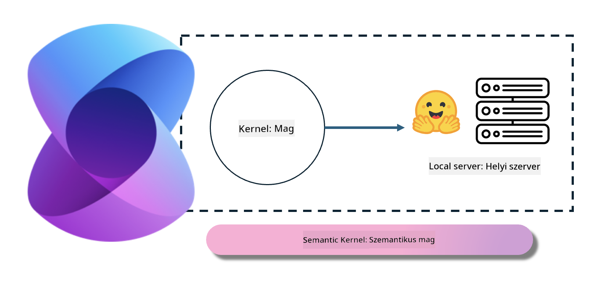

<!--
CO_OP_TRANSLATOR_METADATA:
{
  "original_hash": "bcf5dd7031db0031abdb9dd0c05ba118",
  "translation_date": "2025-05-09T12:07:54+00:00",
  "source_file": "md/01.Introduction/03/Local_Server_Inference.md",
  "language_code": "hu"
}
-->
# **Phi-3 inferálása helyi szerveren**

A Phi-3-at helyi szerveren is futtathatjuk. A felhasználók választhatnak az [Ollama](https://ollama.com) vagy [LM Studio](https://llamaedge.com) megoldások közül, vagy írhatnak saját kódot. A Phi-3 helyi szolgáltatásait a [Semantic Kernel](https://github.com/microsoft/semantic-kernel?WT.mc_id=aiml-138114-kinfeylo) vagy a [Langchain](https://www.langchain.com/) segítségével csatlakoztathatjuk, hogy Copilot alkalmazásokat építsünk.

## **Semantic Kernel használata Phi-3-mini eléréséhez**

A Copilot alkalmazásban a Semantic Kernel / LangChain segítségével hozunk létre alkalmazásokat. Ez az alkalmazáskeret általában kompatibilis az Azure OpenAI Service / OpenAI modellekkel, és támogatja a Hugging Face nyílt forráskódú modelljeit, valamint a helyi modelleket is. Mit tegyünk, ha Semantic Kernel segítségével szeretnénk elérni a Phi-3-mini-t? .NET példáján keresztül bemutatva, kombinálhatjuk a Semantic Kernel Hugging Face Connectorával. Alapértelmezés szerint ez a Hugging Face-en található modellazonosítóhoz igazodik (az első használatkor a modellt letölti a Hugging Face, ami hosszabb időt vesz igénybe). Csatlakozhatunk a saját helyileg futó szolgáltatáshoz is. Ezek közül a kettő közül az utóbbit ajánljuk, mert nagyobb autonómiát biztosít, különösen vállalati alkalmazások esetén.

A képen látható módon a Semantic Kernelen keresztüli helyi szolgáltatás elérés könnyen csatlakoztatható a saját Phi-3-mini modell szerverünkhöz. Íme a futtatás eredménye:

***Minta kód*** https://github.com/kinfey/Phi3MiniSamples/tree/main/semantickernel

**Nyilatkozat**:  
Ez a dokumentum az AI fordítószolgáltatás, a [Co-op Translator](https://github.com/Azure/co-op-translator) segítségével készült. Bár a pontosságra törekszünk, kérjük, vegye figyelembe, hogy az automatikus fordítások tartalmazhatnak hibákat vagy pontatlanságokat. Az eredeti dokumentum az anyanyelvén tekintendő hiteles forrásnak. Kritikus információk esetén szakmai, emberi fordítást javaslunk. Nem vállalunk felelősséget a fordítás használatából eredő félreértésekért vagy félreértelmezésekért.