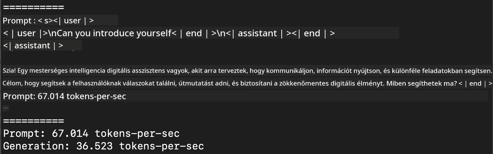
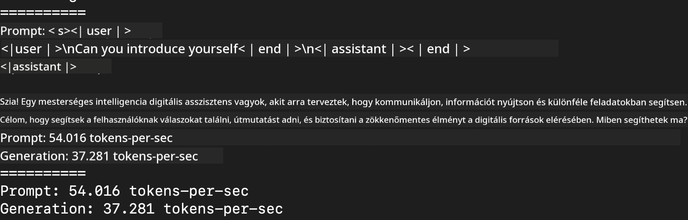
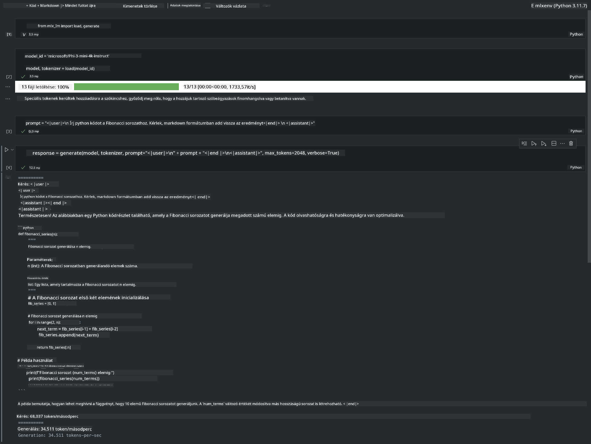

<!--
CO_OP_TRANSLATOR_METADATA:
{
  "original_hash": "dcb656f3d206fc4968e236deec5d4384",
  "translation_date": "2025-07-16T21:04:49+00:00",
  "source_file": "md/01.Introduction/03/MLX_Inference.md",
  "language_code": "hu"
}
-->
# **Phi-3 inferálása az Apple MLX keretrendszerrel**

## **Mi az MLX keretrendszer**

Az MLX egy tömb-alapú keretrendszer gépi tanulási kutatásokhoz Apple szilíciumon, amelyet az Apple gépi tanulási kutatócsoportja fejlesztett.

Az MLX-et gépi tanulási kutatók tervezték gépi tanulási kutatók számára. A keretrendszer célja, hogy felhasználóbarát legyen, ugyanakkor hatékonyan lehessen vele modelleket tanítani és futtatni. Maga a keretrendszer koncepciója is egyszerű. Az a célunk, hogy a kutatók könnyen bővíthessék és fejleszthessék az MLX-et, hogy gyorsan tudjanak új ötleteket kipróbálni.

Az LLM-ek Apple Silicon eszközökön az MLX segítségével gyorsíthatók, és a modellek kényelmesen futtathatók helyben.

## **Phi-3-mini inferálása MLX-szel**

### **1. MLX környezet beállítása**

1. Python 3.11.x
2. Telepítsd az MLX könyvtárat


```bash

pip install mlx-lm

```

### **2. Phi-3-mini futtatása terminálban MLX-szel**


```bash

python -m mlx_lm.generate --model microsoft/Phi-3-mini-4k-instruct --max-token 2048 --prompt  "<|user|>\nCan you introduce yourself<|end|>\n<|assistant|>"

```

Az eredmény (az én környezetem Apple M1 Max, 64GB) a következő:



### **3. Phi-3-mini kvantálása MLX-szel terminálban**


```bash

python -m mlx_lm.convert --hf-path microsoft/Phi-3-mini-4k-instruct

```

***Megjegyzés:*** A modellt az mlx_lm.convert segítségével lehet kvantálni, az alapértelmezett kvantálás INT4. Ez a példa Phi-3-mini modellt kvantálja INT4-re.

A modellt az mlx_lm.convert segítségével lehet kvantálni, az alapértelmezett kvantálás INT4. Ebben a példában Phi-3-mini modellt kvantálunk INT4-re. A kvantálás után a modell az alapértelmezett ./mlx_model könyvtárba kerül mentésre.

A kvantált modellt terminálból is tesztelhetjük MLX segítségével


```bash

python -m mlx_lm.generate --model ./mlx_model/ --max-token 2048 --prompt  "<|user|>\nCan you introduce yourself<|end|>\n<|assistant|>"

```

Az eredmény:




### **4. Phi-3-mini futtatása MLX-szel Jupyter Notebookban**




***Megjegyzés:*** Kérjük, olvasd el ezt a mintát [kattints ide](../../../../../code/03.Inference/MLX/MLX_DEMO.ipynb)


## **Források**

1. Ismerd meg az Apple MLX keretrendszert [https://ml-explore.github.io](https://ml-explore.github.io/mlx/build/html/index.html)

2. Apple MLX GitHub tárhely [https://github.com/ml-explore](https://github.com/ml-explore)

**Jogi nyilatkozat**:  
Ez a dokumentum az AI fordító szolgáltatás, a [Co-op Translator](https://github.com/Azure/co-op-translator) segítségével készült. Bár a pontosságra törekszünk, kérjük, vegye figyelembe, hogy az automatikus fordítások hibákat vagy pontatlanságokat tartalmazhatnak. Az eredeti dokumentum az anyanyelvén tekintendő hiteles forrásnak. Fontos információk esetén szakmai, emberi fordítást javaslunk. Nem vállalunk felelősséget a fordítás használatából eredő félreértésekért vagy téves értelmezésekért.