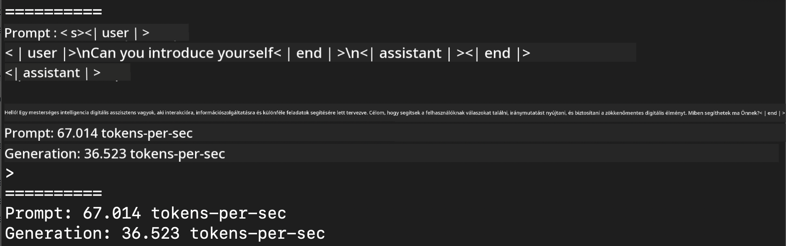
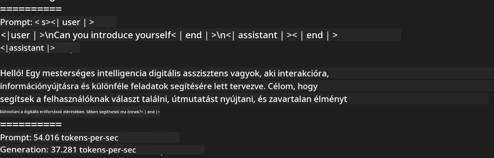
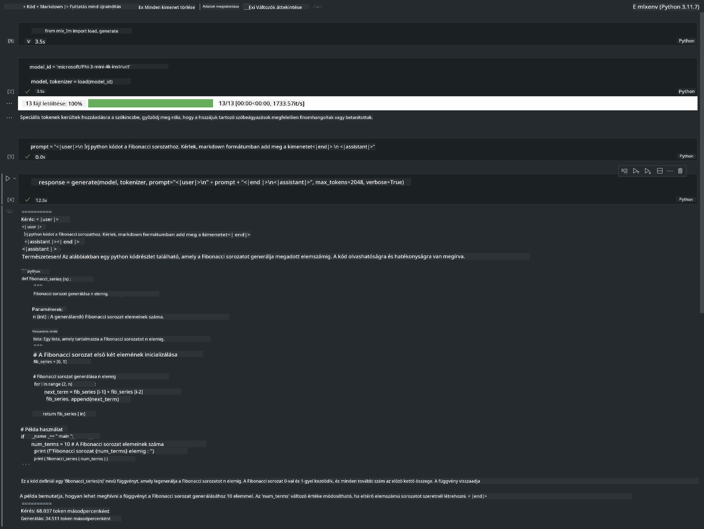

<!--
CO_OP_TRANSLATOR_METADATA:
{
  "original_hash": "dcb656f3d206fc4968e236deec5d4384",
  "translation_date": "2025-05-09T12:18:20+00:00",
  "source_file": "md/01.Introduction/03/MLX_Inference.md",
  "language_code": "hu"
}
-->
# **Phi-3 inferálása Apple MLX Frameworkkel**

## **Mi az MLX Framework**

Az MLX egy tömb-alapú keretrendszer gépi tanulási kutatásokhoz Apple szilíciumon, az Apple gépi tanulási kutatócsoportjától.

Az MLX-et gépi tanulási kutatók tervezték gépi tanulási kutatók számára. A keretrendszer felhasználóbarát, ugyanakkor hatékony a modellek tanításához és futtatásához. Maga a keretrendszer koncepciója is egyszerű. Célunk, hogy a kutatók könnyen bővíthessék és fejleszthessék az MLX-et, hogy gyorsan tudjanak új ötleteket kipróbálni.

Az LLM-ek az Apple Silicon eszközökön az MLX segítségével gyorsíthatók, és a modellek helyben, kényelmesen futtathatók.

## **Phi-3-mini inferálása MLX-szel**

### **1. MLX környezet beállítása**

1. Python 3.11.x
2. MLX könyvtár telepítése


```bash

pip install mlx-lm

```

### **2. Phi-3-mini futtatása terminálban MLX-szel**


```bash

python -m mlx_lm.generate --model microsoft/Phi-3-mini-4k-instruct --max-token 2048 --prompt  "<|user|>\nCan you introduce yourself<|end|>\n<|assistant|>"

```

Az eredmény (a környezetem Apple M1 Max, 64GB) a következő:



### **3. Phi-3-mini kvantálása MLX-szel terminálban**


```bash

python -m mlx_lm.convert --hf-path microsoft/Phi-3-mini-4k-instruct

```

***Megjegyzés:*** A modellt az mlx_lm.convert segítségével lehet kvantálni, az alapértelmezett kvantálás INT4. Ez a példa a Phi-3-mini INT4-es kvantálását mutatja be.

A modellt az mlx_lm.convert segítségével lehet kvantálni, az alapértelmezett kvantálás INT4. Ebben a példában a Phi-3-mini INT4-re kvantálódik. A kvantálás után a modell a ./mlx_model alapértelmezett mappába kerül mentésre.

A kvantált modellt terminálból is tesztelhetjük MLX segítségével.


```bash

python -m mlx_lm.generate --model ./mlx_model/ --max-token 2048 --prompt  "<|user|>\nCan you introduce yourself<|end|>\n<|assistant|>"

```

Az eredmény:




### **4. Phi-3-mini futtatása MLX-szel Jupyter Notebookban**




***Megjegyzés:*** Kérjük, olvassa el ezt a példát [click this link](../../../../../code/03.Inference/MLX/MLX_DEMO.ipynb)


## **Források**

1. Ismerje meg az Apple MLX Frameworköt [https://ml-explore.github.io](https://ml-explore.github.io/mlx/build/html/index.html)

2. Apple MLX GitHub tárhely [https://github.com/ml-explore](https://github.com/ml-explore)

**Felelősségkizárás**:  
Ezt a dokumentumot az AI fordítószolgáltatás, a [Co-op Translator](https://github.com/Azure/co-op-translator) segítségével fordítottuk le. Bár igyekszünk a pontosságra, kérjük, vegye figyelembe, hogy az automatikus fordítások hibákat vagy pontatlanságokat tartalmazhatnak. Az eredeti dokumentum a saját nyelvén tekintendő hiteles forrásnak. Kritikus információk esetén professzionális, emberi fordítást javaslunk. Nem vállalunk felelősséget a fordítás használatából eredő félreértésekért vagy félreértelmezésekért.