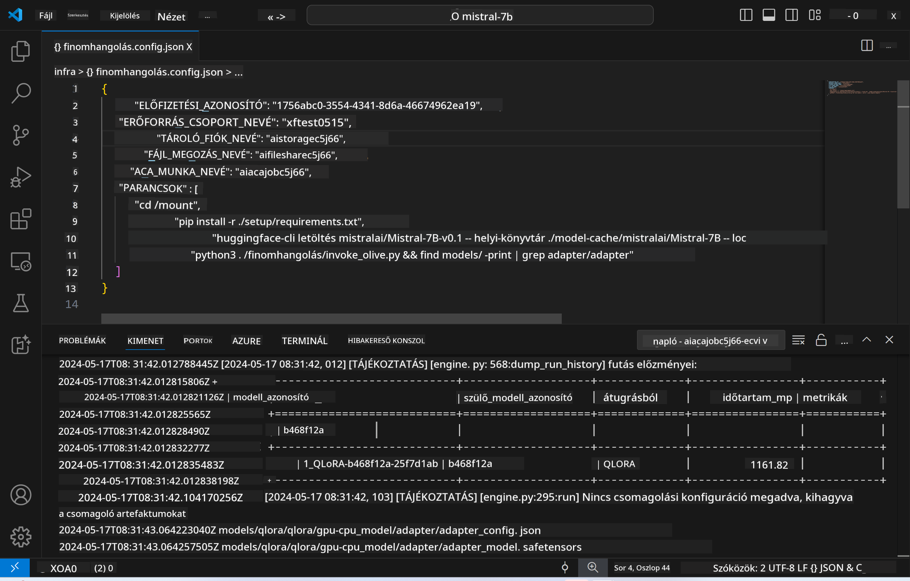
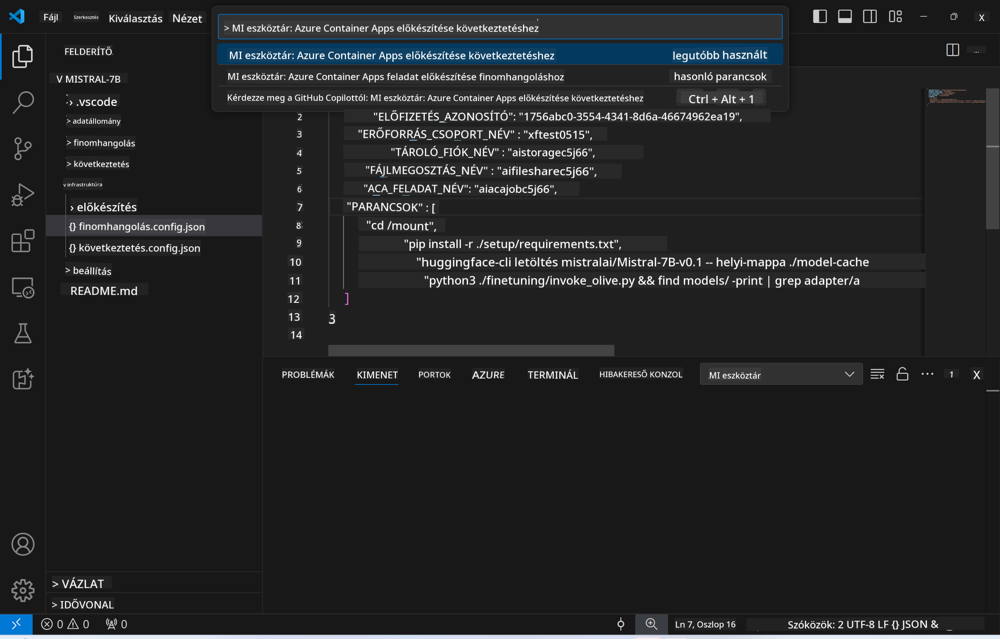
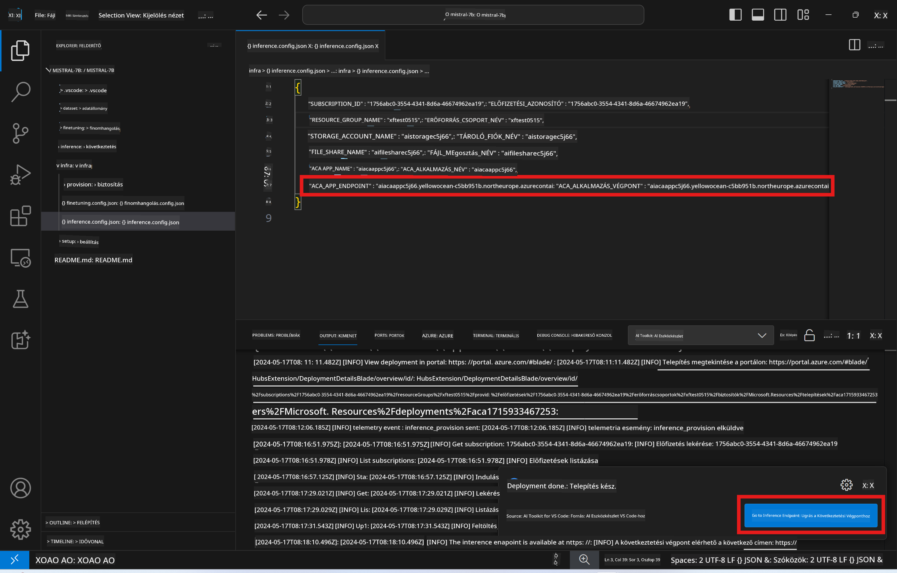

<!--
CO_OP_TRANSLATOR_METADATA:
{
  "original_hash": "a54cd3d65b6963e4e8ce21e143c3ab04",
  "translation_date": "2025-05-09T12:45:13+00:00",
  "source_file": "md/01.Introduction/03/Remote_Interence.md",
  "language_code": "hu"
}
-->
# Távoli inferencia a finomhangolt modellel

Miután az adaptereket betanítottuk a távoli környezetben, egy egyszerű Gradio alkalmazással léphetünk kapcsolatba a modellel.



### Azure erőforrások előkészítése  
A távoli inferenciához be kell állítanod az Azure erőforrásokat az `AI Toolkit: Provision Azure Container Apps for inference` parancs futtatásával a parancspalettából. A folyamat során ki kell választanod az Azure előfizetésedet és az erőforráscsoportot.  


Alapértelmezés szerint az inferenciához használt előfizetésnek és erőforráscsoportnak egyeznie kell a finomhangoláshoz használtakkal. Az inferencia ugyanazt az Azure Container App környezetet fogja használni, és eléri a finomhangolás során Azure Files-ban tárolt modellt és adaptert.

## AI Toolkit használata

### Telepítés inferenciához  
Ha módosítani szeretnéd az inferencia kódját vagy újra betölteni az inferencia modellt, futtasd az `AI Toolkit: Deploy for inference` parancsot. Ez szinkronizálja a legfrissebb kódodat az ACA-val, és újraindítja a replikát.


A telepítés sikeres befejezése után a modell készen áll az értékelésre ezen a végponton keresztül.

### Inferencia API elérése

Az inferencia API eléréséhez kattints a VSCode értesítésében megjelenő "*Go to Inference Endpoint*" gombra. Alternatív megoldásként a web API végpont megtalálható az `ACA_APP_ENDPOINT` alatt az `./infra/inference.config.json`-ban és a kimeneti panelen.



> **Megjegyzés:** Az inferencia végpontnak eltarthat egy pár percig, míg teljesen működőképes lesz.

## Az inferencia komponensei a sablonban

| Mappa | Tartalom |
| ------ |--------- |
| `infra` | Minden szükséges konfigurációt tartalmaz a távoli műveletekhez. |
| `infra/provision/inference.parameters.json` | Paramétereket tartalmaz a bicep sablonokhoz, amelyek az Azure erőforrások előkészítéséhez szükségesek inferenciához. |
| `infra/provision/inference.bicep` | Az Azure erőforrások előkészítéséhez szükséges sablonokat tartalmazza inferenciához. |
| `infra/inference.config.json` | A konfigurációs fájl, amelyet az `AI Toolkit: Provision Azure Container Apps for inference` parancs generál. Más távoli parancspaletták bemeneteként szolgál. |

### AI Toolkit használata az Azure erőforrás előkészítésének beállításához  
Állítsd be az [AI Toolkit](https://marketplace.visualstudio.com/items?itemName=ms-windows-ai-studio.windows-ai-studio) bővítményt.

Az Azure Container Apps inferenciához való előkészítése: ` command.

You can find configuration parameters in `./infra/provision/inference.parameters.json` file. Here are the details:
| Parameter | Description |
| --------- |------------ |
| `defaultCommands` | This is the commands to initiate a web API. |
| `maximumInstanceCount` | This parameter sets the maximum capacity of GPU instances. |
| `location` | This is the location where Azure resources are provisioned. The default value is the same as the chosen resource group's location. |
| `storageAccountName`, `fileShareName` `acaEnvironmentName`, `acaEnvironmentStorageName`, `acaAppName`,  `acaLogAnalyticsName` | These parameters are used to name the Azure resources for provision. By default, they will be same to the fine-tuning resource name. You can input a new, unused resource name to create your own custom-named resources, or you can input the name of an already existing Azure resource if you'd prefer to use that. For details, refer to the section [Using existing Azure Resources](../../../../../md/01.Introduction/03). |

### Using Existing Azure Resources

By default, the inference provision use the same Azure Container App Environment, Storage Account, Azure File Share, and Azure Log Analytics that were used for fine-tuning. A separate Azure Container App is created solely for the inference API. 

If you have customized the Azure resources during the fine-tuning step or want to use your own existing Azure resources for inference, specify their names in the `./infra/inference.parameters.json fájlban. Ezután futtasd az `AI Toolkit: Provision Azure Container Apps for inference` parancsot a parancspalettából. Ez frissíti a megadott erőforrásokat és létrehozza a hiányzókat.

Például, ha már rendelkezel Azure konténer környezettel, akkor a `./infra/finetuning.parameters.json` fájlod valahogy így nézzen ki:

```json
{
    "$schema": "https://schema.management.azure.com/schemas/2019-04-01/deploymentParameters.json#",
    "contentVersion": "1.0.0.0",
    "parameters": {
      ...
      "acaEnvironmentName": {
        "value": "<your-aca-env-name>"
      },
      "acaEnvironmentStorageName": {
        "value": null
      },
      ...
    }
  }
```

### Manuális előkészítés  
Ha inkább kézzel szeretnéd beállítani az Azure erőforrásokat, használhatod a `./infra/provision` folders. If you have already set up and configured all the Azure resources without using the AI Toolkit command palette, you can simply enter the resource names in the `inference.config.json` fájlban található bicep fájlokat.

Például:

```json
{
  "SUBSCRIPTION_ID": "<your-subscription-id>",
  "RESOURCE_GROUP_NAME": "<your-resource-group-name>",
  "STORAGE_ACCOUNT_NAME": "<your-storage-account-name>",
  "FILE_SHARE_NAME": "<your-file-share-name>",
  "ACA_APP_NAME": "<your-aca-name>",
  "ACA_APP_ENDPOINT": "<your-aca-endpoint>"
}
```

**Jogi nyilatkozat**:  
Ezt a dokumentumot az AI fordító szolgáltatás, a [Co-op Translator](https://github.com/Azure/co-op-translator) segítségével fordítottuk le. Bár igyekszünk a pontosságra, kérjük, vegye figyelembe, hogy az automatikus fordítások hibákat vagy pontatlanságokat tartalmazhatnak. Az eredeti dokumentum az anyanyelvén tekintendő hiteles forrásnak. Fontos információk esetén szakmai, emberi fordítást javaslunk. Nem vállalunk felelősséget a fordítás használatából eredő félreértésekért vagy félreértelmezésekért.