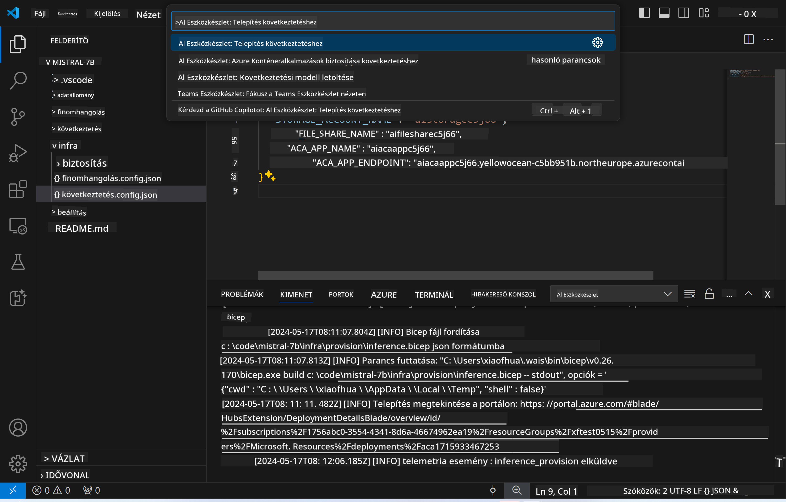

<!--
CO_OP_TRANSLATOR_METADATA:
{
  "original_hash": "a54cd3d65b6963e4e8ce21e143c3ab04",
  "translation_date": "2025-07-16T21:21:36+00:00",
  "source_file": "md/01.Introduction/03/Remote_Interence.md",
  "language_code": "hu"
}
-->
# Távoli inferencia a finomhangolt modellel

Miután az adaptereket a távoli környezetben betanítottuk, egy egyszerű Gradio alkalmazással léphetünk kapcsolatba a modellel.


### Azure erőforrások előkészítése  
A távoli inferencia beállításához futtassa az `AI Toolkit: Provision Azure Container Apps for inference` parancsot a parancspalettából. A beállítás során ki kell választania az Azure-előfizetését és az erőforráscsoportot.  


Alapértelmezés szerint az inferenciához használt előfizetésnek és erőforráscsoportnak meg kell egyeznie a finomhangoláshoz használtakkal. Az inferencia ugyanazt az Azure Container App környezetet használja, és hozzáfér a finomhangolás során létrehozott modellhez és adapterhez, amelyek az Azure Files-ban vannak tárolva.

## AI Toolkit használata

### Telepítés inferenciához  
Ha módosítani szeretné az inferencia kódját vagy újratölteni az inferencia modellt, futtassa az `AI Toolkit: Deploy for inference` parancsot. Ez szinkronizálja a legfrissebb kódot az ACA-val, és újraindítja a replikát.



A telepítés sikeres befejezése után a modell készen áll az értékelésre ezen a végponton keresztül.

### Az inferencia API elérése

Az inferencia API-hoz a VSCode értesítésében megjelenő "*Go to Inference Endpoint*" gombra kattintva férhet hozzá. Alternatív megoldásként a web API végpont megtalálható az `ACA_APP_ENDPOINT` alatt a `./infra/inference.config.json` fájlban, illetve a kimeneti panelen.


> **Megjegyzés:** Az inferencia végpontnak eltarthat néhány percig, mire teljesen működőképes lesz.

## Az inferencia komponensei, amelyek a sablonban szerepelnek

| Mappa | Tartalom |
| ------ |--------- |
| `infra` | Tartalmazza az összes szükséges konfigurációt a távoli működéshez. |
| `infra/provision/inference.parameters.json` | Paramétereket tartalmaz a bicep sablonokhoz, amelyeket az Azure erőforrások inferenciához történő előkészítéséhez használnak. |
| `infra/provision/inference.bicep` | Azure erőforrások inferenciához történő előkészítéséhez használt sablonokat tartalmaz. |
| `infra/inference.config.json` | Konfigurációs fájl, amelyet az `AI Toolkit: Provision Azure Container Apps for inference` parancs generál. Más távoli parancsok bemeneteként szolgál. |

### AI Toolkit használata az Azure erőforrások előkészítéséhez  
Konfigurálja az [AI Toolkit](https://marketplace.visualstudio.com/items?itemName=ms-windows-ai-studio.windows-ai-studio) bővítményt.

Futtassa az `Provision Azure Container Apps for inference` parancsot.

A konfigurációs paraméterek megtalálhatók a `./infra/provision/inference.parameters.json` fájlban. Íme a részletek:

| Paraméter | Leírás |
| --------- |------------ |
| `defaultCommands` | Ezek a parancsok indítják el a web API-t. |
| `maximumInstanceCount` | Ez a paraméter határozza meg a GPU példányok maximális számát. |
| `location` | Az Azure erőforrások helyszíne. Alapértelmezett értéke megegyezik a kiválasztott erőforráscsoport helyével. |
| `storageAccountName`, `fileShareName`, `acaEnvironmentName`, `acaEnvironmentStorageName`, `acaAppName`, `acaLogAnalyticsName` | Ezek a paraméterek az Azure erőforrások elnevezésére szolgálnak az előkészítés során. Alapértelmezés szerint megegyeznek a finomhangoláshoz használt erőforrások nevével. Megadhat új, még nem használt nevet egyedi erőforrások létrehozásához, vagy megadhat egy már létező Azure erőforrás nevét, ha azt szeretné használni. Részletekért lásd a [Már létező Azure erőforrások használata](../../../../../md/01.Introduction/03) részt. |

### Már létező Azure erőforrások használata

Alapértelmezés szerint az inferencia előkészítés ugyanazt az Azure Container App környezetet, Storage Accountot, Azure File Share-t és Azure Log Analytics-et használja, mint a finomhangolás. Az inferencia API számára külön Azure Container App jön létre.

Ha a finomhangolás során testreszabta az Azure erőforrásokat, vagy saját meglévő Azure erőforrásait szeretné használni az inferenciához, adja meg azok nevét a `./infra/inference.parameters.json` fájlban. Ezután futtassa az `AI Toolkit: Provision Azure Container Apps for inference` parancsot a parancspalettából. Ez frissíti a megadott erőforrásokat, és létrehozza a hiányzókat.

Például, ha már van meglévő Azure konténer környezete, a `./infra/finetuning.parameters.json` fájl így nézhet ki:

```json
{
    "$schema": "https://schema.management.azure.com/schemas/2019-04-01/deploymentParameters.json#",
    "contentVersion": "1.0.0.0",
    "parameters": {
      ...
      "acaEnvironmentName": {
        "value": "<your-aca-env-name>"
      },
      "acaEnvironmentStorageName": {
        "value": null
      },
      ...
    }
  }
```

### Manuális előkészítés  
Ha inkább manuálisan szeretné beállítani az Azure erőforrásokat, használhatja a `./infra/provision` mappában található bicep fájlokat. Ha már beállította és konfigurálta az összes Azure erőforrást az AI Toolkit parancspaletta használata nélkül, egyszerűen írja be az erőforrások nevét az `inference.config.json` fájlba.

Például:

```json
{
  "SUBSCRIPTION_ID": "<your-subscription-id>",
  "RESOURCE_GROUP_NAME": "<your-resource-group-name>",
  "STORAGE_ACCOUNT_NAME": "<your-storage-account-name>",
  "FILE_SHARE_NAME": "<your-file-share-name>",
  "ACA_APP_NAME": "<your-aca-name>",
  "ACA_APP_ENDPOINT": "<your-aca-endpoint>"
}
```

**Jogi nyilatkozat**:  
Ez a dokumentum az AI fordító szolgáltatás, a [Co-op Translator](https://github.com/Azure/co-op-translator) segítségével készült. Bár a pontosságra törekszünk, kérjük, vegye figyelembe, hogy az automatikus fordítások hibákat vagy pontatlanságokat tartalmazhatnak. Az eredeti dokumentum az anyanyelvén tekintendő hiteles forrásnak. Fontos információk esetén professzionális emberi fordítást javaslunk. Nem vállalunk felelősséget a fordítás használatából eredő félreértésekért vagy téves értelmezésekért.