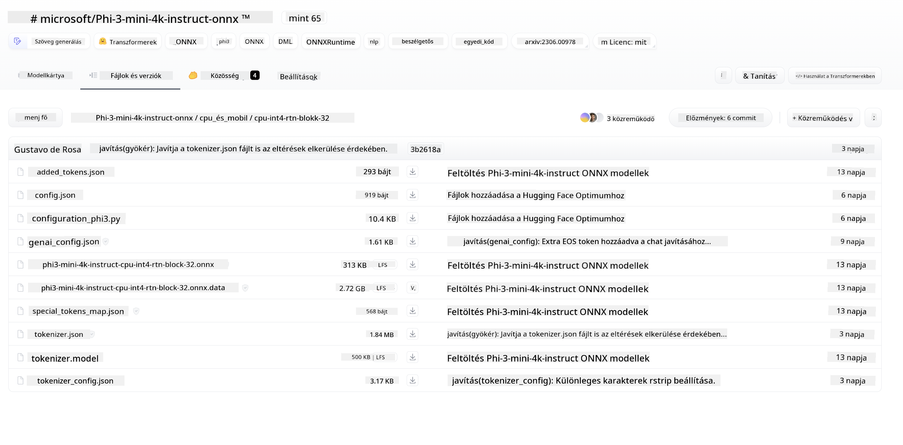
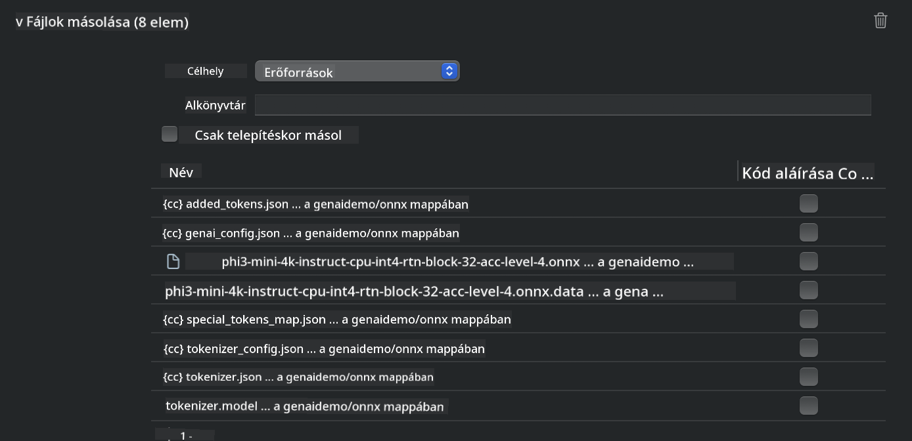
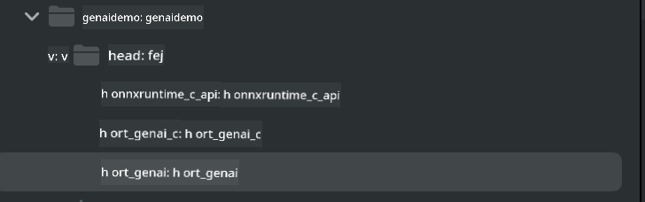
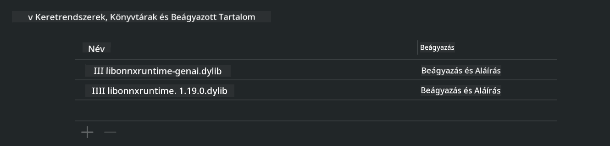
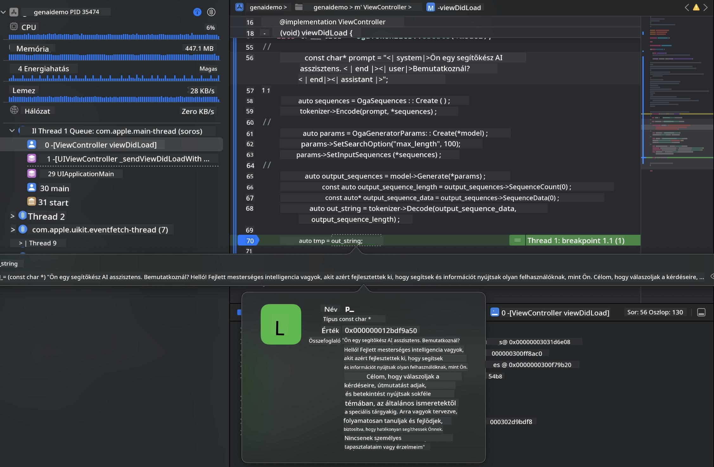

<!--
CO_OP_TRANSLATOR_METADATA:
{
  "original_hash": "82af197df38d25346a98f1f0e84d1698",
  "translation_date": "2025-05-09T11:04:33+00:00",
  "source_file": "md/01.Introduction/03/iOS_Inference.md",
  "language_code": "hu"
}
-->
# **Phi-3 inferálása iOS-en**

A Phi-3-mini a Microsoft új modellcsaládja, amely lehetővé teszi a nagy nyelvi modellek (LLM-ek) telepítését élő eszközökre és IoT eszközökre. A Phi-3-mini elérhető iOS-re, Androidra és élő eszközökön történő telepítésre, így a generatív AI BYOD környezetben is használható. Az alábbi példa bemutatja, hogyan telepíthető a Phi-3-mini iOS-en.

## **1. Előkészületek**

- **a.** macOS 14 vagy újabb
- **b.** Xcode 15 vagy újabb
- **c.** iOS SDK 17.x (iPhone 14 A16 vagy újabb)
- **d.** Telepítsd a Python 3.10+ verziót (ajánlott a Conda)
- **e.** Telepítsd a Python könyvtárat: `python-flatbuffers`
- **f.** Telepítsd a CMake-et

### Semantic Kernel és inferálás

A Semantic Kernel egy alkalmazáskeret, amely lehetővé teszi olyan alkalmazások létrehozását, amelyek kompatibilisek az Azure OpenAI Service-szel, OpenAI modellekkel, sőt helyi modellekkel is. A Semantic Kernel segítségével egyszerűen elérheted a helyi szolgáltatásokat, így könnyen integrálhatod a saját hosztolt Phi-3-mini modell szerveredet.

### Kvantált modellek hívása Ollama vagy LlamaEdge segítségével

Sokan inkább kvantált modelleket használnak a helyi futtatáshoz. Az [Ollama](https://ollama.com) és a [LlamaEdge](https://llamaedge.com) lehetővé teszik különböző kvantált modellek hívását:

#### **Ollama**

Futtathatod közvetlenül a `ollama run phi3`-t, vagy offline konfigurálhatod. Készíts egy Modelfile-t, amely tartalmazza a `gguf` fájl elérési útját. Példa a Phi-3-mini kvantált modell futtatására:

```gguf
FROM {Add your gguf file path}
TEMPLATE \"\"\"<|user|> .Prompt<|end|> <|assistant|>\"\"\"
PARAMETER stop <|end|>
PARAMETER num_ctx 4096
```

#### **LlamaEdge**

Ha egyszerre szeretnéd használni a `gguf`-t felhőben és élő eszközökön, a LlamaEdge remek választás.

## **2. ONNX Runtime fordítása iOS-re**

```bash

git clone https://github.com/microsoft/onnxruntime.git

cd onnxruntime

./build.sh --build_shared_lib --ios --skip_tests --parallel --build_dir ./build_ios --ios --apple_sysroot iphoneos --osx_arch arm64 --apple_deploy_target 17.5 --cmake_generator Xcode --config Release

cd ../

```

### **Figyelem**

- **a.** Fordítás előtt győződj meg róla, hogy az Xcode megfelelően be van állítva, és állítsd be aktív fejlesztői könyvtárként a terminálban:

    ```bash
    sudo xcode-select -switch /Applications/Xcode.app/Contents/Developer
    ```

- **b.** Az ONNX Runtime-ot több platformra is fordítani kell. iOS esetén fordítsd le `arm64` or `x86_64` architektúrákra.

- **c.** Ajánlott a legfrissebb iOS SDK használata a fordításhoz, de régebbi verzióval is működik, ha kompatibilitásra van szükség.

## **3. Generatív AI fordítása ONNX Runtime-tal iOS-re**

> **Note:** Mivel a Generatív AI ONNX Runtime-tal még előzetes verzióban van, számíts változásokra.

```bash

git clone https://github.com/microsoft/onnxruntime-genai
 
cd onnxruntime-genai
 
mkdir ort
 
cd ort
 
mkdir include
 
mkdir lib
 
cd ../
 
cp ../onnxruntime/include/onnxruntime/core/session/onnxruntime_c_api.h ort/include
 
cp ../onnxruntime/build_ios/Release/Release-iphoneos/libonnxruntime*.dylib* ort/lib
 
export OPENCV_SKIP_XCODEBUILD_FORCE_TRYCOMPILE_DEBUG=1
 
python3 build.py --parallel --build_dir ./build_ios --ios --ios_sysroot iphoneos --ios_arch arm64 --ios_deployment_target 17.5 --cmake_generator Xcode --cmake_extra_defines CMAKE_XCODE_ATTRIBUTE_CODE_SIGNING_ALLOWED=NO

```

## **4. Alkalmazás létrehozása Xcode-ban**

Az Objective-C-t választottam az alkalmazás fejlesztéséhez, mert az ONNX Runtime C++ API-jával a Generatív AI jobban kompatibilis Objective-C-vel. Természetesen Swift hídon keresztül is megoldható a hívások kezelése.


## **5. ONNX kvantált INT4 modell másolása az alkalmazás projektbe**

Az ONNX formátumú INT4 kvantált modellt importálni kell, amit először le kell tölteni.



A letöltés után add hozzá a projekt Resources könyvtárához Xcode-ban.



## **6. C++ API hozzáadása a ViewControllers-hez**

> **Figyelem:**

- **a.** Add hozzá a megfelelő C++ fejléc fájlokat a projekthez.

  

- **b.** Include-olj be `onnxruntime-genai` dynamic library in Xcode.

  

- **c.** Use the C Samples code for testing. You can also add additional features like ChatUI for more functionality.

- **d.** Since you need to use C++ in your project, rename `ViewController.m` to `ViewController.mm` fájlokat, hogy engedélyezd az Objective-C++ támogatást.

```objc

    NSString *llmPath = [[NSBundle mainBundle] resourcePath];
    char const *modelPath = llmPath.cString;

    auto model =  OgaModel::Create(modelPath);

    auto tokenizer = OgaTokenizer::Create(*model);

    const char* prompt = "<|system|>You are a helpful AI assistant.<|end|><|user|>Can you introduce yourself?<|end|><|assistant|>";

    auto sequences = OgaSequences::Create();
    tokenizer->Encode(prompt, *sequences);

    auto params = OgaGeneratorParams::Create(*model);
    params->SetSearchOption("max_length", 100);
    params->SetInputSequences(*sequences);

    auto output_sequences = model->Generate(*params);
    const auto output_sequence_length = output_sequences->SequenceCount(0);
    const auto* output_sequence_data = output_sequences->SequenceData(0);
    auto out_string = tokenizer->Decode(output_sequence_data, output_sequence_length);
    
    auto tmp = out_string;

```

## **7. Az alkalmazás futtatása**

A beállítások után futtasd az alkalmazást, hogy láthasd a Phi-3-mini modell inferálásának eredményét.



További mintakódokért és részletes útmutatókért látogass el a [Phi-3 Mini Samples repository](https://github.com/Azure-Samples/Phi-3MiniSamples/tree/main/ios) oldalra.

**Jogi nyilatkozat**:  
Ez a dokumentum az AI fordító szolgáltatás, a [Co-op Translator](https://github.com/Azure/co-op-translator) segítségével készült. Bár igyekszünk a pontosságra, kérjük, vegye figyelembe, hogy az automatikus fordítások tartalmazhatnak hibákat vagy pontatlanságokat. Az eredeti dokumentum anyanyelvű változatát kell tekinteni a hiteles forrásnak. Kritikus információk esetén professzionális emberi fordítást javaslunk. Nem vállalunk felelősséget a fordítás használatából eredő félreértésekért vagy félreértelmezésekért.