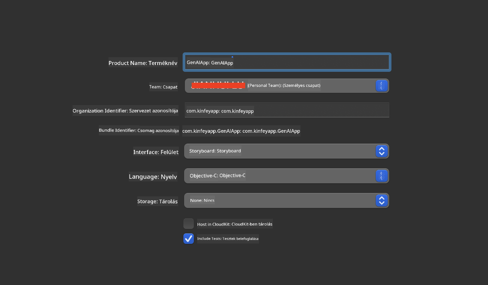
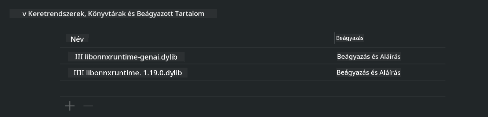
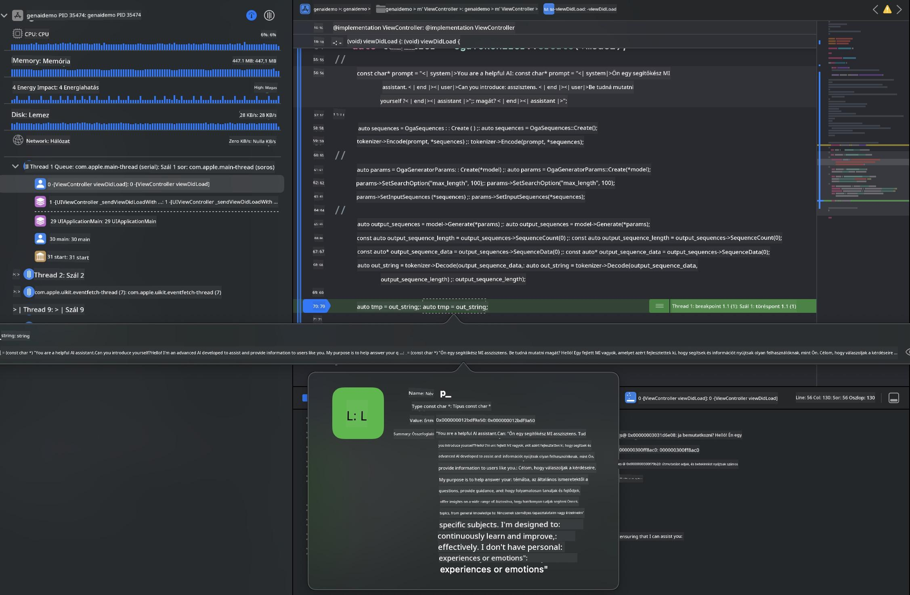

<!--
CO_OP_TRANSLATOR_METADATA:
{
  "original_hash": "82af197df38d25346a98f1f0e84d1698",
  "translation_date": "2025-07-16T20:23:59+00:00",
  "source_file": "md/01.Introduction/03/iOS_Inference.md",
  "language_code": "hu"
}
-->
# **Phi-3 inferálása iOS-en**

A Phi-3-mini a Microsoft új modellcsaládja, amely lehetővé teszi a nagy nyelvi modellek (LLM-ek) telepítését élő eszközökre és IoT eszközökre. A Phi-3-mini elérhető iOS, Android és Edge Device telepítésekhez, így a generatív AI BYOD környezetben is használható. Az alábbi példa bemutatja, hogyan telepíthető a Phi-3-mini iOS-en.

## **1. Előkészületek**

- **a.** macOS 14+
- **b.** Xcode 15+
- **c.** iOS SDK 17.x (iPhone 14 A16 vagy újabb)
- **d.** Telepítsd a Python 3.10+ verziót (ajánlott a Conda)
- **e.** Telepítsd a `python-flatbuffers` Python könyvtárat
- **f.** Telepítsd a CMake-et

### Semantic Kernel és inferálás

A Semantic Kernel egy alkalmazáskeret, amely lehetővé teszi olyan alkalmazások létrehozását, amelyek kompatibilisek az Azure OpenAI Service-szel, OpenAI modellekkel, sőt helyi modellekkel is. A Semantic Kernel-en keresztüli helyi szolgáltatások elérése egyszerű integrációt tesz lehetővé az önállóan hosztolt Phi-3-mini modell szervereddel.

### Kvantált modellek hívása Ollama vagy LlamaEdge segítségével

Sok felhasználó előnyben részesíti a kvantált modellek használatát a helyi futtatáshoz. Az [Ollama](https://ollama.com) és a [LlamaEdge](https://llamaedge.com) lehetővé teszi különböző kvantált modellek hívását:

#### **Ollama**

Futtathatod közvetlenül az `ollama run phi3` parancsot, vagy offline konfigurálhatod. Hozz létre egy Modelfile-t a `gguf` fájl elérési útjával. Példa a Phi-3-mini kvantált modell futtatására:

```gguf
FROM {Add your gguf file path}
TEMPLATE \"\"\"<|user|> .Prompt<|end|> <|assistant|>\"\"\"
PARAMETER stop <|end|>
PARAMETER num_ctx 4096
```

#### **LlamaEdge**

Ha egyszerre szeretnéd használni a `gguf` fájlt felhőben és élő eszközökön, a LlamaEdge kiváló választás.

## **2. ONNX Runtime fordítása iOS-re**

```bash

git clone https://github.com/microsoft/onnxruntime.git

cd onnxruntime

./build.sh --build_shared_lib --ios --skip_tests --parallel --build_dir ./build_ios --ios --apple_sysroot iphoneos --osx_arch arm64 --apple_deploy_target 17.5 --cmake_generator Xcode --config Release

cd ../

```

### **Figyelem**

- **a.** A fordítás előtt győződj meg róla, hogy az Xcode megfelelően van beállítva, és állítsd be aktív fejlesztői könyvtárként a terminálban:

    ```bash
    sudo xcode-select -switch /Applications/Xcode.app/Contents/Developer
    ```

- **b.** Az ONNX Runtime-ot különböző platformokra kell fordítani. iOS esetén `arm64` vagy `x86_64` architektúrára fordíthatsz.

- **c.** Ajánlott a legfrissebb iOS SDK használata a fordításhoz, de régebbi verzió is használható, ha kompatibilitásra van szükség korábbi SDK-kkal.

## **3. Generatív AI fordítása ONNX Runtime-tal iOS-re**

> **Megjegyzés:** Mivel a Generatív AI ONNX Runtime-mal még előzetes verzióban van, számíts esetleges változásokra.

```bash

git clone https://github.com/microsoft/onnxruntime-genai
 
cd onnxruntime-genai
 
mkdir ort
 
cd ort
 
mkdir include
 
mkdir lib
 
cd ../
 
cp ../onnxruntime/include/onnxruntime/core/session/onnxruntime_c_api.h ort/include
 
cp ../onnxruntime/build_ios/Release/Release-iphoneos/libonnxruntime*.dylib* ort/lib
 
export OPENCV_SKIP_XCODEBUILD_FORCE_TRYCOMPILE_DEBUG=1
 
python3 build.py --parallel --build_dir ./build_ios --ios --ios_sysroot iphoneos --ios_arch arm64 --ios_deployment_target 17.5 --cmake_generator Xcode --cmake_extra_defines CMAKE_XCODE_ATTRIBUTE_CODE_SIGNING_ALLOWED=NO

```

## **4. Alkalmazás létrehozása Xcode-ban**

Az alkalmazás fejlesztési módjaként az Objective-C-t választottam, mert az ONNX Runtime C++ API-jával a Generatív AI használata így jobb kompatibilitást biztosít. Természetesen Swift bridging segítségével is megvalósíthatók a hívások.



## **5. ONNX kvantált INT4 modell másolása az App projektbe**

Importálni kell az ONNX formátumú INT4 kvantált modellt, amelyet először le kell tölteni.


A letöltés után hozzá kell adni a projekt Resources könyvtárához Xcode-ban.


## **6. C++ API hozzáadása a ViewControllers-hez**

> **Figyelem:**

- **a.** Add hozzá a megfelelő C++ fejlécfájlokat a projekthez.

  

- **b.** Illeszd be az `onnxruntime-genai` dinamikus könyvtárat Xcode-ba.

  

- **c.** Használd a C mintakódot teszteléshez. További funkciókhoz, például ChatUI-hoz is hozzáadhatsz kiegészítéseket.

- **d.** Mivel C++-t kell használnod a projektben, nevezd át a `ViewController.m` fájlt `ViewController.mm`-re, hogy engedélyezd az Objective-C++ támogatást.

```objc

    NSString *llmPath = [[NSBundle mainBundle] resourcePath];
    char const *modelPath = llmPath.cString;

    auto model =  OgaModel::Create(modelPath);

    auto tokenizer = OgaTokenizer::Create(*model);

    const char* prompt = "<|system|>You are a helpful AI assistant.<|end|><|user|>Can you introduce yourself?<|end|><|assistant|>";

    auto sequences = OgaSequences::Create();
    tokenizer->Encode(prompt, *sequences);

    auto params = OgaGeneratorParams::Create(*model);
    params->SetSearchOption("max_length", 100);
    params->SetInputSequences(*sequences);

    auto output_sequences = model->Generate(*params);
    const auto output_sequence_length = output_sequences->SequenceCount(0);
    const auto* output_sequence_data = output_sequences->SequenceData(0);
    auto out_string = tokenizer->Decode(output_sequence_data, output_sequence_length);
    
    auto tmp = out_string;

```

## **7. Az alkalmazás futtatása**

A beállítások elvégzése után futtathatod az alkalmazást, hogy megtekintsd a Phi-3-mini modell inferálásának eredményét.



További mintakódokért és részletes útmutatókért látogass el a [Phi-3 Mini Samples repository](https://github.com/Azure-Samples/Phi-3MiniSamples/tree/main/ios) oldalra.

**Jogi nyilatkozat**:  
Ez a dokumentum az AI fordító szolgáltatás, a [Co-op Translator](https://github.com/Azure/co-op-translator) segítségével készült. Bár a pontosságra törekszünk, kérjük, vegye figyelembe, hogy az automatikus fordítások hibákat vagy pontatlanságokat tartalmazhatnak. Az eredeti dokumentum az anyanyelvén tekintendő hiteles forrásnak. Fontos információk esetén szakmai, emberi fordítást javaslunk. Nem vállalunk felelősséget a fordítás használatából eredő félreértésekért vagy téves értelmezésekért.