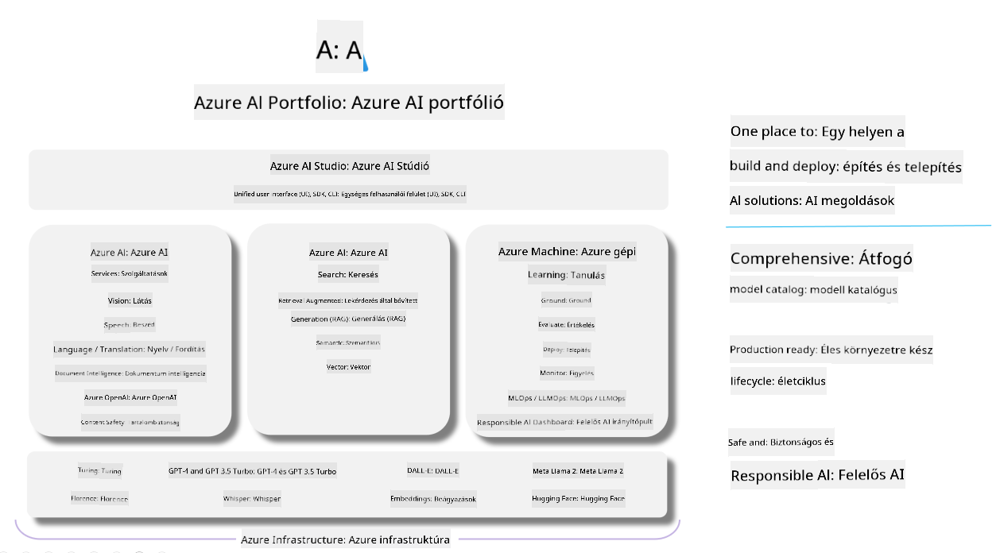

<!--
CO_OP_TRANSLATOR_METADATA:
{
  "original_hash": "7b4235159486df4000e16b7b46ddfec3",
  "translation_date": "2025-07-16T22:33:13+00:00",
  "source_file": "md/01.Introduction/05/AIFoundry.md",
  "language_code": "hu"
}
-->
# **Azure AI Foundry használata értékeléshez**

Hogyan értékelheted generatív AI alkalmazásodat az [Azure AI Foundry](https://ai.azure.com?WT.mc_id=aiml-138114-kinfeylo) segítségével. Akár egyszeri, akár többszörös körös beszélgetéseket vizsgálsz, az Azure AI Foundry eszközöket kínál a modell teljesítményének és biztonságának értékelésére.

## Hogyan értékeljük a generatív AI alkalmazásokat az Azure AI Foundry-val
Részletes útmutatóért lásd a [Azure AI Foundry dokumentációját](https://learn.microsoft.com/azure/ai-studio/how-to/evaluate-generative-ai-app?WT.mc_id=aiml-138114-kinfeylo)

Íme a kezdés lépései:

## Generatív AI modellek értékelése az Azure AI Foundry-ban

**Előfeltételek**

- Egy tesztadatkészlet CSV vagy JSON formátumban.
- Egy telepített generatív AI modell (például Phi-3, GPT 3.5, GPT 4 vagy Davinci modellek).
- Egy futtatókörnyezet számítási erőforrással az értékelés végrehajtásához.

## Beépített értékelési metrikák

Az Azure AI Foundry lehetővé teszi egyszeri és összetett, többszörös körös beszélgetések értékelését is.  
Retrieval Augmented Generation (RAG) esetén, amikor a modell konkrét adatokra épül, a beépített értékelési metrikák segítségével mérheted a teljesítményt.  
Emellett általános, egyszeri kérdés-válasz helyzeteket is értékelhetsz (nem RAG).

## Értékelési futtatás létrehozása

Az Azure AI Foundry felületén navigálj az Evaluate vagy a Prompt Flow oldalra.  
Kövesd az értékelés létrehozását segítő varázslót az értékelési futtatás beállításához. Adj meg opcionálisan nevet az értékelésnek.  
Válaszd ki azt a forgatókönyvet, amely leginkább megfelel az alkalmazásod céljainak.  
Jelölj ki egy vagy több értékelési metrikát a modell kimenetének mérésére.

## Egyedi értékelési folyamat (opcionális)

Nagyobb rugalmasság érdekében létrehozhatsz egyedi értékelési folyamatot, amelyet az igényeid szerint testre szabhatsz.

## Eredmények megtekintése

Az értékelés lefuttatása után naplózd, tekintsd meg és elemezd az Azure AI Foundry részletes értékelési metrikáit. Így mélyebb betekintést nyerhetsz az alkalmazásod képességeibe és korlátaiba.

**[!NOTE]** Az Azure AI Foundry jelenleg nyilvános előzetes verzióban érhető el, ezért kísérletezésre és fejlesztésre ajánlott használni. Éles környezetben más megoldásokat érdemes fontolóra venni. További részletekért és lépésről lépésre útmutatókért böngészd az hivatalos [AI Foundry dokumentációt](https://learn.microsoft.com/azure/ai-studio/?WT.mc_id=aiml-138114-kinfeylo).

**Jogi nyilatkozat**:  
Ez a dokumentum az AI fordító szolgáltatás, a [Co-op Translator](https://github.com/Azure/co-op-translator) segítségével készült. Bár a pontosságra törekszünk, kérjük, vegye figyelembe, hogy az automatikus fordítások hibákat vagy pontatlanságokat tartalmazhatnak. Az eredeti dokumentum az anyanyelvén tekintendő hiteles forrásnak. Fontos információk esetén szakmai, emberi fordítást javaslunk. Nem vállalunk felelősséget a fordítás használatából eredő félreértésekért vagy téves értelmezésekért.