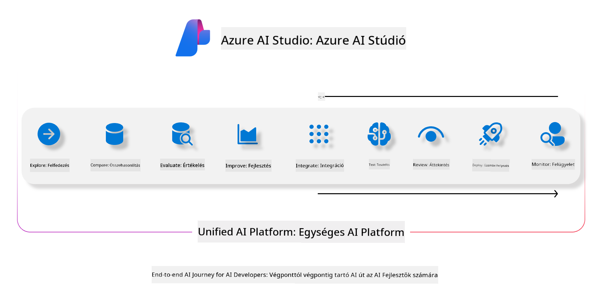
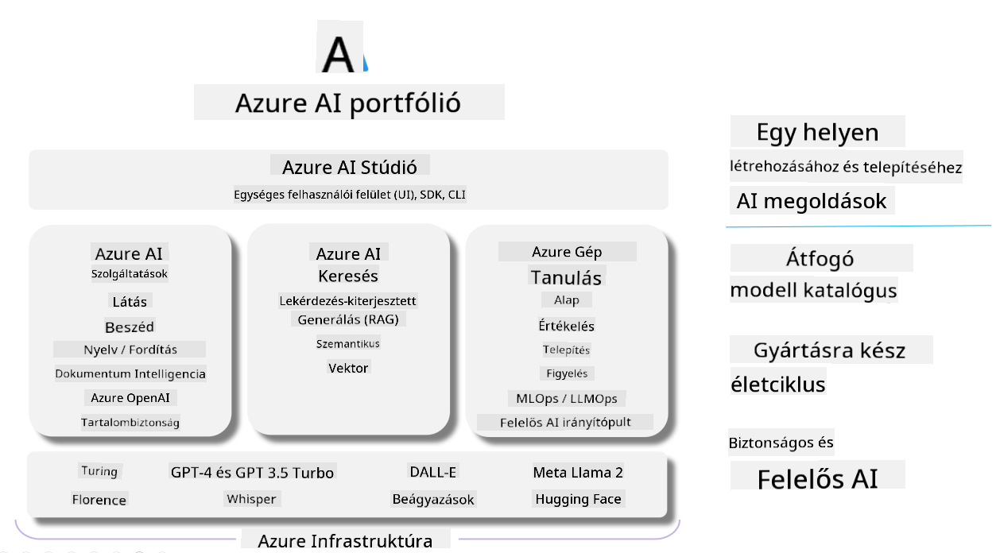

<!--
CO_OP_TRANSLATOR_METADATA:
{
  "original_hash": "7b4235159486df4000e16b7b46ddfec3",
  "translation_date": "2025-05-09T15:02:46+00:00",
  "source_file": "md/01.Introduction/05/AIFoundry.md",
  "language_code": "hu"
}
-->
# **Azure AI Foundry használata értékeléshez**

Hogyan értékelheted generatív AI alkalmazásodat az [Azure AI Foundry](https://ai.azure.com?WT.mc_id=aiml-138114-kinfeylo) segítségével. Akár egyfordulós, akár többfordulós beszélgetéseket vizsgálsz, az Azure AI Foundry eszközöket kínál a modell teljesítményének és biztonságának értékeléséhez.

## Hogyan értékelj generatív AI alkalmazásokat az Azure AI Foundry-val
Részletes útmutatóért tekintsd meg az [Azure AI Foundry dokumentációját](https://learn.microsoft.com/azure/ai-studio/how-to/evaluate-generative-ai-app?WT.mc_id=aiml-138114-kinfeylo)

Íme a kezdő lépések:

## Generatív AI modellek értékelése az Azure AI Foundry-ban

**Előfeltételek**

- Tesztadatok CSV vagy JSON formátumban.
- Telepített generatív AI modell (például Phi-3, GPT 3.5, GPT 4 vagy Davinci modellek).
- Egy futtatókörnyezet egy számítási példánnyal az értékelés végrehajtásához.

## Beépített értékelési metrikák

Az Azure AI Foundry lehetővé teszi egyfordulós és összetett, többfordulós beszélgetések értékelését.
Retrieval Augmented Generation (RAG) esetén, amikor a modell konkrét adatokra támaszkodik, a teljesítményt beépített értékelési metrikákkal mérheted.
Ezen felül általános, egyfordulós kérdés-válasz helyzeteket is értékelhetsz (nem-RAG).

## Értékelési futtatás létrehozása

Az Azure AI Foundry felületén navigálj az Evaluate vagy a Prompt Flow oldalra.
Kövesd az értékelés létrehozását segítő varázslót egy új értékelési futtatás beállításához. Megadhatsz opcionális nevet az értékelésnek.
Válaszd ki azt a forgatókönyvet, amely leginkább megfelel az alkalmazásod céljainak.
Jelölj ki egy vagy több értékelési metrikát a modell kimenetének vizsgálatához.

## Egyedi értékelési folyamat (opcionális)

Nagyobb rugalmasság érdekében létrehozhatsz egyedi értékelési folyamatot, amelyet az igényeidhez szabsz.

## Eredmények megtekintése

Az értékelés lefuttatása után az Azure AI Foundry-ban naplózhatod, megtekintheted és elemezheted a részletes értékelési metrikákat. Így mélyebb betekintést nyerhetsz az alkalmazásod képességeibe és korlátaiba.

**Note** Az Azure AI Foundry jelenleg nyilvános előzetes verzióban van, ezért elsősorban kísérletezésre és fejlesztésre ajánlott. Éles környezetben más megoldásokat érdemes fontolóra venni. További részletekért és lépésről lépésre útmutatóért látogasd meg a hivatalos [AI Foundry dokumentációt](https://learn.microsoft.com/azure/ai-studio/?WT.mc_id=aiml-138114-kinfeylo).

**Jogi nyilatkozat**:  
Ez a dokumentum az AI fordító szolgáltatás, a [Co-op Translator](https://github.com/Azure/co-op-translator) segítségével készült. Bár a pontosságra törekszünk, kérjük, vegye figyelembe, hogy az automatikus fordítások tartalmazhatnak hibákat vagy pontatlanságokat. Az eredeti dokumentum az anyanyelvén tekintendő hiteles forrásnak. Fontos információk esetén szakmai emberi fordítást javaslunk. Nem vállalunk felelősséget a fordítás használatából eredő félreértésekért vagy téves értelmezésekért.