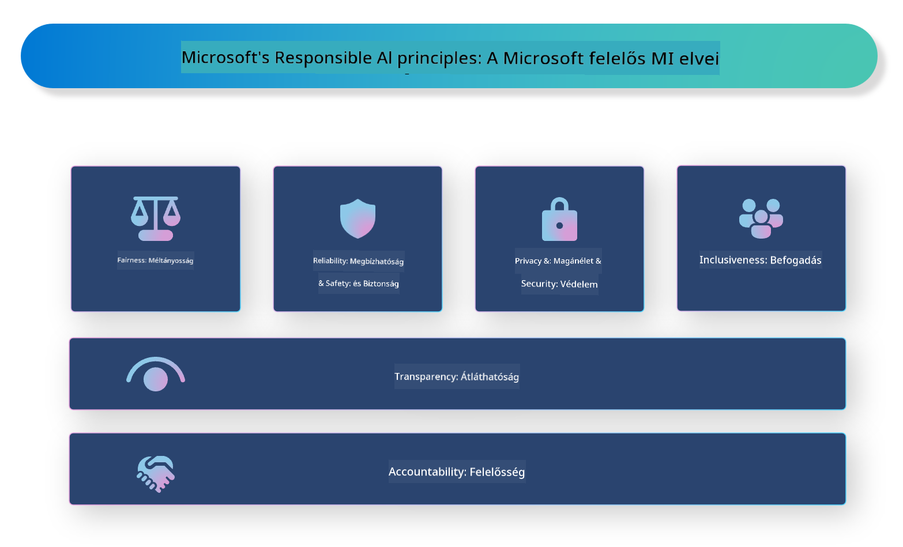

<!--
CO_OP_TRANSLATOR_METADATA:
{
  "original_hash": "805b96b20152936d8f4c587d90d6e06e",
  "translation_date": "2025-05-09T15:44:48+00:00",
  "source_file": "md/01.Introduction/05/ResponsibleAI.md",
  "language_code": "hu"
}
-->
# **Ismertesse a felelős MI-t**

A [Microsoft Responsible AI](https://www.microsoft.com/ai/responsible-ai?WT.mc_id=aiml-138114-kinfeylo) egy kezdeményezés, amely segíti a fejlesztőket és szervezeteket átlátható, megbízható és elszámoltatható MI-rendszerek létrehozásában. A kezdeményezés útmutatást és erőforrásokat biztosít a felelős MI-megoldások fejlesztéséhez, amelyek összhangban állnak az etikai elvekkel, mint például az adatvédelem, méltányosság és átláthatóság. Emellett áttekintjük a felelős MI-rendszerek építésével kapcsolatos kihívásokat és bevált gyakorlatokat is.

## A Microsoft Responsible AI áttekintése

**Etikai elvek**

A Microsoft Responsible AI-t egy sor etikai elv vezérli, mint az adatvédelem, méltányosság, átláthatóság, elszámoltathatóság és biztonság. Ezek az elvek arra szolgálnak, hogy az MI-rendszerek etikus és felelős módon készüljenek.

**Átlátható MI**

A Microsoft Responsible AI hangsúlyozza az átláthatóság fontosságát az MI-rendszerekben. Ez magában foglalja az MI-modellek működésének világos magyarázatát, valamint annak biztosítását, hogy az adatforrások és algoritmusok nyilvánosan elérhetőek legyenek.

**Elszámoltatható MI**

A [Microsoft Responsible AI](https://www.microsoft.com/ai/responsible-ai?WT.mc_id=aiml-138114-kinfeylo) támogatja az elszámoltatható MI-rendszerek fejlesztését, amelyek képesek betekintést nyújtani abba, hogyan hoznak döntéseket az MI-modellek. Ez segíthet a felhasználóknak megérteni és megbízni az MI-rendszerek eredményeiben.

**Befogadó jelleg**

Az MI-rendszereket úgy kell tervezni, hogy mindenki számára előnyösek legyenek. A Microsoft célja olyan befogadó MI létrehozása, amely figyelembe veszi a különböző nézőpontokat, és elkerüli az elfogultságot vagy diszkriminációt.

**Megbízhatóság és biztonság**

Az MI-rendszerek megbízhatóságának és biztonságának biztosítása létfontosságú. A Microsoft arra törekszik, hogy robusztus modelleket építsen, amelyek következetesen működnek és elkerülik a káros következményeket.

**Méltányosság az MI-ben**

A Microsoft Responsible AI felismeri, hogy az MI-rendszerek fenntarthatják az elfogultságokat, ha elfogult adatokon vagy algoritmusokon tanulnak. A kezdeményezés útmutatást nyújt méltányos MI-rendszerek fejlesztéséhez, amelyek nem diszkriminálnak például faj, nem vagy életkor alapján.

**Adatvédelem és biztonság**

A Microsoft Responsible AI hangsúlyozza a felhasználói adatvédelem és adatbiztonság fontosságát az MI-rendszerekben. Ez magában foglalja az erős adat titkosítás és hozzáférés-ellenőrzés bevezetését, valamint az MI-rendszerek rendszeres sebezhetőségi auditját.

**Elszámoltathatóság és felelősség**

A Microsoft Responsible AI előmozdítja az elszámoltathatóságot és felelősségvállalást az MI fejlesztésében és bevezetésében. Ez azt jelenti, hogy a fejlesztőknek és szervezeteknek tisztában kell lenniük az MI-rendszerekhez kapcsolódó kockázatokkal, és lépéseket kell tenniük azok csökkentésére.

## Felelős MI-rendszerek építésének bevált gyakorlatai

**MI-modellek fejlesztése sokszínű adatkészletek felhasználásával**

Az elfogultság elkerülése érdekében fontos sokszínű adatkészleteket használni, amelyek különböző nézőpontokat és tapasztalatokat képviselnek.

**Magyarázható MI technikák alkalmazása**

A magyarázható MI technikák segítenek a felhasználóknak megérteni, hogyan hoznak döntéseket az MI-modellek, ami növelheti a rendszerbe vetett bizalmat.

**Az MI-rendszerek rendszeres sebezhetőségi auditja**

Az MI-rendszerek rendszeres auditja segíthet azonosítani a potenciális kockázatokat és sebezhetőségeket, amelyeket kezelni kell.

**Erős adat titkosítás és hozzáférés-ellenőrzés bevezetése**

Az adat titkosítás és hozzáférés-ellenőrzés hozzájárulhat a felhasználói adatvédelem és biztonság megőrzéséhez az MI-rendszerekben.

**Etikai elvek követése az MI fejlesztésében**

Az olyan etikai elvek követése, mint a méltányosság, átláthatóság és elszámoltathatóság, segíthet bizalmat építeni az MI-rendszerekben, és biztosítja, hogy azok felelősségteljes módon készüljenek.

## Az AI Foundry használata a felelős MI-hez

Az [Azure AI Foundry](https://ai.azure.com?WT.mc_id=aiml-138114-kinfeylo) egy erőteljes platform, amely lehetővé teszi fejlesztők és szervezetek számára, hogy gyorsan hozzanak létre intelligens, élvonalbeli, piackész és felelős alkalmazásokat. Íme néhány kulcsfontosságú funkció és képesség az Azure AI Foundry-ban:

**Kész API-k és modellek**

Az Azure AI Foundry előre elkészített és testreszabható API-kat és modelleket kínál. Ezek számos MI-feladatot lefednek, beleértve a generatív MI-t, természetes nyelvfeldolgozást beszélgetésekhez, keresést, monitorozást, fordítást, beszédet, látást és döntéshozatalt.

**Prompt Flow**

Az Azure AI Foundry Prompt Flow lehetővé teszi beszélgetés-alapú MI élmények létrehozását. Segítségével megtervezheted és kezelheted a beszélgetési folyamatokat, megkönnyítve chatbotok, virtuális asszisztensek és más interaktív alkalmazások fejlesztését.

**Retrieval Augmented Generation (RAG)**

A RAG egy olyan technika, amely ötvözi a keresés-alapú és generatív megközelítéseket. Javítja a generált válaszok minőségét azáltal, hogy egyaránt kihasználja a meglévő tudást (keresés) és a kreatív generálást (generálás).

**Generatív MI értékelési és monitorozási metrikák**

Az Azure AI Foundry eszközöket biztosít generatív MI-modellek értékelésére és monitorozására. Felmérheted teljesítményüket, méltányosságukat és más fontos mutatókat a felelős bevezetés érdekében. Emellett, ha létrehoztál egy irányítópultot, az Azure Machine Learning Studio no-code felületén testreszabhatod és generálhatod a Responsible AI Dashboardot és a hozzá kapcsolódó scorecardot a [Responsible AI Toolbox](https://responsibleaitoolbox.ai/?WT.mc_id=aiml-138114-kinfeylo) Python könyvtárai alapján. Ez a scorecard segít megosztani a méltányossággal, jellemzőfontossággal és más felelős bevezetési szempontokkal kapcsolatos kulcsfontosságú információkat mind technikai, mind nem technikai érintettekkel.

A felelős MI érdekében az AI Foundry használatakor az alábbi bevált gyakorlatokat érdemes követni:

**Határozd meg az MI-rendszer problémáját és céljait**

A fejlesztési folyamat megkezdése előtt fontos egyértelműen meghatározni a problémát vagy célt, amelyet az MI-rendszer megoldani kíván. Ez segít azonosítani azokat az adatokat, algoritmusokat és erőforrásokat, amelyek szükségesek egy hatékony modell felépítéséhez.

**Gyűjts össze és dolgozz fel releváns adatokat**

Az MI-rendszer képzéséhez használt adatok minősége és mennyisége jelentős hatással van a teljesítményre. Ezért fontos releváns adatokat gyűjteni, tisztítani, előfeldolgozni, és biztosítani, hogy azok reprezentálják a vizsgált populációt vagy problémát.

**Válaszd ki a megfelelő értékelési algoritmust**

Számos értékelési algoritmus létezik. Fontos a legmegfelelőbb algoritmus kiválasztása az adatok és a probléma alapján.

**Értékeld és értelmezd a modellt**

Miután elkészült az MI-modell, fontos értékelni a teljesítményét megfelelő mutatók segítségével, és átlátható módon értelmezni az eredményeket. Ez segít az esetleges elfogultságok vagy korlátok felismerésében és a szükséges fejlesztések elvégzésében.

**Biztosíts átláthatóságot és magyarázhatóságot**

Az MI-rendszereknek átláthatónak és magyarázhatónak kell lenniük, hogy a felhasználók megértsék, hogyan működnek és hogyan születnek a döntések. Ez különösen fontos olyan alkalmazások esetében, amelyek jelentős hatással vannak az emberek életére, mint az egészségügy, pénzügy vagy jogi rendszerek.

**Figyeld és frissítsd a modellt**

Az MI-rendszereket folyamatosan monitorozni és frissíteni kell annak érdekében, hogy hosszú távon pontosak és hatékonyak maradjanak. Ez folyamatos karbantartást, tesztelést és újratanítást igényel.

Összefoglalva, a Microsoft Responsible AI egy olyan kezdeményezés, amely segíti a fejlesztőket és szervezeteket átlátható, megbízható és elszámoltatható MI-rendszerek létrehozásában. Ne feledjük, hogy a felelős MI megvalósítása kulcsfontosságú, és az Azure AI Foundry célja, hogy ezt a gyakorlatban is megkönnyítse a szervezetek számára. Az etikai elvek és bevált gyakorlatok követésével biztosíthatjuk, hogy az MI-rendszerek felelősségteljes módon, a társadalom javára készüljenek és kerüljenek alkalmazásra.

**Jogi nyilatkozat**:  
Ezt a dokumentumot az AI fordító szolgáltatás [Co-op Translator](https://github.com/Azure/co-op-translator) segítségével fordítottuk le. Bár a pontosságra törekszünk, kérjük, vegye figyelembe, hogy az automatikus fordítások hibákat vagy pontatlanságokat tartalmazhatnak. Az eredeti dokumentum az anyanyelvén tekintendő hiteles forrásnak. Fontos információk esetén professzionális emberi fordítást javasolunk. Nem vállalunk felelősséget az ebből a fordításból eredő félreértésekért vagy téves értelmezésekért.