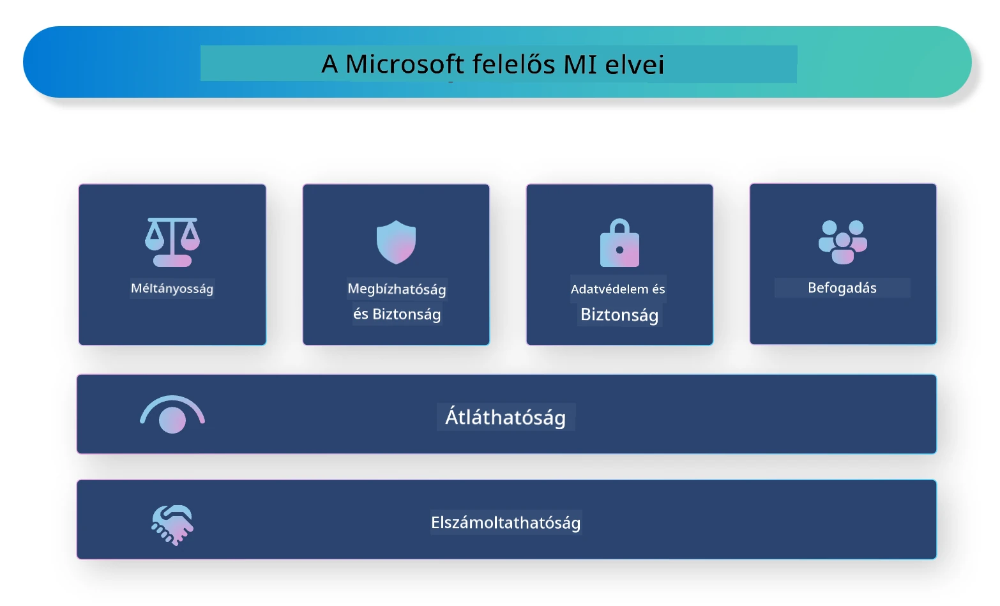

<!--
CO_OP_TRANSLATOR_METADATA:
{
  "original_hash": "805b96b20152936d8f4c587d90d6e06e",
  "translation_date": "2025-07-16T22:57:06+00:00",
  "source_file": "md/01.Introduction/05/ResponsibleAI.md",
  "language_code": "hu"
}
-->
# **Ismertetés a felelős mesterséges intelligenciáról**

A [Microsoft Responsible AI](https://www.microsoft.com/ai/responsible-ai?WT.mc_id=aiml-138114-kinfeylo) egy kezdeményezés, amely segíti a fejlesztőket és szervezeteket abban, hogy átlátható, megbízható és elszámoltatható MI-rendszereket építsenek. A kezdeményezés útmutatást és erőforrásokat nyújt felelős MI-megoldások fejlesztéséhez, amelyek összhangban állnak etikai elvekkel, mint például az adatvédelem, méltányosság és átláthatóság. Emellett megvizsgáljuk a felelős MI-rendszerek építésével járó kihívásokat és bevált gyakorlatokat is.

## A Microsoft Responsible AI áttekintése

**Etikai elvek**

A Microsoft Responsible AI-t egy sor etikai elv vezérli, mint az adatvédelem, méltányosság, átláthatóság, elszámoltathatóság és biztonság. Ezek az elvek biztosítják, hogy az MI-rendszerek etikusan és felelősségteljesen készüljenek.

**Átlátható MI**

A Microsoft Responsible AI hangsúlyozza az átláthatóság fontosságát az MI-rendszerekben. Ez magában foglalja az MI-modellek működésének világos magyarázatát, valamint annak biztosítását, hogy az adatforrások és algoritmusok nyilvánosan elérhetők legyenek.

**Elszámoltatható MI**

A [Microsoft Responsible AI](https://www.microsoft.com/ai/responsible-ai?WT.mc_id=aiml-138114-kinfeylo) támogatja az elszámoltatható MI-rendszerek fejlesztését, amelyek betekintést nyújtanak abba, hogyan hoznak döntéseket az MI-modellek. Ez segíti a felhasználókat abban, hogy megértsék és megbízzanak az MI-rendszerek eredményeiben.

**Befogadás**

Az MI-rendszereket úgy kell tervezni, hogy mindenki számára előnyösek legyenek. A Microsoft célja, hogy befogadó MI-t hozzon létre, amely figyelembe veszi a különböző nézőpontokat, és elkerüli az elfogultságot vagy diszkriminációt.

**Megbízhatóság és biztonság**

Az MI-rendszerek megbízhatóságának és biztonságának biztosítása kulcsfontosságú. A Microsoft olyan robusztus modellek fejlesztésére összpontosít, amelyek következetesen működnek és elkerülik a káros következményeket.

**Méltányosság az MI-ben**

A Microsoft Responsible AI felismeri, hogy az MI-rendszerek fenntarthatják az elfogultságokat, ha elfogult adatokon vagy algoritmusokon tanulnak. A kezdeményezés útmutatást nyújt méltányos MI-rendszerek fejlesztéséhez, amelyek nem diszkriminálnak például faj, nem vagy életkor alapján.

**Adatvédelem és biztonság**

A Microsoft Responsible AI hangsúlyozza a felhasználói adatvédelem és adatbiztonság fontosságát az MI-rendszerekben. Ez magában foglalja az erős adat titkosítás és hozzáférés-szabályozás bevezetését, valamint az MI-rendszerek rendszeres sebezhetőségi ellenőrzését.

**Elszámoltathatóság és felelősség**

A Microsoft Responsible AI támogatja az elszámoltathatóságot és felelősségvállalást az MI fejlesztésében és alkalmazásában. Ez magában foglalja annak biztosítását, hogy a fejlesztők és szervezetek tisztában legyenek az MI-rendszerekhez kapcsolódó kockázatokkal, és lépéseket tegyenek ezek mérséklésére.

## Felelős MI-rendszerek építésének bevált gyakorlatai

**Fejlesszünk MI-modelleket sokszínű adatkészletekkel**

Az elfogultság elkerülése érdekében fontos, hogy sokszínű adatkészleteket használjunk, amelyek különböző nézőpontokat és tapasztalatokat tükröznek.

**Használjunk magyarázható MI technikákat**

A magyarázható MI technikák segítenek a felhasználóknak megérteni, hogyan hoznak döntéseket az MI-modellek, ami növelheti a rendszerbe vetett bizalmat.

**Rendszeresen ellenőrizzük az MI-rendszereket sebezhetőségek szempontjából**

Az MI-rendszerek rendszeres auditálása segíthet azonosítani a potenciális kockázatokat és sebezhetőségeket, amelyeket kezelni kell.

**Alkalmazzunk erős adat titkosítást és hozzáférés-szabályozást**

Az adat titkosítás és hozzáférés-szabályozás segít megvédeni a felhasználói adatokat és biztosítani az MI-rendszerek biztonságát.

**Követjük az etikai elveket az MI fejlesztésében**

Az olyan etikai elvek követése, mint a méltányosság, átláthatóság és elszámoltathatóság, hozzájárul a bizalom kiépítéséhez az MI-rendszerek iránt, és biztosítja, hogy azok felelősségteljesen készüljenek.

## Az AI Foundry használata a felelős MI-hez

Az [Azure AI Foundry](https://ai.azure.com?WT.mc_id=aiml-138114-kinfeylo) egy erőteljes platform, amely lehetővé teszi fejlesztők és szervezetek számára, hogy gyorsan hozzanak létre intelligens, élvonalbeli, piacra kész és felelős alkalmazásokat. Íme néhány kulcsfontosságú funkció és képesség az Azure AI Foundry-ban:

**Kész API-k és modellek**

Az Azure AI Foundry előre elkészített és testreszabható API-kat és modelleket kínál. Ezek számos MI-feladatot lefednek, beleértve a generatív MI-t, természetes nyelvfeldolgozást beszélgetésekhez, keresést, monitorozást, fordítást, beszédet, látást és döntéshozatalt.

**Prompt Flow**

Az Azure AI Foundry Prompt Flow lehetővé teszi beszélgetés-alapú MI élmények létrehozását. Segít megtervezni és kezelni a beszélgetési folyamatokat, megkönnyítve chatbotok, virtuális asszisztensek és más interaktív alkalmazások fejlesztését.

**Retrieval Augmented Generation (RAG)**

A RAG egy olyan technika, amely ötvözi a lekérdezés-alapú és generatív megközelítéseket. Javítja a generált válaszok minőségét azáltal, hogy mind a meglévő tudást (lekérdezés), mind a kreatív generálást (generálás) kihasználja.

**Generatív MI értékelési és monitorozási metrikák**

Az Azure AI Foundry eszközöket biztosít generatív MI-modellek értékelésére és monitorozására. Értékelheted a teljesítményüket, méltányosságukat és más fontos mutatókat a felelős alkalmazás érdekében. Ha létrehoztál egy irányítópultot, az Azure Machine Learning Studio kód nélküli felületén testreszabhatod és generálhatod a Responsible AI Dashboardot és a hozzá tartozó scorecardot a [Responsible AI Toolbox](https://responsibleaitoolbox.ai/?WT.mc_id=aiml-138114-kinfeylo) Python könyvtárak alapján. Ez a scorecard segít megosztani a méltányossággal, jellemző fontossággal és más felelős alkalmazási szempontokkal kapcsolatos kulcsfontosságú információkat technikai és nem technikai érintettekkel egyaránt.

A felelős MI érdekében az AI Foundry használatakor kövesd az alábbi bevált gyakorlatokat:

**Határozd meg az MI-rendszer problémáját és céljait**

A fejlesztés megkezdése előtt fontos egyértelműen meghatározni azt a problémát vagy célt, amelyet az MI-rendszer meg kíván oldani. Ez segít az adatok, algoritmusok és erőforrások azonosításában a hatékony modell felépítéséhez.

**Gyűjtsd össze és előfeldolgozd a releváns adatokat**

Az MI-rendszer képzéséhez használt adatok minősége és mennyisége jelentős hatással van a teljesítményre. Ezért fontos a releváns adatok összegyűjtése, tisztítása, előfeldolgozása, és annak biztosítása, hogy az adatok reprezentálják a célpopulációt vagy problémát.

**Válassz megfelelő értékelési algoritmust**

Számos értékelési algoritmus létezik. Fontos a legmegfelelőbb algoritmus kiválasztása az adatok és a probléma alapján.

**Értékeld és értelmezd a modellt**

Miután elkészült az MI-modell, fontos a teljesítményének értékelése megfelelő metrikákkal, és az eredmények átlátható értelmezése. Ez segít az esetleges elfogultságok vagy korlátok felismerésében és a szükséges fejlesztések elvégzésében.

**Biztosíts átláthatóságot és magyarázhatóságot**

Az MI-rendszereknek átláthatónak és magyarázhatónak kell lenniük, hogy a felhasználók megértsék működésüket és döntéshozatali folyamataikat. Ez különösen fontos olyan alkalmazásoknál, amelyek jelentős hatással vannak az emberek életére, például az egészségügyben, pénzügyekben és jogi rendszerekben.

**Figyeld és frissítsd a modellt**

Az MI-rendszereket folyamatosan figyelni és frissíteni kell, hogy hosszú távon is pontosak és hatékonyak maradjanak. Ez folyamatos karbantartást, tesztelést és újraképzést igényel.

Összefoglalva, a Microsoft Responsible AI egy olyan kezdeményezés, amely segíti a fejlesztőket és szervezeteket átlátható, megbízható és elszámoltatható MI-rendszerek építésében. Ne feledjük, hogy a felelős MI megvalósítása kulcsfontosságú, és az Azure AI Foundry célja, hogy ezt a gyakorlatban is megkönnyítse a szervezetek számára. Az etikai elvek és bevált gyakorlatok követésével biztosíthatjuk, hogy az MI-rendszerek felelősségteljesen, a társadalom egészének javára készüljenek és kerüljenek alkalmazásra.

**Jogi nyilatkozat**:  
Ez a dokumentum az AI fordító szolgáltatás, a [Co-op Translator](https://github.com/Azure/co-op-translator) segítségével készült. Bár a pontosságra törekszünk, kérjük, vegye figyelembe, hogy az automatikus fordítások hibákat vagy pontatlanságokat tartalmazhatnak. Az eredeti dokumentum az anyanyelvén tekintendő hiteles forrásnak. Kritikus információk esetén professzionális emberi fordítást javaslunk. Nem vállalunk felelősséget a fordítás használatából eredő félreértésekért vagy téves értelmezésekért.