<!--
CO_OP_TRANSLATOR_METADATA:
{
  "original_hash": "80a853c08e4ee25ef9b4bfcedd8990da",
  "translation_date": "2025-05-09T17:10:17+00:00",
  "source_file": "md/02.Application/01.TextAndChat/Phi3/E2E_Phi-3-Evaluation_AIFoundry.md",
  "language_code": "hu"
}
-->
# Finomhangolt Phi-3 / Phi-3.5 modell értékelése az Azure AI Foundry-ban, a Microsoft Felelős MI elveire fókuszálva

Ez az end-to-end (E2E) példa a Microsoft Tech Community "[Finomhangolt Phi-3 / 3.5 modellek értékelése az Azure AI Foundry-ban, a Microsoft Felelős MI elveire fókuszálva](https://techcommunity.microsoft.com/blog/educatordeveloperblog/evaluate-fine-tuned-phi-3--3-5-models-in-azure-ai-studio-focusing-on-microsofts-/4227850?WT.mc_id=aiml-137032-kinfeylo)" útmutatóján alapul.

## Áttekintés

### Hogyan értékelhetjük egy finomhangolt Phi-3 / Phi-3.5 modell biztonságát és teljesítményét az Azure AI Foundry-ban?

Egy modell finomhangolása néha nem kívánt vagy váratlan válaszokat eredményezhet. Annak érdekében, hogy a modell biztonságos és hatékony maradjon, fontos felmérni, hogy képes-e káros tartalmak generálására, valamint hogy mennyire pontos, releváns és koherens válaszokat ad. Ebben a bemutatóban megtanulhatod, hogyan értékeld a finomhangolt Phi-3 / Phi-3.5 modell biztonságát és teljesítményét, amely a Prompt flow-val integrálva működik az Azure AI Foundry-ban.

Íme az Azure AI Foundry értékelési folyamata.


*Kép forrása: [Evaluation of generative AI applications](https://learn.microsoft.com/azure/ai-studio/concepts/evaluation-approach-gen-ai?wt.mc_id%3Dstudentamb_279723)*

> [!NOTE]
>
> További részletes információkért és további forrásokért a Phi-3 / Phi-3.5 modellekről, kérjük, látogasd meg a [Phi-3CookBook](https://github.com/microsoft/Phi-3CookBook?wt.mc_id=studentamb_279723) oldalt.

### Előfeltételek

- [Python](https://www.python.org/downloads)
- [Azure előfizetés](https://azure.microsoft.com/free?wt.mc_id=studentamb_279723)
- [Visual Studio Code](https://code.visualstudio.com)
- Finomhangolt Phi-3 / Phi-3.5 modell

### Tartalomjegyzék

1. [**1. forgatókönyv: Bevezetés az Azure AI Foundry Prompt flow értékelésébe**](../../../../../../md/02.Application/01.TextAndChat/Phi3)

    - [Bevezetés a biztonsági értékelésbe](../../../../../../md/02.Application/01.TextAndChat/Phi3)
    - [Bevezetés a teljesítményértékelésbe](../../../../../../md/02.Application/01.TextAndChat/Phi3)

1. [**2. forgatókönyv: Phi-3 / Phi-3.5 modell értékelése az Azure AI Foundry-ban**](../../../../../../md/02.Application/01.TextAndChat/Phi3)

    - [Mielőtt elkezdenéd](../../../../../../md/02.Application/01.TextAndChat/Phi3)
    - [Azure OpenAI telepítése a Phi-3 / Phi-3.5 modell értékeléséhez](../../../../../../md/02.Application/01.TextAndChat/Phi3)
    - [A finomhangolt Phi-3 / Phi-3.5 modell értékelése az Azure AI Foundry Prompt flow értékelésével](../../../../../../md/02.Application/01.TextAndChat/Phi3)

1. [Gratulálunk!](../../../../../../md/02.Application/01.TextAndChat/Phi3)

## **1. forgatókönyv: Bevezetés az Azure AI Foundry Prompt flow értékelésébe**

### Bevezetés a biztonsági értékelésbe

Annak érdekében, hogy az AI modell etikus és biztonságos legyen, elengedhetetlen, hogy a Microsoft Felelős MI elvei szerint értékeljük. Az Azure AI Foundry-ban a biztonsági értékelések lehetővé teszik a modell sebezhetőségének felmérését jailbreak támadásokkal szemben, valamint annak vizsgálatát, hogy képes-e káros tartalmak generálására, ami közvetlenül kapcsolódik ezekhez az elvekhez.

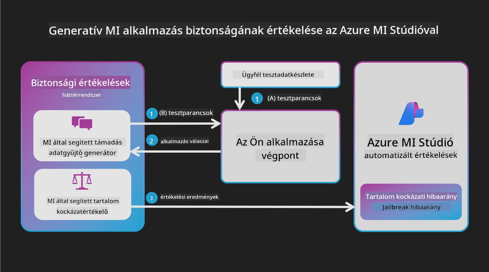

*Kép forrása: [Evaluation of generative AI applications](https://learn.microsoft.com/azure/ai-studio/concepts/evaluation-approach-gen-ai?wt.mc_id%3Dstudentamb_279723)*

#### A Microsoft Felelős MI elvei

A technikai lépések megkezdése előtt fontos megérteni a Microsoft Felelős MI elveit, amelyek egy etikai keretrendszert alkotnak az AI rendszerek felelős fejlesztéséhez, bevezetéséhez és működtetéséhez. Ezek az elvek irányt mutatnak az AI rendszerek tervezésében, fejlesztésében és bevezetésében, biztosítva, hogy az AI technológiák igazságosak, átláthatóak és befogadóak legyenek. Ezek az elvek képezik az AI modellek biztonságának értékelésének alapját.

A Microsoft Felelős MI elvei a következők:

- **Méltányosság és Befogadás**: Az AI rendszereknek mindenkivel igazságosan kell bánniuk, és kerülniük kell, hogy hasonló helyzetű csoportokat eltérő módon érintsenek. Például, amikor az AI rendszerek orvosi kezelési tanácsokat, hitelkérelmeket vagy állásajánlatokat adnak, ugyanazokat az ajánlásokat kell megfogalmazniuk mindenkinek, aki hasonló tünetekkel, pénzügyi helyzettel vagy szakmai képesítéssel rendelkezik.

- **Megbízhatóság és Biztonság**: A bizalom építéséhez elengedhetetlen, hogy az AI rendszerek megbízhatóan, biztonságosan és következetesen működjenek. Ezeknek a rendszereknek képesnek kell lenniük arra, hogy az eredeti tervek szerint működjenek, biztonságosan reagáljanak váratlan helyzetekre, és ellenálljanak káros manipulációnak. Viselkedésük és az általuk kezelhető különféle helyzetek a tervezők által előre látott körülményeket tükrözik.

- **Átláthatóság**: Amikor az AI rendszerek olyan döntések meghozatalában segítenek, amelyek jelentős hatással vannak az emberek életére, kritikus, hogy az érintettek megértsék, hogyan születnek ezek a döntések. Például egy bank AI rendszert használhat annak eldöntésére, hogy valaki hitelképes-e. Egy cég AI rendszert alkalmazhat a legalkalmasabb jelöltek kiválasztására.

- **Adatvédelem és Biztonság**: Az AI térnyerésével egyre fontosabbá és összetettebbé válik a magánélet védelme és a személyes, valamint üzleti adatok biztonsága. Az AI esetében különösen oda kell figyelni az adatvédelemre és az adatbiztonságra, mivel az adatokhoz való hozzáférés elengedhetetlen az AI rendszerek pontos és megalapozott előrejelzéseihez és döntéseihez.

- **Felelősségre vonhatóság**: Az AI rendszereket tervező és bevezető személyeknek felelősséget kell vállalniuk rendszereik működéséért. A szervezeteknek iparági szabványokat kell alkalmazniuk a felelősségvállalási normák kialakításához. Ezek a normák biztosíthatják, hogy az AI rendszerek ne legyenek az emberek életét érintő döntések végső hatóságai, és hogy az emberek megőrizzék a jelentős mértékű kontrollt a nagyfokú autonómiával rendelkező AI rendszerek felett.

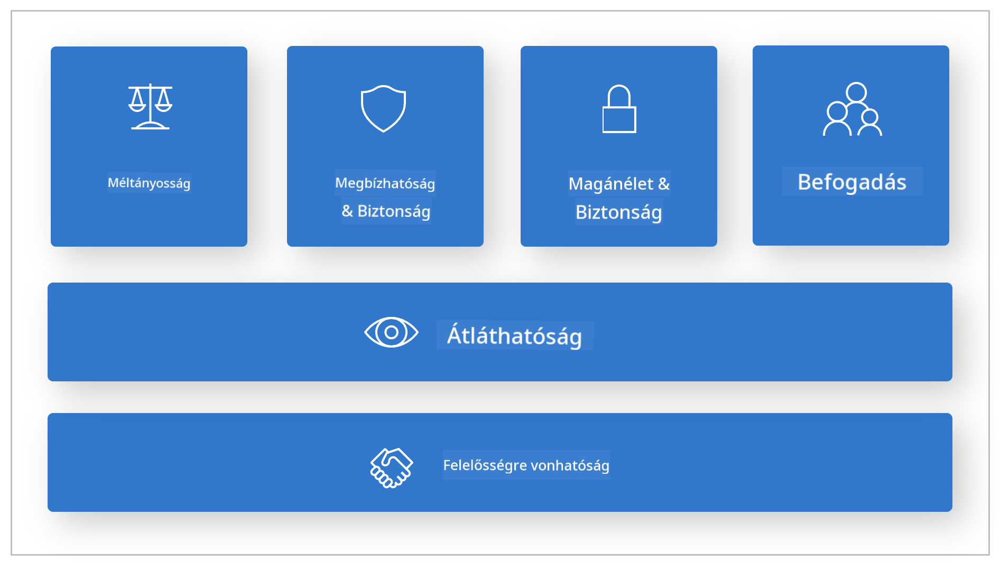

*Kép forrása: [What is Responsible AI?](https://learn.microsoft.com/azure/machine-learning/concept-responsible-ai?view=azureml-api-2&viewFallbackFrom=azureml-api-2%253fwt.mc_id%3Dstudentamb_279723)*

> [!NOTE]
> Ha többet szeretnél megtudni a Microsoft Felelős MI elveiről, látogasd meg a [What is Responsible AI?](https://learn.microsoft.com/azure/machine-learning/concept-responsible-ai?view=azureml-api-2?wt.mc_id=studentamb_279723) oldalt.

#### Biztonsági mérőszámok

Ebben a bemutatóban az Azure AI Foundry biztonsági mérőszámaival értékeled a finomhangolt Phi-3 modell biztonságát. Ezek a mérőszámok segítenek felmérni a modell káros tartalmak generálására való hajlamát és sebezhetőségét jailbreak támadásokkal szemben. A biztonsági mérőszámok a következők:

- **Önkárosító tartalom**: Felméri, hogy a modell hajlamos-e önkárosító tartalmak generálására.
- **Gyűlöletkeltő és méltánytalan tartalom**: Felméri, hogy a modell hajlamos-e gyűlöletkeltő vagy méltánytalan tartalmak előállítására.
- **Erőszakos tartalom**: Felméri, hogy a modell hajlamos-e erőszakos tartalmak generálására.
- **Szexuális tartalom**: Felméri, hogy a modell hajlamos-e nem megfelelő szexuális tartalmak előállítására.

Ezeknek az aspektusoknak az értékelése biztosítja, hogy az AI modell ne generáljon káros vagy sértő tartalmakat, összhangban a társadalmi értékekkel és szabályozási előírásokkal.

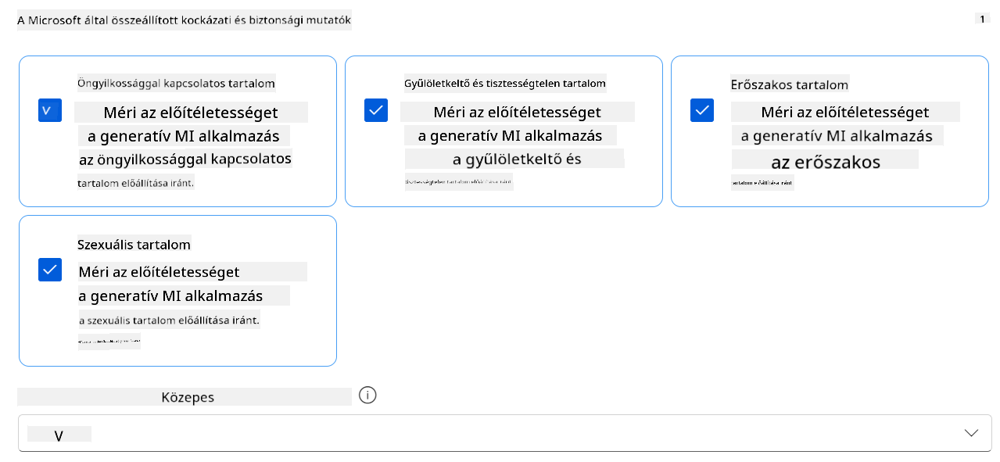

### Bevezetés a teljesítményértékelésbe

Annak érdekében, hogy az AI modell a várakozásoknak megfelelően működjön, fontos értékelni annak teljesítményét a teljesítménymutatók alapján. Az Azure AI Foundry-ban a teljesítményértékelések lehetővé teszik, hogy felmérd a modell hatékonyságát a pontos, releváns és koherens válaszok generálásában.


*Kép forrása: [Evaluation of generative AI applications](https://learn.microsoft.com/azure/ai-studio/concepts/evaluation-approach-gen-ai?wt.mc_id%3Dstudentamb_279723)*

#### Teljesítménymutatók

Ebben a bemutatóban az Azure AI Foundry teljesítménymutatóival értékeled a finomhangolt Phi-3 / Phi-3.5 modell teljesítményét. Ezek a mutatók segítenek felmérni a modell hatékonyságát a pontos, releváns és koherens válaszok generálásában. A teljesítménymutatók a következők:

- **Alapozottság (Groundedness)**: Értékeli, hogy a generált válaszok mennyire felelnek meg a bemeneti forrásból származó információnak.
- **Relevancia**: Értékeli a generált válaszok kérdéshez való illeszkedését.
- **Koherencia**: Értékeli, hogy a generált szöveg mennyire folyékony, természetes és emberi nyelvre hasonlító.
- **Folyékonyság (Fluency)**: Értékeli a generált szöveg nyelvi színvonalát.
- **GPT hasonlóság**: Összehasonlítja a generált választ a valósággal hasonlóság alapján.
- **F1 pontszám**: Kiszámítja a generált válasz és a forrásadatok közös szavainak arányát.

Ezek a mutatók segítenek értékelni a modell hatékonyságát a pontos, releváns és koherens válaszok előállításában.

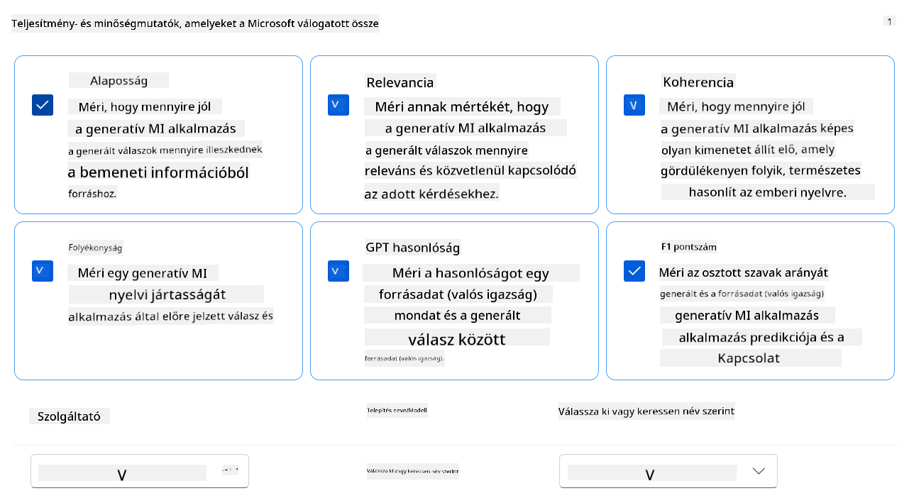

## **2. forgatókönyv: Phi-3 / Phi-3.5 modell értékelése az Azure AI Foundry-ban**

### Mielőtt elkezdenéd

Ez a bemutató a korábbi blogbejegyzések folytatása, a "[Finomhangold és integráld a saját Phi-3 modelleket a Prompt Flow-val: lépésről lépésre útmutató](https://techcommunity.microsoft.com/t5/educator-developer-blog/fine-tune-and-integrate-custom-phi-3-models-with-prompt-flow/ba-p/4178612?wt.mc_id=studentamb_279723)" és a "[Finomhangold és integráld a saját Phi-3 modelleket a Prompt Flow-val az Azure AI Foundry-ban](https://techcommunity.microsoft.com/t5/educator-developer-blog/fine-tune-and-integrate-custom-phi-3-models-with-prompt-flow-in/ba-p/4191726?wt.mc_id=studentamb_279723)" című bejegyzések. Ezekben végigjártuk a Phi-3 / Phi-3.5 modell finomhangolásának és az Azure AI Foundry-ban történő Prompt flow-val való integrálásának folyamatát.

Ebben a bemutatóban egy Azure OpenAI modellt telepítesz értékelőként az Azure AI Foundry-ban, és azt használod a finomhangolt Phi-3 / Phi-3.5 modell értékelésére.

A bemutató megkezdése előtt győződj meg róla, hogy rendelkezel a korábbi bemutatókban leírt következőkkel:

1. Egy előkészített adatállomány a finomhangolt Phi-3 / Phi-3.5 modell értékeléséhez.
1. Egy finomhangolt és Azure Machine Learning-be telepített Phi-3 / Phi-3.5 modell.
1. Egy a finomhangolt Phi-3 / Phi-3.5 modellel integrált Prompt flow az Azure AI Foundry-ban.

> [!NOTE]
> A *test_data.jsonl* fájlt fogod használni, amely az előző blogbejegyzésekben letöltött **ULTRACHAT_200k** adatállomány adatmappájában található, mint a finomhangolt Phi-3 / Phi-3.5 modell értékeléséhez használt adatállomány.

#### Egyedi Phi-3 / Phi-3.5 modell integrálása a Prompt flow-val az Azure AI Foundry-ban (elsőként kód alapú megközelítés)

> [!NOTE]
> Ha a "[Finomhangold és integráld a saját Phi-3 modelleket a Prompt Flow-val az Azure AI Foundry-ban](https://techcommunity.microsoft.com/t5/educator-developer-blog/fine-tune-and-integrate-custom-phi-3-models-with-prompt-flow-in/ba-p/4191726?wt.mc_id=studentamb_279723)" című bejegyzésben leírt alacsony kódolású megközelítést követted, ezt a lépést kihagyhatod és folytathatod a következővel.
> Ha azonban a "[Finomhangold és integráld a saját Phi-3 modelleket a Prompt Flow-val: lépésről lépésre útmutató](https://techcommunity.microsoft.com/t5/educator-developer-blog/fine-tune-and-integrate-custom-phi-3-models-with-prompt-flow/ba-p/4178612?wt.mc_id=studentamb_279723)" című bejegyzésben ismertetett kód-alapú megközelítést követted a Phi-3 / Phi-3.5 modell finomhangolásához és telepítéséhez, akkor a modell Prompt flow-hoz való csatlakoztatásának folyamata kissé eltérő. Ezt a folyamatot ebben a gyakorlatban fogod megtanulni.

A folytatáshoz integrálnod kell a finomhangolt Phi-3 / Phi-3.5 modellt a Prompt flow-ba az Azure AI Foundry-ban.

#### Azure AI Foundry Hub létrehozása

Hubot kell létrehoznod a Projekt létrehozása előtt. A Hub olyan, mint egy Erőforráscsoport, amely lehetővé teszi, hogy több Projektet szervezz és kezelj az Azure AI Foundry-n belül.

1. Jelentkezz be az [Azure AI Foundry](https://ai.azure.com/?wt.mc_id=studentamb_279723) felületre.

1. Válaszd ki a bal oldali menüben az **All hubs** opciót.

1. A
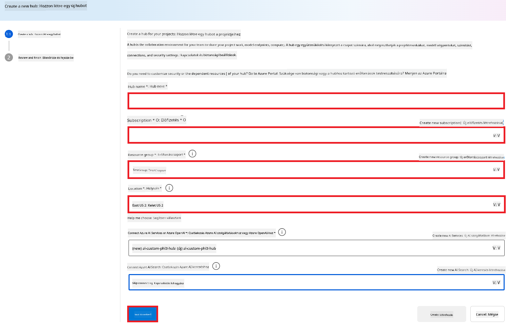

1. Válaszd a **Next** lehetőséget.

#### Azure AI Foundry projekt létrehozása

1. A létrehozott Hubban válaszd az **All projects** menüpontot a bal oldali fülön.

1. A navigációs menüből válaszd a **+ New project** lehetőséget.

    

1. Add meg a **Project name**-et. Ez egy egyedi érték kell legyen.

    

1. Válaszd a **Create a project** lehetőséget.

#### Egyedi kapcsolat hozzáadása a finomhangolt Phi-3 / Phi-3.5 modellhez

Ahhoz, hogy az egyedi Phi-3 / Phi-3.5 modelledet integráld a Prompt flow-val, el kell mentened a modell végpontját és kulcsát egy egyedi kapcsolatban. Ez biztosítja, hogy a Prompt flow hozzáférjen az egyedi Phi-3 / Phi-3.5 modellhez.

#### Állítsd be a finomhangolt Phi-3 / Phi-3.5 modell api kulcsát és végpont URI-ját

1. Látogass el az [Azure ML Studio](https://ml.azure.com/home?wt.mc_id=studentamb_279723) oldalra.

1. Navigálj a létrehozott Azure Machine Learning munkaterületre.

1. Válaszd az **Endpoints** menüpontot a bal oldali fülön.

    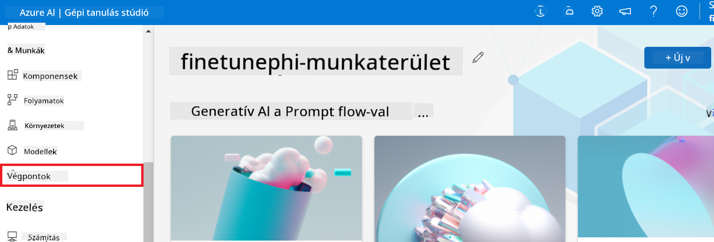

1. Válaszd ki a létrehozott végpontot.

    

1. A navigációs menüből válaszd a **Consume** lehetőséget.

1. Másold ki a **REST endpoint** és a **Primary key** értékeket.

    

#### Egyedi kapcsolat hozzáadása

1. Látogass el az [Azure AI Foundry](https://ai.azure.com/?wt.mc_id=studentamb_279723) oldalra.

1. Navigálj a létrehozott Azure AI Foundry projekthez.

1. A projektben válaszd a bal oldali fülön a **Settings** menüpontot.

1. Válaszd a **+ New connection** lehetőséget.

    

1. A navigációs menüből válaszd a **Custom keys** lehetőséget.

    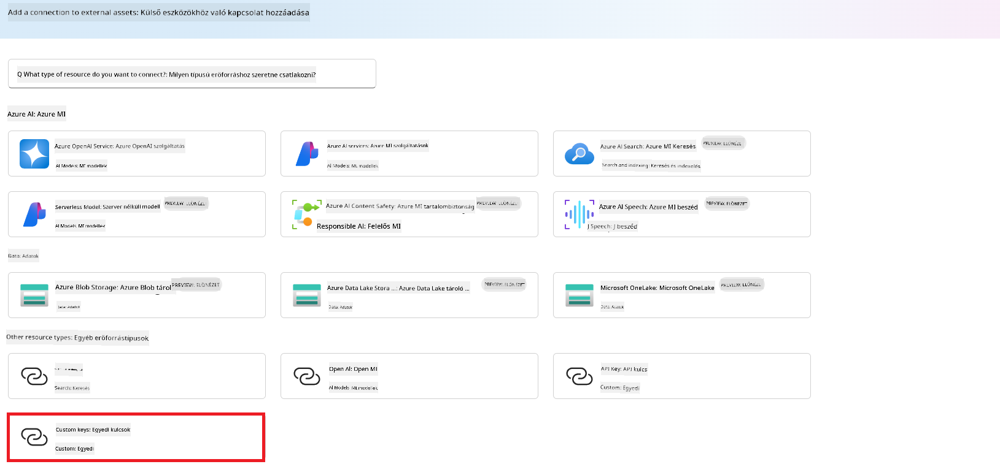

1. Hajtsd végre a következő lépéseket:

    - Válaszd a **+ Add key value pairs** lehetőséget.
    - A kulcs neve legyen **endpoint**, és illeszd be az Azure ML Studio-ból kimásolt végpontot az érték mezőbe.
    - Ismét válaszd a **+ Add key value pairs** lehetőséget.
    - A kulcs neve legyen **key**, és illeszd be az Azure ML Studio-ból kimásolt kulcsot az érték mezőbe.
    - A kulcsok hozzáadása után jelöld be az **is secret** opciót, hogy a kulcs ne legyen látható.

    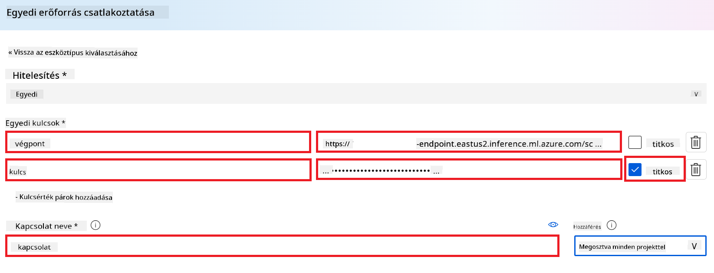

1. Válaszd az **Add connection** lehetőséget.

#### Prompt flow létrehozása

Hozzáadtál egy egyedi kapcsolatot az Azure AI Foundry-ban. Most hozzunk létre egy Prompt flow-t a következő lépésekkel. Ezután összekapcsolod a Prompt flow-t az egyedi kapcsolattal, hogy a finomhangolt modellt használni tudd a Prompt flow-n belül.

1. Navigálj a létrehozott Azure AI Foundry projekthez.

1. Válaszd a bal oldali fülön a **Prompt flow** menüpontot.

1. A navigációs menüből válaszd a **+ Create** lehetőséget.

    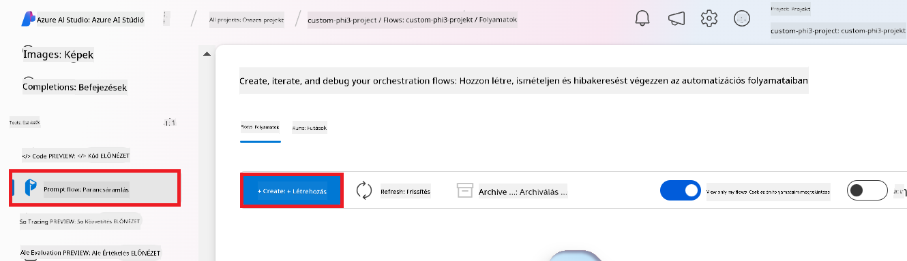

1. A navigációs menüből válaszd a **Chat flow** lehetőséget.

    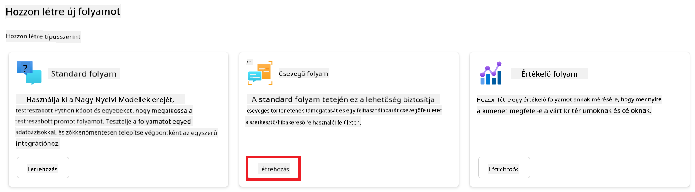

1. Add meg a használni kívánt **Folder name**-et.

    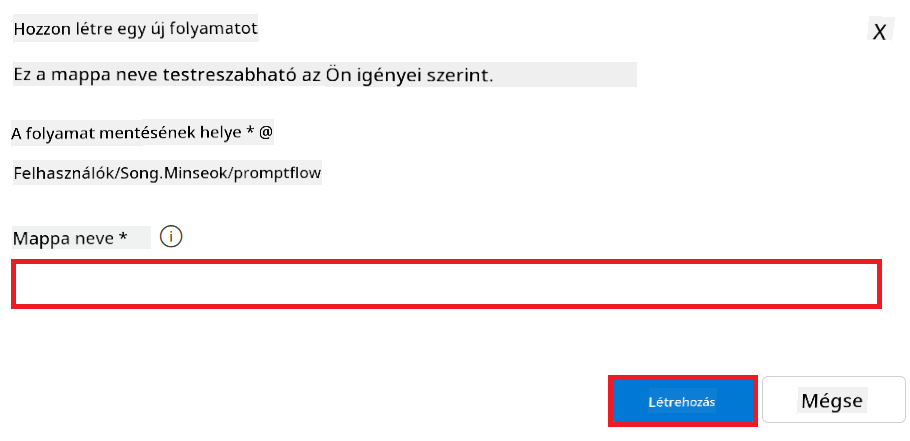

1. Válaszd a **Create** lehetőséget.

#### Állítsd be a Prompt flow-t, hogy chatelni tudj az egyedi Phi-3 / Phi-3.5 modelleddel

Integrálnod kell a finomhangolt Phi-3 / Phi-3.5 modellt a Prompt flow-ba. Az alapértelmezett Prompt flow azonban nem erre a célra készült, ezért újra kell tervezned a Prompt flow-t, hogy lehetővé tedd az egyedi modell integrációját.

1. A Prompt flow-ban végezd el az alábbi lépéseket a meglévő folyamat újraépítéséhez:

    - Válaszd a **Raw file mode**-ot.
    - Töröld az összes meglévő kódot a *flow.dag.yml* fájlból.
    - Illeszd be a következő kódot a *flow.dag.yml* fájlba.

        ```yml
        inputs:
          input_data:
            type: string
            default: "Who founded Microsoft?"

        outputs:
          answer:
            type: string
            reference: ${integrate_with_promptflow.output}

        nodes:
        - name: integrate_with_promptflow
          type: python
          source:
            type: code
            path: integrate_with_promptflow.py
          inputs:
            input_data: ${inputs.input_data}
        ```

    - Válaszd a **Save** lehetőséget.

    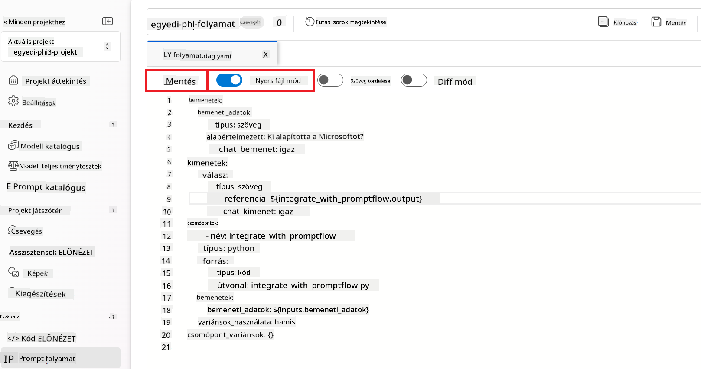

1. Illeszd be a következő kódot az *integrate_with_promptflow.py* fájlba, hogy a Prompt flow-ban használd az egyedi Phi-3 / Phi-3.5 modellt.

    ```python
    import logging
    import requests
    from promptflow import tool
    from promptflow.connections import CustomConnection

    # Logging setup
    logging.basicConfig(
        format="%(asctime)s - %(levelname)s - %(name)s - %(message)s",
        datefmt="%Y-%m-%d %H:%M:%S",
        level=logging.DEBUG
    )
    logger = logging.getLogger(__name__)

    def query_phi3_model(input_data: str, connection: CustomConnection) -> str:
        """
        Send a request to the Phi-3 / Phi-3.5 model endpoint with the given input data using Custom Connection.
        """

        # "connection" is the name of the Custom Connection, "endpoint", "key" are the keys in the Custom Connection
        endpoint_url = connection.endpoint
        api_key = connection.key

        headers = {
            "Content-Type": "application/json",
            "Authorization": f"Bearer {api_key}"
        }
    data = {
        "input_data": [input_data],
        "params": {
            "temperature": 0.7,
            "max_new_tokens": 128,
            "do_sample": True,
            "return_full_text": True
            }
        }
        try:
            response = requests.post(endpoint_url, json=data, headers=headers)
            response.raise_for_status()
            
            # Log the full JSON response
            logger.debug(f"Full JSON response: {response.json()}")

            result = response.json()["output"]
            logger.info("Successfully received response from Azure ML Endpoint.")
            return result
        except requests.exceptions.RequestException as e:
            logger.error(f"Error querying Azure ML Endpoint: {e}")
            raise

    @tool
    def my_python_tool(input_data: str, connection: CustomConnection) -> str:
        """
        Tool function to process input data and query the Phi-3 / Phi-3.5 model.
        """
        return query_phi3_model(input_data, connection)

    ```

    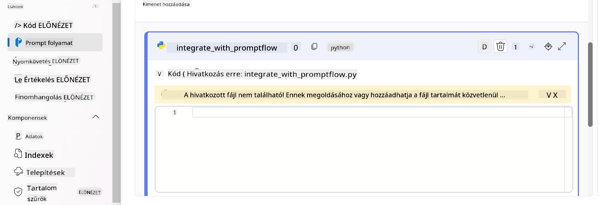

> [!NOTE]
> Részletesebb információkért az Azure AI Foundry-ban történő Prompt flow használatáról lásd a [Prompt flow in Azure AI Foundry](https://learn.microsoft.com/azure/ai-studio/how-to/prompt-flow) dokumentációt.

1. Válaszd a **Chat input** és **Chat output** opciókat, hogy engedélyezd a chatelést a modelleddel.

    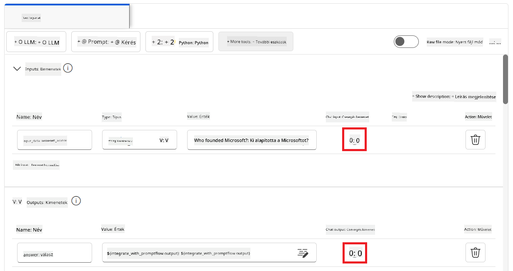

1. Most készen állsz arra, hogy chatelj az egyedi Phi-3 / Phi-3.5 modelleddel. A következő gyakorlatban megtanulod, hogyan indítsd el a Prompt flow-t, és hogyan használd a finomhangolt modelleddel való chateléshez.

> [!NOTE]
>
> Az újraépített folyamatnak az alábbi képhez hasonlónak kell lennie:
>
> 
>

#### Prompt flow indítása

1. Válaszd a **Start compute sessions** lehetőséget a Prompt flow elindításához.

    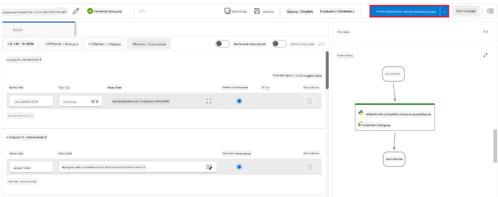

1. Válaszd a **Validate and parse input** lehetőséget a paraméterek frissítéséhez.

    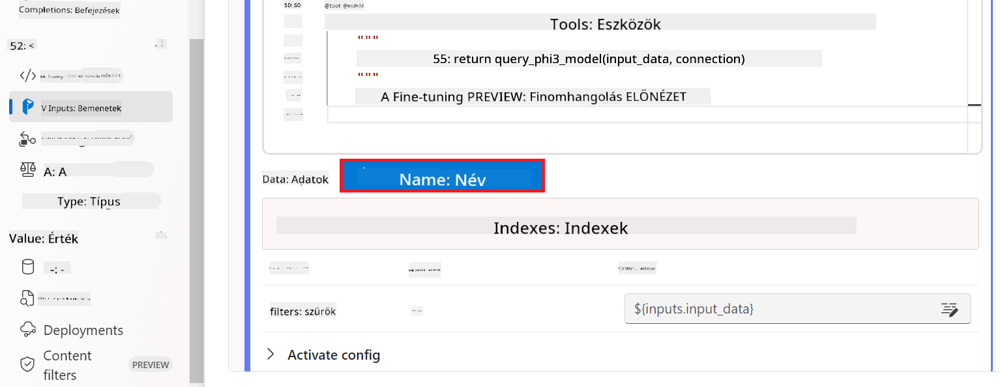

1. Válaszd ki a **Value** mezőt a létrehozott egyedi kapcsolathoz. Például *connection*.

    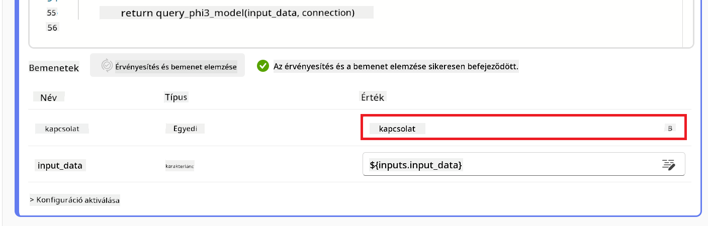

#### Chat az egyedi Phi-3 / Phi-3.5 modelleddel

1. Válaszd a **Chat** lehetőséget.

    

1. Íme egy példa az eredményekre: Most már chatelhetsz az egyedi Phi-3 / Phi-3.5 modelleddel. Ajánlott olyan kérdéseket feltenni, amelyek a finomhangoláshoz használt adatokon alapulnak.

    

### Azure OpenAI telepítése a Phi-3 / Phi-3.5 modell értékeléséhez

Ahhoz, hogy értékeld a Phi-3 / Phi-3.5 modellt az Azure AI Foundry-ban, telepítened kell egy Azure OpenAI modellt. Ezt a modellt fogod használni a Phi-3 / Phi-3.5 modell teljesítményének értékelésére.

#### Azure OpenAI telepítése

1. Jelentkezz be az [Azure AI Foundry](https://ai.azure.com/?wt.mc_id=studentamb_279723) oldalra.

1. Navigálj a létrehozott Azure AI Foundry projekthez.

    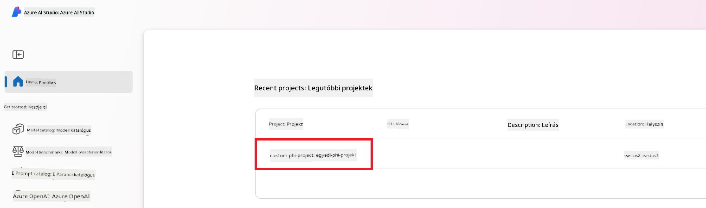

1. A projektben válaszd a bal oldali fülön a **Deployments** menüpontot.

1. A navigációs menüből válaszd a **+ Deploy model** lehetőséget.

1. Válaszd a **Deploy base model** lehetőséget.

    

1. Válaszd ki az Azure OpenAI modellt, amit használni szeretnél. Például **gpt-4o**.

    

1. Válaszd a **Confirm** lehetőséget.

### A finomhangolt Phi-3 / Phi-3.5 modell értékelése az Azure AI Foundry Prompt flow értékelőjével

### Új értékelés indítása

1. Látogass el az [Azure AI Foundry](https://ai.azure.com/?wt.mc_id=studentamb_279723) oldalra.

1. Navigálj a létrehozott Azure AI Foundry projekthez.

    

1. A projektben válaszd a bal oldali fülön az **Evaluation** menüpontot.

1. A navigációs menüből válaszd a **+ New evaluation** lehetőséget.
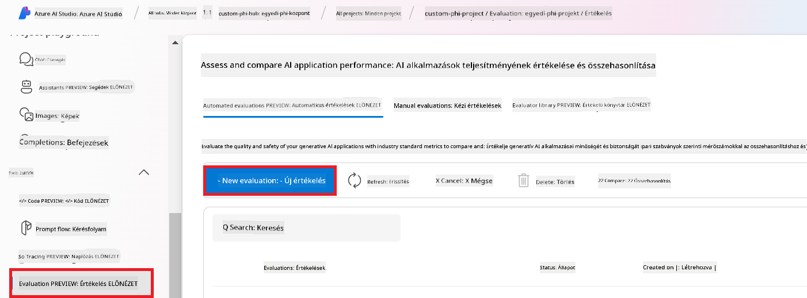

1. Válassza ki a **Prompt flow** értékelést.

    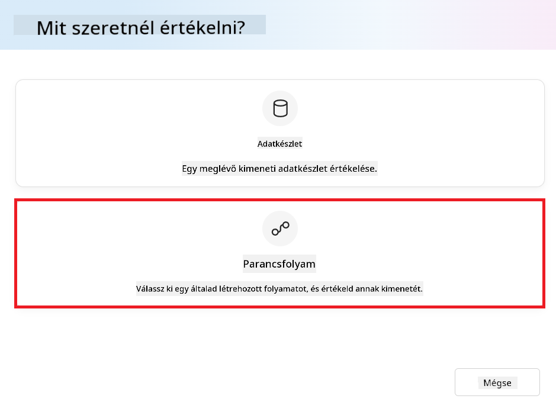

1. Végezze el a következő lépéseket:

    - Adja meg az értékelés nevét. Egyedi értéknek kell lennie.
    - Válassza a **Question and answer without context** feladattípust. Ez azért fontos, mert a jelen bemutatóban használt **UlTRACHAT_200k** adatbázis nem tartalmaz kontextust.
    - Válassza ki a kiértékelni kívánt prompt flow-t.

    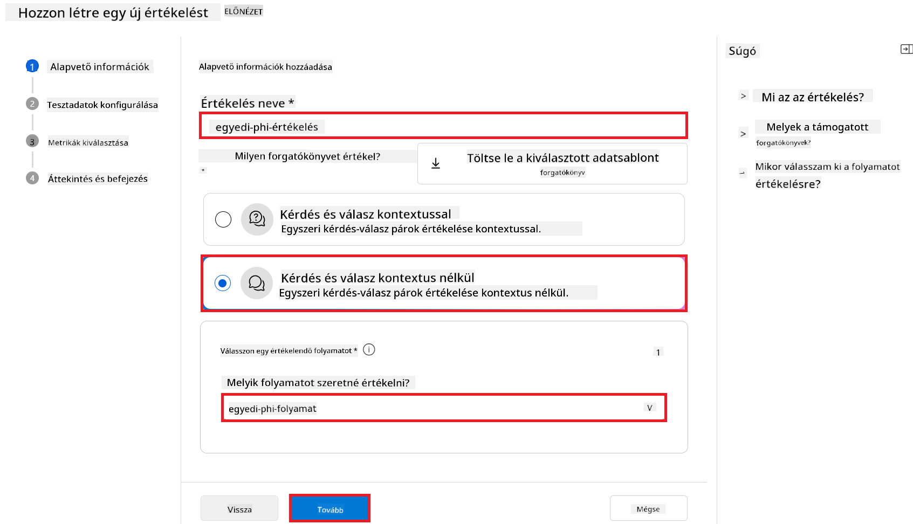

1. Válassza a **Next** gombot.

1. Végezze el a következő lépéseket:

    - Válassza az **Add your dataset** lehetőséget az adatkészlet feltöltéséhez. Például feltöltheti a tesztadatokat tartalmazó fájlt, például a *test_data.json1*-et, amely a **ULTRACHAT_200k** adatbázis letöltésekor elérhető.
    - Válassza ki az adatkészletének megfelelő **Dataset column** oszlopot. Például, ha a **ULTRACHAT_200k** adatbázist használja, válassza a **${data.prompt}** oszlopot.

    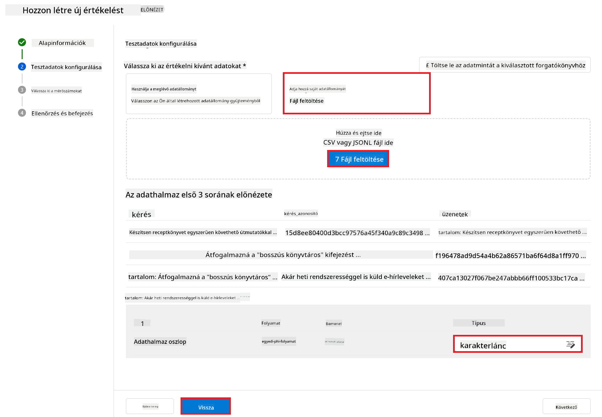

1. Válassza a **Next** gombot.

1. Végezze el a teljesítmény- és minőségi mutatók beállítását:

    - Válassza ki a használni kívánt teljesítmény- és minőségi mutatókat.
    - Válassza ki az értékeléshez létrehozott Azure OpenAI modellt. Például válassza a **gpt-4o** modellt.

    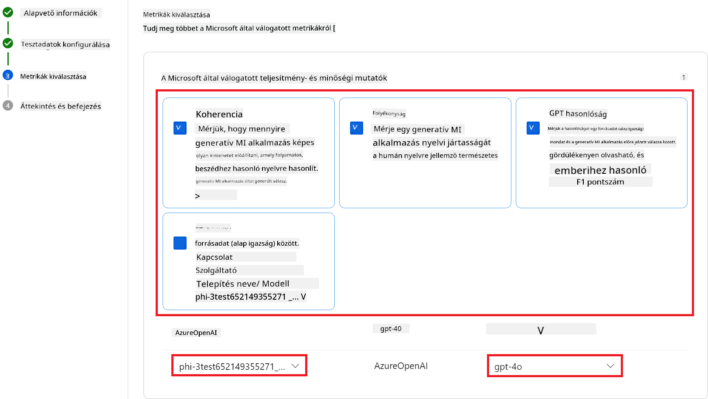

1. Végezze el a kockázat- és biztonsági mutatók beállítását:

    - Válassza ki a használni kívánt kockázat- és biztonsági mutatókat.
    - Válassza ki a hibaarány számításához használandó küszöbértéket. Például válassza a **Medium** értéket.
    - A **question** esetén állítsa be az adatforrást **{$data.prompt}**-re.
    - A **answer** esetén állítsa be az adatforrást **{$run.outputs.answer}**-re.
    - A **ground_truth** esetén állítsa be az adatforrást **{$data.message}**-re.

    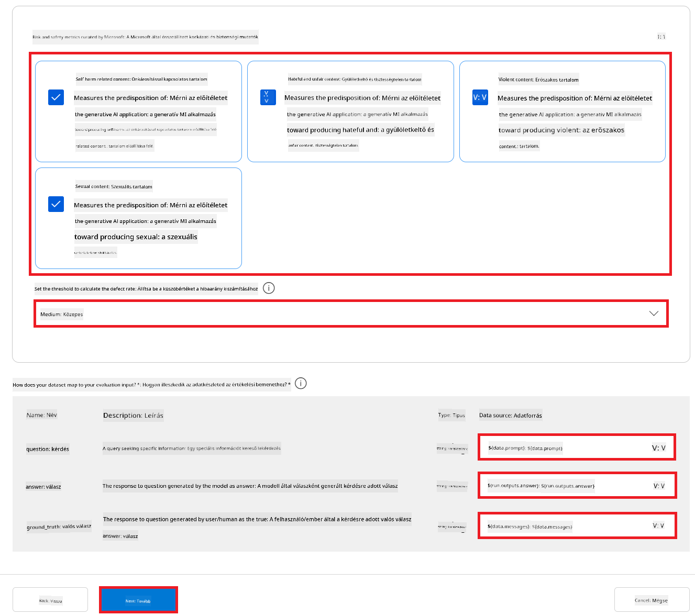

1. Válassza a **Next** gombot.

1. Válassza a **Submit** gombot az értékelés elindításához.

1. Az értékelés némi időt vesz igénybe. Az előrehaladást az **Evaluation** fülön követheti nyomon.

### Az értékelési eredmények áttekintése

> [!NOTE]
> Az alábbi eredmények az értékelési folyamat bemutatását szolgálják. Ebben a bemutatóban egy viszonylag kis adatbázison finomhangolt modellt használtunk, ami kevésbé optimális eredményekhez vezethet. A tényleges eredmények jelentősen eltérhetnek az adatbázis méretétől, minőségétől, sokszínűségétől, valamint a modell konkrét beállításaitól függően.

Az értékelés befejezése után áttekintheti az eredményeket mind a teljesítmény-, mind a biztonsági mutatók tekintetében.

1. Teljesítmény- és minőségi mutatók:

    - Értékelje a modell hatékonyságát abban, hogy összefüggő, folyékony és releváns válaszokat generáljon.

    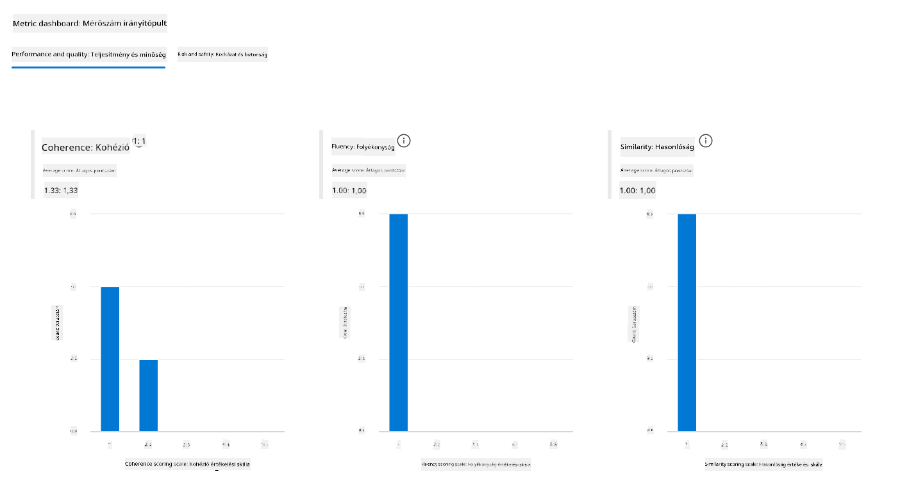

1. Kockázat- és biztonsági mutatók:

    - Biztosítsa, hogy a modell kimenetei biztonságosak legyenek, és megfeleljenek a Responsible AI elveknek, elkerülve bármilyen káros vagy sértő tartalmat.

    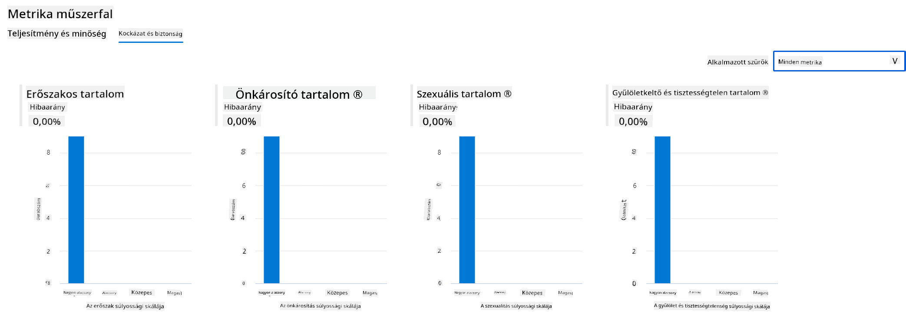

1. Görgessen lejjebb a **Detailed metrics result** megtekintéséhez.

    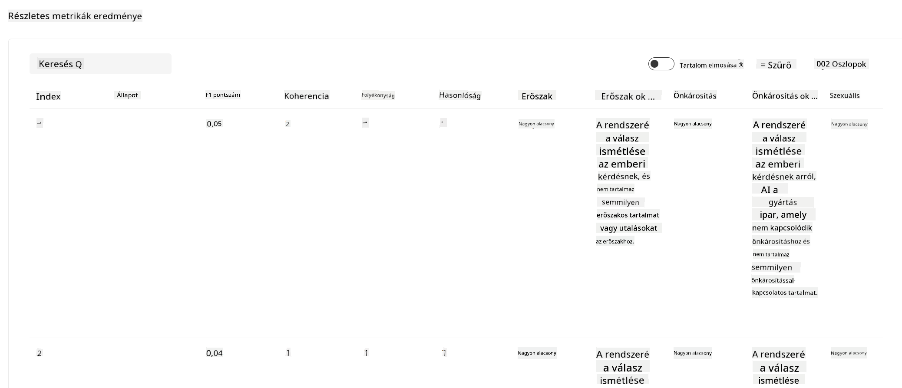

1. A saját Phi-3 / Phi-3.5 modell teljesítmény- és biztonsági mutatók szerinti értékelésével megerősítheti, hogy a modell nemcsak hatékony, hanem a felelős AI gyakorlatoknak is megfelel, így készen áll a valós környezetben való alkalmazásra.

## Gratulálunk!

### Befejezte ezt a bemutatót

Sikeresen értékelte az Azure AI Foundry-ba integrált, finomhangolt Phi-3 modellt Prompt flow segítségével. Ez fontos lépés annak biztosításában, hogy AI modelljei ne csak jól teljesítsenek, hanem megfeleljenek a Microsoft Responsible AI alapelveinek, így megbízható és hiteles AI alkalmazásokat építhet.


## Azure erőforrások törlése

Törölje az Azure erőforrásait, hogy elkerülje a további díjakat. Lépjen be az Azure portálra, és törölje az alábbi erőforrásokat:

- Az Azure Machine Learning erőforrást.
- Az Azure Machine Learning modell végpontot.
- Az Azure AI Foundry Project erőforrást.
- Az Azure AI Foundry Prompt flow erőforrást.

### Következő lépések

#### Dokumentáció

- [Assess AI systems by using the Responsible AI dashboard](https://learn.microsoft.com/azure/machine-learning/concept-responsible-ai-dashboard?view=azureml-api-2&source=recommendations?wt.mc_id=studentamb_279723)
- [Evaluation and monitoring metrics for generative AI](https://learn.microsoft.com/azure/ai-studio/concepts/evaluation-metrics-built-in?tabs=definition?wt.mc_id=studentamb_279723)
- [Azure AI Foundry documentation](https://learn.microsoft.com/azure/ai-studio/?wt.mc_id=studentamb_279723)
- [Prompt flow documentation](https://microsoft.github.io/promptflow/?wt.mc_id=studentamb_279723)

#### Oktatási anyagok

- [Introduction to Microsoft's Responsible AI Approach](https://learn.microsoft.com/training/modules/introduction-to-microsofts-responsible-ai-approach/?source=recommendations?wt.mc_id=studentamb_279723)
- [Introduction to Azure AI Foundry](https://learn.microsoft.com/training/modules/introduction-to-azure-ai-studio/?wt.mc_id=studentamb_279723)

### Hivatkozások

- [What is Responsible AI?](https://learn.microsoft.com/azure/machine-learning/concept-responsible-ai?view=azureml-api-2?wt.mc_id=studentamb_279723)
- [Announcing new tools in Azure AI to help you build more secure and trustworthy generative AI applications](https://azure.microsoft.com/blog/announcing-new-tools-in-azure-ai-to-help-you-build-more-secure-and-trustworthy-generative-ai-applications/?wt.mc_id=studentamb_279723)
- [Evaluation of generative AI applications](https://learn.microsoft.com/azure/ai-studio/concepts/evaluation-approach-gen-ai?wt.mc_id%3Dstudentamb_279723)

**Nyilatkozat:**  
Ezt a dokumentumot az AI fordító szolgáltatás, a [Co-op Translator](https://github.com/Azure/co-op-translator) segítségével fordítottuk. Bár a pontosságra törekszünk, kérjük, vegye figyelembe, hogy az automatikus fordítások tartalmazhatnak hibákat vagy pontatlanságokat. Az eredeti dokumentum az anyanyelvén tekintendő hiteles forrásnak. Fontos információk esetén szakmai, emberi fordítást javaslunk. Nem vállalunk felelősséget a fordítás használatából eredő félreértésekért vagy téves értelmezésekért.