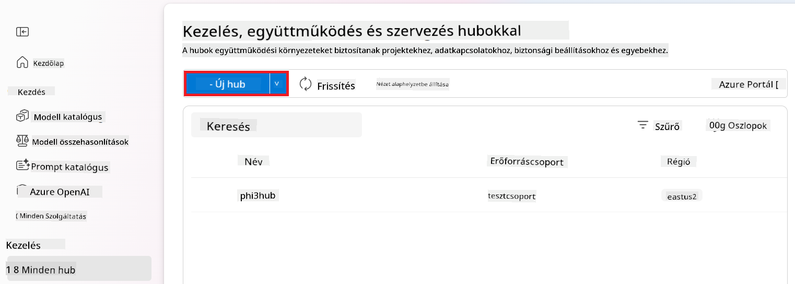

<!--
CO_OP_TRANSLATOR_METADATA:
{
  "original_hash": "80a853c08e4ee25ef9b4bfcedd8990da",
  "translation_date": "2025-07-16T23:51:39+00:00",
  "source_file": "md/02.Application/01.TextAndChat/Phi3/E2E_Phi-3-Evaluation_AIFoundry.md",
  "language_code": "hu"
}
-->
# Finomhangolt Phi-3 / Phi-3.5 modell értékelése az Azure AI Foundry-ban, a Microsoft Felelős MI elveire fókuszálva

Ez az end-to-end (E2E) példa a Microsoft Tech Community "[Evaluate Fine-tuned Phi-3 / 3.5 Models in Azure AI Foundry Focusing on Microsoft's Responsible AI](https://techcommunity.microsoft.com/blog/educatordeveloperblog/evaluate-fine-tuned-phi-3--3-5-models-in-azure-ai-studio-focusing-on-microsofts-/4227850?WT.mc_id=aiml-137032-kinfeylo)" útmutatóján alapul.

## Áttekintés

### Hogyan értékelheted a finomhangolt Phi-3 / Phi-3.5 modell biztonságát és teljesítményét az Azure AI Foundry-ban?

Egy modell finomhangolása néha nem kívánt vagy váratlan válaszokat eredményezhet. Annak érdekében, hogy a modell biztonságos és hatékony maradjon, fontos értékelni a káros tartalom generálására való hajlamát, valamint a pontos, releváns és koherens válaszok előállításának képességét. Ebben a bemutatóban megtanulod, hogyan értékelheted a finomhangolt Phi-3 / Phi-3.5 modellt, amely a Prompt flow-val integrálva működik az Azure AI Foundry-ban.

Íme az Azure AI Foundry értékelési folyamata.


*Kép forrása: [Evaluation of generative AI applications](https://learn.microsoft.com/azure/ai-studio/concepts/evaluation-approach-gen-ai?wt.mc_id%3Dstudentamb_279723)*

> [!NOTE]
>
> Részletesebb információkért és további forrásokért a Phi-3 / Phi-3.5 modellekről látogasd meg a [Phi-3CookBook](https://github.com/microsoft/Phi-3CookBook?wt.mc_id=studentamb_279723) oldalt.

### Előfeltételek

- [Python](https://www.python.org/downloads)
- [Azure előfizetés](https://azure.microsoft.com/free?wt.mc_id=studentamb_279723)
- [Visual Studio Code](https://code.visualstudio.com)
- Finomhangolt Phi-3 / Phi-3.5 modell

### Tartalomjegyzék

1. [**1. forgatókönyv: Bevezetés az Azure AI Foundry Prompt flow értékelésébe**](../../../../../../md/02.Application/01.TextAndChat/Phi3)

    - [Bevezetés a biztonsági értékelésbe](../../../../../../md/02.Application/01.TextAndChat/Phi3)
    - [Bevezetés a teljesítményértékelésbe](../../../../../../md/02.Application/01.TextAndChat/Phi3)

1. [**2. forgatókönyv: Phi-3 / Phi-3.5 modell értékelése az Azure AI Foundry-ban**](../../../../../../md/02.Application/01.TextAndChat/Phi3)

    - [Mielőtt elkezdenéd](../../../../../../md/02.Application/01.TextAndChat/Phi3)
    - [Azure OpenAI telepítése a Phi-3 / Phi-3.5 modell értékeléséhez](../../../../../../md/02.Application/01.TextAndChat/Phi3)
    - [Finomhangolt Phi-3 / Phi-3.5 modell értékelése az Azure AI Foundry Prompt flow értékelésével](../../../../../../md/02.Application/01.TextAndChat/Phi3)

1. [Gratulálunk!](../../../../../../md/02.Application/01.TextAndChat/Phi3)

## **1. forgatókönyv: Bevezetés az Azure AI Foundry Prompt flow értékelésébe**

### Bevezetés a biztonsági értékelésbe

Annak érdekében, hogy az MI modell etikus és biztonságos legyen, elengedhetetlen, hogy a Microsoft Felelős MI elvei alapján értékeljük. Az Azure AI Foundry-ban a biztonsági értékelések lehetővé teszik, hogy felmérd a modell sebezhetőségét a jailbreak támadásokkal szemben, valamint a káros tartalom generálásának kockázatát, ami közvetlenül összhangban áll ezekkel az elvekkel.


*Kép forrása: [Evaluation of generative AI applications](https://learn.microsoft.com/azure/ai-studio/concepts/evaluation-approach-gen-ai?wt.mc_id%3Dstudentamb_279723)*

#### A Microsoft Felelős MI elvei

A technikai lépések megkezdése előtt fontos megérteni a Microsoft Felelős MI elveit, amelyek egy etikai keretrendszert alkotnak az MI rendszerek felelős fejlesztéséhez, bevezetéséhez és működtetéséhez. Ezek az elvek irányt mutatnak az MI rendszerek felelős tervezéséhez, fejlesztéséhez és bevezetéséhez, biztosítva, hogy az MI technológiák igazságosak, átláthatóak és befogadóak legyenek. Ezek az elvek képezik az MI modellek biztonságának értékelésének alapját.

A Microsoft Felelős MI elvei a következők:

- **Igazságosság és befogadás**: Az MI rendszereknek mindenkit igazságosan kell kezelniük, és el kell kerülniük, hogy hasonló helyzetben lévő csoportokat eltérően érintsenek. Például, amikor az MI rendszerek orvosi kezelési tanácsokat, hitelkérelmeket vagy állásajánlatokat adnak, ugyanazokat a javaslatokat kell adniuk mindenkinek, akinek hasonló tünetei, pénzügyi helyzete vagy szakmai képesítései vannak.

- **Megbízhatóság és biztonság**: A bizalom kiépítéséhez elengedhetetlen, hogy az MI rendszerek megbízhatóan, biztonságosan és következetesen működjenek. Ezeknek a rendszereknek képesnek kell lenniük arra, hogy az eredeti tervek szerint működjenek, biztonságosan reagáljanak váratlan helyzetekre, és ellenálljanak káros manipulációnak. Viselkedésük és a kezelhető helyzetek köre tükrözi a fejlesztők által a tervezés és tesztelés során előre látott szituációkat.

- **Átláthatóság**: Amikor az MI rendszerek olyan döntések meghozatalában segítenek, amelyek jelentős hatással vannak az emberek életére, elengedhetetlen, hogy az emberek megértsék, hogyan születtek ezek a döntések. Például egy bank MI rendszert használhat annak eldöntésére, hogy valaki hitelképes-e. Egy cég MI rendszert alkalmazhat a legalkalmasabb jelöltek kiválasztására.

- **Adatvédelem és biztonság**: Az MI egyre elterjedtebbé válásával az adatvédelem és az üzleti, valamint személyes információk védelme egyre fontosabbá és összetettebbé válik. Az MI esetében az adatvédelem és az adatbiztonság különös figyelmet igényel, mert az adatokhoz való hozzáférés elengedhetetlen ahhoz, hogy az MI rendszerek pontos és megalapozott előrejelzéseket és döntéseket hozzanak az emberekről.

- **Felelősségre vonhatóság**: Az MI rendszerek tervezőinek és bevezetőinek felelősséget kell vállalniuk a rendszereik működéséért. A szervezeteknek iparági szabványokra kell támaszkodniuk a felelősségre vonhatóság normáinak kialakításához. Ezek a normák biztosíthatják, hogy az MI rendszerek ne legyenek az utolsó döntéshozók olyan ügyekben, amelyek emberek életét érintik. Emellett biztosíthatják, hogy az emberek megőrizzék a jelentős kontrollt a nagymértékben autonóm MI rendszerek felett.


*Kép forrása: [What is Responsible AI?](https://learn.microsoft.com/azure/machine-learning/concept-responsible-ai?view=azureml-api-2&viewFallbackFrom=azureml-api-2%253fwt.mc_id%3Dstudentamb_279723)*

> [!NOTE]
> A Microsoft Felelős MI elveiről további információkért látogasd meg a [What is Responsible AI?](https://learn.microsoft.com/azure/machine-learning/concept-responsible-ai?view=azureml-api-2?wt.mc_id=studentamb_279723) oldalt.

#### Biztonsági mutatók

Ebben a bemutatóban az Azure AI Foundry biztonsági mutatóit használva értékeled a finomhangolt Phi-3 modell biztonságát. Ezek a mutatók segítenek felmérni a modell káros tartalom generálására való hajlamát és a jailbreak támadásokkal szembeni sebezhetőségét. A biztonsági mutatók a következők:

- **Önkárosító tartalom**: Felméri, hogy a modell hajlamos-e önkárosító tartalmak előállítására.
- **Gyűlöletkeltő és igazságtalan tartalom**: Felméri, hogy a modell hajlamos-e gyűlöletkeltő vagy igazságtalan tartalmak generálására.
- **Erőszakos tartalom**: Felméri, hogy a modell hajlamos-e erőszakos tartalmak előállítására.
- **Szexuális tartalom**: Felméri, hogy a modell hajlamos-e nem megfelelő szexuális tartalmak generálására.

Ezeknek a szempontoknak az értékelése biztosítja, hogy az MI modell ne állítson elő káros vagy sértő tartalmat, összhangban a társadalmi értékekkel és a szabályozási előírásokkal.


### Bevezetés a teljesítményértékelésbe

Annak érdekében, hogy az MI modell a várakozásoknak megfelelően működjön, fontos a teljesítményének értékelése a teljesítménymutatók alapján. Az Azure AI Foundry-ban a teljesítményértékelések lehetővé teszik, hogy felmérd a modell hatékonyságát a pontos, releváns és koherens válaszok generálásában.


*Kép forrása: [Evaluation of generative AI applications](https://learn.microsoft.com/azure/ai-studio/concepts/evaluation-approach-gen-ai?wt.mc_id%3Dstudentamb_279723)*

#### Teljesítménymutatók

Ebben a bemutatóban az Azure AI Foundry teljesítménymutatóit használva értékeled a finomhangolt Phi-3 / Phi-3.5 modell teljesítményét. Ezek a mutatók segítenek felmérni a modell hatékonyságát a pontos, releváns és koherens válaszok előállításában. A teljesítménymutatók a következők:

- **Alapozottság (Groundedness)**: Értékeli, hogy a generált válaszok mennyire illeszkednek az input forrásból származó információkhoz.
- **Relevancia**: Értékeli a generált válaszok kérdéshez való illeszkedését.
- **Koherencia**: Értékeli, hogy a generált szöveg mennyire folyékony, természetes olvasású és emberi nyelvre emlékeztető.
- **Folyékonyság (Fluency)**: Értékeli a generált szöveg nyelvi színvonalát.
- **GPT hasonlóság**: Összehasonlítja a generált választ a valósággal a hasonlóság szempontjából.
- **F1 pontszám**: Kiszámolja a generált válasz és a forrásadatok közös szavainak arányát.

Ezek a mutatók segítenek értékelni a modell hatékonyságát a pontos, releváns és koherens válaszok előállításában.


## **2. forgatókönyv: Phi-3 / Phi-3.5 modell értékelése az Azure AI Foundry-ban**

### Mielőtt elkezdenéd

Ez a bemutató a korábbi blogbejegyzések, a "[Fine-Tune and Integrate Custom Phi-3 Models with Prompt Flow: Step-by-Step Guide](https://techcommunity.microsoft.com/t5/educator-developer-blog/fine-tune-and-integrate-custom-phi-3-models-with-prompt-flow/ba-p/4178612?wt.mc_id=studentamb_279723)" és a "[Fine-Tune and Integrate Custom Phi-3 Models with Prompt Flow in Azure AI Foundry](https://techcommunity.microsoft.com/t5/educator-developer-blog/fine-tune-and-integrate-custom-phi-3-models-with-prompt-flow-in/ba-p/4191726?wt.mc_id=studentamb_279723)" folytatása. Ezekben a bejegyzésekben végigvezettünk a Phi-3 / Phi-3.5 modell finomhangolásának és az Azure AI Foundry-ban a Prompt flow-val való integrálásának folyamatán.

Ebben a bemutatóban egy Azure OpenAI modellt telepítesz értékelőként az Azure AI Foundry-ban, és ezt használod a finomhangolt Phi-3 / Phi-3.5 modell értékelésére.

A bemutató megkezdése előtt győződj meg róla, hogy rendelkezel a korábbi bemutatókban leírt következő előfeltételekkel:

1. Egy előkészített adatállomány a finomhangolt Phi-3 / Phi-3.5 modell értékeléséhez.
1. Egy finomhangolt és az Azure Machine Learning-be telepített Phi-3 / Phi-3.5 modell.
1. Egy a finomhangolt Phi-3 / Phi-3.5 modellel integrált Prompt flow az Azure AI Foundry-ban.

> [!NOTE]
> A finomhangolt Phi-3 / Phi-3.5 modell értékeléséhez a korábbi blogbejegyzésekből letöltött **ULTRACHAT_200k** adatállomány *data* mappájában található *test_data.jsonl* fájlt fogod használni.

#### Egyedi Phi-3 / Phi-3.5 modell integrálása a Prompt flow-val az Azure AI Foundry-ban (kód alapú megközelítés)
> [!NOTE]
> Ha a "[Fine-Tune and Integrate Custom Phi-3 Models with Prompt Flow in Azure AI Foundry](https://techcommunity.microsoft.com/t5/educator-developer-blog/fine-tune-and-integrate-custom-phi-3-models-with-prompt-flow-in/ba-p/4191726?wt.mc_id=studentamb_279723)" című anyagban ismertetett alacsony kódolású megközelítést követted, ezt a feladatot kihagyhatod, és folytathatsz a következővel.
> Azonban, ha a "[Fine-Tune and Integrate Custom Phi-3 Models with Prompt Flow: Step-by-Step Guide](https://techcommunity.microsoft.com/t5/educator-developer-blog/fine-tune-and-integrate-custom-phi-3-models-with-prompt-flow/ba-p/4178612?wt.mc_id=studentamb_279723)" című anyagban leírt kód-alapú megközelítést alkalmaztad a Phi-3 / Phi-3.5 modell finomhangolásához és telepítéséhez, a modell Prompt flow-hoz való csatlakoztatásának folyamata kissé eltér. Ezt a folyamatot ebben a feladatban fogod megtanulni.
A folytatáshoz integrálnod kell a finomhangolt Phi-3 / Phi-3.5 modellt a Prompt flow-ba az Azure AI Foundry-ban.

#### Azure AI Foundry Hub létrehozása

A Projekt létrehozása előtt létre kell hoznod egy Hub-ot. A Hub olyan, mint egy Erőforráscsoport, amely lehetővé teszi több Projekt rendszerezését és kezelését az Azure AI Foundry-n belül.

1. Jelentkezz be az [Azure AI Foundry](https://ai.azure.com/?wt.mc_id=studentamb_279723) oldalra.

1. Válaszd ki a bal oldali fülön az **All hubs** lehetőséget.

1. A navigációs menüből válaszd a **+ New hub** opciót.

    

1. Végezze el a következő lépéseket:

    - Írd be a **Hub name**-et. Egyedi értéknek kell lennie.
    - Válaszd ki az Azure **Subscription**-t.
    - Válaszd ki a használni kívánt **Resource group**-ot (ha szükséges, hozz létre újat).
    - Válaszd ki a kívánt **Location**-t.
    - Válaszd ki a használni kívánt **Connect Azure AI Services**-t (ha szükséges, hozz létre újat).
    - A **Connect Azure AI Search** esetén válaszd a **Skip connecting** opciót.

    

1. Kattints a **Next** gombra.

#### Azure AI Foundry Projekt létrehozása

1. A létrehozott Hub-ban válaszd ki a bal oldali fülön az **All projects** lehetőséget.

1. A navigációs menüből válaszd a **+ New project** opciót.

    

1. Írd be a **Project name**-et. Egyedi értéknek kell lennie.

    

1. Válaszd a **Create a project** lehetőséget.

#### Egyedi kapcsolat hozzáadása a finomhangolt Phi-3 / Phi-3.5 modellhez

Ahhoz, hogy a finomhangolt Phi-3 / Phi-3.5 modellt integráld a Prompt flow-ba, el kell mentened a modell végpontját és kulcsát egy egyedi kapcsolatban. Ez a beállítás biztosítja a hozzáférést a finomhangolt modellhez a Prompt flow-ban.

#### Az api kulcs és végpont URI beállítása a finomhangolt Phi-3 / Phi-3.5 modellhez

1. Látogass el az [Azure ML Studio](https://ml.azure.com/home?wt.mc_id=studentamb_279723) oldalra.

1. Navigálj a létrehozott Azure Machine learning munkaterületre.

1. Válaszd ki a bal oldali fülön az **Endpoints** lehetőséget.

    

1. Válaszd ki a létrehozott végpontot.

    

1. A navigációs menüből válaszd a **Consume** opciót.

1. Másold ki a **REST endpoint**-ot és a **Primary key**-t.

    

#### Egyedi kapcsolat hozzáadása

1. Látogass el az [Azure AI Foundry](https://ai.azure.com/?wt.mc_id=studentamb_279723) oldalra.

1. Navigálj a létrehozott Azure AI Foundry projekthez.

1. A létrehozott Projektben válaszd ki a bal oldali fülön a **Settings** lehetőséget.

1. Válaszd a **+ New connection** opciót.

    

1. A navigációs menüből válaszd a **Custom keys** lehetőséget.

    

1. Végezze el a következő lépéseket:

    - Válaszd a **+ Add key value pairs** opciót.
    - A kulcsnévhez írd be az **endpoint**-ot, és illeszd be az Azure ML Studio-ból kimásolt végpontot az érték mezőbe.
    - Ismét válaszd a **+ Add key value pairs** opciót.
    - A kulcsnévhez írd be a **key**-t, és illeszd be az Azure ML Studio-ból kimásolt kulcsot az érték mezőbe.
    - A kulcsok hozzáadása után jelöld be az **is secret** opciót, hogy a kulcs ne legyen látható.

    

1. Kattints az **Add connection** gombra.

#### Prompt flow létrehozása

Hozzáadtál egy egyedi kapcsolatot az Azure AI Foundry-ban. Most hozzunk létre egy Prompt flow-t a következő lépésekkel. Ezután csatlakoztatod ezt a Prompt flow-t az egyedi kapcsolathoz, hogy a finomhangolt modellt használhasd a Prompt flow-n belül.

1. Navigálj a létrehozott Azure AI Foundry projekthez.

1. Válaszd ki a bal oldali fülön a **Prompt flow** lehetőséget.

1. A navigációs menüből válaszd a **+ Create** opciót.

    

1. A navigációs menüből válaszd a **Chat flow** lehetőséget.

    

1. Írd be a használni kívánt **Folder name**-et.

    

1. Válaszd a **Create** lehetőséget.

#### Prompt flow beállítása a finomhangolt Phi-3 / Phi-3.5 modellel való csevegéshez

Integrálnod kell a finomhangolt Phi-3 / Phi-3.5 modellt a Prompt flow-ba. Azonban a meglévő Prompt flow nem erre a célra készült, ezért újra kell tervezned a Prompt flow-t, hogy lehetővé tedd az egyedi modell integrációját.

1. A Prompt flow-ban végezd el a következő lépéseket az aktuális folyamat újraépítéséhez:

    - Válaszd a **Raw file mode**-ot.
    - Töröld az összes meglévő kódot a *flow.dag.yml* fájlból.
    - Add hozzá a következő kódot a *flow.dag.yml* fájlhoz.

        ```yml
        inputs:
          input_data:
            type: string
            default: "Who founded Microsoft?"

        outputs:
          answer:
            type: string
            reference: ${integrate_with_promptflow.output}

        nodes:
        - name: integrate_with_promptflow
          type: python
          source:
            type: code
            path: integrate_with_promptflow.py
          inputs:
            input_data: ${inputs.input_data}
        ```

    - Válaszd a **Save** lehetőséget.

    

1. Add hozzá a következő kódot az *integrate_with_promptflow.py* fájlhoz, hogy a finomhangolt Phi-3 / Phi-3.5 modellt használd a Prompt flow-ban.

    ```python
    import logging
    import requests
    from promptflow import tool
    from promptflow.connections import CustomConnection

    # Logging setup
    logging.basicConfig(
        format="%(asctime)s - %(levelname)s - %(name)s - %(message)s",
        datefmt="%Y-%m-%d %H:%M:%S",
        level=logging.DEBUG
    )
    logger = logging.getLogger(__name__)

    def query_phi3_model(input_data: str, connection: CustomConnection) -> str:
        """
        Send a request to the Phi-3 / Phi-3.5 model endpoint with the given input data using Custom Connection.
        """

        # "connection" is the name of the Custom Connection, "endpoint", "key" are the keys in the Custom Connection
        endpoint_url = connection.endpoint
        api_key = connection.key

        headers = {
            "Content-Type": "application/json",
            "Authorization": f"Bearer {api_key}"
        }
    data = {
        "input_data": [input_data],
        "params": {
            "temperature": 0.7,
            "max_new_tokens": 128,
            "do_sample": True,
            "return_full_text": True
            }
        }
        try:
            response = requests.post(endpoint_url, json=data, headers=headers)
            response.raise_for_status()
            
            # Log the full JSON response
            logger.debug(f"Full JSON response: {response.json()}")

            result = response.json()["output"]
            logger.info("Successfully received response from Azure ML Endpoint.")
            return result
        except requests.exceptions.RequestException as e:
            logger.error(f"Error querying Azure ML Endpoint: {e}")
            raise

    @tool
    def my_python_tool(input_data: str, connection: CustomConnection) -> str:
        """
        Tool function to process input data and query the Phi-3 / Phi-3.5 model.
        """
        return query_phi3_model(input_data, connection)

    ```

    

> [!NOTE]
> További részletes információkért a Prompt flow használatáról az Azure AI Foundry-ban, tekintsd meg a [Prompt flow in Azure AI Foundry](https://learn.microsoft.com/azure/ai-studio/how-to/prompt-flow) dokumentációt.

1. Válaszd ki a **Chat input** és **Chat output** opciókat, hogy engedélyezd a csevegést a modelleddel.

    

1. Most már készen állsz arra, hogy csevegj a finomhangolt Phi-3 / Phi-3.5 modelleddel. A következő gyakorlatban megtanulod, hogyan indítsd el a Prompt flow-t, és hogyan használd a finomhangolt modellel való csevegéshez.

> [!NOTE]
>
> Az újraépített folyamatnak az alábbi képhez hasonlónak kell lennie:
>
> 
>

#### Prompt flow indítása

1. Válaszd a **Start compute sessions** lehetőséget a Prompt flow elindításához.

    

1. Válaszd a **Validate and parse input** opciót a paraméterek frissítéséhez.

    

1. Válaszd ki a **Value** mezőt a létrehozott egyedi kapcsolathoz. Például *connection*.

    

#### Csevegés a finomhangolt Phi-3 / Phi-3.5 modellel

1. Válaszd a **Chat** lehetőséget.

    

1. Íme egy példa az eredményekre: Most már cseveghetsz a finomhangolt Phi-3 / Phi-3.5 modelleddel. Ajánlott olyan kérdéseket feltenni, amelyek a finomhangoláshoz használt adatokra épülnek.

    

### Azure OpenAI telepítése a Phi-3 / Phi-3.5 modell értékeléséhez

Ahhoz, hogy értékeld a Phi-3 / Phi-3.5 modellt az Azure AI Foundry-ban, telepítened kell egy Azure OpenAI modellt. Ezt a modellt fogod használni a Phi-3 / Phi-3.5 modell teljesítményének értékelésére.

#### Azure OpenAI telepítése

1. Jelentkezz be az [Azure AI Foundry](https://ai.azure.com/?wt.mc_id=studentamb_279723) oldalra.

1. Navigálj a létrehozott Azure AI Foundry projekthez.

    

1. A létrehozott Projektben válaszd ki a bal oldali fülön a **Deployments** lehetőséget.

1. A navigációs menüből válaszd a **+ Deploy model** opciót.

1. Válaszd a **Deploy base model** lehetőséget.

    

1. Válaszd ki az Azure OpenAI modellt, amelyet használni szeretnél. Például a **gpt-4o** modellt.

    

1. Kattints a **Confirm** gombra.

### A finomhangolt Phi-3 / Phi-3.5 modell értékelése az Azure AI Foundry Prompt flow értékelésével

### Új értékelés indítása

1. Látogass el az [Azure AI Foundry](https://ai.azure.com/?wt.mc_id=studentamb_279723) oldalra.

1. Navigálj a létrehozott Azure AI Foundry projekthez.

    

1. A létrehozott Projektben válaszd ki a bal oldali fülön az **Evaluation** lehetőséget.

1. A navigációs menüből válaszd a **+ New evaluation** opciót.

    

1. Válaszd a **Prompt flow** értékelést.

    

1. Végezze el a következő lépéseket:

    - Írd be az értékelés nevét. Egyedi értéknek kell lennie.
    - Válaszd a **Question and answer without context** feladattípust, mert a jelen oktatóanyagban használt **ULTRACHAT_200k** adatállomány nem tartalmaz kontextust.
    - Válaszd ki a kiértékelni kívánt prompt flow-t.

    

1. Kattints a **Next** gombra.

1. Végezze el a következő lépéseket:

    - Válaszd az **Add your dataset** opciót az adatállomány feltöltéséhez. Például feltöltheted a teszt adatállományt, mint a *test_data.json1*, amely a **ULTRACHAT_200k** adatállomány letöltésekor elérhető.
    - Válaszd ki a megfelelő **Dataset column**-t, amely megfelel az adatállományodnak. Például, ha a **ULTRACHAT_200k** adatállományt használod, válaszd a **${data.prompt}** oszlopot.

    

1. Kattints a **Next** gombra.

1. Végezze el a következő lépéseket a teljesítmény- és minőségi mutatók beállításához:

    - Válaszd ki a használni kívánt teljesítmény- és minőségi mutatókat.
    - Válaszd ki az értékeléshez létrehozott Azure OpenAI modellt. Például a **gpt-4o** modellt.

    

1. Végezze el a következő lépéseket a kockázat- és biztonsági mutatók beállításához:

    - Válaszd ki a használni kívánt kockázat- és biztonsági mutatókat.
    - Válaszd ki a hibaarány számításához használt küszöbértéket. Például a **Medium** értéket.
    - A **question** mezőhöz válaszd a **Data source**-t **{$data.prompt}** értékre.
    - Az **answer** mezőhöz válaszd a **Data source**-t **{$run.outputs.answer}** értékre.
    - A **ground_truth** mezőhöz válaszd a **Data source**-t **{$data.message}** értékre.

    

1. Kattints a **Next** gombra.

1. Kattints a **Submit** gombra az értékelés elindításához.

1. Az értékelés némi időt vesz igénybe. A folyamat állapotát az **Evaluation** fülön követheted nyomon.

### Az értékelés eredményeinek áttekintése
> [!NOTE]
> Az alábbi eredmények a kiértékelési folyamat bemutatását szolgálják. Ebben a bemutatóban egy viszonylag kis adathalmazon finomhangolt modellt használtunk, ami alacsonyabb színvonalú eredményekhez vezethet. A tényleges eredmények jelentősen eltérhetnek az adathalmaz méretétől, minőségétől és sokszínűségétől, valamint a modell konkrét beállításaitól függően.
Miután az értékelés befejeződött, áttekintheti az eredményeket mind a teljesítmény, mind a biztonsági mutatók tekintetében.

1. Teljesítmény és minőségi mutatók:

    - értékelje a modell hatékonyságát a koherens, folyékony és releváns válaszok generálásában.

    

1. Kockázat- és biztonsági mutatók:

    - Győződjön meg arról, hogy a modell kimenetei biztonságosak és megfelelnek a Responsible AI Principles elveinek, elkerülve bármilyen káros vagy sértő tartalmat.

    

1. Görgessen lejjebb a **Részletes mutatók eredményének** megtekintéséhez.

    

1. Az egyedi Phi-3 / Phi-3.5 modell teljesítmény- és biztonsági mutatók szerinti értékelésével megerősítheti, hogy a modell nemcsak hatékony, hanem felelős AI-gyakorlatokat is követ, így készen áll a valós környezetben történő alkalmazásra.

## Gratulálunk!

### Sikeresen befejezte ezt a bemutatót

Sikeresen értékelte a finomhangolt Phi-3 modellt, amely integrálva van a Prompt flow-val az Azure AI Foundry-ban. Ez egy fontos lépés annak biztosításában, hogy AI modelljei ne csak jól teljesítsenek, hanem megfeleljenek a Microsoft Responsible AI elveinek, így megbízható és hiteles AI alkalmazásokat építhet.


## Azure erőforrások takarítása

Takarítsa el az Azure erőforrásokat, hogy elkerülje a további költségeket a fiókján. Lépjen be az Azure portálra, és törölje a következő erőforrásokat:

- Az Azure Machine learning erőforrást.
- Az Azure Machine learning modell végpontot.
- Az Azure AI Foundry Project erőforrást.
- Az Azure AI Foundry Prompt flow erőforrást.

### Következő lépések

#### Dokumentáció

- [AI rendszerek értékelése a Responsible AI dashboard segítségével](https://learn.microsoft.com/azure/machine-learning/concept-responsible-ai-dashboard?view=azureml-api-2&source=recommendations?wt.mc_id=studentamb_279723)
- [Generatív AI értékelési és monitorozási mutatók](https://learn.microsoft.com/azure/ai-studio/concepts/evaluation-metrics-built-in?tabs=definition?wt.mc_id=studentamb_279723)
- [Azure AI Foundry dokumentáció](https://learn.microsoft.com/azure/ai-studio/?wt.mc_id=studentamb_279723)
- [Prompt flow dokumentáció](https://microsoft.github.io/promptflow/?wt.mc_id=studentamb_279723)

#### Képzési anyagok

- [Bevezetés a Microsoft Responsible AI megközelítésébe](https://learn.microsoft.com/training/modules/introduction-to-microsofts-responsible-ai-approach/?source=recommendations?wt.mc_id=studentamb_279723)
- [Bevezetés az Azure AI Foundry-ba](https://learn.microsoft.com/training/modules/introduction-to-azure-ai-studio/?wt.mc_id=studentamb_279723)

### Hivatkozások

- [Mi az a Responsible AI?](https://learn.microsoft.com/azure/machine-learning/concept-responsible-ai?view=azureml-api-2?wt.mc_id=studentamb_279723)
- [Új eszközök bejelentése az Azure AI-ban, amelyek segítenek biztonságosabb és megbízhatóbb generatív AI alkalmazásokat építeni](https://azure.microsoft.com/blog/announcing-new-tools-in-azure-ai-to-help-you-build-more-secure-and-trustworthy-generative-ai-applications/?wt.mc_id=studentamb_279723)
- [Generatív AI alkalmazások értékelése](https://learn.microsoft.com/azure/ai-studio/concepts/evaluation-approach-gen-ai?wt.mc_id%3Dstudentamb_279723)

**Jogi nyilatkozat**:  
Ez a dokumentum az AI fordító szolgáltatás, a [Co-op Translator](https://github.com/Azure/co-op-translator) segítségével készült. Bár a pontosságra törekszünk, kérjük, vegye figyelembe, hogy az automatikus fordítások hibákat vagy pontatlanságokat tartalmazhatnak. Az eredeti dokumentum az anyanyelvén tekintendő hiteles forrásnak. Fontos információk esetén szakmai, emberi fordítást javaslunk. Nem vállalunk felelősséget a fordítás használatából eredő félreértésekért vagy téves értelmezésekért.