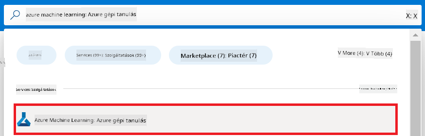
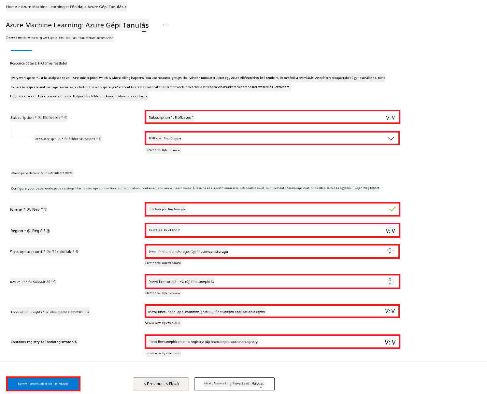
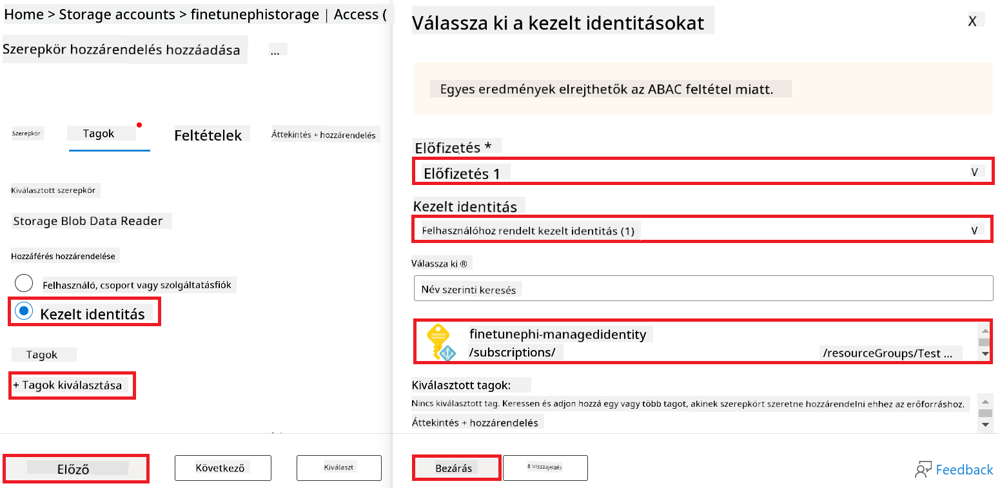
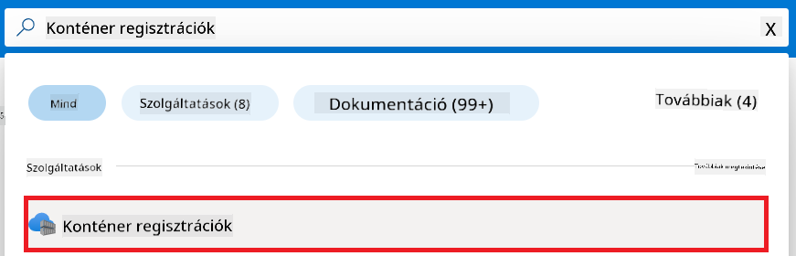
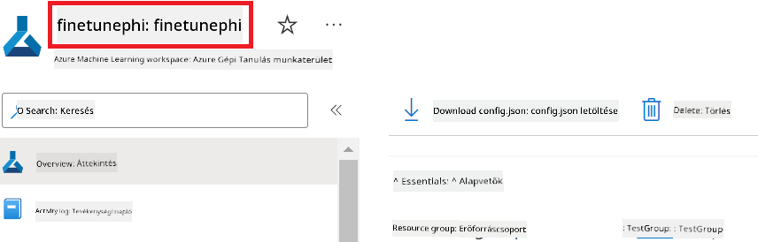
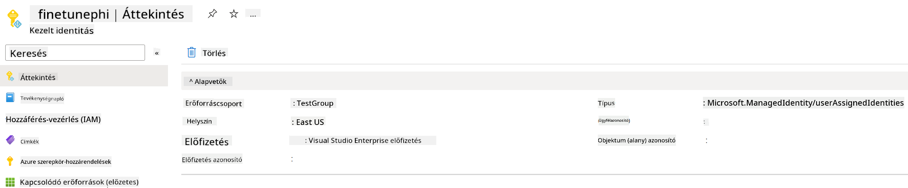
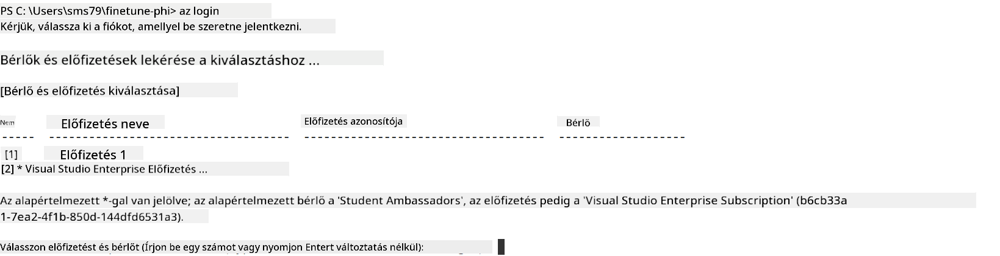
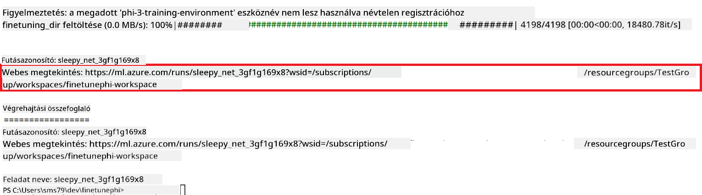
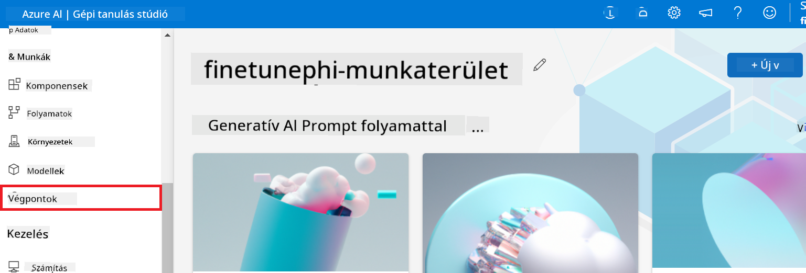
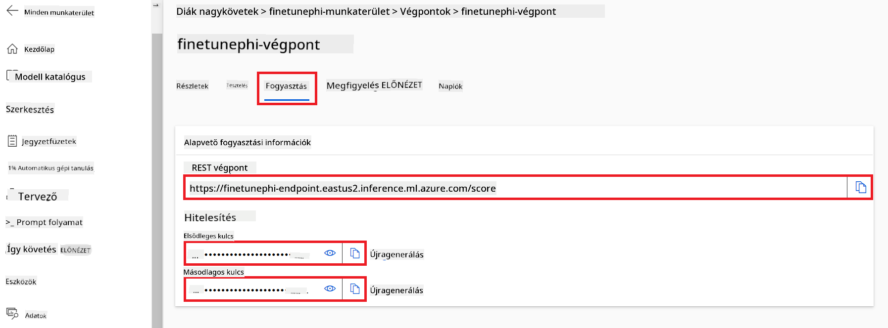

<!--
CO_OP_TRANSLATOR_METADATA:
{
  "original_hash": "7ca2c30fdb802664070e9cfbf92e24fe",
  "translation_date": "2026-01-05T09:24:51+00:00",
  "source_file": "md/02.Application/01.TextAndChat/Phi3/E2E_Phi-3-FineTuning_PromptFlow_Integration.md",
  "language_code": "hu"
}
-->
# Finomhangolás és egyedi Phi-3 modellek integrálása Prompt flow-val

Ez az end-to-end (E2E) minta a Microsoft Tech Community „[Finomhangolás és egyedi Phi-3 modellek integrálása Prompt flow-val: lépésről lépésre útmutató](https://techcommunity.microsoft.com/t5/educator-developer-blog/fine-tune-and-integrate-custom-phi-3-models-with-prompt-flow/ba-p/4178612?WT.mc_id=aiml-137032-kinfeylo)” című útmutatóján alapul. Bemutatja az egyedi Phi-3 modellek finomhangolásának, telepítésének és Prompt flow-val való integrálásának folyamatait.

## Áttekintés

Ebben az E2E mintában megtanulod, hogyan lehet finomhangolni a Phi-3 modellt és integrálni azt a Prompt flow-val. Az Azure Machine Learning és a Prompt flow segítségével létrehozol egy munkafolyamatot az egyedi AI modellek telepítésére és használatára. Ez az E2E minta három forgatókönyvre van bontva:

**1. Forgatókönyv: Azure-erőforrások beállítása és felkészülés a finomhangolásra**

**2. Forgatókönyv: Phi-3 modell finomhangolása és telepítése az Azure Machine Learning Studioban**

**3. Forgatókönyv: Integráció a Prompt flow-val és beszélgetés az egyedi modelleddel**

Az alábbiakban ennek az E2E mintának az áttekintése látható.


### Tartalomjegyzék

1. **[1. Forgatókönyv: Azure-erőforrások beállítása és felkészülés a finomhangolásra](../../../../../../md/02.Application/01.TextAndChat/Phi3)**
    - [Azure Machine Learning munkaterület létrehozása](../../../../../../md/02.Application/01.TextAndChat/Phi3)
    - [GPU kvóták igénylése az Azure-előfizetésben](../../../../../../md/02.Application/01.TextAndChat/Phi3)
    - [Szerepkör-hozzárendelés hozzáadása](../../../../../../md/02.Application/01.TextAndChat/Phi3)
    - [Projekt beállítása](../../../../../../md/02.Application/01.TextAndChat/Phi3)
    - [Adatkészlet előkészítése a finomhangoláshoz](../../../../../../md/02.Application/01.TextAndChat/Phi3)

1. **[2. Forgatókönyv: Phi-3 modell finomhangolása és telepítése az Azure Machine Learning Studioban](../../../../../../md/02.Application/01.TextAndChat/Phi3)**
    - [Azure CLI beállítása](../../../../../../md/02.Application/01.TextAndChat/Phi3)
    - [Phi-3 modell finomhangolása](../../../../../../md/02.Application/01.TextAndChat/Phi3)
    - [A finomhangolt modell telepítése](../../../../../../md/02.Application/01.TextAndChat/Phi3)

1. **[3. Forgatókönyv: Integráció a Prompt flow-val és beszélgetés az egyedi modelleddel](../../../../../../md/02.Application/01.TextAndChat/Phi3)**
    - [Az egyedi Phi-3 modell integrálása Prompt flow-val](../../../../../../md/02.Application/01.TextAndChat/Phi3)
    - [Beszélgetés az egyedi modelleddel](../../../../../../md/02.Application/01.TextAndChat/Phi3)

## 1. Forgatókönyv: Azure-erőforrások beállítása és felkészülés a finomhangolásra

### Azure Machine Learning munkaterület létrehozása

1. Írd be a *azure machine learning* kifejezést a portál oldal tetején található **keresősávba**, és válaszd a megjelenő lehetőségek közül az **Azure Machine Learning** opciót.

    

1. Válaszd ki a navigációs menüből a **+ Create** gombot.

1. Válaszd a navigációs menüből az **Új munkaterület** lehetőséget.

    

1. Végezze el az alábbi feladatokat:

    - Válaszd ki az Azure **Előfizetésedet**.
    - Válaszd ki a használni kívánt **Erőforráscsoportot** (ha szükséges, hozz létre újat).
    - Add meg a **Munkaterület nevét**. Ennek egyedi értéknek kell lennie.
    - Válaszd ki a használni kívánt **Régiót**.
    - Válaszd ki a használni kívánt **Tárolófiókot** (ha szükséges, hozz létre újat).
    - Válaszd ki a használni kívánt **Kulcstartót** (ha szükséges, hozz létre újat).
    - Válaszd ki a használni kívánt **Alkalmazásinsightokat** (ha szükséges, hozz létre újat).
    - Válaszd ki a használni kívánt **Konténerregisztert** (ha szükséges, hozz létre újat).

    

1. Válaszd a **Review + Create** lehetőséget.

1. Válaszd a **Create** gombot.

### GPU kvóták igénylése az Azure-előfizetésben

Ebben az E2E mintában a finomhangoláshoz a *Standard_NC24ads_A100_v4 GPU*-t használod, amelyhez kvótaigénylés szükséges, míg a telepítéshez a *Standard_E4s_v3* CPU-t használod, amelyhez kvótaigénylés nem szükséges.

> [!NOTE]
>
> Csak a Pay-As-You-Go típusú előfizetések (azaz a szabványos előfizetési típusok) jogosultak GPU-hozzárendelésre; a kedvezményes előfizetések jelenleg nem támogatottak.
>
> A kedvezményes előfizetéseket használók (például Visual Studio Enterprise előfizetés) vagy akik gyorsan szeretnék tesztelni a finomhangolási és telepítési folyamatot, szintén kapnak útmutatást egy minimális adatállománnyal történő CPU-alapú finomhangoláshoz. Fontos azonban megjegyezni, hogy a finomhangolás eredményei jelentősen jobbak, ha GPU-t használsz nagyobb adatkészletekkel.

1. Látogass el az [Azure ML Studio](https://ml.azure.com/home?wt.mc_id=studentamb_279723) oldalra.

1. Az alábbi lépéseket végezd el a *Standard NCADSA100v4 Family* kvóta igényléséhez:

    - A bal oldali menüben válaszd a **Quota** opciót.
    - Válaszd ki a használni kívánt **Virtuális gép családot**. Például válaszd a **Standard NCADSA100v4 Family Cluster Dedicated vCPUs** lehetőséget, amely tartalmazza a *Standard_NC24ads_A100_v4* GPU-t.
    - Válaszd a navigációs menüben a **Request quota** opciót.

        

    - A Request quota oldalon add meg a használni kívánt **Új magok maximális számát**. Például 24.
    - A Request quota oldalon válaszd a **Submit** gombot a GPU kvóta igényléséhez.

> [!NOTE]
> Az igényeidnek megfelelő GPU vagy CPU kiválasztásához lásd a [Sizes for Virtual Machines in Azure](https://learn.microsoft.com/azure/virtual-machines/sizes/overview?tabs=breakdownseries%2Cgeneralsizelist%2Ccomputesizelist%2Cmemorysizelist%2Cstoragesizelist%2Cgpusizelist%2Cfpgasizelist%2Chpcsizelist) dokumentumot.

### Szerepkör-hozzárendelés hozzáadása

A modellek finomhangolásához és telepítéséhez először létre kell hoznod egy Felhasználóhoz Rendelt Felügyelt Identitást (UAI), és hozzá kell rendelned a megfelelő jogosultságokat. Ezt az UAI-t fogod használni a hitelesítéshez a telepítés során.

#### Felhasználóhoz Rendelt Felügyelt Identitás (UAI) létrehozása

1. Írd be a *managed identities* kifejezést a portál oldal tetején található **keresősávba**, és válaszd a megjelenő lehetőségek közül a **Managed Identities** opciót.

    

1. Válaszd a **+ Create** gombot.

    

1. Végezze el az alábbi feladatokat:

    - Válaszd ki az Azure **Előfizetésedet**.
    - Válaszd ki a használni kívánt **Erőforráscsoportot** (ha szükséges, hozz létre újat).
    - Válaszd ki a használni kívánt **Régiót**.
    - Add meg a **Nevet**. Ennek egyedi értéknek kell lennie.

1. Válaszd a **Review + create** lehetőséget.

1. Válaszd a **+ Create** gombot.

#### Szerepkör-hozzárendelés hozzáadása a Felügyelt Identitáshoz

1. Navigálj a létrehozott Felügyelt Identitás erőforráshoz.

1. Válaszd a bal oldali menüben az **Azure role assignments** opciót.

1. Válaszd a navigációs menüből a **+Add role assignment** lehetőséget.

1. Az Add role assignment oldalon végezd el az alábbi feladatokat:
    - Állítsd be a **Scope** értékét **Resource group**-ra.
    - Válaszd ki az Azure **Előfizetésedet**.
    - Válaszd ki a használni kívánt **Erőforráscsoportot**.
    - Állítsd a **Role** értékét **Contributor**-ra.

    

1. Válaszd a **Save** gombot.

#### Storage Blob Data Reader szerepkör-hozzárendelés hozzáadása a Felügyelt Identitáshoz

1. Írd be a *storage accounts* kifejezést a portál oldal tetején található **keresősávba**, és válaszd a megjelenő lehetőségek közül a **Storage accounts** opciót.

    

1. Válaszd ki azt a tárolófiókot, amely az általad létrehozott Azure Machine Learning munkaterülethez tartozik. Például *finetunephistorage*.

1. A következő lépésekkel navigálj az Add role assignment oldalra:

    - Navigálj az általad létrehozott Azure Storage tárolófiókhoz.
    - Válaszd a bal oldali menüben az **Access Control (IAM)** opciót.
    - Válaszd a navigációs menüből a **+ Add** gombot.
    - Válaszd a **Add role assignment** lehetőséget.

    

1. Az Add role assignment oldalon végezd el az alábbi feladatokat:

    - Az Role oldalon írd be a keresősávba a *Storage Blob Data Reader* kifejezést, majd válaszd ki a megjelenő listából a **Storage Blob Data Reader** szerepkört.
    - Az Role oldalon válaszd a **Next** lehetőséget.
    - A Members oldalon állítsd be az **Assign access to** értékét **Managed identity**-re.
    - A Members oldalon válaszd a **+ Select members** lehetőséget.
    - A Select managed identities oldalon válaszd ki az Azure **Előfizetésedet**.
    - A Select managed identities oldalon válaszd ki a **Managed identity** értékét **Manage Identity**-re.
    - A Select managed identities oldalon válaszd ki az általad létrehozott Manage Identity-t. Például *finetunephi-managedidentity*.
    - A Select managed identities oldalon válaszd a **Select** gombot.

    

1. Válaszd a **Review + assign** lehetőséget.

#### AcrPull szerepkör-hozzárendelés hozzáadása a Felügyelt Identitáshoz

1. Írd be a *container registries* kifejezést a portál oldal tetején található **keresősávba**, és válaszd a megjelenő lehetőségek közül a **Container registries** opciót.

    

1. Válaszd ki az Azure Machine Learning munkaterülethez tartozó konténerregisztert. Például *finetunephicontainerregistries*.

1. A következő lépésekkel navigálj az Add role assignment oldalra:

    - Válaszd a bal oldali menüben az **Access Control (IAM)** opciót.
    - Válaszd a navigációs menüből a **+ Add** gombot.
    - Válaszd a **Add role assignment** lehetőséget.

1. Az Add role assignment oldalon végezd el az alábbi feladatokat:

    - Az Role oldalon írd be a keresősávba az *AcrPull* kifejezést, majd válaszd ki a megjelenő listából az **AcrPull** szerepkört.
    - Az Role oldalon válaszd a **Next** lehetőséget.
    - A Members oldalon állítsd be az **Assign access to** értékét **Managed identity**-re.
    - A Members oldalon válaszd a **+ Select members** lehetőséget.
    - A Select managed identities oldalon válaszd ki az Azure **Előfizetésedet**.
    - A Select managed identities oldalon válaszd ki a **Managed identity** értékét **Manage Identity**-re.
    - A Select managed identities oldalon válaszd ki az általad létrehozott Manage Identity-t. Például *finetunephi-managedidentity*.
    - A Select managed identities oldalon válaszd a **Select** gombot.
    - Válaszd a **Review + assign** lehetőséget.

### Projekt beállítása

Most létrehozol egy mappát, amelyen belül dolgozol, és beállítasz egy virtuális környezetet egy olyan program fejlesztéséhez, amely interaktál a felhasználókkal, és az Azure Cosmos DB-ben tárolt csevegési előzményeket használja válaszai tájékoztatására.

#### Mappa létrehozása a munkához

1. Nyiss meg egy terminált, és írd be a következő parancsot az alapértelmezett útvonalon egy *finetune-phi* nevű mappa létrehozásához.

    ```console
    mkdir finetune-phi
    ```

1. Írd be a következő parancsot a terminálodba, hogy belépj az előbb létrehozott *finetune-phi* mappába.

    ```console
    cd finetune-phi
    ```

#### Virtuális környezet létrehozása

1. Írd be a következő parancsot a terminálodba egy *.venv* nevű virtuális környezet létrehozásához.

    ```console
    python -m venv .venv
    ```

1. Írd be a következő parancsot a terminálodba a virtuális környezet aktiválásához.

    ```console
    .venv\Scripts\activate.bat
    ```

> [!NOTE]
>
> Ha sikeres volt, akkor a parancssor előtt meg kell jelennie a *(.venv)* jelzésnek.

#### A szükséges csomagok telepítése

1. Írd be a következő parancsokat a terminálodba a szükséges csomagok telepítéséhez.

    ```console
    pip install datasets==2.19.1
    pip install transformers==4.41.1
    pip install azure-ai-ml==1.16.0
    pip install torch==2.3.1
    pip install trl==0.9.4
    pip install promptflow==1.12.0
    ```

#### Projektfájlok létrehozása
Ebben a gyakorlatban elkészíted a projektünk alapvető fájljait. Ezek a fájlok tartalmazzák a dataset letöltéséhez, az Azure Machine Learning környezet beállításához, a Phi-3 modell finomhangolásához, valamint a finomhangolt modell üzembe helyezéséhez szükséges szkripteket. Létrehozol továbbá egy *conda.yml* fájlt is a finomhangoló környezet felállításához.

Ebben a gyakorlatban a következőket végzed el:

- Létrehozol egy *download_dataset.py* fájlt a dataset letöltéséhez.
- Létrehozol egy *setup_ml.py* fájlt az Azure Machine Learning környezet beállításához.
- Létrehozol egy *fine_tune.py* fájlt a *finetuning_dir* mappában, amely a dataset segítségével finomhangolja a Phi-3 modellt.
- Létrehozol egy *conda.yml* fájlt a finomhangoló környezet beállításához.
- Létrehozol egy *deploy_model.py* fájlt a finomhangolt modell üzembe helyezéséhez.
- Létrehozol egy *integrate_with_promptflow.py* fájlt, hogy integráld a finomhangolt modellt, és Prompt Flow segítségével futtasd a modellt.
- Létrehozol egy flow.dag.yml fájlt a Prompt Flow munkafolyamat szerkezetének beállításához.
- Létrehozol egy *config.py* fájlt, amelybe beírod az Azure információkat.

> [!NOTE]
>
> A teljes mappaszerkezet:
>
> ```text
> └── YourUserName
> .    └── finetune-phi
> .        ├── finetuning_dir
> .        │      └── fine_tune.py
> .        ├── conda.yml
> .        ├── config.py
> .        ├── deploy_model.py
> .        ├── download_dataset.py
> .        ├── flow.dag.yml
> .        ├── integrate_with_promptflow.py
> .        └── setup_ml.py
> ```

1. Nyisd meg a **Visual Studio Code**-ot.

1. Válaszd ki a menüsorból a **File** menüpontot.

1. Válaszd az **Open Folder** lehetőséget.

1. Válaszd ki a *finetune-phi* mappát, amelyet létrehoztál, és amely a *C:\Users\yourUserName\finetune-phi* helyen található.

    

1. A Visual Studio Code bal oldali paneljén kattints jobb gombbal, válaszd az **New File** opciót, és hozd létre a *download_dataset.py* nevű fájlt.

1. A Visual Studio Code bal oldali paneljén kattints jobb gombbal, válaszd az **New File** opciót, és hozd létre a *setup_ml.py* nevű fájlt.

1. A Visual Studio Code bal oldali paneljén kattints jobb gombbal, válaszd az **New File** opciót, és hozd létre a *deploy_model.py* nevű fájlt.

    

1. A Visual Studio Code bal oldali paneljén kattints jobb gombbal, válaszd az **New Folder** opciót, és hozd létre a *finetuning_dir* nevű új mappát.

1. A *finetuning_dir* mappában hozz létre egy *fine_tune.py* nevű új fájlt.

#### *conda.yml* fájl létrehozása és konfigurálása

1. A Visual Studio Code bal oldali paneljén kattints jobb gombbal, válaszd az **New File** opciót, és hozd létre a *conda.yml* nevű fájlt.

1. Másold be az alábbi kódot a *conda.yml* fájlba, hogy beállítsd a Phi-3 modell finomhangoló környezetét.

    ```yml
    name: phi-3-training-env
    channels:
      - defaults
      - conda-forge
    dependencies:
      - python=3.10
      - pip
      - numpy<2.0
      - pip:
          - torch==2.4.0
          - torchvision==0.19.0
          - trl==0.8.6
          - transformers==4.41
          - datasets==2.21.0
          - azureml-core==1.57.0
          - azure-storage-blob==12.19.0
          - azure-ai-ml==1.16
          - azure-identity==1.17.1
          - accelerate==0.33.0
          - mlflow==2.15.1
          - azureml-mlflow==1.57.0
    ```

#### *config.py* fájl létrehozása és konfigurálása

1. A Visual Studio Code bal oldali paneljén kattints jobb gombbal, válaszd az **New File** opciót, és hozd létre a *config.py* nevű fájlt.

1. Másold be az alábbi kódot a *config.py* fájlba, hogy beleírd az Azure adataidat.

    ```python
    # Azure beállítások
    AZURE_SUBSCRIPTION_ID = "your_subscription_id"
    AZURE_RESOURCE_GROUP_NAME = "your_resource_group_name" # "TestGroup"

    # Azure Machine Learning beállítások
    AZURE_ML_WORKSPACE_NAME = "your_workspace_name" # "finetunephi-workspace"

    # Azure kezelt identitás beállítások
    AZURE_MANAGED_IDENTITY_CLIENT_ID = "your_azure_managed_identity_client_id"
    AZURE_MANAGED_IDENTITY_NAME = "your_azure_managed_identity_name" # "finetunephi-mangedidentity"
    AZURE_MANAGED_IDENTITY_RESOURCE_ID = f"/subscriptions/{AZURE_SUBSCRIPTION_ID}/resourceGroups/{AZURE_RESOURCE_GROUP_NAME}/providers/Microsoft.ManagedIdentity/userAssignedIdentities/{AZURE_MANAGED_IDENTITY_NAME}"

    # Adatkészlet fájl elérési útjai
    TRAIN_DATA_PATH = "data/train_data.jsonl"
    TEST_DATA_PATH = "data/test_data.jsonl"

    # Finomhangolt modell beállítások
    AZURE_MODEL_NAME = "your_fine_tuned_model_name" # "finetune-phi-model"
    AZURE_ENDPOINT_NAME = "your_fine_tuned_model_endpoint_name" # "finetune-phi-endpoint"
    AZURE_DEPLOYMENT_NAME = "your_fine_tuned_model_deployment_name" # "finetune-phi-deployment"

    AZURE_ML_API_KEY = "your_fine_tuned_model_api_key"
    AZURE_ML_ENDPOINT = "your_fine_tuned_model_endpoint_uri" # "https://{your-endpoint-name}.{your-region}.inference.ml.azure.com/score"
    ```

#### Azure környezeti változók hozzáadása

1. Hajtsd végre a következőket az Azure Előfizetés azonosító hozzáadásához:

    - Írd be a *subscriptions* kifejezést a portál oldal tetején található **keresősávba**, majd a megjelenő lehetőségek közül válaszd a **Subscriptions**-t.
    - Válaszd ki az aktuálisan használt Azure Előfizetést.
    - Másold ki és illeszd be az Előfizetés azonosítót a *config.py* fájlba.

    

1. Hajtsd végre a következőket az Azure Munkaterület nevének hozzáadásához:

    - Navigálj az általad létrehozott Azure Machine Learning erőforráshoz.
    - Másold ki és illeszd be fióknevedet a *config.py* fájlba.

    

1. Hajtsd végre a következőket az Azure Erőforráscsoport nevének hozzáadásához:

    - Navigálj az általad létrehozott Azure Machine Learning erőforráshoz.
    - Másold ki és illeszd be az Azure Erőforráscsoport nevét a *config.py* fájlba.

    

2. Hajtsd végre a következőket az Azure Kezelt Identitás nevének hozzáadásához

    - Navigálj az általad létrehozott Kezelt Identitások (Managed Identities) erőforráshoz.
    - Másold ki és illeszd be az Azure Kezelt Identitás nevét a *config.py* fájlba.

    

### Dataset előkészítése finomhangoláshoz

Ebben a gyakorlatban futtatod a *download_dataset.py* fájlt, hogy letöltsd az *ULTRACHAT_200k* adatállományokat a helyi környezetedbe. Ezt az adatállományt fogod használni a Phi-3 modell finomhangolásához az Azure Machine Learning környezetben.

#### Dataset letöltése a *download_dataset.py* használatával

1. Nyisd meg a *download_dataset.py* fájlt a Visual Studio Code-ban.

1. Másold be az alábbi kódot a *download_dataset.py* fájlba.

    ```python
    import json
    import os
    from datasets import load_dataset
    from config import (
        TRAIN_DATA_PATH,
        TEST_DATA_PATH)

    def load_and_split_dataset(dataset_name, config_name, split_ratio):
        """
        Load and split a dataset.
        """
        # Töltse be az adatkészletet a megadott névvel, konfigurációval és felosztási aránnyal
        dataset = load_dataset(dataset_name, config_name, split=split_ratio)
        print(f"Original dataset size: {len(dataset)}")
        
        # Ossza fel az adatkészletet tanuló és teszt halmazokra (80% tanuló, 20% teszt)
        split_dataset = dataset.train_test_split(test_size=0.2)
        print(f"Train dataset size: {len(split_dataset['train'])}")
        print(f"Test dataset size: {len(split_dataset['test'])}")
        
        return split_dataset

    def save_dataset_to_jsonl(dataset, filepath):
        """
        Save a dataset to a JSONL file.
        """
        # Hozza létre a könyvtárat, ha az nem létezik
        os.makedirs(os.path.dirname(filepath), exist_ok=True)
        
        # Nyissa meg a fájlt írási módban
        with open(filepath, 'w', encoding='utf-8') as f:
            # Iteráljon végig az adatkészlet minden rekordján
            for record in dataset:
                # Mentse a rekordot JSON objektumként, és írja a fájlba
                json.dump(record, f)
                # Írjon új sor karaktert a rekordok elválasztásához
                f.write('\n')
        
        print(f"Dataset saved to {filepath}")

    def main():
        """
        Main function to load, split, and save the dataset.
        """
        # Töltse be és ossza fel az ULTRACHAT_200k adatkészletet egy adott konfigurációval és felosztási aránnyal
        dataset = load_and_split_dataset("HuggingFaceH4/ultrachat_200k", 'default', 'train_sft[:1%]')
        
        # Nyerje ki a tanuló és teszt adatkészleteket a felosztásból
        train_dataset = dataset['train']
        test_dataset = dataset['test']

        # Mentse a tanuló adatokat JSONL fájlba
        save_dataset_to_jsonl(train_dataset, TRAIN_DATA_PATH)
        
        # Mentse a teszt adatokat külön JSONL fájlba
        save_dataset_to_jsonl(test_dataset, TEST_DATA_PATH)

    if __name__ == "__main__":
        main()

    ```

> [!TIP]
>
> **Útmutató minimális adatállománnyal való finomhangoláshoz CPU használatával**
>
> Ha CPU-val szeretnél finomhangolni, ez az eljárás ideális azok számára, akik kedvezményes előfizetéssel rendelkeznek (például Visual Studio Enterprise Subscription), vagy gyorsan szeretnék tesztelni a finomhangolási és üzembe helyezési folyamatot.
>
> Cseréld ki a `dataset = load_and_split_dataset("HuggingFaceH4/ultrachat_200k", 'default', 'train_sft[:1%]')` sort erre: `dataset = load_and_split_dataset("HuggingFaceH4/ultrachat_200k", 'default', 'train_sft[:10]')`
>

1. Írd be a következő parancsot a terminálban a szkript futtatásához, és töltsd le az adatállományt a helyi környezetbe.

    ```console
    python download_data.py
    ```

1. Ellenőrizd, hogy az adatállomány sikeresen le lett-e mentve a helyi *finetune-phi/data* könyvtárba.

> [!NOTE]
>
> **Adatállomány mérete és finomhangolási idő**
>
> Ebben az E2E példában csak az adatállomány 1%-át használod (`train_sft[:1%]`). Ez jelentősen csökkenti az adat mennyiségét, felgyorsítva az adatfeltöltést és a finomhangolást. Állíthatod a százalékos arányt, hogy megtaláld az egyensúlyt a betanítási idő és a modell teljesítménye között. Az adatállomány kisebb részhalmazának használata csökkenti a finomhangolás idejét, így az folyamat könnyebben kezelhető egy E2E mintaprojektben.

## 2. forgatókönyv: Phi-3 modell finomhangolása és üzembe helyezése az Azure Machine Learning Studio-ban

### Azure CLI beállítása

Az Azure CLI-t be kell állítanod a környezeted hitelesítéséhez. Az Azure CLI lehetővé teszi az Azure erőforrások közvetlen kezelését a parancssorból, és biztosítja a szükséges hitelesítő adatokat az Azure Machine Learning számára az erőforrások eléréséhez. A kezdéshez telepítsd az [Azure CLI-t](https://learn.microsoft.com/cli/azure/install-azure-cli).

1. Nyiss meg egy terminálablakot, és írd be a következő parancsot az Azure fiókba való bejelentkezéshez.

    ```console
    az login
    ```

1. Válaszd ki az Azure fiókodat, amelyet használni kívánsz.

1. Válaszd ki az Azure előfizetésedet, amelyet használni kívánsz.

    

> [!TIP]
>
> Ha problémád van az Azure-ba való bejelentkezéssel, próbáld meg az eszközkódot használni. Nyiss egy terminált, majd írd be a következő parancsot az Azure fiókba való bejelentkezéshez:
>
> ```console
> az login --use-device-code
> ```
>

### Phi-3 modell finomhangolása

Ebben a gyakorlatban a Phi-3 modellt finomhangolod a megadott dataset segítségével. Először a finomhangolási folyamatot definiálod a *fine_tune.py* fájlban. Ezután konfigurálod az Azure Machine Learning környezetet és elindítod a finomhangolást a *setup_ml.py* fájl futtatásával. Ez a szkript biztosítja, hogy a finomhangolás az Azure Machine Learning környezetben történjen.

A *setup_ml.py* futtatásával elindítod a finomhangoló folyamatot az Azure Machine Learning környezetben.

#### Kód hozzáadása a *fine_tune.py* fájlhoz

1. Navigálj a *finetuning_dir* mappába, és nyisd meg a *fine_tune.py* fájlt a Visual Studio Code-ban.

1. Másold be az alábbi kódot a *fine_tune.py* fájlba.

    ```python
    import argparse
    import sys
    import logging
    import os
    from datasets import load_dataset
    import torch
    import mlflow
    from transformers import AutoModelForCausalLM, AutoTokenizer, TrainingArguments
    from trl import SFTTrainer

    # Az INVALID_PARAMETER_VALUE hiba elkerülése érdekében tiltsa le az MLflow integrációját
    os.environ["DISABLE_MLFLOW_INTEGRATION"] = "True"

    # Naplózási beállítások
    logging.basicConfig(
        format="%(asctime)s - %(levelname)s - %(name)s - %(message)s",
        datefmt="%Y-%m-%d %H:%M:%S",
        handlers=[logging.StreamHandler(sys.stdout)],
        level=logging.WARNING
    )
    logger = logging.getLogger(__name__)

    def initialize_model_and_tokenizer(model_name, model_kwargs):
        """
        Initialize the model and tokenizer with the given pretrained model name and arguments.
        """
        model = AutoModelForCausalLM.from_pretrained(model_name, **model_kwargs)
        tokenizer = AutoTokenizer.from_pretrained(model_name)
        tokenizer.model_max_length = 2048
        tokenizer.pad_token = tokenizer.unk_token
        tokenizer.pad_token_id = tokenizer.convert_tokens_to_ids(tokenizer.pad_token)
        tokenizer.padding_side = 'right'
        return model, tokenizer

    def apply_chat_template(example, tokenizer):
        """
        Apply a chat template to tokenize messages in the example.
        """
        messages = example["messages"]
        if messages[0]["role"] != "system":
            messages.insert(0, {"role": "system", "content": ""})
        example["text"] = tokenizer.apply_chat_template(
            messages, tokenize=False, add_generation_prompt=False
        )
        return example

    def load_and_preprocess_data(train_filepath, test_filepath, tokenizer):
        """
        Load and preprocess the dataset.
        """
        train_dataset = load_dataset('json', data_files=train_filepath, split='train')
        test_dataset = load_dataset('json', data_files=test_filepath, split='train')
        column_names = list(train_dataset.features)

        train_dataset = train_dataset.map(
            apply_chat_template,
            fn_kwargs={"tokenizer": tokenizer},
            num_proc=10,
            remove_columns=column_names,
            desc="Applying chat template to train dataset",
        )

        test_dataset = test_dataset.map(
            apply_chat_template,
            fn_kwargs={"tokenizer": tokenizer},
            num_proc=10,
            remove_columns=column_names,
            desc="Applying chat template to test dataset",
        )

        return train_dataset, test_dataset

    def train_and_evaluate_model(train_dataset, test_dataset, model, tokenizer, output_dir):
        """
        Train and evaluate the model.
        """
        training_args = TrainingArguments(
            bf16=True,
            do_eval=True,
            output_dir=output_dir,
            eval_strategy="epoch",
            learning_rate=5.0e-06,
            logging_steps=20,
            lr_scheduler_type="cosine",
            num_train_epochs=3,
            overwrite_output_dir=True,
            per_device_eval_batch_size=4,
            per_device_train_batch_size=4,
            remove_unused_columns=True,
            save_steps=500,
            seed=0,
            gradient_checkpointing=True,
            gradient_accumulation_steps=1,
            warmup_ratio=0.2,
        )

        trainer = SFTTrainer(
            model=model,
            args=training_args,
            train_dataset=train_dataset,
            eval_dataset=test_dataset,
            max_seq_length=2048,
            dataset_text_field="text",
            tokenizer=tokenizer,
            packing=True
        )

        train_result = trainer.train()
        trainer.log_metrics("train", train_result.metrics)

        mlflow.transformers.log_model(
            transformers_model={"model": trainer.model, "tokenizer": tokenizer},
            artifact_path=output_dir,
        )

        tokenizer.padding_side = 'left'
        eval_metrics = trainer.evaluate()
        eval_metrics["eval_samples"] = len(test_dataset)
        trainer.log_metrics("eval", eval_metrics)

    def main(train_file, eval_file, model_output_dir):
        """
        Main function to fine-tune the model.
        """
        model_kwargs = {
            "use_cache": False,
            "trust_remote_code": True,
            "torch_dtype": torch.bfloat16,
            "device_map": None,
            "attn_implementation": "eager"
        }

        # pretrained_model_name = "microsoft/Phi-3-mini-4k-instruct"
        pretrained_model_name = "microsoft/Phi-3.5-mini-instruct"

        with mlflow.start_run():
            model, tokenizer = initialize_model_and_tokenizer(pretrained_model_name, model_kwargs)
            train_dataset, test_dataset = load_and_preprocess_data(train_file, eval_file, tokenizer)
            train_and_evaluate_model(train_dataset, test_dataset, model, tokenizer, model_output_dir)

    if __name__ == "__main__":
        parser = argparse.ArgumentParser()
        parser.add_argument("--train-file", type=str, required=True, help="Path to the training data")
        parser.add_argument("--eval-file", type=str, required=True, help="Path to the evaluation data")
        parser.add_argument("--model_output_dir", type=str, required=True, help="Directory to save the fine-tuned model")
        args = parser.parse_args()
        main(args.train_file, args.eval_file, args.model_output_dir)

    ```

1. Mentsd és zárd be a *fine_tune.py* fájlt.

> [!TIP]
> **Phi-3.5 modell is finomhangolható**
>
> A *fine_tune.py* fájlban a `pretrained_model_name` értékét megváltoztathatod `"microsoft/Phi-3-mini-4k-instruct"` helyett tetszőleges modellnévre, amelyet finomhangolni szeretnél. Például, ha `"microsoft/Phi-3.5-mini-instruct"`-ra cseréled, akkor a Phi-3.5-mini-instruct modellt használod finomhangoláshoz. A kívánt modell nevének megtalálásához látogass el a [Hugging Face](https://huggingface.co/) oldalra, keresd ki a neked tetsző modellt, majd másold be a nevét a `pretrained_model_name` mezőbe a scriptedben.
>
> <image type="content" src="../../../../imgs/02/FineTuning-PromptFlow/finetunephi3.5.png" alt-text="Phi-3.5 finomhangolása.">
>

#### Kód hozzáadása a *setup_ml.py* fájlhoz

1. Nyisd meg a *setup_ml.py* fájlt a Visual Studio Code-ban.

1. Másold be az alábbi kódot a *setup_ml.py* fájlba.

    ```python
    import logging
    from azure.ai.ml import MLClient, command, Input
    from azure.ai.ml.entities import Environment, AmlCompute
    from azure.identity import AzureCliCredential
    from config import (
        AZURE_SUBSCRIPTION_ID,
        AZURE_RESOURCE_GROUP_NAME,
        AZURE_ML_WORKSPACE_NAME,
        TRAIN_DATA_PATH,
        TEST_DATA_PATH
    )

    # Konstansok

    # Kommenteld ki a következő sorokat, hogy CPU példányt használj a képzéshez
    # COMPUTE_INSTANCE_TYPE = "Standard_E16s_v3" # cpu
    # COMPUTE_NAME = "cpu-e16s-v3"
    # DOCKER_IMAGE_NAME = "mcr.microsoft.com/azureml/openmpi4.1.0-ubuntu20.04:latest"

    # Kommenteld ki a következő sorokat, hogy GPU példányt használj a képzéshez
    COMPUTE_INSTANCE_TYPE = "Standard_NC24ads_A100_v4"
    COMPUTE_NAME = "gpu-nc24s-a100-v4"
    DOCKER_IMAGE_NAME = "mcr.microsoft.com/azureml/curated/acft-hf-nlp-gpu:59"

    CONDA_FILE = "conda.yml"
    LOCATION = "eastus2" # Cseréld ki a számítási klaszter helyére
    FINETUNING_DIR = "./finetuning_dir" # Elérési út a finomhangoló szkripthez
    TRAINING_ENV_NAME = "phi-3-training-environment" # A képzési környezet neve
    MODEL_OUTPUT_DIR = "./model_output" # Elérési út a modell kimeneti könyvtárához az Azure ML-ben

    # Naplózási beállítás a folyamat követéséhez
    logger = logging.getLogger(__name__)
    logging.basicConfig(
        format="%(asctime)s - %(levelname)s - %(name)s - %(message)s",
        datefmt="%Y-%m-%d %H:%M:%S",
        level=logging.WARNING
    )

    def get_ml_client():
        """
        Initialize the ML Client using Azure CLI credentials.
        """
        credential = AzureCliCredential()
        return MLClient(credential, AZURE_SUBSCRIPTION_ID, AZURE_RESOURCE_GROUP_NAME, AZURE_ML_WORKSPACE_NAME)

    def create_or_get_environment(ml_client):
        """
        Create or update the training environment in Azure ML.
        """
        env = Environment(
            image=DOCKER_IMAGE_NAME,  # Docker kép a környezethez
            conda_file=CONDA_FILE,  # Conda környezet fájl
            name=TRAINING_ENV_NAME,  # A környezet neve
        )
        return ml_client.environments.create_or_update(env)

    def create_or_get_compute_cluster(ml_client, compute_name, COMPUTE_INSTANCE_TYPE, location):
        """
        Create or update the compute cluster in Azure ML.
        """
        try:
            compute_cluster = ml_client.compute.get(compute_name)
            logger.info(f"Compute cluster '{compute_name}' already exists. Reusing it for the current run.")
        except Exception:
            logger.info(f"Compute cluster '{compute_name}' does not exist. Creating a new one with size {COMPUTE_INSTANCE_TYPE}.")
            compute_cluster = AmlCompute(
                name=compute_name,
                size=COMPUTE_INSTANCE_TYPE,
                location=location,
                tier="Dedicated",  # A számítástechnikai klaszter szintje
                min_instances=0,  # Minimális példányszám
                max_instances=1  # Maximális példányszám
            )
            ml_client.compute.begin_create_or_update(compute_cluster).wait()  # Várakozás a klaszter létrehozására
        return compute_cluster

    def create_fine_tuning_job(env, compute_name):
        """
        Set up the fine-tuning job in Azure ML.
        """
        return command(
            code=FINETUNING_DIR,  # Elérési út a fine_tune.py-hoz
            command=(
                "python fine_tune.py "
                "--train-file ${{inputs.train_file}} "
                "--eval-file ${{inputs.eval_file}} "
                "--model_output_dir ${{inputs.model_output}}"
            ),
            environment=env,  # Képzési környezet
            compute=compute_name,  # Használandó számítási klaszter
            inputs={
                "train_file": Input(type="uri_file", path=TRAIN_DATA_PATH),  # Elérési út a képzési adatfájlhoz
                "eval_file": Input(type="uri_file", path=TEST_DATA_PATH),  # Elérési út az értékelő adatfájlhoz
                "model_output": MODEL_OUTPUT_DIR
            }
        )

    def main():
        """
        Main function to set up and run the fine-tuning job in Azure ML.
        """
        # ML kliens inicializálása
        ml_client = get_ml_client()

        # Környezet létrehozása
        env = create_or_get_environment(ml_client)
        
        # Számítási klaszter létrehozása vagy meglévő lekérése
        create_or_get_compute_cluster(ml_client, COMPUTE_NAME, COMPUTE_INSTANCE_TYPE, LOCATION)

        # Finomhangoló munka létrehozása és elküldése
        job = create_fine_tuning_job(env, COMPUTE_NAME)
        returned_job = ml_client.jobs.create_or_update(job)  # A munka elküldése
        ml_client.jobs.stream(returned_job.name)  # Munka naplók folyamatos megjelenítése
        
        # A munka nevének rögzítése
        job_name = returned_job.name
        print(f"Job name: {job_name}")

    if __name__ == "__main__":
        main()

    ```

1. Cseréld ki a `COMPUTE_INSTANCE_TYPE`, `COMPUTE_NAME` és `LOCATION` értékeket a saját adataidra.

    ```python
   # A következő sorokat kommenteld ki a GPU példány használatához a képzéshez
    COMPUTE_INSTANCE_TYPE = "Standard_NC24ads_A100_v4"
    COMPUTE_NAME = "gpu-nc24s-a100-v4"
    ...
    LOCATION = "eastus2" # Cseréld le a számítástechnikai klasztered helyére
    ```

> [!TIP]
>
> **Útmutató minimális adatállománnyal való finomhangoláshoz CPU használatával**
>
> Ha CPU-val szeretnél finomhangolni, ez az eljárás ideális azok számára, akik kedvezményes előfizetéssel rendelkeznek (például Visual Studio Enterprise Subscription), vagy gyorsan szeretnék tesztelni a finomhangolási és üzembe helyezési folyamatot.
>
> 1. Nyisd meg a *setup_ml* fájlt.
> 1. Cseréld ki a `COMPUTE_INSTANCE_TYPE`, `COMPUTE_NAME`, és `DOCKER_IMAGE_NAME` értékeket az alábbiakra. Ha nincs hozzáférésed a *Standard_E16s_v3* típushoz, használhatsz egy hozzá hasonló CPU példányt, vagy kérhetsz új kvótát.
> 1. Cseréld ki a `LOCATION` értékét a saját adataidra.
>
>    ```python
>    # Uncomment the following lines to use a CPU instance for training
>    COMPUTE_INSTANCE_TYPE = "Standard_E16s_v3" # cpu
>    COMPUTE_NAME = "cpu-e16s-v3"
>    DOCKER_IMAGE_NAME = "mcr.microsoft.com/azureml/openmpi4.1.0-ubuntu20.04:latest"
>    LOCATION = "eastus2" # Replace with the location of your compute cluster
>    ```
>

1. Írd be a következő parancsot a *setup_ml.py* szkript futtatásához, amellyel elindítod a finomhangolási folyamatot az Azure Machine Learning környezetben.

    ```python
    python setup_ml.py
    ```

1. Ebben a gyakorlatban sikeresen finomhangoltad a Phi-3 modellt Azure Machine Learning használatával. A *setup_ml.py* szkript futtatásával beállítottad az Azure Machine Learning környezetet, és elindítottad a *fine_tune.py* fájlban definiált finomhangolási folyamatot. Fontos megjegyezni, hogy a finomhangolás jelentős időt vehet igénybe. A `python setup_ml.py` parancs végrehajtása után várnod kell, amíg a folyamat befejeződik. A finomhangolási feladat állapotát nyomon követheted az Azure Machine Learning portálon a terminálban megjelenő hivatkozáson keresztül.

    

### A finomhangolt modell üzembe helyezése

Ahhoz, hogy a finomhangolt Phi-3 modellt integráld a Prompt Flow-ral, üzembe kell helyezned a modellt, hogy az elérhető legyen valós idejű inferenciára. Ez a folyamat magában foglalja a modell regisztrálását, egy online végpont létrehozását, és a modell üzembe helyezését.

#### Állítsd be az üzembe helyezéshez szükséges modell nevet, végpont nevet és telepítési nevet

1. Nyisd meg a *config.py* fájlt.

1. Cseréld ki az `AZURE_MODEL_NAME = "your_fine_tuned_model_name"` értéket a kívánt modellnévre.

1. Cseréld ki az `AZURE_ENDPOINT_NAME = "your_fine_tuned_model_endpoint_name"` értéket a kívánt végpont névre.

1. Cseréld ki az `AZURE_DEPLOYMENT_NAME = "your_fine_tuned_model_deployment_name"` értéket a kívánt telepítési névre.

#### Kód hozzáadása a *deploy_model.py* fájlhoz

A *deploy_model.py* fájl futtatása automatizálja az egész üzembe helyezési folyamatot. Regisztrálja a modellt, létrehozza a végpontot, és elvégzi az üzembe helyezést a *config.py* fájlban megadott beállítások alapján, amelyek magukban foglalják a modell nevét, a végpont nevét és a telepítési nevet.

1. Nyisd meg a *deploy_model.py* fájlt a Visual Studio Code-ban.

1. Másold be az alábbi kódot a *deploy_model.py* fájlba.

    ```python
    import logging
    from azure.identity import AzureCliCredential
    from azure.ai.ml import MLClient
    from azure.ai.ml.entities import Model, ProbeSettings, ManagedOnlineEndpoint, ManagedOnlineDeployment, IdentityConfiguration, ManagedIdentityConfiguration, OnlineRequestSettings
    from azure.ai.ml.constants import AssetTypes

    # Konfiguráció importálása
    from config import (
        AZURE_SUBSCRIPTION_ID,
        AZURE_RESOURCE_GROUP_NAME,
        AZURE_ML_WORKSPACE_NAME,
        AZURE_MANAGED_IDENTITY_RESOURCE_ID,
        AZURE_MANAGED_IDENTITY_CLIENT_ID,
        AZURE_MODEL_NAME,
        AZURE_ENDPOINT_NAME,
        AZURE_DEPLOYMENT_NAME
    )

    # Konstansok
    JOB_NAME = "your-job-name"
    COMPUTE_INSTANCE_TYPE = "Standard_E4s_v3"

    deployment_env_vars = {
        "SUBSCRIPTION_ID": AZURE_SUBSCRIPTION_ID,
        "RESOURCE_GROUP_NAME": AZURE_RESOURCE_GROUP_NAME,
        "UAI_CLIENT_ID": AZURE_MANAGED_IDENTITY_CLIENT_ID,
    }

    # Naplózás beállítása
    logging.basicConfig(
        format="%(asctime)s - %(levelname)s - %(name)s - %(message)s",
        datefmt="%Y-%m-%d %H:%M:%S",
        level=logging.DEBUG
    )
    logger = logging.getLogger(__name__)

    def get_ml_client():
        """Initialize and return the ML Client."""
        credential = AzureCliCredential()
        return MLClient(credential, AZURE_SUBSCRIPTION_ID, AZURE_RESOURCE_GROUP_NAME, AZURE_ML_WORKSPACE_NAME)

    def register_model(ml_client, model_name, job_name):
        """Register a new model."""
        model_path = f"azureml://jobs/{job_name}/outputs/artifacts/paths/model_output"
        logger.info(f"Registering model {model_name} from job {job_name} at path {model_path}.")
        run_model = Model(
            path=model_path,
            name=model_name,
            description="Model created from run.",
            type=AssetTypes.MLFLOW_MODEL,
        )
        model = ml_client.models.create_or_update(run_model)
        logger.info(f"Registered model ID: {model.id}")
        return model

    def delete_existing_endpoint(ml_client, endpoint_name):
        """Delete existing endpoint if it exists."""
        try:
            endpoint_result = ml_client.online_endpoints.get(name=endpoint_name)
            logger.info(f"Deleting existing endpoint {endpoint_name}.")
            ml_client.online_endpoints.begin_delete(name=endpoint_name).result()
            logger.info(f"Deleted existing endpoint {endpoint_name}.")
        except Exception as e:
            logger.info(f"No existing endpoint {endpoint_name} found to delete: {e}")

    def create_or_update_endpoint(ml_client, endpoint_name, description=""):
        """Create or update an endpoint."""
        delete_existing_endpoint(ml_client, endpoint_name)
        logger.info(f"Creating new endpoint {endpoint_name}.")
        endpoint = ManagedOnlineEndpoint(
            name=endpoint_name,
            description=description,
            identity=IdentityConfiguration(
                type="user_assigned",
                user_assigned_identities=[ManagedIdentityConfiguration(resource_id=AZURE_MANAGED_IDENTITY_RESOURCE_ID)]
            )
        )
        endpoint_result = ml_client.online_endpoints.begin_create_or_update(endpoint).result()
        logger.info(f"Created new endpoint {endpoint_name}.")
        return endpoint_result

    def create_or_update_deployment(ml_client, endpoint_name, deployment_name, model):
        """Create or update a deployment."""

        logger.info(f"Creating deployment {deployment_name} for endpoint {endpoint_name}.")
        deployment = ManagedOnlineDeployment(
            name=deployment_name,
            endpoint_name=endpoint_name,
            model=model.id,
            instance_type=COMPUTE_INSTANCE_TYPE,
            instance_count=1,
            environment_variables=deployment_env_vars,
            request_settings=OnlineRequestSettings(
                max_concurrent_requests_per_instance=3,
                request_timeout_ms=180000,
                max_queue_wait_ms=120000
            ),
            liveness_probe=ProbeSettings(
                failure_threshold=30,
                success_threshold=1,
                period=100,
                initial_delay=500,
            ),
            readiness_probe=ProbeSettings(
                failure_threshold=30,
                success_threshold=1,
                period=100,
                initial_delay=500,
            ),
        )
        deployment_result = ml_client.online_deployments.begin_create_or_update(deployment).result()
        logger.info(f"Created deployment {deployment.name} for endpoint {endpoint_name}.")
        return deployment_result

    def set_traffic_to_deployment(ml_client, endpoint_name, deployment_name):
        """Set traffic to the specified deployment."""
        try:
            # Az aktuális végpont részleteinek lekérése
            endpoint = ml_client.online_endpoints.get(name=endpoint_name)
            
            # Az aktuális forgalomelosztás naplózása hibakereséshez
            logger.info(f"Current traffic allocation: {endpoint.traffic}")
            
            # A forgalomelosztás beállítása a telepítéshez
            endpoint.traffic = {deployment_name: 100}
            
            # A végpont frissítése az új forgalomelosztással
            endpoint_poller = ml_client.online_endpoints.begin_create_or_update(endpoint)
            updated_endpoint = endpoint_poller.result()
            
            # A frissített forgalomelosztás naplózása hibakereséshez
            logger.info(f"Updated traffic allocation: {updated_endpoint.traffic}")
            logger.info(f"Set traffic to deployment {deployment_name} at endpoint {endpoint_name}.")
            return updated_endpoint
        except Exception as e:
            # A folyamat során előforduló hibák naplózása
            logger.error(f"Failed to set traffic to deployment: {e}")
            raise


    def main():
        ml_client = get_ml_client()

        registered_model = register_model(ml_client, AZURE_MODEL_NAME, JOB_NAME)
        logger.info(f"Registered model ID: {registered_model.id}")

        endpoint = create_or_update_endpoint(ml_client, AZURE_ENDPOINT_NAME, "Endpoint for finetuned Phi-3 model")
        logger.info(f"Endpoint {AZURE_ENDPOINT_NAME} is ready.")

        try:
            deployment = create_or_update_deployment(ml_client, AZURE_ENDPOINT_NAME, AZURE_DEPLOYMENT_NAME, registered_model)
            logger.info(f"Deployment {AZURE_DEPLOYMENT_NAME} is created for endpoint {AZURE_ENDPOINT_NAME}.")

            set_traffic_to_deployment(ml_client, AZURE_ENDPOINT_NAME, AZURE_DEPLOYMENT_NAME)
            logger.info(f"Traffic is set to deployment {AZURE_DEPLOYMENT_NAME} at endpoint {AZURE_ENDPOINT_NAME}.")
        except Exception as e:
            logger.error(f"Failed to create or update deployment: {e}")

    if __name__ == "__main__":
        main()

    ```

1. Hajtsd végre a következő lépéseket a `JOB_NAME` megszerzéséhez:

    - Navigálj az általad létrehozott Azure Machine Learning erőforráshoz.
    - Válaszd ki a **Studio web URL**-t az Azure Machine Learning munkaterület megnyitásához.
    - Válaszd ki a bal oldali fülön a **Jobs** lehetőséget.
    - Válaszd ki a finomhangolási kísérletet, pl. *finetunephi*.
    - Válaszd ki a létrehozott feladatot.
- Másolja be és illessze be a munkája nevét a `JOB_NAME = "your-job-name"` helyére a *deploy_model.py* fájlban.

1. Cserélje ki a `COMPUTE_INSTANCE_TYPE` értéket a saját részleteire.

1. Írja be a következő parancsot a *deploy_model.py* szkript futtatásához és a telepítési folyamat elindításához az Azure Machine Learning környezetben.

    ```python
    python deploy_model.py
    ```

> [!WARNING]
> A fiókja többletköltségeinek elkerülése érdekében győződjön meg róla, hogy törli a létrehozott végpontot az Azure Machine Learning munkaterületen.
>

#### Telepítési állapot ellenőrzése az Azure Machine Learning munkaterületen

1. Látogasson el az [Azure ML Studio](https://ml.azure.com/home?wt.mc_id=studentamb_279723) oldalra.

1. Navigáljon a létrehozott Azure Machine Learning munkaterülethez.

1. Válassza a **Studio web URL** lehetőséget az Azure Machine Learning munkaterület megnyitásához.

1. Válassza ki a bal oldali menüben az **Endpoints** elemet.

    

2. Válassza ki a létrehozott végpontot.

    

3. Ezen az oldalon kezelheti a telepítési folyamat során létrehozott végpontokat.

## 3. forgatókönyv: Integráció a Prompt flow-val és beszélgetés az egyedi modelljével

### Egyedi Phi-3 modell integrálása a Prompt flow-val

A finomhangolt modell sikeres telepítése után most integrálhatja azt a Prompt flow-val, hogy valós idejű alkalmazásokban használhassa a modelljét, amely lehetővé teszi az interaktív feladatok széles skáláját az egyedi Phi-3 modelljével.

#### Az api kulcs és a finomhangolt Phi-3 modell végpontjának URI-jának beállítása

1. Navigáljon a létrehozott Azure Machine Learning munkaterülethez.
1. Válassza ki a bal oldali menüben az **Endpoints** elemet.
1. Válassza ki a létrehozott végpontot.
1. A navigációs menüből válassza a **Consume** lehetőséget.
1. Másolja be a **REST endpoint**-ját a *config.py* fájlba, kicserélve az `AZURE_ML_ENDPOINT = "your_fine_tuned_model_endpoint_uri"` értéket a **REST endpoint**-jára.
1. Másolja be a **Primary key** értékét a *config.py* fájlba, kicserélve az `AZURE_ML_API_KEY = "your_fine_tuned_model_api_key"` értéket a **Primary key**-jével.

    

#### Kód hozzáadása a *flow.dag.yml* fájlhoz

1. Nyissa meg a *flow.dag.yml* fájlt a Visual Studio Code-ban.

1. Illessze be a következő kódot a *flow.dag.yml* fájlba.

    ```yml
    inputs:
      input_data:
        type: string
        default: "Who founded Microsoft?"

    outputs:
      answer:
        type: string
        reference: ${integrate_with_promptflow.output}

    nodes:
    - name: integrate_with_promptflow
      type: python
      source:
        type: code
        path: integrate_with_promptflow.py
      inputs:
        input_data: ${inputs.input_data}
    ```

#### Kód hozzáadása az *integrate_with_promptflow.py* fájlhoz

1. Nyissa meg az *integrate_with_promptflow.py* fájlt a Visual Studio Code-ban.

1. Illessze be a következő kódot az *integrate_with_promptflow.py* fájlba.

    ```python
    import logging
    import requests
    from promptflow.core import tool
    import asyncio
    import platform
    from config import (
        AZURE_ML_ENDPOINT,
        AZURE_ML_API_KEY
    )

    # Naplózás beállítása
    logging.basicConfig(
        format="%(asctime)s - %(levelname)s - %(name)s - %(message)s",
        datefmt="%Y-%m-%d %H:%M:%S",
        level=logging.DEBUG
    )
    logger = logging.getLogger(__name__)

    def query_azml_endpoint(input_data: list, endpoint_url: str, api_key: str) -> str:
        """
        Send a request to the Azure ML endpoint with the given input data.
        """
        headers = {
            "Content-Type": "application/json",
            "Authorization": f"Bearer {api_key}"
        }
        data = {
            "input_data": [input_data],
            "params": {
                "temperature": 0.7,
                "max_new_tokens": 128,
                "do_sample": True,
                "return_full_text": True
            }
        }
        try:
            response = requests.post(endpoint_url, json=data, headers=headers)
            response.raise_for_status()
            result = response.json()[0]
            logger.info("Successfully received response from Azure ML Endpoint.")
            return result
        except requests.exceptions.RequestException as e:
            logger.error(f"Error querying Azure ML Endpoint: {e}")
            raise

    def setup_asyncio_policy():
        """
        Setup asyncio event loop policy for Windows.
        """
        if platform.system() == 'Windows':
            asyncio.set_event_loop_policy(asyncio.WindowsSelectorEventLoopPolicy())
            logger.info("Set Windows asyncio event loop policy.")

    @tool
    def my_python_tool(input_data: str) -> str:
        """
        Tool function to process input data and query the Azure ML endpoint.
        """
        setup_asyncio_policy()
        return query_azml_endpoint(input_data, AZURE_ML_ENDPOINT, AZURE_ML_API_KEY)

    ```

### Beszélgetés az egyedi modelljével

1. Írja be a következő parancsot a *deploy_model.py* szkript futtatásához és a telepítési folyamat elindításához az Azure Machine Learning környezetben.

    ```python
    pf flow serve --source ./ --port 8080 --host localhost
    ```

1. Íme egy példa az eredményekre: Most már beszélgethet az egyedi Phi-3 modelljével. Ajánlott a finomhangoláshoz használt adatok alapján kérdéseket feltenni.

    

---

<!-- CO-OP TRANSLATOR DISCLAIMER START -->
**Felelősségkizárás**:
Ez a dokumentum az AI fordító szolgáltatás [Co-op Translator](https://github.com/Azure/co-op-translator) használatával készült. Bár igyekszünk a pontosságra, kérjük, vegye figyelembe, hogy az automatikus fordítás hibákat vagy pontatlanságokat tartalmazhat. Az eredeti, anyanyelvi dokumentum tekintendő a hiteles forrásnak. Kritikus információk esetén szakmai emberi fordítást javaslunk. Nem vállalunk felelősséget az ebből eredő félreértésekért vagy téves értelmezésekért.
<!-- CO-OP TRANSLATOR DISCLAIMER END -->