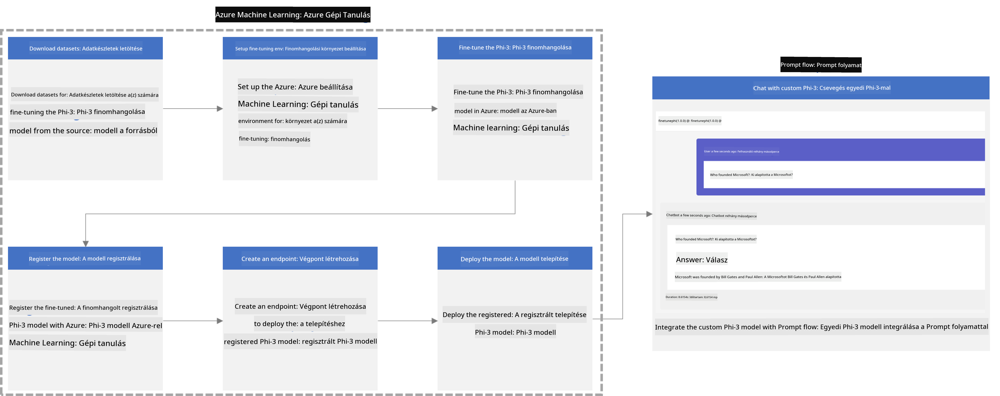
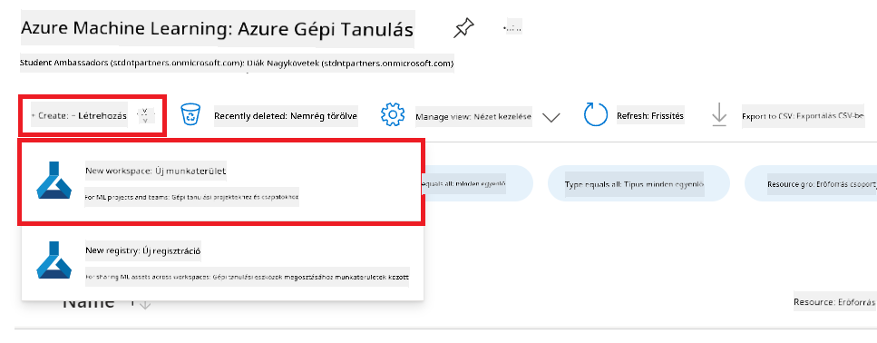
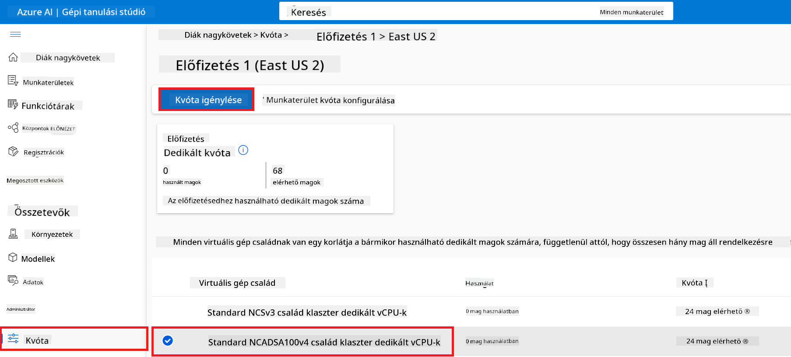
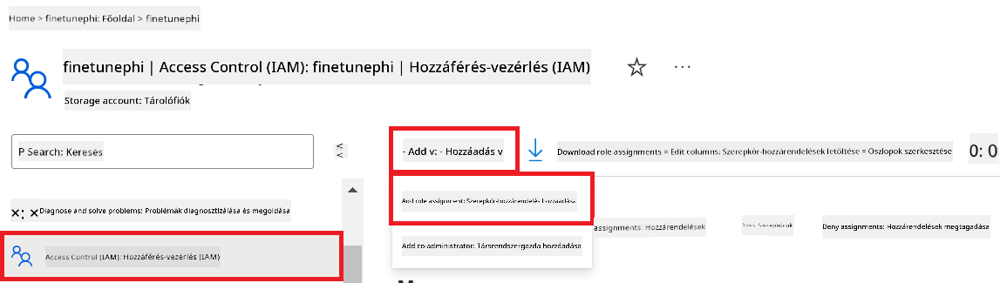
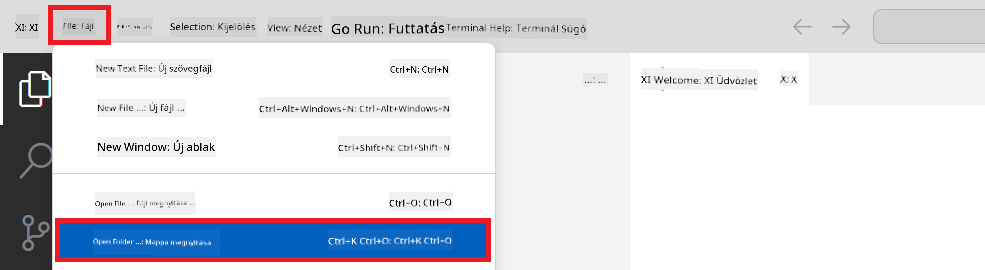
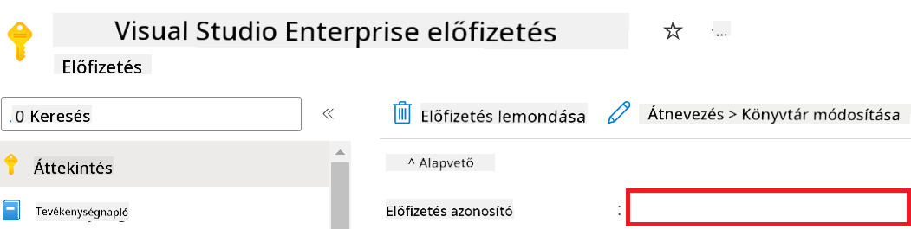
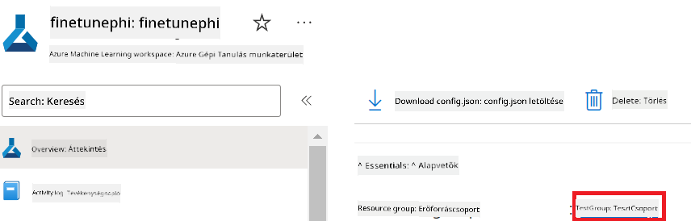
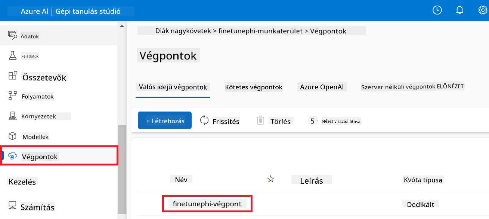
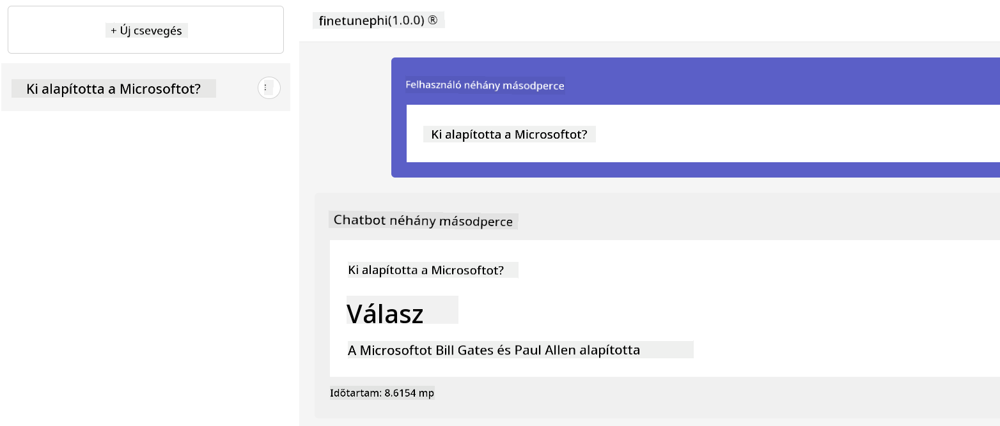

<!--
CO_OP_TRANSLATOR_METADATA:
{
  "original_hash": "455be2b7b9c3390d367d528f8fab2aa0",
  "translation_date": "2025-07-17T00:41:28+00:00",
  "source_file": "md/02.Application/01.TextAndChat/Phi3/E2E_Phi-3-FineTuning_PromptFlow_Integration.md",
  "language_code": "hu"
}
-->
# Egyedi Phi-3 modellek finomhangolása és integrálása Prompt flow-val

Ez az end-to-end (E2E) példa a Microsoft Tech Community "[Fine-Tune and Integrate Custom Phi-3 Models with Prompt Flow: Step-by-Step Guide](https://techcommunity.microsoft.com/t5/educator-developer-blog/fine-tune-and-integrate-custom-phi-3-models-with-prompt-flow/ba-p/4178612?WT.mc_id=aiml-137032-kinfeylo)" útmutatóján alapul. Bemutatja az egyedi Phi-3 modellek finomhangolásának, telepítésének és Prompt flow-val való integrálásának folyamatát.

## Áttekintés

Ebben az E2E példában megtanulhatod, hogyan finomhangold a Phi-3 modellt és hogyan integráld azt a Prompt flow-val. Az Azure Machine Learning és a Prompt flow segítségével létrehozhatsz egy munkafolyamatot az egyedi AI modellek telepítésére és használatára. Ez az E2E példa három forgatókönyvre van bontva:

**1. forgatókönyv: Azure erőforrások beállítása és előkészítés a finomhangoláshoz**

**2. forgatókönyv: Phi-3 modell finomhangolása és telepítése az Azure Machine Learning Studioban**

**3. forgatókönyv: Integráció a Prompt flow-val és csevegés az egyedi modellel**

Íme egy áttekintés erről az E2E példáról.



### Tartalomjegyzék

1. **[1. forgatókönyv: Azure erőforrások beállítása és előkészítés a finomhangoláshoz](../../../../../../md/02.Application/01.TextAndChat/Phi3)**
    - [Azure Machine Learning Workspace létrehozása](../../../../../../md/02.Application/01.TextAndChat/Phi3)
    - [GPU kvóták igénylése az Azure előfizetésben](../../../../../../md/02.Application/01.TextAndChat/Phi3)
    - [Szerepkör hozzárendelés hozzáadása](../../../../../../md/02.Application/01.TextAndChat/Phi3)
    - [Projekt beállítása](../../../../../../md/02.Application/01.TextAndChat/Phi3)
    - [Adatkészlet előkészítése a finomhangoláshoz](../../../../../../md/02.Application/01.TextAndChat/Phi3)

1. **[2. forgatókönyv: Phi-3 modell finomhangolása és telepítése az Azure Machine Learning Studioban](../../../../../../md/02.Application/01.TextAndChat/Phi3)**
    - [Azure CLI beállítása](../../../../../../md/02.Application/01.TextAndChat/Phi3)
    - [Phi-3 modell finomhangolása](../../../../../../md/02.Application/01.TextAndChat/Phi3)
    - [Finomhangolt modell telepítése](../../../../../../md/02.Application/01.TextAndChat/Phi3)

1. **[3. forgatókönyv: Integráció a Prompt flow-val és csevegés az egyedi modelleddel](../../../../../../md/02.Application/01.TextAndChat/Phi3)**
    - [Egyedi Phi-3 modell integrálása a Prompt flow-val](../../../../../../md/02.Application/01.TextAndChat/Phi3)
    - [Csevegés az egyedi modelleddel](../../../../../../md/02.Application/01.TextAndChat/Phi3)

## 1. forgatókönyv: Azure erőforrások beállítása és előkészítés a finomhangoláshoz

### Azure Machine Learning Workspace létrehozása

1. Írd be a *azure machine learning* kifejezést a portál oldal tetején található **keresősávba**, majd válaszd ki az opciók közül az **Azure Machine Learning**-et.

    

1. Válaszd a navigációs menüből a **+ Create** lehetőséget.

1. Válaszd a navigációs menüből az **Új workspace** opciót.

    

1. Végezze el a következő lépéseket:

    - Válaszd ki az Azure **Előfizetésedet**.
    - Válaszd ki a használni kívánt **Erőforráscsoportot** (ha szükséges, hozz létre újat).
    - Add meg a **Workspace nevét**. Egyedi értéknek kell lennie.
    - Válaszd ki a használni kívánt **Régiót**.
    - Válaszd ki a használni kívánt **Tárolófiókot** (ha szükséges, hozz létre újat).
    - Válaszd ki a használni kívánt **Kulcstárat** (ha szükséges, hozz létre újat).
    - Válaszd ki a használni kívánt **Application Insights**-t (ha szükséges, hozz létre újat).
    - Válaszd ki a használni kívánt **Konténerregisztert** (ha szükséges, hozz létre újat).

    

1. Válaszd a **Review + Create** lehetőséget.

1. Válaszd a **Create** gombot.

### GPU kvóták igénylése az Azure előfizetésben

Ebben az E2E példában a finomhangoláshoz a *Standard_NC24ads_A100_v4 GPU*-t fogod használni, ami kvótaigényt igényel, míg a telepítéshez a *Standard_E4s_v3* CPU-t, amihez nem szükséges kvótaigénylés.

> [!NOTE]
>
> Csak a Pay-As-You-Go előfizetések (az alapértelmezett előfizetési típus) jogosultak GPU kiosztásra; a kedvezményes előfizetések jelenleg nem támogatottak.
>
> Azok számára, akik kedvezményes előfizetést használnak (például Visual Studio Enterprise Subscription), vagy gyorsan szeretnék kipróbálni a finomhangolás és telepítés folyamatát, ez az útmutató CPU-val történő finomhangolásra is ad útmutatást minimális adatkészlettel. Fontos azonban megjegyezni, hogy a finomhangolás eredményei jelentősen jobbak, ha GPU-t használsz nagyobb adatkészletekkel.

1. Látogass el az [Azure ML Studio](https://ml.azure.com/home?wt.mc_id=studentamb_279723) oldalra.

1. Végezze el a következő lépéseket a *Standard NCADSA100v4 Family* kvóta igényléséhez:

    - Válaszd a bal oldali menüből a **Quota** lehetőséget.
    - Válaszd ki a használni kívánt **Virtuális gép családot**. Például válaszd a **Standard NCADSA100v4 Family Cluster Dedicated vCPUs** opciót, amely tartalmazza a *Standard_NC24ads_A100_v4* GPU-t.
    - Válaszd a navigációs menüből a **Request quota** lehetőséget.

        

    - A Request quota oldalon add meg az általad kívánt **Új magok számát**. Például 24.
    - A Request quota oldalon válaszd a **Submit** gombot a GPU kvóta igényléséhez.

> [!NOTE]
> Az igényeidnek megfelelő GPU vagy CPU kiválasztásához lásd a [Sizes for Virtual Machines in Azure](https://learn.microsoft.com/azure/virtual-machines/sizes/overview?tabs=breakdownseries%2Cgeneralsizelist%2Ccomputesizelist%2Cmemorysizelist%2Cstoragesizelist%2Cgpusizelist%2Cfpgasizelist%2Chpcsizelist) dokumentumot.

### Szerepkör hozzárendelés hozzáadása

A modellek finomhangolásához és telepítéséhez először létre kell hoznod egy User Assigned Managed Identity-t (UAI), és hozzá kell rendelned a megfelelő jogosultságokat. Ezt az UAI-t fogod használni az autentikációhoz a telepítés során.

#### User Assigned Managed Identity (UAI) létrehozása

1. Írd be a *managed identities* kifejezést a portál oldal tetején található **keresősávba**, majd válaszd ki az opciók közül a **Managed Identities**-t.

    

1. Válaszd a **+ Create** lehetőséget.

    

1. Végezze el a következő lépéseket:

    - Válaszd ki az Azure **Előfizetésedet**.
    - Válaszd ki a használni kívánt **Erőforráscsoportot** (ha szükséges, hozz létre újat).
    - Válaszd ki a használni kívánt **Régiót**.
    - Add meg a **Nevet**. Egyedi értéknek kell lennie.

1. Válaszd a **Review + create** lehetőséget.

1. Válaszd a **+ Create** gombot.

#### Contributor szerepkör hozzárendelése a Managed Identity-hez

1. Navigálj a létrehozott Managed Identity erőforráshoz.

1. Válaszd a bal oldali menüből az **Azure role assignments** lehetőséget.

1. Válaszd a navigációs menüből a **+Add role assignment** lehetőséget.

1. Az Add role assignment oldalon végezd el a következőket:
    - Állítsd be a **Scope**-ot **Resource group**-ra.
    - Válaszd ki az Azure **Előfizetésedet**.
    - Válaszd ki a használni kívánt **Erőforráscsoportot**.
    - Válaszd ki a **Contributor** szerepkört.

    

1. Válaszd a **Save** gombot.

#### Storage Blob Data Reader szerepkör hozzárendelése a Managed Identity-hez

1. Írd be a *storage accounts* kifejezést a portál oldal tetején található **keresősávba**, majd válaszd ki az opciók közül a **Storage accounts**-ot.

    

1. Válaszd ki azt a tárolófiókot, amely az általad létrehozott Azure Machine Learning workspace-hez tartozik. Például *finetunephistorage*.

1. Végezze el a következő lépéseket az Add role assignment oldal eléréséhez:

    - Navigálj az általad létrehozott Azure Storage fiókhoz.
    - Válaszd a bal oldali menüből az **Access Control (IAM)** lehetőséget.
    - Válaszd a navigációs menüből a **+ Add** lehetőséget.
    - Válaszd a **Add role assignment** lehetőséget.

    

1. Az Add role assignment oldalon végezd el a következőket:

    - A Role oldalon írd be a keresősávba a *Storage Blob Data Reader* kifejezést, majd válaszd ki a megjelenő opciók közül a **Storage Blob Data Reader**-t.
    - A Role oldalon válaszd a **Next** gombot.
    - A Members oldalon válaszd az **Assign access to** mezőnél a **Managed identity** opciót.
    - A Members oldalon válaszd a **+ Select members** lehetőséget.
    - A Select managed identities oldalon válaszd ki az Azure **Előfizetésedet**.
    - A Select managed identities oldalon válaszd ki a **Managed identity**-t, amely a **Manage Identity**.
    - A Select managed identities oldalon válaszd ki a létrehozott Managed Identity-t. Például *finetunephi-managedidentity*.
    - A Select managed identities oldalon válaszd a **Select** gombot.

    

1. Válaszd a **Review + assign** lehetőséget.

#### AcrPull szerepkör hozzárendelése a Managed Identity-hez

1. Írd be a *container registries* kifejezést a portál oldal tetején található **keresősávba**, majd válaszd ki az opciók közül a **Container registries**-t.

    

1. Válaszd ki azt a konténerregisztert, amely az Azure Machine Learning workspace-hez tartozik. Például *finetunephicontainerregistries*.

1. Végezze el a következő lépéseket az Add role assignment oldal eléréséhez:

    - Válaszd a bal oldali menüből az **Access Control (IAM)** lehetőséget.
    - Válaszd a navigációs menüből a **+ Add** lehetőséget.
    - Válaszd a **Add role assignment** lehetőséget.

1. Az Add role assignment oldalon végezd el a következőket:

    - A Role oldalon írd be a keresősávba az *AcrPull* kifejezést, majd válaszd ki a megjelenő opciók közül az **AcrPull**-t.
    - A Role oldalon válaszd a **Next** gombot.
    - A Members oldalon válaszd az **Assign access to** mezőnél a **Managed identity** opciót.
    - A Members oldalon válaszd a **+ Select members** lehetőséget.
    - A Select managed identities oldalon válaszd ki az Azure **Előfizetésedet**.
    - A Select managed identities oldalon válaszd ki a **Managed identity**-t, amely a **Manage Identity**.
    - A Select managed identities oldalon válaszd ki a létrehozott Managed Identity-t. Például *finetunephi-managedidentity*.
    - A Select managed identities oldalon válaszd a **Select** gombot.
    - Válaszd a **Review + assign** lehetőséget.

### Projekt beállítása

Most létrehozol egy mappát, ahol dolgozhatsz, és beállítasz egy virtuális környezetet, hogy fejleszthess egy olyan programot, amely felhasználókkal kommunikál, és az Azure Cosmos DB-ben tárolt csevegési előzményeket használja válaszaihoz.

#### Mappa létrehozása a munkához

1. Nyiss meg egy terminálablakot, és írd be a következő parancsot egy *finetune-phi* nevű mappa létrehozásához az alapértelmezett útvonalon.

    ```console
    mkdir finetune-phi
    ```

1. Írd be a következő parancsot a terminálba, hogy belépj a létrehozott *finetune-phi* mappába.

    ```console
    cd finetune-phi
    ```

#### Virtuális környezet létrehozása

1. Írd be a következő parancsot a terminálba egy *.venv* nevű virtuális környezet létrehozásához.

    ```console
    python -m venv .venv
    ```

1. Írd be a következő parancsot a terminálba a virtuális környezet aktiválásához.

    ```console
    .venv\Scripts\activate.bat
    ```
> [!NOTE]
>
> Ha sikerült, a parancssor előtt meg kell jelennie a *(.venv)* jelzésnek.
#### Szükséges csomagok telepítése

1. Írd be a következő parancsokat a terminálodba a szükséges csomagok telepítéséhez.

    ```console
    pip install datasets==2.19.1
    pip install transformers==4.41.1
    pip install azure-ai-ml==1.16.0
    pip install torch==2.3.1
    pip install trl==0.9.4
    pip install promptflow==1.12.0
    ```

#### Projektfájlok létrehozása

Ebben a gyakorlatban létrehozod a projektünk alapvető fájljait. Ezek a fájlok tartalmazzák az adatletöltő szkripteket, az Azure Machine Learning környezet beállítását, a Phi-3 modell finomhangolását, valamint a finomhangolt modell telepítését. Emellett létrehozol egy *conda.yml* fájlt is a finomhangolási környezet beállításához.

Ebben a gyakorlatban a következőket fogod megtenni:

- Létrehozol egy *download_dataset.py* fájlt az adatletöltéshez.
- Létrehozol egy *setup_ml.py* fájlt az Azure Machine Learning környezet beállításához.
- Létrehozol egy *fine_tune.py* fájlt a *finetuning_dir* mappában, amely a Phi-3 modell finomhangolásáért felel az adathalmaz segítségével.
- Létrehozol egy *conda.yml* fájlt a finomhangolási környezet beállításához.
- Létrehozol egy *deploy_model.py* fájlt a finomhangolt modell telepítéséhez.
- Létrehozol egy *integrate_with_promptflow.py* fájlt a finomhangolt modell integrálásához és futtatásához Prompt Flow segítségével.
- Létrehozol egy *flow.dag.yml* fájlt a Prompt Flow munkafolyamat struktúrájának beállításához.
- Létrehozol egy *config.py* fájlt az Azure információk megadásához.

> [!NOTE]
>
> Teljes mappastruktúra:
>
> ```text
> └── YourUserName
> .    └── finetune-phi
> .        ├── finetuning_dir
> .        │      └── fine_tune.py
> .        ├── conda.yml
> .        ├── config.py
> .        ├── deploy_model.py
> .        ├── download_dataset.py
> .        ├── flow.dag.yml
> .        ├── integrate_with_promptflow.py
> .        └── setup_ml.py
> ```

1. Nyisd meg a **Visual Studio Code**-ot.

1. Válaszd a menüsorban a **File** menüpontot.

1. Válaszd az **Open Folder** opciót.

1. Válaszd ki a *finetune-phi* mappát, amelyet létrehoztál, és amely a *C:\Users\yourUserName\finetune-phi* helyen található.

    

1. A Visual Studio Code bal oldali paneljén kattints jobb gombbal, majd válaszd az **New File** lehetőséget, és hozd létre a *download_dataset.py* fájlt.

1. A bal oldali panelen kattints jobb gombbal, válaszd az **New File** opciót, és hozd létre a *setup_ml.py* fájlt.

1. A bal oldali panelen kattints jobb gombbal, válaszd az **New File** opciót, és hozd létre a *deploy_model.py* fájlt.

    

1. A bal oldali panelen kattints jobb gombbal, válaszd az **New Folder** lehetőséget, és hozd létre a *finetuning_dir* mappát.

1. A *finetuning_dir* mappában hozz létre egy új fájlt *fine_tune.py* néven.

#### *conda.yml* fájl létrehozása és konfigurálása

1. A Visual Studio Code bal oldali paneljén kattints jobb gombbal, válaszd az **New File** lehetőséget, és hozd létre a *conda.yml* fájlt.

1. Másold be a következő kódot a *conda.yml* fájlba a Phi-3 modell finomhangolási környezetének beállításához.

    ```yml
    name: phi-3-training-env
    channels:
      - defaults
      - conda-forge
    dependencies:
      - python=3.10
      - pip
      - numpy<2.0
      - pip:
          - torch==2.4.0
          - torchvision==0.19.0
          - trl==0.8.6
          - transformers==4.41
          - datasets==2.21.0
          - azureml-core==1.57.0
          - azure-storage-blob==12.19.0
          - azure-ai-ml==1.16
          - azure-identity==1.17.1
          - accelerate==0.33.0
          - mlflow==2.15.1
          - azureml-mlflow==1.57.0
    ```

#### *config.py* fájl létrehozása és konfigurálása

1. A Visual Studio Code bal oldali paneljén kattints jobb gombbal, válaszd az **New File** lehetőséget, és hozd létre a *config.py* fájlt.

1. Másold be a következő kódot a *config.py* fájlba, hogy megadd az Azure adataidat.

    ```python
    # Azure settings
    AZURE_SUBSCRIPTION_ID = "your_subscription_id"
    AZURE_RESOURCE_GROUP_NAME = "your_resource_group_name" # "TestGroup"

    # Azure Machine Learning settings
    AZURE_ML_WORKSPACE_NAME = "your_workspace_name" # "finetunephi-workspace"

    # Azure Managed Identity settings
    AZURE_MANAGED_IDENTITY_CLIENT_ID = "your_azure_managed_identity_client_id"
    AZURE_MANAGED_IDENTITY_NAME = "your_azure_managed_identity_name" # "finetunephi-mangedidentity"
    AZURE_MANAGED_IDENTITY_RESOURCE_ID = f"/subscriptions/{AZURE_SUBSCRIPTION_ID}/resourceGroups/{AZURE_RESOURCE_GROUP_NAME}/providers/Microsoft.ManagedIdentity/userAssignedIdentities/{AZURE_MANAGED_IDENTITY_NAME}"

    # Dataset file paths
    TRAIN_DATA_PATH = "data/train_data.jsonl"
    TEST_DATA_PATH = "data/test_data.jsonl"

    # Fine-tuned model settings
    AZURE_MODEL_NAME = "your_fine_tuned_model_name" # "finetune-phi-model"
    AZURE_ENDPOINT_NAME = "your_fine_tuned_model_endpoint_name" # "finetune-phi-endpoint"
    AZURE_DEPLOYMENT_NAME = "your_fine_tuned_model_deployment_name" # "finetune-phi-deployment"

    AZURE_ML_API_KEY = "your_fine_tuned_model_api_key"
    AZURE_ML_ENDPOINT = "your_fine_tuned_model_endpoint_uri" # "https://{your-endpoint-name}.{your-region}.inference.ml.azure.com/score"
    ```

#### Azure környezeti változók hozzáadása

1. Hajtsd végre a következő lépéseket az Azure Subscription ID hozzáadásához:

    - Írd be a *subscriptions* kifejezést a portál oldal tetején található **keresősávba**, majd válaszd ki a megjelenő lehetőségek közül a **Subscriptions** menüpontot.
    - Válaszd ki az aktuálisan használt Azure előfizetésedet.
    - Másold ki és illeszd be az előfizetés azonosítóját a *config.py* fájlba.

    

1. Hajtsd végre a következő lépéseket az Azure Workspace név hozzáadásához:

    - Navigálj az általad létrehozott Azure Machine Learning erőforráshoz.
    - Másold ki és illeszd be a munkaterület nevét a *config.py* fájlba.

    

1. Hajtsd végre a következő lépéseket az Azure Resource Group név hozzáadásához:

    - Navigálj az általad létrehozott Azure Machine Learning erőforráshoz.
    - Másold ki és illeszd be az Azure Resource Group nevét a *config.py* fájlba.

    

2. Hajtsd végre a következő lépéseket az Azure Managed Identity név hozzáadásához:

    - Navigálj a létrehozott Managed Identities erőforráshoz.
    - Másold ki és illeszd be az Azure Managed Identity nevét a *config.py* fájlba.

    

### Adathalmaz előkészítése finomhangoláshoz

Ebben a gyakorlatban lefuttatod a *download_dataset.py* fájlt, hogy letöltsd az *ULTRACHAT_200k* adathalmazokat a helyi környezetedbe. Ezt követően ezt az adathalmazt fogod használni a Phi-3 modell finomhangolásához az Azure Machine Learningben.

#### Adathalmaz letöltése a *download_dataset.py* segítségével

1. Nyisd meg a *download_dataset.py* fájlt a Visual Studio Code-ban.

1. Másold be a következő kódot a *download_dataset.py* fájlba.

    ```python
    import json
    import os
    from datasets import load_dataset
    from config import (
        TRAIN_DATA_PATH,
        TEST_DATA_PATH)

    def load_and_split_dataset(dataset_name, config_name, split_ratio):
        """
        Load and split a dataset.
        """
        # Load the dataset with the specified name, configuration, and split ratio
        dataset = load_dataset(dataset_name, config_name, split=split_ratio)
        print(f"Original dataset size: {len(dataset)}")
        
        # Split the dataset into train and test sets (80% train, 20% test)
        split_dataset = dataset.train_test_split(test_size=0.2)
        print(f"Train dataset size: {len(split_dataset['train'])}")
        print(f"Test dataset size: {len(split_dataset['test'])}")
        
        return split_dataset

    def save_dataset_to_jsonl(dataset, filepath):
        """
        Save a dataset to a JSONL file.
        """
        # Create the directory if it does not exist
        os.makedirs(os.path.dirname(filepath), exist_ok=True)
        
        # Open the file in write mode
        with open(filepath, 'w', encoding='utf-8') as f:
            # Iterate over each record in the dataset
            for record in dataset:
                # Dump the record as a JSON object and write it to the file
                json.dump(record, f)
                # Write a newline character to separate records
                f.write('\n')
        
        print(f"Dataset saved to {filepath}")

    def main():
        """
        Main function to load, split, and save the dataset.
        """
        # Load and split the ULTRACHAT_200k dataset with a specific configuration and split ratio
        dataset = load_and_split_dataset("HuggingFaceH4/ultrachat_200k", 'default', 'train_sft[:1%]')
        
        # Extract the train and test datasets from the split
        train_dataset = dataset['train']
        test_dataset = dataset['test']

        # Save the train dataset to a JSONL file
        save_dataset_to_jsonl(train_dataset, TRAIN_DATA_PATH)
        
        # Save the test dataset to a separate JSONL file
        save_dataset_to_jsonl(test_dataset, TEST_DATA_PATH)

    if __name__ == "__main__":
        main()

    ```

> [!TIP]
>
> **Útmutató minimális adathalmazzal történő finomhangoláshoz CPU használatával**
>
> Ha CPU-t szeretnél használni a finomhangoláshoz, ez a megközelítés ideális azok számára, akik rendelkeznek előfizetéses jogosultságokkal (például Visual Studio Enterprise Subscription), vagy gyorsan szeretnék tesztelni a finomhangolási és telepítési folyamatot.
>
> Cseréld le a `dataset = load_and_split_dataset("HuggingFaceH4/ultrachat_200k", 'default', 'train_sft[:1%]')` sort erre: `dataset = load_and_split_dataset("HuggingFaceH4/ultrachat_200k", 'default', 'train_sft[:10]')`
>

1. Írd be a következő parancsot a terminálodba a szkript futtatásához és az adathalmaz letöltéséhez a helyi környezetedbe.

    ```console
    python download_data.py
    ```

1. Ellenőrizd, hogy az adathalmazok sikeresen elmentésre kerültek-e a helyi *finetune-phi/data* könyvtárba.

> [!NOTE]
>
> **Adathalmaz mérete és finomhangolási idő**
>
> Ebben az E2E példában csak az adathalmaz 1%-át használod (`train_sft[:1%]`). Ez jelentősen csökkenti az adatmennyiséget, így gyorsítva az adatfeltöltést és a finomhangolást. A százalékos arányt módosíthatod, hogy megtaláld az optimális egyensúlyt a tanítási idő és a modell teljesítménye között. Az adathalmaz kisebb részhalmazának használata lerövidíti a finomhangolás idejét, így kezelhetőbbé téve a folyamatot egy E2E mintában.

## 2. forgatókönyv: Phi-3 modell finomhangolása és telepítése az Azure Machine Learning Studioban

### Azure CLI beállítása

Az Azure CLI-t be kell állítanod, hogy hitelesítsd a környezetedet. Az Azure CLI lehetővé teszi, hogy parancssorból kezeld az Azure erőforrásokat, és biztosítja az Azure Machine Learning számára szükséges hitelesítő adatokat az erőforrások eléréséhez. A kezdéshez telepítsd az [Azure CLI-t](https://learn.microsoft.com/cli/azure/install-azure-cli).

1. Nyiss egy terminálablakot, és írd be a következő parancsot az Azure fiókodba való bejelentkezéshez.

    ```console
    az login
    ```

1. Válaszd ki az Azure fiókodat.

1. Válaszd ki az Azure előfizetésedet.

    

> [!TIP]
>
> Ha problémád van az Azure-ba való bejelentkezéssel, próbáld meg eszközkód használatával. Nyiss egy terminált, és írd be a következő parancsot az Azure fiókodba való bejelentkezéshez:
>
> ```console
> az login --use-device-code
> ```
>

### Phi-3 modell finomhangolása

Ebben a gyakorlatban a Phi-3 modellt fogod finomhangolni a megadott adathalmaz segítségével. Először definiálod a finomhangolási folyamatot a *fine_tune.py* fájlban. Ezután konfigurálod az Azure Machine Learning környezetet, és elindítod a finomhangolást a *setup_ml.py* fájl futtatásával. Ez a szkript biztosítja, hogy a finomhangolás az Azure Machine Learning környezetében történjen.

A *setup_ml.py* futtatásával elindítod a finomhangolási folyamatot az Azure Machine Learning környezetében.

#### Kód hozzáadása a *fine_tune.py* fájlhoz

1. Navigálj a *finetuning_dir* mappába, és nyisd meg a *fine_tune.py* fájlt a Visual Studio Code-ban.

1. Másold be a következő kódot a *fine_tune.py* fájlba.

    ```python
    import argparse
    import sys
    import logging
    import os
    from datasets import load_dataset
    import torch
    import mlflow
    from transformers import AutoModelForCausalLM, AutoTokenizer, TrainingArguments
    from trl import SFTTrainer

    # To avoid the INVALID_PARAMETER_VALUE error in MLflow, disable MLflow integration
    os.environ["DISABLE_MLFLOW_INTEGRATION"] = "True"

    # Logging setup
    logging.basicConfig(
        format="%(asctime)s - %(levelname)s - %(name)s - %(message)s",
        datefmt="%Y-%m-%d %H:%M:%S",
        handlers=[logging.StreamHandler(sys.stdout)],
        level=logging.WARNING
    )
    logger = logging.getLogger(__name__)

    def initialize_model_and_tokenizer(model_name, model_kwargs):
        """
        Initialize the model and tokenizer with the given pretrained model name and arguments.
        """
        model = AutoModelForCausalLM.from_pretrained(model_name, **model_kwargs)
        tokenizer = AutoTokenizer.from_pretrained(model_name)
        tokenizer.model_max_length = 2048
        tokenizer.pad_token = tokenizer.unk_token
        tokenizer.pad_token_id = tokenizer.convert_tokens_to_ids(tokenizer.pad_token)
        tokenizer.padding_side = 'right'
        return model, tokenizer

    def apply_chat_template(example, tokenizer):
        """
        Apply a chat template to tokenize messages in the example.
        """
        messages = example["messages"]
        if messages[0]["role"] != "system":
            messages.insert(0, {"role": "system", "content": ""})
        example["text"] = tokenizer.apply_chat_template(
            messages, tokenize=False, add_generation_prompt=False
        )
        return example

    def load_and_preprocess_data(train_filepath, test_filepath, tokenizer):
        """
        Load and preprocess the dataset.
        """
        train_dataset = load_dataset('json', data_files=train_filepath, split='train')
        test_dataset = load_dataset('json', data_files=test_filepath, split='train')
        column_names = list(train_dataset.features)

        train_dataset = train_dataset.map(
            apply_chat_template,
            fn_kwargs={"tokenizer": tokenizer},
            num_proc=10,
            remove_columns=column_names,
            desc="Applying chat template to train dataset",
        )

        test_dataset = test_dataset.map(
            apply_chat_template,
            fn_kwargs={"tokenizer": tokenizer},
            num_proc=10,
            remove_columns=column_names,
            desc="Applying chat template to test dataset",
        )

        return train_dataset, test_dataset

    def train_and_evaluate_model(train_dataset, test_dataset, model, tokenizer, output_dir):
        """
        Train and evaluate the model.
        """
        training_args = TrainingArguments(
            bf16=True,
            do_eval=True,
            output_dir=output_dir,
            eval_strategy="epoch",
            learning_rate=5.0e-06,
            logging_steps=20,
            lr_scheduler_type="cosine",
            num_train_epochs=3,
            overwrite_output_dir=True,
            per_device_eval_batch_size=4,
            per_device_train_batch_size=4,
            remove_unused_columns=True,
            save_steps=500,
            seed=0,
            gradient_checkpointing=True,
            gradient_accumulation_steps=1,
            warmup_ratio=0.2,
        )

        trainer = SFTTrainer(
            model=model,
            args=training_args,
            train_dataset=train_dataset,
            eval_dataset=test_dataset,
            max_seq_length=2048,
            dataset_text_field="text",
            tokenizer=tokenizer,
            packing=True
        )

        train_result = trainer.train()
        trainer.log_metrics("train", train_result.metrics)

        mlflow.transformers.log_model(
            transformers_model={"model": trainer.model, "tokenizer": tokenizer},
            artifact_path=output_dir,
        )

        tokenizer.padding_side = 'left'
        eval_metrics = trainer.evaluate()
        eval_metrics["eval_samples"] = len(test_dataset)
        trainer.log_metrics("eval", eval_metrics)

    def main(train_file, eval_file, model_output_dir):
        """
        Main function to fine-tune the model.
        """
        model_kwargs = {
            "use_cache": False,
            "trust_remote_code": True,
            "torch_dtype": torch.bfloat16,
            "device_map": None,
            "attn_implementation": "eager"
        }

        # pretrained_model_name = "microsoft/Phi-3-mini-4k-instruct"
        pretrained_model_name = "microsoft/Phi-3.5-mini-instruct"

        with mlflow.start_run():
            model, tokenizer = initialize_model_and_tokenizer(pretrained_model_name, model_kwargs)
            train_dataset, test_dataset = load_and_preprocess_data(train_file, eval_file, tokenizer)
            train_and_evaluate_model(train_dataset, test_dataset, model, tokenizer, model_output_dir)

    if __name__ == "__main__":
        parser = argparse.ArgumentParser()
        parser.add_argument("--train-file", type=str, required=True, help="Path to the training data")
        parser.add_argument("--eval-file", type=str, required=True, help="Path to the evaluation data")
        parser.add_argument("--model_output_dir", type=str, required=True, help="Directory to save the fine-tuned model")
        args = parser.parse_args()
        main(args.train_file, args.eval_file, args.model_output_dir)

    ```

1. Mentsd el és zárd be a *fine_tune.py* fájlt.

> [!TIP]
> **Phi-3.5 modell finomhangolása is lehetséges**
>
> A *fine_tune.py* fájlban megváltoztathatod a `pretrained_model_name` értékét `"microsoft/Phi-3-mini-4k-instruct"`-ról bármely más modellre, amelyet finomhangolni szeretnél. Például, ha `"microsoft/Phi-3.5-mini-instruct"`-ra változtatod, akkor a Phi-3.5-mini-instruct modellt fogod használni a finomhangoláshoz. A kívánt modell nevét megtalálhatod és kimásolhatod a [Hugging Face](https://huggingface.co/) oldalról, majd beillesztheted a `pretrained_model_name` mezőbe a szkriptedben.
>
> :::image type="content" source="../../imgs/03/FineTuning-PromptFlow/finetunephi3.5.png" alt-text="Phi-3.5 finomhangolása.":::
>

#### Kód hozzáadása a *setup_ml.py* fájlhoz

1. Nyisd meg a *setup_ml.py* fájlt a Visual Studio Code-ban.

1. Másold be a következő kódot a *setup_ml.py* fájlba.

    ```python
    import logging
    from azure.ai.ml import MLClient, command, Input
    from azure.ai.ml.entities import Environment, AmlCompute
    from azure.identity import AzureCliCredential
    from config import (
        AZURE_SUBSCRIPTION_ID,
        AZURE_RESOURCE_GROUP_NAME,
        AZURE_ML_WORKSPACE_NAME,
        TRAIN_DATA_PATH,
        TEST_DATA_PATH
    )

    # Constants

    # Uncomment the following lines to use a CPU instance for training
    # COMPUTE_INSTANCE_TYPE = "Standard_E16s_v3" # cpu
    # COMPUTE_NAME = "cpu-e16s-v3"
    # DOCKER_IMAGE_NAME = "mcr.microsoft.com/azureml/openmpi4.1.0-ubuntu20.04:latest"

    # Uncomment the following lines to use a GPU instance for training
    COMPUTE_INSTANCE_TYPE = "Standard_NC24ads_A100_v4"
    COMPUTE_NAME = "gpu-nc24s-a100-v4"
    DOCKER_IMAGE_NAME = "mcr.microsoft.com/azureml/curated/acft-hf-nlp-gpu:59"

    CONDA_FILE = "conda.yml"
    LOCATION = "eastus2" # Replace with the location of your compute cluster
    FINETUNING_DIR = "./finetuning_dir" # Path to the fine-tuning script
    TRAINING_ENV_NAME = "phi-3-training-environment" # Name of the training environment
    MODEL_OUTPUT_DIR = "./model_output" # Path to the model output directory in azure ml

    # Logging setup to track the process
    logger = logging.getLogger(__name__)
    logging.basicConfig(
        format="%(asctime)s - %(levelname)s - %(name)s - %(message)s",
        datefmt="%Y-%m-%d %H:%M:%S",
        level=logging.WARNING
    )

    def get_ml_client():
        """
        Initialize the ML Client using Azure CLI credentials.
        """
        credential = AzureCliCredential()
        return MLClient(credential, AZURE_SUBSCRIPTION_ID, AZURE_RESOURCE_GROUP_NAME, AZURE_ML_WORKSPACE_NAME)

    def create_or_get_environment(ml_client):
        """
        Create or update the training environment in Azure ML.
        """
        env = Environment(
            image=DOCKER_IMAGE_NAME,  # Docker image for the environment
            conda_file=CONDA_FILE,  # Conda environment file
            name=TRAINING_ENV_NAME,  # Name of the environment
        )
        return ml_client.environments.create_or_update(env)

    def create_or_get_compute_cluster(ml_client, compute_name, COMPUTE_INSTANCE_TYPE, location):
        """
        Create or update the compute cluster in Azure ML.
        """
        try:
            compute_cluster = ml_client.compute.get(compute_name)
            logger.info(f"Compute cluster '{compute_name}' already exists. Reusing it for the current run.")
        except Exception:
            logger.info(f"Compute cluster '{compute_name}' does not exist. Creating a new one with size {COMPUTE_INSTANCE_TYPE}.")
            compute_cluster = AmlCompute(
                name=compute_name,
                size=COMPUTE_INSTANCE_TYPE,
                location=location,
                tier="Dedicated",  # Tier of the compute cluster
                min_instances=0,  # Minimum number of instances
                max_instances=1  # Maximum number of instances
            )
            ml_client.compute.begin_create_or_update(compute_cluster).wait()  # Wait for the cluster to be created
        return compute_cluster

    def create_fine_tuning_job(env, compute_name):
        """
        Set up the fine-tuning job in Azure ML.
        """
        return command(
            code=FINETUNING_DIR,  # Path to fine_tune.py
            command=(
                "python fine_tune.py "
                "--train-file ${{inputs.train_file}} "
                "--eval-file ${{inputs.eval_file}} "
                "--model_output_dir ${{inputs.model_output}}"
            ),
            environment=env,  # Training environment
            compute=compute_name,  # Compute cluster to use
            inputs={
                "train_file": Input(type="uri_file", path=TRAIN_DATA_PATH),  # Path to the training data file
                "eval_file": Input(type="uri_file", path=TEST_DATA_PATH),  # Path to the evaluation data file
                "model_output": MODEL_OUTPUT_DIR
            }
        )

    def main():
        """
        Main function to set up and run the fine-tuning job in Azure ML.
        """
        # Initialize ML Client
        ml_client = get_ml_client()

        # Create Environment
        env = create_or_get_environment(ml_client)
        
        # Create or get existing compute cluster
        create_or_get_compute_cluster(ml_client, COMPUTE_NAME, COMPUTE_INSTANCE_TYPE, LOCATION)

        # Create and Submit Fine-Tuning Job
        job = create_fine_tuning_job(env, COMPUTE_NAME)
        returned_job = ml_client.jobs.create_or_update(job)  # Submit the job
        ml_client.jobs.stream(returned_job.name)  # Stream the job logs
        
        # Capture the job name
        job_name = returned_job.name
        print(f"Job name: {job_name}")

    if __name__ == "__main__":
        main()

    ```

1. Cseréld ki a `COMPUTE_INSTANCE_TYPE`, `COMPUTE_NAME` és `LOCATION` értékeket a saját adataidra.

    ```python
   # Uncomment the following lines to use a GPU instance for training
    COMPUTE_INSTANCE_TYPE = "Standard_NC24ads_A100_v4"
    COMPUTE_NAME = "gpu-nc24s-a100-v4"
    ...
    LOCATION = "eastus2" # Replace with the location of your compute cluster
    ```

> [!TIP]
>
> **Útmutató minimális adathalmazzal történő finomhangoláshoz CPU használatával**
>
> Ha CPU-t szeretnél használni a finomhangoláshoz, ez a megközelítés ideális azok számára, akik rendelkeznek előfizetéses jogosultságokkal (például Visual Studio Enterprise Subscription), vagy gyorsan szeretnék tesztelni a finomhangolási és telepítési folyamatot.
>
> 1. Nyisd meg a *setup_ml* fájlt.
> 1. Cseréld le a `COMPUTE_INSTANCE_TYPE`, `COMPUTE_NAME` és `DOCKER_IMAGE_NAME` értékeket az alábbiakra. Ha nincs hozzáférésed a *Standard_E16s_v3* típushoz, használhatsz egy hasonló CPU példányt, vagy kérhetsz új kvótát.
> 1. Cseréld le a `LOCATION` értéket a saját adataidra.
>
>    ```python
>    # Uncomment the following lines to use a CPU instance for training
>    COMPUTE_INSTANCE_TYPE = "Standard_E16s_v3" # cpu
>    COMPUTE_NAME = "cpu-e16s-v3"
>    DOCKER_IMAGE_NAME = "mcr.microsoft.com/azureml/openmpi4.1.0-ubuntu20.04:latest"
>    LOCATION = "eastus2" # Replace with the location of your compute cluster
>    ```
>

1. Írd be a következő parancsot a *setup_ml.py* szkript futtatásához és a finomhangolási folyamat elindításához az Azure Machine Learningben.

    ```python
    python setup_ml.py
    ```

1. Ebben a gyakorlatban sikeresen finomhangoltad a Phi-3 modellt az Azure Machine Learning segítségével. A *setup_ml.py* futtatásával beállítottad az Azure Machine Learning környezetet, és elindítottad a *fine_tune.py* fájlban definiált finomhangolási folyamatot. Felhívjuk a figyelmed, hogy a finomhangolás jelentős időt vehet igénybe. A `python setup_ml.py` parancs futtatása után várnod kell a folyamat befejezésére. A finomhangolási feladat állapotát a terminálban megjelenő linkre kattintva az Azure Machine Learning portálon követheted nyomon.

    

### A finomhangolt modell telepítése

Ahhoz, hogy a finomhangolt Phi-3 modellt integráld a Prompt Flow-val, telepítened kell a modellt, hogy valós idejű lekérdezésekhez elérhető legyen. Ez a folyamat magában foglalja a modell regisztrálását, egy online végpont létrehozását és a modell telepítését.

#### Modellnév, végpontnév és telepítésnév beállítása a telepítéshez

1. Nyisd meg a *config.py* fájlt.

1. Cseréld le az `AZURE_MODEL_NAME = "your_fine_tuned_model_name"` értéket a kívánt modellnévre.

1. Cseréld le az `AZURE_ENDPOINT_NAME = "your_fine_tuned_model_endpoint_name"` értéket a kívánt végpontnévre.

1. Cseréld le az `AZURE_DEPLOYMENT_NAME = "your_fine_tuned_model_deployment_name"` értéket a kívánt telepítésnévre.

#### Kód hozzáadása a *deploy_model.py* fájlhoz

A *deploy_model.py* fájl futtatásával automatizálod a teljes telepítési folyamatot. Ez regisztrálja a modellt, létrehozza a végpontot, és végrehajtja a telepítést a *config.py* fájlban megadott beállítások alapján, amelyek tartalmazzák a modell nevét, a végpont nevét és a telepítés nevét.

1. Nyisd meg a *deploy_model.py* fájlt a Visual Studio Code-ban.

1. Másold be a következő kódot a *deploy_model.py* fájlba.

    ```python
    import logging
    from azure.identity import AzureCliCredential
    from azure.ai.ml import MLClient
    from azure.ai.ml.entities import Model, ProbeSettings, ManagedOnlineEndpoint, ManagedOnlineDeployment, IdentityConfiguration, ManagedIdentityConfiguration, OnlineRequestSettings
    from azure.ai.ml.constants import AssetTypes

    # Configuration imports
    from config import (
        AZURE_SUBSCRIPTION_ID,
        AZURE_RESOURCE_GROUP_NAME,
        AZURE_ML_WORKSPACE_NAME,
        AZURE_MANAGED_IDENTITY_RESOURCE_ID,
        AZURE_MANAGED_IDENTITY_CLIENT_ID,
        AZURE_MODEL_NAME,
        AZURE_ENDPOINT_NAME,
        AZURE_DEPLOYMENT_NAME
    )

    # Constants
    JOB_NAME = "your-job-name"
    COMPUTE_INSTANCE_TYPE = "Standard_E4s_v3"

    deployment_env_vars = {
        "SUBSCRIPTION_ID": AZURE_SUBSCRIPTION_ID,
        "RESOURCE_GROUP_NAME": AZURE_RESOURCE_GROUP_NAME,
        "UAI_CLIENT_ID": AZURE_MANAGED_IDENTITY_CLIENT_ID,
    }

    # Logging setup
    logging.basicConfig(
        format="%(asctime)s - %(levelname)s - %(name)s - %(message)s",
        datefmt="%Y-%m-%d %H:%M:%S",
        level=logging.DEBUG
    )
    logger = logging.getLogger(__name__)

    def get_ml_client():
        """Initialize and return the ML Client."""
        credential = AzureCliCredential()
        return MLClient(credential, AZURE_SUBSCRIPTION_ID, AZURE_RESOURCE_GROUP_NAME, AZURE_ML_WORKSPACE_NAME)

    def register_model(ml_client, model_name, job_name):
        """Register a new model."""
        model_path = f"azureml://jobs/{job_name}/outputs/artifacts/paths/model_output"
        logger.info(f"Registering model {model_name} from job {job_name} at path {model_path}.")
        run_model = Model(
            path=model_path,
            name=model_name,
            description="Model created from run.",
            type=AssetTypes.MLFLOW_MODEL,
        )
        model = ml_client.models.create_or_update(run_model)
        logger.info(f"Registered model ID: {model.id}")
        return model

    def delete_existing_endpoint(ml_client, endpoint_name):
        """Delete existing endpoint if it exists."""
        try:
            endpoint_result = ml_client.online_endpoints.get(name=endpoint_name)
            logger.info(f"Deleting existing endpoint {endpoint_name}.")
            ml_client.online_endpoints.begin_delete(name=endpoint_name).result()
            logger.info(f"Deleted existing endpoint {endpoint_name}.")
        except Exception as e:
            logger.info(f"No existing endpoint {endpoint_name} found to delete: {e}")

    def create_or_update_endpoint(ml_client, endpoint_name, description=""):
        """Create or update an endpoint."""
        delete_existing_endpoint(ml_client, endpoint_name)
        logger.info(f"Creating new endpoint {endpoint_name}.")
        endpoint = ManagedOnlineEndpoint(
            name=endpoint_name,
            description=description,
            identity=IdentityConfiguration(
                type="user_assigned",
                user_assigned_identities=[ManagedIdentityConfiguration(resource_id=AZURE_MANAGED_IDENTITY_RESOURCE_ID)]
            )
        )
        endpoint_result = ml_client.online_endpoints.begin_create_or_update(endpoint).result()
        logger.info(f"Created new endpoint {endpoint_name}.")
        return endpoint_result

    def create_or_update_deployment(ml_client, endpoint_name, deployment_name, model):
        """Create or update a deployment."""

        logger.info(f"Creating deployment {deployment_name} for endpoint {endpoint_name}.")
        deployment = ManagedOnlineDeployment(
            name=deployment_name,
            endpoint_name=endpoint_name,
            model=model.id,
            instance_type=COMPUTE_INSTANCE_TYPE,
            instance_count=1,
            environment_variables=deployment_env_vars,
            request_settings=OnlineRequestSettings(
                max_concurrent_requests_per_instance=3,
                request_timeout_ms=180000,
                max_queue_wait_ms=120000
            ),
            liveness_probe=ProbeSettings(
                failure_threshold=30,
                success_threshold=1,
                period=100,
                initial_delay=500,
            ),
            readiness_probe=ProbeSettings(
                failure_threshold=30,
                success_threshold=1,
                period=100,
                initial_delay=500,
            ),
        )
        deployment_result = ml_client.online_deployments.begin_create_or_update(deployment).result()
        logger.info(f"Created deployment {deployment.name} for endpoint {endpoint_name}.")
        return deployment_result

    def set_traffic_to_deployment(ml_client, endpoint_name, deployment_name):
        """Set traffic to the specified deployment."""
        try:
            # Fetch the current endpoint details
            endpoint = ml_client.online_endpoints.get(name=endpoint_name)
            
            # Log the current traffic allocation for debugging
            logger.info(f"Current traffic allocation: {endpoint.traffic}")
            
            # Set the traffic allocation for the deployment
            endpoint.traffic = {deployment_name: 100}
            
            # Update the endpoint with the new traffic allocation
            endpoint_poller = ml_client.online_endpoints.begin_create_or_update(endpoint)
            updated_endpoint = endpoint_poller.result()
            
            # Log the updated traffic allocation for debugging
            logger.info(f"Updated traffic allocation: {updated_endpoint.traffic}")
            logger.info(f"Set traffic to deployment {deployment_name} at endpoint {endpoint_name}.")
            return updated_endpoint
        except Exception as e:
            # Log any errors that occur during the process
            logger.error(f"Failed to set traffic to deployment: {e}")
            raise


    def main():
        ml_client = get_ml_client()

        registered_model = register_model(ml_client, AZURE_MODEL_NAME, JOB_NAME)
        logger.info(f"Registered model ID: {registered_model.id}")

        endpoint = create_or_update_endpoint(ml_client, AZURE_ENDPOINT_NAME, "Endpoint for finetuned Phi-3 model")
        logger.info(f"Endpoint {AZURE_ENDPOINT_NAME} is ready.")

        try:
            deployment = create_or_update_deployment(ml_client, AZURE_ENDPOINT_NAME, AZURE_DEPLOYMENT_NAME, registered_model)
            logger.info(f"Deployment {AZURE_DEPLOYMENT_NAME} is created for endpoint {AZURE_ENDPOINT_NAME}.")

            set_traffic_to_deployment(ml_client, AZURE_ENDPOINT_NAME, AZURE_DEPLOYMENT_NAME)
            logger.info(f"Traffic is set to deployment {AZURE_DEPLOYMENT_NAME} at endpoint {AZURE_ENDPOINT_NAME}.")
        except Exception as e:
            logger.error(f"Failed to create or update deployment: {e}")

    if __name__ == "__main__":
        main()

    ```

1. Hajtsd végre a következő lépéseket a `JOB_NAME` megszerzéséhez:

    - Navigálj az általad létrehozott Azure Machine Learning erőforráshoz.
    - Válaszd ki a **Studio web URL**-t az Azure Machine Learning munkaterület megnyitásához.
    - Válaszd ki a
- Másold be a munkád nevét a `JOB_NAME = "your-job-name"` változóba a *deploy_model.py* fájlban.

1. Cseréld ki a `COMPUTE_INSTANCE_TYPE` értékét a saját adataidra.

1. Írd be a következő parancsot a *deploy_model.py* szkript futtatásához, és indítsd el a telepítési folyamatot az Azure Machine Learning-ben.

    ```python
    python deploy_model.py
    ```


> [!WARNING]
> Az extra költségek elkerülése érdekében győződj meg róla, hogy törlöd a létrehozott végpontot az Azure Machine Learning munkaterületen.
>

#### Ellenőrizd a telepítés állapotát az Azure Machine Learning munkaterületen

1. Látogass el az [Azure ML Studio](https://ml.azure.com/home?wt.mc_id=studentamb_279723) oldalra.

1. Navigálj ahhoz az Azure Machine Learning munkaterülethez, amit létrehoztál.

1. Válaszd ki a **Studio web URL**-t az Azure Machine Learning munkaterület megnyitásához.

1. A bal oldali menüből válaszd az **Endpoints** lehetőséget.

    

2. Válaszd ki a létrehozott végpontot.

    

3. Ezen az oldalon kezelheted a telepítés során létrehozott végpontokat.

## 3. forgatókönyv: Integráció a Prompt flow-val és csevegés az egyedi modelleddel

### Integráld az egyedi Phi-3 modellt a Prompt flow-val

A finomhangolt modell sikeres telepítése után most integrálhatod azt a Prompt flow-val, hogy valós idejű alkalmazásokban használd, és különféle interaktív feladatokat végezhess az egyedi Phi-3 modelleddel.

#### Állítsd be a finomhangolt Phi-3 modell api kulcsát és végpont URI-ját

1. Navigálj az általad létrehozott Azure Machine Learning munkaterületre.
1. A bal oldali menüből válaszd az **Endpoints** lehetőséget.
1. Válaszd ki a létrehozott végpontot.
1. A navigációs menüből válaszd a **Consume** lehetőséget.
1. Másold be a **REST endpoint**-ot a *config.py* fájlba, cseréld le az `AZURE_ML_ENDPOINT = "your_fine_tuned_model_endpoint_uri"` értéket a saját **REST endpoint**-odra.
1. Másold be a **Primary key**-t a *config.py* fájlba, cseréld le az `AZURE_ML_API_KEY = "your_fine_tuned_model_api_key"` értéket a saját **Primary key**-edre.

    

#### Adj hozzá kódot a *flow.dag.yml* fájlhoz

1. Nyisd meg a *flow.dag.yml* fájlt a Visual Studio Code-ban.

1. Illeszd be a következő kódot a *flow.dag.yml* fájlba.

    ```yml
    inputs:
      input_data:
        type: string
        default: "Who founded Microsoft?"

    outputs:
      answer:
        type: string
        reference: ${integrate_with_promptflow.output}

    nodes:
    - name: integrate_with_promptflow
      type: python
      source:
        type: code
        path: integrate_with_promptflow.py
      inputs:
        input_data: ${inputs.input_data}
    ```

#### Adj hozzá kódot az *integrate_with_promptflow.py* fájlhoz

1. Nyisd meg az *integrate_with_promptflow.py* fájlt a Visual Studio Code-ban.

1. Illeszd be a következő kódot az *integrate_with_promptflow.py* fájlba.

    ```python
    import logging
    import requests
    from promptflow.core import tool
    import asyncio
    import platform
    from config import (
        AZURE_ML_ENDPOINT,
        AZURE_ML_API_KEY
    )

    # Logging setup
    logging.basicConfig(
        format="%(asctime)s - %(levelname)s - %(name)s - %(message)s",
        datefmt="%Y-%m-%d %H:%M:%S",
        level=logging.DEBUG
    )
    logger = logging.getLogger(__name__)

    def query_azml_endpoint(input_data: list, endpoint_url: str, api_key: str) -> str:
        """
        Send a request to the Azure ML endpoint with the given input data.
        """
        headers = {
            "Content-Type": "application/json",
            "Authorization": f"Bearer {api_key}"
        }
        data = {
            "input_data": [input_data],
            "params": {
                "temperature": 0.7,
                "max_new_tokens": 128,
                "do_sample": True,
                "return_full_text": True
            }
        }
        try:
            response = requests.post(endpoint_url, json=data, headers=headers)
            response.raise_for_status()
            result = response.json()[0]
            logger.info("Successfully received response from Azure ML Endpoint.")
            return result
        except requests.exceptions.RequestException as e:
            logger.error(f"Error querying Azure ML Endpoint: {e}")
            raise

    def setup_asyncio_policy():
        """
        Setup asyncio event loop policy for Windows.
        """
        if platform.system() == 'Windows':
            asyncio.set_event_loop_policy(asyncio.WindowsSelectorEventLoopPolicy())
            logger.info("Set Windows asyncio event loop policy.")

    @tool
    def my_python_tool(input_data: str) -> str:
        """
        Tool function to process input data and query the Azure ML endpoint.
        """
        setup_asyncio_policy()
        return query_azml_endpoint(input_data, AZURE_ML_ENDPOINT, AZURE_ML_API_KEY)

    ```

### Csevegj az egyedi modelleddel

1. Írd be a következő parancsot a *deploy_model.py* szkript futtatásához, és indítsd el a telepítési folyamatot az Azure Machine Learning-ben.

    ```python
    pf flow serve --source ./ --port 8080 --host localhost
    ```

1. Íme egy példa az eredményekre: most már cseveghetsz az egyedi Phi-3 modelleddel. Ajánlott olyan kérdéseket feltenni, amelyek a finomhangoláshoz használt adatokra épülnek.

    

**Jogi nyilatkozat**:  
Ez a dokumentum az AI fordító szolgáltatás, a [Co-op Translator](https://github.com/Azure/co-op-translator) segítségével készült. Bár a pontosságra törekszünk, kérjük, vegye figyelembe, hogy az automatikus fordítások hibákat vagy pontatlanságokat tartalmazhatnak. Az eredeti dokumentum az anyanyelvén tekintendő hiteles forrásnak. Fontos információk esetén professzionális emberi fordítást javaslunk. Nem vállalunk felelősséget a fordítás használatából eredő félreértésekért vagy téves értelmezésekért.