<!--
CO_OP_TRANSLATOR_METADATA:
{
  "original_hash": "ecbd9179a21edbaafaf114d47f09f3e3",
  "translation_date": "2025-05-09T18:21:30+00:00",
  "source_file": "md/02.Application/01.TextAndChat/Phi3/E2E_Phi-3-FineTuning_PromptFlow_Integration_AIFoundry.md",
  "language_code": "hu"
}
-->
# Fine-tune és egyedi Phi-3 modellek integrálása a Prompt flow-val az Azure AI Foundry-ban

Ez az end-to-end (E2E) példa a Microsoft Tech Community „[Fine-Tune and Integrate Custom Phi-3 Models with Prompt Flow in Azure AI Foundry](https://techcommunity.microsoft.com/t5/educator-developer-blog/fine-tune-and-integrate-custom-phi-3-models-with-prompt-flow-in/ba-p/4191726?WT.mc_id=aiml-137032-kinfeylo)” útmutatóján alapul. Bemutatja az egyedi Phi-3 modellek finomhangolásának, telepítésének és integrálásának folyamatát a Prompt flow-val az Azure AI Foundry-ban.
Ellentétben az E2E példával, a „[Fine-Tune and Integrate Custom Phi-3 Models with Prompt Flow](./E2E_Phi-3-FineTuning_PromptFlow_Integration.md)” gyakorlattal, amely helyi kód futtatást igényelt, ez a bemutató kizárólag az Azure AI / ML Studioban történő finomhangolásra és integrációra koncentrál.

## Áttekintés

Ebben az E2E példában megtanulod, hogyan finomhangold a Phi-3 modellt, és hogyan integráld a Prompt flow-val az Azure AI Foundry-ban. Az Azure AI / ML Studio segítségével létrehozol egy munkafolyamatot egyedi AI modellek telepítéséhez és használatához. Ez az E2E minta három szcenárióra oszlik:

**1. szcenárió: Azure erőforrások beállítása és előkészítés a finomhangoláshoz**

**2. szcenárió: Phi-3 modell finomhangolása és telepítése az Azure Machine Learning Studioban**

**3. szcenárió: Integráció a Prompt flow-val és csevegés az egyedi modelleddel az Azure AI Foundry-ban**

Íme az E2E minta áttekintése.

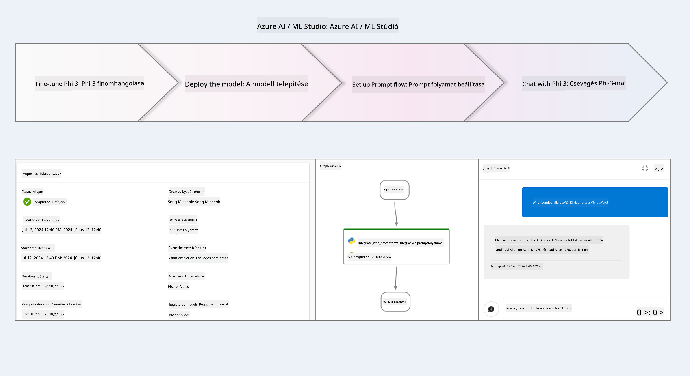

### Tartalomjegyzék

1. **[1. szcenárió: Azure erőforrások beállítása és előkészítés a finomhangoláshoz](../../../../../../md/02.Application/01.TextAndChat/Phi3)**
    - [Azure Machine Learning Workspace létrehozása](../../../../../../md/02.Application/01.TextAndChat/Phi3)
    - [GPU kvóták igénylése az Azure előfizetésben](../../../../../../md/02.Application/01.TextAndChat/Phi3)
    - [Szerepkör-hozzárendelés hozzáadása](../../../../../../md/02.Application/01.TextAndChat/Phi3)
    - [Projekt beállítása](../../../../../../md/02.Application/01.TextAndChat/Phi3)
    - [Adatkészlet előkészítése finomhangoláshoz](../../../../../../md/02.Application/01.TextAndChat/Phi3)

1. **[2. szcenárió: Phi-3 modell finomhangolása és telepítése az Azure Machine Learning Studioban](../../../../../../md/02.Application/01.TextAndChat/Phi3)**
    - [Phi-3 modell finomhangolása](../../../../../../md/02.Application/01.TextAndChat/Phi3)
    - [Finomhangolt Phi-3 modell telepítése](../../../../../../md/02.Application/01.TextAndChat/Phi3)

1. **[3. szcenárió: Integráció a Prompt flow-val és csevegés az egyedi modelleddel az Azure AI Foundry-ban](../../../../../../md/02.Application/01.TextAndChat/Phi3)**
    - [Egyedi Phi-3 modell integrálása a Prompt flow-val](../../../../../../md/02.Application/01.TextAndChat/Phi3)
    - [Csevegés az egyedi Phi-3 modelleddel](../../../../../../md/02.Application/01.TextAndChat/Phi3)

## 1. szcenárió: Azure erőforrások beállítása és előkészítés a finomhangoláshoz

### Azure Machine Learning Workspace létrehozása

1. Írd be a *azure machine learning* kifejezést a portál oldal tetején található **keresősávba**, majd válaszd ki az **Azure Machine Learning** opciót.

    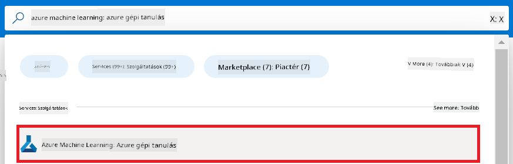

2. Válaszd a **+ Create** lehetőséget a navigációs menüből.

3. Válaszd a **New workspace** lehetőséget a navigációs menüből.

    

4. Végezze el a következő lépéseket:

    - Válaszd ki az Azure **Subscription**-t.
    - Válaszd ki a használni kívánt **Resource group**-ot (ha szükséges, hozz létre újat).
    - Add meg a **Workspace Name**-et. Egyedi értéknek kell lennie.
    - Válaszd ki a kívánt **Region**-t.
    - Válaszd ki a használni kívánt **Storage account**-ot (ha szükséges, hozz létre újat).
    - Válaszd ki a használni kívánt **Key vault**-ot (ha szükséges, hozz létre újat).
    - Válaszd ki a használni kívánt **Application insights**-t (ha szükséges, hozz létre újat).
    - Válaszd ki a használni kívánt **Container registry**-t (ha szükséges, hozz létre újat).

    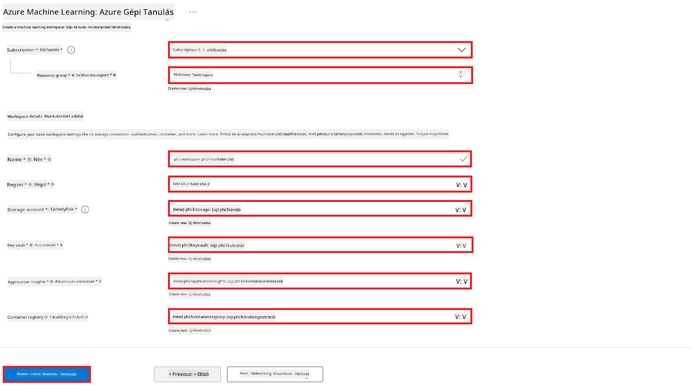

5. Válaszd a **Review + Create** lehetőséget.

6. Válaszd a **Create** gombot.

### GPU kvóták igénylése az Azure előfizetésben

Ebben a bemutatóban megtanulod, hogyan finomhangold és telepítsd a Phi-3 modellt GPU-k használatával. A finomhangoláshoz a *Standard_NC24ads_A100_v4* GPU-t fogod használni, amelyhez kvótaigénylés szükséges. A telepítéshez pedig a *Standard_NC6s_v3* GPU-t, amely szintén kvótaigénylést igényel.

> [!NOTE]
>
> Csak a Pay-As-You-Go előfizetések (az alapértelmezett előfizetés típus) jogosultak GPU-kiosztásra; a kedvezményes előfizetések jelenleg nem támogatottak.
>

1. Látogass el az [Azure ML Studio](https://ml.azure.com/home?wt.mc_id=studentamb_279723) oldalra.

1. Hajtsd végre a következő lépéseket a *Standard NCADSA100v4 Family* kvóta igényléséhez:

    - Válaszd a bal oldali fülön a **Quota** menüpontot.
    - Válaszd ki a használni kívánt **Virtual machine family**-t. Például válaszd a **Standard NCADSA100v4 Family Cluster Dedicated vCPUs**-t, amely tartalmazza a *Standard_NC24ads_A100_v4* GPU-t.
    - Válaszd a **Request quota** lehetőséget a navigációs menüből.

        

    - A Request quota oldalon add meg az új, kívánt **New cores limit** értéket. Például 24.
    - A Request quota oldalon válaszd a **Submit** gombot a GPU kvóta igényléséhez.

1. Hajtsd végre a következő lépéseket a *Standard NCSv3 Family* kvóta igényléséhez:

    - Válaszd a bal oldali fülön a **Quota** menüpontot.
    - Válaszd ki a használni kívánt **Virtual machine family**-t. Például válaszd a **Standard NCSv3 Family Cluster Dedicated vCPUs**-t, amely tartalmazza a *Standard_NC6s_v3* GPU-t.
    - Válaszd a **Request quota** lehetőséget a navigációs menüből.
    - A Request quota oldalon add meg az új, kívánt **New cores limit** értéket. Például 24.
    - A Request quota oldalon válaszd a **Submit** gombot a GPU kvóta igényléséhez.

### Szerepkör-hozzárendelés hozzáadása

A modellek finomhangolásához és telepítéséhez először létre kell hoznod egy User Assigned Managed Identity-t (UAI), és hozzá kell rendelni a megfelelő jogosultságokat. Ezt az UAI-t fogod használni az autentikációhoz a telepítés során.

#### User Assigned Managed Identity (UAI) létrehozása

1. Írd be a *managed identities* kifejezést a portál oldal tetején található **keresősávba**, majd válaszd ki a **Managed Identities** opciót.

    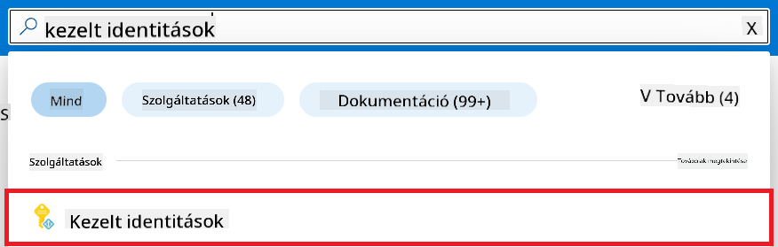

1. Válaszd a **+ Create** lehetőséget.

    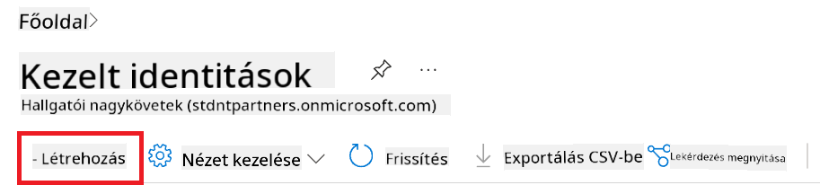

1. Végezze el a következő lépéseket:

    - Válaszd ki az Azure **Subscription**-t.
    - Válaszd ki a használni kívánt **Resource group**-ot (ha szükséges, hozz létre újat).
    - Válaszd ki a kívánt **Region**-t.
    - Add meg a **Name**-et. Egyedi értéknek kell lennie.

    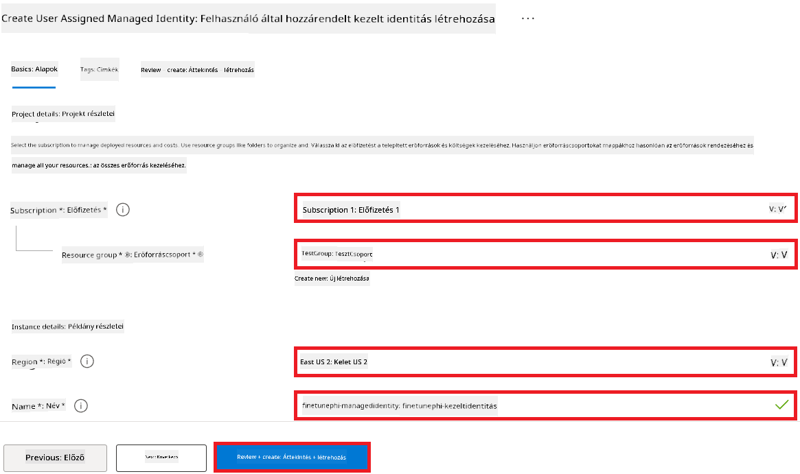

1. Válaszd a **Review + create** lehetőséget.

1. Válaszd a **+ Create** gombot.

#### Contributor szerepkör-hozzárendelés hozzáadása a Managed Identity-hez

1. Navigálj az általad létrehozott Managed Identity erőforráshoz.

1. Válaszd a bal oldali fülön az **Azure role assignments** lehetőséget.

1. Válaszd a navigációs menüből a **+Add role assignment** lehetőséget.

1. Az Add role assignment oldalon végezd el a következőket:
    - Állítsd be a **Scope**-ot **Resource group**-ra.
    - Válaszd ki az Azure **Subscription**-t.
    - Válaszd ki a használni kívánt **Resource group**-ot.
    - Válaszd a **Role**-nál a **Contributor** szerepkört.

    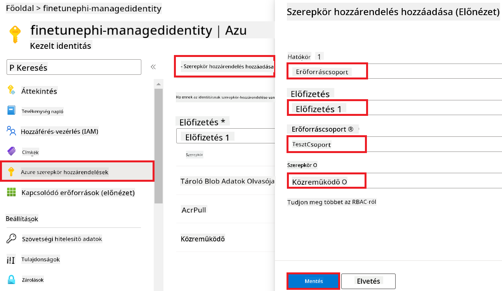

2. Válaszd a **Save** gombot.

#### Storage Blob Data Reader szerepkör-hozzárendelés hozzáadása a Managed Identity-hez

1. Írd be a *storage accounts* kifejezést a portál oldal tetején található **keresősávba**, majd válaszd ki a **Storage accounts** opciót.

    

1. Válaszd ki azt a storage accountot, amely az általad létrehozott Azure Machine Learning workspace-hez tartozik. Például *finetunephistorage*.

1. Végezze el a következő lépéseket az Add role assignment oldal megnyitásához:

    - Navigálj az Azure Storage accounthoz, amit létrehoztál.
    - Válaszd a bal oldali fülön az **Access Control (IAM)** lehetőséget.
    - Válaszd a navigációs menüből a **+ Add** lehetőséget.
    - Válaszd a navigációs menüből az **Add role assignment** lehetőséget.

    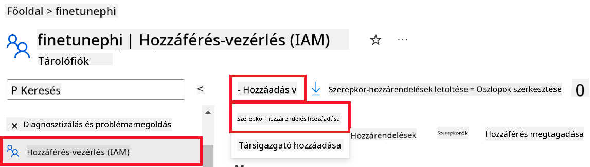

1. Az Add role assignment oldalon végezd el a következő lépéseket:

    - A Role oldalon írd be a keresősávba a *Storage Blob Data Reader* kifejezést, majd válaszd ki a megjelenő opciók közül a **Storage Blob Data Reader** szerepkört.
    - A Role oldalon válaszd a **Next** gombot.
    - A Members oldalon válaszd az **Assign access to** mezőnél a **Managed identity** lehetőséget.
    - A Members oldalon válaszd a **+ Select members** lehetőséget.
    - A Select managed identities oldalon válaszd ki az Azure **Subscription**-t.
    - A Select managed identities oldalon válaszd ki a **Managed identity**-t, azaz a korábban létrehozott Managed Identity-t.
    - A Select managed identities oldalon válaszd ki a létrehozott Managed Identity-t, például *finetunephi-managedidentity*.
    - A Select managed identities oldalon válaszd a **Select** gombot.

    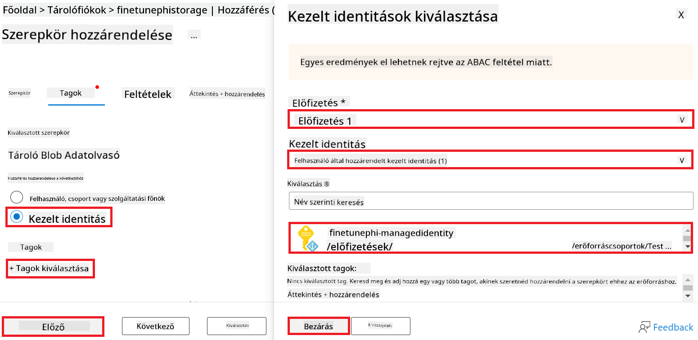

1. Válaszd a **Review + assign** lehetőséget.

#### AcrPull szerepkör-hozzárendelés hozzáadása a Managed Identity-hez

1. Írd be a *container registries* kifejezést a portál oldal tetején található **keresősávba**, majd válaszd ki a **Container registries** opciót.

    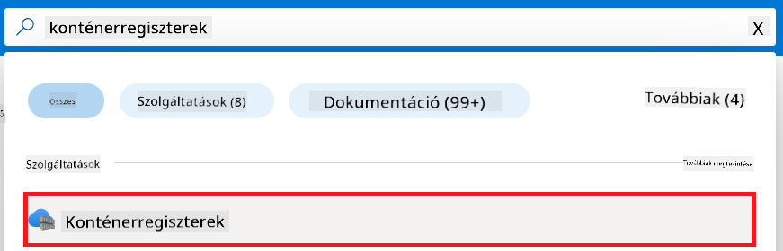

1. Válaszd ki azt a container registry-t, amely az Azure Machine Learning workspace-hez tartozik. Például *finetunephicontainerregistry*.

1. Végezze el a következő lépéseket az Add role assignment oldal megnyitásához:

    - Válaszd a bal oldali fülön az **Access Control (IAM)** lehetőséget.
    - Válaszd a navigációs menüből a **+ Add** lehetőséget.
    - Válaszd a navigációs menüből az **Add role assignment** lehetőséget.

1. Az Add role assignment oldalon végezd el a következő lépéseket:

    - A Role oldalon írd be a keresősávba az *AcrPull* kifejezést, majd válaszd ki a megjelenő opciók közül az **AcrPull** szerepkört.
    - A Role oldalon válaszd a **Next** gombot.
    - A Members oldalon válaszd az **Assign access to** mezőnél a **Managed identity** lehetőséget.
    - A Members oldalon válaszd a **+ Select members** lehetőséget.
    - A Select managed identities oldalon válaszd ki az Azure **Subscription**-t.
    - A Select managed identities oldalon válaszd ki a **Managed identity**-t, azaz a korábban létrehozott Managed Identity-t.
    - A Select managed identities oldalon válaszd ki a létrehozott Managed Identity-t, például *finetunephi-managedidentity*.
    - A Select managed identities oldalon válaszd a **Select** gombot.
    - Válaszd a **Review + assign** lehetőséget.

### Projekt beállítása

A finomhangoláshoz szükséges adatkészletek letöltéséhez helyi környezetet állítasz be.

Ebben a gyakorlatban:

- Létrehozol egy mappát, ahol dolgozni fogsz.
- Létrehozol egy virtuális környezetet.
- Telepíted a szükséges csomagokat.
- Létrehozol egy *download_dataset.py* fájlt az adatkészlet letöltéséhez.

#### Mappa létrehozása a munkához

1. Nyiss egy terminálablakot, és írd be a következő parancsot egy *finetune-phi* nevű mappa létrehozásához az alapértelmezett útvonalon.

    ```console
    mkdir finetune-phi
    ```

2. Írd be a következő parancsot a terminálban, hogy belépj a létrehozott *finetune-phi* mappába.

    ```console
    cd finetune-phi
    ```

#### Virtuális környezet létrehozása

1. Írd be a következő parancsot a terminálban egy *.venv* nevű virtuális környezet létrehozásához.

    ```console
    python -m venv .venv
    ```

2. Írd be a következő parancsot a terminálban a virtuális környezet aktiválásához.

    ```console
    .venv\Scripts\activate.bat
    ```

> [!NOTE]
> Ha sikerült, akkor a
1. Látogass el az [Azure ML Studio](https://ml.azure.com/home?wt.mc_id=studentamb_279723) oldalra.

1. Válaszd ki a bal oldali menüből a **Compute** lehetőséget.

1. A navigációs menüből válaszd a **Compute clusters** opciót.

1. Kattints a **+ New** gombra.

    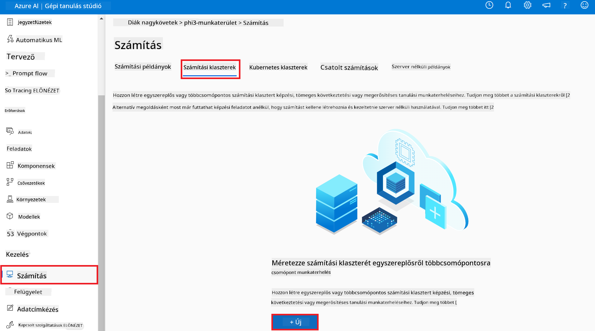

1. Végezze el a következő lépéseket:

    - Válaszd ki a kívánt **Region**-t.
    - Állítsd be a **Virtual machine tier** értékét **Dedicated**-re.
    - Állítsd be a **Virtual machine type** értékét **GPU**-ra.
    - A **Virtual machine size** szűrőjét állítsd **Select from all options**-ra.
    - Válaszd ki a **Virtual machine size**-t: **Standard_NC24ads_A100_v4**.

    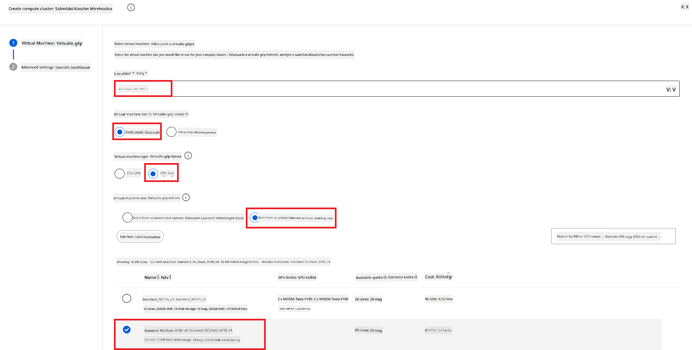

1. Kattints a **Next** gombra.

1. Végezze el a következő lépéseket:

    - Írd be a **Compute name**-et. Egyedi értéknek kell lennie.
    - Állítsd be a **Minimum number of nodes** értékét **0**-ra.
    - Állítsd be a **Maximum number of nodes** értékét **1**-re.
    - Állítsd be az **Idle seconds before scale down** értékét **120**-ra.

    

1. Kattints a **Create** gombra.

#### A Phi-3 modell finomhangolása

1. Látogass el az [Azure ML Studio](https://ml.azure.com/home?wt.mc_id=studentamb_279723) oldalra.

1. Válaszd ki az általad létrehozott Azure Machine Learning workspace-et.

    

1. Végezze el a következő lépéseket:

    - Válaszd ki a bal oldali menüből a **Model catalog**-ot.
    - Írd be a keresőmezőbe a *phi-3-mini-4k* kifejezést, majd válaszd ki a megjelenő opciók közül a **Phi-3-mini-4k-instruct** modellt.

    

1. Válaszd ki a navigációs menüből a **Fine-tune** opciót.

    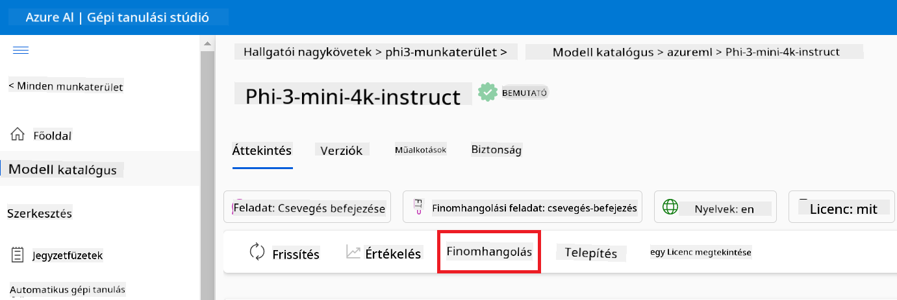

1. Végezze el a következő lépéseket:

    - Állítsd be a **Select task type** értékét **Chat completion**-re.
    - Kattints a **+ Select data** gombra, és töltsd fel a **Traning data**-t.
    - A validációs adat feltöltés típusát állítsd **Provide different validation data**-ra.
    - Kattints ismét a **+ Select data** gombra, és töltsd fel a **Validation data**-t.

    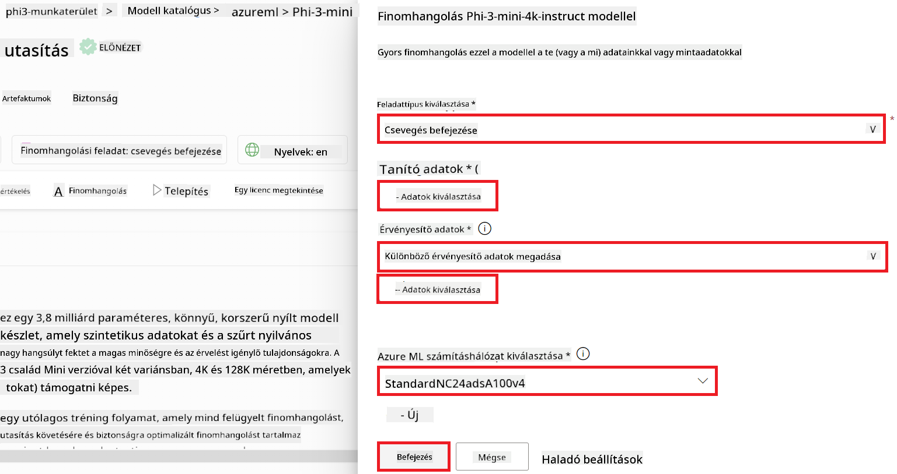

    > [!TIP]
    >
    > Az **Advanced settings** alatt testre szabhatod a konfigurációkat, például a **learning_rate** vagy a **lr_scheduler_type** beállításokat, hogy a finomhangolási folyamatot az igényeid szerint optimalizáld.

1. Kattints a **Finish** gombra.

1. Ebben a gyakorlatban sikeresen finomhangoltad a Phi-3 modellt az Azure Machine Learning segítségével. Fontos megjegyezni, hogy a finomhangolás hosszabb időt vehet igénybe. Miután elindítottad a finomhangolási feladatot, várnod kell, amíg befejeződik. A folyamat állapotát a bal oldali menü **Jobs** fülén követheted nyomon az Azure Machine Learning Workspace-ben. A következő részben telepíted a finomhangolt modellt, és integrálod a Prompt flow-val.

    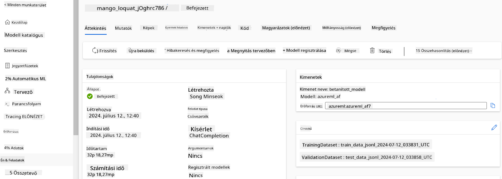

### A finomhangolt Phi-3 modell telepítése

Ahhoz, hogy a finomhangolt Phi-3 modellt integráld a Prompt flow-val, telepítened kell a modellt, hogy valós idejű lekérdezésekhez elérhető legyen. Ez a folyamat magában foglalja a modell regisztrálását, egy online végpont létrehozását és a modell telepítését.

Ebben a gyakorlatban:

- Regisztrálod a finomhangolt modellt az Azure Machine Learning workspace-ben.
- Létrehozol egy online végpontot.
- Telepíted a regisztrált finomhangolt Phi-3 modellt.

#### A finomhangolt modell regisztrálása

1. Látogass el az [Azure ML Studio](https://ml.azure.com/home?wt.mc_id=studentamb_279723) oldalra.

1. Válaszd ki az általad létrehozott Azure Machine Learning workspace-et.

    

1. Válaszd ki a bal oldali menüből a **Models** opciót.
1. Kattints a **+ Register** gombra.
1. Válaszd ki a **From a job output** lehetőséget.

    

1. Válaszd ki az általad létrehozott munkát.

    

1. Kattints a **Next** gombra.

1. Állítsd be a **Model type**-ot **MLflow**-ra.

1. Győződj meg róla, hogy a **Job output** ki van választva; ennek automatikusan ki kell választottnak lennie.

    

2. Kattints a **Next** gombra.

3. Kattints a **Register** gombra.

    

4. A regisztrált modelljeidet megtekintheted a bal oldali menü **Models** menüpontjában.

    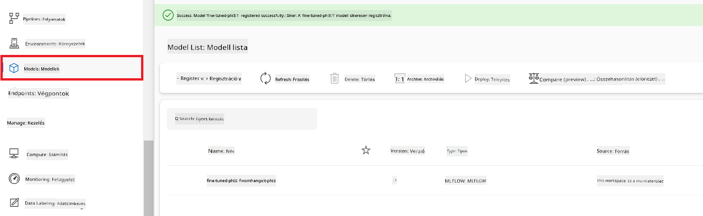

#### A finomhangolt modell telepítése

1. Navigálj az általad létrehozott Azure Machine Learning workspace-be.

1. Válaszd ki a bal oldali menüből az **Endpoints** opciót.

1. A navigációs menüből válaszd a **Real-time endpoints** lehetőséget.

    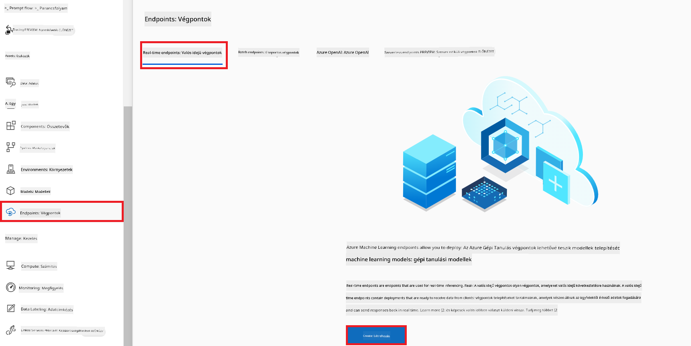

1. Kattints a **Create** gombra.

1. Válaszd ki a regisztrált modellt, amelyet létrehoztál.

    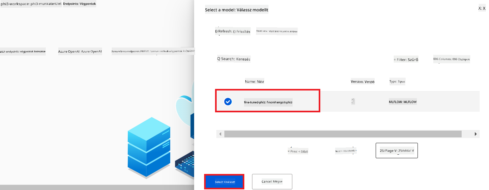

1. Kattints a **Select** gombra.

1. Végezze el a következő beállításokat:

    - Válaszd ki a **Virtual machine**-t: *Standard_NC6s_v3*.
    - Állítsd be az **Instance count** értékét a kívánt számra, például *1*.
    - Az **Endpoint** beállítását állítsd **New**-ra egy új végpont létrehozásához.
    - Írd be az **Endpoint name**-et. Egyedi értéknek kell lennie.
    - Írd be a **Deployment name**-et. Egyedi értéknek kell lennie.

    

1. Kattints a **Deploy** gombra.

> [!WARNING]
> Az esetleges további költségek elkerülése érdekében győződj meg róla, hogy törlöd a létrehozott végpontot az Azure Machine Learning workspace-ben.
>

#### A telepítés állapotának ellenőrzése az Azure Machine Learning Workspace-ben

1. Navigálj az általad létrehozott Azure Machine Learning workspace-be.

1. Válaszd ki a bal oldali menüből az **Endpoints** opciót.

1. Válaszd ki a létrehozott végpontot.

    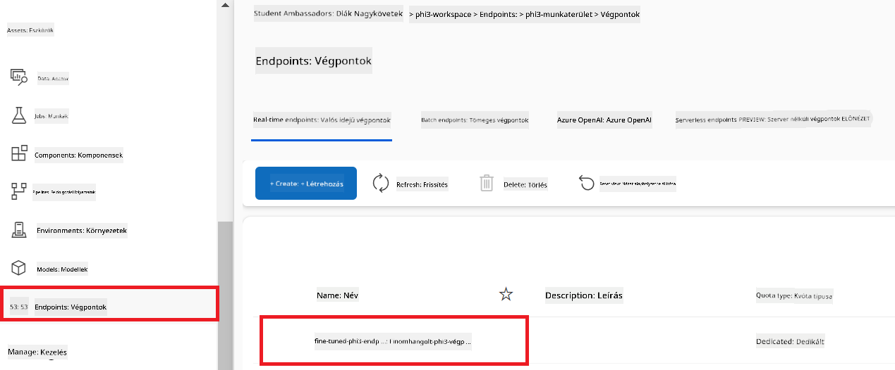

1. Ezen az oldalon kezelheted a végpontokat a telepítés folyamata alatt.

> [!NOTE]
> A telepítés befejezése után győződj meg róla, hogy a **Live traffic** értéke **100%**. Ha nem, válaszd az **Update traffic** opciót a forgalom beállításainak módosításához. Ne feledd, ha a forgalom 0%-ra van állítva, nem tudod tesztelni a modellt.
>
> 
>

## 3. Forgatókönyv: Integráció a Prompt flow-val és beszélgetés az egyedi modelleddel az Azure AI Foundry-ban

### Az egyedi Phi-3 modell integrálása a Prompt flow-val

Miután sikeresen telepítetted a finomhangolt modellt, most integrálhatod azt a Prompt Flow-val, hogy valós idejű alkalmazásokban használd, és különféle interaktív feladatokat végezhess az egyedi Phi-3 modelleddel.

Ebben a gyakorlatban:

- Létrehozol egy Azure AI Foundry Hub-ot.
- Létrehozol egy Azure AI Foundry Project-et.
- Létrehozol egy Prompt flow-t.
- Hozzáadsz egy egyedi kapcsolatot a finomhangolt Phi-3 modellhez.
- Beállítod a Prompt flow-t, hogy beszélgessen az egyedi Phi-3 modelleddel.

> [!NOTE]
> A Promptflow integrációt az Azure ML Studio-n keresztül is elvégezheted. Az integrációs folyamat ugyanígy alkalmazható az Azure ML Studio-ban is.

#### Azure AI Foundry Hub létrehozása

A projekt létrehozása előtt szükség van egy Hub-ra. A Hub olyan, mint egy Resource Group, amely lehetővé teszi több projekt szervezését és kezelését az Azure AI Foundry-n belül.

1. Látogass el az [Azure AI Foundry](https://ai.azure.com/?WT.mc_id=aiml-137032-kinfeylo) oldalra.

1. Válaszd ki a bal oldali menüből az **All hubs** opciót.

1. A navigációs menüből válaszd a **+ New hub** lehetőséget.

    

1. Végezze el a következő lépéseket:

    - Írd be a **Hub name**-et. Egyedi értéknek kell lennie.
    - Válaszd ki az Azure **Subscription**-t.
    - Válaszd ki a használni kívánt **Resource group**-ot (ha szükséges, hozz létre újat).
    - Válaszd ki a kívánt **Location**-t.
    - Válaszd ki a használni kívánt **Connect Azure AI Services**-t (ha szükséges, hozz létre újat).
    - A **Connect Azure AI Search** beállítást állítsd **Skip connecting**-re.

    

1. Kattints a **Next** gombra.

#### Azure AI Foundry Project létrehozása

1. Az általad létrehozott Hub-ban válaszd ki a bal oldali menüből az **All projects** opciót.

1. A navigációs menüből válaszd a **+ New project** lehetőséget.

    

1. Írd be a **Project name**-et. Egyedi értéknek kell lennie.

    

1. Kattints a **Create a project** gombra.

#### Egyedi kapcsolat hozzáadása a finomhangolt Phi-3 modellhez

Ahhoz, hogy az egyedi Phi-3 modellt integráld a Prompt flow-val, el kell mentened a modell végpontját és kulcsát egy egyedi kapcsolatként. Ez a beállítás biztosítja, hogy a Prompt flow hozzáférjen az egyedi Phi-3 modelledhez.

#### Az api kulcs és az endpoint URI beállítása a finomhangolt Phi-3 modellhez

1. Látogass el az [Azure ML Studio](https://ml.azure.com/home?WT.mc_id=aiml-137032-kinfeylo) oldalra.

1. Navigálj az általad létrehozott Azure Machine Learning workspace-be.

1. Válaszd ki a bal oldali menüből az **Endpoints** opciót.

    

1. Válaszd ki a létrehozott végpontot.

    

1. A navigációs menüből válaszd a **Consume** opciót.

1. Másold ki a **REST endpoint**-ot és a **Primary key**-t.


#### Egyedi kapcsolat hozzáadása

1. Látogass el az [Azure AI Foundry](https://ai.azure.com/?WT.mc_id=aiml-137032-kinfeylo) oldalra.

1. Navigálj az általad létrehozott Azure AI Foundry projekthez.

1. A létrehozott projektben válaszd a bal oldali fülön a **Beállítások** menüpontot.

1. Válaszd a **+ Új kapcsolat** lehetőséget.

    

1. A navigációs menüből válaszd a **Custom keys** opciót.

    

1. Hajtsd végre a következő lépéseket:

    - Válaszd a **+ Kulcspár hozzáadása** lehetőséget.
    - A kulcs neve legyen **endpoint**, és illeszd be az Azure ML Studioból másolt endpointot az érték mezőbe.
    - Ismét válaszd a **+ Kulcspár hozzáadása** opciót.
    - A kulcs neve legyen **key**, és illeszd be az Azure ML Studioból másolt kulcsot az érték mezőbe.
    - A kulcsok hozzáadása után jelöld be az **is secret** opciót, hogy a kulcs ne legyen nyilvánosan látható.

    

1. Válaszd az **Add connection** gombot.

#### Prompt flow létrehozása

Hozzáadtál egy egyedi kapcsolatot az Azure AI Foundry-ban. Most hozzunk létre egy Prompt flow-t az alábbi lépésekkel. Ezután csatlakoztatni fogod a Prompt flow-t az egyedi kapcsolathoz, hogy a finomhangolt modellt használni tudd a Prompt flow-n belül.

1. Navigálj az általad létrehozott Azure AI Foundry projekthez.

1. Válaszd a bal oldali fülön a **Prompt flow** menüpontot.

1. A navigációs menüből válaszd a **+ Create** lehetőséget.

    

1. Válaszd a navigációs menüből a **Chat flow** opciót.

    

1. Írd be a használni kívánt **Mappa nevét**.

    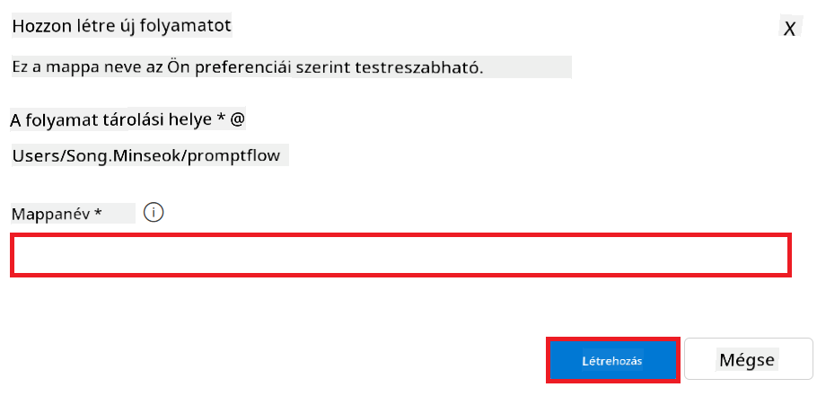

2. Válaszd a **Create** gombot.

#### Prompt flow beállítása a saját Phi-3 modellel való csevegéshez

Integrálnod kell a finomhangolt Phi-3 modellt a Prompt flow-ba. Azonban a meglévő Prompt flow nem erre a célra készült, ezért újra kell tervezned a Prompt flow-t, hogy támogassa az egyedi modell integrációját.

1. A Prompt flow-ban végezd el a következőket a meglévő folyamat újraépítéséhez:

    - Válaszd a **Raw file mode** módot.
    - Töröld az összes meglévő kódot a *flow.dag.yml* fájlból.
    - Illeszd be a következő kódot a *flow.dag.yml* fájlba.

        ```yml
        inputs:
          input_data:
            type: string
            default: "Who founded Microsoft?"

        outputs:
          answer:
            type: string
            reference: ${integrate_with_promptflow.output}

        nodes:
        - name: integrate_with_promptflow
          type: python
          source:
            type: code
            path: integrate_with_promptflow.py
          inputs:
            input_data: ${inputs.input_data}
        ```

    - Válaszd a **Mentés** gombot.

    

1. Add hozzá a következő kódot az *integrate_with_promptflow.py* fájlhoz, hogy a Prompt flow-ban használd az egyedi Phi-3 modellt.

    ```python
    import logging
    import requests
    from promptflow import tool
    from promptflow.connections import CustomConnection

    # Logging setup
    logging.basicConfig(
        format="%(asctime)s - %(levelname)s - %(name)s - %(message)s",
        datefmt="%Y-%m-%d %H:%M:%S",
        level=logging.DEBUG
    )
    logger = logging.getLogger(__name__)

    def query_phi3_model(input_data: str, connection: CustomConnection) -> str:
        """
        Send a request to the Phi-3 model endpoint with the given input data using Custom Connection.
        """

        # "connection" is the name of the Custom Connection, "endpoint", "key" are the keys in the Custom Connection
        endpoint_url = connection.endpoint
        api_key = connection.key

        headers = {
            "Content-Type": "application/json",
            "Authorization": f"Bearer {api_key}"
        }
        data = {
            "input_data": {
                "input_string": [
                    {"role": "user", "content": input_data}
                ],
                "parameters": {
                    "temperature": 0.7,
                    "max_new_tokens": 128
                }
            }
        }
        try:
            response = requests.post(endpoint_url, json=data, headers=headers)
            response.raise_for_status()
            
            # Log the full JSON response
            logger.debug(f"Full JSON response: {response.json()}")

            result = response.json()["output"]
            logger.info("Successfully received response from Azure ML Endpoint.")
            return result
        except requests.exceptions.RequestException as e:
            logger.error(f"Error querying Azure ML Endpoint: {e}")
            raise

    @tool
    def my_python_tool(input_data: str, connection: CustomConnection) -> str:
        """
        Tool function to process input data and query the Phi-3 model.
        """
        return query_phi3_model(input_data, connection)

    ```

    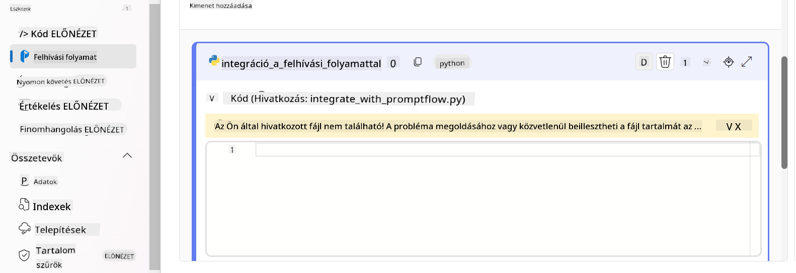

> [!NOTE]
> Részletesebb információkért az Azure AI Foundry-ban történő Prompt flow használatról, lásd a [Prompt flow in Azure AI Foundry](https://learn.microsoft.com/azure/ai-studio/how-to/prompt-flow) dokumentációt.

1. Válaszd a **Chat input** és **Chat output** opciókat, hogy engedélyezd a csevegést a modelleddel.

    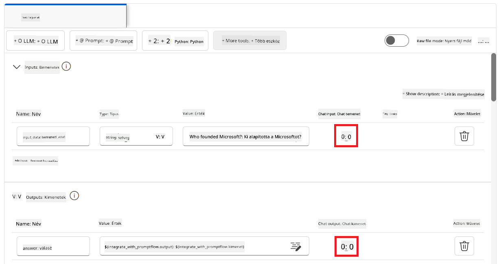

1. Most már készen állsz arra, hogy csevegj a saját Phi-3 modelleddel. A következő gyakorlatban megtanulod, hogyan indítsd el a Prompt flow-t, és hogyan használhatod a finomhangolt Phi-3 modelleddel való csevegéshez.

> [!NOTE]
>
> Az újraépített folyamatnak a következő képhez hasonlónak kell lennie:
>
> 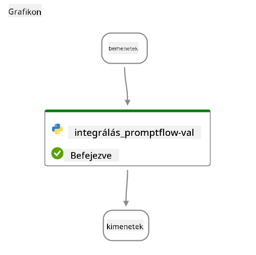
>

### Csevegj a saját Phi-3 modelleddel

Most, hogy finomhangoltad és integráltad a saját Phi-3 modelledet a Prompt flow-val, készen állsz a vele való interakcióra. Ez a gyakorlat végigvezet a beállítás és a csevegés elindításának folyamatán a modelleddel a Prompt flow segítségével. Ezeknek a lépéseknek a követésével teljes mértékben kihasználhatod a finomhangolt Phi-3 modell képességeit különféle feladatok és beszélgetések során.

- Csevegj a saját Phi-3 modelleddel a Prompt flow használatával.

#### Prompt flow indítása

1. Válaszd a **Start compute sessions** lehetőséget a Prompt flow elindításához.

    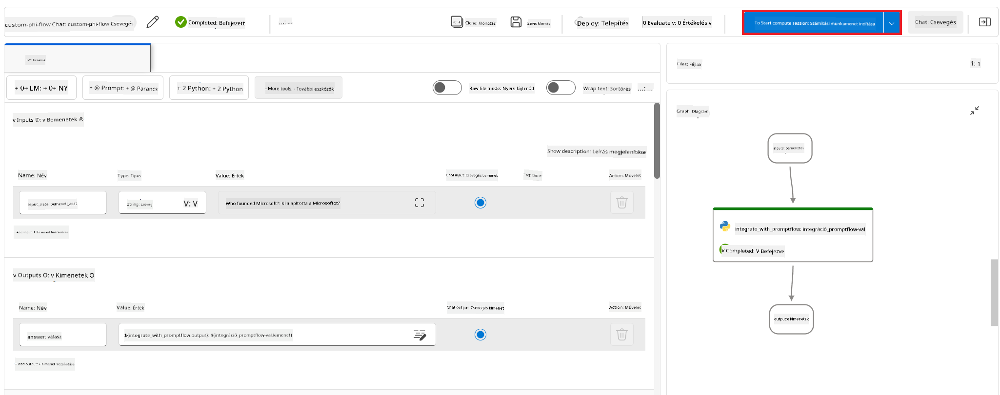

1. Válaszd a **Validate and parse input** opciót a paraméterek frissítéséhez.

    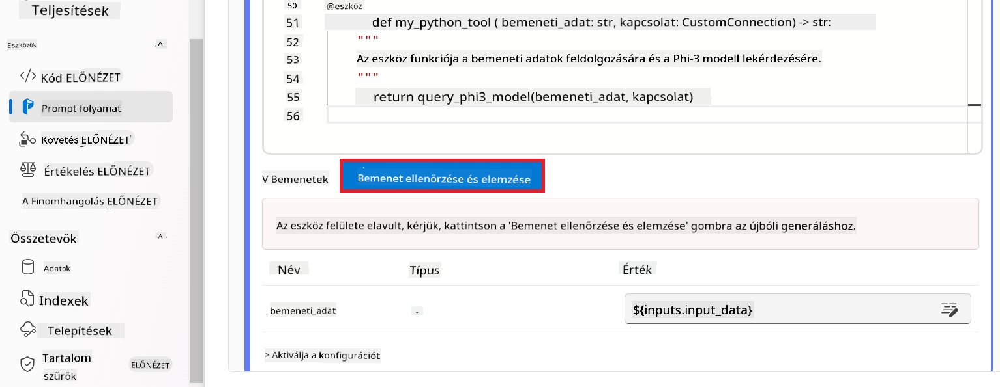

1. Válaszd ki a **connection** értékét az általad létrehozott egyedi kapcsolathoz. Például *connection*.

    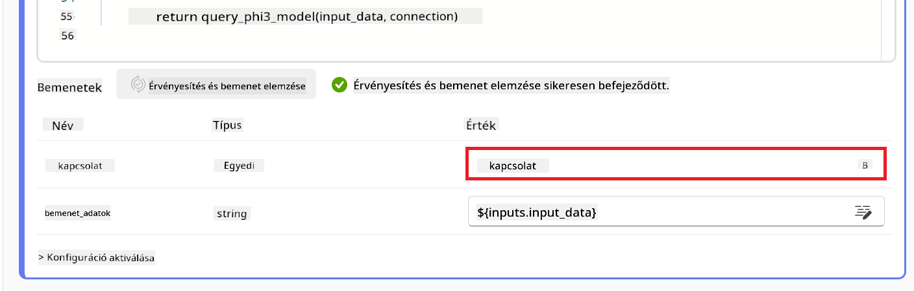

#### Csevegj az egyedi modelleddel

1. Válaszd a **Chat** lehetőséget.

    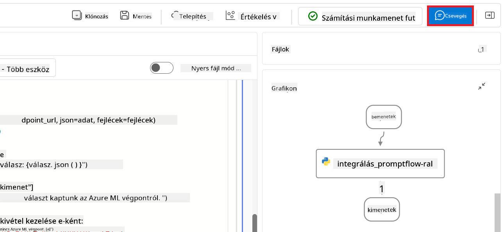

1. Íme egy példa az eredményekre: Most már cseveghetsz a saját Phi-3 modelleddel. Ajánlott olyan kérdéseket feltenni, amelyek a finomhangoláshoz használt adatokra épülnek.

    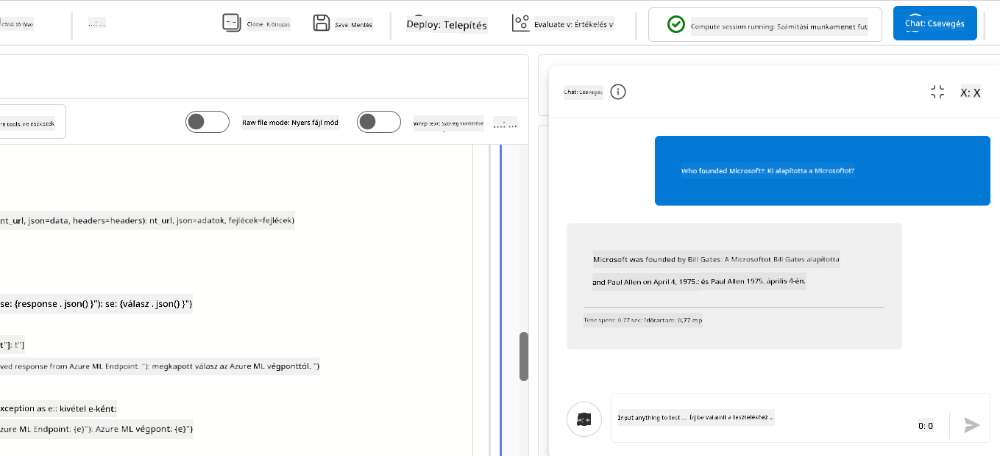

**Felelősségkizárás**:  
Ezt a dokumentumot az AI fordító szolgáltatás, a [Co-op Translator](https://github.com/Azure/co-op-translator) segítségével fordítottuk le. Bár az pontosságra törekszünk, kérjük, vegye figyelembe, hogy az automatikus fordítások hibákat vagy pontatlanságokat tartalmazhatnak. Az eredeti dokumentum a saját nyelvén tekintendő hivatalos forrásnak. Kritikus információk esetén szakmai, emberi fordítást javasolunk. Nem vállalunk felelősséget az ebből a fordításból eredő félreértésekért vagy téves értelmezésekért.