<!--
CO_OP_TRANSLATOR_METADATA:
{
  "original_hash": "0df910a227098303cc392b6ad204c271",
  "translation_date": "2026-01-06T05:00:48+00:00",
  "source_file": "md/02.Application/01.TextAndChat/Phi3/E2E_Phi-3-FineTuning_PromptFlow_Integration_AIFoundry.md",
  "language_code": "hu"
}
-->
# Fine-tune és integráld az egyedi Phi-3 modelleket a Prompt flow-val az Azure AI Foundry-ban

Ez az end-to-end (E2E) példa a Microsoft Tech Community "[Fine-Tune and Integrate Custom Phi-3 Models with Prompt Flow in Azure AI Foundry](https://techcommunity.microsoft.com/t5/educator-developer-blog/fine-tune-and-integrate-custom-phi-3-models-with-prompt-flow-in/ba-p/4191726?WT.mc_id=aiml-137032-kinfeylo)" útmutatóján alapul. Bemutatja az egyedi Phi-3 modellek finomhangolásának, telepítésének és a Prompt flow-val való integrálásának folyamatait az Azure AI Foundry-ban.
Az E2E mintától eltérően, amely a "[Fine-Tune and Integrate Custom Phi-3 Models with Prompt Flow](./E2E_Phi-3-FineTuning_PromptFlow_Integration.md)" futtatásával helyileg dolgozott, ez a bemutató teljes egészében az Azure AI / ML Studioban végzett model finomhangolásra és integrációra összpontosít.

## Áttekintés

Ebben az E2E példában megtanulod, hogyan kell finomhangolni a Phi-3 modellt és integrálni a Prompt flow-val az Azure AI Foundry-ban. Az Azure AI / ML Studio alkalmazásával felállítasz egy munkafolyamatot egyedi MI modellek telepítésére és használatára. Ez az E2E minta három forgatókönyvre van bontva:

**1. Forgatókönyv: Azure erőforrások beállítása és a finomhangolás előkészítése**

**2. Forgatókönyv: Phi-3 modell finomhangolása és telepítése az Azure Machine Learning Studioban**

**3. Forgatókönyv: Integráció a Prompt flow-val és beszélgetés az egyedi modelleddel az Azure AI Foundry-ban**

Itt egy áttekintés erről az E2E példáról.


### Tartalomjegyzék

1. **[1. Forgatókönyv: Azure erőforrások beállítása és a finomhangolás előkészítése](../../../../../../md/02.Application/01.TextAndChat/Phi3)**
    - [Azure Machine Learning munkaterület létrehozása](../../../../../../md/02.Application/01.TextAndChat/Phi3)
    - [GPU kvóták igénylése az Azure előfizetésben](../../../../../../md/02.Application/01.TextAndChat/Phi3)
    - [Szerepkör hozzárendelés hozzáadása](../../../../../../md/02.Application/01.TextAndChat/Phi3)
    - [Projekt beállítása](../../../../../../md/02.Application/01.TextAndChat/Phi3)
    - [Adathalmaz előkészítése a finomhangoláshoz](../../../../../../md/02.Application/01.TextAndChat/Phi3)

1. **[2. Forgatókönyv: Phi-3 modell finomhangolása és telepítése az Azure Machine Learning Studioban](../../../../../../md/02.Application/01.TextAndChat/Phi3)**
    - [Phi-3 modell finomhangolása](../../../../../../md/02.Application/01.TextAndChat/Phi3)
    - [Finomhangolt Phi-3 modell telepítése](../../../../../../md/02.Application/01.TextAndChat/Phi3)

1. **[3. Forgatókönyv: Integráció a Prompt flow-val és beszélgetés az egyedi modelleddel az Azure AI Foundry-ban](../../../../../../md/02.Application/01.TextAndChat/Phi3)**
    - [Egyedi Phi-3 modell integrálása a Prompt flow-val](../../../../../../md/02.Application/01.TextAndChat/Phi3)
    - [Beszélgetés az egyedi Phi-3 modelleddel](../../../../../../md/02.Application/01.TextAndChat/Phi3)

## 1. Forgatókönyv: Azure erőforrások beállítása és a finomhangolás előkészítése

### Azure Machine Learning munkaterület létrehozása

1. Írd be az *azure machine learning* kifejezést a **keresősávba** az oldal tetején, és válaszd ki az opciók közül az **Azure Machine Learning** lehetőséget.

    

2. Válaszd a **+ Create** lehetőséget a navigációs menüből.

3. Válaszd ki a **New workspace** lehetőséget a navigációs menüből.

    

4. Végezze el a következő feladatokat:

    - Válaszd ki az Azure **Előfizetésed**.
    - Válaszd ki a használni kívánt **Erőforráscsoportot** (ha szükséges, hozz létre újat).
    - Add meg a **Munkaterület nevét**. Egyedi értéknek kell lennie.
    - Válaszd ki a kívánt **Régiót**.
    - Válaszd ki a használni kívánt **Tárhelyfiókot** (ha szükséges, hozz létre újat).
    - Válaszd ki a használni kívánt **Key vault-ot** (ha szükséges, hozz létre újat).
    - Válaszd ki a használni kívánt **Application insights** szolgáltatást (ha szükséges, hozz létre újat).
    - Válaszd ki a használni kívánt **Konténeregység-regisztrációt** (ha szükséges, hozz létre újat).

    

5. Válaszd a **Review + Create** lehetőséget.

6. Válaszd a **Create** gombot.

### GPU kvóták igénylése az Azure előfizetésben

Ebben a bemutatóban megtanulod, hogyan finomhangolhatsz és telepíthetsz egy Phi-3 modellt GPU-k használatával. Finomhangoláshoz a *Standard_NC24ads_A100_v4* GPU-t fogod használni, amely kvótaigénylést igényel. Telepítéshez a *Standard_NC6s_v3* GPU-t fogod használni, amely szintén kvótaigénylést igényel.

> [!NOTE]
>
> Csak a Pay-As-You-Go előfizetések (szabványos előfizetési típus) jogosultak GPU-kiosztásra; a kedvezményes előfizetések jelenleg nem támogatottak.
>

1. Látogass el az [Azure ML Studio](https://ml.azure.com/home?wt.mc_id=studentamb_279723) oldalra.

1. Végezze el a következőket a *Standard NCADSA100v4 Family* kvóta igényléséhez:

    - Válaszd a bal oldali menüben a **Quota** lehetőséget.
    - Válaszd ki a használni kívánt **Virtuális gép családot**. Például válaszd a **Standard NCADSA100v4 Family Cluster Dedicated vCPUs** lehetőséget, amely tartalmazza a *Standard_NC24ads_A100_v4* GPU-t.
    - Válaszd a navigációs menüből a **Request quota** lehetőséget.

        

    - Az Request quota oldalon add meg a használni kívánt **Új magkorlátot**. Például 24.
    - Az Request quota oldalon válaszd a **Submit** gombot a GPU kvóta igényléséhez.

1. Végezze el a következőket a *Standard NCSv3 Family* kvóta igényléséhez:

    - Válaszd a bal oldali menüben a **Quota** lehetőséget.
    - Válaszd ki a használni kívánt **Virtuális gép családot**. Például válaszd a **Standard NCSv3 Family Cluster Dedicated vCPUs** lehetőséget, amely tartalmazza a *Standard_NC6s_v3* GPU-t.
    - Válaszd a navigációs menüből a **Request quota** lehetőséget.
    - Az Request quota oldalon add meg a használni kívánt **Új magkorlátot**. Például 24.
    - Az Request quota oldalon válaszd a **Submit** gombot a GPU kvóta igényléséhez.

### Szerepkör hozzárendelés hozzáadása

A modellek finomhangolásához és telepítéséhez először létre kell hoznod egy Felhasználói Hozzárendelt Kezelt Identitást (User Assigned Managed Identity, UAI), és meg kell adnod neki a megfelelő jogosultságokat. Ezt az UAI-t azonosítási célokra fogod használni a telepítés során.

#### Felhasználói Hozzárendelt Kezelt Identitás létrehozása (UAI)

1. Írd be a *managed identities* kifejezést a **keresősávba** az oldal tetején, és válaszd ki az opciók közül a **Managed Identities** lehetőséget.

    

1. Válaszd a **+ Create** gombot.

    

1. Végezze el a következő feladatokat:

    - Válaszd ki az Azure **Előfizetésed**.
    - Válaszd ki a használni kívánt **Erőforráscsoportot** (ha szükséges, hozz létre újat).
    - Válaszd ki a kívánt **Régiót**.
    - Add meg a **Nevet**. Egyedi értéknek kell lennie.

    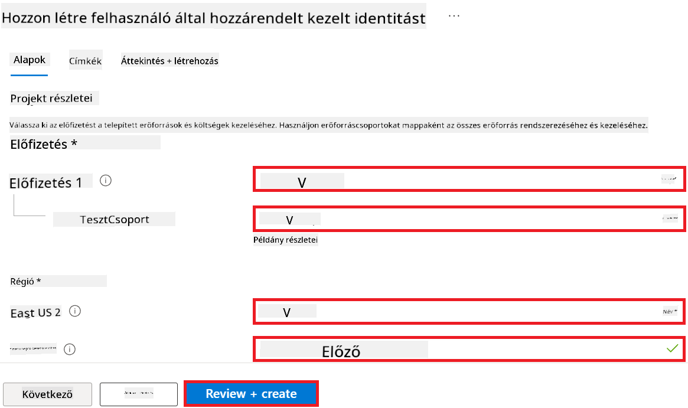

1. Válaszd a **Review + create** lehetőséget.

1. Válaszd a **+ Create** gombot.

#### Hozzáadás a Managed Identity-hez hozzárendelt Contributor szerepkört

1. Navigálj az általad létrehozott Managed Identity erőforráshoz.

1. Válaszd a bal oldali menüből az **Azure role assignments** lehetőséget.

1. Válaszd ki a navigációs menüből a **+Add role assignment** lehetőséget.

1. Az Add role assignment oldalon végezd el a következő feladatokat:
    - Állítsd be a **Scope** értékét **Resource group**-ra.
    - Válaszd ki az Azure **Előfizetésed**.
    - Válaszd ki a használni kívánt **Erőforráscsoportot**.
    - Válaszd a **Contributor** szerepkört.

    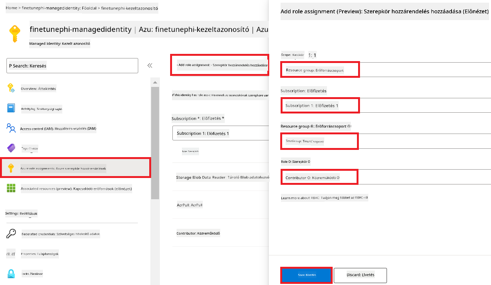

2. Válaszd a **Save** gombot.

#### Adja hozzá a Storage Blob Data Reader szerepkört a Managed Identity-hez

1. Írd be a *storage accounts* kifejezést a **keresősávba** az oldal tetején, és válaszd ki az opciók közül a **Storage accounts** lehetőséget.

    

1. Válaszd ki azt a tárhelyfiókot, amely az Azure Machine Learning munkaterülethez kapcsolódik, amelyet létrehoztál. Például: *finetunephistorage*.

1. Végezze el a következő lépéseket az Add role assignment oldal eléréséhez:

    - Navigálj az általad létrehozott Azure Storage-fiókhoz.
    - Válaszd a bal oldali menüből az **Access Control (IAM)** lehetőséget.
    - Válaszd a navigációs menüből a **+ Add** lehetőséget.
    - Válaszd a **Add role assignment** lehetőséget.

    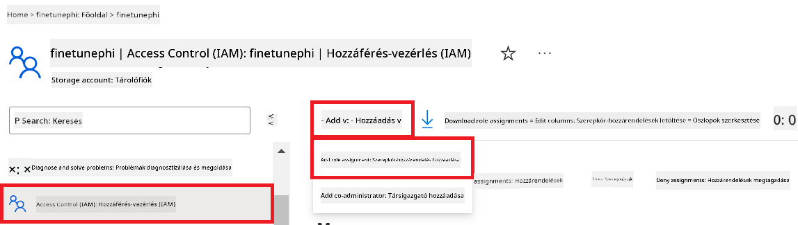

1. Az Add role assignment oldalon végezd el a következőket:

    - A Role oldalon írd be a **Storage Blob Data Reader** szót a keresősávba, és válaszd ki a megjelenő lehetőségek közül a **Storage Blob Data Reader**-t.
    - A Role oldalon válaszd a **Next** gombot.
    - A Members oldalon válaszd az **Assign access to** mezőnél a **Managed identity** lehetőséget.
    - A Members oldalon válaszd a **+ Select members** lehetőséget.
    - A Select managed identities oldalon válaszd ki az Azure **Előfizetésed**.
    - A Select managed identities oldalon válaszd ki a **Managed identity** típust, **Manage Identity**.
    - A Select managed identities oldalon válaszd ki az általad létrehozott Manage Identity-t. Például: *finetunephi-managedidentity*.
    - A Select managed identities oldalon válaszd a **Select** gombot.

    

1. Válaszd a **Review + assign** lehetőséget.

#### Add AcrPull szerepkör hozzárendelése a Managed Identity-hez

1. Írd be a *container registries* kifejezést a **keresősávba** az oldal tetején, és válaszd ki az opciók közül a **Container registries** lehetőséget.

    

1. Válaszd ki azt a konténeregység-regisztrációt, amely az Azure Machine Learning munkaterülethez tartozik. Például: *finetunephicontainerregistry*

1. Végezze el a következő lépéseket az Add role assignment oldal megnyitásához:

    - Válaszd a bal oldali menüből az **Access Control (IAM)** lehetőséget.
    - Válaszd a navigációs menüből a **+ Add** lehetőséget.
    - Válaszd a **Add role assignment** lehetőséget.

1. Az Add role assignment oldalon végezze el a következőket:

    - A Role oldalon írd be az *AcrPull* szót a keresősávba, és válaszd ki a megjelenő lehetőségek közül az **AcrPull**-t.
    - A Role oldalon válaszd a **Next** gombot.
    - A Members oldalon válaszd az **Assign access to** mezőnél a **Managed identity** lehetőséget.
    - A Members oldalon válaszd a **+ Select members** lehetőséget.
    - A Select managed identities oldalon válaszd ki az Azure **Előfizetésed**.
    - A Select managed identities oldalon válaszd ki a **Managed identity** típust, **Manage Identity**.
    - A Select managed identities oldalon válaszd ki az általad létrehozott Manage Identity-t. Például: *finetunephi-managedidentity*.
    - A Select managed identities oldalon válaszd a **Select** gombot.
    - Válaszd a **Review + assign** gombot.

### Projekt beállítása

A finomhangoláshoz szükséges adathalmazok letöltéséhez létrehozol egy helyi környezetet.

Ebben a gyakorlatban a következőket fogod megtenni:

- Egy mappa létrehozása a munkához.
- Virtuális környezet létrehozása.
- A szükséges csomagok telepítése.
- Egy *download_dataset.py* fájl létrehozása az adathalmaz letöltéséhez.

#### Mappa létrehozása a munkához

1. Nyiss meg egy terminálablakot és írd be a következő parancsot egy *finetune-phi* nevű mappa létrehozásához az alapértelmezett elérési út alatt.

    ```console
    mkdir finetune-phi
    ```

2. Írja be a következő parancsot a terminálba, hogy a létrehozott *finetune-phi* mappába lépjen.

    ```console
    cd finetune-phi
    ```

#### Virtuális környezet létrehozása

1. Írja be a következő parancsot a terminálba egy *.venv* nevű virtuális környezet létrehozásához.

    ```console
    python -m venv .venv
    ```

2. Írja be a következő parancsot a terminálba a virtuális környezet aktiválásához.

    ```console
    .venv\Scripts\activate.bat
    ```

> [!NOTE]
> Ha sikerült, a parancssor előtt meg kell jelennie a *(.venv)* jelzésnek.

#### A szükséges csomagok telepítése

1. Írja be a következő parancsokat a terminálba a szükséges csomagok telepítéséhez.

    ```console
    pip install datasets==2.19.1
    ```

#### `donload_dataset.py` létrehozása

> [!NOTE]
> Teljes mappaszerkezet:
>
> ```text
> └── YourUserName
> .    └── finetune-phi
> .        └── download_dataset.py
> ```

1. Nyissa meg a **Visual Studio Code**-ot.

1. Válassza ki a menüsorból a **File** opciót.

1. Válassza az **Open Folder** menüpontot.

1. Válassza ki a létrehozott *finetune-phi* mappát, amely helyileg a *C:\Users\yourUserName\finetune-phi* útvonalon található.

    

1. A Visual Studio Code bal oldali ablaktábláján kattintson jobb gombbal, és válassza a **New File** opciót, hogy létrehozzon egy új fájlt *download_dataset.py* néven.

    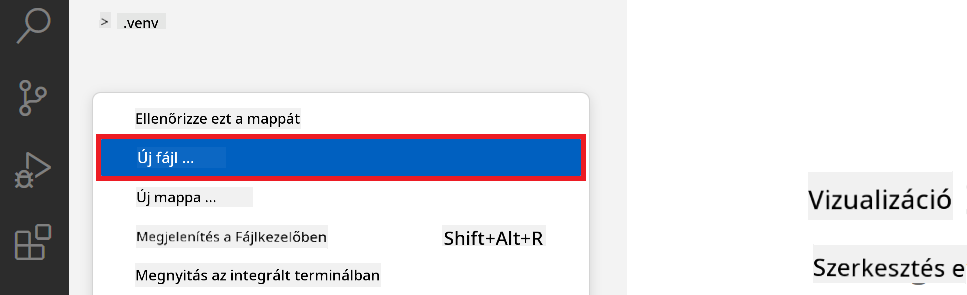

### Adatkészlet előkészítése finomhangoláshoz

Ebben a gyakorlatban a *download_dataset.py* fájlt futtatja, hogy letöltse az *ultrachat_200k* adatokat a helyi környezetébe. Ezt az adatállományt használja majd a Phi-3 modell finomhangolásához az Azure Machine Learningben.

Ebben a gyakorlatban a következőket teszi:

- Kódot ad hozzá a *download_dataset.py* fájlhoz az adatkészletek letöltéséhez.
- Futtatja a *download_dataset.py* fájlt, hogy letöltse az adatokat a helyi környezetbe.

#### Adatkészlet letöltése a *download_dataset.py* segítségével

1. Nyissa meg a *download_dataset.py* fájlt a Visual Studio Code-ban.

1. Adja hozzá a következő kódot a *download_dataset.py* fájlhoz.

    ```python
    import json
    import os
    from datasets import load_dataset

    def load_and_split_dataset(dataset_name, config_name, split_ratio):
        """
        Load and split a dataset.
        """
        # Töltse be az adott nevű, konfigurációjú és felosztási arányú adatkészletet
        dataset = load_dataset(dataset_name, config_name, split=split_ratio)
        print(f"Original dataset size: {len(dataset)}")
        
        # Ossza fel az adatkészletet tanító és teszt készletekre (80% tanító, 20% teszt)
        split_dataset = dataset.train_test_split(test_size=0.2)
        print(f"Train dataset size: {len(split_dataset['train'])}")
        print(f"Test dataset size: {len(split_dataset['test'])}")
        
        return split_dataset

    def save_dataset_to_jsonl(dataset, filepath):
        """
        Save a dataset to a JSONL file.
        """
        # Hozza létre a könyvtárat, ha nem létezik
        os.makedirs(os.path.dirname(filepath), exist_ok=True)
        
        # Nyissa meg a fájlt írási módban
        with open(filepath, 'w', encoding='utf-8') as f:
            # Iteráljon végig az adatkészlet minden rekordján
            for record in dataset:
                # Írja ki a rekordot JSON objektumként és mentse a fájlba
                json.dump(record, f)
                # Írjon egy újsor karaktert a rekordok elválasztására
                f.write('\n')
        
        print(f"Dataset saved to {filepath}")

    def main():
        """
        Main function to load, split, and save the dataset.
        """
        # Töltse be és ossza fel az ULTRACHAT_200k adatkészletet egy adott konfigurációval és felosztási aránnyal
        dataset = load_and_split_dataset("HuggingFaceH4/ultrachat_200k", 'default', 'train_sft[:1%]')
        
        # Vonja ki a tanító és teszt adatkészleteket a felosztásból
        train_dataset = dataset['train']
        test_dataset = dataset['test']

        # Mentse a tanító adatkészletet egy JSONL fájlba
        save_dataset_to_jsonl(train_dataset, "data/train_data.jsonl")
        
        # Mentse a teszt adatkészletet külön JSONL fájlba
        save_dataset_to_jsonl(test_dataset, "data/test_data.jsonl")

    if __name__ == "__main__":
        main()

    ```

1. Írja be a következő parancsot a terminálba, hogy futtassa a scriptet, és letöltse az adatkészletet a helyi környezetbe.

    ```console
    python download_dataset.py
    ```

1. Ellenőrizze, hogy az adatok sikeresen el lettek-e mentve a helyi *finetune-phi/data* könyvtárban.

> [!NOTE]
>
> #### Megjegyzés az adatkészlet méretéről és a finomhangolás idejéről
>
> Ebben a bemutatóban az adatkészlet csak 1%-át használjuk (`split='train[:1%]'`). Ez jelentősen csökkenti az adatok volumenét, gyorsítva ezzel mind a feltöltést, mind a finomhangolási folyamatot. A százalékarány módosítható, hogy megtalálja az optimális egyensúlyt a tanítási idő és a modell teljesítménye között. Az adatkészlet kisebb része lerövidíti a finomhangolás idejét, így a folyamat kezelhetőbbé válik egy oktató jellegű anyag számára.

## 2. forgatókönyv: Phi-3 modell finomhangolása és telepítése az Azure Machine Learning Studioban

### Phi-3 modell finomhangolása

Ebben a gyakorlatban a Phi-3 modellt finomhangolja az Azure Machine Learning Studioban.

Ebben a gyakorlatban a következőket teszi:

- Számítógép-klasztert hoz létre a finomhangoláshoz.
- Finomhangolja a Phi-3 modellt az Azure Machine Learning Studioban.

#### Számítógép-klaszter létrehozása a finomhangoláshoz

1. Látogasson el az [Azure ML Studio](https://ml.azure.com/home?wt.mc_id=studentamb_279723) oldalra.

1. Válassza a bal oldali fülek közül a **Compute** menüpontot.

1. Válassza a navigációs menüből a **Compute clusters** részt.

1. Kattintson a **+ New** gombra.

    

1. Végezze el a következő lépéseket:

    - Válassza ki a használni kívánt **Region** régiót.
    - Állítsa a **Virtual machine tier** értékét **Dedicated**-re.
    - Válassza a **Virtual machine type** értékét **GPU**-ra.
    - A **Virtual machine size** szűrőt állítsa **Select from all options**-ra.
    - Válassza a **Virtual machine size**-t **Standard_NC24ads_A100_v4** értékre.

    

1. Kattintson a **Next** gombra.

1. Végezze el a következő lépéseket:

    - Adja meg a **Compute name**-et. Egyedi értéknek kell lennie.
    - Állítsa be a **Minimum number of nodes** értékét **0**-ra.
    - Állítsa be a **Maximum number of nodes** értékét **1**-re.
    - Állítsa be az **Idle seconds before scale down** értékét **120**-ra.

    

1. Kattintson a **Create** gombra.

#### Phi-3 modell finomhangolása

1. Látogasson el az [Azure ML Studio](https://ml.azure.com/home?wt.mc_id=studentamb_279723) oldalra.

1. Válassza ki az Ön által létrehozott Azure Machine Learning munkaterületet.

    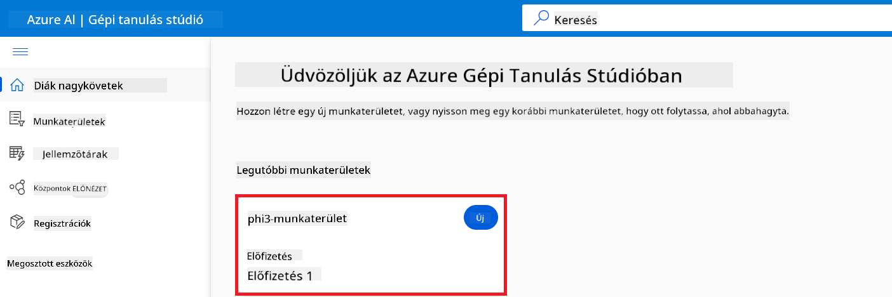

1. Végezze el a következőket:

    - Válassza ki a bal oldali fülön a **Model catalog** menüpontot.
    - Gépelje be a keresőmezőbe a *phi-3-mini-4k* kifejezést, majd a megjelenő opciók közül válassza ki a **Phi-3-mini-4k-instruct**-ot.

    

1. Válassza a navigációs menüből a **Fine-tune** opciót.

    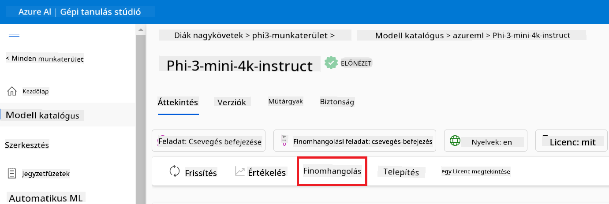

1. Végezze el a következő beállításokat:

    - Válassza ki a **Select task type** értékét **Chat completion**-re.
    - Kattintson a **+ Select data** gombra a **Training data** feltöltéséhez.
    - A validációs adatfeltöltés típusánál válassza a **Provide different validation data** opciót.
    - Kattintson a **+ Select data** gombra a **Validation data** feltöltéséhez.

    

> [!TIP]
>
> Az **Advanced settings** alatt testre szabhatja a konfigurációkat, például a **learning_rate** vagy a **lr_scheduler_type** értékeket, hogy optimalizálja a finomhangolási folyamatot az Ön igényei szerint.

1. Kattintson a **Finish** gombra.

1. Ebben a gyakorlatban sikeresen finomhangolta a Phi-3 modellt az Azure Machine Learning segítségével. Fontos megjegyezni, hogy a finomhangolási folyamat jelentős időt vehet igénybe. A finomhangolási feladat futtatása után várnia kell a folyamat befejezésére. A finomhangolási feladat státuszát a munkaterület bal oldalán található Jobs fülön követheti nyomon. A következő részben telepíti a finomhangolt modellt, és integrálja azt a Prompt flow-val.

    

### A finomhangolt Phi-3 modell telepítése

Ahhoz, hogy a finomhangolt Phi-3 modellt integrálja a Prompt flow-val, telepítenie kell a modellt, hogy elérhető legyen valós idejű lekérdezéshez. Ez a folyamat magában foglalja a modell regisztrálását, egy online végpont létrehozását és a modell telepítését.

Ebben a gyakorlatban a következőket teszi:

- Regisztrálja a finomhangolt modellt az Azure Machine Learning munkaterületen.
- Létrehoz egy online végpontot.
- Telepíti a regisztrált, finomhangolt Phi-3 modellt.

#### A finomhangolt modell regisztrálása

1. Látogasson el az [Azure ML Studio](https://ml.azure.com/home?wt.mc_id=studentamb_279723) oldalra.

1. Válassza ki az Ön által létrehozott Azure Machine Learning munkaterületet.

    

1. Válassza ki a bal oldali fülön a **Models** menüpontot.
1. Kattintson a **+ Register** gombra.
1. Válassza a **From a job output** opciót.

    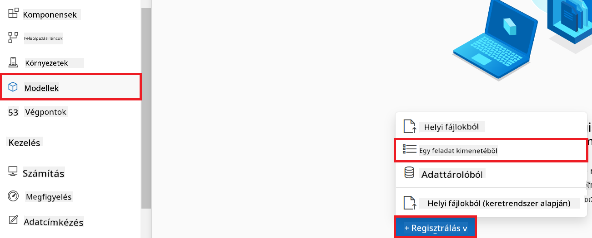

1. Válassza ki a létrehozott futási feladatot.

    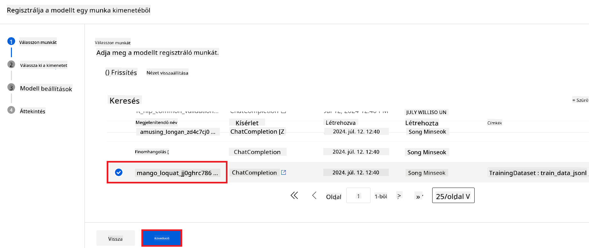

1. Kattintson a **Next** gombra.

1. Állítsa a **Model type** értékét **MLflow**-ra.

1. Győződjön meg róla, hogy a **Job output** be van jelölve; ez automatikusan ki kell legyen választva.

    

2. Kattintson a **Next** gombra.

3. Kattintson a **Register** gombra.

    

4. A regisztrált modell megtekintéséhez navigáljon a bal oldali fülön a **Models** menüpontra.

    

#### A finomhangolt modell telepítése

1. Navigáljon az Ön által létrehozott Azure Machine Learning munkaterületre.

1. Válassza ki a bal oldali fülön az **Endpoints** menüpontot.

1. Válassza a navigációs menüből a **Real-time endpoints** opciót.

    

1. Kattintson a **Create** gombra.

1. Válassza ki a korábban regisztrált modellt.

    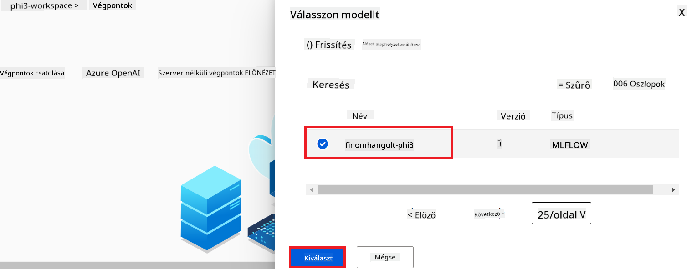

1. Kattintson a **Select** gombra.

1. Végezze el a következő beállításokat:

    - Állítsa be a **Virtual machine** értékét *Standard_NC6s_v3*-ra.
    - Válassza ki a kívánt **Instance count** értéket, pl. *1*.
    - Állítsa be az **Endpoint** értékét **New**-ra az új végpont létrehozásához.
    - Adja meg az **Endpoint name**-et. Egyedi értéknek kell lennie.
    - Adja meg a **Deployment name**-et. Egyedi értéknek kell lennie.

    

1. Kattintson a **Deploy** gombra.

> [!WARNING]
> Az esetleges további számlázási költségek elkerülése érdekében törölje a létrehozott végpontot az Azure Machine Learning munkaterületen.
>

#### Telepítés státuszának ellenőrzése az Azure Machine Learning munkaterületen

1. Navigáljon az Ön által létrehozott Azure Machine Learning munkaterületre.

1. Válassza ki a bal oldali fülön az **Endpoints** menüpontot.

1. Válassza ki a létrehozott végpontot.

    

1. Ezen az oldalon kezelheti a végpontokat a telepítési folyamat során.

> [!NOTE]
> Amint a telepítés befejeződik, győződjön meg róla, hogy a **Live traffic** értéke **100%**. Ha nem, válassza az **Update traffic** lehetőséget a forgalom beállításainak módosításához. Megjegyzés: a modellt nem lehet tesztelni, ha a forgalom 0%-ra van állítva.
>
> 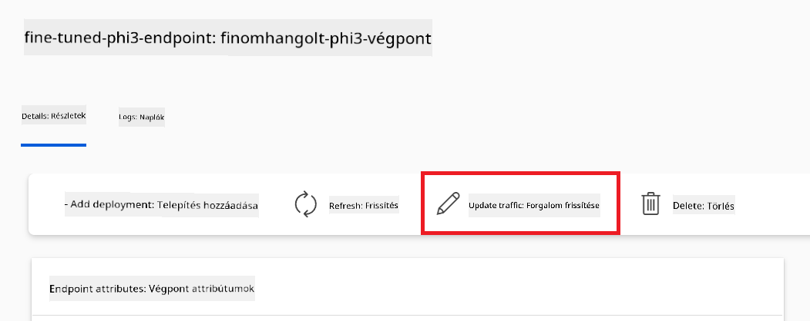
>

## 3. forgatókönyv: Integráció a Prompt flow-val és beszélgetés a saját modellen az Azure AI Foundry-ban

### Egyedi Phi-3 modell integrálása a Prompt flow-val

Miután sikeresen telepítette a finomhangolt modellt, most integrálhatja azt a Prompt Flow-val, hogy modellez valós idejű alkalmazásokat, lehetővé téve többféle interaktív feladatot az egyedi Phi-3 modellel.

Ebben a gyakorlatban a következőket teszi:

- Létrehoz egy Azure AI Foundry Hub-ot.
- Létrehoz egy Azure AI Foundry projektet.
- Létrehoz egy Prompt flow-t.
- Hozzáad egy egyedi kapcsolatot a finomhangolt Phi-3 modellhez.
- Beállítja a Prompt flow-t, hogy tudjon beszélgetni az egyedi Phi-3 modellel.

> [!NOTE]
> A Promptflow-val való integráció Azure ML Studio használatával is megvalósítható. A hasonló integrációs folyamat alkalmazható Azure ML Studio esetén is.

#### Azure AI Foundry Hub létrehozása

A projekt létrehozása előtt létre kell hozni egy Hub-ot. A Hub olyan, mint egy erőforráscsoport, amely lehetővé teszi több projekt szervezését és kezelését az Azure AI Foundry rendszerében.

1. Látogasson el az [Azure AI Foundry](https://ai.azure.com/?WT.mc_id=aiml-137032-kinfeylo) oldalra.

1. Válassza a bal oldali menüben az **All hubs** lehetőséget.

1. Válassza a navigációs menüből a **+ New hub** opciót.
    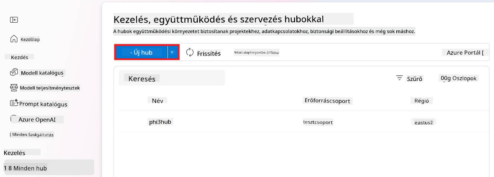

1. Végezze el a következő feladatokat:

    - Írja be a **Hub nevét**. Egyedi értéknek kell lennie.
    - Válassza ki az Azure **Előfizetését**.
    - Válassza ki a használandó **Erőforráscsoportot** (szükség esetén hozzon létre újat).
    - Válassza ki a kívánt **Helyszínt**.
    - Válassza ki a használandó **Connect Azure AI Services**-t (szükség esetén hozzon létre újat).
    - Válassza ki a **Connect Azure AI Search** lehetőséget a **Kapcsolat kihagyása** opcióra.

    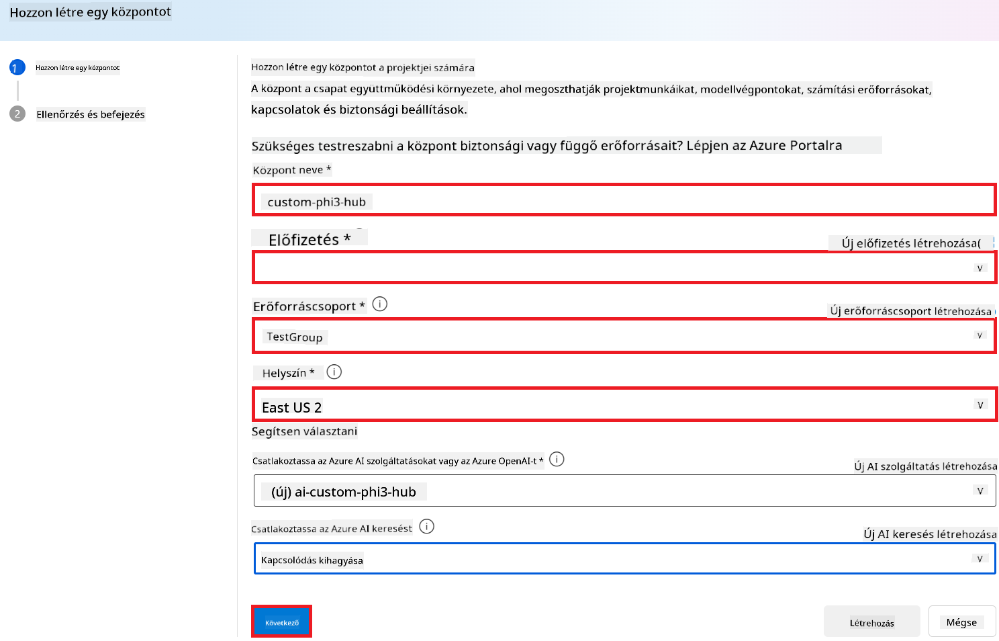

1. Válassza a **Tovább** lehetőséget.

#### Azure AI Foundry projekt létrehozása

1. A létrehozott Hub-ban válassza az oldalsó fülön az **Összes projekt** lehetőséget.

1. A navigációs menüből válassza az **+ Új projekt** lehetőséget.

    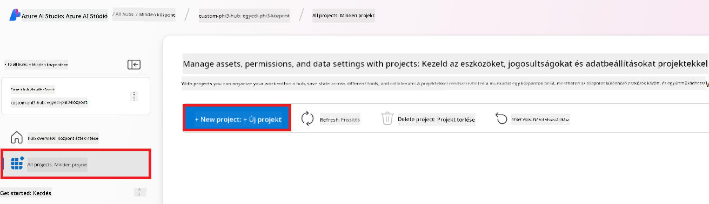

1. Adja meg a **Projekt nevét**. Egyedi értéknek kell lennie.

    

1. Válassza a **Projekt létrehozása** lehetőséget.

#### Egyedi kapcsolat hozzáadása a finomhangolt Phi-3 modellhez

Ahhoz, hogy a saját, finomhangolt Phi-3 modelljét integrálhassa a Prompt flow-ba, el kell mentenie a modell végpontját és kulcsát egy egyedi kapcsolatba. Ez a beállítás biztosítja az elérést a saját finomhangolt Phi-3 modelljéhez a Prompt flow-ban.

#### A finomhangolt Phi-3 modell api kulcsának és végpont URI-jának beállítása

1. Látogassa meg az [Azure ML Studio](https://ml.azure.com/home?WT.mc_id=aiml-137032-kinfeylo) oldalt.

1. Navigáljon a létrehozott Azure Machine Learning munkaterületre.

1. Az oldalsó fülön válassza az **Endpoints** lehetőséget.

    

1. Válassza ki a létrehozott végpontot.

    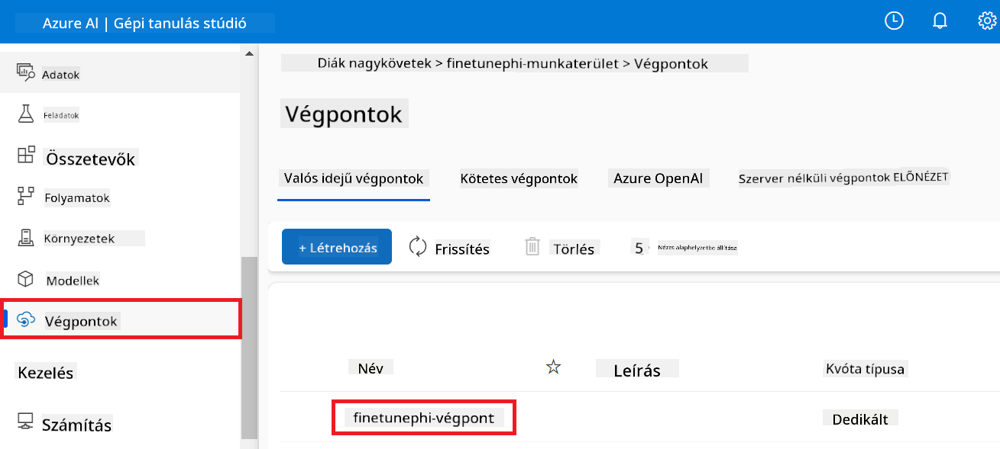

1. A navigációs menüből válassza a **Consume** lehetőséget.

1. Másolja le a **REST endpoint**-ot és a **Primary key**-t.

    

#### Az egyedi kapcsolat hozzáadása

1. Látogassa meg az [Azure AI Foundry](https://ai.azure.com/?WT.mc_id=aiml-137032-kinfeylo) oldalt.

1. Navigáljon a létrehozott Azure AI Foundry projekthez.

1. A létrehozott projekten belül válassza az oldalsó fülön a **Beállítások** lehetőséget.

1. Válassza az **+ Új kapcsolat** lehetőséget.

    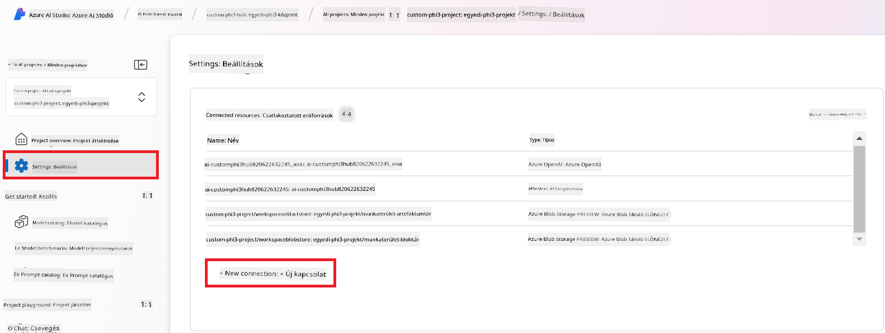

1. A navigációs menüből válassza a **Custom keys** lehetőséget.

    

1. Végezze el a következő lépéseket:

    - Válassza a **+ Kulcs-érték párok hozzáadása** lehetőséget.
    - A kulcsnévhez írja be az **endpoint** nevet, és illessze be az Azure ML Studio-ból másolt végpontot az értékmezőbe.
    - Újra válassza a **+ Kulcs-érték párok hozzáadása** lehetőséget.
    - A kulcsnévhez írja be a **key** nevet, és illessze be a másolt kulcsot az értékmezőbe.
    - A kulcsok hozzáadása után jelölje be az **is secret** opciót, hogy megakadályozza a kulcs felfedését.

    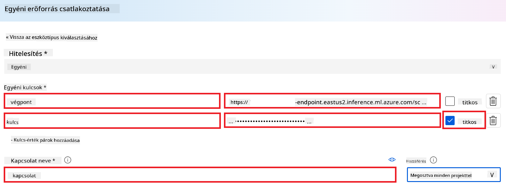

1. Válassza az **Add connection** lehetőséget.

#### Prompt flow létrehozása

Hozzáadta az egyedi kapcsolatot az Azure AI Foundry-ban. Most hozzunk létre egy Prompt flow-t az alábbi lépések követésével. Ezután összekapcsolja ezt a Prompt flow-t az egyedi kapcsolattal, így használhatja a finomhangolt modellt a Prompt flow-ban.

1. Navigáljon a létrehozott Azure AI Foundry projekthez.

1. Az oldalsó fülön válassza a **Prompt flow** lehetőséget.

1. A navigációs menüből válassza az **+ Létrehozás** lehetőséget.

    

1. A navigációs menüből válassza a **Chat flow** lehetőséget.

    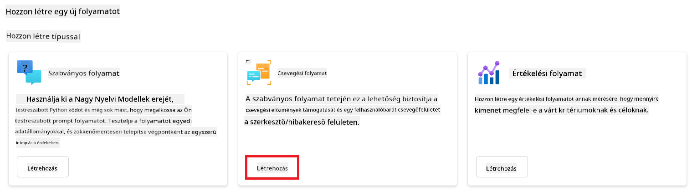

1. Adja meg a használandó **Mappa nevét**.

    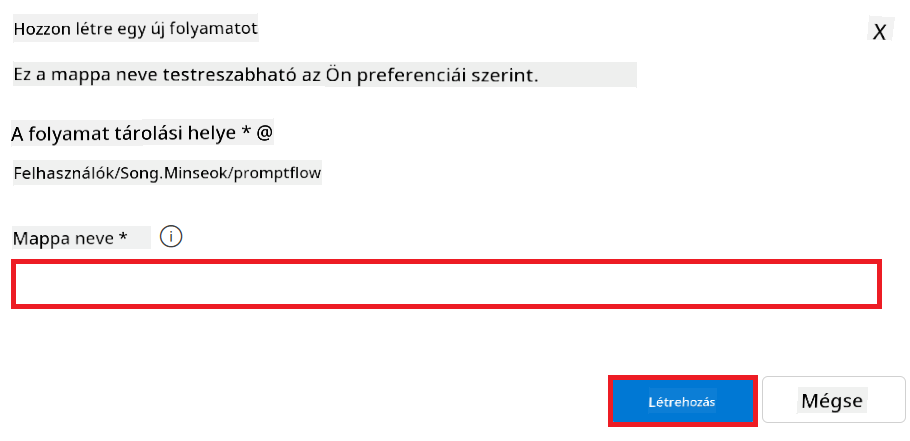

2. Válassza a **Létrehozás** lehetőséget.

#### A Prompt flow beállítása a finomhangolt Phi-3 modellel való csevegéshez

Integrálni kell a finomhangolt Phi-3 modellt a Prompt flow-ba. Azonban az alapértelmezett Prompt flow nem erre a célra készült. Ezért újra kell tervezni a Prompt flow-t, hogy lehetővé tegye az egyedi modell integrációját.

1. A Prompt flow-ban tegye meg a következőket a meglévő folyamat újjáépítéséhez:

    - Válassza a **Nyers fájl mód**-ot.
    - Törölje az összes meglévő kódot a *flow.dag.yml* fájlból.
    - Másolja be a következő kódot a *flow.dag.yml* fájlba.

        ```yml
        inputs:
          input_data:
            type: string
            default: "Who founded Microsoft?"

        outputs:
          answer:
            type: string
            reference: ${integrate_with_promptflow.output}

        nodes:
        - name: integrate_with_promptflow
          type: python
          source:
            type: code
            path: integrate_with_promptflow.py
          inputs:
            input_data: ${inputs.input_data}
        ```

    - Válassza a **Mentés** lehetőséget.

    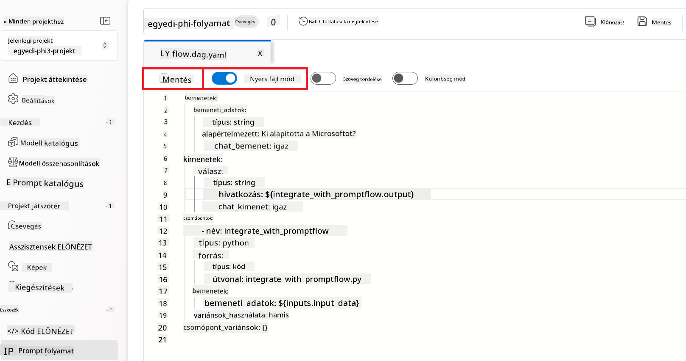

1. Másolja be az alábbi kódot az *integrate_with_promptflow.py* fájlba, hogy használni tudja az egyedi Phi-3 modellt a Prompt flow-ban.

    ```python
    import logging
    import requests
    from promptflow import tool
    from promptflow.connections import CustomConnection

    # Naplózás beállítása
    logging.basicConfig(
        format="%(asctime)s - %(levelname)s - %(name)s - %(message)s",
        datefmt="%Y-%m-%d %H:%M:%S",
        level=logging.DEBUG
    )
    logger = logging.getLogger(__name__)

    def query_phi3_model(input_data: str, connection: CustomConnection) -> str:
        """
        Send a request to the Phi-3 model endpoint with the given input data using Custom Connection.
        """

        # A "connection" a Custom Connection neve, az "endpoint" és "key" a Custom Connection kulcsai
        endpoint_url = connection.endpoint
        api_key = connection.key

        headers = {
            "Content-Type": "application/json",
            "Authorization": f"Bearer {api_key}"
        }
        data = {
            "input_data": {
                "input_string": [
                    {"role": "user", "content": input_data}
                ],
                "parameters": {
                    "temperature": 0.7,
                    "max_new_tokens": 128
                }
            }
        }
        try:
            response = requests.post(endpoint_url, json=data, headers=headers)
            response.raise_for_status()
            
            # A teljes JSON választ naplózza
            logger.debug(f"Full JSON response: {response.json()}")

            result = response.json()["output"]
            logger.info("Successfully received response from Azure ML Endpoint.")
            return result
        except requests.exceptions.RequestException as e:
            logger.error(f"Error querying Azure ML Endpoint: {e}")
            raise

    @tool
    def my_python_tool(input_data: str, connection: CustomConnection) -> str:
        """
        Tool function to process input data and query the Phi-3 model.
        """
        return query_phi3_model(input_data, connection)

    ```

    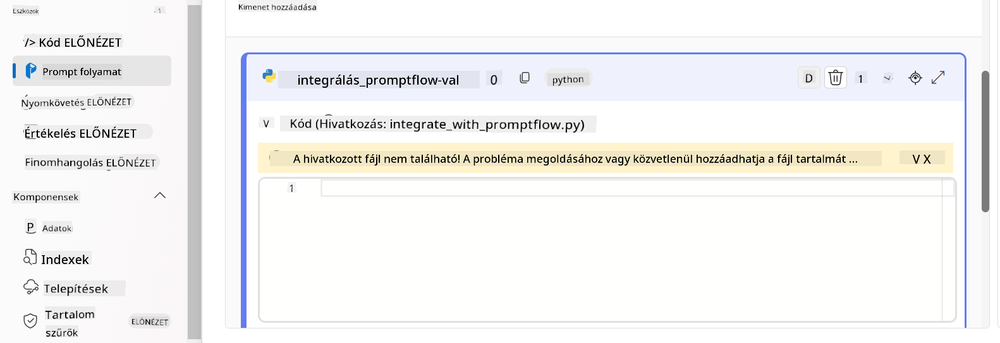

> [!NOTE]
> Az Azure AI Foundry-ban a Prompt flow használatáról bővebb információt talál a [Prompt flow in Azure AI Foundry](https://learn.microsoft.com/azure/ai-studio/how-to/prompt-flow) oldalon.

1. Válassza a **Csevegő bemenet**, **Csevegő kimenet** lehetőségeket, hogy engedélyezze a modellel való csevegést.

    

1. Most már készen áll arra, hogy csevegjünk az egyedi Phi-3 modelljével. A következő gyakorlatban megtanulja, hogyan indítsa el a Prompt flow-t, és hogyan használja a finomhangolt Phi-3 modellel való csevegéshez.

> [!NOTE]
>
> Az újjáépített folyamatnak a következő képre kell hasonlítania:
>
> 
>

### Csevegjünk az egyedi Phi-3 modellel

Most, hogy finomhangolta és integrálta az egyedi Phi-3 modelljét a Prompt flow-val, készen áll a használatára. Ez a gyakorlat végigvezeti a modelljével való csevegés beállításán és elindításán a Prompt flow használatával. Ezeknek a lépéseknek a követésével teljes mértékben kihasználhatja a finomhangolt Phi-3 modell különböző feladatokra és beszélgetésekre vonatkozó képességeit.

- Csevegjen az egyedi Phi-3 modellel a Prompt flow segítségével.

#### A Prompt flow indítása

1. Válassza a **Számítási munkamenetek indítása** lehetőséget a Prompt flow elindításához.

    

1. Válassza a **Érvényesítés és bemenet elemzése** lehetőséget a paraméterek frissítéséhez.

    

1. Válassza ki a **connection** értékét az Ön által létrehozott egyedi kapcsolathoz. Például: *connection*.

    

#### Csevegjünk az egyedi modellel

1. Válassza a **Csevegés** lehetőséget.

    

1. Íme egy példa az eredményekre: Most már cseveghet az egyedi Phi-3 modelljével. Ajánlott olyan kérdéseket feltenni, amelyek a finomhangoláshoz használt adatokon alapulnak.

    

---

<!-- CO-OP TRANSLATOR DISCLAIMER START -->
**Jogi nyilatkozat**:
Ezt a dokumentumot az AI fordító szolgáltatás, a [Co-op Translator](https://github.com/Azure/co-op-translator) segítségével fordítottuk. Bár a pontosságra törekszünk, kérjük, vegye figyelembe, hogy az automatikus fordítások hibákat vagy pontatlanságokat tartalmazhatnak. Az eredeti dokumentum az anyanyelvén tekintendő hiteles forrásnak. Fontos információk esetén szakmai emberi fordítást javaslunk. Nem vállalunk felelősséget az ebből eredő félreértésekért vagy téves értelmezésekért.
<!-- CO-OP TRANSLATOR DISCLAIMER END -->