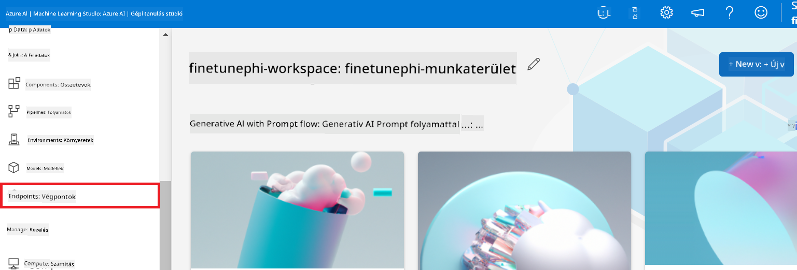
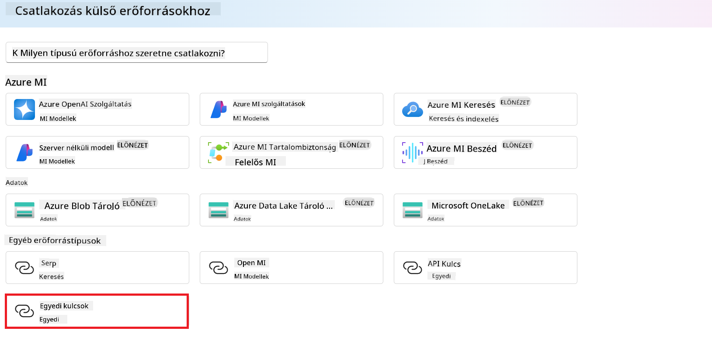
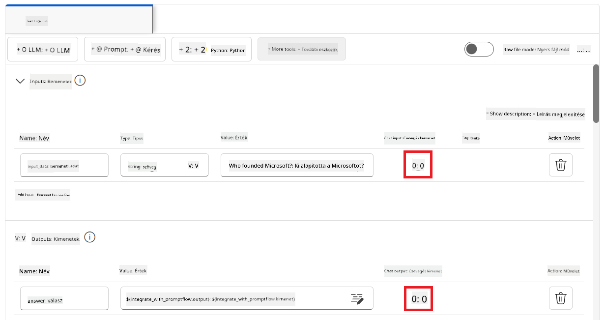

<!--
CO_OP_TRANSLATOR_METADATA:
{
  "original_hash": "ecbd9179a21edbaafaf114d47f09f3e3",
  "translation_date": "2025-07-17T01:51:51+00:00",
  "source_file": "md/02.Application/01.TextAndChat/Phi3/E2E_Phi-3-FineTuning_PromptFlow_Integration_AIFoundry.md",
  "language_code": "hu"
}
-->
# Finomhangold és integráld az egyedi Phi-3 modelleket a Prompt flow-val az Azure AI Foundry-ban

Ez az end-to-end (E2E) példa a Microsoft Tech Community "[Fine-Tune and Integrate Custom Phi-3 Models with Prompt Flow in Azure AI Foundry](https://techcommunity.microsoft.com/t5/educator-developer-blog/fine-tune-and-integrate-custom-phi-3-models-with-prompt-flow-in/ba-p/4191726?WT.mc_id=aiml-137032-kinfeylo)" útmutatóján alapul. Bemutatja az egyedi Phi-3 modellek finomhangolásának, telepítésének és integrálásának folyamatát a Prompt flow-val az Azure AI Foundry-ban.  
Ellentétben az E2E mintával, a "[Fine-Tune and Integrate Custom Phi-3 Models with Prompt Flow](./E2E_Phi-3-FineTuning_PromptFlow_Integration.md)"-vel, amely helyi kód futtatást igényelt, ez a bemutató teljes egészében az Azure AI / ML Studio-n belüli finomhangolásra és integrációra fókuszál.

## Áttekintés

Ebben az E2E példában megtanulod, hogyan finomhangold a Phi-3 modellt, és hogyan integráld azt a Prompt flow-val az Azure AI Foundry-ban. Az Azure AI / ML Studio segítségével létrehozol egy munkafolyamatot az egyedi AI modellek telepítésére és használatára. Ez az E2E minta három forgatókönyvre van bontva:

**1. forgatókönyv: Azure erőforrások beállítása és előkészítés a finomhangoláshoz**

**2. forgatókönyv: Phi-3 modell finomhangolása és telepítése az Azure Machine Learning Studioban**

**3. forgatókönyv: Integráció a Prompt flow-val és csevegés az egyedi modelleddel az Azure AI Foundry-ban**

Íme az E2E minta áttekintése.


### Tartalomjegyzék

1. **[1. forgatókönyv: Azure erőforrások beállítása és előkészítés a finomhangoláshoz](../../../../../../md/02.Application/01.TextAndChat/Phi3)**
    - [Azure Machine Learning Workspace létrehozása](../../../../../../md/02.Application/01.TextAndChat/Phi3)
    - [GPU kvóták igénylése az Azure előfizetésben](../../../../../../md/02.Application/01.TextAndChat/Phi3)
    - [Szerepkör hozzárendelés hozzáadása](../../../../../../md/02.Application/01.TextAndChat/Phi3)
    - [Projekt beállítása](../../../../../../md/02.Application/01.TextAndChat/Phi3)
    - [Adatkészlet előkészítése a finomhangoláshoz](../../../../../../md/02.Application/01.TextAndChat/Phi3)

1. **[2. forgatókönyv: Phi-3 modell finomhangolása és telepítése az Azure Machine Learning Studioban](../../../../../../md/02.Application/01.TextAndChat/Phi3)**
    - [Phi-3 modell finomhangolása](../../../../../../md/02.Application/01.TextAndChat/Phi3)
    - [Finomhangolt Phi-3 modell telepítése](../../../../../../md/02.Application/01.TextAndChat/Phi3)

1. **[3. forgatókönyv: Integráció a Prompt flow-val és csevegés az egyedi modelleddel az Azure AI Foundry-ban](../../../../../../md/02.Application/01.TextAndChat/Phi3)**
    - [Egyedi Phi-3 modell integrálása a Prompt flow-val](../../../../../../md/02.Application/01.TextAndChat/Phi3)
    - [Csevegés az egyedi Phi-3 modelleddel](../../../../../../md/02.Application/01.TextAndChat/Phi3)

## 1. forgatókönyv: Azure erőforrások beállítása és előkészítés a finomhangoláshoz

### Azure Machine Learning Workspace létrehozása

1. Írd be az *azure machine learning* kifejezést a portál oldal tetején található **keresősávba**, majd válaszd ki az **Azure Machine Learning** lehetőséget a megjelenő opciók közül.

    

2. Válaszd a **+ Create** lehetőséget a navigációs menüből.

3. Válaszd a **New workspace** lehetőséget a navigációs menüből.

    

4. Végezze el a következő lépéseket:

    - Válaszd ki az Azure **Előfizetésedet**.
    - Válaszd ki a használni kívánt **Erőforráscsoportot** (ha szükséges, hozz létre újat).
    - Add meg a **Workspace nevét**. Egyedi értéknek kell lennie.
    - Válaszd ki a használni kívánt **Régiót**.
    - Válaszd ki a használni kívánt **Tárolófiókot** (ha szükséges, hozz létre újat).
    - Válaszd ki a használni kívánt **Key vault-ot** (ha szükséges, hozz létre újat).
    - Válaszd ki a használni kívánt **Application insights**-t (ha szükséges, hozz létre újat).
    - Válaszd ki a használni kívánt **Container registry**-t (ha szükséges, hozz létre újat).

    

5. Válaszd a **Review + Create** lehetőséget.

6. Válaszd a **Create** lehetőséget.

### GPU kvóták igénylése az Azure előfizetésben

Ebben a bemutatóban megtanulod, hogyan finomhangold és telepítsd a Phi-3 modellt GPU-k használatával. A finomhangoláshoz a *Standard_NC24ads_A100_v4* GPU-t fogod használni, amelyhez kvótaigénylés szükséges. A telepítéshez a *Standard_NC6s_v3* GPU-t használod, amely szintén kvótaigénylést igényel.

> [!NOTE]
>
> Csak a Pay-As-You-Go előfizetések (az alapértelmezett előfizetési típus) jogosultak GPU-kiosztásra; a kedvezményes előfizetések jelenleg nem támogatottak.
>

1. Látogass el az [Azure ML Studio](https://ml.azure.com/home?wt.mc_id=studentamb_279723) oldalra.

1. Végezze el a következő lépéseket a *Standard NCADSA100v4 Family* kvóta igényléséhez:

    - Válaszd a bal oldali menüben a **Quota** lehetőséget.
    - Válaszd ki a használni kívánt **Virtuális gép családot**. Például válaszd a **Standard NCADSA100v4 Family Cluster Dedicated vCPUs** opciót, amely tartalmazza a *Standard_NC24ads_A100_v4* GPU-t.
    - Válaszd a navigációs menüből a **Request quota** lehetőséget.

        

    - A Request quota oldalon add meg az új **cores limit** értéket, amelyet használni szeretnél. Például 24.
    - A Request quota oldalon válaszd a **Submit** gombot a GPU kvóta igényléséhez.

1. Végezze el a következő lépéseket a *Standard NCSv3 Family* kvóta igényléséhez:

    - Válaszd a bal oldali menüben a **Quota** lehetőséget.
    - Válaszd ki a használni kívánt **Virtuális gép családot**. Például válaszd a **Standard NCSv3 Family Cluster Dedicated vCPUs** opciót, amely tartalmazza a *Standard_NC6s_v3* GPU-t.
    - Válaszd a navigációs menüből a **Request quota** lehetőséget.
    - A Request quota oldalon add meg az új **cores limit** értéket, amelyet használni szeretnél. Például 24.
    - A Request quota oldalon válaszd a **Submit** gombot a GPU kvóta igényléséhez.

### Szerepkör hozzárendelés hozzáadása

A modellek finomhangolásához és telepítéséhez először létre kell hoznod egy User Assigned Managed Identity-t (UAI), és hozzá kell rendelned a megfelelő jogosultságokat. Ezt az UAI-t fogod használni az autentikációhoz a telepítés során.

#### User Assigned Managed Identity (UAI) létrehozása

1. Írd be a *managed identities* kifejezést a portál oldal tetején található **keresősávba**, majd válaszd ki a **Managed Identities** lehetőséget a megjelenő opciók közül.

    

1. Válaszd a **+ Create** lehetőséget.

    

1. Végezze el a következő lépéseket:

    - Válaszd ki az Azure **Előfizetésedet**.
    - Válaszd ki a használni kívánt **Erőforráscsoportot** (ha szükséges, hozz létre újat).
    - Válaszd ki a használni kívánt **Régiót**.
    - Add meg a **Nevet**. Egyedi értéknek kell lennie.

    

1. Válaszd a **Review + create** lehetőséget.

1. Válaszd a **+ Create** lehetőséget.

#### Contributor szerepkör hozzárendelése a Managed Identity-hez

1. Navigálj a létrehozott Managed Identity erőforráshoz.

1. Válaszd a bal oldali menüből az **Azure role assignments** lehetőséget.

1. Válaszd a navigációs menüből a **+Add role assignment** lehetőséget.

1. Az Add role assignment oldalon végezd el a következőket:
    - Állítsd be a **Scope**-ot **Resource group**-ra.
    - Válaszd ki az Azure **Előfizetésedet**.
    - Válaszd ki a használni kívánt **Erőforráscsoportot**.
    - Válaszd ki a **Contributor** szerepkört.

    

2. Válaszd a **Save** lehetőséget.

#### Storage Blob Data Reader szerepkör hozzárendelése a Managed Identity-hez

1. Írd be a *storage accounts* kifejezést a portál oldal tetején található **keresősávba**, majd válaszd ki a **Storage accounts** lehetőséget a megjelenő opciók közül.

    

1. Válaszd ki azt a tárolófiókot, amely az általad létrehozott Azure Machine Learning munkaterülethez tartozik. Például *finetunephistorage*.

1. Végezze el a következő lépéseket az Add role assignment oldal eléréséhez:

    - Navigálj az általad létrehozott Azure Storage fiókhoz.
    - Válaszd a bal oldali menüből az **Access Control (IAM)** lehetőséget.
    - Válaszd a navigációs menüből a **+ Add** lehetőséget.
    - Válaszd a **Add role assignment** lehetőséget.

    

1. Az Add role assignment oldalon végezd el a következőket:

    - A Role oldalon írd be a keresősávba a *Storage Blob Data Reader* kifejezést, majd válaszd ki a megjelenő opciók közül a **Storage Blob Data Reader**-t.
    - A Role oldalon válaszd a **Next** lehetőséget.
    - A Members oldalon válaszd az **Assign access to** mezőben a **Managed identity** opciót.
    - A Members oldalon válaszd a **+ Select members** lehetőséget.
    - A Select managed identities oldalon válaszd ki az Azure **Előfizetésedet**.
    - A Select managed identities oldalon válaszd ki a **Managed identity**-t, amely a **Manage Identity** típusú.
    - A Select managed identities oldalon válaszd ki a létrehozott Managed Identity-t. Például *finetunephi-managedidentity*.
    - A Select managed identities oldalon válaszd a **Select** lehetőséget.

    

1. Válaszd a **Review + assign** lehetőséget.

#### AcrPull szerepkör hozzárendelése a Managed Identity-hez

1. Írd be a *container registries* kifejezést a portál oldal tetején található **keresősávba**, majd válaszd ki a **Container registries** lehetőséget a megjelenő opciók közül.

    

1. Válaszd ki azt a container registry-t, amely az Azure Machine Learning munkaterülethez tartozik. Például *finetunephicontainerregistry*.

1. Végezze el a következő lépéseket az Add role assignment oldal eléréséhez:

    - Válaszd a bal oldali menüből az **Access Control (IAM)** lehetőséget.
    - Válaszd a navigációs menüből a **+ Add** lehetőséget.
    - Válaszd a **Add role assignment** lehetőséget.

1. Az Add role assignment oldalon végezd el a következőket:

    - A Role oldalon írd be a keresősávba az *AcrPull* kifejezést, majd válaszd ki a megjelenő opciók közül az **AcrPull**-t.
    - A Role oldalon válaszd a **Next** lehetőséget.
    - A Members oldalon válaszd az **Assign access to** mezőben a **Managed identity** opciót.
    - A Members oldalon válaszd a **+ Select members** lehetőséget.
    - A Select managed identities oldalon válaszd ki az Azure **Előfizetésedet**.
    - A Select managed identities oldalon válaszd ki a **Managed identity**-t, amely a **Manage Identity** típusú.
    - A Select managed identities oldalon válaszd ki a létrehozott Managed Identity-t. Például *finetunephi-managedidentity*.
    - A Select managed identities oldalon válaszd a **Select** lehetőséget.
    - Válaszd a **Review + assign** lehetőséget.

### Projekt beállítása

A finomhangoláshoz szükséges adatkészletek letöltéséhez helyi környezetet állítasz be.

Ebben a gyakorlatban:

- Létrehozol egy mappát, amelyben dolgozni fogsz.
- Létrehozol egy virtuális környezetet.
- Telepíted a szükséges csomagokat.
- Létrehozol egy *download_dataset.py* fájlt az adatkészlet letöltéséhez.

#### Mappa létrehozása a munkához

1. Nyiss meg egy terminálablakot, és írd be a következő parancsot egy *finetune-phi* nevű mappa létrehozásához az alapértelmezett útvonalon.

    ```console
    mkdir finetune-phi
    ```

2. Írd be a következő parancsot a terminálba, hogy belépj a létrehozott *finetune-phi* mappába.
#### Hozz létre egy virtuális környezetet

1. Írd be a következő parancsot a terminálodba egy *.venv* nevű virtuális környezet létrehozásához.

    ```console
    python -m venv .venv
    ```

2. Írd be a következő parancsot a terminálodba a virtuális környezet aktiválásához.

    ```console
    .venv\Scripts\activate.bat
    ```


> [!NOTE]
> Ha sikerült, akkor a parancssor előtt meg kell jelennie a *(.venv)* jelzésnek.

#### Telepítsd a szükséges csomagokat

1. Írd be a következő parancsokat a terminálodba a szükséges csomagok telepítéséhez.

    ```console
    pip install datasets==2.19.1
    ```

#### Hozd létre a `download_dataset.py` fájlt

> [!NOTE]
> Teljes mappaszerkezet:
>
> ```text
> └── YourUserName
> .    └── finetune-phi
> .        └── download_dataset.py
> ```

1. Nyisd meg a **Visual Studio Code**-ot.

1. Válaszd ki a menüsorból a **File** menüpontot.

1. Válaszd az **Open Folder** lehetőséget.

1. Válaszd ki a *finetune-phi* mappát, amit létrehoztál, amely a *C:\Users\yourUserName\finetune-phi* helyen található.

    

1. A Visual Studio Code bal oldali paneljén kattints jobb gombbal, majd válaszd az **New File** lehetőséget egy új *download_dataset.py* nevű fájl létrehozásához.

    

### Készítsd elő az adathalmazt a finomhangoláshoz

Ebben a gyakorlatban lefuttatod a *download_dataset.py* fájlt, hogy letöltsd az *ultrachat_200k* adathalmazokat a helyi környezetedbe. Ezt követően ezt az adathalmazt fogod használni a Phi-3 modell finomhangolásához az Azure Machine Learning-ben.

Ebben a gyakorlatban:

- Kódot adsz hozzá a *download_dataset.py* fájlhoz az adathalmazok letöltéséhez.
- Lefuttatod a *download_dataset.py* fájlt, hogy letöltsd az adathalmazokat a helyi környezetedbe.

#### Töltsd le az adathalmazodat a *download_dataset.py* segítségével

1. Nyisd meg a *download_dataset.py* fájlt a Visual Studio Code-ban.

1. Illeszd be a következő kódot a *download_dataset.py* fájlba.

    ```python
    import json
    import os
    from datasets import load_dataset

    def load_and_split_dataset(dataset_name, config_name, split_ratio):
        """
        Load and split a dataset.
        """
        # Load the dataset with the specified name, configuration, and split ratio
        dataset = load_dataset(dataset_name, config_name, split=split_ratio)
        print(f"Original dataset size: {len(dataset)}")
        
        # Split the dataset into train and test sets (80% train, 20% test)
        split_dataset = dataset.train_test_split(test_size=0.2)
        print(f"Train dataset size: {len(split_dataset['train'])}")
        print(f"Test dataset size: {len(split_dataset['test'])}")
        
        return split_dataset

    def save_dataset_to_jsonl(dataset, filepath):
        """
        Save a dataset to a JSONL file.
        """
        # Create the directory if it does not exist
        os.makedirs(os.path.dirname(filepath), exist_ok=True)
        
        # Open the file in write mode
        with open(filepath, 'w', encoding='utf-8') as f:
            # Iterate over each record in the dataset
            for record in dataset:
                # Dump the record as a JSON object and write it to the file
                json.dump(record, f)
                # Write a newline character to separate records
                f.write('\n')
        
        print(f"Dataset saved to {filepath}")

    def main():
        """
        Main function to load, split, and save the dataset.
        """
        # Load and split the ULTRACHAT_200k dataset with a specific configuration and split ratio
        dataset = load_and_split_dataset("HuggingFaceH4/ultrachat_200k", 'default', 'train_sft[:1%]')
        
        # Extract the train and test datasets from the split
        train_dataset = dataset['train']
        test_dataset = dataset['test']

        # Save the train dataset to a JSONL file
        save_dataset_to_jsonl(train_dataset, "data/train_data.jsonl")
        
        # Save the test dataset to a separate JSONL file
        save_dataset_to_jsonl(test_dataset, "data/test_data.jsonl")

    if __name__ == "__main__":
        main()

    ```

1. Írd be a következő parancsot a terminálodba a szkript futtatásához és az adathalmaz letöltéséhez a helyi környezetedbe.

    ```console
    python download_dataset.py
    ```

1. Ellenőrizd, hogy az adathalmazok sikeresen elmentésre kerültek-e a helyi *finetune-phi/data* könyvtárba.

> [!NOTE]
>
> #### Megjegyzés az adathalmaz méretéről és a finomhangolás idejéről
>
> Ebben a bemutatóban csak az adathalmaz 1%-át használod (`split='train[:1%]'`). Ez jelentősen csökkenti az adatmennyiséget, így gyorsítva a feltöltést és a finomhangolást. A százalékos arányt módosíthatod, hogy megtaláld az optimális egyensúlyt a tanítási idő és a modell teljesítménye között. Az adathalmaz kisebb részhalmazának használata lerövidíti a finomhangolás idejét, így a folyamat kezelhetőbbé válik egy bemutató számára.

## 2. Forgatókönyv: Phi-3 modell finomhangolása és telepítése az Azure Machine Learning Studioban

### Finomhangold a Phi-3 modellt

Ebben a gyakorlatban a Phi-3 modellt finomhangolod az Azure Machine Learning Studioban.

Ebben a gyakorlatban:

- Létrehozol egy számítógép klasztert a finomhangoláshoz.
- Finomhangolod a Phi-3 modellt az Azure Machine Learning Studioban.

#### Hozz létre számítógép klasztert a finomhangoláshoz

1. Látogass el az [Azure ML Studio](https://ml.azure.com/home?wt.mc_id=studentamb_279723) oldalra.

1. Válaszd ki a bal oldali menüből a **Compute** menüpontot.

1. A navigációs menüből válaszd a **Compute clusters** lehetőséget.

1. Kattints a **+ New** gombra.

    

1. Végezze el a következő beállításokat:

    - Válaszd ki a használni kívánt **Region** régiót.
    - Állítsd a **Virtual machine tier** értékét **Dedicated**-re.
    - Állítsd a **Virtual machine type** értékét **GPU**-ra.
    - A **Virtual machine size** szűrőt állítsd **Select from all options**-ra.
    - Válaszd ki a **Virtual machine size**-t: **Standard_NC24ads_A100_v4**.

    

1. Kattints a **Next** gombra.

1. Végezze el a következő beállításokat:

    - Írd be a **Compute name**-et. Egyedi értéknek kell lennie.
    - Állítsd a **Minimum number of nodes** értékét **0**-ra.
    - Állítsd a **Maximum number of nodes** értékét **1**-re.
    - Állítsd az **Idle seconds before scale down** értékét **120**-ra.

    

1. Kattints a **Create** gombra.

#### Finomhangold a Phi-3 modellt

1. Látogass el az [Azure ML Studio](https://ml.azure.com/home?wt.mc_id=studentamb_279723) oldalra.

1. Válaszd ki az általad létrehozott Azure Machine Learning munkaterületet.

    

1. Végezze el a következő lépéseket:

    - Válaszd ki a bal oldali menüből a **Model catalog** menüpontot.
    - Írd be a keresőmezőbe a *phi-3-mini-4k* kifejezést, majd válaszd ki a megjelenő lehetőségek közül a **Phi-3-mini-4k-instruct** modellt.

    

1. Válaszd ki a navigációs menüből a **Fine-tune** lehetőséget.

    

1. Végezze el a következő beállításokat:

    - Állítsd a **Select task type** értékét **Chat completion**-re.
    - Kattints a **+ Select data** gombra a **Training data** feltöltéséhez.
    - A validációs adatok feltöltési módját állítsd **Provide different validation data**-ra.
    - Kattints a **+ Select data** gombra a **Validation data** feltöltéséhez.

    

    > [!TIP]
    >
    > Az **Advanced settings** alatt testreszabhatod a konfigurációkat, például a **learning_rate** és **lr_scheduler_type** értékeket, hogy a finomhangolás a saját igényeid szerint optimalizálható legyen.

1. Kattints a **Finish** gombra.

1. Ebben a gyakorlatban sikeresen finomhangoltad a Phi-3 modellt az Azure Machine Learning segítségével. Fontos megjegyezni, hogy a finomhangolási folyamat jelentős időt vehet igénybe. A finomhangolási feladat futtatása után várnod kell a befejezésére. A finomhangolási feladat állapotát az Azure Machine Learning munkaterület bal oldali menüjében a Jobs fülön követheted nyomon. A következő részben telepíted a finomhangolt modellt és integrálod a Prompt Flow-val.

    

### Telepítsd a finomhangolt Phi-3 modellt

Ahhoz, hogy a finomhangolt Phi-3 modellt integráld a Prompt Flow-val, telepítened kell a modellt, hogy valós idejű lekérdezésekhez elérhető legyen. Ez a folyamat magában foglalja a modell regisztrálását, egy online végpont létrehozását és a modell telepítését.

Ebben a gyakorlatban:

- Regisztrálod a finomhangolt modellt az Azure Machine Learning munkaterületen.
- Létrehozol egy online végpontot.
- Telepíted a regisztrált finomhangolt Phi-3 modellt.

#### Regisztráld a finomhangolt modellt

1. Látogass el az [Azure ML Studio](https://ml.azure.com/home?wt.mc_id=studentamb_279723) oldalra.

1. Válaszd ki az általad létrehozott Azure Machine Learning munkaterületet.

    

1. Válaszd ki a bal oldali menüből a **Models** menüpontot.

1. Kattints a **+ Register** gombra.

1. Válaszd a **From a job output** lehetőséget.

    

1. Válaszd ki a létrehozott feladatot.

    

1. Kattints a **Next** gombra.

1. Állítsd a **Model type** értékét **MLflow**-ra.

1. Győződj meg róla, hogy a **Job output** ki van választva; ennek automatikusan ki kell választódnia.

    

2. Kattints a **Next** gombra.

3. Kattints a **Register** gombra.

    

4. A regisztrált modell megtekintéséhez navigálj a bal oldali menü **Models** menüpontjához.

    

#### Telepítsd a finomhangolt modellt

1. Navigálj az általad létrehozott Azure Machine Learning munkaterületre.

1. Válaszd ki a bal oldali menüből az **Endpoints** menüpontot.

1. A navigációs menüből válaszd a **Real-time endpoints** lehetőséget.

    

1. Kattints a **Create** gombra.

1. Válaszd ki a regisztrált modellt, amit létrehoztál.

    

1. Kattints a **Select** gombra.

1. Végezze el a következő beállításokat:

    - Állítsd a **Virtual machine** értékét *Standard_NC6s_v3*-ra.
    - Állítsd be a kívánt **Instance count** értéket, például *1*.
    - Állítsd az **Endpoint** értékét **New**-re egy új végpont létrehozásához.
    - Írd be az **Endpoint name**-et. Egyedi értéknek kell lennie.
    - Írd be a **Deployment name**-et. Egyedi értéknek kell lennie.

    

1. Kattints a **Deploy** gombra.

> [!WARNING]
> A további költségek elkerülése érdekében győződj meg róla, hogy törlöd a létrehozott végpontot az Azure Machine Learning munkaterületen.
>

#### Ellenőrizd a telepítés állapotát az Azure Machine Learning munkaterületen

1. Navigálj az általad létrehozott Azure Machine Learning munkaterületre.

1. Válaszd ki a bal oldali menüből az **Endpoints** menüpontot.

1. Válaszd ki a létrehozott végpontot.

    

1. Ezen az oldalon kezelheted a végpontokat a telepítési folyamat során.

> [!NOTE]
> A telepítés befejezése után győződj meg róla, hogy a **Live traffic** értéke **100%**. Ha nem az, válaszd az **Update traffic** lehetőséget a forgalom beállításainak módosításához. Ne feledd, hogy a modellt nem tudod tesztelni, ha a forgalom 0%-ra van állítva.
>
> 
>

## 3. Forgatókönyv: Integráció a Prompt Flow-val és csevegés a saját modelleddel az Azure AI Foundry-ban

### Integráld a saját Phi-3 modellt a Prompt Flow-val

Miután sikeresen telepítetted a finomhangolt modellt, most integrálhatod azt a Prompt Flow-val, hogy valós idejű alkalmazásokban használhasd, lehetővé téve különféle interaktív feladatok végrehajtását a saját Phi-3 modelleddel.

Ebben a gyakorlatban:

- Létrehozol egy Azure AI Foundry Hub-ot.
- Létrehozol egy Azure AI Foundry projektet.
- Létrehozol egy Prompt Flow-t.
- Hozzáadsz egy egyedi kapcsolatot a finomhangolt Phi-3 modellhez.
- Beállítod a Prompt Flow-t, hogy csevegj a saját Phi-3 modelleddel.
> [!NOTE]
> A Promptflow-val való integrációt az Azure ML Studio segítségével is elvégezheted. Ugyanez az integrációs folyamat alkalmazható az Azure ML Studioban is.
#### Azure AI Foundry Hub létrehozása

A Projekt létrehozása előtt létre kell hoznod egy Hub-ot. A Hub olyan, mint egy Erőforráscsoport, amely lehetővé teszi, hogy több Projektet szervezz és kezelj az Azure AI Foundry-n belül.

1. Látogass el az [Azure AI Foundry](https://ai.azure.com/?WT.mc_id=aiml-137032-kinfeylo) oldalra.

1. Válaszd ki a bal oldali fülön az **All hubs** lehetőséget.

1. A navigációs menüből válaszd a **+ New hub** opciót.

    

1. Végezze el a következő lépéseket:

    - Írd be a **Hub name**-et. Egyedi értéknek kell lennie.
    - Válaszd ki az Azure **Subscription**-t.
    - Válaszd ki a használni kívánt **Resource group**-ot (ha szükséges, hozz létre újat).
    - Válaszd ki a kívánt **Location**-t.
    - Válaszd ki a használni kívánt **Connect Azure AI Services**-t (ha szükséges, hozz létre újat).
    - A **Connect Azure AI Search** esetén válaszd a **Skip connecting** lehetőséget.

    

1. Kattints a **Next** gombra.

#### Azure AI Foundry Projekt létrehozása

1. A létrehozott Hub-ban válaszd ki a bal oldali fülön az **All projects** lehetőséget.

1. A navigációs menüből válaszd a **+ New project** opciót.

    

1. Írd be a **Project name**-et. Egyedi értéknek kell lennie.

    

1. Kattints a **Create a project** gombra.

#### Egyedi kapcsolat hozzáadása a finomhangolt Phi-3 modellhez

Ahhoz, hogy a saját Phi-3 modelledet integráld a Prompt flow-val, el kell mentened a modell végpontját és kulcsát egy egyedi kapcsolatban. Ez a beállítás biztosítja, hogy a Prompt flow hozzáférjen a finomhangolt Phi-3 modelledhez.

#### A finomhangolt Phi-3 modell api kulcsának és végpont URI-jának beállítása

1. Látogass el az [Azure ML Studio](https://ml.azure.com/home?WT.mc_id=aiml-137032-kinfeylo) oldalra.

1. Navigálj a létrehozott Azure Machine learning munkaterületre.

1. Válaszd ki a bal oldali fülön az **Endpoints** lehetőséget.

    

1. Válaszd ki a létrehozott végpontot.

    

1. A navigációs menüből válaszd a **Consume** opciót.

1. Másold ki a **REST endpoint**-ot és a **Primary key**-t.

    

#### Egyedi kapcsolat hozzáadása

1. Látogass el az [Azure AI Foundry](https://ai.azure.com/?WT.mc_id=aiml-137032-kinfeylo) oldalra.

1. Navigálj a létrehozott Azure AI Foundry projekthez.

1. A létrehozott Projektben válaszd ki a bal oldali fülön a **Settings** lehetőséget.

1. Válaszd a **+ New connection** opciót.

    

1. A navigációs menüből válaszd a **Custom keys** lehetőséget.

    

1. Végezze el a következő lépéseket:

    - Válaszd a **+ Add key value pairs** opciót.
    - A kulcsnévhez írd be: **endpoint**, majd illeszd be az Azure ML Studio-ból kimásolt végpontot az érték mezőbe.
    - Ismét válaszd a **+ Add key value pairs** opciót.
    - A kulcsnévhez írd be: **key**, majd illeszd be az Azure ML Studio-ból kimásolt kulcsot az érték mezőbe.
    - A kulcsok hozzáadása után jelöld be az **is secret** opciót, hogy a kulcs ne legyen látható.

    

1. Kattints az **Add connection** gombra.

#### Prompt flow létrehozása

Hozzáadtál egy egyedi kapcsolatot az Azure AI Foundry-ban. Most hozzunk létre egy Prompt flow-t a következő lépésekkel. Ezután összekapcsolod ezt a Prompt flow-t az egyedi kapcsolattal, hogy a finomhangolt modellt használni tudd a Prompt flow-n belül.

1. Navigálj a létrehozott Azure AI Foundry projekthez.

1. Válaszd ki a bal oldali fülön a **Prompt flow** lehetőséget.

1. A navigációs menüből válaszd a **+ Create** opciót.

    

1. A navigációs menüből válaszd a **Chat flow** lehetőséget.

    

1. Írd be a használni kívánt **Folder name**-et.

    

2. Kattints a **Create** gombra.

#### Prompt flow beállítása a finomhangolt Phi-3 modellel való csevegéshez

Integrálnod kell a finomhangolt Phi-3 modellt a Prompt flow-ba. Azonban a meglévő Prompt flow nem erre a célra készült, ezért újra kell tervezned a Prompt flow-t, hogy lehetővé tedd az egyedi modell integrációját.

1. A Prompt flow-ban végezd el a következő lépéseket az aktuális folyamat újraépítéséhez:

    - Válaszd a **Raw file mode**-ot.
    - Töröld az összes meglévő kódot a *flow.dag.yml* fájlból.
    - Illeszd be a következő kódot a *flow.dag.yml* fájlba.

        ```yml
        inputs:
          input_data:
            type: string
            default: "Who founded Microsoft?"

        outputs:
          answer:
            type: string
            reference: ${integrate_with_promptflow.output}

        nodes:
        - name: integrate_with_promptflow
          type: python
          source:
            type: code
            path: integrate_with_promptflow.py
          inputs:
            input_data: ${inputs.input_data}
        ```

    - Kattints a **Save** gombra.

    

1. Illeszd be a következő kódot az *integrate_with_promptflow.py* fájlba, hogy a finomhangolt Phi-3 modellt használd a Prompt flow-ban.

    ```python
    import logging
    import requests
    from promptflow import tool
    from promptflow.connections import CustomConnection

    # Logging setup
    logging.basicConfig(
        format="%(asctime)s - %(levelname)s - %(name)s - %(message)s",
        datefmt="%Y-%m-%d %H:%M:%S",
        level=logging.DEBUG
    )
    logger = logging.getLogger(__name__)

    def query_phi3_model(input_data: str, connection: CustomConnection) -> str:
        """
        Send a request to the Phi-3 model endpoint with the given input data using Custom Connection.
        """

        # "connection" is the name of the Custom Connection, "endpoint", "key" are the keys in the Custom Connection
        endpoint_url = connection.endpoint
        api_key = connection.key

        headers = {
            "Content-Type": "application/json",
            "Authorization": f"Bearer {api_key}"
        }
        data = {
            "input_data": {
                "input_string": [
                    {"role": "user", "content": input_data}
                ],
                "parameters": {
                    "temperature": 0.7,
                    "max_new_tokens": 128
                }
            }
        }
        try:
            response = requests.post(endpoint_url, json=data, headers=headers)
            response.raise_for_status()
            
            # Log the full JSON response
            logger.debug(f"Full JSON response: {response.json()}")

            result = response.json()["output"]
            logger.info("Successfully received response from Azure ML Endpoint.")
            return result
        except requests.exceptions.RequestException as e:
            logger.error(f"Error querying Azure ML Endpoint: {e}")
            raise

    @tool
    def my_python_tool(input_data: str, connection: CustomConnection) -> str:
        """
        Tool function to process input data and query the Phi-3 model.
        """
        return query_phi3_model(input_data, connection)

    ```

    

> [!NOTE]
> Részletesebb információkért az Azure AI Foundry-ban történő Prompt flow használatáról, tekintsd meg a [Prompt flow in Azure AI Foundry](https://learn.microsoft.com/azure/ai-studio/how-to/prompt-flow) dokumentációt.

1. Engedélyezd a csevegést a **Chat input** és **Chat output** kiválasztásával.

    

1. Most már készen állsz arra, hogy csevegj a finomhangolt Phi-3 modelleddel. A következő gyakorlatban megtanulod, hogyan indítsd el a Prompt flow-t, és hogyan használd a finomhangolt Phi-3 modelleddel való csevegéshez.

> [!NOTE]
>
> Az újraépített folyamatnak az alábbi képhez hasonlónak kell lennie:
>
> 
>

### Csevegés a saját Phi-3 modelleddel

Most, hogy finomhangoltad és integráltad a saját Phi-3 modelledet a Prompt flow-val, készen állsz a vele való interakcióra. Ez a gyakorlat végigvezet a beállítás és a csevegés elindításának folyamatán a modelleddel a Prompt flow segítségével. Ezeknek a lépéseknek a követésével teljes mértékben kihasználhatod a finomhangolt Phi-3 modell képességeit különféle feladatok és beszélgetések során.

- Csevegj a saját Phi-3 modelleddel a Prompt flow használatával.

#### Prompt flow indítása

1. Kattints a **Start compute sessions** gombra a Prompt flow elindításához.

    

1. Válaszd a **Validate and parse input** lehetőséget a paraméterek frissítéséhez.

    

1. Válaszd ki a **Value** mezőt a létrehozott egyedi kapcsolathoz. Például *connection*.

    

#### Csevegés az egyedi modelleddel

1. Kattints a **Chat** gombra.

    

1. Íme egy példa az eredményekre: Most már cseveghetsz a saját Phi-3 modelleddel. Ajánlott olyan kérdéseket feltenni, amelyek a finomhangoláshoz használt adatokon alapulnak.

    

**Jogi nyilatkozat**:  
Ez a dokumentum az AI fordító szolgáltatás, a [Co-op Translator](https://github.com/Azure/co-op-translator) segítségével készült. Bár a pontosságra törekszünk, kérjük, vegye figyelembe, hogy az automatikus fordítások hibákat vagy pontatlanságokat tartalmazhatnak. Az eredeti dokumentum az anyanyelvén tekintendő hiteles forrásnak. Fontos információk esetén szakmai, emberi fordítást javaslunk. Nem vállalunk felelősséget a fordítás használatából eredő félreértésekért vagy téves értelmezésekért.