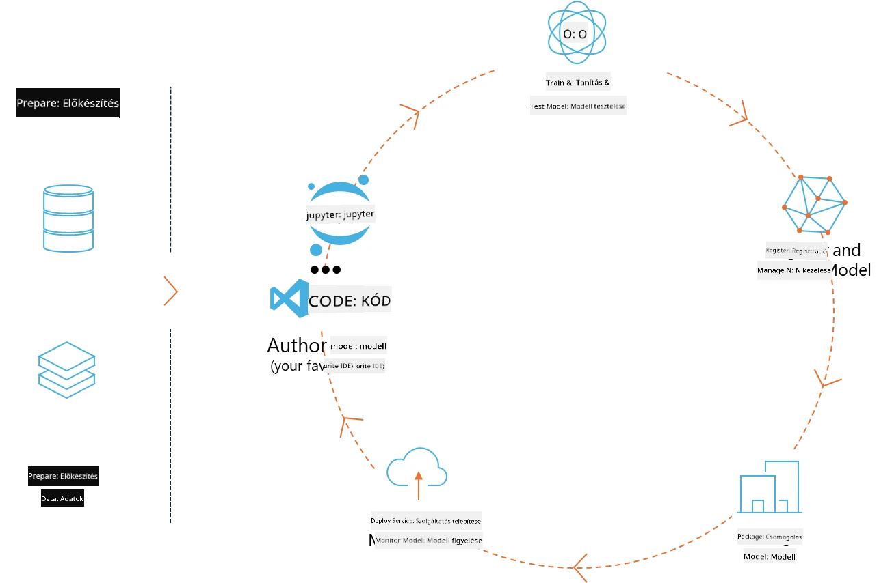
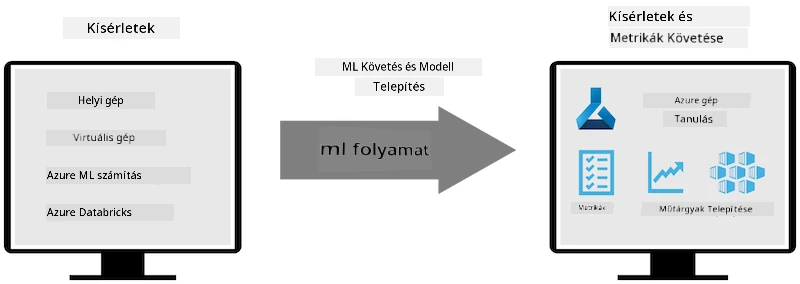
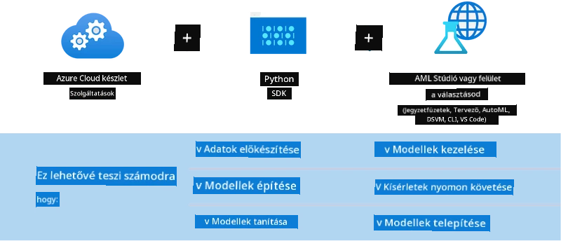

# MLflow

Az [MLflow](https://mlflow.org/) egy nyílt forráskódú platform, amely az egész gépi tanulási életciklus kezelésére szolgál.



Az MLFlow az ML életciklus kezelésére szolgál, beleértve a kísérletezést, reprodukálhatóságot, telepítést és egy központi modellregisztert. Jelenleg négy fő komponensből áll.

- **MLflow Tracking:** Kísérletek, kód, adatkonfiguráció és eredmények rögzítése és lekérdezése.
- **MLflow Projects:** Adattudományi kód csomagolása olyan formátumban, amely bármely platformon reprodukálható futtatást tesz lehetővé.
- **Mlflow Models:** Gépi tanulási modellek telepítése különböző kiszolgálási környezetekben.
- **Model Registry:** Modellek tárolása, megjegyzése és kezelése központi adattárban.

Tartalmaz eszközöket a kísérletek nyomon követésére, a kód reprodukálható futtatásokba csomagolására, valamint a modellek megosztására és telepítésére. Az MLFlow beépített a Databricks-be, és számos ML könyvtárat támogat, így könyvtárfüggetlen. Bármely gépi tanulási könyvtárral és programozási nyelvvel használható, mivel REST API-t és CLI-t is biztosít a kényelmes használathoz.



Az MLFlow főbb jellemzői:

- **Kísérletkövetés:** Paraméterek és eredmények rögzítése és összehasonlítása.
- **Modellkezelés:** Modellek telepítése különböző kiszolgálási és inferencia platformokra.
- **Model Registry:** Az MLflow modellek életciklusának közös kezelése, beleértve a verziókezelést és megjegyzéseket.
- **Projektek:** ML kód csomagolása megosztásra vagy éles használatra.

Az MLFlow támogatja az MLOps ciklust is, amely magában foglalja az adatelőkészítést, modellek regisztrálását és kezelését, modellek csomagolását futtatásra, szolgáltatások telepítését és modellek monitorozását. Célja, hogy egyszerűsítse a prototípusról az éles munkafolyamatra való átállást, különösen felhő- és edge környezetekben.

## E2E forgatókönyv – Wrapper készítése és Phi-3 használata MLFlow modellként

Ebben az E2E példában két különböző megközelítést mutatunk be a Phi-3 kis nyelvi modell (SLM) köré épített wrapper elkészítésére, majd annak MLFlow modellként való futtatására helyben vagy a felhőben, például az Azure Machine Learning munkaterületen.



| Projekt | Leírás | Hely |
| ------------ | ----------- | -------- |
| Transformer Pipeline | A Transformer Pipeline a legegyszerűbb megoldás wrapper készítésére, ha HuggingFace modellt szeretnél használni az MLFlow kísérleti transformers változatával. | [**TransformerPipeline.ipynb**](../../../../../../code/06.E2E/E2E_Phi-3-MLflow_TransformerPipeline.ipynb) |
| Egyedi Python Wrapper | A cikk írásakor a transformer pipeline nem támogatta az MLFlow wrapper generálást HuggingFace modellekhez ONNX formátumban, még az kísérleti optimum Python csomaggal sem. Ilyen esetekre egyedi Python wrappert készíthetsz MLFlow modellhez. | [**CustomPythonWrapper.ipynb**](../../../../../../code/06.E2E/E2E_Phi-3-MLflow_CustomPythonWrapper.ipynb) |

## Projekt: Transformer Pipeline

1. Szükséged lesz az MLFlow és HuggingFace megfelelő Python csomagjaira:

    ``` Python
    import mlflow
    import transformers
    ```

2. Ezután el kell indítanod egy transformer pipeline-t, hivatkozva a cél Phi-3 modellre a HuggingFace regiszterben. Ahogy a _Phi-3-mini-4k-instruct_ modellkártyáján látható, a feladata „Szöveg generálás” típusú:

    ``` Python
    pipeline = transformers.pipeline(
        task = "text-generation",
        model = "microsoft/Phi-3-mini-4k-instruct"
    )
    ```

3. Most elmentheted a Phi-3 modell transformer pipeline-ját MLFlow formátumban, és megadhatsz további részleteket, például a cél artefaktum útvonalát, specifikus modellkonfigurációs beállításokat és az inferencia API típusát:

    ``` Python
    model_info = mlflow.transformers.log_model(
        transformers_model = pipeline,
        artifact_path = "phi3-mlflow-model",
        model_config = model_config,
        task = "llm/v1/chat"
    )
    ```

## Projekt: Egyedi Python Wrapper

1. Itt a Microsoft [ONNX Runtime generate() API](https://github.com/microsoft/onnxruntime-genai) használható az ONNX modell inferenciájához és a tokenek kódolásához / dekódolásához. A cél számítási környezethez az _onnxruntime_genai_ csomagot kell választani, az alábbi példa CPU-ra céloz:

    ``` Python
    import mlflow
    from mlflow.models import infer_signature
    import onnxruntime_genai as og
    ```

1. Egyedi osztályunk két metódust valósít meg: a _load_context()_-ot, amely inicializálja a Phi-3 Mini 4K Instruct **ONNX modellt**, a **generátor paramétereket** és a **tokenizert**; valamint a _predict()_-et, amely a megadott prompt alapján generálja a kimeneti tokeneket:

    ``` Python
    class Phi3Model(mlflow.pyfunc.PythonModel):
        def load_context(self, context):
            # Retrieving model from the artifacts
            model_path = context.artifacts["phi3-mini-onnx"]
            model_options = {
                 "max_length": 300,
                 "temperature": 0.2,         
            }
        
            # Defining the model
            self.phi3_model = og.Model(model_path)
            self.params = og.GeneratorParams(self.phi3_model)
            self.params.set_search_options(**model_options)
            
            # Defining the tokenizer
            self.tokenizer = og.Tokenizer(self.phi3_model)
    
        def predict(self, context, model_input):
            # Retrieving prompt from the input
            prompt = model_input["prompt"][0]
            self.params.input_ids = self.tokenizer.encode(prompt)
    
            # Generating the model's response
            response = self.phi3_model.generate(self.params)
    
            return self.tokenizer.decode(response[0][len(self.params.input_ids):])
    ```

1. Most használhatod az _mlflow.pyfunc.log_model()_ függvényt, hogy egyedi Python wrappert generálj (pickle formátumban) a Phi-3 modellhez, az eredeti ONNX modellel és a szükséges függőségekkel együtt:

    ``` Python
    model_info = mlflow.pyfunc.log_model(
        artifact_path = artifact_path,
        python_model = Phi3Model(),
        artifacts = {
            "phi3-mini-onnx": "cpu_and_mobile/cpu-int4-rtn-block-32-acc-level-4",
        },
        input_example = input_example,
        signature = infer_signature(input_example, ["Run"]),
        extra_pip_requirements = ["torch", "onnxruntime_genai", "numpy"],
    )
    ```

## Az MLFlow modellek generált aláírásai

1. A fent említett Transformer Pipeline projekt 3. lépésében az MLFlow modell feladatát „_llm/v1/chat_” értékre állítottuk. Ez az utasítás egy olyan modell API wrappert generál, amely kompatibilis az OpenAI Chat API-val, az alábbiak szerint:

    ``` Python
    {inputs: 
      ['messages': Array({content: string (required), name: string (optional), role: string (required)}) (required), 'temperature': double (optional), 'max_tokens': long (optional), 'stop': Array(string) (optional), 'n': long (optional), 'stream': boolean (optional)],
    outputs: 
      ['id': string (required), 'object': string (required), 'created': long (required), 'model': string (required), 'choices': Array({finish_reason: string (required), index: long (required), message: {content: string (required), name: string (optional), role: string (required)} (required)}) (required), 'usage': {completion_tokens: long (required), prompt_tokens: long (required), total_tokens: long (required)} (required)],
    params: 
      None}
    ```

1. Ennek eredményeként a promptodat az alábbi formátumban küldheted be:

    ``` Python
    messages = [{"role": "user", "content": "What is the capital of Spain?"}]
    ```

1. Ezután használhatod az OpenAI API-kompatibilis utófeldolgozást, például _response[0][‘choices’][0][‘message’][‘content’]_, hogy a kimenetedet szépen formázottá alakítsd, például így:

    ``` JSON
    Question: What is the capital of Spain?
    
    Answer: The capital of Spain is Madrid. It is the largest city in Spain and serves as the political, economic, and cultural center of the country. Madrid is located in the center of the Iberian Peninsula and is known for its rich history, art, and architecture, including the Royal Palace, the Prado Museum, and the Plaza Mayor.
    
    Usage: {'prompt_tokens': 11, 'completion_tokens': 73, 'total_tokens': 84}
    ```

1. A fent említett Egyedi Python Wrapper projekt 3. lépésében az MLFlow csomagot engedjük, hogy a modell aláírását egy adott bemeneti példa alapján generálja. Az MLFlow wrapperünk aláírása így fog kinézni:

    ``` Python
    {inputs: 
      ['prompt': string (required)],
    outputs: 
      [string (required)],
    params: 
      None}
    ```

1. Így a promptunknak tartalmaznia kell a "prompt" kulcsot egy szótárban, hasonlóan ehhez:

    ``` Python
    {"prompt": "<|system|>You are a stand-up comedian.<|end|><|user|>Tell me a joke about atom<|end|><|assistant|>",}
    ```

1. A modell kimenete ezután sztring formátumban lesz elérhető:

    ``` JSON
    Alright, here's a little atom-related joke for you!
    
    Why don't electrons ever play hide and seek with protons?
    
    Because good luck finding them when they're always "sharing" their electrons!
    
    Remember, this is all in good fun, and we're just having a little atomic-level humor!
    ```

**Jogi nyilatkozat**:  
Ez a dokumentum az AI fordító szolgáltatás, a [Co-op Translator](https://github.com/Azure/co-op-translator) segítségével készült. Bár a pontosságra törekszünk, kérjük, vegye figyelembe, hogy az automatikus fordítások hibákat vagy pontatlanságokat tartalmazhatnak. Az eredeti dokumentum az anyanyelvén tekintendő hiteles forrásnak. Fontos információk esetén szakmai, emberi fordítást javaslunk. Nem vállalunk felelősséget a fordítás használatából eredő félreértésekért vagy téves értelmezésekért.