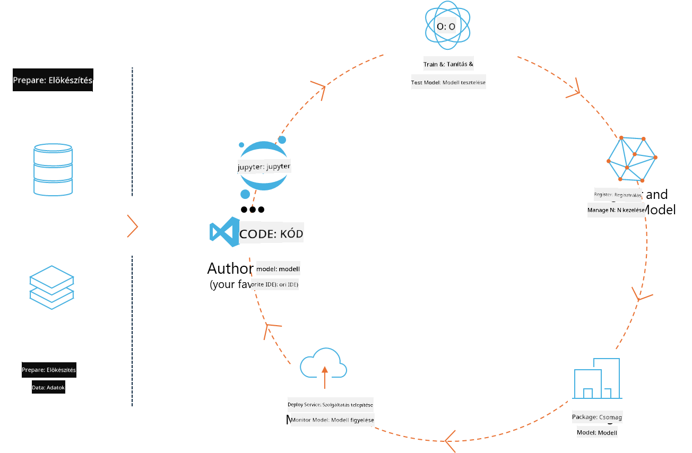
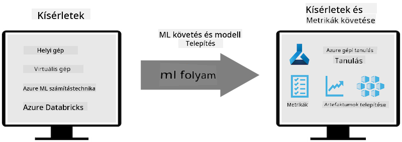
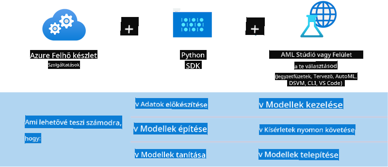

<!--
CO_OP_TRANSLATOR_METADATA:
{
  "original_hash": "f61c383bbf0c3dac97e43f833c258731",
  "translation_date": "2025-05-09T18:40:00+00:00",
  "source_file": "md/02.Application/01.TextAndChat/Phi3/E2E_Phi-3-MLflow.md",
  "language_code": "hu"
}
-->
# MLflow

Az [MLflow](https://mlflow.org/) egy nyílt forráskódú platform, amely az egész gépi tanulási életciklus kezelésére szolgál.



Az MLFlow az ML életciklus kezelésére szolgál, beleértve a kísérletezést, reprodukálhatóságot, telepítést és egy központi modellregisztert. Jelenleg négy fő komponensből áll:

- **MLflow Tracking:** Kísérletek, kód, adatkonfiguráció és eredmények rögzítése és lekérdezése.
- **MLflow Projects:** Adattudományi kód csomagolása olyan formátumban, amely lehetővé teszi a futtatások reprodukálását bármely platformon.
- **Mlflow Models:** Gépi tanulási modellek telepítése különféle szolgáltatási környezetekben.
- **Model Registry:** Modellek tárolása, annotálása és kezelése központi tárolóban.

Tartalmaz eszközöket a kísérletek nyomon követésére, a kód reprodukálható futtatásokba csomagolására, valamint a modellek megosztására és telepítésére. Az MLFlow integrálva van a Databricks platformba, és támogat számos ML könyvtárat, így könyvtárfüggetlen. Bármilyen gépi tanulási könyvtárral és programozási nyelven használható, mivel REST API-t és CLI-t is biztosít a könnyebb használathoz.



Az MLFlow főbb jellemzői:

- **Kísérletkövetés:** Paraméterek és eredmények rögzítése és összehasonlítása.
- **Modellkezelés:** Modellek telepítése különböző szolgáltatási és inferencia platformokra.
- **Model Registry:** Az MLflow modellek életciklusának közös kezelése, verziózás és annotációk.
- **Projektek:** ML kód csomagolása megosztásra vagy éles használatra.

Az MLFlow támogatja az MLOps ciklust is, amely magában foglalja az adatelőkészítést, modellek regisztrálását és kezelését, modellek csomagolását futtatáshoz, szolgáltatások telepítését és modellek monitorozását. Célja, hogy egyszerűsítse a prototípusról az éles munkafolyamatra való áttérést, különösen felhő- és élő környezetekben.

## E2E forgatókönyv – Wrapper készítése és Phi-3 használata MLFlow modellként

Ebben az E2E példában két különböző megközelítést mutatunk be egy wrapper építésére a Phi-3 kis nyelvi modell (SLM) köré, majd annak MLFlow modellként való futtatására helyileg vagy a felhőben, például az Azure Machine Learning munkaterületen.



| Projekt | Leírás | Hely |
| ------------ | ----------- | -------- |
| Transformer Pipeline | A Transformer Pipeline a legegyszerűbb módja egy wrapper építésének, ha HuggingFace modellt szeretnél használni az MLFlow kísérleti transformers változatával. | [**TransformerPipeline.ipynb**](../../../../../../code/06.E2E/E2E_Phi-3-MLflow_TransformerPipeline.ipynb) |
| Egyedi Python Wrapper | A cikk írásakor a transformer pipeline nem támogatta az MLFlow wrapper generálását HuggingFace modellekhez ONNX formátumban, még az kísérleti optimum Python csomaggal sem. Ilyen esetekben egyedi Python wrappert építhetsz az MLFlow modellhez. | [**CustomPythonWrapper.ipynb**](../../../../../../code/06.E2E/E2E_Phi-3-MLflow_CustomPythonWrapper.ipynb) |

## Projekt: Transformer Pipeline

1. Szükséged lesz az MLFlow és HuggingFace releváns Python csomagjaira:

    ``` Python
    import mlflow
    import transformers
    ```

2. Ezután inicializálnod kell egy transformer pipeline-t, megadva a cél Phi-3 modellt a HuggingFace regiszterből. Ahogy a _Phi-3-mini-4k-instruct_ modellkártyáján látható, a feladata „Szöveg generálás” típusú:

    ``` Python
    pipeline = transformers.pipeline(
        task = "text-generation",
        model = "microsoft/Phi-3-mini-4k-instruct"
    )
    ```

3. Most elmentheted a Phi-3 modell transformer pipeline-ját MLFlow formátumba, megadva további részleteket, például a célmappa útvonalát, specifikus modellkonfigurációs beállításokat és az inferencia API típusát:

    ``` Python
    model_info = mlflow.transformers.log_model(
        transformers_model = pipeline,
        artifact_path = "phi3-mlflow-model",
        model_config = model_config,
        task = "llm/v1/chat"
    )
    ```

## Projekt: Egyedi Python Wrapper

1. Itt a Microsoft [ONNX Runtime generate() API](https://github.com/microsoft/onnxruntime-genai) használható az ONNX modell inferenciájához és tokenek kódolásához / dekódolásához. A cél számítási erőforráshoz az _onnxruntime_genai_ csomagot kell választani, az alábbi példa CPU-ra céloz:

    ``` Python
    import mlflow
    from mlflow.models import infer_signature
    import onnxruntime_genai as og
    ```

1. Egyedi osztályunk két metódust valósít meg: _load_context()_ az **ONNX modell**, a Phi-3 Mini 4K Instruct **generátor paraméterei** és a **tokenizer** inicializálására; valamint _predict()_ a megadott prompt alapján kimeneti tokenek generálására:

    ``` Python
    class Phi3Model(mlflow.pyfunc.PythonModel):
        def load_context(self, context):
            # Retrieving model from the artifacts
            model_path = context.artifacts["phi3-mini-onnx"]
            model_options = {
                 "max_length": 300,
                 "temperature": 0.2,         
            }
        
            # Defining the model
            self.phi3_model = og.Model(model_path)
            self.params = og.GeneratorParams(self.phi3_model)
            self.params.set_search_options(**model_options)
            
            # Defining the tokenizer
            self.tokenizer = og.Tokenizer(self.phi3_model)
    
        def predict(self, context, model_input):
            # Retrieving prompt from the input
            prompt = model_input["prompt"][0]
            self.params.input_ids = self.tokenizer.encode(prompt)
    
            # Generating the model's response
            response = self.phi3_model.generate(self.params)
    
            return self.tokenizer.decode(response[0][len(self.params.input_ids):])
    ```

1. Most az _mlflow.pyfunc.log_model()_ függvényt használhatod egy egyedi Python wrapper generálására (pickle formátumban) a Phi-3 modellhez, az eredeti ONNX modellel és a szükséges függőségekkel együtt:

    ``` Python
    model_info = mlflow.pyfunc.log_model(
        artifact_path = artifact_path,
        python_model = Phi3Model(),
        artifacts = {
            "phi3-mini-onnx": "cpu_and_mobile/cpu-int4-rtn-block-32-acc-level-4",
        },
        input_example = input_example,
        signature = infer_signature(input_example, ["Run"]),
        extra_pip_requirements = ["torch", "onnxruntime_genai", "numpy"],
    )
    ```

## A generált MLFlow modellek aláírásai

1. A fent említett Transformer Pipeline projekt 3. lépésében az MLFlow modell feladatát „_llm/v1/chat_” értékre állítottuk. Ez az utasítás egy olyan modell API wrappert generál, amely kompatibilis az OpenAI Chat API-val, az alábbiak szerint:

    ``` Python
    {inputs: 
      ['messages': Array({content: string (required), name: string (optional), role: string (required)}) (required), 'temperature': double (optional), 'max_tokens': long (optional), 'stop': Array(string) (optional), 'n': long (optional), 'stream': boolean (optional)],
    outputs: 
      ['id': string (required), 'object': string (required), 'created': long (required), 'model': string (required), 'choices': Array({finish_reason: string (required), index: long (required), message: {content: string (required), name: string (optional), role: string (required)} (required)}) (required), 'usage': {completion_tokens: long (required), prompt_tokens: long (required), total_tokens: long (required)} (required)],
    params: 
      None}
    ```

1. Ennek eredményeként a promptodat a következő formátumban küldheted be:

    ``` Python
    messages = [{"role": "user", "content": "What is the capital of Spain?"}]
    ```

1. Ezután használhatod az OpenAI API-kompatibilis utófeldolgozást, pl. _response[0][‘choices’][0][‘message’][‘content’]_, hogy az eredményt szépen formázott szöveggé alakítsd:

    ``` JSON
    Question: What is the capital of Spain?
    
    Answer: The capital of Spain is Madrid. It is the largest city in Spain and serves as the political, economic, and cultural center of the country. Madrid is located in the center of the Iberian Peninsula and is known for its rich history, art, and architecture, including the Royal Palace, the Prado Museum, and the Plaza Mayor.
    
    Usage: {'prompt_tokens': 11, 'completion_tokens': 73, 'total_tokens': 84}
    ```

1. A fent említett Egyedi Python Wrapper projekt 3. lépésében az MLFlow csomag generálja a modell aláírását egy adott bemeneti példa alapján. Az MLFlow wrapperünk aláírása így fog kinézni:

    ``` Python
    {inputs: 
      ['prompt': string (required)],
    outputs: 
      [string (required)],
    params: 
      None}
    ```

1. Ezért a promptnak tartalmaznia kell egy "prompt" kulcsot tartalmazó szótárat, hasonlóan ehhez:

    ``` Python
    {"prompt": "<|system|>You are a stand-up comedian.<|end|><|user|>Tell me a joke about atom<|end|><|assistant|>",}
    ```

1. A modell kimenete ezután sztring formátumban érkezik:

    ``` JSON
    Alright, here's a little atom-related joke for you!
    
    Why don't electrons ever play hide and seek with protons?
    
    Because good luck finding them when they're always "sharing" their electrons!
    
    Remember, this is all in good fun, and we're just having a little atomic-level humor!
    ```

**Jogi nyilatkozat**:  
Ezt a dokumentumot az AI fordító szolgáltatás, a [Co-op Translator](https://github.com/Azure/co-op-translator) segítségével fordítottuk le. Bár igyekszünk a pontosságra, kérjük, vegye figyelembe, hogy az automatikus fordítások hibákat vagy pontatlanságokat tartalmazhatnak. Az eredeti dokumentum anyanyelvén tekintendő hiteles forrásnak. Fontos információk esetén szakmai emberi fordítást javaslunk. Nem vállalunk felelősséget a fordítás használatából eredő félreértésekért vagy téves értelmezésekért.