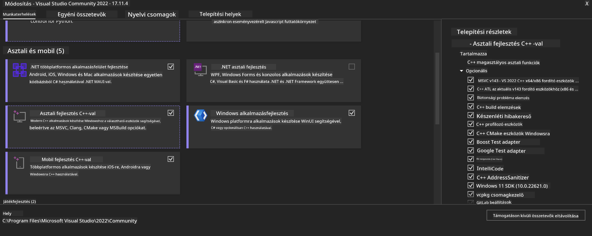
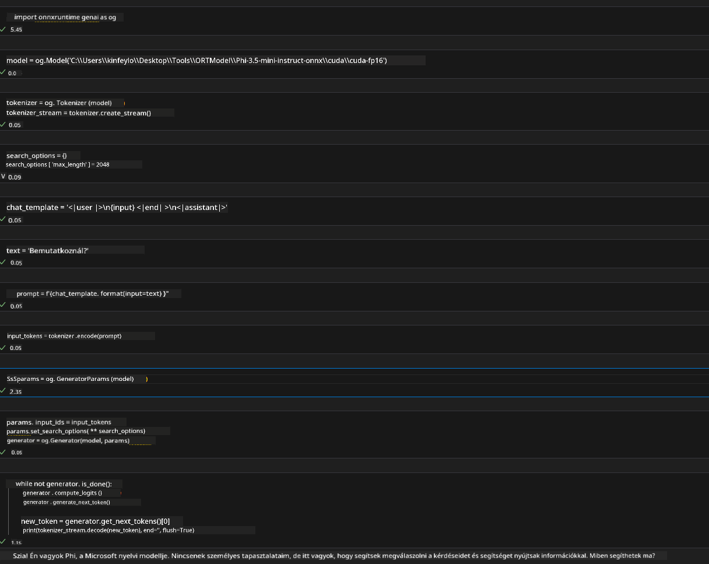

<!--
CO_OP_TRANSLATOR_METADATA:
{
  "original_hash": "b066fc29c1b2129df84e027cb75119ce",
  "translation_date": "2025-05-09T18:45:59+00:00",
  "source_file": "md/02.Application/01.TextAndChat/Phi3/ORTWindowGPUGuideline.md",
  "language_code": "hu"
}
-->
# **Útmutató az OnnxRuntime GenAI Windows GPU-hoz**

Ez az útmutató lépéseket tartalmaz az ONNX Runtime (ORT) GPU-val történő használatához Windows rendszeren. Segít kihasználni a GPU gyorsítást a modellekhez, javítva a teljesítményt és hatékonyságot.

A dokumentum a következőkről ad útmutatást:

- Környezet beállítása: Útmutató a szükséges függőségek, például CUDA, cuDNN és ONNX Runtime telepítéséhez.
- Konfiguráció: Hogyan állítsuk be a környezetet és az ONNX Runtime-ot, hogy hatékonyan használja a GPU erőforrásokat.
- Optimalizálási tippek: Tanácsok a GPU beállítások finomhangolásához a legjobb teljesítmény érdekében.

### **1. Python 3.10.x /3.11.8**

   ***Note*** Javasolt a [miniforge](https://github.com/conda-forge/miniforge/releases/latest/download/Miniforge3-Windows-x86_64.exe) használata Python környezetként

   ```bash

   conda create -n pydev python==3.11.8

   conda activate pydev

   ```

   ***Reminder*** Ha telepítettél bármilyen python ONNX könyvtárat, kérlek távolítsd el őket

### **2. CMake telepítése winget segítségével**

   ```bash

   winget install -e --id Kitware.CMake

   ```

### **3. Visual Studio 2022 telepítése - Desktop Development with C++**

   ***Note*** Ha nem szeretnéd fordítani, ezt a lépést kihagyhatod



### **4. NVIDIA Driver telepítése**

1. **NVIDIA GPU Driver**  [https://www.nvidia.com/en-us/drivers/](https://www.nvidia.com/en-us/drivers/)

2. **NVIDIA CUDA 12.4** [https://developer.nvidia.com/cuda-12-4-0-download-archive](https://developer.nvidia.com/cuda-12-4-0-download-archive)

3. **NVIDIA CUDNN 9.4**  [https://developer.nvidia.com/cudnn-downloads](https://developer.nvidia.com/cudnn-downloads)

***Reminder*** Kérlek, az alapértelmezett beállításokat használd a telepítés során

### **5. NVIDIA környezet beállítása**

Másold át az NVIDIA CUDNN 9.4 lib, bin, include fájlokat az NVIDIA CUDA 12.4 lib, bin, include mappákba

- másold a *'C:\Program Files\NVIDIA\CUDNN\v9.4\bin\12.6'* fájlokat a  *'C:\Program Files\NVIDIA GPU Computing Toolkit\CUDA\v12.4\bin'* mappába

- másold a *'C:\Program Files\NVIDIA\CUDNN\v9.4\include\12.6'* fájlokat a  *'C:\Program Files\NVIDIA GPU Computing Toolkit\CUDA\v12.4\include'* mappába

- másold a *'C:\Program Files\NVIDIA\CUDNN\v9.4\lib\12.6'* fájlokat a  *'C:\Program Files\NVIDIA GPU Computing Toolkit\CUDA\v12.4\lib\x64'* mappába

### **6. Phi-3.5-mini-instruct-onnx letöltése**

   ```bash

   winget install -e --id Git.Git

   winget install -e --id GitHub.GitLFS

   git lfs install

   git clone https://huggingface.co/microsoft/Phi-3.5-mini-instruct-onnx

   ```

### **7. InferencePhi35Instruct.ipynb futtatása**

   Nyisd meg a [Notebookot](../../../../../../code/09.UpdateSamples/Aug/ortgpu-phi35-instruct.ipynb) és futtasd



### **8. ORT GenAI GPU fordítása**

   ***Note*** 
   
   1. Először távolíts el minden onnx, onnxruntime és onnxruntime-genai csomagot

   ```bash

   pip list 
   
   ```

   Ezután távolítsd el az összes onnxruntime könyvtárat, például:

   ```bash

   pip uninstall onnxruntime

   pip uninstall onnxruntime-genai

   pip uninstall onnxruntume-genai-cuda
   
   ```

   2. Ellenőrizd a Visual Studio bővítmény támogatást

   Nézd meg a C:\Program Files\NVIDIA GPU Computing Toolkit\CUDA\v12.4\extras mappát, hogy megtalálható-e a C:\Program Files\NVIDIA GPU Computing Toolkit\CUDA\v12.4\extras\visual_studio_integration könyvtár. 

   Ha nincs meg, keresd meg más CUDA toolkit driver mappákban, majd másold át a visual_studio_integration mappát és tartalmát a C:\Program Files\NVIDIA GPU Computing Toolkit\CUDA\v12.4\extras\visual_studio_integration helyre.

   - Ha nem szeretnéd fordítani, ezt a lépést kihagyhatod

   ```bash

   git clone https://github.com/microsoft/onnxruntime-genai

   ```

   - Töltsd le a [https://github.com/microsoft/onnxruntime/releases/download/v1.19.2/onnxruntime-win-x64-gpu-1.19.2.zip](https://github.com/microsoft/onnxruntime/releases/download/v1.19.2/onnxruntime-win-x64-gpu-1.19.2.zip) fájlt

   - Csomagold ki az onnxruntime-win-x64-gpu-1.19.2.zip-et, nevezd át **ort**-ra, majd másold az ort mappát az onnxruntime-genai könyvtárba

   - Használd a Windows Terminalt, nyiss egy Developer Command Prompt for VS 2022 ablakot, és lépj be az onnxruntime-genai mappába


   - Fordítsd le a projektet a Python környezetedben

   ```bash

   cd onnxruntime-genai

   python build.py --use_cuda  --cuda_home "C:\Program Files\NVIDIA GPU Computing Toolkit\CUDA\v12.4" --config Release
 

   cd build/Windows/Release/Wheel

   pip install .whl

   ```

**Felelősség kizárása**:  
Ez a dokumentum az AI fordító szolgáltatás, a [Co-op Translator](https://github.com/Azure/co-op-translator) segítségével készült. Bár a pontosságra törekszünk, kérjük, vegye figyelembe, hogy az automatikus fordítások hibákat vagy pontatlanságokat tartalmazhatnak. Az eredeti dokumentum a saját nyelvén tekintendő hivatalos forrásnak. Kritikus információk esetén javasolt szakmai, emberi fordítást igénybe venni. Nem vállalunk felelősséget az ebből eredő félreértésekért vagy félreértelmezésekért.