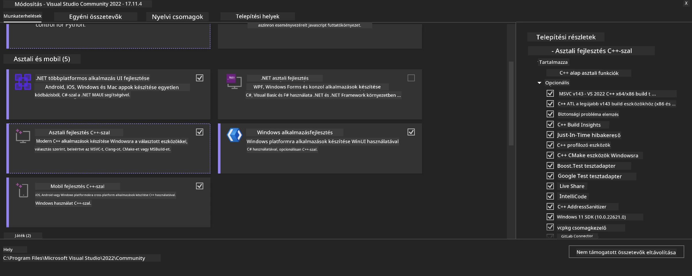
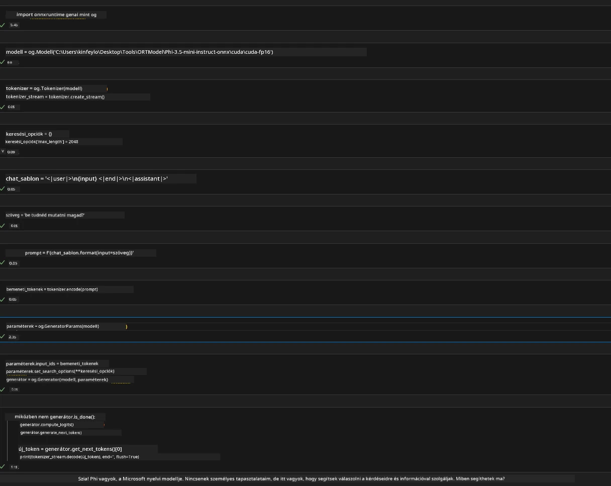
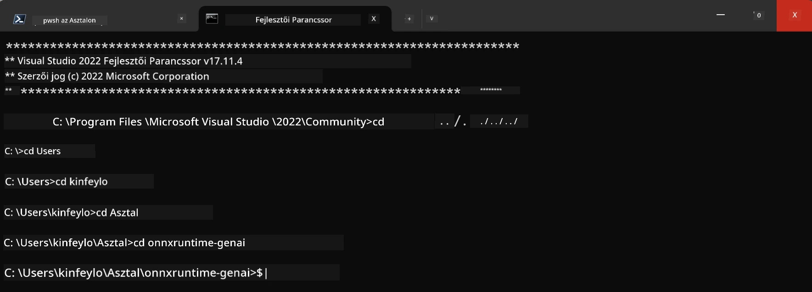

# **Útmutató az OnnxRuntime GenAI Windows GPU-hoz**

Ez az útmutató lépéseket tartalmaz az ONNX Runtime (ORT) GPU-kon Windows rendszeren történő beállításához és használatához. Azért készült, hogy segítsen a modellek GPU-gyorsításának kihasználásában, javítva ezzel a teljesítményt és a hatékonyságot.

A dokumentum útmutatást nyújt a következőkről:

- Környezet beállítása: Az olyan szükséges függőségek telepítésére vonatkozó utasítások, mint a CUDA, cuDNN és az ONNX Runtime.
- Konfiguráció: Hogyan konfiguráld a környezetet és az ONNX Runtime-ot a GPU erőforrások hatékony kihasználására.
- Optimalizálási tippek: Tanácsok arra, hogyan hangold finomra a GPU beállításaidat a lehető legjobb teljesítmény érdekében.

### **1. Python 3.10.x /3.11.8**

   ***Megjegyzés*** Javasolt a [miniforge](https://github.com/conda-forge/miniforge/releases/latest/download/Miniforge3-Windows-x86_64.exe) használata a Python környezetedhez

   ```bash

   conda create -n pydev python==3.11.8

   conda activate pydev

   ```

   ***Emlékeztető*** Ha telepítettél bármilyen Python ONNX könyvtárat, kérlek távolítsd el azokat

### **2. CMake telepítése winget-pel**


   ```bash

   winget install -e --id Kitware.CMake

   ```

### **3. Visual Studio 2022 telepítése - Asztali fejlesztés C++-val**

   ***Megjegyzés*** Ha nem szeretnéd fordítani, ezt a lépést kihagyhatod




### **4. NVIDIA driver telepítése**

1. **NVIDIA GPU Driver**  [https://www.nvidia.com/en-us/drivers/](https://www.nvidia.com/en-us/drivers/)

2. **NVIDIA CUDA 12.4** [https://developer.nvidia.com/cuda-12-4-0-download-archive](https://developer.nvidia.com/cuda-12-4-0-download-archive)

3. **NVIDIA CUDNN 9.4**  [https://developer.nvidia.com/cudnn-downloads](https://developer.nvidia.com/cudnn-downloads)

***Emlékeztető*** Kérlek az alapértelmezett beállításokat használd a telepítés során

### **5. NVIDIA környezet beállítása**

Másold az NVIDIA CUDNN 9.4 lib, bin, include fájlokat az NVIDIA CUDA 12.4 lib, bin, include könyvtárakba

- másold a *'C:\Program Files\NVIDIA\CUDNN\v9.4\bin\12.6'* fájlokat a *'C:\Program Files\NVIDIA GPU Computing Toolkit\CUDA\v12.4\bin'* könyvtárba

- másold a *'C:\Program Files\NVIDIA\CUDNN\v9.4\include\12.6'* fájlokat a *'C:\Program Files\NVIDIA GPU Computing Toolkit\CUDA\v12.4\include'* könyvtárba

- másold a *'C:\Program Files\NVIDIA\CUDNN\v9.4\lib\12.6'* fájlokat a *'C:\Program Files\NVIDIA GPU Computing Toolkit\CUDA\v12.4\lib\x64'* könyvtárba


### **6. Phi-3.5-mini-instruct-onnx letöltése**


   ```bash

   winget install -e --id Git.Git

   winget install -e --id GitHub.GitLFS

   git lfs install

   git clone https://huggingface.co/microsoft/Phi-3.5-mini-instruct-onnx

   ```

### **7. InferencePhi35Instruct.ipynb futtatása**

   Nyisd meg a [Notebook](../../../../code/09.UpdateSamples/Aug/ortgpu-phi35-instruct.ipynb) fájlt és futtasd le





### **8. ORT GenAI GPU fordítása**


   ***Megjegyzés*** 
   
   1. Kérlek először távolíts el minden onnx, onnxruntime és onnxruntime-genai csomagot

   
   ```bash

   pip list 
   
   ```

   Ezután távolíts el minden onnxruntime könyvtárat, azaz


   ```bash

   pip uninstall onnxruntime

   pip uninstall onnxruntime-genai

   pip uninstall onnxruntume-genai-cuda
   
   ```

   2. Ellenőrizd a Visual Studio kiterjesztések támogatását

   Ellenőrizd, hogy a C:\Program Files\NVIDIA GPU Computing Toolkit\CUDA\v12.4\extras mappában megtalálható-e a C:\Program Files\NVIDIA GPU Computing Toolkit\CUDA\v12.4\extras\visual_studio_integration.
   
   Ha nincs meg, keresd meg más CUDA toolkit driver mappákban, majd másold át a visual_studio_integration mappát és tartalmát a C:\Program Files\NVIDIA GPU Computing Toolkit\CUDA\v12.4\extras\visual_studio_integration helyre


   - Ha nem szeretnél fordítani, ezt a lépést kihagyhatod


   ```bash

   git clone https://github.com/microsoft/onnxruntime-genai

   ```

   - Töltsd le a [https://github.com/microsoft/onnxruntime/releases/download/v1.19.2/onnxruntime-win-x64-gpu-1.19.2.zip](https://github.com/microsoft/onnxruntime/releases/download/v1.19.2/onnxruntime-win-x64-gpu-1.19.2.zip) fájlt

   - Csomagold ki az onnxruntime-win-x64-gpu-1.19.2.zip-et, nevezd át **ort**-ra, és másold az ort mappát az onnxruntime-genai könyvtárba

   - Windows Terminal segítségével menj át a VS 2022 fejlesztői parancssorába, majd nyisd meg az onnxruntime-genai könyvtárat



   - Fordítsd le a projektet a Python környezeteddel

   
   ```bash

   cd onnxruntime-genai

   python build.py --use_cuda  --cuda_home "C:\Program Files\NVIDIA GPU Computing Toolkit\CUDA\v12.4" --config Release
 

   cd build/Windows/Release/Wheel

   pip install .whl

   ```

---

<!-- CO-OP TRANSLATOR DISCLAIMER START -->
**Jogi nyilatkozat**:
Ez a dokumentum az AI fordítási szolgáltatás, a [Co-op Translator](https://github.com/Azure/co-op-translator) segítségével készült. Bár az pontosságra törekszünk, kérjük, vegye figyelembe, hogy az automatikus fordítások hibákat vagy pontatlanságokat tartalmazhatnak. Az eredeti dokumentum az anyanyelvén tekintendő hiteles forrásnak. Fontos információk esetén professzionális emberi fordítást javasolunk. Nem vállalunk felelősséget semmilyen félreértésért vagy téves értelmezésért, amely ebből a fordításból ered.
<!-- CO-OP TRANSLATOR DISCLAIMER END -->