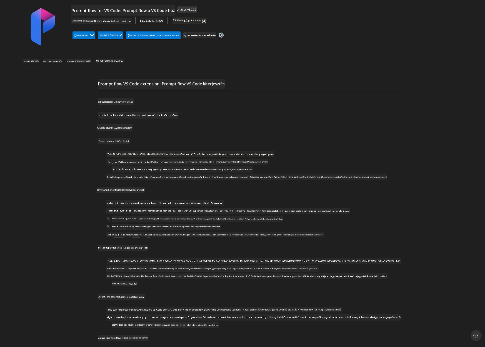
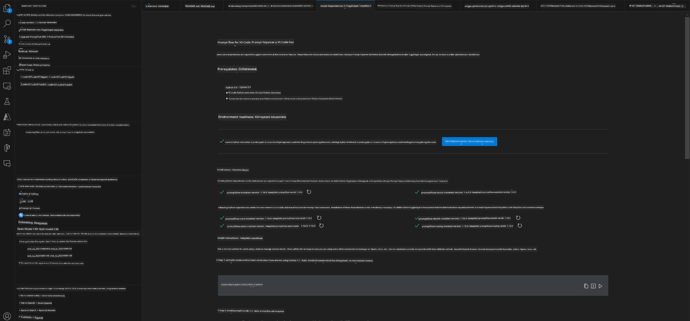
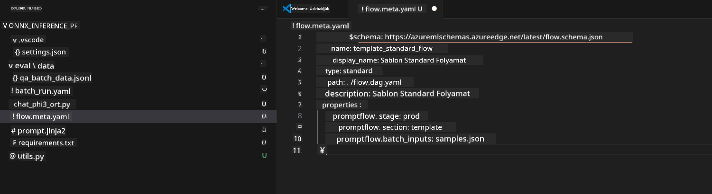
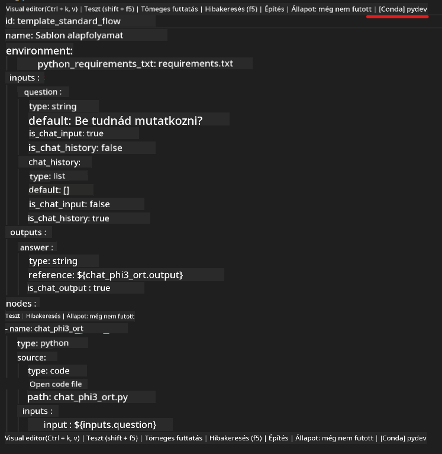
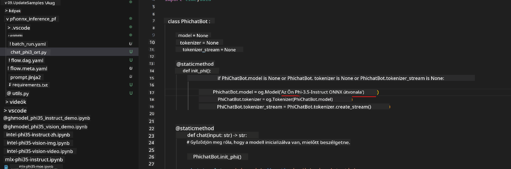
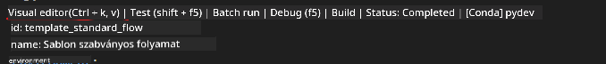
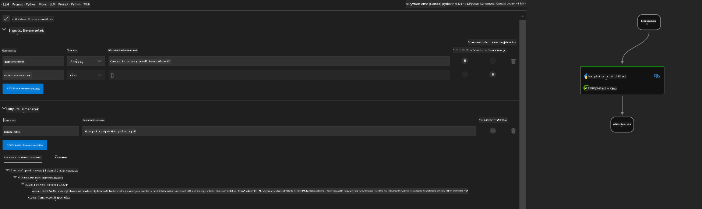

<!--
CO_OP_TRANSLATOR_METADATA:
{
  "original_hash": "92e7dac1e5af0dd7c94170fdaf6860fe",
  "translation_date": "2025-05-09T18:54:42+00:00",
  "source_file": "md/02.Application/01.TextAndChat/Phi3/UsingPromptFlowWithONNX.md",
  "language_code": "hu"
}
-->
# Windows GPU használata Prompt flow megoldás létrehozásához Phi-3.5-Instruct ONNX-szel

Az alábbi dokumentum egy példát mutat be arra, hogyan használjuk a PromptFlow-t ONNX (Open Neural Network Exchange) segítségével Phi-3 alapú AI alkalmazások fejlesztéséhez.

A PromptFlow egy fejlesztői eszközkészlet, amely az LLM-alapú (Nagy Nyelvi Modell) AI alkalmazások teljes fejlesztési ciklusát egyszerűsíti, az ötleteléstől és prototípus készítéstől kezdve a tesztelésen és értékelésen át a végső élesítésig.

A PromptFlow és az ONNX integrálásával a fejlesztők:

- Optimalizálhatják a modell teljesítményét: kihasználhatják az ONNX hatékony modell-inferenciáját és telepítését.
- Egyszerűsíthetik a fejlesztést: a PromptFlow segítségével kezelhetik a munkafolyamatokat és automatizálhatják az ismétlődő feladatokat.
- Javíthatják az együttműködést: egységes fejlesztői környezet biztosításával könnyebbé válik a csapatmunka.

**A Prompt flow** egy fejlesztői eszközkészlet, amely az LLM-alapú AI alkalmazások teljes fejlesztési ciklusát egyszerűsíti az ötleteléstől, prototípus készítésen, tesztelésen, értékelésen át egészen az éles telepítésig és monitorozásig. Megkönnyíti a prompt tervezést, és lehetővé teszi, hogy éles minőségű LLM alkalmazásokat építsünk.

A Prompt flow képes csatlakozni az OpenAI-hoz, az Azure OpenAI Service-hez, valamint testreszabható modellekhez (Huggingface, helyi LLM/SLM). Célunk, hogy a Phi-3.5 kvantált ONNX modelljét helyi alkalmazásokba telepítsük. A Prompt flow segít jobb üzleti tervezésben és helyi megoldások elkészítésében Phi-3.5 alapokon. Ebben a példában az ONNX Runtime GenAI könyvtárat kombináljuk a Prompt flow megoldás elkészítéséhez Windows GPU környezetben.

## **Telepítés**

### **ONNX Runtime GenAI Windows GPU-hoz**

Olvasd el ezt az útmutatót az ONNX Runtime GenAI Windows GPU-ra történő beállításához [ide kattintva](./ORTWindowGPUGuideline.md)

### **Prompt flow beállítása VSCode-ban**

1. Telepítsd a Prompt flow VS Code kiterjesztést



2. A Prompt flow VS Code kiterjesztés telepítése után kattints a kiterjesztésre, majd válaszd az **Installation dependencies** opciót, és kövesd az útmutatót a Prompt flow SDK telepítéséhez a környezetedben



3. Töltsd le a [példakódot](../../../../../../code/09.UpdateSamples/Aug/pf/onnx_inference_pf) és nyisd meg VS Code-ban



4. Nyisd meg a **flow.dag.yaml** fájlt, és válaszd ki a Python környezetedet



   Nyisd meg a **chat_phi3_ort.py** fájlt, és módosítsd a Phi-3.5-instruct ONNX modell helyét



5. Futtasd a prompt flow-t teszteléshez

Nyisd meg a **flow.dag.yaml** fájlt, és kattints a vizuális szerkesztőre



Ezután kattints rá, és futtasd a tesztelést



1. Terminálban is futtathatsz batch-et, hogy több eredményt ellenőrizz

```bash

pf run create --file batch_run.yaml --stream --name 'Your eval qa name'    

```

Az eredményeket az alapértelmezett böngésződben tekintheted meg


**Jogi nyilatkozat**:  
Ez a dokumentum az AI fordító szolgáltatás, a [Co-op Translator](https://github.com/Azure/co-op-translator) segítségével készült. Bár a pontosságra törekszünk, kérjük, vegye figyelembe, hogy az automatikus fordítások hibákat vagy pontatlanságokat tartalmazhatnak. Az eredeti dokumentum a saját nyelvén tekintendő hiteles forrásnak. Fontos információk esetén professzionális emberi fordítást javaslunk. Nem vállalunk felelősséget a fordítás használatából eredő félreértésekért vagy téves értelmezésekért.