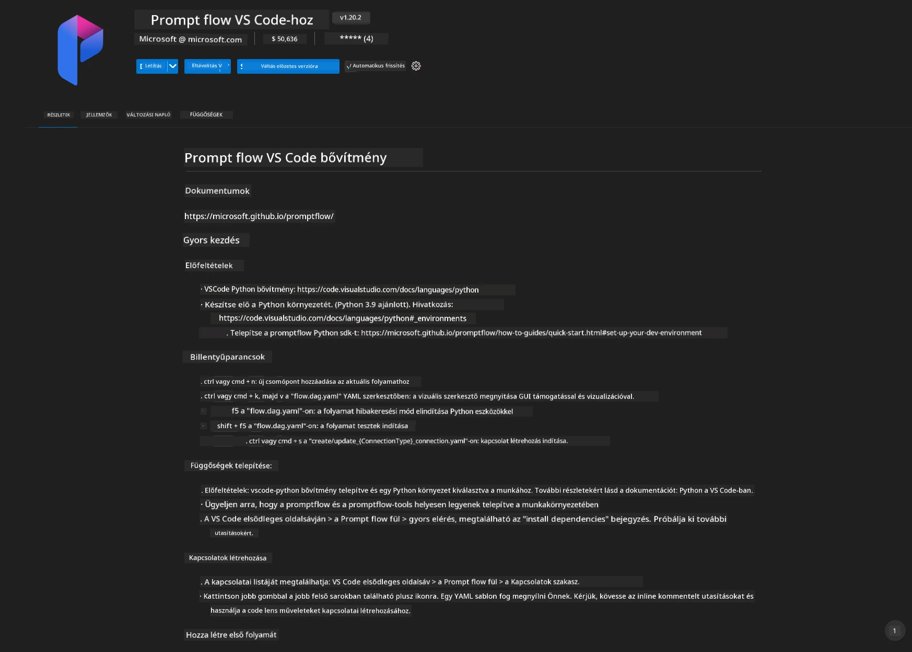
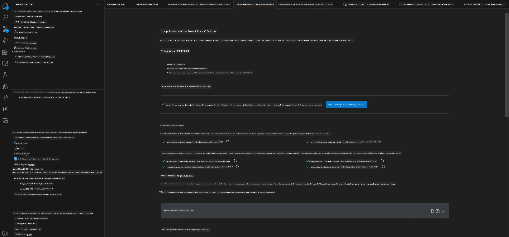
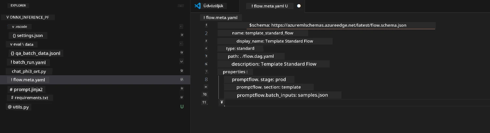
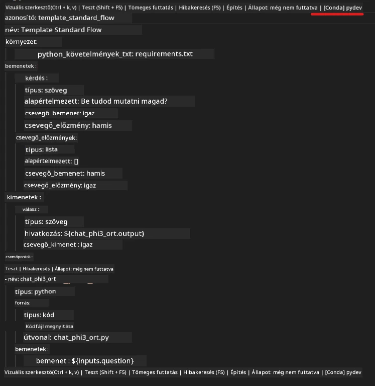
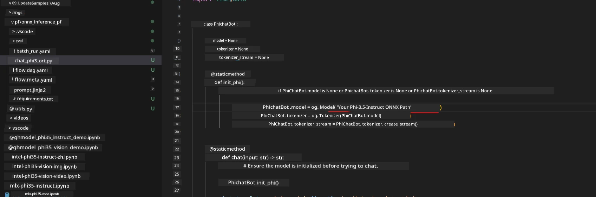
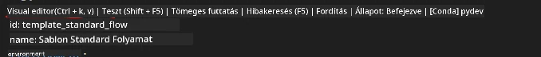
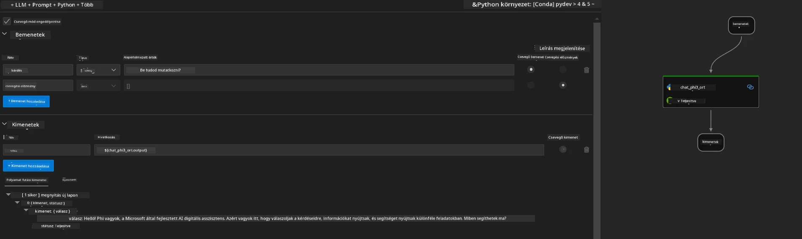
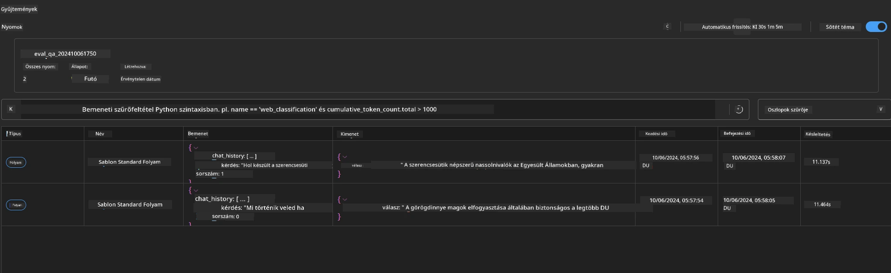

# Windows GPU használata Prompt flow megoldás létrehozásához Phi-3.5-Instruct ONNX-szel  

A következő dokumentum példát mutat arra, hogyan lehet a PromptFlow-t ONNX (Open Neural Network Exchange) segítségével használni Phi-3 modellek alapján fejlesztett AI alkalmazások fejlesztéséhez.

A PromptFlow egy fejlesztőeszköz suite, amely az LLM-alapú (Nagy Nyelvi Modell) AI alkalmazások teljes fejlesztési ciklusát egyszerűsíti, az ötleteléstől és prototípus-készítéstől kezdve a tesztelésen és értékelésen át.

A PromptFlow ONNX-szel való integrálásával a fejlesztők képesek:

- A modell teljesítményének optimalizálása: Hatékony modelligénybevétel és üzembe helyezés ONNX segítségével.
- Fejlesztés egyszerűsítése: Használd a PromptFlow-t a munkafolyamat kezelésére és ismétlődő feladatok automatizálására.
- Együttműködés javítása: Egységes fejlesztési környezet biztosításával támogatja a csapattagok közti jobb együttműködést.

**Prompt flow** egy fejlesztőeszköz suite, amely az LLM-alapú AI alkalmazások teljes fejlesztési ciklusát egyszerűsíti, az ötleteléstől, prototípus-készítéstől, teszteléstől és értékeléstől a produkciós üzembe helyezésig és monitorozásig. Nagyon megkönnyíti a prompt tervezést, és lehetővé teszi LLM alkalmazások építését produkciós minőségben.

A Prompt flow kapcsolódhat OpenAI-hoz, Azure OpenAI Szolgáltatáshoz, és testreszabható modellekhez (Huggingface, helyi LLM/SLM). A terveink szerint a Phi-3.5 kvantált ONNX modelljét helyi alkalmazásokba szeretnénk telepíteni. A Prompt flow segíthet jobban tervezni az üzletet és teljes helyi megoldásokat létrehozni Phi-3.5 alapján. Ebben a példában az ONNX Runtime GenAI könyvtárat egyesítjük a Prompt flow megoldás befejezéséhez Windows GPU alapokon.

## **Telepítés**

### **ONNX Runtime GenAI Windows GPU-hoz**

Olvasd el ezt az iránymutatást az ONNX Runtime GenAI Windows GPU-ra való beállításához  [kattints ide](./ORTWindowGPUGuideline.md)

### **Prompt flow beállítása VSCode-ban**

1. Telepítsd a Prompt flow VS Code kiterjesztést



2. A Prompt flow VS Code kiterjesztés telepítése után kattints a kiterjesztésre, és válaszd az **Installation dependencies** pontot, majd kövesd az iránymutatást a Prompt flow SDK telepítéséhez a környezetedben



3. Töltsd le a [Mintakódot](../../../../../../code/09.UpdateSamples/Aug/pf/onnx_inference_pf) és nyisd meg VS Code-dal ezt a mintát



4. Nyisd meg a **flow.dag.yaml** fájlt, és válaszd ki a Python környezetedet



   Nyisd meg a **chat_phi3_ort.py** fájlt a Phi-3.5-instruct ONNX modell helyének megváltoztatásához



5. Futtasd a prompt flow-dat tesztelésre

Nyisd meg a **flow.dag.yaml**-t, és kattints a vizuális szerkesztőre



Ezt követően kattints rá és futtasd a teszthez



1. Parancssorban is futtathatsz batch-et a további eredmények ellenőrzéséhez


```bash

pf run create --file batch_run.yaml --stream --name 'Your eval qa name'    

```

Az eredményeket megtekintheted az alapértelmezett böngésződben




---

<!-- CO-OP TRANSLATOR DISCLAIMER START -->
**Jogi nyilatkozat**:
Ez a dokumentum az AI fordítási szolgáltatás, a [Co-op Translator](https://github.com/Azure/co-op-translator) segítségével készült. Bár az pontosságra törekszünk, kérjük, vegye figyelembe, hogy az automatikus fordítások hibákat vagy pontatlanságokat tartalmazhatnak. Az eredeti dokumentum az anyanyelvén tekintendő hiteles forrásnak. Fontos információk esetén professzionális emberi fordítást javasolunk. Nem vállalunk felelősséget semmilyen félreértésért vagy téves értelmezésért, amely ebből a fordításból ered.
<!-- CO-OP TRANSLATOR DISCLAIMER END -->